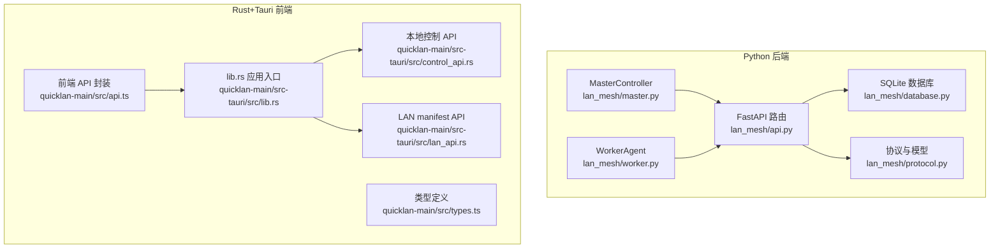
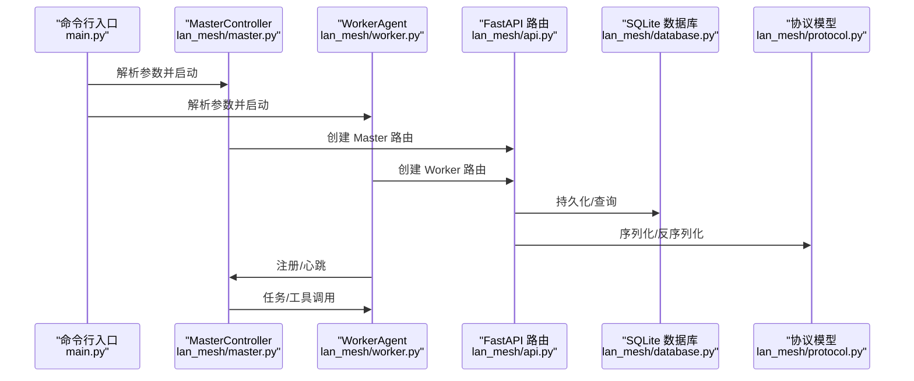
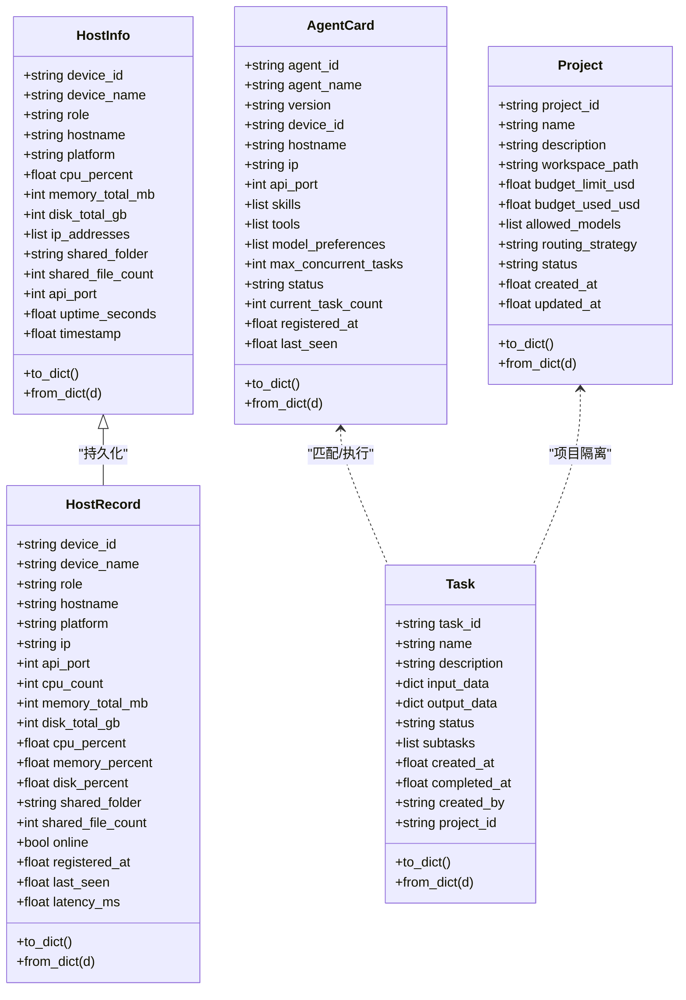
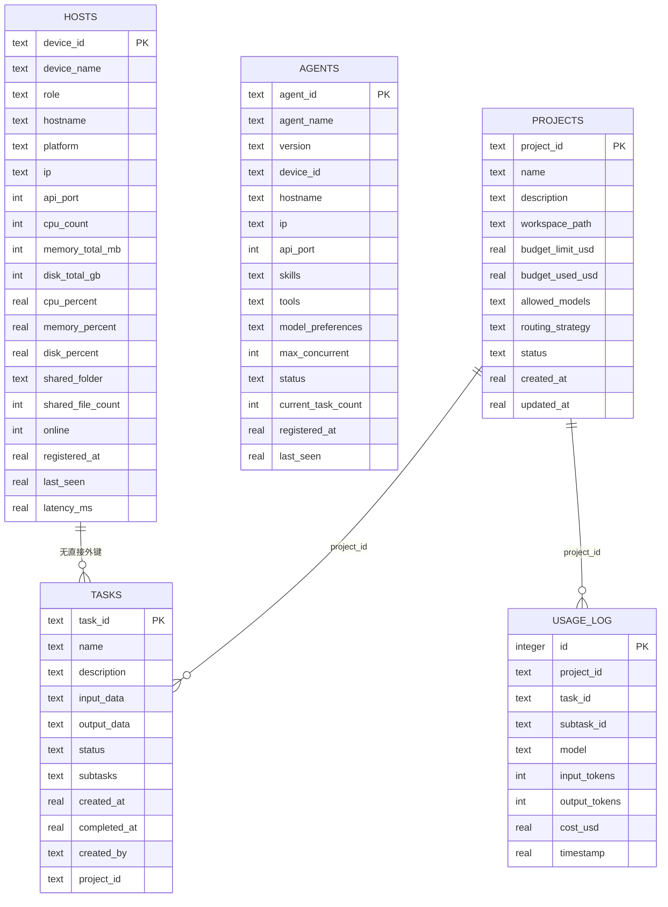
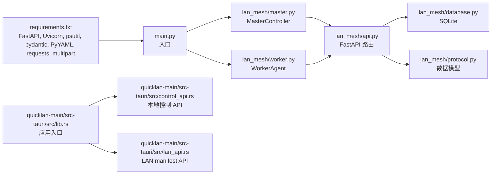

# API 参考手册

<cite>
**本文档引用的文件**
- [main.py](file://main.py)
- [config.yaml](file://config.yaml)
- [lan_mesh/api.py](file://lan_mesh/api.py)
- [lan_mesh/protocol.py](file://lan_mesh/protocol.py)
- [lan_mesh/database.py](file://lan_mesh/database.py)
- [lan_mesh/master.py](file://lan_mesh/master.py)
- [lan_mesh/worker.py](file://lan_mesh/worker.py)
- [quicklan-main/src/api.ts](file://quicklan-main/src/api.ts)
- [quicklan-main/src/types.ts](file://quicklan-main/src/types.ts)
- [quicklan-main/src-tauri/src/lib.rs](file://quicklan-main/src-tauri/src/lib.rs)
- [quicklan-main/src-tauri/src/control_api.rs](file://quicklan-main/src-tauri/src/control_api.rs)
- [quicklan-main/src-tauri/src/lan_api.rs](file://quicklan-main/src-tauri/src/lan_api.rs)
- [quicklan-main/package.json](file://quicklan-main/package.json)
- [requirements.txt](file://requirements.txt)
</cite>

## 目录
1. [简介](#简介)
2. [项目结构](#项目结构)
3. [核心组件](#核心组件)
4. [架构总览](#架构总览)
5. [详细组件分析](#详细组件分析)
6. [依赖关系分析](#依赖关系分析)
7. [性能考虑](#性能考虑)
8. [故障排除指南](#故障排除指南)
9. [结论](#结论)
10. [附录](#附录)

## 简介
本手册面向 Work Station 项目（LAN Mesh）的 API 参考，涵盖：
- RESTful API：端点清单、请求/响应格式、错误码定义
- WebSocket API：消息格式与事件类型
- SDK 使用示例与第三方集成指南
- API 版本控制与兼容性策略
- 性能基准与使用限制
- 测试工具与模拟服务建议

## 项目结构
Work Station 项目由两部分组成：
- Python 后端（LAN Mesh 核心）：负责设备发现、注册、心跳、任务编排、项目管理、MCP 工具网关等
- Rust+Tauri 前端（QuickLAN）：提供桌面应用、本地控制 API、LAN manifest API、文件传输等

**图表来源**
- [lan_mesh/master.py:1-200](file://lan_mesh/master.py#L1-L200)
- [lan_mesh/worker.py:1-200](file://lan_mesh/worker.py#L1-L200)
- [lan_mesh/api.py:1-539](file://lan_mesh/api.py#L1-L539)
- [lan_mesh/database.py:1-611](file://lan_mesh/database.py#L1-L611)
- [lan_mesh/protocol.py:1-356](file://lan_mesh/protocol.py#L1-L356)
- [quicklan-main/src-tauri/src/lib.rs:138-250](file://quicklan-main/src-tauri/src/lib.rs#L138-L250)
- [quicklan-main/src-tauri/src/control_api.rs:22-147](file://quicklan-main/src-tauri/src/control_api.rs#L22-L147)
- [quicklan-main/src-tauri/src/lan_api.rs:19-177](file://quicklan-main/src-tauri/src/lan_api.rs#L19-L177)
- [quicklan-main/src/api.ts:1-130](file://quicklan-main/src/api.ts#L1-L130)
- [quicklan-main/src/types.ts:1-128](file://quicklan-main/src/types.ts#L1-L128)

**章节来源**
- [main.py:1-90](file://main.py#L1-L90)
- [config.yaml:1-22](file://config.yaml#L1-L22)
- [requirements.txt:1-8](file://requirements.txt#L1-L8)

## 核心组件
- MasterController：中心控制节点，负责 Web UI、REST API、WebSocket 推送、设备发现、任务编排、项目管理、MCP 网关
- WorkerAgent：工作节点，负责注册、心跳、共享文件 API、Agent 能力声明
- FastAPI 路由：统一暴露 REST API 与 WebSocket
- SQLite 数据库：持久化主机、Agent、任务、项目、用量记录
- 协议与模型：定义 DiscoveryPacket、HostInfo、HostRecord、AgentCard、Task、Project 等数据结构
- Rust+Tauri 前端：提供本地控制 API（127.0.0.1:45456）、LAN manifest API（TCP），以及前端 JS SDK

**章节来源**
- [lan_mesh/master.py:67-200](file://lan_mesh/master.py#L67-L200)
- [lan_mesh/worker.py:62-200](file://lan_mesh/worker.py#L62-L200)
- [lan_mesh/api.py:37-539](file://lan_mesh/api.py#L37-L539)
- [lan_mesh/database.py:16-144](file://lan_mesh/database.py#L16-L144)
- [lan_mesh/protocol.py:29-356](file://lan_mesh/protocol.py#L29-L356)
- [quicklan-main/src-tauri/src/lib.rs:138-250](file://quicklan-main/src-tauri/src/lib.rs#L138-L250)

## 架构总览

**图表来源**
- [main.py:25-90](file://main.py#L25-L90)
- [lan_mesh/master.py:187-200](file://lan_mesh/master.py#L187-L200)
- [lan_mesh/worker.py:126-195](file://lan_mesh/worker.py#L126-L195)
- [lan_mesh/api.py:112-526](file://lan_mesh/api.py#L112-L526)
- [lan_mesh/database.py:16-144](file://lan_mesh/database.py#L16-L144)
- [lan_mesh/protocol.py:29-356](file://lan_mesh/protocol.py#L29-L356)

## 详细组件分析

### RESTful API 规范

#### 端点总览
- Worker API
  - GET /info：返回本机完整配置
  - POST /tasks/execute：执行子任务（Agent 运行时）
  - GET /shared：列出共享文件
  - GET /shared/{path}：下载共享文件
  - POST /shared：上传文件到共享目录
- Master API
  - POST /api/register：Worker 注册（接收完整 HostInfo）
  - POST /api/heartbeat：Worker 心跳（实时资源使用率）
  - GET /api/hosts：所有主机列表
  - GET /api/hosts/{device_id}：单台主机详情
  - GET /api/network：本机网络状态
  - POST /api/probe/{ip}：主动探测指定 IP
  - GET /api/discovery：UDP 发现到的设备列表
  - GET /api/health：健康检查
  - GET /api/master-info：返回 Master 自身的主机信息
  - GET /api/shared：列出 Master 共享文件夹内容
  - POST /api/agents/register：注册 Agent Card
  - GET /api/agents：列出所有 Agent
  - GET /api/agents/{agent_id}：查询单个 Agent
  - POST /api/tasks：提交新任务
  - GET /api/tasks：列出任务
  - GET /api/tasks/{task_id}：查询单个任务
  - POST /api/projects：创建项目
  - GET /api/projects：列出项目
  - GET /api/projects/{project_id}：查询项目详情（含预算状态）
  - PUT /api/projects/{project_id}：更新项目
  - DELETE /api/projects/{project_id}：归档项目
  - GET /api/projects/{project_id}/usage：查询项目消费记录
  - GET /tools/list：列出 MCP 工具（聚合）
  - POST /tools/call：调用工具
  - GET /tools/servers：列出 MCP Server
  - POST /tools/servers：动态注册 MCP Server
  - DELETE /tools/servers/{name}：注销 MCP Server
- WebSocket
  - WS /ws：实时推送主机状态变更

**章节来源**
- [lan_mesh/api.py:37-539](file://lan_mesh/api.py#L37-L539)

#### 错误码定义
- 400：请求参数缺失或无效（如 /tools/call 缺少 tool_name）
- 402：项目预算已用完或暂停（提交任务时）
- 403：文件操作权限不足（下载/上传）
- 404：设备/任务/Agent 不存在
- 503：服务未初始化（如 Agent 运行时、编排器、项目管理器、MCP 网关）

**章节来源**
- [lan_mesh/api.py:54-96](file://lan_mesh/api.py#L54-L96)
- [lan_mesh/api.py:116-168](file://lan_mesh/api.py#L116-L168)
- [lan_mesh/api.py:308-326](file://lan_mesh/api.py#L308-L326)
- [lan_mesh/api.py:427-498](file://lan_mesh/api.py#L427-L498)

#### 请求与响应示例（路径引用）
- 注册 Worker
  - 请求：POST /api/register
  - 请求体：HostInfo 完整对象
  - 响应：{"ok": true, "device_id": "..."}
  - 参考：[lan_mesh/api.py:116-146](file://lan_mesh/api.py#L116-L146)
- 心跳
  - 请求：POST /api/heartbeat
  - 请求体：{"device_id": "...", "cpu_percent": 0.0, "memory_percent": 0.0, "disk_percent": 0.0, "shared_file_count": 0}
  - 响应：{"ok": true}
  - 参考：[lan_mesh/api.py:148-168](file://lan_mesh/api.py#L148-L168)
- 列出主机
  - 请求：GET /api/hosts
  - 响应：{"hosts": [...], "total": 0, "online": 0}
  - 参考：[lan_mesh/api.py:170-204](file://lan_mesh/api.py#L170-L204)
- 获取单台主机详情
  - 请求：GET /api/hosts/{device_id}
  - 响应：HostRecord 或 UDP 发现设备字典
  - 参考：[lan_mesh/api.py:206-215](file://lan_mesh/api.py#L206-L215)
- 获取网络状态
  - 请求：GET /api/network
  - 响应：{"udp_port": 45454, "api_port": 45470, "local_ips": [...], "broadcast_targets": [...]}
  - 参考：[lan_mesh/api.py:217-226](file://lan_mesh/api.py#L217-L226)
- 主动探测 IP
  - 请求：POST /api/probe/{ip}
  - 响应：{"ok": true, "message": "..."}
  - 参考：[lan_mesh/api.py:236-240](file://lan_mesh/api.py#L236-L240)
- 健康检查
  - 请求：GET /api/health
  - 响应：{"status": "ok", "role": "master", "uptime": 0.0, "device_id": "..."}
  - 参考：[lan_mesh/api.py:242-250](file://lan_mesh/api.py#L242-L250)
- Agent 注册
  - 请求：POST /api/agents/register
  - 请求体：AgentCard 完整对象
  - 响应：{"ok": true, "agent_id": "..."}
  - 参考：[lan_mesh/api.py:268-279](file://lan_mesh/api.py#L268-L279)
- 列出 Agent
  - 请求：GET /api/agents
  - 响应：{"agents": [...], "total": 0, "idle": 0, "busy": 0}
  - 参考：[lan_mesh/api.py:281-290](file://lan_mesh/api.py#L281-L290)
- 提交任务
  - 请求：POST /api/tasks
  - 请求体：{"name": "...", "description": "...", "input_data": {}, "created_by": "...", "project_id": "..."}
  - 响应：Task 对象
  - 参考：[lan_mesh/api.py:302-326](file://lan_mesh/api.py#L302-L326)
- 列出任务
  - 请求：GET /api/tasks?status=&limit=
  - 响应：{"tasks": [...], "total": 0}
  - 参考：[lan_mesh/api.py:328-335](file://lan_mesh/api.py#L328-L335)
- 查询单个任务
  - 请求：GET /api/tasks/{task_id}
  - 响应：Task 对象
  - 参考：[lan_mesh/api.py:337-343](file://lan_mesh/api.py#L337-L343)
- 创建项目
  - 请求：POST /api/projects
  - 请求体：{"name": "...", "description": "...", "budget_limit_usd": 0.0, "allowed_models": [...], "routing_strategy": "...", "workspace_base": "..."}
  - 响应：Project 对象
  - 参考：[lan_mesh/api.py:347-361](file://lan_mesh/api.py#L347-L361)
- 列出项目
  - 请求：GET /api/projects?status=
  - 响应：{"projects": [...], "total": 0}
  - 参考：[lan_mesh/api.py:363-372](file://lan_mesh/api.py#L363-L372)
- 查询项目详情（含预算状态）
  - 请求：GET /api/projects/{project_id}
  - 响应：Project 状态信息
  - 参考：[lan_mesh/api.py:374-382](file://lan_mesh/api.py#L374-L382)
- 更新项目
  - 请求：PUT /api/projects/{project_id}
  - 请求体：可选字段 name/description/budget_limit_usd/allowed_models/routing_strategy/status
  - 响应：Project 对象
  - 参考：[lan_mesh/api.py:384-401](file://lan_mesh/api.py#L384-L401)
- 归档项目
  - 请求：DELETE /api/projects/{project_id}
  - 响应：{"ok": true, "project_id": "..."}
  - 参考：[lan_mesh/api.py:403-411](file://lan_mesh/api.py#L403-L411)
- 查询项目消费记录
  - 请求：GET /api/projects/{project_id}/usage?limit=
  - 响应：{"records": [...], "total": 0, "project_id": "..."}
  - 参考：[lan_mesh/api.py:413-423](file://lan_mesh/api.py#L413-L423)
- 列出工具
  - 请求：GET /tools/list?model=
  - 响应：{"tools": [...], "total": 0, "servers": [...]}
  - 参考：[lan_mesh/api.py:427-441](file://lan_mesh/api.py#L427-L441)
- 调用工具
  - 请求：POST /tools/call
  - 请求体：{"tool_name": "...", "arguments": {}, "server_name": null}
  - 响应：{"content": [...], "isError": false}
  - 参考：[lan_mesh/api.py:443-468](file://lan_mesh/api.py#L443-L468)
- 列出 MCP Server
  - 请求：GET /tools/servers
  - 响应：{"servers": [...], "stats": {...}}
  - 参考：[lan_mesh/api.py:470-478](file://lan_mesh/api.py#L470-L478)
- 动态注册 MCP Server
  - 请求：POST /tools/servers
  - 请求体：{"name": "...", "config": {}}
  - 响应：{"ok": true, "name": "..."}
  - 参考：[lan_mesh/api.py:480-490](file://lan_mesh/api.py#L480-L490)
- 注销 MCP Server
  - 请求：DELETE /tools/servers/{name}
  - 响应：{"ok": true, "name": "..."}
  - 参考：[lan_mesh/api.py:492-498](file://lan_mesh/api.py#L492-L498)
- Worker 文件共享
  - GET /shared：{"folder": "...", "files": [...], "file_count": 0}
  - GET /shared/{path}：FileResponse
  - POST /shared：{"ok": true, "filename": "...", "path": "...", "size": 0}
  - 参考：[lan_mesh/api.py:62-96](file://lan_mesh/api.py#L62-L96)

#### WebSocket API
- 端点：WS /ws
- 客户端接入后，服务器首次推送当前主机列表（type: "hosts"）
- 心跳机制：服务器每 30 秒发送 ping；客户端需保持连接并接收
- 事件类型：
  - "hosts"：推送所有主机状态
  - "host_registered"：新设备注册
  - "heartbeat"：设备心跳更新
  - "agent_registered"：Agent 注册
  - "task_submitted"：任务提交
  - "project_created"、"project_updated"、"project_archived"：项目变更
  - "ping"：服务器心跳请求

**章节来源**
- [lan_mesh/api.py:500-525](file://lan_mesh/api.py#L500-L525)
- [lan_mesh/api.py:529-539](file://lan_mesh/api.py#L529-L539)

### 数据模型

**图表来源**
- [lan_mesh/protocol.py:69-148](file://lan_mesh/protocol.py#L69-L148)
- [lan_mesh/protocol.py:202-235](file://lan_mesh/protocol.py#L202-L235)
- [lan_mesh/protocol.py:276-298](file://lan_mesh/protocol.py#L276-L298)
- [lan_mesh/protocol.py:310-335](file://lan_mesh/protocol.py#L310-L335)

**章节来源**
- [lan_mesh/protocol.py:69-356](file://lan_mesh/protocol.py#L69-L356)

### 数据库设计

**图表来源**
- [lan_mesh/database.py:36-143](file://lan_mesh/database.py#L36-L143)
- [lan_mesh/database.py:490-611](file://lan_mesh/database.py#L490-L611)

**章节来源**
- [lan_mesh/database.py:16-611](file://lan_mesh/database.py#L16-L611)

### SDK 使用示例与第三方集成

- 前端 SDK（TypeScript）
  - 调用方式：通过 @tauri-apps/api 的 invoke 调用后端命令
  - 示例函数：listDevices、sendFiles、getTransfers、getNetworkStatus、getSettings、updateNickname、listSharedResources、downloadShare 等
  - 类型定义：DeviceInfo、TransferInfo、NetworkStatus、AppSettings、LibrarySettings、ShareItem、Manifest 等
  - 参考：[quicklan-main/src/api.ts:1-130](file://quicklan-main/src/api.ts#L1-L130)，[quicklan-main/src/types.ts:1-128](file://quicklan-main/src/types.ts#L1-L128)

- 本地控制 API（Rust）
  - 绑定地址：127.0.0.1:45456
  - 端点：/health、/devices、/network、/transfers、/discover、/send
  - 参考：[quicklan-main/src-tauri/src/control_api.rs:22-147](file://quicklan-main/src-tauri/src/control_api.rs#L22-L147)

- LAN manifest API（Rust）
  - 端口：45457-45476（示例范围）
  - 端点：/manifest、/shares/{share_id}/versions/{version}、/downloads/completed
  - 参考：[quicklan-main/src-tauri/src/lan_api.rs:19-177](file://quicklan-main/src-tauri/src/lan_api.rs#L19-L177)

- 第三方集成建议
  - 使用本地控制 API 仅限本机访问（127.0.0.1），适合自动化脚本或系统集成
  - 使用 LAN manifest API 进行跨主机资源发现与同步
  - 通过前端 SDK 与桌面应用交互，实现用户友好的文件共享与传输

**章节来源**
- [quicklan-main/src/api.ts:1-130](file://quicklan-main/src/api.ts#L1-L130)
- [quicklan-main/src/types.ts:1-128](file://quicklan-main/src/types.ts#L1-L128)
- [quicklan-main/src-tauri/src/control_api.rs:22-147](file://quicklan-main/src-tauri/src/control_api.rs#L22-L147)
- [quicklan-main/src-tauri/src/lan_api.rs:19-177](file://quicklan-main/src-tauri/src/lan_api.rs#L19-L177)

### API 版本控制与兼容性策略
- Python 后端版本：通过 __version__ 标识（0.1.0）
- 协议版本：PROTOCOL_VERSION=1，用于 UDP 发现包校验
- 前端版本：package.json 中 version=0.1.1
- 兼容性建议：
  - UDP 发现包中包含 app 与 version 字段，确保仅处理来自同一 app 且版本匹配的消息
  - HTTP API 采用语义化路由命名，新增端点遵循现有风格，避免破坏既有客户端
  - 数据库迁移：已存在 tasks 表时安全添加 project_id 列，避免破坏升级

**章节来源**
- [lan_mesh/__init__.py:10](file://lan_mesh/__init__.py#L10)
- [lan_mesh/protocol.py:14-25](file://lan_mesh/protocol.py#L14-L25)
- [quicklan-main/package.json:1-32](file://quicklan-main/package.json#L1-L32)
- [lan_mesh/database.py:138-143](file://lan_mesh/database.py#L138-L143)

### 性能基准与使用限制
- 心跳与清理周期
  - 心跳间隔：5 秒（HEARTBEAT_INTERVAL_SECS）
  - 离线判定阈值：12 秒（DEVICE_TTL_SECS）
  - 清理检查间隔：5 秒（PRUNE_INTERVAL_SECS）
- 端口占用
  - UDP 发现：45454
  - Worker API：45460 起始端口
  - Master API/Web UI：45470
- 前端端口
  - 本地控制 API：127.0.0.1:45456
  - LAN manifest API：45457-45476（示例范围）
- 使用限制建议
  - 任务与 Agent 数量：受 max_concurrent_tasks 限制
  - 项目预算：按月度预算控制，防止超额使用
  - 文件大小：上传/下载受系统与网络条件限制

**章节来源**
- [lan_mesh/protocol.py:21-25](file://lan_mesh/protocol.py#L21-L25)
- [config.yaml:5-22](file://config.yaml#L5-L22)
- [quicklan-main/README.md:43-49](file://quicklan-main/README.md#L43-L49)

## 依赖关系分析

**图表来源**
- [requirements.txt:1-8](file://requirements.txt#L1-L8)
- [main.py:25-90](file://main.py#L25-L90)
- [lan_mesh/master.py:77-114](file://lan_mesh/master.py#L77-L114)
- [lan_mesh/worker.py:73-97](file://lan_mesh/worker.py#L73-L97)
- [lan_mesh/api.py:37-113](file://lan_mesh/api.py#L37-L113)
- [lan_mesh/database.py:16-40](file://lan_mesh/database.py#L16-L40)
- [lan_mesh/protocol.py:29-65](file://lan_mesh/protocol.py#L29-L65)
- [quicklan-main/src-tauri/src/lib.rs:138-188](file://quicklan-main/src-tauri/src/lib.rs#L138-L188)
- [quicklan-main/src-tauri/src/control_api.rs:22-45](file://quicklan-main/src-tauri/src/control_api.rs#L22-L45)
- [quicklan-main/src-tauri/src/lan_api.rs:19-51](file://quicklan-main/src-tauri/src/lan_api.rs#L19-L51)

**章节来源**
- [requirements.txt:1-8](file://requirements.txt#L1-L8)
- [lan_mesh/api.py:37-539](file://lan_mesh/api.py#L37-L539)

## 性能考虑
- 心跳与发现
  - 采用固定间隔的心跳与离线清理，降低数据库压力
  - UDP 广播发现减少 HTTP 请求开销
- 数据库优化
  - 为常用查询建立索引（心跳日志、任务状态、Agent 状态、项目状态）
  - 定期清理过期心跳与用量记录，控制表规模
- WebSocket
  - 定期推送主机状态，避免频繁全量查询
  - 客户端需及时响应 ping，保持连接稳定

**章节来源**
- [lan_mesh/database.py:62-143](file://lan_mesh/database.py#L62-L143)
- [lan_mesh/master.py:166-184](file://lan_mesh/master.py#L166-L184)
- [lan_mesh/api.py:500-525](file://lan_mesh/api.py#L500-L525)

## 故障排除指南
- 常见问题
  - 设备未注册：确认 Worker 已成功向 Master 发送 /api/register，并检查网络连通性
  - 心跳失败：检查 Worker 与 Master 的 API 端口是否正确，确认防火墙放行
  - 文件上传/下载失败：检查共享文件夹权限与路径，确认 403/404 错误来源
  - 项目预算相关错误：确认项目状态与预算限额，避免 402 错误
- 日志与诊断
  - Master/Worker 启动日志包含注册与心跳结果
  - 前端 SDK 调用通过 invoke 返回错误信息，便于定位
  - 本地控制 API 仅限本机访问，可用于自动化脚本调试

**章节来源**
- [lan_mesh/api.py:116-168](file://lan_mesh/api.py#L116-L168)
- [lan_mesh/api.py:308-326](file://lan_mesh/api.py#L308-L326)
- [quicklan-main/src-tauri/src/control_api.rs:22-147](file://quicklan-main/src-tauri/src/control_api.rs#L22-L147)

## 结论
本手册提供了 Work Station 项目的完整 API 参考，涵盖 RESTful API、WebSocket、数据模型、SDK 使用与第三方集成、版本控制与性能建议。建议在生产环境中：
- 使用稳定的端口规划与防火墙策略
- 通过项目预算与路由策略控制资源消耗
- 定期清理数据库与日志，保持系统性能
- 优先使用本地控制 API 进行本机自动化，避免跨网络暴露敏感端点

## 附录
- 配置文件位置与默认值
  - 支持放置在 ~/.lan_mesh/config.yaml 或项目根目录 config.yaml
  - 默认端口：Discovery 45454，Worker API 45460，Master API 45470
- 开发与构建
  - 前端开发：npm run app:dev
  - 前端构建：npm run app:build
  - 后端运行：python main.py master/worker

**章节来源**
- [config.yaml:1-22](file://config.yaml#L1-L22)
- [quicklan-main/README.md:24-41](file://quicklan-main/README.md#L24-L41)