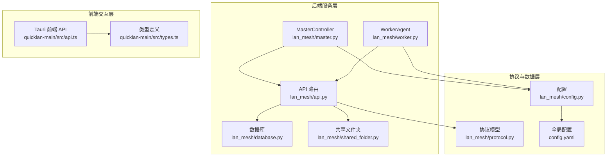
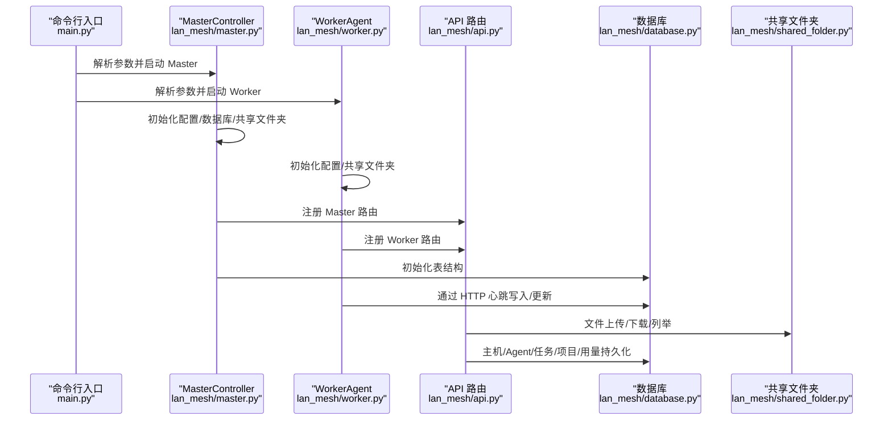
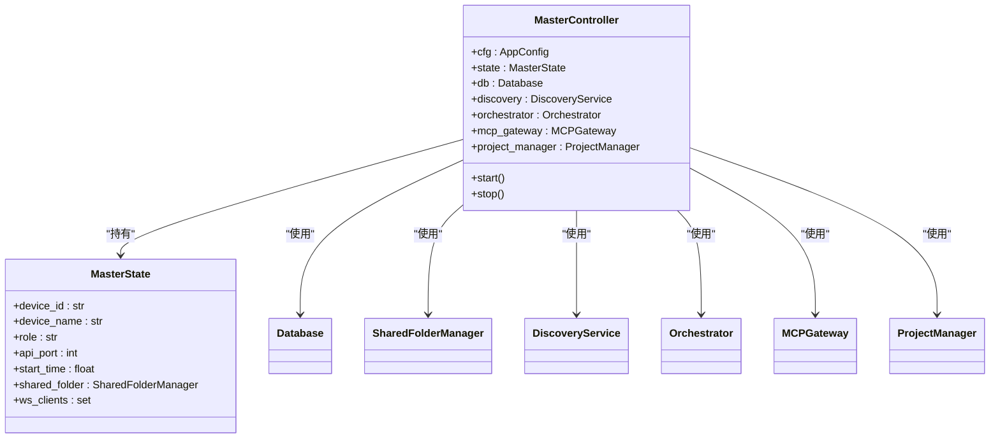
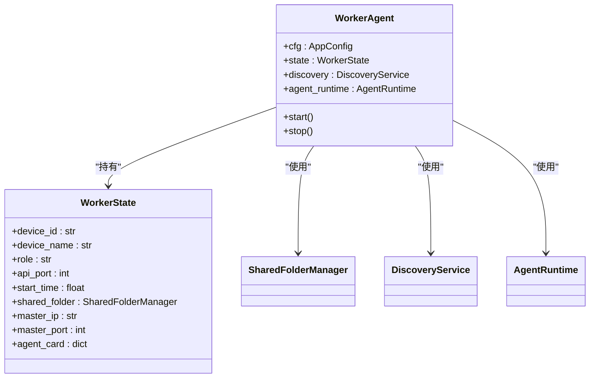
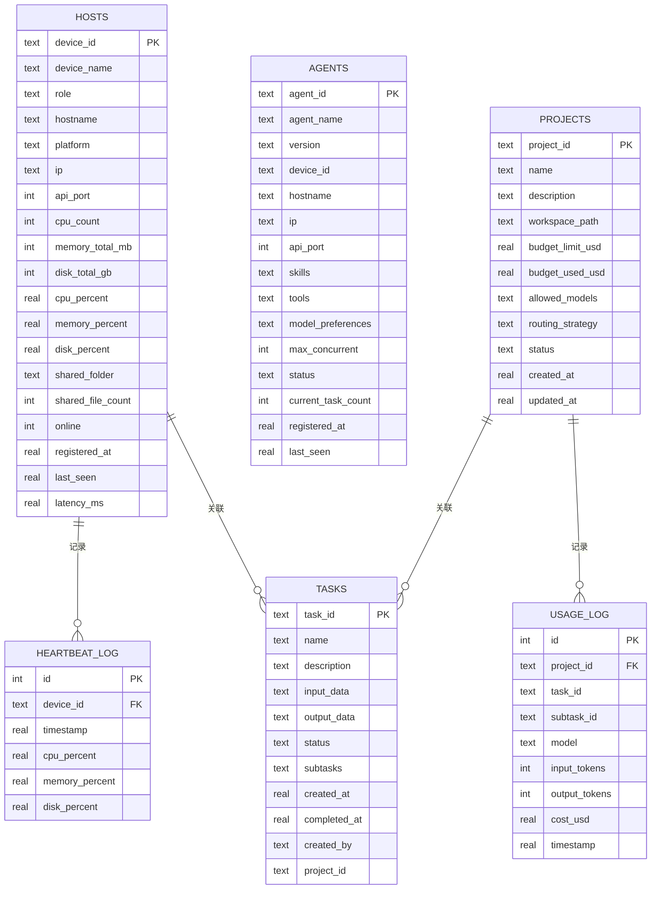
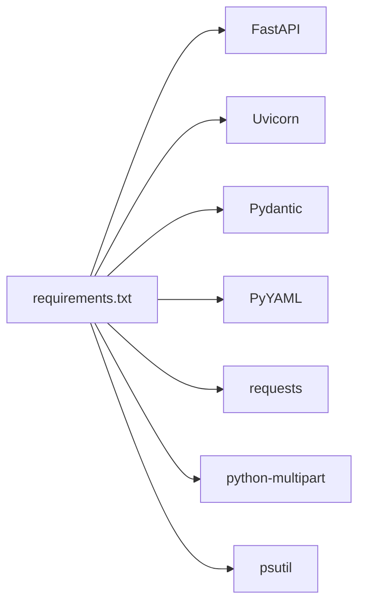

# API 测试工具

<cite>
**本文引用的文件**
- [main.py](file://main.py)
- [config.yaml](file://config.yaml)
- [requirements.txt](file://requirements.txt)
- [lan_mesh/api.py](file://lan_mesh/api.py)
- [lan_mesh/master.py](file://lan_mesh/master.py)
- [lan_mesh/worker.py](file://lan_mesh/worker.py)
- [lan_mesh/config.py](file://lan_mesh/config.py)
- [lan_mesh/database.py](file://lan_mesh/database.py)
- [lan_mesh/protocol.py](file://lan_mesh/protocol.py)
- [lan_mesh/shared_folder.py](file://lan_mesh/shared_folder.py)
- [quicklan-main/src/api.ts](file://quicklan-main/src/api.ts)
- [quicklan-main/src/types.ts](file://quicklan-main/src/types.ts)
- [quicklan-main/README.md](file://quicklan-main/README.md)
</cite>

## 目录
1. [简介](#简介)
2. [项目结构](#项目结构)
3. [核心组件](#核心组件)
4. [架构总览](#架构总览)
5. [详细组件分析](#详细组件分析)
6. [依赖关系分析](#依赖关系分析)
7. [性能考虑](#性能考虑)
8. [故障注入与集成测试策略](#故障注入与集成测试策略)
9. [测试环境搭建与 Mock 服务](#测试环境搭建与-mock-服务)
10. [Postman 集合与 cURL 示例](#postman-集合与-curl-示例)
11. [自动化测试脚本](#自动化测试脚本)
12. [测试数据生成与报告模板](#测试数据生成与报告模板)
13. [常见测试场景](#常见测试场景)
14. [故障排查指南](#故障排查指南)
15. [结论](#结论)

## 简介
本文件面向 Work Station 项目，提供一套完整的 API 测试工具与测试指南，涵盖：
- 测试环境搭建与 Mock 服务配置
- Postman 集合与 cURL 脚本示例
- 自动化测试脚本与集成测试策略
- API 正确性验证、性能基准与负载测试方法
- 测试数据生成工具与测试报告模板
- 常见测试场景与故障注入测试方法

目标读者包括开发工程师、测试工程师与运维人员，帮助快速落地 API 测试与质量保障。

## 项目结构
Work Station 由三层组成：
- 后端服务层：Python FastAPI + Uvicorn，提供 Master/Worker API 与 Web UI
- 协议与数据层：共享文件夹、数据库、发现协议与任务模型
- 前端交互层：Tauri + React + TypeScript，提供桌面端控制 API 调用

图表来源
- [lan_mesh/master.py:1-324](file://lan_mesh/master.py#L1-L324)
- [lan_mesh/worker.py:1-325](file://lan_mesh/worker.py#L1-L325)
- [lan_mesh/api.py:1-539](file://lan_mesh/api.py#L1-L539)
- [lan_mesh/database.py:1-611](file://lan_mesh/database.py#L1-L611)
- [lan_mesh/shared_folder.py:1-219](file://lan_mesh/shared_folder.py#L1-L219)
- [lan_mesh/config.py:1-84](file://lan_mesh/config.py#L1-L84)
- [lan_mesh/protocol.py:1-356](file://lan_mesh/protocol.py#L1-L356)
- [config.yaml:1-22](file://config.yaml#L1-L22)
- [quicklan-main/src/api.ts:1-130](file://quicklan-main/src/api.ts#L1-L130)
- [quicklan-main/src/types.ts:1-128](file://quicklan-main/src/types.ts#L1-L128)

章节来源
- [main.py:1-90](file://main.py#L1-L90)
- [config.yaml:1-22](file://config.yaml#L1-L22)
- [requirements.txt:1-8](file://requirements.txt#L1-L8)

## 核心组件
- Master 控制器：负责 UDP 发现、注册、心跳、Web UI、数据库持久化与 WebSocket 推送
- Worker 代理：负责 UDP 发现 Master、注册与心跳、共享文件夹、本地 API 暴露
- API 路由：统一暴露 Master/Worker API，包含注册、心跳、主机列表、网络状态、共享文件、任务与项目管理等端点
- 数据库：SQLite 存储主机、Agent、任务、项目与用量日志
- 共享文件夹：自动创建、列举、上传下载、生成配置报告
- 配置系统：YAML + 环境变量，支持多位置加载与路径展开
- 协议模型：DiscoveryPacket、HostInfo、HostRecord、AgentCard、Task、Project 等

章节来源
- [lan_mesh/master.py:67-324](file://lan_mesh/master.py#L67-L324)
- [lan_mesh/worker.py:62-325](file://lan_mesh/worker.py#L62-L325)
- [lan_mesh/api.py:37-526](file://lan_mesh/api.py#L37-L526)
- [lan_mesh/database.py:16-611](file://lan_mesh/database.py#L16-L611)
- [lan_mesh/shared_folder.py:16-219](file://lan_mesh/shared_folder.py#L16-L219)
- [lan_mesh/config.py:48-84](file://lan_mesh/config.py#L48-L84)
- [lan_mesh/protocol.py:29-356](file://lan_mesh/protocol.py#L29-L356)

## 架构总览
下图展示 Master/Worker 的启动与通信流程，以及 API 路由与数据层的关系。

图表来源
- [main.py:25-86](file://main.py#L25-L86)
- [lan_mesh/master.py:187-324](file://lan_mesh/master.py#L187-L324)
- [lan_mesh/worker.py:219-325](file://lan_mesh/worker.py#L219-L325)
- [lan_mesh/api.py:37-526](file://lan_mesh/api.py#L37-L526)
- [lan_mesh/database.py:36-143](file://lan_mesh/database.py#L36-L143)
- [lan_mesh/shared_folder.py:23-144](file://lan_mesh/shared_folder.py#L23-L144)

## 详细组件分析

### Master 控制器
- 职责：启动 FastAPI、注册路由、启动 UDP 发现、定时清理离线主机、WebSocket 推送
- 关键行为：生成设备 ID、采集本机信息、部署采集脚本、刷新配置报告、启动后台任务

图表来源
- [lan_mesh/master.py:55-114](file://lan_mesh/master.py#L55-L114)
- [lan_mesh/master.py:67-114](file://lan_mesh/master.py#L67-L114)

章节来源
- [lan_mesh/master.py:67-324](file://lan_mesh/master.py#L67-L324)

### Worker 代理
- 职责：发现 Master、注册与心跳、暴露 Worker API、共享文件夹管理
- 关键行为：注册主机信息与 Agent Card、周期性心跳、刷新共享配置报告

图表来源
- [lan_mesh/worker.py:47-96](file://lan_mesh/worker.py#L47-L96)
- [lan_mesh/worker.py:62-96](file://lan_mesh/worker.py#L62-L96)

章节来源
- [lan_mesh/worker.py:62-325](file://lan_mesh/worker.py#L62-L325)

### API 路由与端点
- Worker 端点：/info、/tasks/execute、/shared（列举/下载/上传）
- Master 端点：/api/register、/api/heartbeat、/api/hosts、/api/hosts/{id}、/api/network、/api/discovery、/api/probe/{ip}、/api/health、/api/master-info、/api/shared、/api/agents、/api/tasks、/api/projects、/api/projects/{project_id}/usage、/tools、/ws

```mermaid
flowchart TD
A["Worker API"] --> A1["GET /info"]
A --> A2["POST /tasks/execute"]
A --> A3["GET /shared"]
A --> A4["GET /shared/{path}"]
A --> A5["POST /shared"]
B["Master API"] --> B1["POST /api/register"]
B --> B2["POST /api/heartbeat"]
B --> B3["GET /api/hosts"]
B --> B4["GET /api/hosts/{id}"]
B --> B5["GET /api/network"]
B --> B6["GET /api/discovery"]
B --> B7["POST /api/probe/{ip}"]
B --> B8["GET /api/health"]
B --> B9["GET /api/master-info"]
B --> B10["GET /api/shared"]
B --> B11["POST /api/agents/register"]
B --> B12["GET /api/agents"]
B --> B13["GET /api/agents/{agent_id}"]
B --> B14["POST /api/tasks"]
B --> B15["GET /api/tasks"]
B --> B16["GET /api/tasks/{task_id}"]
B --> B17["POST /api/projects"]
B --> B18["GET /api/projects"]
B --> B19["GET /api/projects/{project_id}"]
B --> B20["PUT /api/projects/{project_id}"]
B --> B21["DELETE /api/projects/{project_id}"]
B --> B22["GET /api/projects/{project_id}/usage"]
B --> B23["GET /tools/list"]
B --> B24["POST /tools/call"]
B --> B25["GET /tools/servers"]
B --> B26["POST /tools/servers"]
B --> B27["DELETE /tools/servers/{name}"]
B --> B28["WS /ws"]
```

图表来源
- [lan_mesh/api.py:37-526](file://lan_mesh/api.py#L37-L526)

章节来源
- [lan_mesh/api.py:37-526](file://lan_mesh/api.py#L37-L526)

### 数据库与模型
- 表结构：hosts、heartbeat_log、agents、tasks、projects、usage_log
- 关键操作：upsert_host、log_heartbeat、list_hosts、upsert_agent、save_task、upsert_project、record_usage

图表来源
- [lan_mesh/database.py:36-143](file://lan_mesh/database.py#L36-L143)
- [lan_mesh/database.py:421-488](file://lan_mesh/database.py#L421-L488)
- [lan_mesh/database.py:492-550](file://lan_mesh/database.py#L492-L550)
- [lan_mesh/database.py:589-610](file://lan_mesh/database.py#L589-L610)

章节来源
- [lan_mesh/database.py:16-611](file://lan_mesh/database.py#L16-L611)

### 协议与模型
- DiscoveryPacket：UDP 广播发现包
- HostInfo/HostRecord：主机信息与注册记录
- AgentCard：Agent 能力卡片
- Task/SubTask：任务与子任务
- Project/UsageRecord：项目与用量记录

章节来源
- [lan_mesh/protocol.py:29-356](file://lan_mesh/protocol.py#L29-L356)

## 依赖关系分析
- 后端依赖：FastAPI、Uvicorn、Pydantic、PyYAML、requests、python-multipart、psutil
- 前端依赖：Tauri、React、TypeScript、Vite（桌面端）

图表来源
- [requirements.txt:1-8](file://requirements.txt#L1-L8)

章节来源
- [requirements.txt:1-8](file://requirements.txt#L1-L8)

## 性能考虑
- 心跳与清理：Worker 心跳间隔、Master 离线清理间隔、心跳历史保留时长
- 端口占用：Worker API 端口递增策略，避免冲突
- 数据库索引：按状态与时间建立索引，优化查询
- 文件传输：共享文件夹上传/下载采用二进制流，注意大文件分块与断点续传（如需）

章节来源
- [lan_mesh/protocol.py:21-24](file://lan_mesh/protocol.py#L21-L24)
- [lan_mesh/worker.py:240-249](file://lan_mesh/worker.py#L240-L249)
- [lan_mesh/database.py:71-72](file://lan_mesh/database.py#L71-L72)
- [lan_mesh/database.py:105-106](file://lan_mesh/database.py#L105-L106)
- [lan_mesh/database.py:134-136](file://lan_mesh/database.py#L134-L136)

## 故障注入与集成测试策略
- 网络层：模拟 Worker 与 Master 之间的网络分区、丢包、延迟
- 服务层：停止单个服务（Master/Worker），观察另一侧行为与恢复
- 数据层：断开/损坏数据库，验证错误处理与重试
- API 层：注入无效参数、缺失字段、超时响应，验证 4xx/5xx 与降级
- 前端层：断开网络或禁用后端，验证 UI 错误提示与重试机制

章节来源
- [lan_mesh/api.py:148-168](file://lan_mesh/api.py#L148-L168)
- [lan_mesh/worker.py:126-146](file://lan_mesh/worker.py#L126-L146)
- [lan_mesh/master.py:166-174](file://lan_mesh/master.py#L166-L174)

## 测试环境搭建与 Mock 服务
- 环境准备
  - 安装依赖：pip install -r requirements.txt
  - 准备配置：config.yaml（可放置于用户目录或项目根目录）
  - 启动 Master：python main.py master
  - 启动 Worker：python main.py worker
- Mock 服务建议
  - 使用 FastAPI 的 TestClient 进行单元测试
  - 使用 pytest + pytest-asyncio 运行异步端点
  - 使用 httpx.AsyncClient 进行端到端测试
  - 使用 docker-compose 搭建最小化测试集群（Master + 多个 Worker）

章节来源
- [requirements.txt:1-8](file://requirements.txt#L1-L8)
- [config.yaml:1-22](file://config.yaml#L1-L22)
- [main.py:25-86](file://main.py#L25-L86)

## Postman 集合与 cURL 示例
以下为常用端点的 cURL 示例与 Postman 集合建议结构。为避免泄露具体实现细节，此处仅给出端点与参数说明，并提供 Postman 集合的组织方式。

- Master 端点
  - 注册 Worker：POST /api/register（Body：HostInfo）
  - 心跳：POST /api/heartbeat（Body：device_id, cpu_percent, memory_percent, disk_percent, shared_file_count）
  - 主机列表：GET /api/hosts
  - 单台主机详情：GET /api/hosts/{device_id}
  - 网络状态：GET /api/network
  - UDP 发现：GET /api/discovery
  - 探测 IP：POST /api/probe/{ip}
  - 健康检查：GET /api/health
  - Master 自身信息：GET /api/master-info
  - 共享文件列表：GET /api/shared
  - Agent 注册：POST /api/agents/register（Body：AgentCard）
  - Agent 列表：GET /api/agents
  - 单个 Agent：GET /api/agents/{agent_id}
  - 提交任务：POST /api/tasks（Body：name, description, input_data, created_by, project_id）
  - 任务列表：GET /api/tasks
  - 单个任务：GET /api/tasks/{task_id}
  - 创建项目：POST /api/projects（Body：name, description, budget_limit_usd, allowed_models, routing_strategy, workspace_base）
  - 项目列表：GET /api/projects
  - 单个项目：GET /api/projects/{project_id}
  - 更新项目：PUT /api/projects/{project_id}
  - 归档项目：DELETE /api/projects/{project_id}
  - 项目用量：GET /api/projects/{project_id}/usage
  - 工具列表：GET /tools/list
  - 调用工具：POST /tools/call（Body：tool_name, arguments, server_name）
  - 工具服务器列表：GET /tools/servers
  - 注册工具服务器：POST /tools/servers（Body：name, config）
  - 注销工具服务器：DELETE /tools/servers/{name}
  - WebSocket：WS /ws
- Worker 端点
  - 本机信息：GET /info
  - 任务执行：POST /tasks/execute（Body：payload）
  - 共享文件列表：GET /shared
  - 下载共享文件：GET /shared/{path}
  - 上传共享文件：POST /shared（Form：file）

Postman 集合建议
- 环境变量：BASE_URL=http://localhost:45470（Master）、API_PORT=45460（Worker）
- 认证：如需 Token，可在 Pre-request Script 中注入
- 测试脚本：在 Tests 中编写断言（状态码、响应体字段、时间阈值）

章节来源
- [lan_mesh/api.py:116-526](file://lan_mesh/api.py#L116-L526)
- [lan_mesh/api.py:39-98](file://lan_mesh/api.py#L39-L98)

## 自动化测试脚本
- 单元测试（pytest）
  - 使用 TestClient 测试 API 路由
  - 使用 monkeypatch 注入 Mock 数据库与共享文件夹
- 集成测试
  - 启动 Master/Worker 进程，使用 httpx AsyncClient 发送请求
  - 验证注册、心跳、任务提交、项目管理、工具调用链路
- 性能测试
  - 使用 locust 或 pytest-benchmark 进行并发与吞吐测试
  - 关注端点延迟、数据库写入耗时、文件上传/下载速率
- 端到端测试
  - 使用 docker-compose 搭建 Master + N Worker 集群
  - 编排任务、监控 Agent 分配与执行、统计项目用量

章节来源
- [lan_mesh/api.py:37-526](file://lan_mesh/api.py#L37-L526)
- [lan_mesh/database.py:16-611](file://lan_mesh/database.py#L16-L611)
- [lan_mesh/shared_folder.py:16-219](file://lan_mesh/shared_folder.py#L16-L219)

## 测试数据生成与报告模板
- 测试数据生成
  - 自动生成 HostInfo/AgentCard/Task/Project 数据
  - 使用随机 device_id、agent_id、task_id、project_id
  - 生成不同规模的数据集（小/中/大）用于性能测试
- 报告模板
  - 测试概要：用例总数、通过数、失败数、通过率
  - 性能指标：平均响应时间、P95/P99 延迟、吞吐量
  - 失败分析：失败原因分类、失败用例清单
  - 建议：针对失败用例的修复建议与回归计划

章节来源
- [lan_mesh/protocol.py:69-356](file://lan_mesh/protocol.py#L69-L356)
- [lan_mesh/database.py:421-610](file://lan_mesh/database.py#L421-L610)

## 常见测试场景
- 正确性测试
  - 注册与心跳：验证注册成功、心跳更新、离线剔除
  - 文件共享：上传/下载/列举，校验文件完整性
  - 任务管理：提交任务、分配 Agent、执行完成、记录用量
  - 项目管理：预算控制、模型限制、路由策略
- 性能测试
  - 并发注册与心跳：评估 Master 处理能力
  - 大文件上传/下载：评估带宽与稳定性
  - 任务批处理：评估编排与调度性能
- 可靠性测试
  - 网络抖动：模拟丢包与延迟，验证重试与降级
  - 服务重启：Master/Worker 重启后状态一致性
  - 数据库异常：断电/崩溃后的恢复与一致性
- 安全测试
  - 路径穿越防护：上传文件名与路径校验
  - 权限控制：共享资源访问控制（如后续扩展）

章节来源
- [lan_mesh/api.py:116-526](file://lan_mesh/api.py#L116-L526)
- [lan_mesh/shared_folder.py:88-118](file://lan_mesh/shared_folder.py#L88-L118)
- [lan_mesh/database.py:147-290](file://lan_mesh/database.py#L147-L290)

## 故障排查指南
- 端口冲突
  - Worker 端口递增策略：若端口被占用，自动寻找下一个可用端口
- 心跳失败
  - 检查 Master IP/Port 是否正确，确认网络连通性
  - 查看数据库中主机是否在线，是否存在离线剔除
- 文件上传失败
  - 检查共享文件夹权限与磁盘空间
  - 校验文件名与路径是否越界
- 项目预算超支
  - 检查项目预算与已用额度，确认路由策略
- WebSocket 断开
  - 检查客户端 ping/pong 机制，确认连接存活

章节来源
- [lan_mesh/worker.py:240-249](file://lan_mesh/worker.py#L240-L249)
- [lan_mesh/worker.py:172-194](file://lan_mesh/worker.py#L172-L194)
- [lan_mesh/database.py:264-290](file://lan_mesh/database.py#L264-L290)
- [lan_mesh/shared_folder.py:88-118](file://lan_mesh/shared_folder.py#L88-L118)
- [lan_mesh/api.py:500-525](file://lan_mesh/api.py#L500-L525)

## 结论
通过本文档提供的测试工具与策略，可以系统地验证 Work Station 的 API 正确性、性能与可靠性。建议结合 Postman 集合、cURL 脚本与自动化测试脚本，形成持续集成中的 API 质量保障体系，并配合 Mock 服务与故障注入，提升系统的鲁棒性与可观测性。