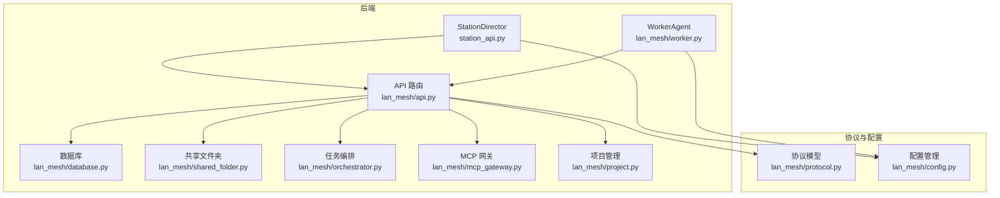
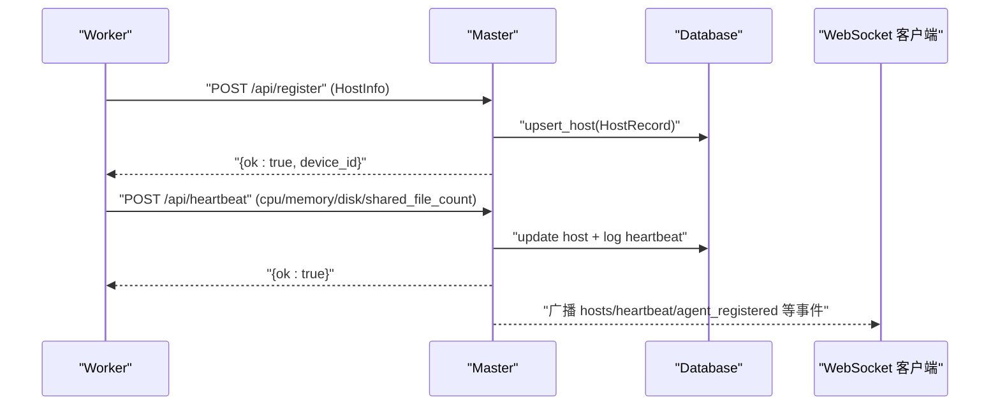
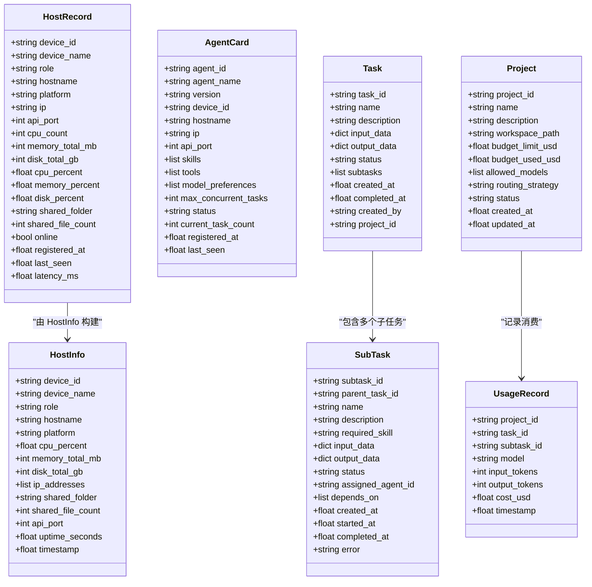
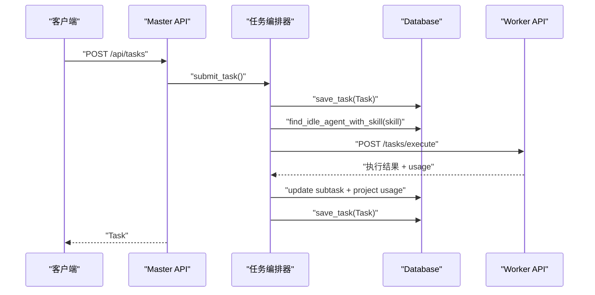
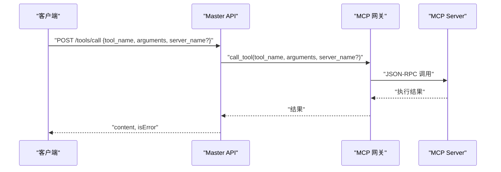
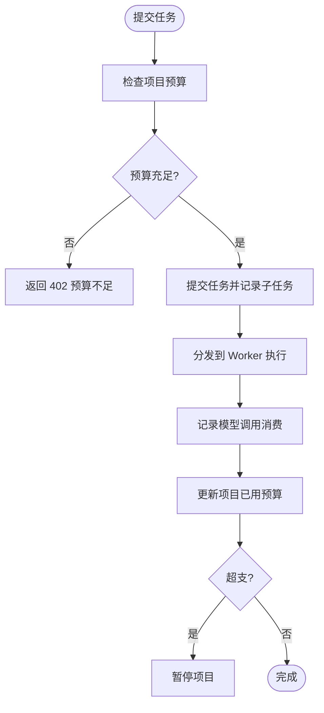
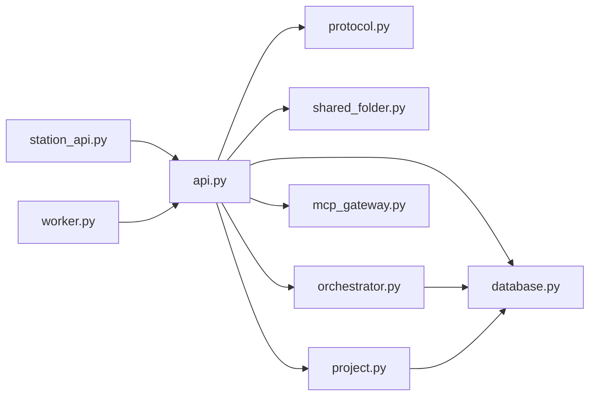

# RESTful API 规范

<cite>
**本文引用的文件**
- [api.py](file://lan_mesh/api.py)
- [station_api.py](file://lan_mesh/station_api.py)
- [worker.py](file://lan_mesh/worker.py)
- [protocol.py](file://lan_mesh/protocol.py)
- [database.py](file://lan_mesh/database.py)
- [shared_folder.py](file://lan_mesh/shared_folder.py)
- [orchestrator.py](file://lan_mesh/orchestrator.py)
- [mcp_gateway.py](file://lan_mesh/mcp_gateway.py)
- [project.py](file://lan_mesh/project.py)
- [config.py](file://lan_mesh/config.py)
- [main.py](file://main.py)
- [requirements.txt](file://requirements.txt)
</cite>

## 目录
1. [简介](#简介)
2. [项目结构](#项目结构)
3. [核心组件](#核心组件)
4. [架构总览](#架构总览)
5. [详细组件分析](#详细组件分析)
6. [依赖分析](#依赖分析)
7. [性能考虑](#性能考虑)
8. [故障排查指南](#故障排查指南)
9. [结论](#结论)
10. [附录](#附录)

## 简介
本文件为 Work Station 项目（LAN Mesh）的 RESTful API 规范，覆盖 Worker API 与 Master API 的完整端点清单、请求方法、URL 模式、请求参数、响应格式与错误码定义，并提供版本控制策略与向后兼容说明、典型使用示例与 cURL 命令示例。API 基于 FastAPI 实现，采用 JSON 作为主要传输格式，WebSocket 用于实时推送。

## 项目结构
- 后端核心位于 lan_mesh 包：
  - 路由与 API：api.py
  - Station Director：station_api.py
  - Worker 守护进程：worker.py
  - 协议与数据模型：protocol.py
  - 数据库与持久化：database.py
  - 共享文件夹：shared_folder.py
  - 任务编排：orchestrator.py
  - MCP 工具网关：mcp_gateway.py
  - 项目管理与预算：project.py
  - 配置管理：config.py
- 前端（QuickLAN）位于 quicklan-main，包含 Tauri 桌面应用与前端源码，其中 src-tauri 提供 TCP LAN API（非本文重点），src 提供 Web UI 交互接口。
- 入口脚本：main.py



图表来源
- [station_api.py](file://lan_mesh/station_api.py#L187-L223)
- [worker.py:219-238](file://lan_mesh/worker.py#L219-L238)
- [api.py:39-98](file://lan_mesh/api.py#L39-L98)
- [api.py:103-526](file://lan_mesh/api.py#L103-L526)

章节来源
- [main.py:25-90](file://main.py#L25-L90)
- [config.py:48-84](file://lan_mesh/config.py#L48-L84)

## 核心组件
- Master API：集中管理主机注册、心跳、网络状态、任务与项目管理、MCP 工具网关、共享文件夹等。
- Worker API：提供本机配置查询、共享文件上传下载、任务执行端点。
- WebSocket：实时推送主机状态变更。
- 数据模型：HostInfo、HostRecord、AgentCard、Task/SubTask、Project、UsageRecord 等。
- 存储：SQLite，持久化主机、心跳、Agent、任务、项目与消费记录。
- 共享文件夹：统一文件共享与主机配置报告生成。
- 编排与工具：任务 DAG、Agent 匹配、MCP 工具聚合与路由。

章节来源
- [api.py:116-256](file://lan_mesh/api.py#L116-L256)
- [api.py:54-97](file://lan_mesh/api.py#L54-L97)
- [protocol.py:69-356](file://lan_mesh/protocol.py#L69-L356)
- [database.py:16-611](file://lan_mesh/database.py#L16-L611)
- [shared_folder.py:16-219](file://lan_mesh/shared_folder.py#L16-L219)
- [orchestrator.py:58-262](file://lan_mesh/orchestrator.py#L58-L262)
- [mcp_gateway.py:33-280](file://lan_mesh/mcp_gateway.py#L33-L280)
- [project.py:62-320](file://lan_mesh/project.py#L62-L320)

## 架构总览
- Master 作为控制中心，提供 Web UI 与 REST API；Worker 通过 HTTP 注册与心跳上报，同时暴露共享文件与任务执行端点。
- Master 侧集成数据库、任务编排、MCP 网关与项目预算控制。
- WebSocket 用于实时推送主机状态与事件。



图表来源
- [api.py:116-168](file://lan_mesh/api.py#L116-L168)
- [database.py:147-201](file://lan_mesh/database.py#L147-L201)
- [api.py:501-525](file://lan_mesh/api.py#L501-L525)

## 详细组件分析

### Worker API 端点
- GET /info
  - 功能：返回本机完整配置信息（HostInfo）。
  - 请求：无。
  - 响应：HostInfo 字典。
  - 错误：无。
  - 示例：见“附录/请求/响应示例”。
- POST /tasks/execute
  - 功能：接收 Master 分发的子任务并执行，返回执行结果与可选消费记录。
  - 请求体：JSON，包含子任务元数据与输入数据。
  - 响应：执行结果字典（包含输出与 usage 信息）。
  - 错误：503（Agent 运行时未初始化）。
- GET /shared
  - 功能：列出共享文件夹内容。
  - 响应：包含 folder、files、file_count。
- GET /shared/{path}
  - 功能：下载共享文件。
  - 响应：二进制文件流。
  - 错误：404（文件不存在）、403（路径越界）。
- POST /shared
  - 功能：上传文件到共享目录。
  - 请求体：multipart/form-data，file 字段。
  - 响应：包含 ok、filename、path、size。

章节来源
- [api.py:47-97](file://lan_mesh/api.py#L47-L97)
- [shared_folder.py:39-118](file://lan_mesh/shared_folder.py#L39-L118)

### Master API 端点
- POST /api/register
  - 功能：Worker 注册，接收 HostInfo 并持久化。
  - 请求体：HostInfo（JSON）。
  - 响应：{ok: true, device_id}。
  - 错误：无。
- POST /api/heartbeat
  - 功能：Worker 心跳上报，更新实时状态与在线状态。
  - 请求体：{device_id, cpu_percent, memory_percent, disk_percent, shared_file_count}。
  - 响应：{ok: true}。
  - 错误：404（设备未注册）。
- GET /api/hosts
  - 功能：返回所有主机列表（DB + UDP 发现合并）。
  - 响应：{hosts: [...], total, online}。
- GET /api/hosts/{device_id}
  - 功能：查询单台主机详情。
  - 响应：HostRecord 或 UDP 发现设备。
  - 错误：404（主机不存在）。
- GET /api/network
  - 功能：返回 Master 本机网络状态。
  - 响应：{udp_port, api_port, local_ips, broadcast_targets}。
- POST /api/probe/{ip}
  - 功能：主动探测指定 IP。
  - 响应：{ok: true, message}。
- GET /api/discovery
  - 功能：返回 UDP 发现到的设备列表。
  - 响应：{devices: [...], total}。
- GET /api/health
  - 功能：健康检查。
  - 响应：{status: "ok", role: "master", uptime, device_id}。
- GET /api/master-info
  - 功能：返回 Master 自身的 HostInfo。
  - 响应：HostInfo。
- GET /api/shared
  - 功能：列出 Master 共享文件夹内容。
  - 响应：同 Worker /shared。
- POST /api/agents/register
  - 功能：Worker 注册 Agent Card。
  - 请求体：AgentCard（JSON）。
  - 响应：{ok: true, agent_id}。
- GET /api/agents
  - 功能：列出所有 Agent，可按状态过滤。
  - 响应：{agents: [...], total, idle, busy}。
- GET /api/agents/{agent_id}
  - 功能：查询单个 Agent 详情。
  - 响应：AgentCard。
  - 错误：404（Agent 不存在）。
- POST /api/tasks
  - 功能：提交新任务，自动分解并调度。
  - 请求体：{name, description, input_data, created_by, project_id?}。
  - 响应：Task。
  - 错误：503（编排器未初始化）、402（预算不足）。
- GET /api/tasks
  - 功能：列出任务，可按状态过滤与限制数量。
  - 响应：{tasks: [...], total}。
- GET /api/tasks/{task_id}
  - 功能：查询单个任务状态。
  - 响应：Task。
  - 错误：404（任务不存在）。
- POST /api/projects
  - 功能：创建新项目。
  - 请求体：{name, description, budget_limit_usd, allowed_models?, routing_strategy?, workspace_base?}。
  - 响应：Project。
  - 错误：503（项目管理器未初始化）。
- GET /api/projects
  - 功能：列出所有项目，可按状态过滤。
  - 响应：{projects: [...], total}。
- GET /api/projects/{project_id}
  - 功能：查询单个项目详情（含预算状态）。
  - 响应：项目状态摘要（含预算比率、剩余、最近调用统计等）。
  - 错误：503（项目管理器未初始化）、404（项目不存在）。
- PUT /api/projects/{project_id}
  - 功能：更新项目字段（名称、描述、预算、模型白名单、路由策略、状态）。
  - 请求体：{name?, description?, budget_limit_usd?, allowed_models?, routing_strategy?, status?}。
  - 响应：Project。
  - 错误：503（项目管理器未初始化）、404（项目不存在）。
- DELETE /api/projects/{project_id}
  - 功能：归档项目（软删除）。
  - 响应：{ok: true, project_id}。
  - 错误：503（项目管理器未初始化）、404（项目不存在）。
- GET /api/projects/{project_id}/usage
  - 功能：查询项目消费记录。
  - 响应：{records: [...], total, project_id}。
- GET /tools/list
  - 功能：列出网关上所有可用工具（聚合所有 MCP Server）。
  - 查询参数：model（可选，用于调整工具描述）。
  - 响应：{tools: [...], total, servers: [...]}。
  - 错误：无（未初始化返回空列表与提示）。
- POST /tools/call
  - 功能：调用工具，路由到正确的 MCP Server 执行。
  - 请求体：{tool_name, arguments, server_name?}。
  - 响应：工具执行结果（content、isError）。
  - 错误：400（缺少 tool_name）、503（MCP 网关未初始化）。
- GET /tools/servers
  - 功能：列出所有已注册的 MCP Server 及其状态。
  - 响应：{servers: [...], stats: {...}}。
- POST /tools/servers
  - 功能：动态注册新的 MCP Server。
  - 请求体：{name, config}。
  - 响应：{ok, name}。
  - 错误：400（缺少 name）、503（MCP 网关未初始化）。
- DELETE /tools/servers/{name}
  - 功能：注销 MCP Server。
  - 响应：{ok, name}。
  - 错误：503（MCP 网关未初始化）。
- WS /ws
  - 功能：WebSocket 实时推送主机状态变更。
  - 首次推送：hosts 列表。
  - 心跳：客户端需周期性发送消息以维持连接。

章节来源
- [api.py:116-526](file://lan_mesh/api.py#L116-L526)
- [database.py:147-290](file://lan_mesh/database.py#L147-L290)
- [database.py:293-418](file://lan_mesh/database.py#L293-L418)
- [database.py:421-488](file://lan_mesh/database.py#L421-L488)
- [database.py:492-585](file://lan_mesh/database.py#L492-L585)
- [database.py:589-611](file://lan_mesh/database.py#L589-L611)
- [mcp_gateway.py:96-177](file://lan_mesh/mcp_gateway.py#L96-L177)
- [mcp_gateway.py:48-95](file://lan_mesh/mcp_gateway.py#L48-L95)
- [project.py:176-320](file://lan_mesh/project.py#L176-L320)

### 数据模型与复杂逻辑
- HostInfo/HostRecord：主机配置与状态快照。
- AgentCard：Agent 能力声明（技能、工具、偏好等）。
- Task/SubTask：任务生命周期与 DAG 结构。
- Project/UsageRecord：项目预算与消费记录。
- 任务编排：根据任务类型选择预置模板，构建 DAG 并调度到空闲 Agent。
- MCP 网关：聚合工具、路由调用、自动重连与健康检查。
- 项目预算：按模型定价计算成本，超支自动暂停项目。



图表来源
- [protocol.py:69-356](file://lan_mesh/protocol.py#L69-L356)

章节来源
- [protocol.py:69-356](file://lan_mesh/protocol.py#L69-L356)
- [database.py:147-585](file://lan_mesh/database.py#L147-L585)
- [orchestrator.py:58-262](file://lan_mesh/orchestrator.py#L58-L262)
- [mcp_gateway.py:33-280](file://lan_mesh/mcp_gateway.py#L33-L280)
- [project.py:62-320](file://lan_mesh/project.py#L62-L320)

### API 流程与序列图

#### 任务提交与调度流程


图表来源
- [api.py:302-326](file://lan_mesh/api.py#L302-L326)
- [orchestrator.py:70-108](file://lan_mesh/orchestrator.py#L70-L108)
- [orchestrator.py:157-226](file://lan_mesh/orchestrator.py#L157-L226)
- [database.py:421-441](file://lan_mesh/database.py#L421-L441)

#### MCP 工具调用流程


图表来源
- [api.py:443-468](file://lan_mesh/api.py#L443-L468)
- [mcp_gateway.py:136-177](file://lan_mesh/mcp_gateway.py#L136-L177)

#### 项目预算控制流程


图表来源
- [api.py:302-317](file://lan_mesh/api.py#L302-L317)
- [project.py:176-291](file://lan_mesh/project.py#L176-L291)

## 依赖分析
- 外部依赖：FastAPI、Uvicorn、Pydantic、Requests、PyYAML、psutil、python-multipart。
- 内部模块耦合：
  - api.py 依赖 protocol、database、shared_folder、orchestrator、mcp_gateway、project。
  - station_api.py/worker.py 依赖 api.py 路由工厂。
  - database.py 依赖 protocol 数据模型。
  - orchestrator.py 依赖 database 与 protocol。
  - mcp_gateway.py 依赖 mcp_client（未在本仓库中）。
  - project.py 依赖 database 与 protocol。



图表来源
- [api.py:33-34](file://lan_mesh/api.py#L33-L34)
- [station_api.py](file://lan_mesh/station_api.py#L32-L45)
- [worker.py:42-44](file://lan_mesh/worker.py#L42-L44)

章节来源
- [requirements.txt:1-8](file://requirements.txt#L1-L8)
- [api.py:33-34](file://lan_mesh/api.py#L33-L34)
- [station_api.py](file://lan_mesh/station_api.py#L32-L45)
- [worker.py:42-44](file://lan_mesh/worker.py#L42-L44)

## 性能考虑
- 心跳与发现间隔：心跳 5 秒，存在广播 3 秒，设备 TTL 12 秒，离线清理 5 秒。
- 数据库索引：心跳日志按 device_id+timestamp 建索引，任务与 Agent 按状态建索引，提升查询效率。
- 并发与异步：WebSocket 推送与任务调度使用线程与异步协程，避免阻塞。
- 文件上传：共享文件上传采用一次性写入，避免大文件多次 IO。
- MCP 网关：工具列表缓存与自动重连，降低调用延迟与失败率。

章节来源
- [protocol.py:21-24](file://lan_mesh/protocol.py#L21-L24)
- [database.py:71-136](file://lan_mesh/database.py#L71-L136)
- [mcp_gateway.py:204-236](file://lan_mesh/mcp_gateway.py#L204-L236)

## 故障排查指南
- 404 设备未注册：Worker 未完成注册或 Master 未发现该设备。
- 503 服务未初始化：编排器、项目管理器、MCP 网关未启用。
- 402 预算不足：项目预算已用尽或暂停。
- 400 缺少必要字段：如 /tools/call 缺少 tool_name。
- 路径越界：共享文件下载时相对路径穿越。
- 网络问题：Master/Worker 端口冲突或防火墙阻断。

章节来源
- [api.py:148-168](file://lan_mesh/api.py#L148-L168)
- [api.py:308-317](file://lan_mesh/api.py#L308-L317)
- [api.py:460-468](file://lan_mesh/api.py#L460-L468)
- [shared_folder.py:88-101](file://lan_mesh/shared_folder.py#L88-L101)
- [station_api.py](file://lan_mesh/station_api.py#L256-L269)
- [worker.py:126-146](file://lan_mesh/worker.py#L126-L146)

## 结论
本 API 规范覆盖了 Worker 与 Master 的核心功能，包括主机注册与心跳、任务编排、项目预算、MCP 工具网关与共享文件夹。通过清晰的端点设计、数据模型与错误码约定，以及 WebSocket 实时推送，实现了跨主机的协同与可视化管理。建议在生产环境中结合配置文件与环境变量进行端口与路径定制，并关注预算与工具调用的稳定性。

## 附录

### API 端点一览（按角色）
- Worker API
  - GET /info
  - POST /tasks/execute
  - GET /shared
  - GET /shared/{path}
  - POST /shared
- Master API
  - POST /api/register
  - POST /api/heartbeat
  - GET /api/hosts
  - GET /api/hosts/{device_id}
  - GET /api/network
  - POST /api/probe/{ip}
  - GET /api/discovery
  - GET /api/health
  - GET /api/master-info
  - GET /api/shared
  - POST /api/agents/register
  - GET /api/agents
  - GET /api/agents/{agent_id}
  - POST /api/tasks
  - GET /api/tasks
  - GET /api/tasks/{task_id}
  - POST /api/projects
  - GET /api/projects
  - GET /api/projects/{project_id}
  - PUT /api/projects/{project_id}
  - DELETE /api/projects/{project_id}
  - GET /api/projects/{project_id}/usage
  - GET /tools/list
  - POST /tools/call
  - GET /tools/servers
  - POST /tools/servers
  - DELETE /tools/servers/{name}
  - WS /ws

章节来源
- [api.py:4-18](file://lan_mesh/api.py#L4-L18)
- [api.py:116-526](file://lan_mesh/api.py#L116-L526)

### 请求/响应示例与 cURL 命令
以下示例展示常用端点的请求与响应结构（不包含具体代码内容）。

- 注册 Worker
  - cURL
    ```bash
    curl -X POST "http://MASTER_IP:45470/api/register" \
      -H "Content-Type: application/json" \
      -d '{"device_id":"...","device_name":"...","role":"worker", ...}'
    ```
  - 响应
    - {ok: true, device_id}

- 上报心跳
  - cURL
    ```bash
    curl -X POST "http://MASTER_IP:45470/api/heartbeat" \
      -H "Content-Type: application/json" \
      -d '{"device_id":"...","cpu_percent":..., "memory_percent":..., "disk_percent":..., "shared_file_count":...}'
    ```
  - 响应
    - {ok: true}

- 提交任务
  - cURL
    ```bash
    curl -X POST "http://MASTER_IP:45470/api/tasks" \
      -H "Content-Type: application/json" \
      -d '{"name":"...","description":"...","input_data":{},"project_id":""}'
    ```
  - 响应
    - Task 对象

- 列举 Agent
  - cURL
    ```bash
    curl "http://MASTER_IP:45470/api/agents?status=idle"
    ```
  - 响应
    - {agents:[...], total, idle, busy}

- 调用 MCP 工具
  - cURL
    ```bash
    curl -X POST "http://MASTER_IP:45470/tools/call" \
      -H "Content-Type: application/json" \
      -d '{"tool_name":"read_file","arguments":{"path":"/tmp/test.txt"}}'
    ```
  - 响应
    - {"content":[...],"isError":false}

- 下载共享文件
  - cURL
    ```bash
    curl -O "http://WORKER_IP:45460/shared/path/to/file"
    ```

- 上传共享文件
  - cURL
    ```bash
    curl -F "file=@/path/to/local/file" "http://WORKER_IP:45460/shared"
    ```

- 项目预算查询
  - cURL
    ```bash
    curl "http://MASTER_IP:45470/api/projects/{project_id}/usage?limit=10"
    ```

章节来源
- [api.py:116-168](file://lan_mesh/api.py#L116-L168)
- [api.py:302-326](file://lan_mesh/api.py#L302-L326)
- [api.py:443-468](file://lan_mesh/api.py#L443-L468)
- [api.py:62-96](file://lan_mesh/api.py#L62-L96)
- [api.py:71-84](file://lan_mesh/api.py#L71-L84)

### 错误码定义
- 200 OK：成功。
- 400 Bad Request：缺少必要字段或请求格式错误。
- 402 Payment Required：项目预算不足。
- 403 Forbidden：路径越界或权限拒绝。
- 404 Not Found：资源不存在（设备、Agent、任务、项目）。
- 503 Service Unavailable：服务未初始化或不可用。

章节来源
- [api.py:83-84](file://lan_mesh/api.py#L83-L84)
- [api.py:153-154](file://lan_mesh/api.py#L153-L154)
- [api.py:296-297](file://lan_mesh/api.py#L296-L297)
- [api.py:314-317](file://lan_mesh/api.py#L314-L317)
- [api.py:465-467](file://lan_mesh/api.py#L465-L467)

### 版本控制与向后兼容
- 版本字段：FastAPI 应用标题包含版本号（例如 "0.1.0"），便于识别 API 版本。
- 兼容策略：
  - 新增端点时保留旧端点不变。
  - 数据模型新增字段时，读取时忽略未知字段，保证向前兼容。
  - 任务与项目字段扩展通过数据库迁移（如新增列）实现。
- 建议：对外发布前明确版本号，遵循语义化版本，避免破坏性变更。

章节来源
- [station_api.py](file://lan_mesh/station_api.py#L189)
- [worker.py:221](file://lan_mesh/worker.py#L221)
- [database.py:138-143](file://lan_mesh/database.py#L138-L143)
