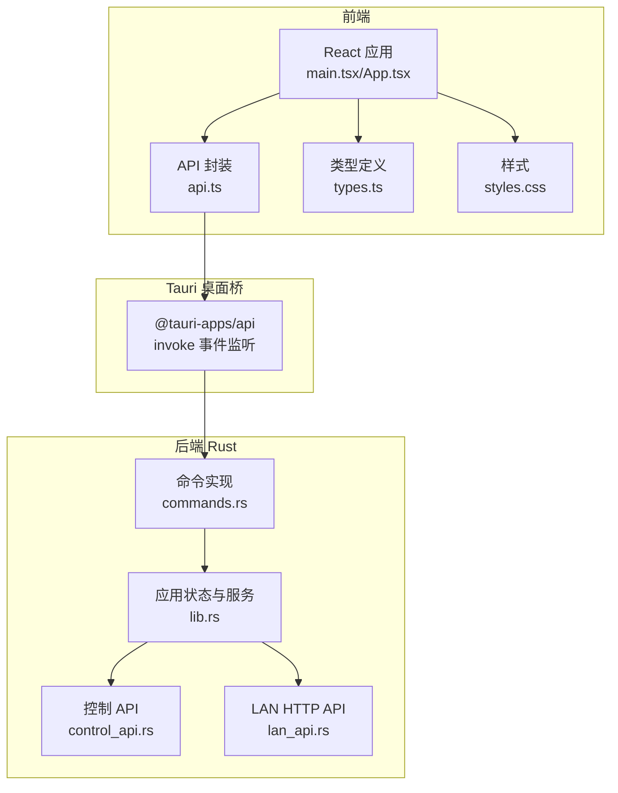
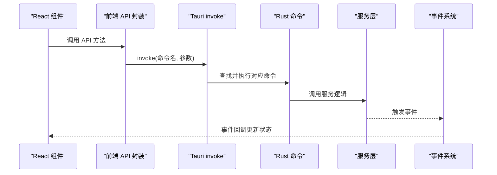
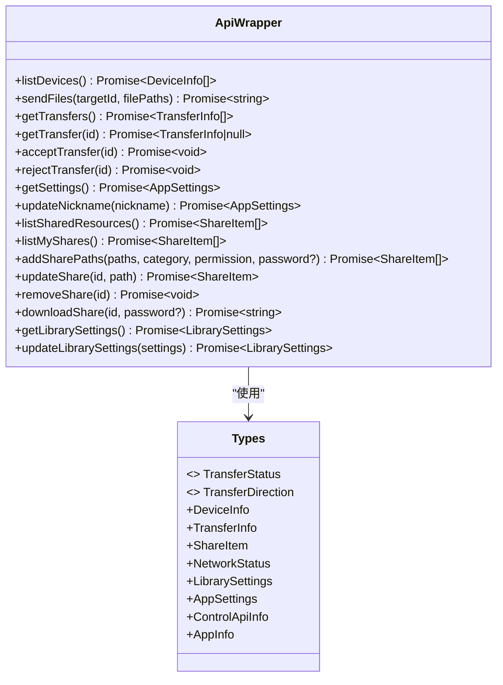
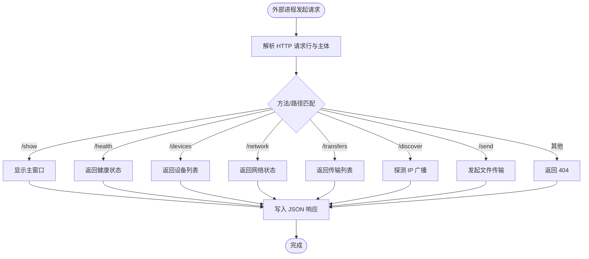
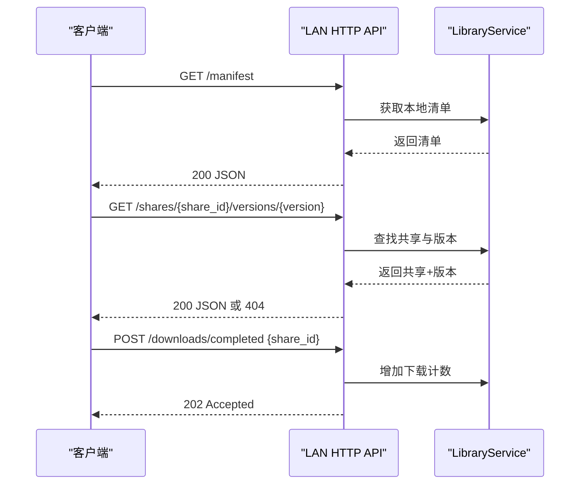
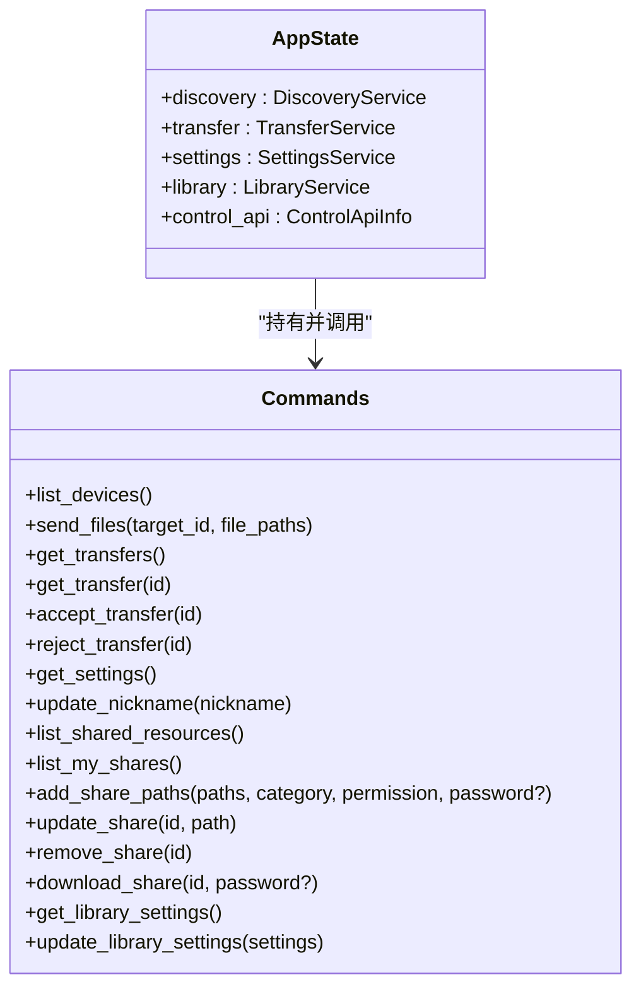
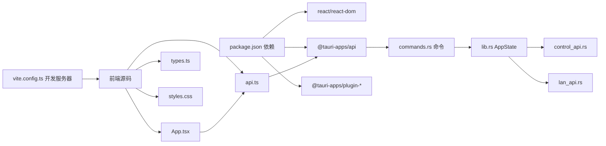

# SDK 集成指南

<cite>
**本文档引用的文件**
- [package.json](file://quicklan-main/package.json)
- [api.ts](file://quicklan-main/src/api.ts)
- [types.ts](file://quicklan-main/src/types.ts)
- [App.tsx](file://quicklan-main/src/App.tsx)
- [main.tsx](file://quicklan-main/src/main.tsx)
- [lib.rs](file://quicklan-main/src-tauri/src/lib.rs)
- [commands.rs](file://quicklan-main/src-tauri/src/commands.rs)
- [control_api.rs](file://quicklan-main/src-tauri/src/control_api.rs)
- [lan_api.rs](file://quicklan-main/src-tauri/src/lan_api.rs)
- [vite.config.ts](file://quicklan-main/vite.config.ts)
- [styles.css](file://quicklan-main/src/styles.css)
- [README.md](file://quicklan-main/README.md)
</cite>

## 目录
1. [简介](#简介)
2. [项目结构](#项目结构)
3. [核心组件](#核心组件)
4. [架构总览](#架构总览)
5. [详细组件分析](#详细组件分析)
6. [依赖关系分析](#依赖关系分析)
7. [性能考虑](#性能考虑)
8. [故障排除指南](#故障排除指南)
9. [结论](#结论)
10. [附录](#附录)

## 简介
本指南面向希望在 React 应用中集成 Work Station 项目（QuickLAN）前端 SDK 的开发者。文档涵盖：
- SDK 安装与配置
- 初始化设置与环境准备
- API 调用示例与最佳实践
- 错误处理策略
- WebSocket/事件监听与状态同步机制
- 版本兼容性与升级指南

QuickLAN 使用 Tauri 桌面框架，前端通过 @tauri-apps/api 的 invoke 机制调用后端 Rust 命令；同时提供本地控制 API 和 LAN HTTP API 支持外部集成。

## 项目结构
QuickLAN 前端采用 React + TypeScript + Vite，桌面层由 Tauri 提供，Rust 实现核心业务逻辑与网络服务。



图表来源
- [main.tsx:1-11](file://quicklan-main/src/main.tsx#L1-L11)
- [App.tsx:1-85](file://quicklan-main/src/App.tsx#L1-L85)
- [api.ts:1-130](file://quicklan-main/src/api.ts#L1-L130)
- [lib.rs:138-250](file://quicklan-main/src-tauri/src/lib.rs#L138-L250)
- [commands.rs:11-259](file://quicklan-main/src-tauri/src/commands.rs#L11-L259)
- [control_api.rs:22-147](file://quicklan-main/src-tauri/src/control_api.rs#L22-L147)
- [lan_api.rs:19-177](file://quicklan-main/src-tauri/src/lan_api.rs#L19-L177)

章节来源
- [README.md:1-54](file://quicklan-main/README.md#L1-L54)
- [package.json:1-32](file://quicklan-main/package.json#L1-L32)
- [vite.config.ts:1-15](file://quicklan-main/vite.config.ts#L1-L15)

## 核心组件
- 前端 API 封装：统一导出 invoke 包装函数，便于在 React 组件中调用。
- 类型系统：集中定义设备、传输、共享、网络等数据模型。
- 事件监听：通过 @tauri-apps/api/event 监听后端推送的设备、传输、共享等事件。
- Tauri 命令注册：后端将 Rust 函数暴露为可调用命令，前端通过 invoke 调用。
- 控制 API：本地 TCP 接口，支持外部进程触发显示窗口、发现设备、发送文件等。
- LAN HTTP API：用于获取共享清单、版本信息、报告下载完成等。

章节来源
- [api.ts:1-130](file://quicklan-main/src/api.ts#L1-L130)
- [types.ts:1-128](file://quicklan-main/src/types.ts#L1-L128)
- [App.tsx:144-178](file://quicklan-main/src/App.tsx#L144-L178)
- [lib.rs:218-246](file://quicklan-main/src-tauri/src/lib.rs#L218-L246)
- [control_api.rs:22-147](file://quicklan-main/src-tauri/src/control_api.rs#L22-L147)
- [lan_api.rs:19-177](file://quicklan-main/src-tauri/src/lan_api.rs#L19-L177)

## 架构总览
前端通过 Tauri invoke 调用后端命令，后端命令协调 Discovery、Transfer、Settings、Library 等服务，并通过事件向前端推送状态变更。同时，后端启动本地控制 API 和 LAN HTTP API，支持外部集成。



图表来源
- [App.tsx:144-178](file://quicklan-main/src/App.tsx#L144-L178)
- [api.ts:13-130](file://quicklan-main/src/api.ts#L13-L130)
- [lib.rs:218-246](file://quicklan-main/src-tauri/src/lib.rs#L218-L246)
- [commands.rs:11-259](file://quicklan-main/src-tauri/src/commands.rs#L11-L259)

## 详细组件分析

### 前端 API 封装与类型系统
- API 封装：所有 invoke 调用集中在 api.ts 中，统一返回 Promise，便于在 React 中使用 async/await。
- 类型系统：types.ts 定义了设备、传输、共享、网络、库设置等核心类型，确保前后端数据一致性。



图表来源
- [api.ts:13-130](file://quicklan-main/src/api.ts#L13-L130)
- [types.ts:1-128](file://quicklan-main/src/types.ts#L1-L128)

章节来源
- [api.ts:1-130](file://quicklan-main/src/api.ts#L1-L130)
- [types.ts:1-128](file://quicklan-main/src/types.ts#L1-L128)

### 事件监听与状态同步
- 事件订阅：在组件挂载时订阅 devices-updated、library-updated、incoming-transfer、transfer-progress、transfer-completed、transfer-failed 等事件，实时更新 UI。
- 事件解包：部分事件 payload 结构可能包含嵌套字段，需要统一解包以保证数据一致性。
- 状态管理：通过 useState 和 useEffect 组合维护设备列表、传输列表、共享列表、设置等状态。

```mermaid
sequenceDiagram
participant Comp as "React 组件"
participant Event as "事件系统"
participant API as "API 封装"
participant State as "组件状态"
Comp->>Event : listen("devices-updated", handler)
Comp->>Event : listen("library-updated", handler)
Comp->>Event : listen("incoming-transfer", handler)
Comp->>Event : listen("transfer-progress", handler)
Comp->>Event : listen("transfer-completed", handler)
Comp->>Event : listen("transfer-failed", handler)
Event-->>Comp : devices-updated(payload)
Comp->>State : setDevices(payload)
Event-->>Comp : library-updated(payload)
Comp->>State : setShares(payload)
Event-->>Comp : incoming-transfer(payload)
Comp->>State : upsertTransfer(payload.transfer)
Event-->>Comp : transfer-progress(payload)
Comp->>State : upsertTransfer(unwrap(payload))
Event-->>Comp : transfer-completed(payload)
Comp->>State : upsertTransfer(unwrap(payload)); refreshShares()
Event-->>Comp : transfer-failed(payload)
Comp->>State : upsertTransfer(unwrap(payload))
```

图表来源
- [App.tsx:144-178](file://quicklan-main/src/App.tsx#L144-L178)
- [App.tsx:73-76](file://quicklan-main/src/App.tsx#L73-L76)
- [App.tsx:208-213](file://quicklan-main/src/App.tsx#L208-L213)

章节来源
- [App.tsx:144-178](file://quicklan-main/src/App.tsx#L144-L178)
- [App.tsx:73-76](file://quicklan-main/src/App.tsx#L73-L76)
- [App.tsx:208-213](file://quicklan-main/src/App.tsx#L208-L213)

### 控制 API（本地 TCP）
- 作用：提供本地环回地址上的 TCP 接口，支持外部进程触发显示主窗口、查询设备、发起传输等。
- 访问方式：仅允许 127.0.0.1 访问，避免外网暴露风险。
- 常用接口：
  - GET /health：健康检查
  - GET /devices：获取设备列表
  - GET /network：获取网络状态
  - GET /transfers：获取传输列表
  - POST /discover：探测指定 IP
  - POST /send：向目标设备发送文件



图表来源
- [control_api.rs:22-147](file://quicklan-main/src-tauri/src/control_api.rs#L22-L147)

章节来源
- [control_api.rs:22-147](file://quicklan-main/src-tauri/src/control_api.rs#L22-L147)

### LAN HTTP API（共享清单与版本）
- 作用：提供共享清单、版本详情查询、下载完成上报等能力。
- 常用接口：
  - GET /manifest：获取本地共享清单
  - GET /shares/{share_id}/versions/{version}：获取指定共享版本详情
  - POST /downloads/completed：上报下载完成



图表来源
- [lan_api.rs:53-114](file://quicklan-main/src-tauri/src/lan_api.rs#L53-L114)

章节来源
- [lan_api.rs:53-114](file://quicklan-main/src-tauri/src/lan_api.rs#L53-L114)

### 后端命令与服务编排
- 命令注册：lib.rs 中通过 generate_handler 注册所有命令，前端通过 invoke 调用。
- 服务编排：commands.rs 实现具体业务逻辑，协调 Discovery、Transfer、Settings、Library 等服务。
- 状态管理：lib.rs 维护 AppState，包含 Discovery、Transfer、Settings、Library、ControlApiInfo。



图表来源
- [lib.rs:50-56](file://quicklan-main/src-tauri/src/lib.rs#L50-L56)
- [lib.rs:218-246](file://quicklan-main/src-tauri/src/lib.rs#L218-L246)
- [commands.rs:11-259](file://quicklan-main/src-tauri/src/commands.rs#L11-L259)

章节来源
- [lib.rs:50-56](file://quicklan-main/src-tauri/src/lib.rs#L50-L56)
- [lib.rs:218-246](file://quicklan-main/src-tauri/src/lib.rs#L218-L246)
- [commands.rs:11-259](file://quicklan-main/src-tauri/src/commands.rs#L11-L259)

## 依赖关系分析
- 前端依赖：React、TypeScript、Vite、@tauri-apps/api、@tauri-apps 插件等。
- 构建与开发：Vite 提供开发服务器与构建工具链；Tauri CLI 用于打包桌面应用。
- 端口规划：UDP 45454（发现）、TCP 45455-45474（传输）、TCP 45457-45476（LAN HTTP）、TCP 127.0.0.1:45456（控制 API）。



图表来源
- [package.json:15-30](file://quicklan-main/package.json#L15-L30)
- [vite.config.ts:4-14](file://quicklan-main/vite.config.ts#L4-L14)
- [lib.rs:138-250](file://quicklan-main/src-tauri/src/lib.rs#L138-L250)

章节来源
- [package.json:15-30](file://quicklan-main/package.json#L15-L30)
- [vite.config.ts:4-14](file://quicklan-main/vite.config.ts#L4-L14)
- [README.md:43-48](file://quicklan-main/README.md#L43-L48)

## 性能考虑
- 批量操作：在一次渲染周期内通过 Promise.all 并行拉取多个数据源，减少等待时间。
- 事件驱动：通过事件流实时更新 UI，避免轮询带来的开销。
- 传输列表截断：限制传输记录数量，防止内存膨胀。
- 端口复用：LAN HTTP API 在一定范围内寻找可用端口，提高部署成功率。

章节来源
- [App.tsx:180-200](file://quicklan-main/src/App.tsx#L180-L200)
- [App.tsx:208-213](file://quicklan-main/src/App.tsx#L208-L213)
- [lan_api.rs:19-51](file://quicklan-main/src-tauri/src/lan_api.rs#L19-L51)

## 故障排除指南
- 端口冲突
  - 现象：LAN HTTP API 或控制 API 启动失败。
  - 处理：检查端口占用情况，调整端口范围或释放占用端口。
  - 参考：端口范围定义与绑定逻辑。
- 事件未触发
  - 现象：设备列表、传输进度不更新。
  - 处理：确认事件监听是否正确注册与注销；检查后端事件触发逻辑。
  - 参考：事件监听与解包流程。
- 传输失败
  - 现象：传输状态异常或失败。
  - 处理：查看传输失败事件 payload，结合日志定位原因；必要时重试或清理已完成记录。
  - 参考：传输相关命令与事件。
- 控制 API 访问被拒绝
  - 现象：外部进程无法通过 127.0.0.1 访问控制 API。
  - 处理：确认仅从本地环回地址访问；检查防火墙与安全策略。
  - 参考：控制 API 仅接受环回地址连接的实现。

章节来源
- [lan_api.rs:19-51](file://quicklan-main/src-tauri/src/lan_api.rs#L19-L51)
- [App.tsx:144-178](file://quicklan-main/src/App.tsx#L144-L178)
- [App.tsx:208-213](file://quicklan-main/src/App.tsx#L208-L213)
- [control_api.rs:38-43](file://quicklan-main/src-tauri/src/control_api.rs#L38-L43)

## 结论
QuickLAN 的前端 SDK 通过 Tauri 的 invoke 机制与 Rust 后端紧密协作，提供设备发现、点对点传输、共享库管理、事件驱动的状态同步以及本地控制与 LAN HTTP API 支持。按照本文档的集成步骤与最佳实践，可在 React 应用中高效地使用该 SDK，并获得稳定的用户体验。

## 附录

### 安装与初始化
- 安装依赖
  - 使用 npm/yarn/pnpm 安装项目依赖。
- 启动开发
  - 使用 Vite 开发服务器与 Tauri 开发模式运行应用。
- 环境要求
  - Node.js、Rust 工具链、Tauri CLI。

章节来源
- [README.md:24-35](file://quicklan-main/README.md#L24-L35)
- [package.json:7-14](file://quicklan-main/package.json#L7-L14)
- [vite.config.ts:4-14](file://quicklan-main/vite.config.ts#L4-L14)

### API 调用示例（路径指引）
- 获取设备列表
  - 路径：[api.ts:13-15](file://quicklan-main/src/api.ts#L13-L15)
- 发送文件
  - 路径：[api.ts:21-23](file://quicklan-main/src/api.ts#L21-L23)
- 获取传输列表
  - 路径：[api.ts:33-35](file://quicklan-main/src/api.ts#L33-L35)
- 接受/拒绝传输
  - 路径：[api.ts:25-31](file://quicklan-main/src/api.ts#L25-L31)
- 更新设备备注
  - 路径：[api.ts:17-19](file://quicklan-main/src/api.ts#L17-L19)
- 获取设置与更新昵称
  - 路径：[api.ts:57-63](file://quicklan-main/src/api.ts#L57-L63)
- 共享资源管理
  - 路径：[api.ts:89-129](file://quicklan-main/src/api.ts#L89-L129)

### 错误处理策略
- 统一 try/catch 包裹异步操作，设置错误状态并在 UI 展示。
- 对于用户输入校验（如缺少目标设备、未选择文件），抛出明确错误信息。
- 使用 runAction 封装动作执行流程，自动处理忙碌态与错误提示。

章节来源
- [App.tsx:234-245](file://quicklan-main/src/App.tsx#L234-L245)
- [App.tsx:314-344](file://quicklan-main/src/App.tsx#L314-L344)

### WebSocket/事件监听与状态同步
- 事件订阅：在组件挂载时订阅多类事件，确保状态实时更新。
- 事件解包：统一处理 payload 结构差异，保证数据一致性。
- 状态更新：通过 upsertTransfer 等方法合并最新传输状态，限制列表长度。

章节来源
- [App.tsx:144-178](file://quicklan-main/src/App.tsx#L144-L178)
- [App.tsx:73-76](file://quicklan-main/src/App.tsx#L73-L76)
- [App.tsx:208-213](file://quicklan-main/src/App.tsx#L208-L213)

### 版本兼容性与升级指南
- 当前版本：0.1.1
- 升级建议：
  - 前端：保持 @tauri-apps/api 与 @tauri-apps 插件版本一致，遵循 Tauri v2 生态。
  - 后端：升级 Rust 工具链与 Tauri CLI，注意命令签名与事件名称变更。
  - 端口与协议：若新增或变更端口，请同步更新前端与外部集成逻辑。

章节来源
- [README.md:50-52](file://quicklan-main/README.md#L50-L52)
- [package.json:15-30](file://quicklan-main/package.json#L15-L30)