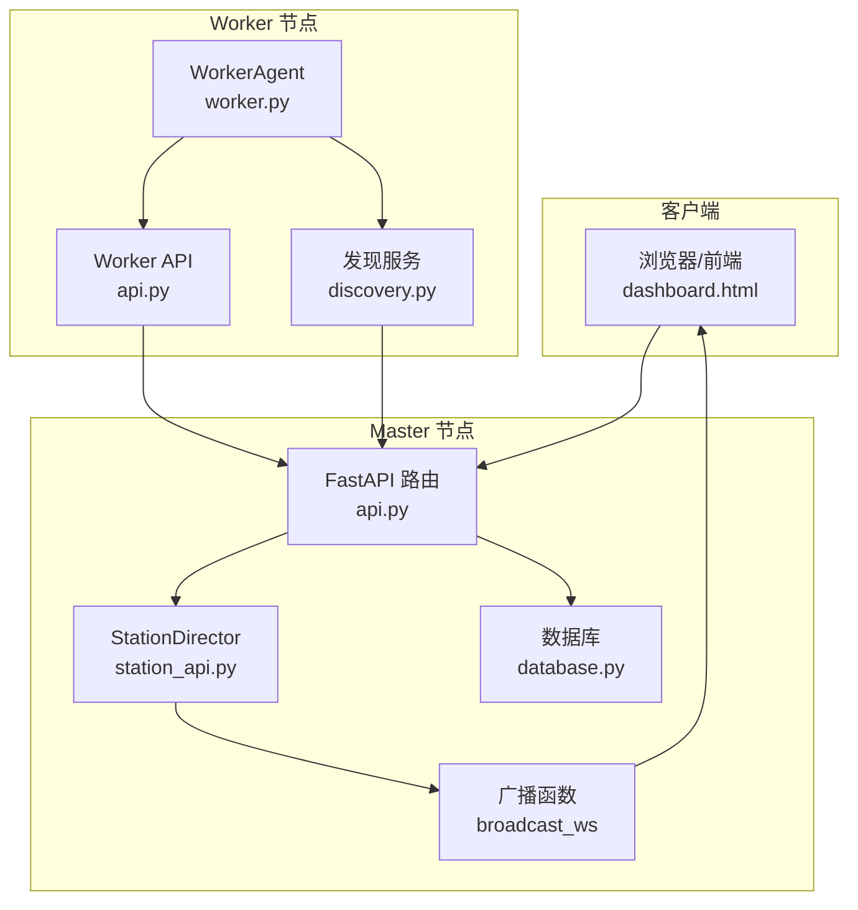
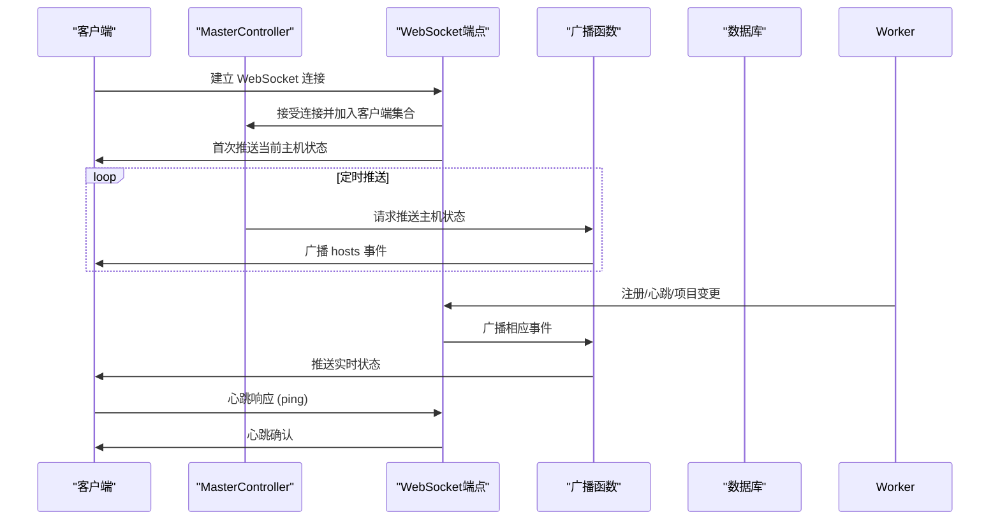
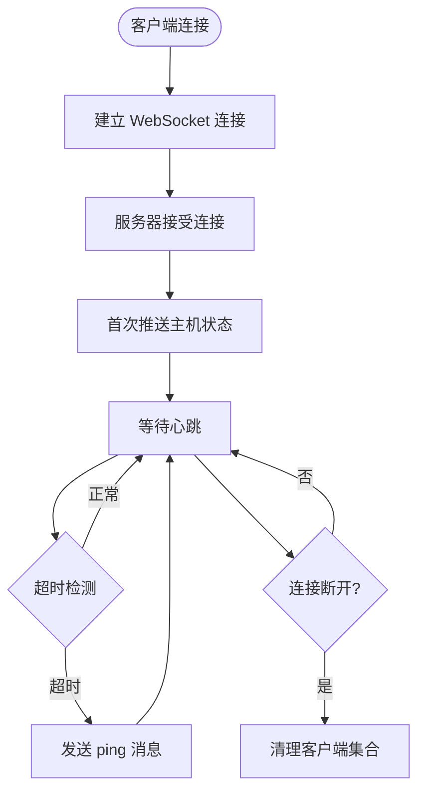
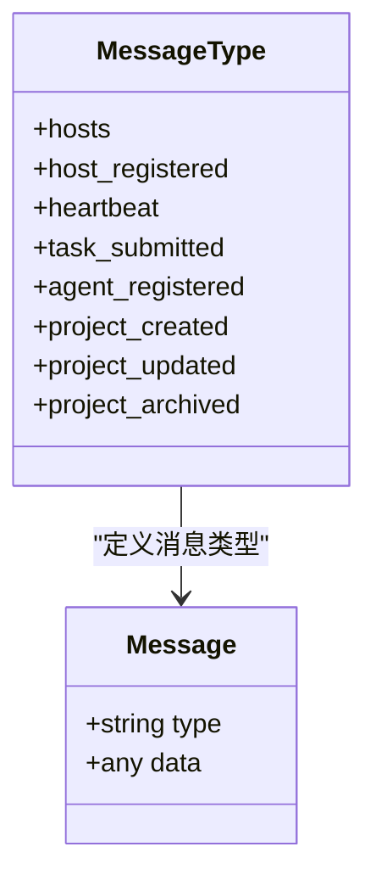
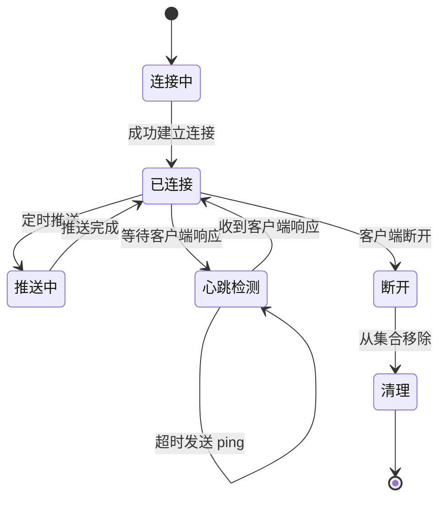
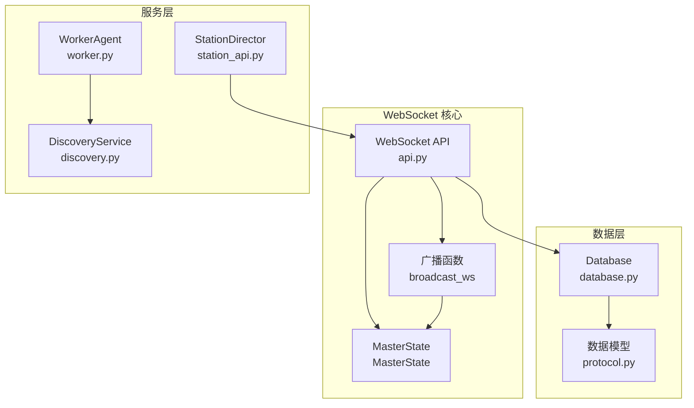

# WebSocket API 规范

<cite>
**本文引用的文件**
- [main.py](file://main.py)
- [api.py](file://lan_mesh/api.py)
- [station_api.py](file://lan_mesh/station_api.py)
- [worker.py](file://lan_mesh/worker.py)
- [protocol.py](file://lan_mesh/protocol.py)
- [database.py](file://lan_mesh/database.py)
- [discovery.py](file://lan_mesh/discovery.py)
- [host_info.py](file://lan_mesh/host_info.py)
- [shared_folder.py](file://lan_mesh/shared_folder.py)
- [dashboard.html](file://lan_mesh/web/templates/dashboard.html)
</cite>

## 目录
1. [简介](#简介)
2. [项目结构](#项目结构)
3. [核心组件](#核心组件)
4. [架构概览](#架构概览)
5. [详细组件分析](#详细组件分析)
6. [依赖关系分析](#依赖关系分析)
7. [性能考虑](#性能考虑)
8. [故障排除指南](#故障排除指南)
9. [结论](#结论)
10. [附录](#附录)

## 简介
本规范定义了 Work Station 项目中 WebSocket API 的完整实现，包括连接建立流程、消息格式、事件类型、实时推送机制以及客户端集成示例。系统采用 Master/Worker 架构，通过 WebSocket 实时推送主机状态变化，支持心跳检测、连接管理与错误恢复。

## 项目结构
Work Station 项目采用模块化设计，WebSocket 功能主要分布在以下模块：
- API 层：提供 WebSocket 端点与消息广播
- Master 控制器：管理 WebSocket 客户端集合与定时推送
- Worker 节点：向 Master 发送注册与心跳
- 协议定义：统一的数据模型与事件类型
- 数据库：持久化主机状态与心跳日志
- 发现服务：UDP 广播发现与设备管理

**图表来源**
- [api.py:500-539](file://lan_mesh/api.py#L500-L539)
- [station_api.py](file://lan_mesh/station_api.py#L55-L65)
- [worker.py:62-71](file://lan_mesh/worker.py#L62-L71)

**章节来源**
- [main.py:1-90](file://main.py#L1-L90)
- [api.py:1-539](file://lan_mesh/api.py#L1-L539)
- [station_api.py](file://lan_mesh/station_api.py#L1-L324)
- [worker.py:1-325](file://lan_mesh/worker.py#L1-L325)

## 核心组件
WebSocket API 的核心组件包括：
- WebSocket 端点：/ws，用于实时推送主机状态
- 广播机制：向所有连接的客户端推送消息
- 心跳管理：客户端 ping/pong 与服务器心跳检测
- 状态推送：主机注册、心跳、项目变更等事件
- 连接管理：客户端集合维护与断线清理

**章节来源**
- [api.py:500-539](file://lan_mesh/api.py#L500-L539)
- [station_api.py](file://lan_mesh/station_api.py#L55-L65)

## 架构概览
WebSocket 架构采用客户端-服务器模式，Master 节点作为服务器，Worker 节点与浏览器客户端作为客户端。消息流通过广播函数分发到所有连接的客户端。

**图表来源**
- [api.py:500-539](file://lan_mesh/api.py#L500-L539)
- [station_api.py](file://lan_mesh/station_api.py#L175-L184)

## 详细组件分析

### WebSocket 连接与消息格式
WebSocket 端点位于 /ws，采用 JSON 消息格式，包含 type 与 data 字段：
- type：消息类型标识符
- data：具体数据内容

客户端连接流程：
1. 建立 WebSocket 连接到 ws://host:port/ws
2. 服务器接受连接并加入客户端集合
3. 首次推送当前主机状态
4. 服务器定期推送主机状态
5. 客户端发送心跳响应

**图表来源**
- [api.py:500-525](file://lan_mesh/api.py#L500-L525)

**章节来源**
- [api.py:500-539](file://lan_mesh/api.py#L500-L539)
- [dashboard.html:195-208](file://lan_mesh/web/templates/dashboard.html#L195-L208)

### 消息类型与事件定义
系统支持以下消息类型：

#### 主机状态相关
- hosts：推送所有主机的当前状态列表
- host_registered：新主机注册事件
- heartbeat：主机心跳更新事件

#### 任务管理相关
- task_submitted：新任务提交事件

#### Agent 管理相关
- agent_registered：Agent 注册事件

#### 项目管理相关
- project_created：项目创建事件
- project_updated：项目更新事件
- project_archived：项目归档事件

**图表来源**
- [api.py:116-168](file://lan_mesh/api.py#L116-L168)
- [api.py:268-298](file://lan_mesh/api.py#L268-L298)
- [api.py:347-411](file://lan_mesh/api.py#L347-L411)

**章节来源**
- [api.py:116-168](file://lan_mesh/api.py#L116-L168)
- [api.py:268-298](file://lan_mesh/api.py#L268-L298)
- [api.py:347-411](file://lan_mesh/api.py#L347-L411)

### 数据结构定义
系统使用统一的数据模型：

#### 主机信息模型
- HostInfo：完整主机配置信息
- HostRecord：数据库中的主机记录
- DiscoveryPacket：UDP 发现包

#### Agent 能力模型
- AgentCard：Agent 能力卡片
- Skill：技能声明
- ToolDef：工具定义

#### 任务模型
- Task：顶层任务
- SubTask：子任务
- TaskStatus：任务状态枚举

**章节来源**
- [protocol.py:69-147](file://lan_mesh/protocol.py#L69-L147)
- [protocol.py:202-234](file://lan_mesh/protocol.py#L202-L234)
- [protocol.py:249-297](file://lan_mesh/protocol.py#L249-L297)

### 连接管理策略
MasterController 维护 WebSocket 客户端集合，采用以下策略：
- 客户端集合：使用集合类型存储活动连接
- 断线清理：自动移除异常断开的客户端
- 心跳检测：超时未响应时发送 ping 消息
- 定时推送：每 3 秒推送一次主机状态

**图表来源**
- [station_api.py](file://lan_mesh/station_api.py#L55-L65)
- [api.py:514-524](file://lan_mesh/api.py#L514-L524)

**章节来源**
- [station_api.py](file://lan_mesh/station_api.py#L55-L65)
- [api.py:514-524](file://lan_mesh/api.py#L514-L524)

### 心跳机制
系统实现双层心跳机制：

#### 服务器端心跳
- 定时推送：Master 每 3 秒推送一次主机状态
- 客户端超时：服务器端 30 秒超时检测
- 心跳响应：超时后发送 ping 消息

#### 客户端心跳
- 客户端实现：浏览器端每 3 秒发送心跳
- 自动重连：断线后 3 秒自动重连
- 状态指示：实时显示 WebSocket 连接状态

**章节来源**
- [station_api.py](file://lan_mesh/station_api.py#L175-L184)
- [api.py:514-518](file://lan_mesh/api.py#L514-L518)
- [dashboard.html:195-208](file://lan_mesh/web/templates/dashboard.html#L195-L208)

### 实时推送机制
实时推送通过广播函数实现：
- 广播范围：向所有活动的 WebSocket 客户端推送
- 错误处理：自动清理异常客户端
- 数据格式：统一的 JSON 消息格式

推送触发时机：
- 主机注册：host_registered
- 心跳更新：heartbeat  
- 项目变更：project_created/project_updated/project_archived
- 任务提交：task_submitted
- Agent 注册：agent_registered

**章节来源**
- [api.py:529-539](file://lan_mesh/api.py#L529-L539)
- [api.py:145-146](file://lan_mesh/api.py#L145-L146)
- [api.py:167-167](file://lan_mesh/api.py#L167-L167)
- [api.py:279-279](file://lan_mesh/api.py#L279-L279)
- [api.py:325-325](file://lan_mesh/api.py#L325-L325)
- [api.py:400-400](file://lan_mesh/api.py#L400-L400)

## 依赖关系分析

**图表来源**
- [api.py:529-539](file://lan_mesh/api.py#L529-L539)
- [station_api.py](file://lan_mesh/station_api.py#L55-L65)
- [database.py:16-27](file://lan_mesh/database.py#L16-L27)
- [protocol.py:1-356](file://lan_mesh/protocol.py#L1-L356)

**章节来源**
- [api.py:32-35](file://lan_mesh/api.py#L32-L35)
- [station_api.py](file://lan_mesh/station_api.py#L32-L46)
- [database.py:16-27](file://lan_mesh/database.py#L16-L27)

## 性能考虑
WebSocket API 在设计时考虑了以下性能因素：
- 连接池管理：使用集合类型存储客户端，支持快速查找与删除
- 异步处理：基于 asyncio 的异步 I/O 操作
- 内存优化：及时清理异常断开的客户端连接
- 频率控制：3 秒定时推送，避免过度网络负载
- 错误恢复：自动重连机制，提高系统稳定性

## 故障排除指南
常见问题与解决方案：

### 连接问题
- 无法建立连接：检查端口是否正确开放
- 连接频繁断开：检查网络稳定性与防火墙设置
- 超时错误：确认客户端心跳机制正常

### 消息接收问题
- 消息格式错误：确保遵循 JSON 格式规范
- 类型识别失败：检查消息类型字段是否正确
- 数据解析异常：验证数据结构与字段完整性

### 性能问题
- 推送延迟：调整推送频率或优化客户端处理逻辑
- 内存泄漏：定期检查客户端集合清理机制
- 网络拥塞：减少推送频率或增加带宽

**章节来源**
- [api.py:514-524](file://lan_mesh/api.py#L514-L524)
- [dashboard.html:195-208](file://lan_mesh/web/templates/dashboard.html#L195-L208)

## 结论
Work Station 项目的 WebSocket API 提供了完整的实时通信能力，支持多客户端连接、事件推送与状态同步。通过合理的架构设计与错误处理机制，系统能够稳定地处理大量并发连接，并提供可靠的实时数据推送服务。建议在生产环境中根据实际负载情况调整推送频率与连接数量限制。

## 附录

### 客户端连接示例
浏览器端连接实现：
- 使用原生 WebSocket API
- 自动处理重连逻辑
- 实时更新界面状态

### 消息发送/接收代码
服务器端消息处理：
- 接受客户端消息
- 处理心跳响应
- 广播实时状态

### 错误处理策略
- 异常捕获与记录
- 客户端自动清理
- 连接状态监控
- 重连机制实现

**章节来源**
- [dashboard.html:195-208](file://lan_mesh/web/templates/dashboard.html#L195-L208)
- [api.py:514-524](file://lan_mesh/api.py#L514-L524)
