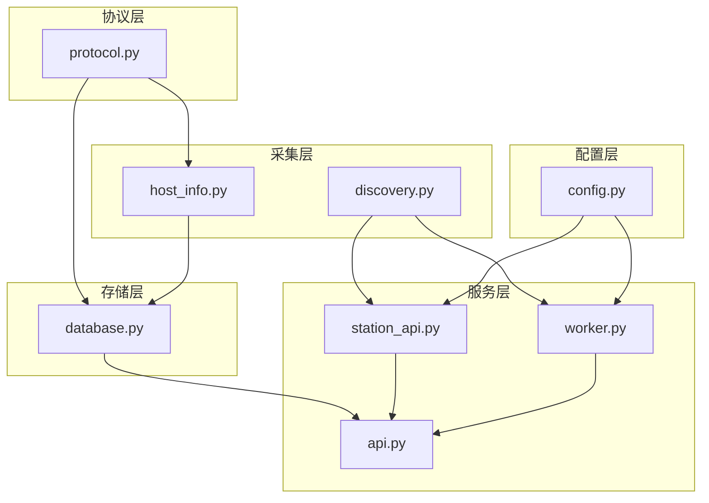
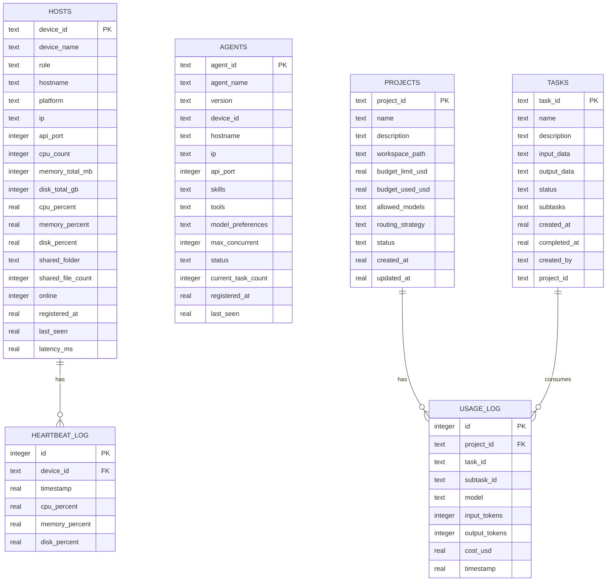
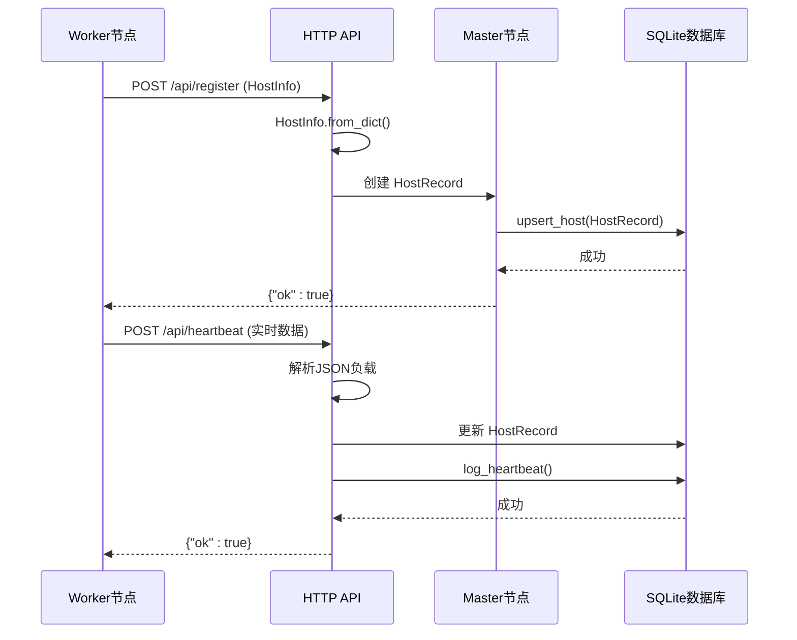
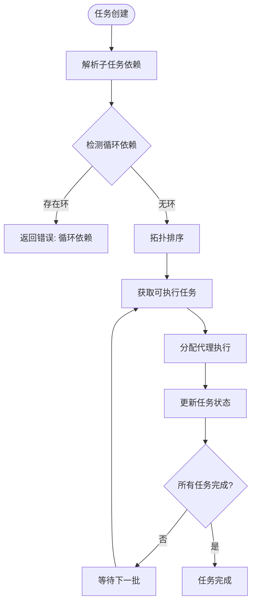
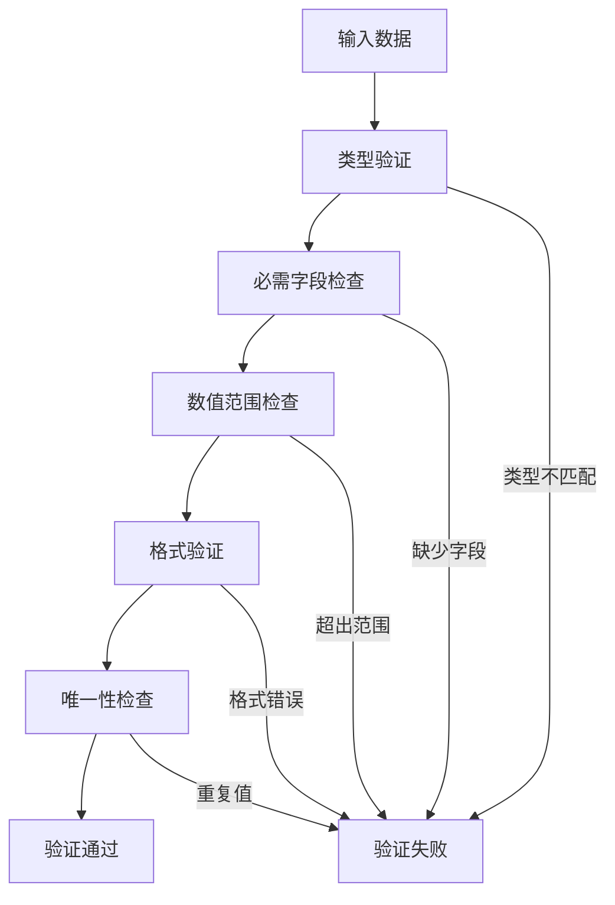
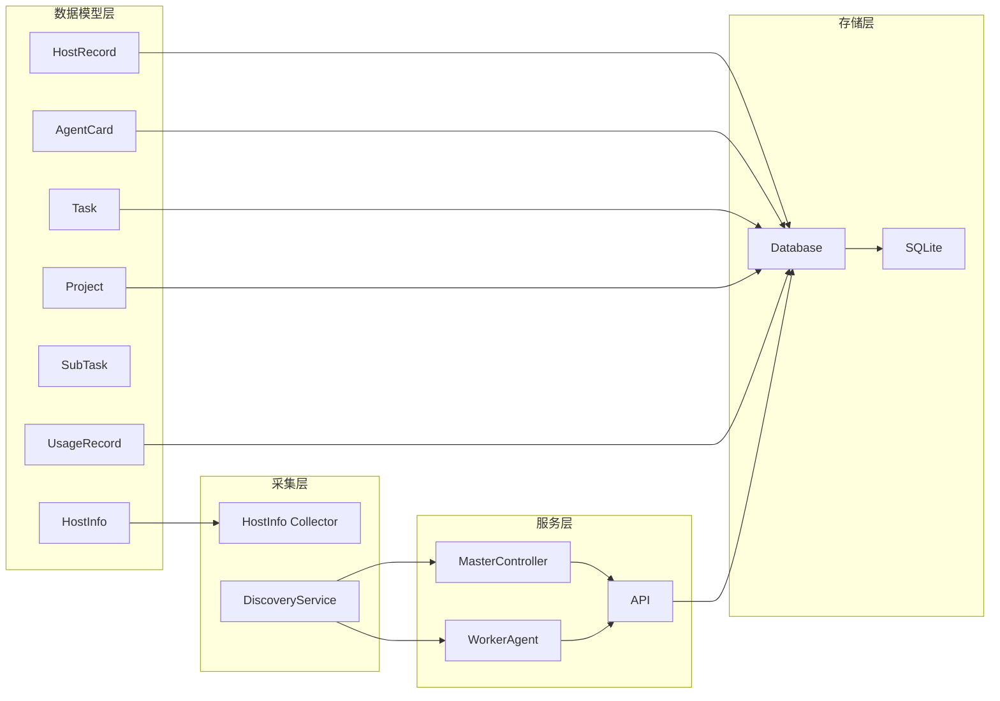

# 数据模型定义

<cite>
**本文引用的文件**
- [protocol.py](file://lan_mesh/protocol.py)
- [host_info.py](file://lan_mesh/host_info.py)
- [agent_card.py](file://lan_mesh/agent_card.py)
- [task.py](file://lan_mesh/task.py)
- [database.py](file://lan_mesh/database.py)
- [api.py](file://lan_mesh/api.py)
- [station_api.py](file://lan_mesh/station_api.py)
- [worker.py](file://lan_mesh/worker.py)
- [config.py](file://lan_mesh/config.py)
</cite>

## 目录
1. [简介](#简介)
2. [项目结构](#项目结构)
3. [核心数据模型](#核心数据模型)
4. [架构概览](#架构概览)
5. [详细组件分析](#详细组件分析)
6. [依赖关系分析](#依赖关系分析)
7. [性能考虑](#性能考虑)
8. [故障排除指南](#故障排除指南)
9. [结论](#结论)

## 简介
Work Station 项目是一个基于局域网的分布式计算平台，采用 Master/Worker 架构实现设备发现、资源管理和任务调度。本文档详细定义了系统的核心数据模型，包括主机信息、代理卡片、任务管理等关键实体的数据结构、约束条件和业务含义。

## 项目结构
项目采用模块化设计，主要分为以下层次：
- 协议层：定义数据模型和通信协议
- 采集层：负责主机信息收集和网络发现
- 存储层：基于 SQLite 的持久化存储
- 服务层：FastAPI 提供的 HTTP API
- 控制层：Master/Worker 控制器协调各组件

**图表来源**
- [protocol.py:1-356](file://lan_mesh/protocol.py#L1-L356)
- [host_info.py:1-212](file://lan_mesh/host_info.py#L1-L212)
- [database.py:1-611](file://lan_mesh/database.py#L1-L611)
- [api.py:1-539](file://lan_mesh/api.py#L1-L539)
- [station_api.py](file://lan_mesh/station_api.py#L1-L324)
- [worker.py:1-325](file://lan_mesh/worker.py#L1-L325)
- [config.py:1-84](file://lan_mesh/config.py#L1-L84)

**章节来源**
- [protocol.py:1-356](file://lan_mesh/protocol.py#L1-L356)
- [host_info.py:1-212](file://lan_mesh/host_info.py#L1-L212)
- [database.py:1-611](file://lan_mesh/database.py#L1-L611)
- [api.py:1-539](file://lan_mesh/api.py#L1-L539)
- [station_api.py](file://lan_mesh/station_api.py#L1-L324)
- [worker.py:1-325](file://lan_mesh/worker.py#L1-L325)
- [config.py:1-84](file://lan_mesh/config.py#L1-L84)

## 核心数据模型

### HostInfo 主机信息模型
HostInfo 是 Worker 节点上报给 Master 的完整主机配置信息，包含硬件、软件和运行时状态。

**字段定义：**
- device_id: 字符串，设备唯一标识符
- device_name: 字符串，设备显示名称
- role: 字符串，设备角色（master/worker）
- hostname: 字符串，主机名
- platform: 字串，操作系统平台
- platform_release: 字符串，平台版本
- architecture: 字符串，CPU 架构
- python_version: 字符串，Python 版本
- cpu_count: 整数，CPU 核心数
- cpu_percent: 浮点数，CPU 使用率百分比
- cpu_freq_mhz: 浮点数，CPU 频率（MHz）
- memory_total_mb: 整数，总内存（MB）
- memory_available_mb: 整数，可用内存（MB）
- memory_percent: 浮点数，内存使用率百分比
- disk_total_gb: 整数，磁盘总量（GB）
- disk_used_gb: 整数，已用磁盘（GB）
- disk_free_gb: 整数，剩余磁盘（GB）
- disk_percent: 浮点数，磁盘使用率百分比
- ip_addresses: 字符串数组，本地IPv4地址列表
- mac_address: 字符串，MAC 地址
- shared_folder: 字符串，共享文件夹路径
- shared_file_count: 整数，共享文件数量
- api_port: 整数，API 端口号
- uptime_seconds: 浮点数，运行时长（秒）
- timestamp: 浮点数，时间戳

**业务含义：**
- 提供完整的主机硬件画像
- 支持资源监控和负载均衡
- 用于设备发现和网络拓扑构建

**章节来源**
- [protocol.py:69-111](file://lan_mesh/protocol.py#L69-L111)
- [host_info.py:129-191](file://lan_mesh/host_info.py#L129-L191)

### HostRecord 主机注册记录
HostRecord 是 Master 端维护的主机注册记录，包含在线状态和最后心跳时间。

**字段定义：**
- device_id: 字符串，设备唯一标识符
- device_name: 字符串，设备显示名称
- role: 字符串，设备角色
- hostname: 字符串，主机名
- platform: 字符串，操作系统平台
- ip: 字符串，设备IP地址
- api_port: 整数，API 端口号
- cpu_count: 整数，CPU 核心数
- memory_total_mb: 整数，总内存（MB）
- disk_total_gb: 整数，磁盘总量（GB）
- cpu_percent: 浮点数，CPU 使用率百分比
- memory_percent: 浮点数，内存使用率百分比
- disk_percent: 浮点数，磁盘使用率百分比
- shared_folder: 字符串，共享文件夹路径
- shared_file_count: 整数，共享文件数量
- online: 布尔值，在线状态
- registered_at: 浮点数，注册时间戳
- last_seen: 浮点数，最后活跃时间戳
- latency_ms: 可选浮点数，网络延迟（毫秒）

**业务含义：**
- 维护设备注册状态
- 支持设备离线检测和清理
- 提供设备历史监控数据

**章节来源**
- [protocol.py:115-147](file://lan_mesh/protocol.py#L115-L147)
- [database.py:147-192](file://lan_mesh/database.py#L147-L192)

### NetworkStatus 网络状态
NetworkStatus 记录本机网络状态快照，用于网络诊断和发现。

**字段定义：**
- udp_port: 整数，默认 45454，UDP 广播端口
- api_port: 整数，API 端口号
- local_ips: 字符串数组，本地IP地址列表
- broadcast_targets: 字符串数组，广播目标地址列表

**业务含义：**
- 支持UDP发现协议
- 提供网络连通性诊断
- 用于设备间通信建立

**章节来源**
- [protocol.py:150-157](file://lan_mesh/protocol.py#L150-L157)

### AgentCard 代理卡片
AgentCard 借鉴 A2A 协议的代理卡片机制，描述 Worker 的能力声明。

**字段定义：**
- agent_id: 字符串，代理唯一标识符
- agent_name: 字符串，代理名称
- version: 字符串，默认 "0.1.0"，版本号
- device_id: 字符串，宿主设备ID
- hostname: 字符串，宿主主机名
- ip: 字符串，宿主IP地址
- api_port: 整数，API 端口号
- skills: 技能列表，描述代理可处理的任务类型
- tools: 工具列表，代理可调用的外部工具
- model_preferences: 字符串数组，模型偏好列表
- max_concurrent_tasks: 整数，默认 5，最大并发任务数
- status: 字符串，默认 "idle"，运行状态
- current_task_count: 整数，默认 0，当前任务数量
- registered_at: 浮点数，注册时间戳
- last_seen: 浮点数，最后活跃时间戳

**业务含义：**
- 描述代理的能力范围
- 支持智能任务匹配和分发
- 提供代理健康状态监控

**章节来源**
- [protocol.py:202-234](file://lan_mesh/protocol.py#L202-L234)
- [agent_card.py:167-217](file://lan_mesh/agent_card.py#L167-L217)

### Task 任务模型
Task 模型借鉴 A2A 协议的任务生命周期和有向无环图（DAG）结构。

**TaskStatus 状态枚举：**
- PENDING: 待处理
- ASSIGNED: 已分配
- RUNNING: 执行中
- COMPLETED: 已完成
- FAILED: 已失败
- CANCELLED: 已取消

**SubTask 子任务：**
- subtask_id: 字符串，子任务唯一标识符
- parent_task_id: 字符串，父任务ID
- name: 字符串，子任务名称
- description: 字符串，任务描述
- required_skill: 字符串，所需技能名称
- input_data: 字典，输入数据
- output_data: 字典，输出数据
- status: 字符串，默认 "pending"，任务状态
- assigned_agent_id: 字符串，默认空，分配的代理ID
- depends_on: 字符串数组，默认空，前置依赖任务列表
- created_at: 浮点数，默认当前时间，创建时间戳
- started_at: 浮点数，默认 0，开始时间戳
- completed_at: 浮点数，默认 0，完成时间戳
- error: 字符串，默认空，错误信息

**Task 顶层任务：**
- task_id: 字符串，任务唯一标识符
- name: 字符串，任务名称
- description: 字符串，任务描述
- input_data: 字典，默认空字典，输入数据
- output_data: 字典，默认空字典，输出数据
- status: 字符串，默认 "pending"，任务状态
- subtasks: 子任务列表，默认空列表
- created_at: 浮点数，默认当前时间，创建时间戳
- completed_at: 浮点数，默认 0，完成时间戳
- created_by: 字符串，默认 "user"，创建者
- project_id: 字符串，默认空，关联项目ID

**业务含义：**
- 支持复杂任务的分解和并行执行
- 提供任务依赖关系管理
- 支持任务状态跟踪和错误处理

**章节来源**
- [protocol.py:237-297](file://lan_mesh/protocol.py#L237-L297)
- [task.py:16-91](file://lan_mesh/task.py#L16-L91)

### Project 项目模型
Project 模型提供项目隔离功能，支持多项目并行管理。

**ProjectStatus 状态枚举：**
- ACTIVE: 活跃
- SUSPENDED: 暂停
- ARCHIVED: 归档

**Project 字段：**
- project_id: 字符串，项目唯一标识符
- name: 字符串，项目名称
- description: 字符串，项目描述
- workspace_path: 字符串，工作空间路径
- budget_limit_usd: 浮点数，默认 0.0，预算上限（美元）
- budget_used_usd: 浮点数，默认 0.0，已使用预算（美元）
- allowed_models: 字符串数组，默认空列表，允许的模型ID列表
- routing_strategy: 字符串，默认 "balanced"，路由策略
- status: 字符串，默认 "active"，项目状态
- created_at: 浮点数，默认当前时间，创建时间戳
- updated_at: 浮点数，默认当前时间，更新时间戳

**业务含义：**
- 实现项目间的上下文隔离
- 支持预算管理和成本控制
- 提供独立的模型使用策略

**章节来源**
- [protocol.py:300-335](file://lan_mesh/protocol.py#L300-L335)

### UsageRecord 消费记录
UsageRecord 用于追踪模型调用的消费情况。

**字段定义：**
- project_id: 字符串，项目ID
- task_id: 字符串，默认空，任务ID
- subtask_id: 字符串，默认空，子任务ID
- model: 字符串，默认空，使用的模型名称
- input_tokens: 整数，默认 0，输入令牌数
- output_tokens: 整数，默认 0，输出令牌数
- cost_usd: 浮点数，默认 0.0，本次调用成本（美元）
- timestamp: 浮点数，默认当前时间，时间戳

**业务含义：**
- 支持项目级成本追踪
- 提供详细的使用统计
- 支持预算预警和控制

**章节来源**
- [protocol.py:337-355](file://lan_mesh/protocol.py#L337-L355)

## 架构概览

**图表来源**
- [database.py:39-143](file://lan_mesh/database.py#L39-L143)

## 详细组件分析

### 数据模型序列化/反序列化规则

**图表来源**
- [api.py:116-168](file://lan_mesh/api.py#L116-L168)
- [database.py:147-201](file://lan_mesh/database.py#L147-L201)

**章节来源**
- [api.py:116-168](file://lan_mesh/api.py#L116-L168)
- [database.py:147-201](file://lan_mesh/database.py#L147-L201)

### 任务调度流程

**图表来源**
- [task.py:35-78](file://lan_mesh/task.py#L35-L78)

**章节来源**
- [task.py:16-91](file://lan_mesh/task.py#L16-L91)

### 数据验证逻辑

**图表来源**
- [protocol.py:69-111](file://lan_mesh/protocol.py#L69-L111)
- [database.py:147-192](file://lan_mesh/database.py#L147-L192)

**章节来源**
- [protocol.py:69-111](file://lan_mesh/protocol.py#L69-L111)
- [database.py:147-192](file://lan_mesh/database.py#L147-L192)

## 依赖关系分析

**图表来源**
- [protocol.py:1-356](file://lan_mesh/protocol.py#L1-L356)
- [database.py:1-611](file://lan_mesh/database.py#L1-L611)
- [api.py:1-539](file://lan_mesh/api.py#L1-L539)
- [station_api.py](file://lan_mesh/station_api.py#L1-L324)
- [worker.py:1-325](file://lan_mesh/worker.py#L1-L325)

**章节来源**
- [protocol.py:1-356](file://lan_mesh/protocol.py#L1-L356)
- [database.py:1-611](file://lan_mesh/database.py#L1-L611)
- [api.py:1-539](file://lan_mesh/api.py#L1-L539)
- [station_api.py](file://lan_mesh/station_api.py#L1-L324)
- [worker.py:1-325](file://lan_mesh/worker.py#L1-L325)

## 性能考虑
- **数据库优化**：使用索引优化常用查询（任务状态、代理状态、项目状态）
- **内存管理**：采用数据类避免不必要的对象创建
- **网络效率**：UDP广播减少HTTP请求开销
- **并发处理**：多线程心跳循环和WebSocket推送
- **缓存策略**：代理卡片快照减少频繁查询

## 故障排除指南

### 常见问题及解决方案

**设备无法注册**
- 检查 UDP 端口 45454 是否被占用
- 验证网络连通性和防火墙设置
- 确认 Master 服务正常运行

**心跳丢失**
- 检查 Worker 与 Master 的网络连接
- 验证时间同步（NTP）
- 查看数据库连接状态

**任务执行失败**
- 检查代理能力匹配
- 验证子任务依赖关系
- 查看代理运行时状态

**章节来源**
- [api.py:116-168](file://lan_mesh/api.py#L116-L168)
- [database.py:264-290](file://lan_mesh/database.py#L264-L290)

## 结论
Work Station 项目的数据模型设计遵循了清晰的分层架构，通过标准化的数据结构实现了设备发现、资源管理和任务调度的核心功能。数据模型具有良好的扩展性，支持未来功能的增量开发。建议在生产环境中重点关注数据库性能优化和网络稳定性保障。
