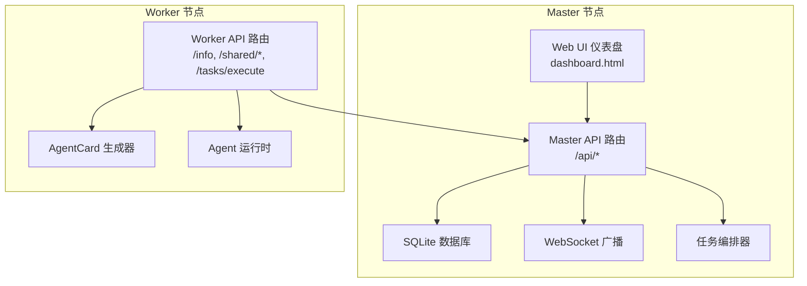
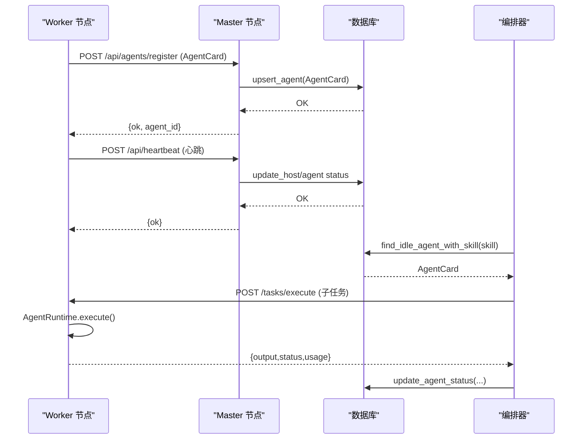
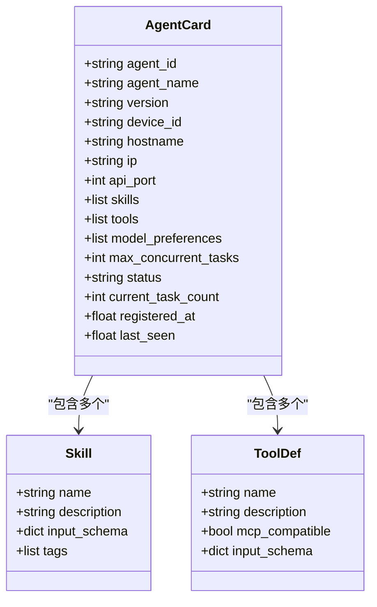
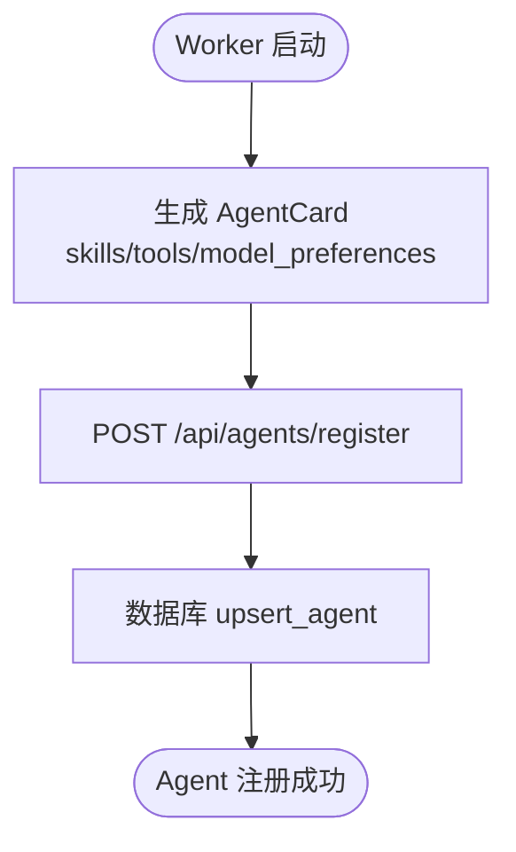
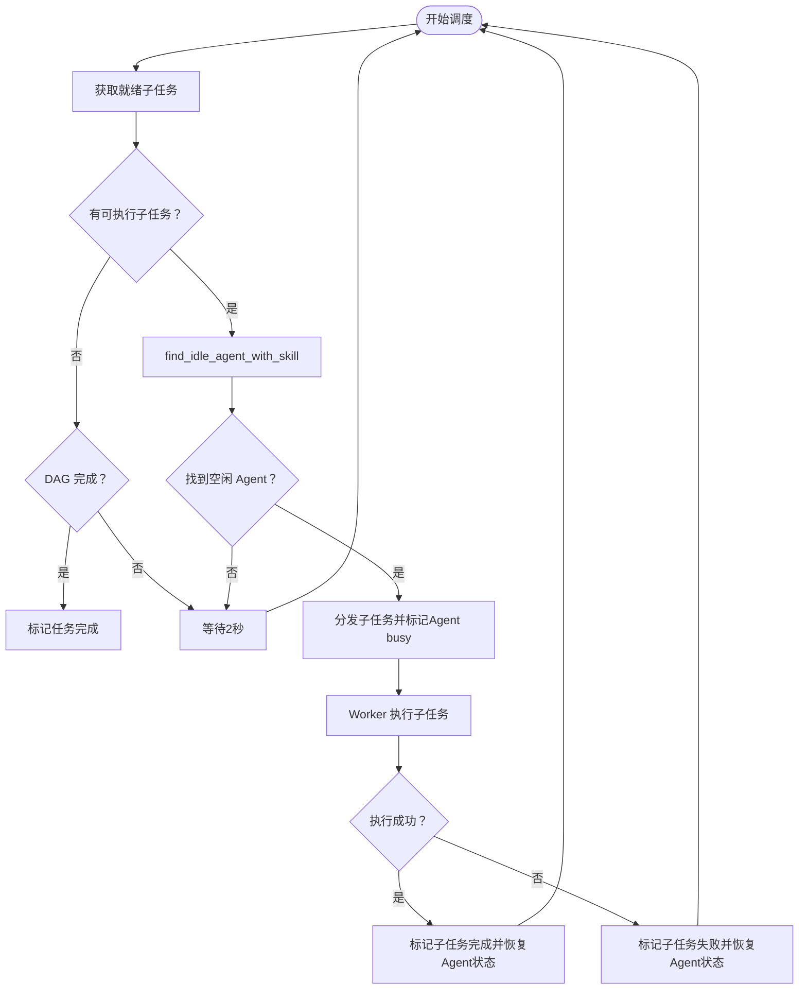
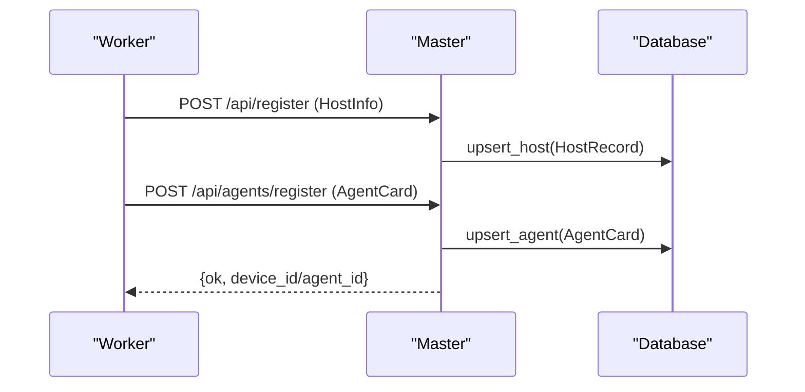
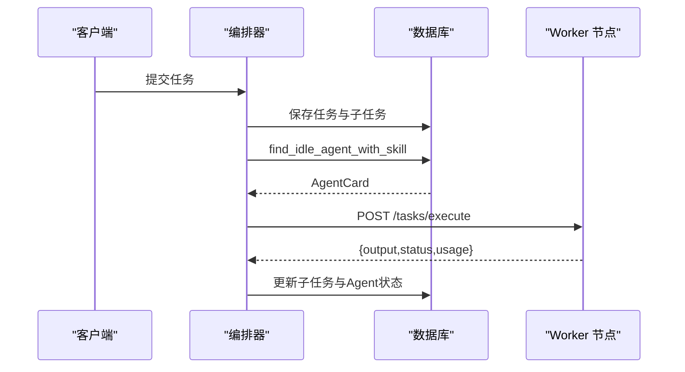
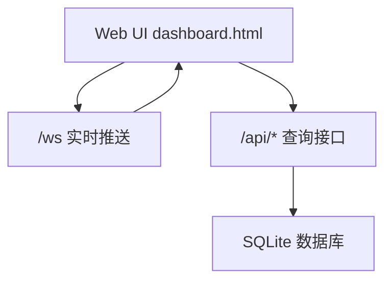
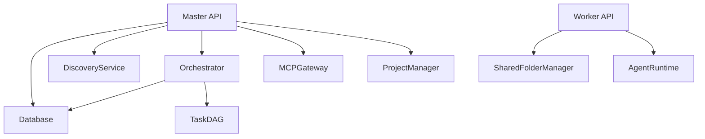

# Agent 管理 API

<cite>
**本文引用的文件**
- [api.py](file://lan_mesh/api.py)
- [agent_card.py](file://lan_mesh/agent_card.py)
- [protocol.py](file://lan_mesh/protocol.py)
- [database.py](file://lan_mesh/database.py)
- [worker.py](file://lan_mesh/worker.py)
- [master.py](file://lan_mesh/master.py)
- [orchestrator.py](file://lan_mesh/orchestrator.py)
- [agent_runtime.py](file://lan_mesh/agent_runtime.py)
- [task.py](file://lan_mesh/task.py)
- [dashboard.html](file://lan_mesh/web/templates/dashboard.html)
</cite>

## 目录
1. [简介](#简介)
2. [项目结构](#项目结构)
3. [核心组件](#核心组件)
4. [架构总览](#架构总览)
5. [详细组件分析](#详细组件分析)
6. [依赖分析](#依赖分析)
7. [性能考虑](#性能考虑)
8. [故障排查指南](#故障排查指南)
9. [结论](#结论)
10. [附录](#附录)

## 简介
本文件面向 Agent 管理功能，提供完整的 API 文档与技术解析，覆盖以下接口：
- /api/agents/register：Agent 注册（Worker 向 Master 上报 AgentCard）
- /api/agents：Agent 列表查询（支持按状态过滤）
- /api/agents/{agent_id}：Agent 详情查询

同时，文档深入解释 Agent 能力声明机制（AgentCard）、Agent 状态跟踪与空闲/忙碌管理、Agent 与 Worker 的绑定关系、调度策略与性能监控方法，并提供可视化图表帮助理解系统交互。

## 项目结构
系统采用“Master/Worker”双角色架构：
- Master：中心控制器，负责设备发现、注册、心跳、任务编排、项目预算控制、Web UI 仪表盘。
- Worker：节点守护进程，负责采集本机信息、注册到 Master、上报心跳、执行子任务、暴露共享文件服务。

**图表来源**
- [api.py:103-266](file://lan_mesh/api.py#L103-L266)
- [master.py:187-224](file://lan_mesh/master.py#L187-L224)
- [worker.py:219-238](file://lan_mesh/worker.py#L219-L238)

**章节来源**
- [api.py:10-19](file://lan_mesh/api.py#L10-L19)
- [master.py:1-324](file://lan_mesh/master.py#L1-L324)
- [worker.py:1-325](file://lan_mesh/worker.py#L1-L325)

## 核心组件
- AgentCard：Agent 能力声明载体，包含技能、工具、模型偏好、并发限制、状态等。
- Database：持久化存储 Agent、主机、任务、项目与消费记录。
- Orchestrator：任务编排器，负责任务分解、子任务 DAG 构建、Agent 匹配与分发。
- AgentRuntime：Worker 端执行引擎，按技能类型执行具体任务。
- Protocol：统一的数据模型与枚举（AgentCard、Skill、ToolDef、Task、SubTask 等）。

**章节来源**
- [protocol.py:159-235](file://lan_mesh/protocol.py#L159-L235)
- [database.py:16-611](file://lan_mesh/database.py#L16-L611)
- [orchestrator.py:58-262](file://lan_mesh/orchestrator.py#L58-L262)
- [agent_runtime.py:28-242](file://lan_mesh/agent_runtime.py#L28-L242)

## 架构总览
Agent 管理涉及注册、查询、状态同步与任务分发四个层面：
- 注册：Worker 生成 AgentCard 并上报 Master。
- 查询：Master 提供 Agent 列表与详情接口。
- 状态：心跳更新 Agent 最近活跃时间；编排器在分发前后更新 Agent 状态。
- 分发：编排器根据技能匹配空闲 Agent，Worker 执行后回传结果并恢复状态。

**图表来源**
- [api.py:268-299](file://lan_mesh/api.py#L268-L299)
- [api.py:148-168](file://lan_mesh/api.py#L148-L168)
- [database.py:396-417](file://lan_mesh/database.py#L396-L417)
- [orchestrator.py:157-226](file://lan_mesh/orchestrator.py#L157-L226)

## 详细组件分析

### AgentCard 数据模型
AgentCard 是 Agent 的能力声明，包含：
- 宿主信息：agent_id/device_id/hostname/ip/api_port
- 能力声明：skills（技能列表）、tools（工具列表）、model_preferences（模型偏好）
- 并发与状态：max_concurrent_tasks、status/current_task_count
- 时间戳：registered_at/last_seen

**图表来源**
- [protocol.py:202-235](file://lan_mesh/protocol.py#L202-L235)
- [protocol.py:161-193](file://lan_mesh/protocol.py#L161-L193)

**章节来源**
- [protocol.py:159-235](file://lan_mesh/protocol.py#L159-L235)
- [agent_card.py:167-218](file://lan_mesh/agent_card.py#L167-L218)

### Agent 能力声明机制
- Worker 启动时调用生成器生成 AgentCard，包含默认技能与工具集合。
- 技能与工具均以 JSON Schema 描述输入，便于编排器与前端展示。
- AgentCard 与 Worker 的 device_id 绑定，便于 Master 识别宿主。

**图表来源**
- [agent_card.py:167-218](file://lan_mesh/agent_card.py#L167-L218)
- [api.py:268-279](file://lan_mesh/api.py#L268-L279)

**章节来源**
- [agent_card.py:16-228](file://lan_mesh/agent_card.py#L16-L228)
- [api.py:268-279](file://lan_mesh/api.py#L268-L279)

### Agent 状态跟踪与空闲/忙碌管理
- 状态枚举：idle/busy/offline。
- 空闲 Agent 查找：按 status='idle' 且 current_task_count 升序排列，优先分配给更空闲的 Agent。
- 状态更新：
  - 分配子任务前：将 Agent 状态置为 busy，current_task_count++。
  - 子任务完成后：根据剩余任务数恢复为 idle 或保持 busy。
- 心跳更新：每周期更新 last_seen，用于 UI 与离线判断。

**图表来源**
- [orchestrator.py:132-226](file://lan_mesh/orchestrator.py#L132-L226)
- [database.py:396-417](file://lan_mesh/database.py#L396-L417)

**章节来源**
- [protocol.py:195-200](file://lan_mesh/protocol.py#L195-L200)
- [database.py:380-394](file://lan_mesh/database.py#L380-L394)
- [orchestrator.py:132-226](file://lan_mesh/orchestrator.py#L132-L226)

### Agent 与 Worker 的绑定关系
- AgentCard 的 agent_id 与 device_id 相同，体现“一个 Worker 一个 Agent”的一对一关系。
- Worker 通过 HTTP 注册主机信息与 AgentCard，Master 侧分别持久化到 hosts 与 agents 表。
- Master 通过 /api/hosts 与 /api/agents 提供统一查询入口。

**图表来源**
- [api.py:116-146](file://lan_mesh/api.py#L116-L146)
- [api.py:268-279](file://lan_mesh/api.py#L268-L279)

**章节来源**
- [api.py:116-146](file://lan_mesh/api.py#L116-L146)
- [api.py:268-279](file://lan_mesh/api.py#L268-L279)

### Agent 注册 API
- 路径：POST /api/agents/register
- 请求体：AgentCard（JSON）
- 成功响应：{ok: true, agent_id: string}
- 处理逻辑：
  - 从 JSON 构造 AgentCard
  - 设置 last_seen
  - 从 UDP 发现列表补全 IP
  - upsert_agent 持久化
  - 广播 agent_registered 事件

**章节来源**
- [api.py:268-279](file://lan_mesh/api.py#L268-L279)

### Agent 列表查询 API
- 路径：GET /api/agents
- 查询参数：status（可选，如 idle/busy）
- 成功响应：包含 agents 数组、总数、空闲/忙碌计数
- 处理逻辑：list_agents，支持按状态过滤

**章节来源**
- [api.py:281-290](file://lan_mesh/api.py#L281-L290)
- [database.py:354-378](file://lan_mesh/database.py#L354-L378)

### Agent 详情查询 API
- 路径：GET /api/agents/{agent_id}
- 成功响应：AgentCard 对象
- 处理逻辑：get_agent，不存在则 404

**章节来源**
- [api.py:292-298](file://lan_mesh/api.py#L292-L298)
- [database.py:327-353](file://lan_mesh/database.py#L327-L353)

### 调度策略与任务分发
- 任务分解：根据任务类型（代码、文档、系统）选择预置模板，生成子任务 DAG。
- Agent 匹配：按 required_skill 查找空闲 Agent。
- 分发执行：通过 Worker 的 /tasks/execute 接口分发子任务。
- 结果回传：Worker 执行完成后回传 output/status/usage，编排器聚合并更新数据库。

**图表来源**
- [orchestrator.py:70-108](file://lan_mesh/orchestrator.py#L70-L108)
- [orchestrator.py:157-226](file://lan_mesh/orchestrator.py#L157-L226)

**章节来源**
- [orchestrator.py:58-262](file://lan_mesh/orchestrator.py#L58-L262)
- [task.py:16-91](file://lan_mesh/task.py#L16-L91)

### 性能监控与可视化
- Web UI 仪表盘提供实时状态展示与交互：
  - 主机监控：CPU/内存/磁盘使用率条形图
  - Agent 状态：空闲/忙碌统计
  - 任务管理：子任务进度与输出结果
- WebSocket 实时推送：主机状态变更、Agent 注册、任务提交等事件。

**图表来源**
- [dashboard.html:195-208](file://lan_mesh/web/templates/dashboard.html#L195-L208)
- [api.py:500-526](file://lan_mesh/api.py#L500-L526)

**章节来源**
- [dashboard.html:1-466](file://lan_mesh/web/templates/dashboard.html#L1-L466)
- [api.py:500-526](file://lan_mesh/api.py#L500-L526)

## 依赖分析
- 组件耦合：
  - Master API 依赖 Database、DiscoveryService、Orchestrator、MCPGateway、ProjectManager。
  - Worker API 依赖 SharedFolderManager、AgentRuntime。
  - Orchestrator 依赖 Database 与 TaskDAG。
- 外部依赖：
  - LLM API（DeepSeek/OpenAI）用于代码生成/审查/摘要。
  - WebSocket 用于实时推送。

**图表来源**
- [master.py:32-45](file://lan_mesh/master.py#L32-L45)
- [worker.py:42-44](file://lan_mesh/worker.py#L42-L44)
- [orchestrator.py:19-21](file://lan_mesh/orchestrator.py#L19-L21)

**章节来源**
- [master.py:32-45](file://lan_mesh/master.py#L32-L45)
- [worker.py:42-44](file://lan_mesh/worker.py#L42-L44)
- [orchestrator.py:19-21](file://lan_mesh/orchestrator.py#L19-L21)

## 性能考虑
- 并发与限流：AgentCard 的 max_concurrent_tasks 控制最大并发，避免过载。
- 状态一致性：心跳与状态更新需保证原子性，建议使用数据库事务。
- 网络抖动：WebSocket 断线重连与心跳间隔需平衡实时性与带宽占用。
- LLM 调用：优先使用低成本模型（如 DeepSeek），并缓存常用结果。
- 数据库索引：按 status、device_id 等高频查询字段建立索引，提升查询效率。

## 故障排查指南
- Agent 未显示：
  - 检查 Worker 是否成功注册（/api/register 与 /api/agents/register）。
  - 确认 UDP 发现与 Master 可达性。
- Agent 状态不更新：
  - 检查 /api/heartbeat 是否正常返回。
  - 核对 last_seen 是否持续更新。
- 任务无法分发：
  - 检查编排器是否能查找到空闲 Agent（按 required_skill）。
  - 确认 Worker 的 /tasks/execute 接口可达。
- LLM 调用失败：
  - 检查 DEEPSEEK_API_KEY 或 OPENAI_API_KEY 环境变量。
  - 核对模型限额与网络连通性。

**章节来源**
- [api.py:148-168](file://lan_mesh/api.py#L148-L168)
- [database.py:396-417](file://lan_mesh/database.py#L396-L417)
- [agent_runtime.py:172-241](file://lan_mesh/agent_runtime.py#L172-L241)

## 结论
Agent 管理模块通过 AgentCard 能力声明与数据库持久化，实现了 Worker 与 Master 的高效协作。结合编排器的任务分解与 DAG 管理、WebSocket 实时推送与 Web UI 可视化，系统具备良好的可观测性与可扩展性。建议在生产环境中强化状态一致性、网络容错与 LLM 调用成本控制。

## 附录

### API 定义概览
- POST /api/agents/register
  - 请求体：AgentCard
  - 响应：{ok: true, agent_id: string}
- GET /api/agents
  - 查询参数：status（可选）
  - 响应：{agents: AgentCard[], total: number, idle: number, busy: number}
- GET /api/agents/{agent_id}
  - 响应：AgentCard

**章节来源**
- [api.py:268-298](file://lan_mesh/api.py#L268-L298)

### AgentCard 字段说明
- agent_id/device_id：唯一标识
- agent_name：显示名称
- hostname/ip/api_port：宿主网络信息
- skills：技能数组（name/description/input_schema/tags）
- tools：工具数组（name/description/mcp_compatible/input_schema）
- model_preferences：模型偏好列表
- max_concurrent_tasks：最大并发数
- status/current_task_count：状态与当前任务计数
- registered_at/last_seen：注册与最近活跃时间

**章节来源**
- [protocol.py:202-235](file://lan_mesh/protocol.py#L202-L235)
- [agent_card.py:167-218](file://lan_mesh/agent_card.py#L167-L218)