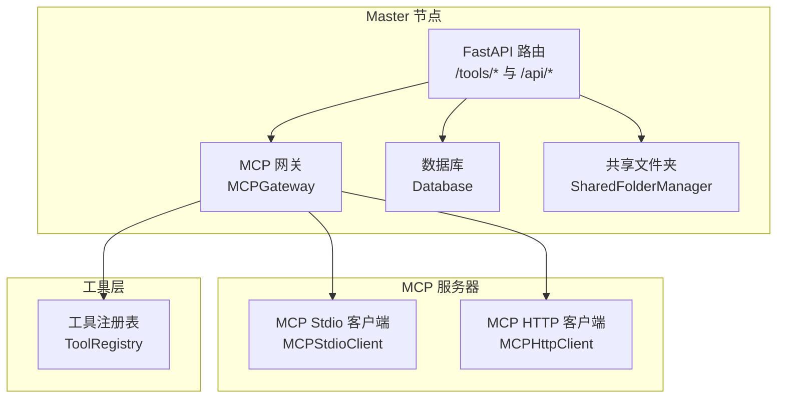
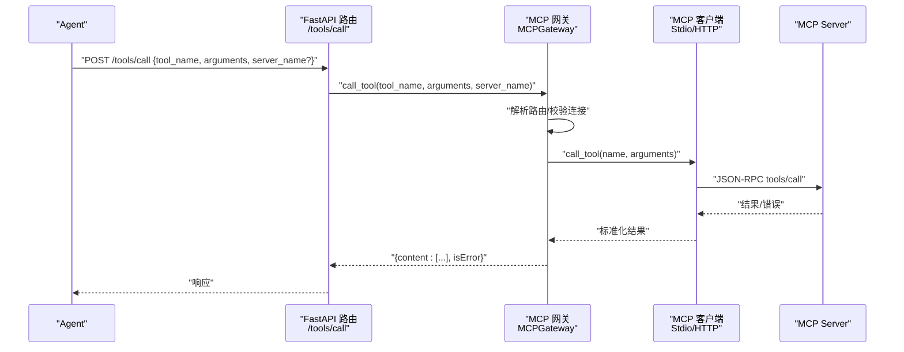
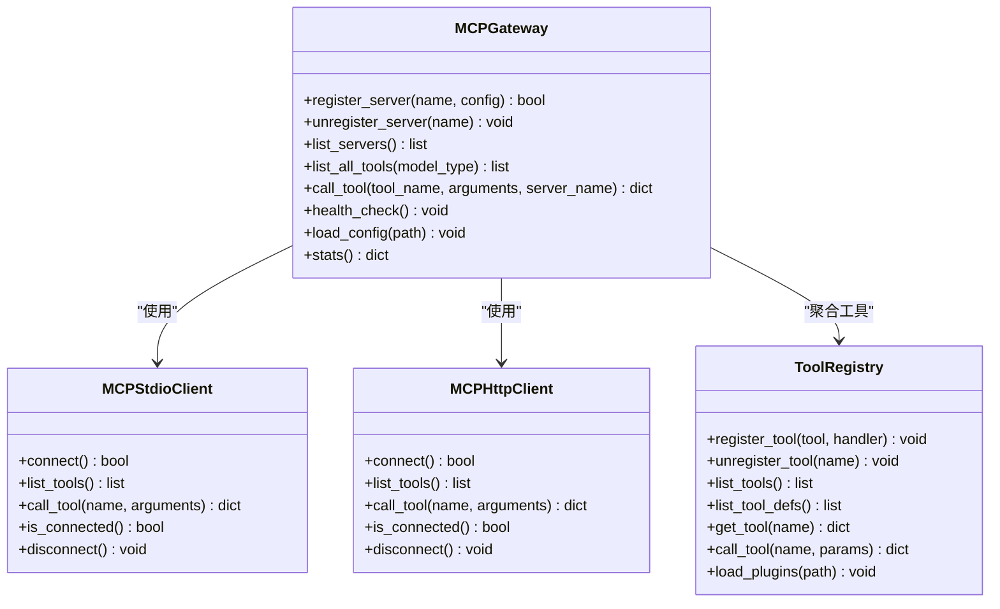
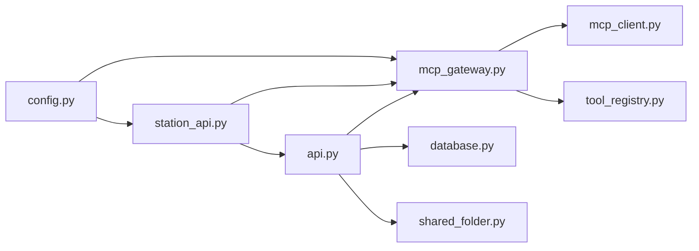

# MCP 工具网关 API

<cite>
**本文引用的文件**
- [api.py](file://lan_mesh/api.py)
- [mcp_gateway.py](file://lan_mesh/mcp_gateway.py)
- [mcp_client.py](file://lan_mesh/mcp_client.py)
- [tool_registry.py](file://lan_mesh/tool_registry.py)
- [protocol.py](file://lan_mesh/protocol.py)
- [station_api.py](file://lan_mesh/station_api.py)
- [config.py](file://lan_mesh/config.py)
- [database.py](file://lan_mesh/database.py)
- [host_info.py](file://lan_mesh/host_info.py)
- [shared_folder.py](file://lan_mesh/shared_folder.py)
- [config.yaml](file://config.yaml)
</cite>

## 目录
1. [简介](#简介)
2. [项目结构](#项目结构)
3. [核心组件](#核心组件)
4. [架构总览](#架构总览)
5. [详细组件分析](#详细组件分析)
6. [依赖关系分析](#依赖关系分析)
7. [性能考虑](#性能考虑)
8. [故障排查指南](#故障排查指南)
9. [结论](#结论)
10. [附录](#附录)

## 简介
本文件为 MCP 工具网关功能的完整 API 文档，覆盖以下接口组：
- /tools/list：工具列表查询，支持按模型类型动态调整工具描述
- /tools/call：工具调用，统一路由至各 MCP Server 执行
- /tools/servers：服务器管理，包括注册、注销、状态查询与动态管理

文档同时阐述 MCP 协议兼容性、工具注册机制、服务器动态管理与服务发现策略；并提供参数格式、返回值结构、错误处理与超时管理说明，以及工具开发指南、服务器配置方法与性能优化建议。

## 项目结构
MCP 工具网关位于 lan_mesh 子项目中，核心文件包括：
- API 路由层：提供 /tools/* 接口与 /api/* 管理接口
- 网关核心：MCPGateway 负责服务器连接池、工具聚合与调用路由
- 客户端适配：MCPStdioClient/MCPHttpClient 实现 JSON-RPC 2.0 通信
- 工具注册表：ToolRegistry 管理内置与插件工具
- 协议与模型：ToolDef、AgentCard 等数据结构
- Master 控制器：集成网关并在 FastAPI 中暴露接口
- 配置与持久化：配置加载、数据库存储、共享文件夹

**图表来源**
- [api.py](file://lan_mesh/api.py)
- [mcp_gateway.py](file://lan_mesh/mcp_gateway.py)
- [mcp_client.py](file://lan_mesh/mcp_client.py)
- [tool_registry.py](file://lan_mesh/tool_registry.py)
- [database.py](file://lan_mesh/database.py)
- [shared_folder.py](file://lan_mesh/shared_folder.py)

**章节来源**
- [api.py](file://lan_mesh/api.py)
- [mcp_gateway.py](file://lan_mesh/mcp_gateway.py)
- [mcp_client.py](file://lan_mesh/mcp_client.py)
- [tool_registry.py](file://lan_mesh/tool_registry.py)
- [station_api.py](file://lan_mesh/station_api.py)
- [config.py](file://lan_mesh/config.py)
- [database.py](file://lan_mesh/database.py)
- [shared_folder.py](file://lan_mesh/shared_folder.py)
- [config.yaml](file://config.yaml)

## 核心组件
- MCP 网关（MCPGateway）
  - 维护服务器连接池（stdio 子进程 + HTTP 远程）
  - 聚合工具列表并按模型类型动态调整描述
  - 路由工具调用到正确服务器，支持指定 server
  - 自动重连断开的服务器，提供健康检查循环
  - 支持从配置文件加载与运行时动态注册
- MCP 客户端（MCPStdioClient / MCPHttpClient）
  - stdio：启动本地子进程并通过 stdin/stdout 通信
  - http：连接远程 MCP Server（HTTP + JSON-RPC）
  - 遵循 initialize/tools/list/tools/call 协议
- 工具注册表（ToolRegistry）
  - 管理内置工具（文件读写、Shell 执行、HTTP 请求、目录枚举、Python 评估）
  - 支持 YAML 插件工具加载与运行时动态注册
  - 输出 MCP 兼容的工具定义与输入 Schema
- 协议与模型（protocol.py）
  - ToolDef、AgentCard、HostInfo、HostRecord 等数据结构
  - MCP 兼容的工具定义与输入 Schema
- Station Director（station_api.py）
  - 集成 MCPGateway 并在 FastAPI 中暴露 /tools/* 接口
  - 提供 Web UI 仪表盘与 WebSocket 实时推送
- 配置与持久化
  - 配置加载（config.py）与默认配置（config.yaml）
  - 数据库存储（database.py）与共享文件夹（shared_folder.py）

**章节来源**
- [mcp_gateway.py](file://lan_mesh/mcp_gateway.py)
- [mcp_client.py](file://lan_mesh/mcp_client.py)
- [tool_registry.py](file://lan_mesh/tool_registry.py)
- [protocol.py](file://lan_mesh/protocol.py)
- [station_api.py](file://lan_mesh/station_api.py)
- [config.py](file://lan_mesh/config.py)
- [config.yaml](file://config.yaml)
- [database.py](file://lan_mesh/database.py)
- [shared_folder.py](file://lan_mesh/shared_folder.py)

## 架构总览
MCP 工具网关作为 Master 节点上的统一入口，Agent 通过 HTTP 调用 /tools/call，网关内部根据工具名与路由表选择对应 MCP Server（stdio 或 HTTP），执行 JSON-RPC 调用并将结果返回给 Agent。网关还负责工具聚合、动态描述调整、健康检查与自动重连。

**图表来源**
- [api.py](file://lan_mesh/api.py)
- [mcp_gateway.py](file://lan_mesh/mcp_gateway.py)
- [mcp_client.py](file://lan_mesh/mcp_client.py)

## 详细组件分析

### /tools/list 工具列表查询
- 功能概述
  - 聚合所有已注册 MCP Server 的工具列表
  - 支持按模型类型（如 deepseek-v3、qwen、yi）动态增强工具描述
  - 返回工具数组及服务器统计信息
- 请求
  - 方法：GET
  - 路径：/tools/list
  - 查询参数：
    - model：可选，模型类型字符串，用于动态调整工具描述
- 响应
  - 字段：
    - tools：工具数组，每项包含 name、description、inputSchema，并附加 source_server 标识来源
    - total：工具总数
    - servers：服务器列表（仅当网关初始化成功时）
- 错误处理
  - 网关未初始化：返回 {tools:[], total:0, error:"..."}
- 性能与优化
  - 工具列表来自各 Server 缓存，避免频繁 RPC 调用
  - 按模型类型追加示例描述，减少 Agent 侧复杂度

**章节来源**
- [api.py](file://lan_mesh/api.py)
- [mcp_gateway.py](file://lan_mesh/mcp_gateway.py)

### /tools/call 工具调用
- 功能概述
  - 统一路由工具调用到正确 MCP Server
  - 支持显式指定 server_name 消歧同名工具
  - 返回 MCP 兼容的响应结构 {content:[...], isError}
- 请求
  - 方法：POST
  - 路径：/tools/call
  - 请求体：
    - tool_name：必填，工具名称
    - arguments：必填，工具参数对象
    - server_name：可选，指定服务器名称
- 响应
  - 成功：{content:[{type:"text", text:"..."}], isError:false}
  - 失败：{content:[{type:"text", text:"..."}], isError:true}
- 错误处理
  - 缺少 tool_name：400
  - 网关未初始化：503
  - 工具不存在：返回 isError:true
  - Server 不存在：返回 isError:true
  - 连接断开且重连失败：返回 isError:true
- 超时管理
  - HTTP 客户端默认超时 30 秒
  - Shell 工具执行支持超时参数（见内置工具）
- 集成与 LLM 工具调用流程
  - Agent 初始化时调用 /tools/list 获取工具定义，填充 LLM 的 tools 参数
  - LLM 选择工具并传参，Agent 通过 /tools/call 调用网关
  - 网关路由到具体 Server 执行并返回结果

**章节来源**
- [api.py](file://lan_mesh/api.py)
- [mcp_gateway.py](file://lan_mesh/mcp_gateway.py)
- [mcp_client.py](file://lan_mesh/mcp_client.py)
- [tool_registry.py](file://lan_mesh/tool_registry.py)

### /tools/servers 服务器管理
- 列表查询
  - 方法：GET
  - 路径：/tools/servers
  - 返回：servers（名称、传输方式、连接状态、工具数量）、stats（统计信息）
- 动态注册
  - 方法：POST
  - 路径：/tools/servers
  - 请求体：
    - name：必填，服务器名称
    - config：必填，服务器配置
  - config 支持：
    - transport：stdio 或 http
    - stdio：command、args、env
    - http：url、headers
- 注销服务器
  - 方法：DELETE
  - 路径：/tools/servers/{name}
- 错误处理
  - 网关未初始化：404/503
  - 缺少 name：400
  - 连接失败：返回 ok=false
- 服务器生命周期
  - 注册时建立连接并拉取工具列表
  - 健康检查循环定期重连断开的服务器
  - 注销时断开连接并清理路由索引

**章节来源**
- [api.py](file://lan_mesh/api.py)
- [mcp_gateway.py](file://lan_mesh/mcp_gateway.py)
- [mcp_client.py](file://lan_mesh/mcp_client.py)

### MCP 协议兼容性与工具注册机制
- 协议兼容
  - 遵循 JSON-RPC 2.0 与 MCP 规范：initialize、tools/list、tools/call
  - 工具定义包含 name、description、inputSchema
- 工具注册
  - 内置工具：文件读写、Shell 执行、HTTP 请求、目录枚举、Python 评估
  - 插件工具：通过 YAML 配置加载模块函数
  - 运行时注册：register_tool(tool_def, handler)
- 输入 Schema
  - 每个工具提供 JSON Schema 描述输入参数，便于 LLM 正确构造参数

**章节来源**
- [mcp_client.py](file://lan_mesh/mcp_client.py)
- [tool_registry.py](file://lan_mesh/tool_registry.py)
- [protocol.py](file://lan_mesh/protocol.py)

### 服务器动态管理与服务发现策略
- 服务器动态管理
  - 运行时注册/注销，支持 stdio 与 HTTP 两种传输
  - 自动重连与健康检查，保障可用性
- 服务发现
  - UDP 广播发现（DiscoveryService）用于 Worker 注册与心跳
  - Master 通过 /api/discovery 与 /api/hosts 暴露发现结果
  - 网关通过配置文件加载与运行时注册管理 MCP Server

**章节来源**
- [mcp_gateway.py](file://lan_mesh/mcp_gateway.py)
- [mcp_client.py](file://lan_mesh/mcp_client.py)
- [discovery.py](file://lan_mesh/discovery.py)
- [api.py](file://lan_mesh/api.py)

### 类关系图（代码级）

**图表来源**
- [mcp_gateway.py](file://lan_mesh/mcp_gateway.py)
- [mcp_client.py](file://lan_mesh/mcp_client.py)
- [tool_registry.py](file://lan_mesh/tool_registry.py)

## 依赖关系分析
- 组件耦合
  - API 路由层依赖 MCPGateway；MCPGateway 依赖 MCP 客户端与工具注册表
  - Master 控制器注入 MCPGateway 并在 FastAPI 中注册路由
- 外部依赖
  - JSON-RPC 2.0（requests、subprocess）
  - YAML 配置加载（PyYAML）
  - 数据库存储（sqlite3）
- 循环依赖
  - 未发现循环依赖，模块职责清晰

**图表来源**
- [api.py](file://lan_mesh/api.py)
- [mcp_gateway.py](file://lan_mesh/mcp_gateway.py)
- [mcp_client.py](file://lan_mesh/mcp_client.py)
- [tool_registry.py](file://lan_mesh/tool_registry.py)
- [database.py](file://lan_mesh/database.py)
- [shared_folder.py](file://lan_mesh/shared_folder.py)
- [station_api.py](file://lan_mesh/station_api.py)
- [config.py](file://lan_mesh/config.py)

**章节来源**
- [api.py](file://lan_mesh/api.py)
- [mcp_gateway.py](file://lan_mesh/mcp_gateway.py)
- [mcp_client.py](file://lan_mesh/mcp_client.py)
- [tool_registry.py](file://lan_mesh/tool_registry.py)
- [database.py](file://lan_mesh/database.py)
- [shared_folder.py](file://lan_mesh/shared_folder.py)
- [station_api.py](file://lan_mesh/station_api.py)
- [config.py](file://lan_mesh/config.py)

## 性能考虑
- 连接复用与缓存
  - 工具列表缓存：避免频繁调用 tools/list
  - 连接池：stdio 子进程与 HTTP 客户端连接复用
- 超时与重连
  - HTTP 客户端默认超时 30 秒
  - 健康检查循环定期重连断开的服务器
- 负载均衡与路由
  - 同名工具通过路由表定位来源服务器，必要时可通过 server_name 指定
- I/O 优化
  - 共享文件夹采用安全路径解析，避免路径穿越
  - 文件上传自动去重与命名规范化

[本节为通用性能建议，不直接分析特定文件]

## 故障排查指南
- 常见错误与处理
  - 网关未初始化：检查 Master 是否正确启动并注入 MCPGateway
  - 工具不存在：确认 /tools/list 返回是否包含目标工具
  - Server 不存在/断开：检查 /tools/servers 列表与健康状态
  - HTTP 连接失败：核对 URL、Headers 与网络可达性
  - stdio 命令不存在：检查 command 与环境变量
- 日志与诊断
  - 网关打印连接状态与重连日志
  - 工具调用返回 isError:true 时，content 中包含错误文本
- 重试与降级
  - 健康检查循环自动重连
  - 对弱模型可启用更详细的工具描述以降低调用错误

**章节来源**
- [mcp_gateway.py](file://lan_mesh/mcp_gateway.py)
- [mcp_client.py](file://lan_mesh/mcp_client.py)
- [api.py](file://lan_mesh/api.py)

## 结论
MCP 工具网关通过统一的 API 接口与灵活的服务器管理机制，实现了多来源工具的聚合与路由。结合 MCP 协议兼容性与动态描述调整，显著降低了 Agent 侧的工具使用复杂度。配合健康检查与自动重连，保证了系统的稳定性与可用性。

[本节为总结性内容，不直接分析特定文件]

## 附录

### 工具开发指南
- 定义工具
  - 使用 ToolDef 提供 name、description、input_schema
  - handler 函数接收参数字典并返回结果字典
- 注册方式
  - 内置工具：直接在 BUILTIN_TOOLS 中定义
  - 插件工具：通过 YAML 配置加载模块函数
  - 运行时注册：register_tool(tool_def, handler)
- 输入 Schema
  - 使用 JSON Schema 描述参数，包含必需字段与类型
- 示例与测试
  - 参考内置工具（文件读写、Shell、HTTP、目录、Python 评估）
  - 通过 /tools/list 与 /tools/call 验证工具可用性

**章节来源**
- [tool_registry.py](file://lan_mesh/tool_registry.py)
- [protocol.py](file://lan_mesh/protocol.py)

### 服务器配置方法
- 配置文件（mcp_servers.yaml）
  - servers: 服务器列表
  - 每个服务器支持：
    - transport: stdio 或 http
    - stdio: command、args、env
    - http: url、headers
- 运行时注册
  - POST /tools/servers 传入 name 与 config
- 自动加载
  - Master 启动时加载 mcp_servers.yaml 并注册服务器

**章节来源**
- [mcp_gateway.py](file://lan_mesh/mcp_gateway.py)
- [station_api.py](file://lan_mesh/station_api.py)
- [config.yaml](file://config.yaml)

### 配置项说明
- discovery：UDP 发现端口、广播间隔、设备离线阈值
- worker：Worker API 端口、共享目录、设备名称
- master：Master API 端口、共享目录、设备名称、数据库路径

**章节来源**
- [config.py](file://lan_mesh/config.py)
- [config.yaml](file://config.yaml)

### 数据模型与接口对照
- 工具定义（ToolDef）
  - 字段：name、description、mcp_compatible、input_schema
- Agent 能力声明（AgentCard）
  - 字段：agent_id、skills、tools、model_preferences 等
- 主机信息（HostInfo/HostRecord）
  - 字段：设备标识、硬件画像、网络信息、共享目录等

**章节来源**
- [protocol.py](file://lan_mesh/protocol.py)
