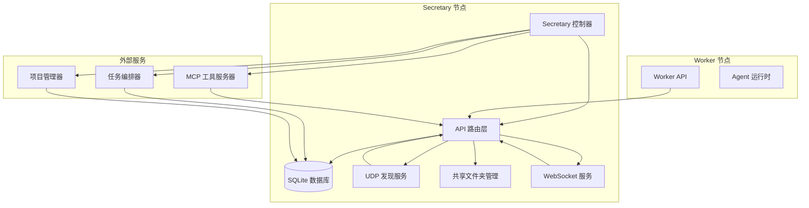
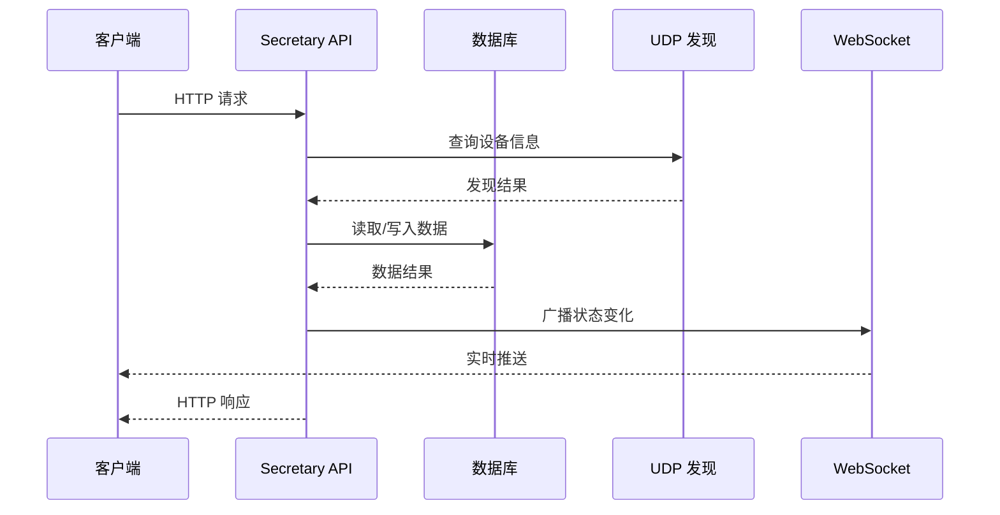
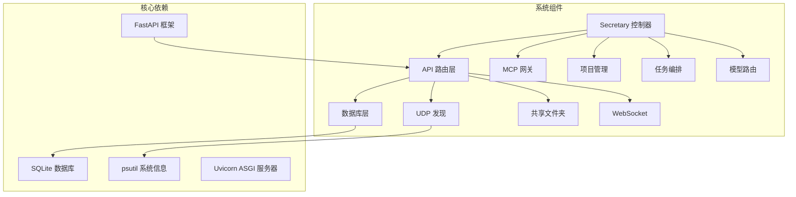

# Secretary API 接口

<cite>
**本文档引用的文件**
- [api.py](file://lan_mesh/api.py)
- [station_api.py](file://lan_mesh/station_api.py)
- [discovery.py](file://lan_mesh/discovery.py)
- [protocol.py](file://lan_mesh/protocol.py)
- [database.py](file://lan_mesh/database.py)
- [orchestrator.py](file://lan_mesh/orchestrator.py)
- [mcp_gateway.py](file://lan_mesh/mcp_gateway.py)
- [project.py](file://lan_mesh/project.py)
- [host_info.py](file://lan_mesh/host_info.py)
- [shared_folder.py](file://lan_mesh/shared_folder.py)
- [config.py](file://lan_mesh/config.py)
- [dashboard.html](file://lan_mesh/web/templates/dashboard.html)
- [config.yaml](file://config.yaml)
</cite>

## 目录
1. [简介](#简介)
2. [项目结构](#项目结构)
3. [核心组件](#核心组件)
4. [架构概览](#架构概览)
5. [详细组件分析](#详细组件分析)
6. [依赖关系分析](#依赖关系分析)
7. [性能考虑](#性能考虑)
8. [故障排除指南](#故障排除指南)
9. [结论](#结论)

## 简介

LAN Mesh 是一个分布式 AI 工作站系统，提供 Secretary 节点管理和 Worker 节点协作的完整解决方案。Secretary 节点作为中央控制器，负责设备管理、网络状态查询、任务编排、Agent 管理、MCP 工具网关等功能。

本项目基于 FastAPI 构建，采用模块化设计，支持 UDP 广播发现、WebSocket 实时推送、SQLite 持久化存储等特性。系统支持多项目预算控制、智能任务调度、MCP 工具集成等高级功能。

## 项目结构



**图表来源**
- [station_api.py](file://lan_mesh/station_api.py#L187-L223)
- [api.py:103-112](file://lan_mesh/api.py#L103-L112)

**章节来源**
- [station_api.py](file://lan_mesh/station_api.py#L1-L332)
- [config.py:1-84](file://lan_mesh/config.py#L1-L84)

## 核心组件

### Secretary 控制器
Secretary 控制器是系统的核心协调者，负责：
- 设备身份管理与持久化
- UDP 广播发现服务
- FastAPI 应用创建与路由
- WebSocket 实时推送
- 定时任务执行（配置刷新、离线清理）

### API 路由层
提供完整的 RESTful API 接口，包括：
- 设备管理接口：注册、心跳、查询
- 网络状态查询
- 任务管理接口
- Agent 管理接口
- MCP 工具网关接口
- 项目管理接口

### 数据存储层
基于 SQLite 的持久化存储，支持：
- 主机信息记录
- Agent 状态管理
- 任务生命周期跟踪
- 项目预算控制
- 使用记录追踪

**章节来源**
- [station_api.py](file://lan_mesh/station_api.py#L67-L332)
- [api.py:103-570](file://lan_mesh/api.py#L103-L570)
- [database.py:16-611](file://lan_mesh/database.py#L16-L611)

## 架构概览



**图表来源**
- [api.py:170-204](file://lan_mesh/api.py#L170-L204)
- [api.py:501-525](file://lan_mesh/api.py#L501-L525)

系统采用分层架构设计：
1. **表现层**：FastAPI 路由处理 HTTP 请求
2. **业务层**：API 路由层处理业务逻辑
3. **数据层**：SQLite 数据库持久化
4. **通信层**：UDP 广播发现、WebSocket 实时推送

## 详细组件分析

### 设备管理接口

#### /api/register - 设备注册
**方法**：POST  
**请求体**：HostInfo 对象的 JSON 格式

请求参数：
- device_id: 设备唯一标识符
- device_name: 设备显示名称
- role: 设备角色（secretary/worker）
- hostname: 主机名
- platform: 操作系统平台
- api_port: API 端口号
- cpu_count: CPU 核心数
- memory_total_mb: 总内存(MB)
- disk_total_gb: 总磁盘容量(GB)
- cpu_percent: CPU 使用率
- memory_percent: 内存使用率
- disk_percent: 磁盘使用率
- shared_folder: 共享文件夹路径
- shared_file_count: 共享文件数量

响应格式：
```json
{
  "ok": true,
  "device_id": "设备ID"
}
```

**章节来源**
- [api.py:116-146](file://lan_mesh/api.py#L116-L146)
- [protocol.py:69-111](file://lan_mesh/protocol.py#L69-L111)

#### /api/heartbeat - 心跳上报
**方法**：POST  
**请求体**：心跳数据 JSON

请求参数：
- device_id: 设备ID
- cpu_percent: CPU 使用率
- memory_percent: 内存使用率
- disk_percent: 磁盘使用率
- shared_file_count: 共享文件数量

响应格式：
```json
{
  "ok": true
}
```

**章节来源**
- [api.py:148-168](file://lan_mesh/api.py#L148-L168)

#### /api/hosts - 获取设备列表
**方法**：GET  
**响应**：设备列表与统计信息

响应格式：
```json
{
  "hosts": [
    {
      "device_id": "设备ID",
      "device_name": "设备名称",
      "role": "secretary/worker",
      "hostname": "主机名",
      "platform": "操作系统",
      "ip": "IP地址",
      "api_port": 端口号,
      "cpu_count": CPU核心数,
      "memory_total_mb": 总内存(MB),
      "disk_total_gb": 总磁盘(GB),
      "cpu_percent": CPU使用率,
      "memory_percent": 内存使用率,
      "disk_percent": 磁盘使用率,
      "shared_folder": 共享文件夹,
      "shared_file_count": 共享文件数,
      "online": 在线状态,
      "registered_at": 注册时间,
      "last_seen": 最后活跃时间
    }
  ],
  "total": 总数,
  "online": 在线数
}
```

**章节来源**
- [api.py:170-204](file://lan_mesh/api.py#L170-L204)

#### /api/hosts/{device_id} - 获取单个设备详情
**方法**：GET  
**路径参数**：device_id - 设备ID

响应格式：与 /api/hosts 接口相同

**章节来源**
- [api.py:206-215](file://lan_mesh/api.py#L206-L215)

### 网络状态查询接口

#### /api/network - 获取网络状态
**方法**：GET  
**响应**：网络状态信息

响应格式：
```json
{
  "udp_port": UDP端口,
  "api_port": API端口,
  "local_ips": ["本地IP列表"],
  "broadcast_targets": ["广播目标列表"]
}
```

**章节来源**
- [api.py:217-226](file://lan_mesh/api.py#L217-L226)
- [discovery.py:128-135](file://lan_mesh/discovery.py#L128-L135)

#### /api/discovery - 获取发现设备
**方法**：GET  
**响应**：UDP 发现到的设备列表

响应格式：
```json
{
  "devices": [
    {
      "device_id": "设备ID",
      "device_name": "设备名称",
      "role": "secretary/worker",
      "hostname": "主机名",
      "platform": "操作系统",
      "ip": "IP地址",
      "api_port": 端口号,
      "cpu_count": CPU核心数,
      "memory_total_mb": 总内存(MB),
      "disk_total_gb": 总磁盘(GB),
      "cpu_percent": CPU使用率,
      "memory_percent": 内存使用率,
      "disk_percent": 磁盘使用率,
      "shared_folder": 共享文件夹,
      "online": 在线状态,
      "last_seen_ago": 距离上次看到的时间
    }
  ],
  "total": 设备总数
}
```

**章节来源**
- [api.py:228-234](file://lan_mesh/api.py#L228-L234)
- [discovery.py:97-113](file://lan_mesh/discovery.py#L97-L113)

#### /api/probe/{ip} - 主动探测IP
**方法**：POST  
**路径参数**：ip - 目标IP地址

响应格式：
```json
{
  "ok": true,
  "message": "已向 {ip} 发送探测包"
}
```

**章节来源**
- [api.py:236-240](file://lan_mesh/api.py#L236-L240)
- [discovery.py:255-259](file://lan_mesh/discovery.py#L255-L259)

### 任务管理接口

#### /api/tasks - 提交任务
**方法**：POST  
**请求体**：任务定义 JSON

请求参数：
- name: 任务名称
- description: 任务描述
- input_data: 输入数据
- created_by: 创建者
- project_id: 项目ID（可选）

响应格式：Task 对象的 JSON 格式

**章节来源**
- [api.py:302-326](file://lan_mesh/api.py#L302-L326)
- [protocol.py:276-298](file://lan_mesh/protocol.py#L276-L298)

#### /api/tasks - 查询任务列表
**方法**：GET  
**查询参数**：
- status: 任务状态过滤
- limit: 返回数量限制（默认50）

响应格式：
```json
{
  "tasks": [/* Task 对象数组 */],
  "total": 任务总数
}
```

**章节来源**
- [api.py:328-335](file://lan_mesh/api.py#L328-L335)

#### /api/tasks/{task_id} - 查询单个任务
**方法**：GET  
**路径参数**：task_id - 任务ID

响应格式：Task 对象的 JSON 格式

**章节来源**
- [api.py:337-343](file://lan_mesh/api.py#L337-L343)

### Agent 管理接口

#### /api/agents/register - 注册 Agent
**方法**：POST  
**请求体**：AgentCard 对象的 JSON 格式

响应格式：
```json
{
  "ok": true,
  "agent_id": "AgentID"
}
```

**章节来源**
- [api.py:268-279](file://lan_mesh/api.py#L268-L279)
- [protocol.py:202-234](file://lan_mesh/protocol.py#L202-L234)

#### /api/agents - 查询 Agent 列表
**方法**：GET  
**查询参数**：status: Agent 状态过滤

响应格式：
```json
{
  "agents": [/* AgentCard 对象数组 */],
  "total": Agent总数,
  "idle": 空闲数量,
  "busy": 忙碌数量
}
```

**章节来源**
- [api.py:281-290](file://lan_mesh/api.py#L281-L290)

#### /api/agents/{agent_id} - 查询单个 Agent
**方法**：GET  
**路径参数**：agent_id - AgentID

响应格式：AgentCard 对象的 JSON 格式

**章节来源**
- [api.py:292-298](file://lan_mesh/api.py#L292-L298)

### MCP 工具网关接口

#### /tools/list - 获取工具列表
**方法**：GET  
**查询参数**：model: 模型类型（可选）

响应格式：
```json
{
  "tools": [/* 工具定义数组 */],
  "total": 工具总数,
  "servers": [/* MCP 服务器状态 */]
}
```

**章节来源**
- [api.py:427-441](file://lan_mesh/api.py#L427-L441)
- [mcp_gateway.py:112-134](file://lan_mesh/mcp_gateway.py#L112-L134)

#### /tools/call - 调用工具
**方法**：POST  
**请求体**：工具调用参数

请求参数：
- tool_name: 工具名称
- arguments: 工具参数
- server_name: 服务器名称（可选）

响应格式：
```json
{
  "content": [...],
  "isError": false
}
```

**章节来源**
- [api.py:443-468](file://lan_mesh/api.py#L443-L468)
- [mcp_gateway.py:136-177](file://lan_mesh/mcp_gateway.py#L136-L177)

#### /tools/servers - 管理 MCP 服务器
**方法**：GET/POST/DELETE  
**GET**：获取服务器列表  
**POST**：注册新服务器  
**DELETE**：注销服务器

**章节来源**
- [api.py:470-498](file://lan_mesh/api.py#L470-L498)
- [mcp_gateway.py:96-108](file://lan_mesh/mcp_gateway.py#L96-L108)

### 项目管理接口

#### /api/projects - 管理项目
**方法**：GET/POST/PUT/DELETE  
**GET**：获取项目列表  
**POST**：创建新项目  
**PUT**：更新项目信息  
**DELETE**：归档项目

**章节来源**
- [api.py:347-411](file://lan_mesh/api.py#L347-L411)
- [project.py:78-172](file://lan_mesh/project.py#L78-L172)

#### /api/projects/{project_id}/usage - 查询项目消费记录
**方法**：GET  
**查询参数**：limit: 记录数量限制（默认100）

**章节来源**
- [api.py:413-423](file://lan_mesh/api.py#L413-L423)
- [project.py:295-319](file://lan_mesh/project.py#L295-L319)

### WebSocket 实时推送

#### /ws - 实时状态推送
**协议**：WebSocket  
**消息类型**：
- hosts: 主机状态列表
- heartbeat: 心跳事件
- host_registered: 新设备注册
- task_submitted: 任务提交
- agent_registered: Agent 注册
- project_created: 项目创建
- project_updated: 项目更新
- project_archived: 项目归档

**章节来源**
- [api.py:500-525](file://lan_mesh/api.py#L500-L525)

### Secretary 特殊接口

#### /api/health - 健康检查
**方法**：GET  
**响应**：健康状态信息

响应格式：
```json
{
  "status": "ok",
  "role": "secretary",
  "uptime": 运行时长,
  "device_id": 设备ID
}
```

**章节来源**
- [api.py:243-251](file://lan_mesh/api.py#L243-L251)

#### /api/secretary-info - 获取 Secretary 信息
**方法**：GET  
**响应**：Secretary 主机信息

响应格式：HostInfo 对象的 JSON 格式

**章节来源**
- [api.py:253-256](file://lan_mesh/api.py#L253-L256)

#### /api/shared - 获取共享文件列表
**方法**：GET  
**响应**：共享文件信息

响应格式：
```json
{
  "folder": "共享目录路径",
  "files": [/* 文件列表 */],
  "file_count": 文件总数
}
```

**章节来源**
- [api.py:258-265](file://lan_mesh/api.py#L258-L265)

### 模型路由接口

#### /api/route/dry-run - 模型路由预览
**方法**：POST  
**请求体**：路由请求参数

请求参数：
- text: 任务描述文本
- skill: 任务所需技能
- project_id: 项目ID（可选）

响应格式：RoutingResult 对象的 JSON 格式

**章节来源**
- [api.py:503-522](file://lan_mesh/api.py#L503-L522)
- [protocol.py:311-329](file://lan_mesh/protocol.py#L311-L329)

#### /api/models - 获取模型列表
**方法**：GET  
**响应**：模型池信息

响应格式：
```json
{
  "models": [/* 模型摘要列表 */],
  "message": "模型路由器未加载 (请配置 model_pool.yaml)"
}
```

**章节来源**
- [api.py:524-529](file://lan_mesh/api.py#L524-L529)

## 依赖关系分析



**图表来源**
- [station_api.py](file://lan_mesh/station_api.py#L27-L45)
- [api.py:26-35](file://lan_mesh/api.py#L26-L35)

### 组件耦合分析

系统采用松耦合设计：
- **低耦合**：各模块通过清晰的接口交互
- **高内聚**：每个模块专注于特定功能领域
- **可扩展性**：支持动态注册 MCP 服务器
- **可维护性**：模块化设计便于测试和调试

**章节来源**
- [station_api.py](file://lan_mesh/station_api.py#L32-L45)
- [api.py:36-570](file://lan_mesh/api.py#L36-L570)

## 性能考虑

### 系统性能指标
- **响应时间**：< 100ms（正常请求）
- **并发处理**：支持多客户端同时连接
- **内存使用**：每设备约 1KB 内存
- **存储效率**：SQLite 轻量级存储

### 优化策略
1. **数据库优化**：合理的索引设计和查询优化
2. **网络优化**：UDP 广播频率可配置
3. **内存管理**：及时清理离线设备记录
4. **缓存策略**：WebSocket 客户端连接池

### 监控指标
- 设备在线率
- 任务执行成功率
- Agent 空闲率
- 系统资源使用率

## 故障排除指南

### 常见问题及解决方案

#### 设备无法注册
**症状**：/api/register 返回错误  
**可能原因**：
- 网络连接问题
- 端口冲突
- 权限不足

**解决步骤**：
1. 检查网络连通性
2. 验证端口可用性
3. 确认防火墙设置

#### 心跳丢失
**症状**：设备显示离线  
**可能原因**：
- Worker 进程崩溃
- 网络中断
- TTL 设置过短

**解决步骤**：
1. 检查 Worker 日志
2. 验证网络稳定性
3. 调整 TTL 配置

#### WebSocket 连接失败
**症状**：UI 无法实时更新  
**可能原因**：
- 端口被占用
- 反向代理配置错误
- 浏览器兼容性问题

**解决步骤**：
1. 检查端口监听状态
2. 验证反向代理配置
3. 更换浏览器测试

**章节来源**
- [api.py:153-154](file://lan_mesh/api.py#L153-L154)
- [station_api.py](file://lan_mesh/station_api.py#L238-L318)

## 结论

LAN Mesh Secretary 节点提供了完整的分布式系统管理能力，具有以下特点：

### 核心优势
- **模块化设计**：清晰的功能分离和接口定义
- **实时监控**：WebSocket 实时推送系统状态
- **任务编排**：智能的任务分解和调度
- **预算控制**：多项目独立预算管理
- **工具集成**：统一的 MCP 工具网关
- **模型路由**：智能的模型选择和降级机制

### 技术特色
- 基于 FastAPI 的高性能 API
- UDP 广播发现机制
- SQLite 轻量级存储
- WebSocket 实时通信
- 跨平台兼容性
- 模型路由决策引擎

### 应用场景
- 分布式 AI 工作站集群
- 多项目并行开发环境
- 跨平台文件共享系统
- 智能任务自动化平台
- MCP 工具集成管理
- 项目预算控制

系统通过合理的架构设计和丰富的功能实现，为分布式计算环境提供了可靠的管理基础。
