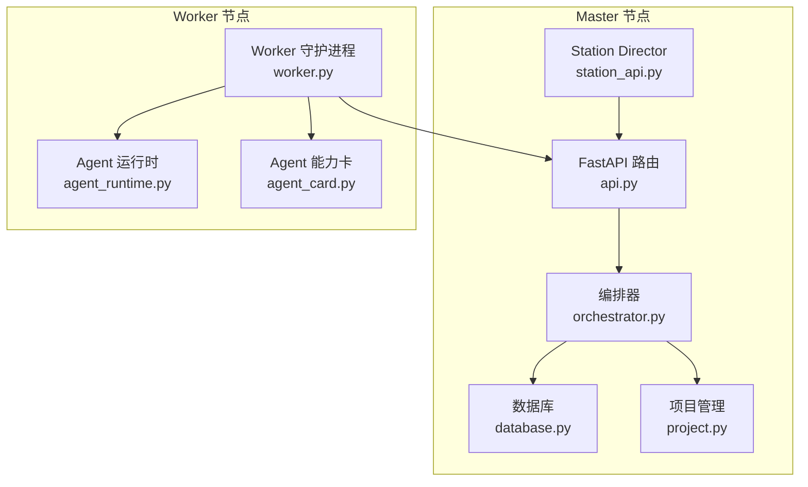
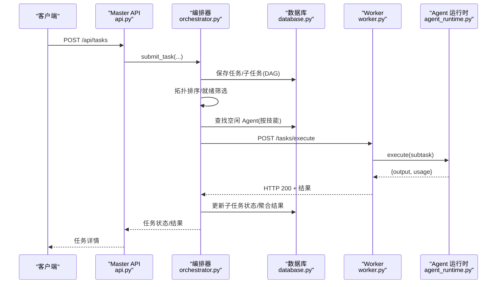
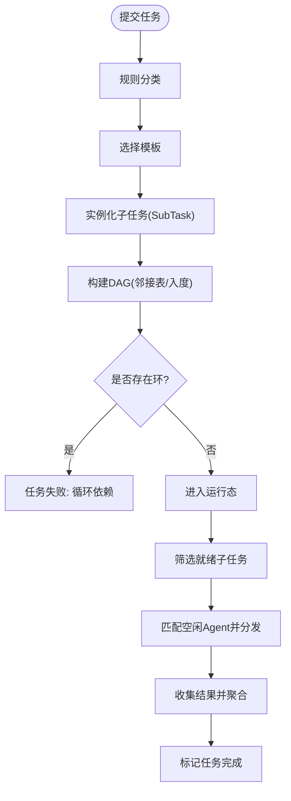
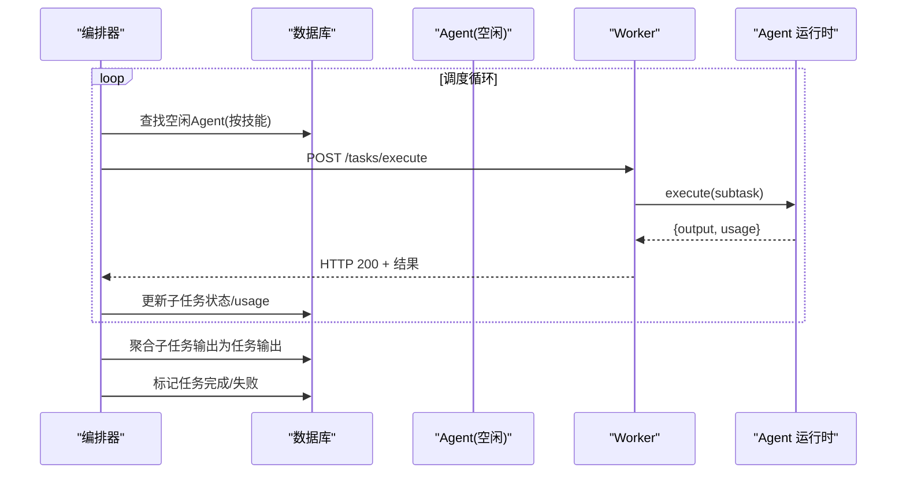
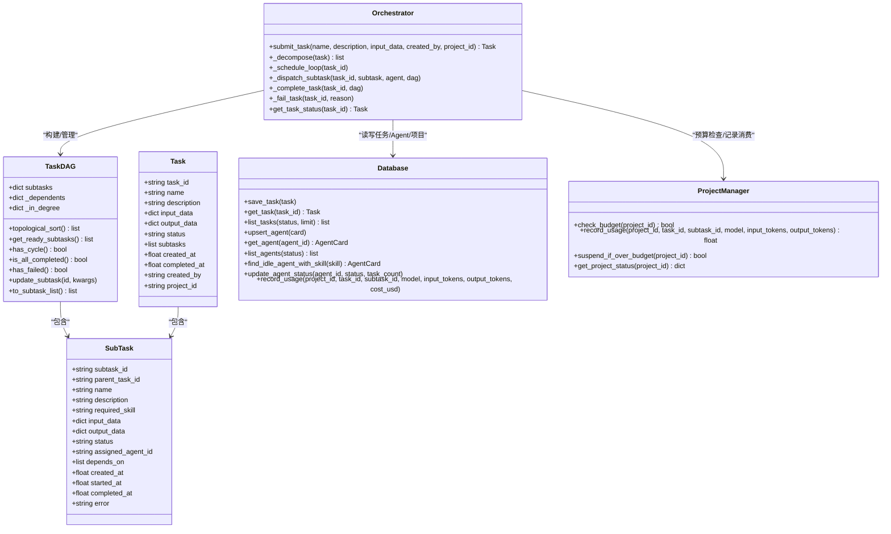

# 任务管理 API

<cite>
**本文引用的文件**
- [api.py](file://lan_mesh/api.py)
- [orchestrator.py](file://lan_mesh/orchestrator.py)
- [task.py](file://lan_mesh/task.py)
- [protocol.py](file://lan_mesh/protocol.py)
- [database.py](file://lan_mesh/database.py)
- [project.py](file://lan_mesh/project.py)
- [worker.py](file://lan_mesh/worker.py)
- [agent_runtime.py](file://lan_mesh/agent_runtime.py)
- [agent_card.py](file://lan_mesh/agent_card.py)
- [station_api.py](file://lan_mesh/station_api.py)
- [config.yaml](file://config.yaml)
</cite>

## 目录
1. [简介](#简介)
2. [项目结构](#项目结构)
3. [核心组件](#核心组件)
4. [架构总览](#架构总览)
5. [详细组件分析](#详细组件分析)
6. [依赖关系分析](#依赖关系分析)
7. [性能考量](#性能考量)
8. [故障排查指南](#故障排查指南)
9. [结论](#结论)
10. [附录](#附录)

## 简介
本文件面向任务管理功能，提供全面的 API 文档与实现解析，覆盖以下接口：
- 提交任务：POST /api/tasks
- 任务列表：GET /api/tasks
- 任务详情：GET /api/tasks/{task_id}

并深入说明任务提交流程、DAG 任务分解、子任务调度与结果聚合机制；涵盖任务状态管理、执行进度跟踪、错误处理与重试策略；提供任务优先级设置、资源分配与并发控制方法；解释任务与 Agent 的匹配算法与负载均衡策略。

## 项目结构
- 任务管理位于 Master 节点，通过 FastAPI 路由提供 REST API，并由编排器 Orchestrator 负责任务生命周期管理。
- Worker 节点负责注册、心跳上报与子任务执行。
- 数据持久化采用 SQLite，统一存储主机、Agent、任务与项目信息。
- 项目管理模块提供预算控制与路由策略，贯穿任务生命周期。

图表来源
- [api.py:103-526](file://lan_mesh/api.py#L103-L526)
- [orchestrator.py:58-262](file://lan_mesh/orchestrator.py#L58-L262)
- [database.py:16-611](file://lan_mesh/database.py#L16-L611)
- [project.py:62-320](file://lan_mesh/project.py#L62-L320)
- [worker.py:62-325](file://lan_mesh/worker.py#L62-L325)
- [agent_runtime.py:28-242](file://lan_mesh/agent_runtime.py#L28-L242)
- [agent_card.py:167-228](file://lan_mesh/agent_card.py#L167-L228)
- [station_api.py](file://lan_mesh/station_api.py#L67-L324)

章节来源
- [api.py:103-526](file://lan_mesh/api.py#L103-L526)
- [station_api.py](file://lan_mesh/station_api.py#L187-L324)

## 核心组件
- 任务模型与状态机：Task、SubTask、TaskStatus，支持 pending → assigned → running → completed/failed。
- DAG 任务分解与调度：TaskDAG 提供拓扑排序、就绪子任务筛选、循环依赖检测与状态更新。
- 编排器：接收任务、分解为子任务、构建 DAG、匹配 Agent、分发子任务、收集结果并聚合。
- 数据库：持久化主机、Agent、任务、项目与消费记录。
- 项目管理：预算控制、路由策略、消费记录与超支处理。
- Worker 与 Agent：注册、心跳、能力卡、子任务执行。

章节来源
- [protocol.py:239-298](file://lan_mesh/protocol.py#L239-L298)
- [task.py:16-91](file://lan_mesh/task.py#L16-L91)
- [orchestrator.py:58-262](file://lan_mesh/orchestrator.py#L58-L262)
- [database.py:16-611](file://lan_mesh/database.py#L16-L611)
- [project.py:62-320](file://lan_mesh/project.py#L62-L320)
- [worker.py:62-325](file://lan_mesh/worker.py#L62-L325)
- [agent_runtime.py:28-242](file://lan_mesh/agent_runtime.py#L28-L242)
- [agent_card.py:167-228](file://lan_mesh/agent_card.py#L167-L228)

## 架构总览
任务管理的整体流程如下：
- 客户端调用提交任务接口，Master 的编排器接收请求并进行任务分解。
- 编排器构建子任务 DAG，检测循环依赖，若无环则进入运行态。
- 编排器持续调度：查找就绪子任务（前置依赖完成），匹配空闲 Agent，分发执行。
- Worker 接收子任务，调用 Agent 运行时执行，返回结果与 token 用量。
- 编排器聚合子任务结果，更新任务状态，记录项目消费，完成或失败。

图表来源
- [api.py:302-344](file://lan_mesh/api.py#L302-L344)
- [orchestrator.py:70-262](file://lan_mesh/orchestrator.py#L70-L262)
- [database.py:421-488](file://lan_mesh/database.py#L421-L488)
- [worker.py:126-195](file://lan_mesh/worker.py#L126-L195)
- [agent_runtime.py:47-75](file://lan_mesh/agent_runtime.py#L47-L75)

## 详细组件分析

### 提交任务 API：POST /api/tasks
- 功能：接收任务请求，进行预算校验（可选项目关联）、任务分解、构建 DAG、启动调度线程。
- 请求体字段：
  - name：任务名称
  - description：任务描述
  - input_data：输入数据
  - created_by：创建者标识
  - project_id：可选，关联项目进行预算控制
- 响应：返回任务对象（包含任务 ID、状态、子任务列表）。
- 错误处理：
  - 编排器未初始化：返回 503
  - 项目预算不足：返回 402
  - 循环依赖：任务状态置为 failed，输出错误信息
- 广播：提交成功后通过 WebSocket 广播任务提交事件。

章节来源
- [api.py:302-326](file://lan_mesh/api.py#L302-L326)
- [orchestrator.py:70-108](file://lan_mesh/orchestrator.py#L70-L108)
- [database.py:421-441](file://lan_mesh/database.py#L421-L441)

### 任务列表 API：GET /api/tasks
- 功能：按状态过滤列出任务，支持 limit。
- 查询参数：
  - status：可选，按状态过滤
  - limit：可选，默认 50
- 响应：返回任务数组与总数。

章节来源
- [api.py:328-335](file://lan_mesh/api.py#L328-L335)
- [database.py:463-488](file://lan_mesh/database.py#L463-L488)

### 任务详情 API：GET /api/tasks/{task_id}
- 功能：查询单个任务状态与详情。
- 响应：任务对象（包含子任务列表、状态、输出等）。
- 错误：任务不存在返回 404。

章节来源
- [api.py:337-344](file://lan_mesh/api.py#L337-L344)
- [database.py:443-461](file://lan_mesh/database.py#L443-L461)

### 任务提交流程与 DAG 任务分解
- 任务分类：根据任务名称/描述关键词进行规则分类（如 code_task、document_task、system_task、simple_task）。
- 子任务模板：每类任务对应一组子任务模板，包含名称、技能、描述与依赖索引。
- DAG 构建：将模板实例化为 SubTask，建立依赖关系（depends_on_idx 映射到已生成的 subtask_id）。
- 循环依赖检测：通过拓扑排序长度判断，若小于节点数则存在环。
- 就绪筛选：仅返回状态为 pending 且所有前置依赖均已完成的子任务。

图表来源
- [orchestrator.py:46-131](file://lan_mesh/orchestrator.py#L46-L131)
- [task.py:22-79](file://lan_mesh/task.py#L22-L79)

章节来源
- [orchestrator.py:46-131](file://lan_mesh/orchestrator.py#L46-L131)
- [task.py:22-79](file://lan_mesh/task.py#L22-L79)

### 子任务调度与结果聚合
- 调度循环：周期性扫描 DAG，获取就绪子任务，逐个匹配空闲 Agent。
- Agent 匹配：按 required_skill 查找空闲 Agent，优先选择当前任务数最少的 Agent。
- 分发执行：向 Worker 的 /tasks/execute 发起 HTTP POST，传递子任务必要字段。
- 执行与回传：Worker 调用 Agent 运行时执行，返回 output 与 usage（token 用量）。
- 状态更新：根据返回码更新子任务状态（completed/failed），记录完成时间与错误信息。
- 聚合与收尾：当 DAG 全部完成或出现失败时，聚合子任务输出为任务输出，更新任务状态并移除活动 DAG。

图表来源
- [orchestrator.py:132-227](file://lan_mesh/orchestrator.py#L132-L227)
- [database.py:421-441](file://lan_mesh/database.py#L421-L441)
- [worker.py:54-61](file://lan_mesh/worker.py#L54-L61)
- [agent_runtime.py:47-75](file://lan_mesh/agent_runtime.py#L47-L75)

章节来源
- [orchestrator.py:132-227](file://lan_mesh/orchestrator.py#L132-L227)
- [database.py:396-417](file://lan_mesh/database.py#L396-L417)

### 任务状态管理与进度跟踪
- 状态机：PENDING → ASSIGNED → RUNNING → COMPLETED/FAILED/CANCELLED。
- 进度跟踪：通过子任务列表的状态与完成时间反映任务进度；WebSocket 广播最新主机与任务状态。
- 任务生命周期：提交 → 分解 → 调度 → 执行 → 聚合 → 完成/失败。

章节来源
- [protocol.py:239-247](file://lan_mesh/protocol.py#L239-L247)
- [api.py:529-539](file://lan_mesh/api.py#L529-L539)

### 错误处理与重试策略
- 子任务失败：记录错误信息与完成时间，任务整体标记失败并停止后续分发。
- HTTP 异常：捕获请求异常，将子任务置为 failed。
- Agent 状态恢复：无论成功与否，最终都会恢复 Agent 的状态与任务计数。
- 重试策略：当前实现未内置自动重试逻辑，失败后需人工干预或二次提交。

章节来源
- [orchestrator.py:209-226](file://lan_mesh/orchestrator.py#L209-L226)

### 任务优先级、资源分配与并发控制
- 任务优先级：当前未实现显式的任务优先级队列；调度按就绪子任务顺序进行。
- 资源分配：AgentCard 中包含 max_concurrent_tasks 与 current_task_count，用于并发控制。
- 负载均衡：按技能匹配空闲 Agent，并优先选择 current_task_count 较少的 Agent。
- 项目预算：通过项目管理模块在提交前检查预算，在任务完成后记录消费并可能暂停项目。

章节来源
- [protocol.py:202-227](file://lan_mesh/protocol.py#L202-L227)
- [database.py:396-417](file://lan_mesh/database.py#L396-L417)
- [project.py:176-291](file://lan_mesh/project.py#L176-L291)

### 任务与 Agent 的匹配算法与负载均衡
- 匹配条件：Agent 状态为 idle，且具备子任务所需的 required_skill。
- 匹配策略：优先选择 current_task_count 最小的 Agent，实现简单的“最少连接”负载均衡。
- 能力声明：AgentCard 中 skills 与 tools 描述 Agent 的能力，Master 依据技能名称进行匹配。

章节来源
- [database.py:396-417](file://lan_mesh/database.py#L396-L417)
- [agent_card.py:167-228](file://lan_mesh/agent_card.py#L167-L228)

## 依赖关系分析

图表来源
- [protocol.py:239-298](file://lan_mesh/protocol.py#L239-L298)
- [task.py:16-91](file://lan_mesh/task.py#L16-L91)
- [orchestrator.py:58-262](file://lan_mesh/orchestrator.py#L58-L262)
- [database.py:16-611](file://lan_mesh/database.py#L16-L611)
- [project.py:62-320](file://lan_mesh/project.py#L62-L320)

章节来源
- [protocol.py:239-298](file://lan_mesh/protocol.py#L239-L298)
- [task.py:16-91](file://lan_mesh/task.py#L16-L91)
- [orchestrator.py:58-262](file://lan_mesh/orchestrator.py#L58-L262)
- [database.py:16-611](file://lan_mesh/database.py#L16-L611)
- [project.py:62-320](file://lan_mesh/project.py#L62-L320)

## 性能考量
- 调度频率：调度循环每 2 秒轮询一次，平衡及时性与开销。
- 并发控制：Agent 的 max_concurrent_tasks 限制单节点并发，避免资源争用。
- I/O 密集：子任务执行主要受 LLM API 与 Shell 命令影响，注意超时与重试策略。
- 数据库访问：所有状态更新均通过数据库持久化，建议合理设置索引与事务边界。
- WebSocket 广播：定期推送主机状态，避免频繁更新造成带宽压力。

## 故障排查指南
- 提交任务返回 503：编排器未初始化或项目管理器未初始化。
- 提交任务返回 402：项目预算不足或项目暂停。
- 子任务失败：查看子任务 error 字段与 Worker 日志；确认 Agent 是否具备所需技能。
- Agent 未被匹配：检查 AgentCard 的 skills 与 tools 是否正确注册；确认 Agent 状态为 idle。
- 超时或网络异常：Worker 无法连接 Master 或 LLM API；检查网络连通性与代理设置。
- 任务长时间停滞：确认是否存在循环依赖；检查前置子任务是否完成。

章节来源
- [api.py:308-318](file://lan_mesh/api.py#L308-L318)
- [orchestrator.py:209-226](file://lan_mesh/orchestrator.py#L209-L226)
- [database.py:396-417](file://lan_mesh/database.py#L396-L417)

## 结论
本任务管理方案通过规则化的任务分解与 DAG 调度，结合 Agent 能力匹配与并发控制，实现了可扩展的任务执行框架。配合项目预算与消费记录，能够有效控制成本与资源使用。未来可在任务优先级、自动重试与更精细的负载均衡方面进一步优化。

## 附录

### API 定义概览
- 提交任务
  - 方法：POST
  - 路径：/api/tasks
  - 请求体：name, description, input_data, created_by, project_id(可选)
  - 响应：Task 对象
- 任务列表
  - 方法：GET
  - 路径：/api/tasks
  - 查询参数：status(可选), limit(可选)
  - 响应：{tasks: [...], total: number}
- 任务详情
  - 方法：GET
  - 路径：/api/tasks/{task_id}
  - 响应：Task 对象

章节来源
- [api.py:302-344](file://lan_mesh/api.py#L302-L344)

### 配置要点
- 端口与发现：discovery.port、worker.api_port、master.api_port
- 共享目录：worker.shared_folder、master.shared_folder
- 数据库路径：master.db_path

章节来源
- [config.yaml:1-22](file://config.yaml#L1-L22)
