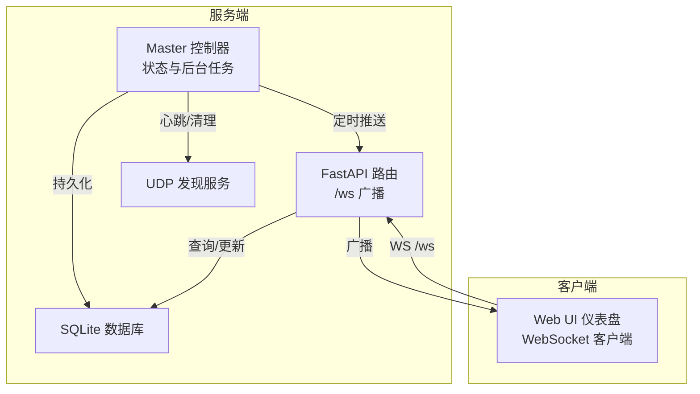
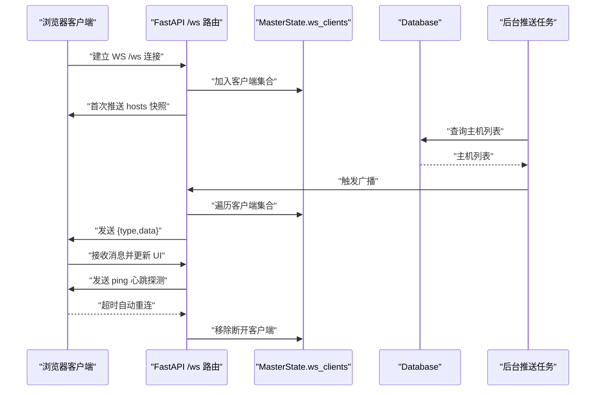
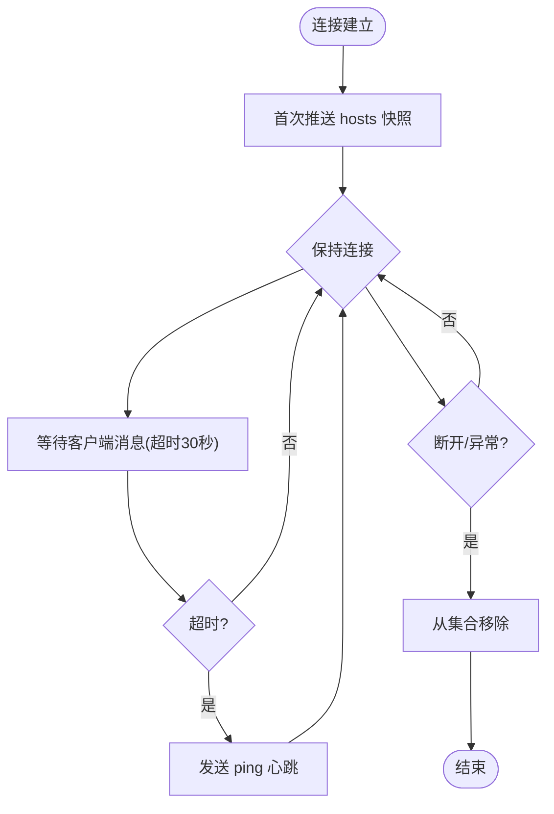
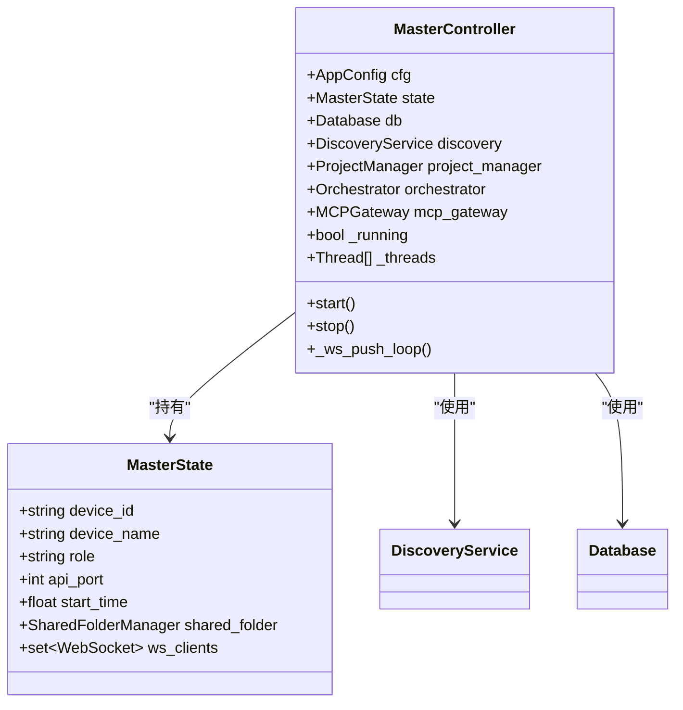
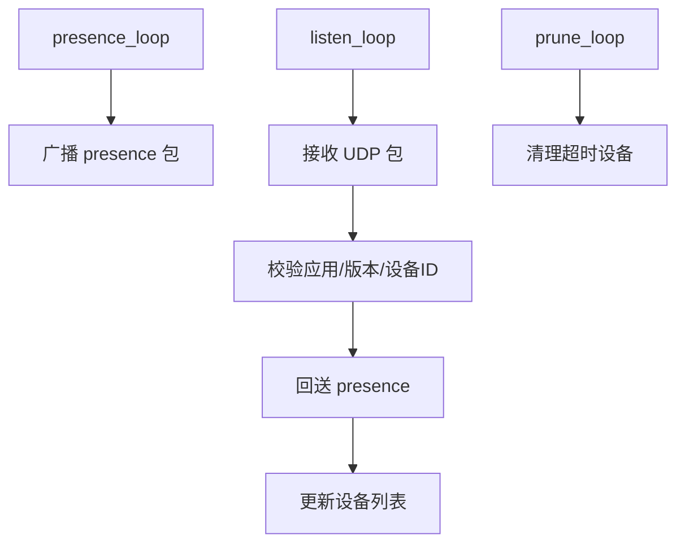
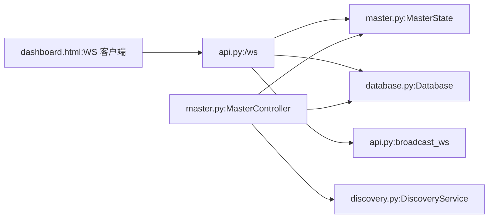

# 实时通信 API

<cite>
**本文引用的文件**
- [api.py](file://lan_mesh/api.py)
- [master.py](file://lan_mesh/master.py)
- [discovery.py](file://lan_mesh/discovery.py)
- [protocol.py](file://lan_mesh/protocol.py)
- [database.py](file://lan_mesh/database.py)
- [dashboard.html](file://lan_mesh/web/templates/dashboard.html)
</cite>

## 目录
1. [简介](#简介)
2. [项目结构](#项目结构)
3. [核心组件](#核心组件)
4. [架构总览](#架构总览)
5. [详细组件分析](#详细组件分析)
6. [依赖关系分析](#依赖关系分析)
7. [性能考量](#性能考量)
8. [故障排查指南](#故障排查指南)
9. [结论](#结论)
10. [附录](#附录)

## 简介
本文件面向实时通信功能，聚焦于 /ws WebSocket 实时推送接口，系统性阐述连接建立、消息格式、事件类型、断线重连机制、主机状态变更通知、心跳检测、客户端管理与服务端广播策略，并给出协议规范、连接池管理与性能优化建议。同时提供客户端集成示例、错误处理与调试工具说明，以及实时数据同步与状态一致性保障机制。

## 项目结构
实时通信相关代码主要分布在以下模块：
- WebSocket 路由与广播：lan_mesh/api.py
- Master 控制器与状态管理：lan_mesh/master.py
- UDP 发现与网络状态：lan_mesh/discovery.py
- 协议与数据模型：lan_mesh/protocol.py
- 数据持久化与查询：lan_mesh/database.py
- Web UI 仪表盘（含 WebSocket 客户端）：lan_mesh/web/templates/dashboard.html

图表来源
- [api.py:500-538](file://lan_mesh/api.py#L500-L538)
- [master.py:175-183](file://lan_mesh/master.py#L175-L183)
- [discovery.py:139-228](file://lan_mesh/discovery.py#L139-L228)
- [database.py:233-262](file://lan_mesh/database.py#L233-L262)

章节来源
- [api.py:500-538](file://lan_mesh/api.py#L500-L538)
- [master.py:175-183](file://lan_mesh/master.py#L175-L183)
- [discovery.py:139-228](file://lan_mesh/discovery.py#L139-L228)
- [database.py:233-262](file://lan_mesh/database.py#L233-L262)

## 核心组件
- WebSocket 路由与广播
  - /ws 路由负责接受连接、首次推送主机快照、维持连接并发送心跳探测。
  - broadcast_ws 函数向所有已连接客户端广播消息，自动剔除异常连接。
- Master 控制器
  - 维护 MasterState，包含 ws_clients 集合；启动后台任务周期性推送主机列表。
- UDP 发现服务
  - 定期广播自身存在、监听其他设备、清理超时设备，支撑主机在线状态判断。
- 协议与数据模型
  - 定义 DiscoveryPacket、HostInfo、HostRecord、AgentCard、Task、Project 等模型，统一消息结构。
- 数据库
  - 提供主机、Agent、任务、项目、消费记录等的 CRUD 与查询接口，支持心跳日志与离线清理。

章节来源
- [api.py:500-538](file://lan_mesh/api.py#L500-L538)
- [master.py:55-64](file://lan_mesh/master.py#L55-L64)
- [discovery.py:33-67](file://lan_mesh/discovery.py#L33-L67)
- [protocol.py:29-147](file://lan_mesh/protocol.py#L29-L147)
- [database.py:16-143](file://lan_mesh/database.py#L16-L143)

## 架构总览
WebSocket 实时推送链路：
- 客户端通过 WS /ws 连接服务端。
- 服务端接受连接后，首次推送当前主机列表快照。
- 服务端后台任务周期性推送主机列表，客户端据此更新 UI。
- 客户端通过心跳探测维持连接，断开后自动重连。

图表来源
- [api.py:500-538](file://lan_mesh/api.py#L500-L538)
- [master.py:175-183](file://lan_mesh/master.py#L175-L183)
- [database.py:233-262](file://lan_mesh/database.py#L233-L262)

## 详细组件分析

### WebSocket 路由与广播
- 连接建立
  - /ws 路由接受连接，将 WebSocket 对象加入 MasterState.ws_clients。
  - 首次推送当前主机列表快照（type: "hosts"）。
- 心跳与保活
  - 服务端在空闲期间等待客户端文本消息；若超时则发送 ping 类型消息作为心跳探测。
- 断线处理
  - 捕获 WebSocketDisconnect 或异常，最终从集合中移除该连接。
- 广播机制
  - broadcast_ws 将消息序列化后逐个发送给所有客户端，捕获异常并从集合中剔除失效连接。

图表来源
- [api.py:500-538](file://lan_mesh/api.py#L500-L538)

章节来源
- [api.py:500-538](file://lan_mesh/api.py#L500-L538)

### Master 控制器与状态管理
- MasterState
  - 维护设备标识、名称、角色、API 端口、启动时间、共享目录与 ws_clients 集合。
- 后台推送任务
  - 每 3 秒查询数据库主机列表，广播 hosts 类型消息，实现 UI 实时更新。
- 生命周期
  - 启动时创建 FastAPI 应用，挂载 Master/Worker 路由，启动 UDP 发现、配置刷新与离线清理线程，注册后台任务。

图表来源
- [master.py:55-64](file://lan_mesh/master.py#L55-L64)
- [master.py:67-114](file://lan_mesh/master.py#L67-L114)
- [master.py:175-183](file://lan_mesh/master.py#L175-L183)

章节来源
- [master.py:55-64](file://lan_mesh/master.py#L55-L64)
- [master.py:67-114](file://lan_mesh/master.py#L67-L114)
- [master.py:175-183](file://lan_mesh/master.py#L175-L183)

### UDP 发现与网络状态
- 发现服务
  - presence_loop：周期性广播自身存在。
  - listen_loop：监听其他设备包，回送 presence，更新设备列表并触发回调。
  - prune_loop：定期清理超时设备。
- 网络状态
  - 提供本地 IP、广播目标、端口等网络状态信息。

图表来源
- [discovery.py:139-228](file://lan_mesh/discovery.py#L139-L228)

章节来源
- [discovery.py:139-228](file://lan_mesh/discovery.py#L139-L228)

### 协议与数据模型
- DiscoveryPacket：UDP 广播载荷，包含应用名、版本、设备信息与硬件摘要。
- HostInfo/HostRecord：HTTP API 与数据库中的主机信息模型，支持在线状态与资源使用率。
- AgentCard：Agent 能力声明，包含技能、工具、模型偏好与并发能力。
- Task/Project：任务与项目模型，支持状态机、预算与路由策略。

章节来源
- [protocol.py:29-147](file://lan_mesh/protocol.py#L29-L147)
- [protocol.py:178-234](file://lan_mesh/protocol.py#L178-L234)
- [protocol.py:237-297](file://lan_mesh/protocol.py#L237-L297)
- [protocol.py:300-355](file://lan_mesh/protocol.py#L300-L355)

### 数据库与持久化
- 主机记录：upsert_host、get_host、list_hosts、set_offline、prune_offline、cleanup_old_heartbeats。
- Agent：upsert_agent、get_agent、list_agents、update_agent_status、find_idle_agent_with_skill。
- 任务与项目：save_task、get_task、list_tasks、upsert_project、get_project、list_projects、delete_project、update_project_budget、update_project_status。
- 消费记录：record_usage、get_usage_log。

章节来源
- [database.py:16-143](file://lan_mesh/database.py#L16-L143)
- [database.py:147-290](file://lan_mesh/database.py#L147-L290)
- [database.py:293-417](file://lan_mesh/database.py#L293-L417)
- [database.py:421-488](file://lan_mesh/database.py#L421-L488)
- [database.py:492-585](file://lan_mesh/database.py#L492-L585)
- [database.py:589-611](file://lan_mesh/database.py#L589-L611)

### Web UI 仪表盘（客户端）
- WebSocket 客户端
  - 连接 WS /ws，监听消息类型并更新对应面板。
  - 断开后 3 秒自动重连。
- 面板联动
  - hosts/heartbeat/host_registered：刷新主机列表。
  - task_submitted：刷新任务列表。
  - agent_registered：刷新 Agent 列表。
  - project_created/project_updated/project_archived：刷新项目列表。

章节来源
- [dashboard.html:195-208](file://lan_mesh/web/templates/dashboard.html#L195-L208)
- [dashboard.html:210-232](file://lan_mesh/web/templates/dashboard.html#L210-L232)
- [dashboard.html:291-320](file://lan_mesh/web/templates/dashboard.html#L291-L320)
- [dashboard.html:386-428](file://lan_mesh/web/templates/dashboard.html#L386-L428)

## 依赖关系分析
- WebSocket 路由依赖 MasterState 的 ws_clients 集合与数据库查询。
- Master 控制器依赖 DiscoveryService、Database、ProjectManager、Orchestrator、MCPGateway。
- DiscoveryService 依赖协议常量与网络工具函数。
- Web UI 仪表盘依赖 FastAPI 的 /ws 与 /api/* 端点。

图表来源
- [api.py:500-538](file://lan_mesh/api.py#L500-L538)
- [master.py:55-64](file://lan_mesh/master.py#L55-L64)
- [database.py:233-262](file://lan_mesh/database.py#L233-L262)
- [discovery.py:139-228](file://lan_mesh/discovery.py#L139-L228)
- [dashboard.html:195-208](file://lan_mesh/web/templates/dashboard.html#L195-L208)

章节来源
- [api.py:500-538](file://lan_mesh/api.py#L500-L538)
- [master.py:55-64](file://lan_mesh/master.py#L55-L64)
- [database.py:233-262](file://lan_mesh/database.py#L233-L262)
- [discovery.py:139-228](file://lan_mesh/discovery.py#L139-L228)
- [dashboard.html:195-208](file://lan_mesh/web/templates/dashboard.html#L195-L208)

## 性能考量
- 连接池管理
  - 使用集合维护活跃 WebSocket 连接，广播时遍历集合并捕获异常剔除失效连接，避免阻塞其他客户端。
- 广播策略
  - 后台任务每 3 秒推送一次主机列表，频率适中，兼顾实时性与服务器负载。
- 心跳机制
  - 服务端在 30 秒超时后发送 ping，客户端断线自动重连，降低无效连接占用。
- 数据库访问
  - 每次广播查询数据库主机列表，建议在高并发场景下考虑缓存或增量更新策略。
- 线程与异步
  - MasterController 使用多线程与 asyncio 结合，后台任务与 HTTP 服务并行运行。

章节来源
- [api.py:529-538](file://lan_mesh/api.py#L529-L538)
- [master.py:175-183](file://lan_mesh/master.py#L175-L183)
- [dashboard.html:195-208](file://lan_mesh/web/templates/dashboard.html#L195-L208)

## 故障排查指南
- 连接问题
  - 确认 /ws 路由是否正确接受连接并推送 hosts 快照。
  - 检查 MasterState.ws_clients 是否包含当前连接。
- 心跳问题
  - 若客户端长时间无响应，服务端会发送 ping；确认客户端是否正确处理并维持连接。
- 广播异常
  - broadcast_ws 会捕获异常并剔除失效连接；检查是否有大量异常导致连接池膨胀。
- 数据不同步
  - 确认后台推送任务是否正常运行，数据库查询是否返回预期结果。
- UDP 发现异常
  - 检查 DiscoveryService 的端口绑定与广播目标，确认防火墙未阻止 UDP。

章节来源
- [api.py:500-538](file://lan_mesh/api.py#L500-L538)
- [api.py:529-538](file://lan_mesh/api.py#L529-L538)
- [master.py:175-183](file://lan_mesh/master.py#L175-L183)
- [discovery.py:139-228](file://lan_mesh/discovery.py#L139-L228)

## 结论
本系统通过 /ws WebSocket 实现实时推送，结合后台任务与数据库查询，实现主机状态的近实时更新。客户端具备断线重连与心跳探测机制，确保连接稳定性。通过广播策略与异常处理，系统在高并发场景下仍能维持较好的性能与可靠性。建议在大规模部署时引入缓存与增量更新策略，进一步优化广播频率与数据库访问。

## 附录

### WebSocket 协议规范
- 协议版本：基于标准 WebSocket，消息为 JSON 文本。
- 连接地址：ws://host:port/ws（HTTPS 环境使用 wss）。
- 首次消息：type 为 "hosts"，data 为当前主机列表数组。
- 心跳消息：type 为 "ping"，客户端需在收到后维持连接。
- 断线重连：客户端断开后 3 秒自动重连。

章节来源
- [api.py:500-538](file://lan_mesh/api.py#L500-L538)
- [dashboard.html:195-208](file://lan_mesh/web/templates/dashboard.html#L195-L208)

### 消息类型定义
- hosts：推送当前主机列表快照。
- heartbeat：推送某主机的心跳与资源使用率。
- host_registered：某主机注册成功后的通知。
- task_submitted：任务提交后的通知。
- agent_registered：Agent 注册后的通知。
- project_created/project_updated/project_archived：项目生命周期事件。

章节来源
- [api.py:145-167](file://lan_mesh/api.py#L145-L167)
- [api.py:278-279](file://lan_mesh/api.py#L278-L279)
- [api.py:325-326](file://lan_mesh/api.py#L325-L326)
- [api.py:400-401](file://lan_mesh/api.py#L400-L401)
- [api.py:410-411](file://lan_mesh/api.py#L410-L411)

### 客户端集成示例（前端）
- 连接与断线重连
  - 使用原生 WebSocket，连接后监听消息类型并更新 UI。
  - 断开后 3 秒重连，直至成功。
- 心跳处理
  - 收到 "ping" 后维持连接，避免超时断开。
- 面板联动
  - 根据消息类型刷新对应面板：主机、任务、Agent、项目。

章节来源
- [dashboard.html:195-208](file://lan_mesh/web/templates/dashboard.html#L195-L208)
- [dashboard.html:210-232](file://lan_mesh/web/templates/dashboard.html#L210-L232)
- [dashboard.html:291-320](file://lan_mesh/web/templates/dashboard.html#L291-L320)
- [dashboard.html:386-428](file://lan_mesh/web/templates/dashboard.html#L386-L428)

### 错误处理与调试工具
- 服务端
  - 捕获 WebSocketDisconnect 与异常，确保连接安全移除。
  - broadcast_ws 捕获发送异常并剔除失效连接。
- 客户端
  - 断线自动重连，显示连接状态指示。
  - 控制台输出错误信息便于定位问题。

章节来源
- [api.py:519-524](file://lan_mesh/api.py#L519-L524)
- [api.py:536-538](file://lan_mesh/api.py#L536-L538)
- [dashboard.html:195-208](file://lan_mesh/web/templates/dashboard.html#L195-L208)

### 实时数据同步与状态一致性
- 数据来源
  - 主机列表来自数据库查询，心跳与注册事件驱动状态更新。
- 广播策略
  - 后台任务周期性推送，客户端收到后立即渲染，保证 UI 与后端状态一致。
- 离线清理
  - 通过 DiscoveryService 与数据库的 TTL 机制，定期清理离线设备，避免陈旧状态污染。

章节来源
- [master.py:175-183](file://lan_mesh/master.py#L175-L183)
- [discovery.py:216-228](file://lan_mesh/discovery.py#L216-L228)
- [database.py:272-280](file://lan_mesh/database.py#L272-L280)