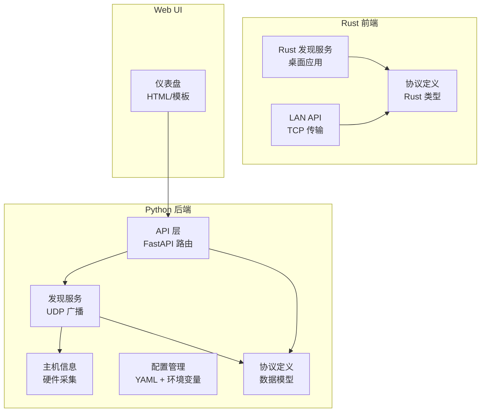
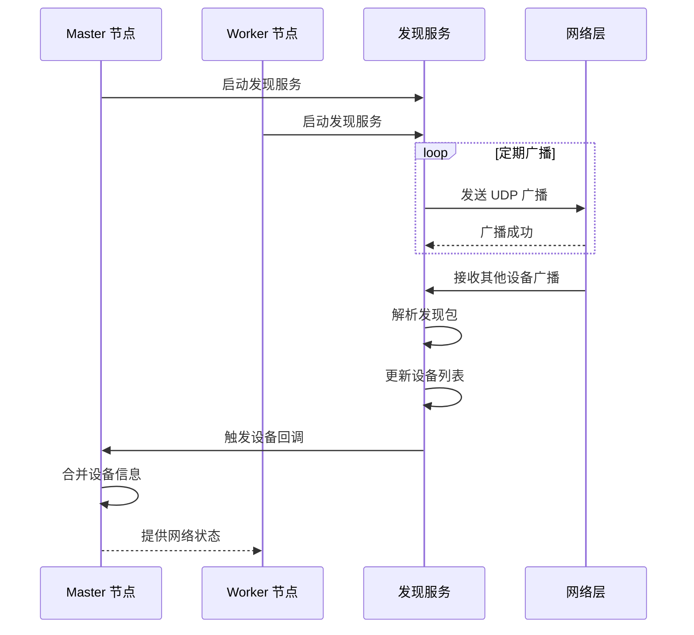
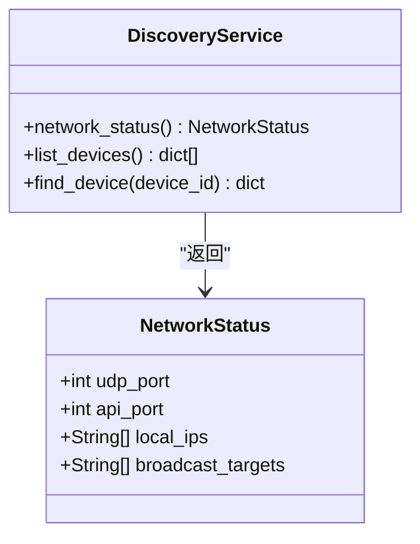
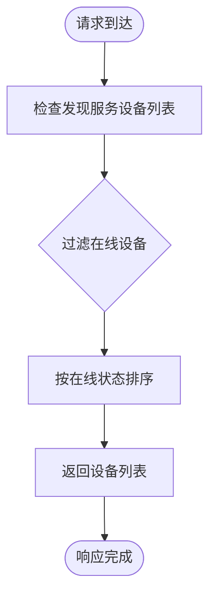
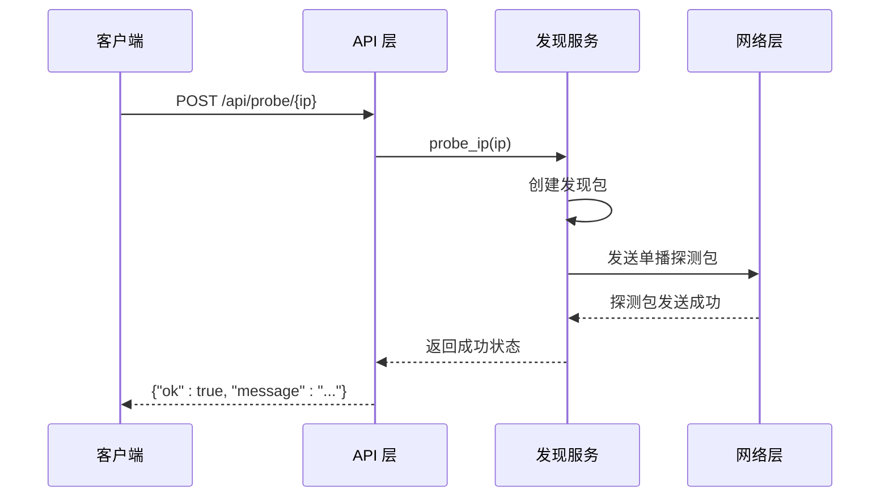
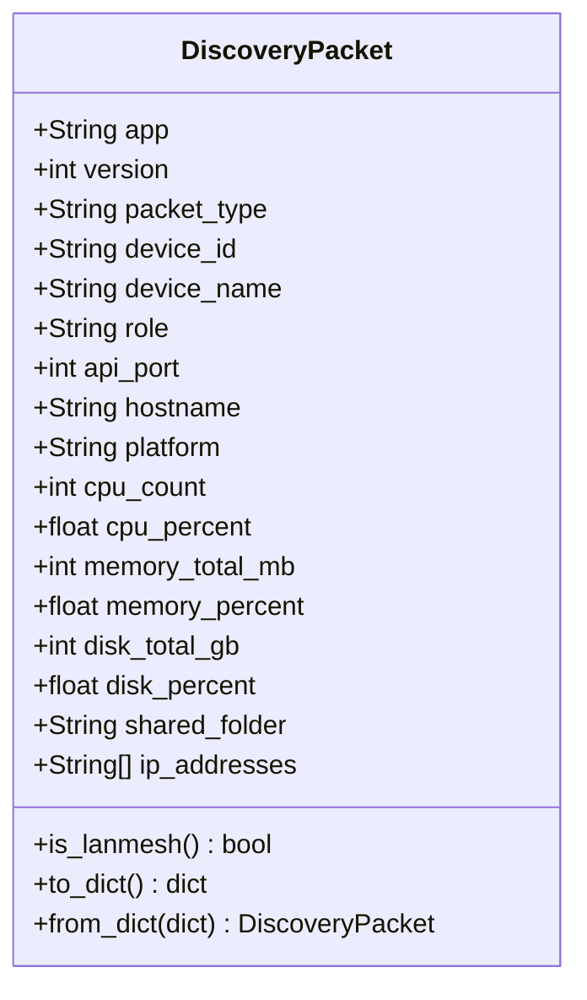
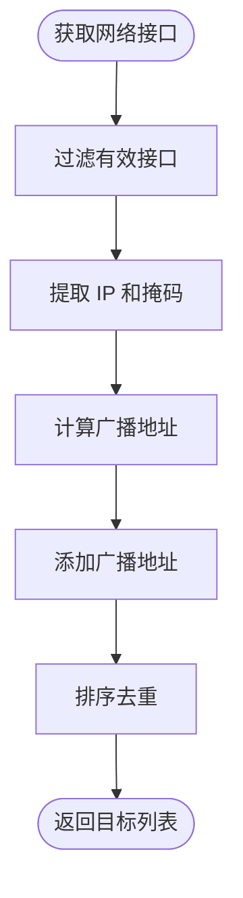
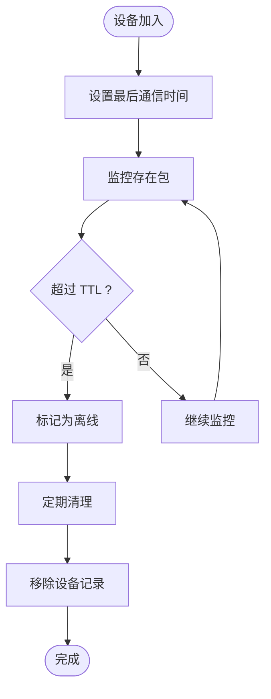
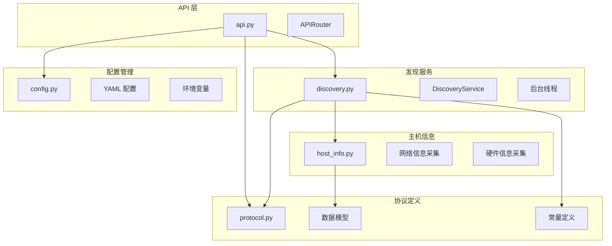

# 网络发现 API

<cite>
**本文档引用的文件**
- [api.py](file://lan_mesh/api.py)
- [discovery.py](file://lan_mesh/discovery.py)
- [host_info.py](file://lan_mesh/host_info.py)
- [protocol.py](file://lan_mesh/protocol.py)
- [config.py](file://lan_mesh/config.py)
- [discovery.rs](file://quicklan-main/src-tauri/src/discovery.rs)
- [lan_api.rs](file://quicklan-main/src-tauri/src/lan_api.rs)
- [protocol.rs](file://quicklan-main/src-tauri/src/protocol.rs)
- [lib.rs](file://quicklan-main/src-tauri/src/lib.rs)
- [config.yaml](file://config.yaml)
</cite>

## 目录
1. [简介](#简介)
2. [项目结构](#项目结构)
3. [核心组件](#核心组件)
4. [架构概览](#架构概览)
5. [详细组件分析](#详细组件分析)
6. [依赖关系分析](#依赖关系分析)
7. [性能考虑](#性能考虑)
8. [故障排除指南](#故障排除指南)
9. [结论](#结论)

## 简介

LAN Mesh 是一个基于 UDP 广播的局域网设备发现框架，提供了完整的网络发现、设备管理和资源共享能力。本文档专注于网络发现功能的 API 接口，包括本机网络状态查询、UDP 发现设备列表查询和主动 IP 探测等核心功能。

该系统支持 Master/Worker 架构，其中 Master 节点负责协调和管理，Worker 节点负责执行具体任务。网络发现机制通过 UDP 广播实现设备间的自动发现和状态同步。

## 项目结构

LAN Mesh 项目采用模块化设计，主要分为以下几部分：



**图表来源**
- [api.py:1-539](file://lan_mesh/api.py#L1-L539)
- [discovery.py:1-259](file://lan_mesh/discovery.py#L1-L259)
- [discovery.rs:1-384](file://quicklan-main/src-tauri/src/discovery.rs#L1-L384)

**章节来源**
- [api.py:1-539](file://lan_mesh/api.py#L1-L539)
- [discovery.py:1-259](file://lan_mesh/discovery.py#L1-L259)
- [config.py:1-84](file://lan_mesh/config.py#L1-L84)

## 核心组件

### API 路由层

系统提供两套 API 路由：Worker 路由和 Master 路由，分别服务于不同的节点角色。

**Worker API 端点：**
- `GET /info` - 返回本机完整配置信息
- `GET /shared` - 列出共享文件
- `GET /shared/{path}` - 下载共享文件
- `POST /shared` - 上传文件到共享目录

**Master API 端点：**
- `GET /api/network` - 查询本机网络状态
- `GET /api/discovery` - 获取 UDP 发现到的设备列表
- `POST /api/probe/{ip}` - 主动探测指定 IP
- `GET /api/hosts` - 获取所有主机列表
- `GET /api/hosts/{id}` - 查询单台主机详情

### 发现服务

DiscoveryService 是网络发现的核心组件，负责：
- 定期广播自身存在信息
- 监听其他设备的发现包
- 维护设备状态和在线时间
- 清理超时离线设备

### 主机信息采集

系统能够自动采集主机的硬件配置信息，包括：
- CPU 信息（核心数、频率、使用率）
- 内存信息（总量、可用量、使用率）
- 磁盘信息（根分区使用情况）
- 网络接口信息（IPv4 地址、MAC 地址）

**章节来源**
- [api.py:103-256](file://lan_mesh/api.py#L103-L256)
- [discovery.py:33-135](file://lan_mesh/discovery.py#L33-L135)
- [host_info.py:129-212](file://lan_mesh/host_info.py#L129-L212)

## 架构概览

系统采用 Master/Worker 分布式架构，结合 UDP 广播实现设备发现：



**图表来源**
- [discovery.py:139-214](file://lan_mesh/discovery.py#L139-L214)
- [api.py:217-240](file://lan_mesh/api.py#L217-L240)

## 详细组件分析

### 网络发现 API

#### 本机网络状态查询

**端点：** `GET /api/network`

该接口返回 Master 节点的本机网络状态信息，包括：



**响应示例：**
```json
{
    "udp_port": 45454,
    "api_port": 45470,
    "local_ips": ["192.168.1.100", "10.0.0.5"],
    "broadcast_targets": ["192.168.1.255", "10.0.0.255", "255.255.255.255"]
}
```

**图表来源**
- [protocol.py:150-157](file://lan_mesh/protocol.py#L150-L157)
- [discovery.py:128-135](file://lan_mesh/discovery.py#L128-L135)

**章节来源**
- [api.py:217-226](file://lan_mesh/api.py#L217-L226)
- [protocol.py:150-157](file://lan_mesh/protocol.py#L150-L157)

#### UDP 发现设备列表查询

**端点：** `GET /api/discovery`

该接口返回当前通过 UDP 广播发现到的所有设备信息：



**响应示例：**
```json
{
    "devices": [
        {
            "device_id": "abc-123-def-456",
            "device_name": "Worker-Node-1",
            "role": "worker",
            "hostname": "worker1.example.com",
            "platform": "Linux",
            "ip": "192.168.1.101",
            "api_port": 45460,
            "cpu_count": 8,
            "memory_total_mb": 16384,
            "disk_total_gb": 500,
            "online": true,
            "last_seen_ago": 0.5
        }
    ],
    "total": 1
}
```

**图表来源**
- [discovery.py:97-113](file://lan_mesh/discovery.py#L97-L113)
- [api.py:228-234](file://lan_mesh/api.py#L228-L234)

**章节来源**
- [api.py:228-234](file://lan_mesh/api.py#L228-L234)
- [discovery.py:97-113](file://lan_mesh/discovery.py#L97-L113)

#### 主动探测指定 IP

**端点：** `POST /api/probe/{ip}`

该接口允许主动向指定 IP 地址发送探测包：



**请求参数：**
- `ip` (路径参数): 目标 IP 地址

**响应示例：**
```json
{
    "ok": true,
    "message": "已向 192.168.1.101 发送探测包"
}
```

**图表来源**
- [discovery.py:255-259](file://lan_mesh/discovery.py#L255-L259)
- [api.py:236-240](file://lan_mesh/api.py#L236-L240)

**章节来源**
- [api.py:236-240](file://lan_mesh/api.py#L236-L240)
- [discovery.py:255-259](file://lan_mesh/discovery.py#L255-L259)

### UDP 广播发现机制

#### 发现包结构

发现包采用 JSON 格式，包含设备的基本信息和配置摘要：



**字段说明：**
- `app`: 应用名称（固定为 "lan-mesh"）
- `version`: 协议版本（固定为 1）
- `packet_type`: 包类型（"presence" 表示存在包）
- `device_id`: 设备唯一标识符
- `device_name`: 设备显示名称
- `role`: 设备角色（master/worker）
- `api_port`: HTTP API 端口号
- `hostname`: 主机名
- `platform`: 操作系统平台
- `cpu_count`: CPU 核心数
- `cpu_percent`: CPU 使用率
- `memory_total_mb`: 内存总量（MB）
- `memory_percent`: 内存使用率
- `disk_total_gb`: 磁盘总量（GB）
- `disk_percent`: 磁盘使用率
- `shared_folder`: 共享文件夹路径
- `ip_addresses`: 本地 IPv4 地址列表

**图表来源**
- [protocol.py:29-65](file://lan_mesh/protocol.py#L29-L65)

#### 广播目标地址计算

系统会计算所有可用网络接口的广播地址：



**计算公式：**
对于每个网络接口，使用以下公式计算广播地址：
```
广播地址 = IP地址 | (~掩码)
```

**章节来源**
- [host_info.py:77-103](file://lan_mesh/host_info.py#L77-L103)
- [discovery.rs:313-332](file://quicklan-main/src-tauri/src/discovery.rs#L313-L332)

### 网络配置参数

系统支持通过 YAML 配置文件和环境变量进行配置：

| 配置项 | 类型 | 默认值 | 描述 |
|--------|------|--------|------|
| `discovery.port` | int | 45454 | UDP 广播发现端口 |
| `discovery.presence_interval` | int | 3 | 广播间隔（秒） |
| `discovery.device_ttl` | int | 12 | 设备离线判定阈值（秒） |
| `worker.api_port` | int | 45460 | Worker HTTP API 端口 |
| `worker.shared_folder` | str | ~/lan_mesh_shared | 共享文件夹路径 |
| `master.api_port` | int | 45470 | Master HTTP API 端口 |
| `master.shared_folder` | str | ~/lan_mesh_shared | 共享文件夹路径 |
| `master.db_path` | str | ~/.lan_mesh/master.sqlite3 | SQLite 数据库路径 |

**章节来源**
- [config.py:14-40](file://lan_mesh/config.py#L14-L40)
- [config.yaml:4-22](file://config.yaml#L4-L22)

### 发现延迟设置和超时处理

系统实现了多层超时和清理机制：



**超时参数：**
- `PRESENCE_INTERVAL_SECS`: 3 秒（广播间隔）
- `DEVICE_TTL_SECS`: 12 秒（离线判定）
- `PRUNE_INTERVAL_SECS`: 5 秒（清理检查间隔）

**章节来源**
- [protocol.py:21-25](file://lan_mesh/protocol.py#L21-L25)
- [discovery.py:216-228](file://lan_mesh/discovery.py#L216-L228)

## 依赖关系分析

系统各组件之间的依赖关系如下：



**图表来源**
- [api.py:33-34](file://lan_mesh/api.py#L33-L34)
- [discovery.py:22-30](file://lan_mesh/discovery.py#L22-L30)
- [host_info.py:16](file://lan_mesh/host_info.py#L16)

**章节来源**
- [api.py:33-34](file://lan_mesh/api.py#L33-L34)
- [discovery.py:22-30](file://lan_mesh/discovery.py#L22-L30)

## 性能考虑

### UDP 广播优化

1. **广播目标去重**: 系统会对计算出的广播目标进行排序和去重，避免重复发送
2. **端口复用**: 支持端口复用选项，提高端口占用时的兼容性
3. **异步处理**: 发现服务使用后台线程处理广播、监听和清理任务

### 内存管理

1. **设备状态缓存**: 使用字典存储设备状态，支持快速查找和更新
2. **线程安全**: 使用 RLock 确保多线程环境下的数据一致性
3. **定期清理**: 自动清理超时设备，防止内存泄漏

### 网络效率

1. **增量更新**: 只在设备状态发生变化时触发通知
2. **批量处理**: 广播包包含完整的硬件配置摘要，减少后续查询需求
3. **错误容忍**: 对网络异常进行优雅处理，不影响整体功能

## 故障排除指南

### 常见网络问题

#### 端口占用问题

**症状：** 发现服务启动失败，提示端口被占用

**解决方案：**
1. 检查端口是否被其他程序占用
2. 修改配置文件中的端口号
3. 使用管理员权限运行程序

#### 网络接口识别问题

**症状：** 无法正确识别网络接口或广播地址

**解决方案：**
1. 检查网络接口状态
2. 确认防火墙设置允许 UDP 广播
3. 手动指定网络接口

#### 设备不在线问题

**症状：** 设备频繁显示离线状态

**解决方案：**
1. 检查网络连接稳定性
2. 调整 `device_ttl` 参数
3. 确认设备正常运行

### 调试工具

#### 网络诊断命令

```bash
# 检查 UDP 端口监听状态
netstat -an | grep 45454

# 测试网络连通性
ping 192.168.1.255

# 查看路由表
route -n
```

#### 日志分析

系统会在控制台输出详细的调试信息，包括：
- 端口绑定失败信息
- 广播发送错误
- 设备状态变化
- 线程异常

**章节来源**
- [discovery.py:155-174](file://lan_mesh/discovery.py#L155-L174)
- [discovery.rs:169-175](file://quicklan-main/src-tauri/src/discovery.rs#L169-L175)

## 结论

LAN Mesh 的网络发现 API 提供了完整的局域网设备发现和管理能力。通过 UDP 广播机制，系统能够自动发现网络中的设备，并提供实时的状态更新和故障恢复机制。

主要特点包括：
- **自动发现**: 无需手动配置即可发现网络中的设备
- **实时状态**: 提供设备的实时硬件配置和在线状态
- **故障恢复**: 自动检测和清理离线设备
- **灵活配置**: 支持通过 YAML 和环境变量进行配置
- **跨平台**: 支持多种操作系统和网络环境

该系统为构建分布式网络应用提供了坚实的基础，特别适用于需要自动发现和管理网络设备的场景。