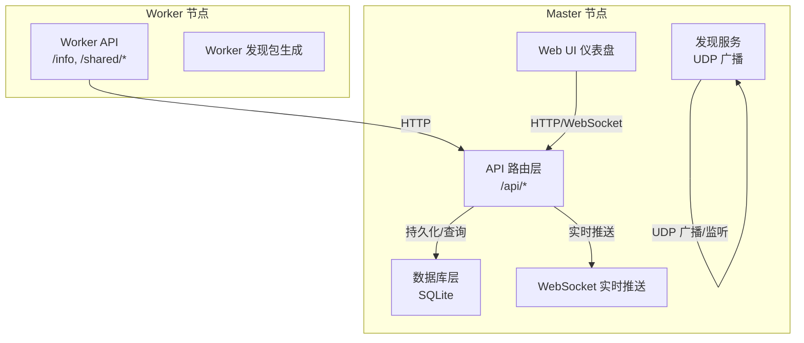
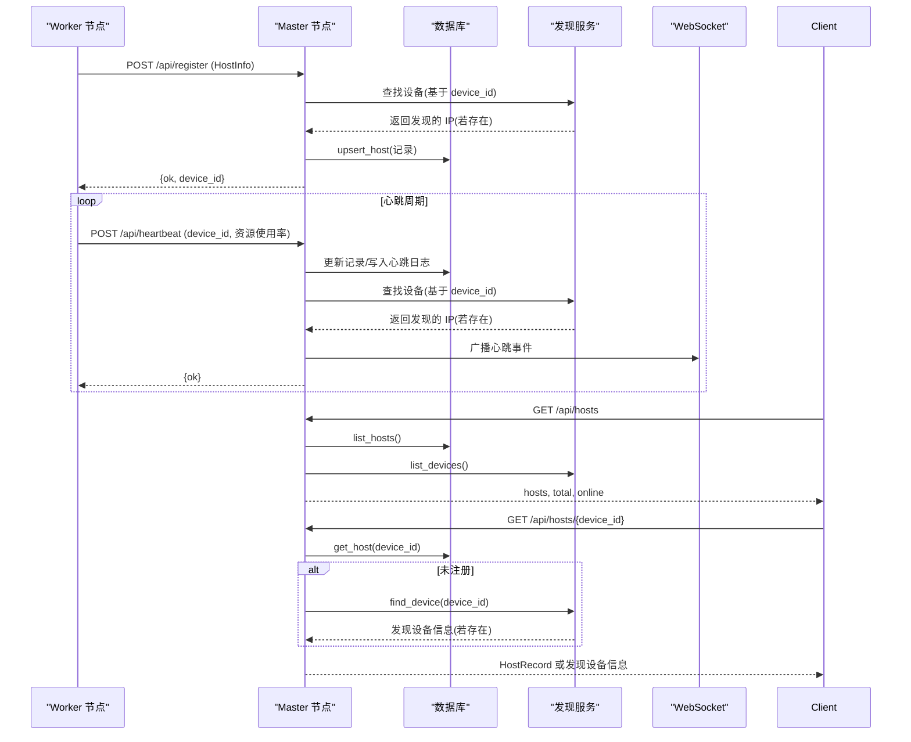
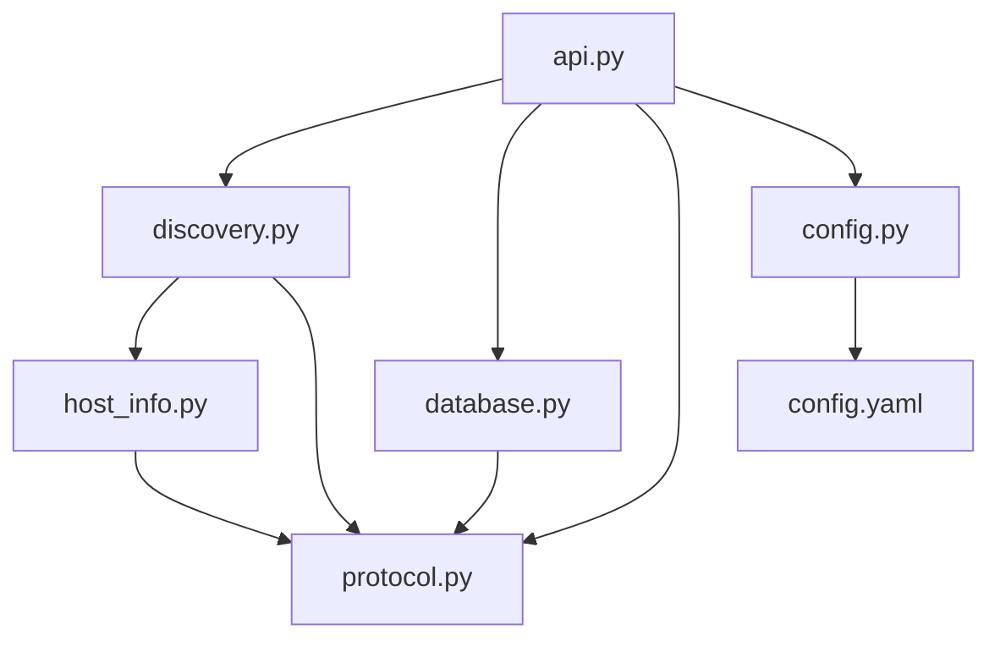

# 设备管理 API

<cite>
**本文档引用的文件**
- [api.py](file://lan_mesh/api.py)
- [discovery.py](file://lan_mesh/discovery.py)
- [master.py](file://lan_mesh/master.py)
- [host_info.py](file://lan_mesh/host_info.py)
- [database.py](file://lan_mesh/database.py)
- [protocol.py](file://lan_mesh/protocol.py)
- [config.py](file://lan_mesh/config.py)
- [config.yaml](file://config.yaml)
- [dashboard.html](file://lan_mesh/web/templates/dashboard.html)
</cite>

## 目录
1. [简介](#简介)
2. [项目结构](#项目结构)
3. [核心组件](#核心组件)
4. [架构总览](#架构总览)
5. [详细组件分析](#详细组件分析)
6. [依赖关系分析](#依赖关系分析)
7. [性能考虑](#性能考虑)
8. [故障排除指南](#故障排除指南)
9. [结论](#结论)

## 简介
本文件为 LAN Mesh 设备管理功能的详细 API 文档，覆盖以下核心接口：
- /api/register：设备注册（Worker → Master）
- /api/heartbeat：心跳上报（Worker → Master）
- /api/hosts：设备列表查询（Master → 客户端）
- /api/hosts/{device_id}：单设备查询（Master → 客户端）

文档还详细说明了设备注册流程、心跳检测机制、设备状态跟踪与离线清理策略，并解释了设备生命周期管理与 UDP 发现服务的集成方式。同时提供请求参数格式、响应数据结构、错误码说明以及实际使用示例。

## 项目结构
LAN Mesh 采用 Master/Worker 架构，核心模块包括：
- API 层：提供 HTTP/WebSocket 接口
- 发现服务：基于 UDP 的局域网设备发现
- 数据库层：SQLite 持久化主机注册记录与心跳历史
- 主机信息采集：自动收集 CPU/内存/磁盘/网络等硬件信息
- 配置管理：基于 YAML 的强类型配置

图表来源
- [api.py:103-256](file://lan_mesh/api.py#L103-L256)
- [discovery.py:33-135](file://lan_mesh/discovery.py#L33-L135)
- [database.py:16-144](file://lan_mesh/database.py#L16-L144)
- [master.py:67-125](file://lan_mesh/master.py#L67-L125)

章节来源
- [api.py:10-19](file://lan_mesh/api.py#L10-L19)
- [master.py:48-53](file://lan_mesh/master.py#L48-L53)

## 核心组件
- API 路由层：实现 /api/register、/api/heartbeat、/api/hosts、/api/hosts/{device_id} 等接口，负责请求解析、业务逻辑处理与响应构造。
- 发现服务：周期性广播自身存在，监听其他设备的发现包，维护设备列表并进行离线清理。
- 数据库层：提供主机注册记录的增删改查、心跳历史记录与离线清理。
- 主机信息采集：自动采集 CPU/内存/磁盘/网络等硬件信息，生成 DiscoveryPacket 与 HostInfo。
- 配置管理：读取 config.yaml 与环境变量，提供全局配置访问。

章节来源
- [api.py:116-215](file://lan_mesh/api.py#L116-L215)
- [discovery.py:33-135](file://lan_mesh/discovery.py#L33-L135)
- [database.py:16-144](file://lan_mesh/database.py#L16-L144)
- [host_info.py:129-212](file://lan_mesh/host_info.py#L129-L212)
- [config.py:48-84](file://lan_mesh/config.py#L48-L84)

## 架构总览
设备管理的核心交互流程如下：
- Worker 启动后，通过 /api/register 向 Master 注册，携带完整 HostInfo。
- Worker 定期通过 /api/heartbeat 上报心跳，包含 CPU/内存/磁盘使用率与共享文件数量。
- Master 通过 /api/hosts 与 /api/hosts/{device_id} 提供设备列表与单设备详情查询。
- Master 通过 UDP 发现服务聚合未通过 HTTP 注册但被发现的设备。
- Master 通过 WebSocket 实时推送设备状态变更。

图表来源
- [api.py:116-215](file://lan_mesh/api.py#L116-L215)
- [discovery.py:97-126](file://lan_mesh/discovery.py#L97-L126)
- [database.py:147-231](file://lan_mesh/database.py#L147-L231)

## 详细组件分析

### /api/register 设备注册
- 方法与路径：POST /api/register
- 请求体：HostInfo（完整主机信息）
- 处理流程：
  1) 解析 HostInfo，构建 HostRecord（online=true，registered_at/last_seen 当前时间）。
  2) 通过 DiscoveryService.find_device(device_id) 尝试获取真实 IP。
  3) 调用数据库 upsert_host 持久化记录。
  4) 通过 WebSocket 广播 host_registered 事件。
  5) 返回 {ok: true, device_id}。
- 错误码：无显式错误码，注册成功返回 200。
- 示例请求体（字段说明见“请求参数格式”）：
  - device_id：设备唯一标识
  - device_name：设备显示名称
  - role：角色（worker/master）
  - hostname/platform/architecture/python_version：系统信息
  - cpu_count/cpu_percent/cpu_freq_mhz：CPU 信息
  - memory_total_mb/memory_available_mb/memory_percent：内存信息
  - disk_total_gb/disk_used_gb/disk_free_gb/disk_percent：磁盘信息
  - ip_addresses/mac_address：网络信息
  - shared_folder/shared_file_count：共享文件夹信息
  - api_port/uptime_seconds/timestamp：运行时信息

章节来源
- [api.py:116-146](file://lan_mesh/api.py#L116-L146)
- [protocol.py:69-111](file://lan_mesh/protocol.py#L69-L111)
- [protocol.py:115-148](file://lan_mesh/protocol.py#L115-L148)

### /api/heartbeat 心跳机制
- 方法与路径：POST /api/heartbeat
- 请求体：包含 device_id 与资源使用率（cpu_percent、memory_percent、disk_percent）及共享文件数量 shared_file_count
- 处理流程：
  1) 根据 device_id 查询 HostRecord。
  2) 若未找到，返回 404（设备未注册）。
  3) 更新记录的资源使用率、online=true、last_seen 当前时间。
  4) 通过 DiscoveryService.find_device(device_id) 尝试更新 IP。
  5) 调用数据库 log_heartbeat 记录心跳历史。
  6) 通过 WebSocket 广播 heartbeat 事件。
  7) 返回 {ok: true}。
- 错误码：404（设备未注册）
- 心跳周期：HEARTBEAT_INTERVAL_SECS（默认 5 秒）

章节来源
- [api.py:148-168](file://lan_mesh/api.py#L148-L168)
- [protocol.py:22](file://lan_mesh/protocol.py#L22)
- [database.py:194-201](file://lan_mesh/database.py#L194-L201)

### /api/hosts 设备列表查询
- 方法与路径：GET /api/hosts
- 处理流程：
  1) 从数据库查询所有 HostRecord。
  2) 从 DiscoveryService.list_devices 获取实时发现的设备。
  3) 以 DB 为主，补充 UDP 发现但未通过 HTTP 注册的设备。
  4) 返回 hosts 数组、total 与 online 计数。
- 响应体字段：
  - hosts：设备列表（HostRecord.to_dict()）
  - total：总数
  - online：在线数

章节来源
- [api.py:170-204](file://lan_mesh/api.py#L170-L204)
- [discovery.py:97-113](file://lan_mesh/discovery.py#L97-L113)
- [database.py:233-262](file://lan_mesh/database.py#L233-L262)

### /api/hosts/{device_id} 单设备查询
- 方法与路径：GET /api/hosts/{device_id}
- 处理流程：
  1) 从数据库查询 HostRecord；若不存在：
     - 通过 DiscoveryService.find_device(device_id) 查找发现设备；
     - 若仍不存在，返回 404（主机不存在）。
  2) 返回 HostRecord.to_dict() 或发现设备信息。
- 错误码：404（主机不存在）

章节来源
- [api.py:206-215](file://lan_mesh/api.py#L206-L215)
- [discovery.py:115-126](file://lan_mesh/discovery.py#L115-L126)
- [database.py:203-231](file://lan_mesh/database.py#L203-L231)

### 设备状态跟踪与离线清理
- 状态字段：HostRecord.online、last_seen、registered_at、latency_ms
- 离线判定：Master 后台线程按 PRUNE_INTERVAL_SECS（默认 5 秒）扫描，将 last_seen 早于 (now - device_ttl) 的在线设备标记为离线。
- 离线清理：DiscoveryService 定期清理超时设备（prune_loop），删除超过 device_ttl*3 的条目。
- 心跳日志：数据库 heartbeat_log 记录每次心跳的 CPU/Memory/Disk 百分比。

章节来源
- [protocol.py:24](file://lan_mesh/protocol.py#L24)
- [master.py:166-174](file://lan_mesh/master.py#L166-L174)
- [discovery.py:216-228](file://lan_mesh/discovery.py#L216-L228)
- [database.py:272-280](file://lan_mesh/database.py#L272-L280)
- [database.py:194-201](file://lan_mesh/database.py#L194-L201)

### UDP 发现服务集成
- 发现包：DiscoveryPacket，包含 app、version、packet_type、device_id、device_name、role、api_port、hostname、platform、cpu_count、cpu_percent、memory_total_mb、memory_percent、disk_total_gb、disk_percent、shared_folder、ip_addresses。
- 发现流程：
  - Master/Worker 启动后生成 DiscoveryPacket 并广播。
  - 监听端口接收其他设备包，回送 presence 包以互相发现。
  - 维护设备字典，记录 last_seen 与 IP。
  - 定期清理超时设备。
- 与 API 的集成：
  - /api/register：尝试从发现列表获取真实 IP 并写入 HostRecord。
  - /api/heartbeat：更新 IP（若发现列表中有最新信息）。
  - /api/hosts：将发现列表与数据库记录合并。

章节来源
- [protocol.py:29-65](file://lan_mesh/protocol.py#L29-L65)
- [discovery.py:33-135](file://lan_mesh/discovery.py#L33-L135)
- [api.py:140-144](file://lan_mesh/api.py#L140-L144)
- [api.py:161-164](file://lan_mesh/api.py#L161-L164)

### 设备生命周期管理
- 注册阶段：Worker 通过 /api/register 提交 HostInfo，Master 写入数据库并广播注册事件。
- 运行阶段：Worker 定期 /api/heartbeat 上报资源使用率，Master 更新在线状态与最后心跳时间。
- 离线阶段：若超过 device_ttl（默认 12 秒）未收到心跳，Master 标记为离线；DiscoveryService 删除超时条目。
- 清理阶段：Master 后台线程定期清理离线设备，避免数据库膨胀。

章节来源
- [api.py:116-168](file://lan_mesh/api.py#L116-L168)
- [master.py:166-174](file://lan_mesh/master.py#L166-L174)
- [discovery.py:216-228](file://lan_mesh/discovery.py#L216-L228)

### 请求参数格式与响应数据结构

- /api/register
  - 请求体：HostInfo（完整主机信息）
  - 成功响应：{"ok": true, "device_id": "<device_id>"}
  - 错误码：无显式错误码

- /api/heartbeat
  - 请求体：{"device_id": "<device_id>", "cpu_percent": float, "memory_percent": float, "disk_percent": float, "shared_file_count": int}
  - 成功响应：{"ok": true}
  - 错误码：404（设备未注册）

- /api/hosts
  - 成功响应：{"hosts": [HostRecord.to_dict()], "total": int, "online": int}

- /api/hosts/{device_id}
  - 成功响应：HostRecord.to_dict() 或发现设备信息
  - 错误码：404（主机不存在）

章节来源
- [api.py:116-215](file://lan_mesh/api.py#L116-L215)
- [protocol.py:69-111](file://lan_mesh/protocol.py#L69-L111)
- [protocol.py:115-148](file://lan_mesh/protocol.py#L115-L148)

### 实际使用示例
- Worker 注册
  - POST http://<master-ip>:<master-api-port>/api/register
  - 请求体：HostInfo（包含设备标识、系统信息、硬件信息、网络信息、共享文件夹信息、运行时信息）
  - 响应：{"ok": true, "device_id": "<device_id>"}

- Worker 心跳
  - POST http://<master-ip>:<master-api-port>/api/heartbeat
  - 请求体：{"device_id": "<device_id>", "cpu_percent": 45.2, "memory_percent": 60.1, "disk_percent": 20.0, "shared_file_count": 120}
  - 响应：{"ok": true}

- 查询设备列表
  - GET http://<master-ip>:<master-api-port>/api/hosts
  - 响应：{"hosts": [...], "total": 3, "online": 2}

- 查询单设备
  - GET http://<master-ip>:<master-api-port>/api/hosts/<device_id>
  - 响应：HostRecord.to_dict() 或发现设备信息

章节来源
- [api.py:116-215](file://lan_mesh/api.py#L116-L215)

## 依赖关系分析

图表来源
- [api.py:33-34](file://lan_mesh/api.py#L33-L34)
- [discovery.py:22-30](file://lan_mesh/discovery.py#L22-L30)
- [database.py:13](file://lan_mesh/database.py#L13)
- [host_info.py:16](file://lan_mesh/host_info.py#L16)
- [config.py:48-84](file://lan_mesh/config.py#L48-L84)
- [config.yaml:1-22](file://config.yaml#L1-L22)

章节来源
- [api.py:33-34](file://lan_mesh/api.py#L33-L34)
- [discovery.py:22-30](file://lan_mesh/discovery.py#L22-L30)
- [database.py:13](file://lan_mesh/database.py#L13)
- [host_info.py:16](file://lan_mesh/host_info.py#L16)
- [config.py:48-84](file://lan_mesh/config.py#L48-L84)
- [config.yaml:1-22](file://config.yaml#L1-L22)

## 性能考虑
- 心跳频率：HEARTBEAT_INTERVAL_SECS（默认 5 秒），平衡实时性与网络负载。
- 离线清理：PRUNE_INTERVAL_SECS（默认 5 秒）定期扫描，避免频繁 I/O。
- 设备 TTL：DEVICE_TTL_SECS（默认 12 秒），确保快速识别离线设备。
- 数据库索引：heartbeat_log(device_id, timestamp) 与 hosts 索引优化查询性能。
- WebSocket 推送：仅推送必要的状态变更，减少冗余数据。

章节来源
- [protocol.py:22-24](file://lan_mesh/protocol.py#L22-L24)
- [database.py:71-72](file://lan_mesh/database.py#L71-L72)
- [database.py:105-106](file://lan_mesh/database.py#L105-L106)
- [database.py:134-136](file://lan_mesh/database.py#L134-L136)

## 故障排除指南
- 设备未注册导致心跳失败
  - 现象：/api/heartbeat 返回 404（设备未注册）
  - 处理：先调用 /api/register 完成注册
- 设备长时间离线
  - 现象：/api/hosts 中 online=false
  - 处理：检查 Worker 是否正常运行、网络是否可达、心跳是否持续
- 发现设备未出现在 /api/hosts
  - 现象：通过 /api/discovery 可见设备，但 /api/hosts 不包含
  - 处理：等待 Worker 通过 HTTP 注册，或手动触发 /api/probe/{ip}
- WebSocket 连接断开
  - 现象：UI 仪表盘显示离线
  - 处理：检查 Master 日志与网络连通性，确认端口开放

章节来源
- [api.py:153-154](file://lan_mesh/api.py#L153-L154)
- [api.py:210-214](file://lan_mesh/api.py#L210-L214)
- [discovery.py:216-228](file://lan_mesh/discovery.py#L216-L228)
- [dashboard.html:195-208](file://lan_mesh/web/templates/dashboard.html#L195-L208)

## 结论
LAN Mesh 的设备管理 API 通过 HTTP 与 WebSocket 提供了完整的设备注册、心跳、查询与状态推送能力，并与 UDP 发现服务深度集成，实现了对 Worker 设备的生命周期管理与离线清理。合理的配置参数（心跳间隔、设备 TTL、清理间隔）在保证实时性的同时兼顾了性能与稳定性。建议在生产环境中根据网络规模与设备数量调整相关参数，并结合 Web UI 仪表盘进行监控与运维。