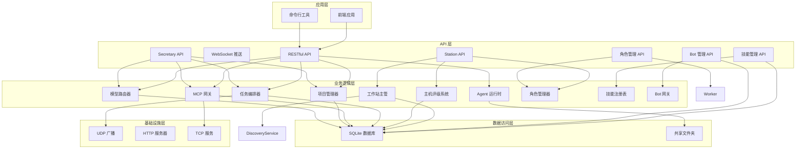
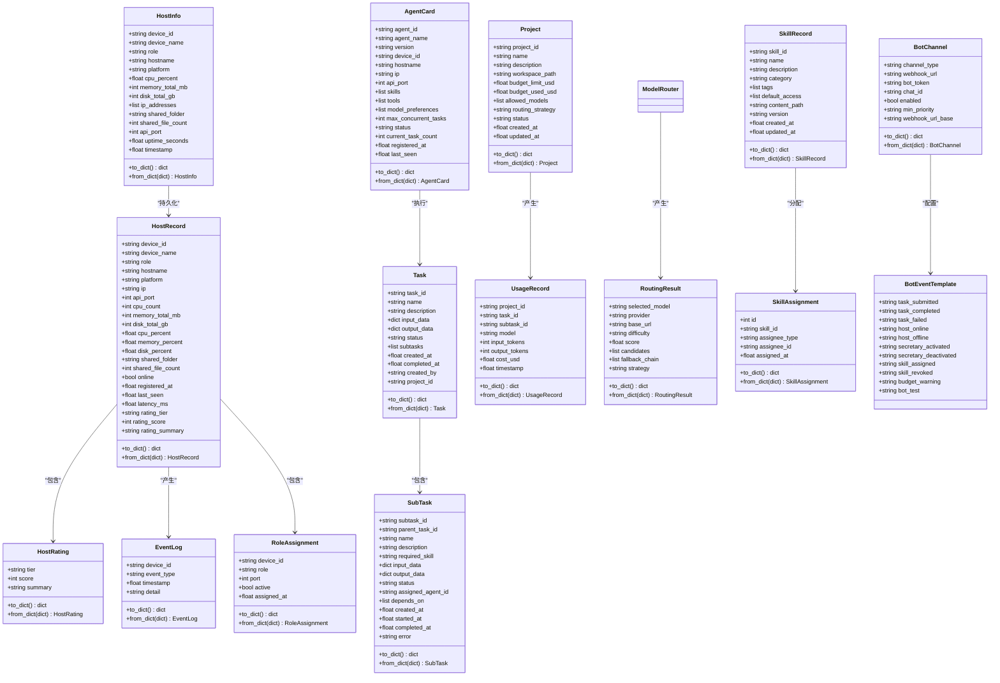
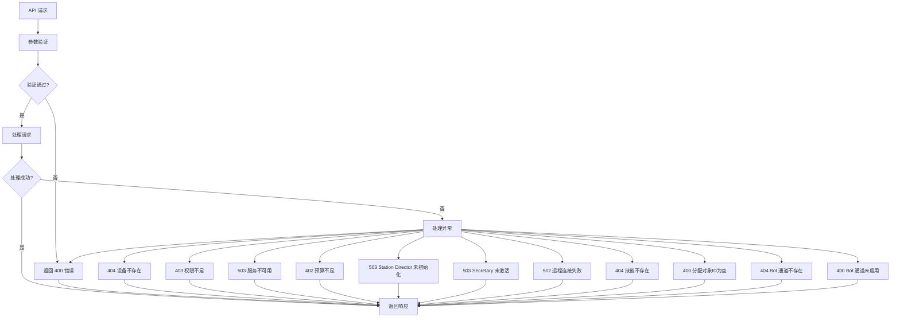

# Web API 接口

<cite>
**本文档引用的文件**
- [api.py](file://lan_mesh/api.py)
- [station_api.py](file://lan_mesh/station_api.py)
- [worker.py](file://lan_mesh/worker.py)
- [protocol.py](file://lan_mesh/protocol.py)
- [shared_folder.py](file://lan_mesh/shared_folder.py)
- [database.py](file://lan_mesh/database.py)
- [discovery.py](file://lan_mesh/discovery.py)
- [orchestrator.py](file://lan_mesh/orchestrator.py)
- [mcp_gateway.py](file://lan_mesh/mcp_gateway.py)
- [project.py](file://lan_mesh/project.py)
- [model_router.py](file://lan_mesh/model_router.py)
- [station_director.py](file://lan_mesh/station_director.py)
- [host_rating.py](file://lan_mesh/host_rating.py)
- [station_controller.py](file://lan_mesh/station_controller.py)
- [secretary.py](file://lan_mesh/secretary.py)
- [skill_registry.py](file://lan_mesh/skill_registry.py)
- [bot_gateway.py](file://lan_mesh/bot_gateway.py)
- [config.py](file://lan_mesh/config.py)
- [api.ts](file://quicklan-main/src/api.ts)
- [types.ts](file://quicklan-main/src/types.ts)
- [lan_api.rs](file://quicklan-main/src-tauri/src/lan_api.rs)
- [dashboard.html](file://lan_mesh/web/templates/dashboard.html)
- [main.py](file://main.py)
- [SKILL.md](file://skills/multi-agent-architect/SKILL.md)
</cite>

## 更新摘要
**变更内容**
- LAN Mesh API层重构：提取 `_merge_db_and_udp_hosts()` 公共函数用于统一合并数据库和UDP发现的主机列表
- `/api/hosts` 端点简化：使用新的合并函数减少代码重复并确保一致性
- `/api/station/fleet` 端点增强：返回包含完整主机列表的详细舰队概览信息
- Bot管理API完善：支持企业微信群机器人和Telegram Bot通道的完整生命周期管理

## 目录
1. [简介](#简介)
2. [项目结构](#项目结构)
3. [核心组件](#核心组件)
4. [架构概览](#架构概览)
5. [详细接口规范](#详细接口规范)
6. [数据模型](#数据模型)
7. [依赖关系分析](#依赖关系分析)
8. [性能考虑](#性能考虑)
9. [故障排除指南](#故障排除指南)
10. [结论](#结论)

## 简介

Work Station 项目是一个基于局域网的分布式任务执行平台，采用 Master/Worker 架构设计。该项目提供了完整的 Web API 接口，支持设备管理、文件传输、任务执行、工具调度、项目管理、Bot消息通道管理和技能管理等功能。系统通过 UDP 广播发现机制实现设备自动发现，通过 HTTP API 提供 RESTful 接口，通过 WebSocket 实现实时状态推送。

**更新** LAN Mesh API层进行了重要重构，提取了 `_merge_db_and_udp_hosts()` 公共函数用于合并数据库和UDP发现的主机列表，减少了代码重复并确保了所有API端点的一致性；同时增强了 `/api/station/fleet` 端点的舰队概览信息，提供更详细的主机统计和列表数据。

## 项目结构

项目采用模块化设计，主要包含以下核心模块：

```mermaid
graph TB
subgraph "核心服务"
Master[Master 控制器]
Worker[Worker 守护进程]
Discovery[UDP 发现服务]
Database[SQLite 数据库]
SharedFolder[共享文件夹管理]
ProjectManager[项目管理器]
ModelRouter[模型路由器]
Orchestrator[任务编排器]
MCPGateway[MCP 工具网关]
StationDirector[工作站主管]
HostRating[主机评级系统]
RoleManager[角色管理器]
SkillRegistry[技能注册表]
BotGateway[Bot 网关]
end
subgraph "API 层"
MasterAPI[Master API]
WorkerAPI[Worker API]
StationAPI[Station API]
SecretaryAPI[Secretary API]
SkillAPI[技能管理 API]
BotAPI[Bot 管理 API]
RoleAPI[角色管理 API]
end
subgraph "前端集成"
QuickLAN[QuickLAN 前端]
TauriApp[Tauri 应用]
LANAPI[LAN API]
end
Master --> MasterAPI
Worker --> WorkerAPI
StationDirector --> StationAPI
StationAPI --> RoleManager
StationAPI --> Database
StationAPI --> HostRating
StationAPI --> Discovery
SkillAPI --> SkillRegistry
SkillAPI --> Database
SecretaryAPI --> ProjectManager
SecretaryAPI --> Orchestrator
SecretaryAPI --> ModelRouter
SecretaryAPI --> MCPGateway
BotAPI --> BotGateway
BotAPI --> Database
QuickLAN --> MasterAPI
QuickLAN --> SkillAPI
QuickLAN --> BotAPI
TauriApp --> LANAPI
```

**图表来源**
- [master.py:66-319](file://lan_mesh/master.py#L66-L319)
- [worker.py:62-325](file://lan_mesh/worker.py#L62-L325)
- [api.py:37-570](file://lan_mesh/api.py#L37-L570)
- [station_api.py:85-1031](file://lan_mesh/station_api.py#L85-L1031)
- [station_director.py:28-224](file://lan_mesh/station_director.py#L28-L224)
- [host_rating.py:13-115](file://lan_mesh/host_rating.py#L13-L115)
- [station_api.py:42-127](file://lan_mesh/station_api.py#L42-L127)
- [station_controller.py:69-182](file://lan_mesh/station_controller.py#L69-L182)
- [skill_registry.py:43-48](file://lan_mesh/skill_registry.py#L43-L48)
- [bot_gateway.py:1-354](file://lan_mesh/bot_gateway.py#L1-L354)

**章节来源**
- [master.py:1-332](file://lan_mesh/master.py#L1-L332)
- [worker.py:1-325](file://lan_mesh/worker.py#L1-L325)
- [api.py:1-757](file://lan_mesh/api.py#L1-L757)
- [station_api.py:1-1031](file://lan_mesh/station_api.py#L1-L1031)
- [station_director.py:1-232](file://lan_mesh/station_director.py#L1-L232)
- [host_rating.py:1-115](file://lan_mesh/host_rating.py#L1-L115)
- [station_api.py:1-757](file://lan_mesh/station_api.py#L1-L757)
- [station_controller.py:1-480](file://lan_mesh/station_controller.py#L1-L480)
- [skill_registry.py:1-388](file://lan_mesh/skill_registry.py#L1-L388)
- [bot_gateway.py:1-354](file://lan_mesh/bot_gateway.py#L1-L354)

## 核心组件

### Master 控制器
Master 控制器作为系统的中央协调者，负责：
- 设备注册与状态管理
- 任务编排与分发
- MCP 工具网关管理
- 项目管理与预算控制
- 模型路由决策
- WebSocket 实时推送
- Web UI 仪表盘提供

### Worker 守护进程
Worker 守护进程部署在各个主机上，负责：
- 设备信息采集与上报
- 文件共享服务
- 任务执行
- Agent 能力注册
- Secretary 子进程管理（远程角色分配）
- 技能包下载和缓存管理

### 发现服务
基于 UDP 广播的设备发现机制，实现设备自动发现和状态同步。

### 项目管理器
项目管理器负责：
- 项目生命周期管理（创建、查询、更新、归档）
- 预算控制与成本核算
- 模型调用计费与路由策略
- 消费记录追踪与分析

### 模型路由器
模型路由器负责：
- 任务难度分级（L1-L4）
- 加权评分算法
- 降级链容灾
- 多 Provider 支持
- 策略适配（cost_first、quality_first、balanced）

### 工作站主管 (Station Director)
工作站主管负责：
- 主机注册入站处理和评级计算
- 心跳处理和实时指标更新
- 离线检测和事件记录
- 舰队管理（主机列表、统计、事件历史）
- 资源池查询（按评级筛选在线主机）
- 手动评级重算功能
- 技能库管理（扫描、注册、权限分配）
- Bot 通道管理（配置、测试、事件推送）

### 角色管理器 (Role Manager)
角色管理器负责：
- Secretary 子进程的启动和停止
- 远程主机角色分配管理
- 角色状态查询和监控
- 动态角色切换支持

### 主机评级系统
主机评级系统负责：
- 基于硬件配置（CPU、内存、磁盘）自动计算综合得分
- 映射到 S/A/B/C/D 五级评级
- 生成人类可读的评级摘要
- 支持手动重算和评级变更事件记录

### 技能注册表 (Skill Registry)
技能注册表负责：
- 技能文件扫描和注册（skills/ 目录）
- 技能元数据管理（名称、描述、分类、标签、默认访问权限）
- 技能内容解析（SKILL.md front matter）
- 技能权限分配（角色、Agent、主机）
- 技能包构建和分发
- 技能系统提示构建
- 技能统计和查询

### Bot 网关 (Bot Gateway)
Bot 网关负责：
- Bot 通道配置管理（企业微信群机器人、Telegram Bot）
- 事件推送（任务状态、主机状态、技能分配、预算告警等）
- 命令处理（Telegram Bot 命令交互）
- 通道优先级控制（低、常规、高）
- 通道脱敏显示（敏感信息保护）
- 异步消息发送（避免阻塞调用方）

**章节来源**
- [master.py:66-170](file://lan_mesh/master.py#L66-L170)
- [worker.py:62-120](file://lan_mesh/worker.py#L62-L120)
- [discovery.py:33-136](file://lan_mesh/discovery.py#L33-L136)
- [project.py:62-320](file://lan_mesh/project.py#L62-L320)
- [model_router.py:116-327](file://lan_mesh/model_router.py#L116-L327)
- [station_director.py:28-224](file://lan_mesh/station_director.py#L28-L224)
- [host_rating.py:13-115](file://lan_mesh/host_rating.py#L13-L115)
- [worker.py:225-285](file://lan_mesh/worker.py#L225-L285)
- [skill_registry.py:43-388](file://lan_mesh/skill_registry.py#L43-L388)
- [bot_gateway.py:1-354](file://lan_mesh/bot_gateway.py#L1-L354)

## 架构概览

系统采用分层架构设计，各层职责明确：

**图表来源**
- [master.py:183-218](file://lan_mesh/master.py#L183-L218)
- [worker.py:219-238](file://lan_mesh/worker.py#L219-L238)
- [api.py:37-570](file://lan_mesh/api.py#L37-L570)
- [station_api.py:85-1031](file://lan_mesh/station_api.py#L85-L1031)
- [station_director.py:28-224](file://lan_mesh/station_director.py#L28-L224)
- [host_rating.py:13-115](file://lan_mesh/host_rating.py#L13-L115)
- [station_api.py:42-127](file://lan_mesh/station_api.py#L42-L127)
- [station_controller.py:69-182](file://lan_mesh/station_controller.py#L69-L182)
- [skill_registry.py:43-48](file://lan_mesh/skill_registry.py#L43-L48)
- [bot_gateway.py:1-354](file://lan_mesh/bot_gateway.py#L1-L354)

## 详细接口规范

### Master API 接口

#### 设备管理接口

**设备注册**
- 方法：POST `/api/register`
- 功能：Worker 注册到 Master
- 请求体：HostInfo 对象
- 响应：注册结果

**心跳管理**
- 方法：POST `/api/heartbeat`
- 功能：Worker 心跳上报
- 请求体：包含设备ID和资源使用率
- 响应：心跳确认

**设备列表**
- 方法：GET `/api/hosts`
- 功能：获取所有注册设备（DB + UDP 合并）
- 响应：设备列表和统计信息
- **更新** 使用统一的合并函数确保数据一致性

**单设备查询**
- 方法：GET `/api/hosts/{device_id}`
- 功能：查询指定设备详情
- 响应：设备信息或发现设备信息

**网络状态**
- 方法：GET `/api/network`
- 功能：获取 Master 网络状态
- 响应：网络配置信息

**设备发现**
- 方法：GET `/api/discovery`
- 功能：获取 UDP 发现的设备列表
- 响应：发现设备列表

**主动探测**
- 方法：POST `/api/probe/{ip}`
- 功能：主动探测指定 IP
- 响应：探测结果

**健康检查**
- 方法：GET `/api/health`
- 功能：服务健康检查
- 响应：健康状态信息

**Master 信息**
- 方法：GET `/api/master-info`
- 功能：获取 Master 自身信息
- 响应：HostInfo 对象

#### 文件共享接口

**共享文件列表**
- 方法：GET `/api/shared`
- 功能：获取 Master 共享文件列表
- 响应：文件列表和统计信息

#### Agent 管理接口

**Agent 注册**
- 方法：POST `/api/agents/register`
- 功能：Worker 注册 Agent Card
- 请求体：AgentCard 对象
- 响应：注册结果

**Agent 列表**
- 方法：GET `/api/agents`
- 功能：获取所有 Agent 列表
- 参数：status（可选）
- 响应：Agent 列表和统计信息

**单 Agent 查询**
- 方法：GET `/api/agents/{agent_id}`
- 功能：查询指定 Agent 详情
- 响应：Agent 信息

#### 任务管理接口

**任务提交**
- 方法：POST `/api/tasks`
- 功能：提交新任务
- 请求体：任务描述和输入数据
- 响应：Task 对象
- **更新** 支持关联项目进行预算控制

**任务列表**
- 方法：GET `/api/tasks`
- 功能：获取任务列表
- 参数：status（可选）、limit（默认50）
- 响应：任务列表

**任务查询**
- 方法：GET `/api/tasks/{task_id}`
- 功能：查询指定任务状态
- 响应：Task 对象

#### 项目管理接口

**项目创建**
- 方法：POST `/api/projects`
- 功能：创建新项目
- 请求体：项目配置（名称、描述、预算、模型限制、路由策略等）
- 响应：Project 对象
- **新增** 支持独立工作空间、预算控制和模型白名单

**项目列表**
- 方法：GET `/api/projects`
- 功能：获取项目列表
- 参数：status（可选，按状态过滤）
- 响应：项目列表和统计信息

**单项目查询**
- 方法：GET `/api/projects/{project_id}`
- 功能：查询项目详情（含预算状态）
- 响应：项目状态信息（包含预算使用率、剩余预算、消费统计等）

**项目更新**
- 方法：PUT `/api/projects/{project_id}`
- 功能：更新项目配置
- 请求体：可更新字段（名称、描述、预算、模型、路由策略、状态等）
- 响应：更新后的项目对象

**项目归档**
- 方法：DELETE `/api/projects/{project_id}`
- 功能：归档项目（软删除）
- 响应：归档结果

**项目消费记录**
- 方法：GET `/api/projects/{project_id}/usage`
- 功能：查询项目消费记录
- 参数：limit（默认100，限制返回记录数）
- 响应：消费记录列表和统计信息

#### 模型路由接口

**路由决策预览**
- 方法：POST `/api/route/dry-run`
- 功能：模型路由决策预览（dry-run）
- 请求体：包含任务描述、技能类型、项目ID
- 响应：RoutingResult 对象

**模型列表**
- 方法：GET `/api/models`
- 功能：返回模型池列表（含可用状态）
- 响应：模型列表

#### MCP 工具接口

**工具列表**
- 方法：GET `/tools/list`
- 功能：获取所有可用工具
- 参数：model（可选，模型类型）
- 响应：工具列表和服务器信息

**工具调用**
- 方法：POST `/tools/call`
- 功能：调用指定工具
- 请求体：包含工具名称和参数
- 响应：工具执行结果

**MCP 服务器列表**
- 方法：GET `/tools/servers`
- 功能：获取所有 MCP 服务器
- 响应：服务器列表和统计信息

**MCP 服务器注册**
- 方法：POST `/tools/servers`
- 功能：动态注册 MCP 服务器
- 请求体：服务器配置
- 响应：注册结果

**MCP 服务器注销**
- 方法：DELETE `/tools/servers/{name}`
- 功能：注销 MCP 服务器
- 响应：注销结果

#### 实时通信接口

**WebSocket 连接**
- 方法：WS `/ws`
- 功能：实时推送设备状态变化
- 消息类型：hosts、heartbeat、agent_registered、project_created、project_updated、project_archived 等

### Station API 接口

**更新** 工作站 API 提供舰队管理能力和角色管理系统，经过重构后具有更好的性能和一致性：

#### 角色管理接口

**激活 Secretary**
- 方法：POST `/api/station/activate-secretary`
- 功能：激活 Secretary 模式（同进程加载项目管理组件）
- 响应：激活结果和组件状态

**停用 Secretary**
- 方法：POST `/api/station/deactivate-secretary`
- 功能：停用 Secretary 模式
- 响应：停用结果

**查询角色状态**
- 方法：GET `/api/station/roles`
- 功能：查询当前激活的角色
- 响应：角色状态和组件可用性

#### 舰队概览统计

**舰队概览**
- 方法：GET `/api/station/fleet`
- 功能：获取舰队概览统计信息（**增强**）
- 响应：包含总主机数、在线/离线主机数、各评级分布的统计摘要，以及完整的主机列表
- **更新** 现在返回包含所有主机的详细信息，便于前端直接展示

**主机列表**
- 方法：GET `/api/station/hosts`
- 功能：获取所有主机列表（含评级和状态）
- 参数：min_tier（可选，默认"D"），online_only（可选，默认False）
- 响应：主机列表，支持按评级筛选和在线状态过滤

**单主机事件历史**
- 方法：GET `/api/station/hosts/{device_id}/events`
- 功能：查询指定主机的出入站事件历史
- 参数：device_id（路径参数），limit（可选，默认20）
- 响应：事件历史列表

**全局事件流**
- 方法：GET `/api/station/events`
- 功能：获取最近全站事件流
- 参数：limit（可选，默认50）
- 响应：全站事件历史列表

**手动评级**
- 方法：POST `/api/station/rate`
- 功能：手动触发重新评级所有在线主机
- 响应：包含更新主机数量的结果

**舰队统计**
- 方法：GET `/api/station/stats`
- 功能：获取统计摘要
- 响应：与 `/api/station/fleet` 相同的统计信息

#### 远程主机管理接口

**分配 Secretary 到主机**
- 方法：POST `/api/station/hosts/{device_id}/assign-secretary`
- 功能：指定主机运行 Secretary
- 参数：device_id（路径参数），payload（可选端口配置）
- 响应：分配结果和端口信息
- **新增** 支持本机激活和远程主机分配

**撤销主机的 Secretary 角色**
- 方法：POST `/api/station/hosts/{device_id}/revoke-secretary`
- 功能：撤销主机的 Secretary 角色
- 参数：device_id（路径参数）
- 响应：撤销结果

**查询 Secretary 分配状态**
- 方法：GET `/api/station/secretary-status`
- 功能：查询当前 Secretary 分配状态
- 响应：包含主机ID、名称、端口和活动状态的信息

**查询主机角色状态**
- 方法：GET `/api/station/hosts/{device_id}/role`
- 功能：查询指定主机的角色状态（含远程 Secretary 子进程状态）
- 参数：device_id（路径参数）
- 响应：主机角色状态和远程状态信息

#### Bot 通道管理接口

**新增** Bot 管理 API 提供完整的Bot通道生命周期管理：

**列出 Bot 通道**
- 方法：GET `/api/station/bot/channels`
- 功能：列出所有 Bot 通道配置（脱敏）
- 响应：通道列表（包含类型、启用状态、最低优先级、脱敏后的凭证信息）

**添加/更新 Bot 通道**
- 方法：POST `/api/station/bot/channels`
- 功能：添加或更新 Bot 通道配置
- 请求体：BotChannel 对象（channel_type、enabled、webhook_url、bot_token、chat_id、webhook_url_base、min_priority）
- 响应：操作结果和消息

**删除 Bot 通道**
- 方法：DELETE `/api/station/bot/channels/{channel_type}`
- 功能：移除指定类型的 Bot 通道
- 参数：channel_type（路径参数，wechat_webhook 或 telegram）
- 响应：操作结果和消息

**测试 Bot 通道**
- 方法：POST `/api/station/bot/test/{channel_type}`
- 功能：发送测试消息到指定通道
- 参数：channel_type（路径参数）
- 响应：测试结果（成功或错误信息）

**实时事件推送**

**WebSocket 事件推送**
- 方法：WS `/ws`
- 功能：实时推送主机状态变更和事件
- 消息类型：hosts、heartbeat、agent_registered、project_created、project_updated、project_archived、station_events、secretary_assigned、secretary_revoked 等

### 技能管理 API 接口

**新增** 技能管理 API 提供完整的技能库生命周期管理：

#### 技能查询接口

**技能列表**
- 方法：GET `/api/station/skills`
- 功能：列出所有已注册技能，可按分类过滤
- 参数：category（可选，技能分类）
- 响应：技能列表（包含技能ID、名称、描述、分类、标签、版本等）

**技能统计**
- 方法：GET `/api/station/skills/stats`
- 功能：返回技能库统计信息
- 响应：包含总技能数、分类分布、分配总数等统计信息

**技能扫描**
- 方法：GET `/api/station/skills/scan`
- 功能：手动触发扫描注册新技能
- 响应：扫描结果（包含扫描数量和详细信息）

**技能包下载**
- 方法：GET `/api/station/skills/download`
- 功能：Worker 拉取已授权的技能包
- 参数：role（必需，角色名称），agent_id（可选，Agent ID）
- 响应：技能包列表（包含技能ID、名称、分类、描述、标签、内容、参考、版本等）

**角色技能查询**
- 方法：GET `/api/station/skills/role/{role}`
- 功能：获取角色可用的技能列表
- 参数：role（路径参数，角色名称）
- 响应：技能列表（包含默认权限和直接分配的技能）

#### 技能详情接口

**技能详情**
- 方法：GET `/api/station/skills/{skill_id}`
- 功能：获取技能详情及完整内容
- 参数：skill_id（路径参数，技能ID）
- 响应：技能详情（包含元数据和完整内容、参考文档、分配记录）

#### 技能权限管理接口

**技能分配**
- 方法：POST `/api/station/skills/{skill_id}/assign`
- 功能：分配技能给角色/Agent/主机
- 参数：skill_id（路径参数，技能ID），payload（请求体）
- 请求体：assignee_type（分配对象类型，role/agent/host），assignee_id（分配对象ID）
- 响应：分配结果

**撤销技能分配**
- 方法：DELETE `/api/station/skills/{skill_id}/assign`
- 功能：撤销技能分配
- 参数：skill_id（路径参数，技能ID），assignee_type（分配对象类型），assignee_id（分配对象ID）
- 响应：撤销结果

#### WebSocket 事件推送

**技能管理事件**
- 方法：WS `/ws`
- 功能：实时推送技能管理相关事件
- 消息类型：skills_scanned（技能扫描完成）、skill_assigned（技能分配）、skill_revoked（技能撤销）

**章节来源**
- [station_api.py:251-295](file://lan_mesh/station_api.py#L251-L295)
- [station_api.py:311-345](file://lan_mesh/station_api.py#L311-L345)
- [station_api.py:904-962](file://lan_mesh/station_api.py#L904-L962)
- [station_api.py:968-1001](file://lan_mesh/station_api.py#L968-L1001)
- [skill_registry.py:128-388](file://lan_mesh/skill_registry.py#L128-L388)
- [database.py:717-835](file://lan_mesh/database.py#L717-L835)
- [bot_gateway.py:116-130](file://lan_mesh/bot_gateway.py#L116-L130)
- [bot_gateway.py:325-336](file://lan_mesh/bot_gateway.py#L325-L336)

### Worker API 接口

#### 设备信息接口

**设备信息**
- 方法：GET `/info`
- 功能：获取本机完整配置信息
- 响应：HostInfo 对象

#### 任务执行接口

**任务执行**
- 方法：POST `/tasks/execute`
- 功能：执行 Master 分发的任务
- 请求体：任务执行参数
- 响应：执行结果

#### 文件共享接口

**共享文件列表**
- 方法：GET `/shared`
- 功能：列出共享文件
- 响应：文件列表和统计信息

**文件下载**
- 方法：GET `/shared/{path}`
- 功能：下载共享文件
- 参数：文件路径
- 响应：文件流

**文件上传**
- 方法：POST `/shared`
- 功能：上传文件到共享目录
- 请求体：multipart/form-data
- 响应：上传结果

#### 角色管理接口

**启动 Secretary 子进程**
- 方法：POST `/role/start-secretary`
- 功能：在本机启动 Secretary 子进程
- 请求体：可选端口配置
- 响应：启动结果和进程信息

**停止 Secretary 子进程**
- 方法：POST `/role/stop-secretary`
- 功能：停止本机的 Secretary 子进程
- 响应：停止结果

**查询 Secretary 状态**
- 方法：GET `/role/status`
- 功能：查询本机 Secretary 运行状态
- 响应：运行状态和进程信息

#### 技能管理接口

**技能包下载**
- 方法：GET `/skills/download`
- 功能：下载已授权的技能包
- 参数：role（必需，角色名称），agent_id（可选，Agent ID）
- 响应：技能包列表

**技能内容获取**
- 方法：GET `/skills/content/{skill_id}`
- 功能：获取技能内容
- 参数：skill_id（路径参数，技能ID）
- 响应：技能内容和参考文档

#### 实时通信接口

**WebSocket 连接**
- 方法：WS `/ws`
- 功能：实时推送设备状态变化
- 消息类型：hosts、heartbeat、agent_registered、project_created、project_updated、project_archived 等

**章节来源**
- [api.py:103-126](file://lan_mesh/api.py#L103-L126)
- [api.py:39-98](file://lan_mesh/api.py#L39-L98)
- [worker.py:225-285](file://lan_mesh/worker.py#L225-L285)

### Secretary API 接口

**新增** Secretary API 提供完整的项目管理功能：

#### Agent 管理接口

**Agent 注册**
- 方法：POST `/api/agents/register`
- 功能：注册 Agent Card
- 请求体：AgentCard 对象
- 响应：注册结果

#### 任务管理接口

**任务提交**
- 方法：POST `/api/tasks`
- 功能：提交新任务
- 请求体：任务描述和输入数据
- 响应：Task 对象
- **更新** 支持关联项目进行预算控制

#### 项目管理接口

**项目创建**
- 方法：POST `/api/projects`
- 功能：创建新项目
- 请求体：项目配置（名称、描述、预算、模型限制、路由策略等）
- 响应：Project 对象
- **新增** 支持独立工作空间、预算控制和模型白名单

**项目列表**
- 方法：GET `/api/projects`
- 功能：获取项目列表
- 参数：status（可选，按状态过滤）
- 响应：项目列表和统计信息

**单项目查询**
- 方法：GET `/api/projects/{project_id}`
- 功能：查询项目详情（含预算状态）
- 响应：项目状态信息（包含预算使用率、剩余预算、消费统计等）

**项目更新**
- 方法：PUT `/api/projects/{project_id}`
- 功能：更新项目配置
- 请求体：可更新字段（名称、描述、预算、模型、路由策略、状态等）
- 响应：更新后的项目对象

**项目归档**
- 方法：DELETE `/api/projects/{project_id}`
- 功能：归档项目（软删除）
- 响应：归档结果

**项目消费记录**
- 方法：GET `/api/projects/{project_id}/usage`
- 功能：查询项目消费记录
- 参数：limit（默认100，限制返回记录数）
- 响应：消费记录列表和统计信息

#### 模型路由接口

**路由决策预览**
- 方法：POST `/api/route/dry-run`
- 功能：模型路由决策预览（dry-run）
- 请求体：包含任务描述、技能类型、项目ID
- 响应：RoutingResult 对象

**模型列表**
- 方法：GET `/api/models`
- 功能：返回模型池列表（含可用状态）
- 响应：模型列表

#### MCP 工具接口

**工具列表**
- 方法：GET `/tools/list`
- 功能：获取所有可用工具
- 参数：model（可选，模型类型）
- 响应：工具列表和服务器信息

**工具调用**
- 方法：POST `/tools/call`
- 功能：调用指定工具
- 请求体：包含工具名称和参数
- 响应：工具执行结果

**MCP 服务器列表**
- 方法：GET `/tools/servers`
- 功能：获取所有 MCP 服务器
- 响应：服务器列表和统计信息

**MCP 服务器注册**
- 方法：POST `/tools/servers`
- 功能：动态注册 MCP 服务器
- 请求体：服务器配置
- 响应：注册结果

**MCP 服务器注销**
- 方法：DELETE `/tools/servers/{name}`
- 功能：注销 MCP 服务器
- 响应：注销结果

#### 实时通信接口

**WebSocket 连接**
- 方法：WS `/ws`
- 功能：实时推送设备状态变化
- 消息类型：hosts、heartbeat、agent_registered、project_created、project_updated、project_archived 等

### 前端集成接口

#### QuickLAN 前端接口

**设备管理**
- `listDevices()`: 获取设备列表
- `updateDeviceNote(deviceId, note)`: 更新设备备注
- `discoverIp(ip)`: 发现指定 IP

**文件传输**
- `sendFiles(targetId, filePaths)`: 发送文件
- `acceptTransfer(transferId)`: 接受传输
- `rejectTransfer(transferId)`: 拒绝传输
- `getTransfers()`: 获取传输列表

**共享管理**
- `listSharedResources()`: 列出共享资源
- `listMyShares()`: 列出我的分享
- `downloadShare(shareId, password)`: 下载共享

**项目管理**
- `createProject(projectData)`: 创建新项目
- `listProjects(status)`: 获取项目列表
- `getProjectStatus(projectId)`: 查询项目状态
- `updateProject(projectId, projectData)`: 更新项目配置
- `archiveProject(projectId)`: 归档项目
- `getProjectUsage(projectId, limit)`: 获取项目消费记录

**舰队管理**（增强）
- `getFleetStats()`: 获取舰队统计（**更新** 现在包含完整主机列表）
- `getHosts(minTier, onlineOnly)`: 获取主机列表
- `getHostEvents(deviceId, limit)`: 获取主机事件历史
- `getStationEvents(limit)`: 获取全站事件流
- `recomputeRatings()`: 重新计算评级

**角色管理**
- `activateSecretary()`: 激活 Secretary 模式
- `deactivateSecretary()`: 停用 Secretary 模式
- `assignSecretaryToHost(deviceId, port)`: 分配 Secretary 到主机
- `revokeSecretaryFromHost(deviceId)`: 撤销主机的 Secretary 角色
- `getSecretaryStatus()`: 查询 Secretary 分配状态

**Bot 管理**
- `listBotChannels()`: 获取 Bot 通道列表
- `addBotChannel(channelData)`: 添加或更新 Bot 通道
- `removeBotChannel(channelType)`: 删除 Bot 通道
- `testBotChannel(channelType)`: 测试 Bot 通道
- `refreshBotChannels()`: 刷新 Bot 通道列表

**技能管理**
- `listSkills(category)`: 获取技能列表
- `getSkillStats()`: 获取技能统计
- `scanSkills()`: 扫描技能
- `downloadSkillPackage(role, agentId)`: 下载技能包
- `getSkillsForRole(role)`: 获取角色技能
- `getSkillDetail(skillId)`: 获取技能详情
- `assignSkill(skillId, assigneeType, assigneeId)`: 分配技能
- `revokeSkill(skillId, assigneeType, assigneeId)`: 撤销技能分配

**章节来源**
- [api.ts:13-130](file://quicklan-main/src/api.ts#L13-L130)
- [dashboard.html:244-270](file://lan_mesh/web/templates/dashboard.html#L244-L270)
- [dashboard.html:731-748](file://lan_mesh/web/templates/dashboard.html#L731-L748)
- [dashboard.html:880-985](file://lan_mesh/web/templates/dashboard.html#L880-L985)

## 数据模型

### 核心数据结构

**图表来源**
- [protocol.py:69-388](file://lan_mesh/protocol.py#L69-L388)
- [host_rating.py:30-43](file://lan_mesh/host_rating.py#L30-L43)
- [database.py:312-334](file://lan_mesh/database.py#L312-L334)
- [station_api.py:346-366](file://lan_mesh/station_api.py#L346-L366)
- [protocol.py:420-448](file://lan_mesh/protocol.py#L420-L448)
- [database.py:149-172](file://lan_mesh/database.py#L149-L172)
- [bot_gateway.py:65-76](file://lan_mesh/bot_gateway.py#L65-L76)
- [bot_gateway.py:35-47](file://lan_mesh/bot_gateway.py#L35-L47)

### 端口和服务配置

| 服务 | 默认端口 | 用途 |
|------|----------|------|
| UDP 发现 | 45454 | 设备发现和状态广播 |
| Worker API | 45460 | Worker HTTP API |
| Master API | 45470 | Master HTTP API + Web UI |
| Station API | 45470 | Station Director + Secretary API |
| LAN API | 45480 | QuickLAN LAN API |

**章节来源**
- [protocol.py:17-24](file://lan_mesh/protocol.py#L17-L24)
- [config.py:5-22](file://config.yaml#L5-L22)

## 依赖关系分析

### 组件依赖图

```mermaid
graph TB
subgraph "Master 侧"
MasterAPI[Master API]
Database[Database]
Discovery[DiscoveryService]
Orchestrator[Orchestrator]
MCPGateway[MCPGateway]
SharedFolder[SharedFolderManager]
ProjectManager[ProjectManager]
ModelRouter[ModelRouter]
StationDirector[StationDirector]
HostRating[HostRating]
RoleManager[RoleManager]
SkillRegistry[SkillRegistry]
BotGateway[BotGateway]
end
subgraph "Worker 侧"
WorkerAPI[Worker API]
AgentRuntime[AgentRuntime]
SharedFolderW[SharedFolderManager]
RoleManagerW[RoleManager]
SkillRegistryW[SkillRegistry]
end
subgraph "公共组件"
Protocol[Protocol]
Config[Config]
MergeFunction[_merge_db_and_udp_hosts]
end
MasterAPI --> Database
MasterAPI --> Discovery
MasterAPI --> Orchestrator
MasterAPI --> MCPGateway
MasterAPI --> SharedFolder
MasterAPI --> ProjectManager
MasterAPI --> ModelRouter
WorkerAPI --> SharedFolderW
WorkerAPI --> AgentRuntime
WorkerAPI --> RoleManagerW
WorkerAPI --> SkillRegistryW
StationDirector --> Database
StationDirector --> Discovery
StationDirector --> HostRating
SkillRegistry --> Database
SkillRegistry --> Protocol
RoleManager --> RoleManagerW
HostRating --> Database
MasterAPI --> Protocol
WorkerAPI --> Protocol
MasterAPI --> Config
WorkerAPI --> Config
BotGateway --> Database
BotGateway --> Config
MergeFunction --> Database
MergeFunction --> Discovery
MergeFunction --> HostRating
```

**图表来源**
- [master.py:32-106](file://lan_mesh/master.py#L32-L106)
- [worker.py:43-44](file://lan_mesh/worker.py#L43-L44)
- [api.py:33-34](file://lan_mesh/api.py#L33-L34)
- [station_api.py:31-70](file://lan_mesh/station_api.py#L31-L70)
- [station_director.py:31-36](file://lan_mesh/station_director.py#L31-L36)
- [host_rating.py:13-25](file://lan_mesh/host_rating.py#L13-L25)
- [worker.py:225-285](file://lan_mesh/worker.py#L225-L285)
- [skill_registry.py:39-40](file://lan_mesh/skill_registry.py#L39-L40)
- [bot_gateway.py:1-354](file://lan_mesh/bot_gateway.py#L1-L354)

### 错误处理机制

系统实现了完善的错误处理机制：

**章节来源**
- [api.py:81-84](file://lan_mesh/api.py#L81-L84)
- [api.py:152-153](file://lan_mesh/api.py#L152-L153)
- [api.py:569](file://lan_mesh/api.py#L569)
- [station_api.py:411-418](file://lan_mesh/station_api.py#L411-L418)
- [station_api.py:657-658](file://lan_mesh/station_api.py#L657-L658)
- [station_api.py:669-670](file://lan_mesh/station_api.py#L669-L670)
- [bot_gateway.py:325-336](file://lan_mesh/bot_gateway.py#L325-L336)

## 性能考虑

### 系统性能指标

| 指标 | 默认值 | 优化建议 |
|------|--------|----------|
| 心跳间隔 | 5 秒 | 根据网络状况调整 |
| 设备 TTL | 12 秒 | 平衡响应速度和准确性 |
| 心跳日志保留 | 24 小时 | 根据存储容量调整 |
| 最大并发任务 | 5 个 | 根据硬件配置调整 |
| 文件上传大小限制 | 无限制 | 建议设置合理限制 |
| 项目消费记录保留 | 100 条 | 可根据需求调整 |
| 模型路由候选数量 | 10 个 | 根据性能调整 |
| 事件历史保留 | 50 条 | 可根据需求调整 |
| 舰队统计缓存 | 3 秒 | 减少数据库查询频率 |
| 角色状态缓存 | 1 秒 | 减少远程查询频率 |
| 远程主机分配缓存 | 5 秒 | 减少重复分配检查 |
| 技能内容缓存 | 10 分钟 | 减少文件系统读取 |
| 技能包构建缓存 | 5 分钟 | 减少重复构建 |
| 技能权限检查缓存 | 30 秒 | 减少数据库查询 |
| Bot 通道优先级缓存 | 1 秒 | 减少优先级计算频率 |
| Bot 通道脱敏缓存 | 5 分钟 | 减少敏感信息处理开销 |
| Bot 事件推送缓存 | 1 秒 | 减少重复推送 |
| Bot 命令处理缓存 | 30 秒 | 减少命令解析频率 |

### 缓存策略

- **设备信息缓存**：Worker 定期刷新共享文件夹中的配置报告
- **工具列表缓存**：MCP 网关缓存工具定义，减少查询开销
- **Agent 状态缓存**：数据库中维护 Agent 状态，避免重复查询
- **项目状态缓存**：项目预算和消费信息的内存缓存，提高查询性能
- **模型路由缓存**：路由决策结果的短期缓存，减少重复计算
- **主机评级缓存**：主机评级和统计信息的短期缓存
- **事件历史缓存**：最近事件的内存缓存，提高查询性能
- **角色状态缓存**：Secretary 分配状态的短期缓存
- **远程主机缓存**：远程主机信息的短期缓存
- **技能内容缓存**：技能内容的内存缓存，提高访问性能
- **技能包缓存**：已构建技能包的缓存，减少重复构建
- **权限检查缓存**：技能权限检查结果的短期缓存
- **Bot 通道配置缓存**：Bot 通道配置的内存缓存，提高访问性能
- **Bot 事件模板缓存**：事件模板的内存缓存，减少字符串处理
- **Bot 优先级比较缓存**：优先级比较结果的短期缓存
- **Bot 命令处理缓存**：命令处理结果的短期缓存
- **主机列表合并缓存**：DB和UDP主机列表合并结果的短期缓存

### 网络优化

- **UDP 广播**：使用多播地址提高发现效率
- **WebSocket 长连接**：减少频繁连接开销
- **批量操作**：支持批量文件传输和设备查询
- **项目状态推送**：通过 WebSocket 实时推送项目状态变更
- **心跳去抖**：避免频繁的心跳请求
- **事件流推送**：通过 WebSocket 实时推送舰队事件
- **远程角色分配**：优化远程主机连接和状态查询
- **技能包增量更新**：支持技能包的增量更新和缓存失效
- **权限变更通知**：通过 WebSocket 实时推送技能权限变更
- **Bot 事件异步推送**：使用线程池异步发送消息，避免阻塞
- **Bot 通道优先级过滤**：在推送前进行优先级过滤，减少无效推送
- **Bot 命令长轮询**：Telegram Bot 使用长轮询，降低 API 调用频率
- **Bot 通道脱敏显示**：敏感信息脱敏处理，保护隐私安全
- **主机列表合并优化**：使用统一的合并函数减少重复计算

## 故障排除指南

### 常见问题及解决方案

**设备无法发现**
1. 检查防火墙设置是否允许 UDP 45454 端口
2. 验证网络连通性和广播地址配置
3. 确认设备在同一子网内

**API 连接失败**
1. 检查 Master 和 Worker 的 API 端口配置
2. 验证网络连通性
3. 查看服务日志获取详细错误信息

**文件传输失败**
1. 检查共享文件夹权限设置
2. 验证磁盘空间充足
3. 确认文件路径安全（防止路径穿越）

**任务执行异常**
1. 检查 Agent 是否在线且具备所需技能
2. 验证 Worker 端口可达性
3. 查看任务日志获取执行详情

**项目管理异常**
1. 检查项目管理器是否正确初始化
2. 验证数据库连接和表结构
3. 确认项目预算配置合理

**模型路由异常**
1. 检查模型池配置和 API Key 设置
2. 验证项目模型白名单配置
3. 查看路由决策日志

**角色管理异常**
1. 检查角色管理器是否正确初始化
2. 验证数据库连接和角色表结构
3. 确认 Secretary 子进程配置和端口设置
4. 查看远程主机连接状态和认证信息
5. 验证角色分配和撤销的权限控制

**远程主机管理异常**
1. 检查远程主机的网络连通性和端口可达性
2. 验证 Worker 的角色管理功能是否启用
3. 确认远程主机的 Secretary 子进程状态
4. 查看远程连接的超时和重试机制
5. 验证防火墙和安全策略配置

**WebSocket 连接问题**
1. 检查 WebSocket 端口配置
2. 验证客户端连接状态
3. 查看服务器日志获取连接错误信息
4. 确认事件推送机制正常工作

**技能管理异常**
1. 检查技能注册表是否正确初始化
2. 验证数据库连接和技能表结构
3. 确认技能文件格式和权限设置
4. 查看技能扫描和注册的日志
5. 验证技能权限分配和撤销的权限控制
6. 检查技能包构建和分发的缓存机制
7. 确认技能内容解析和缓存的有效性

**技能权限异常**
1. 检查技能默认访问权限配置
2. 验证角色权限和直接分配权限
3. 确认 Agent 级权限的继承关系
4. 查看权限检查的日志和缓存状态
5. 验证权限变更的通知机制

**Bot 管理异常**
1. 检查 Bot 网关是否正确初始化
2. 验证数据库连接和 Bot 表结构
3. 确认 Bot 通道配置的完整性
4. 查看 Bot 通道的启用状态和凭证信息
5. 验证 Bot 事件推送的优先级过滤机制
6. 检查 Bot 命令处理的回调函数设置
7. 确认 Telegram Bot 的长轮询状态
8. 查看 Bot 通道的脱敏显示功能
9. 验证 Bot 通道的测试功能
10. 检查 Bot 事件的异步推送机制

**Bot 通道配置异常**
1. 检查 Bot 通道类型配置（wechat_webhook 或 telegram）
2. 验证企业微信群机器人的 Webhook URL 格式
3. 确认 Telegram Bot 的 Token 和 Chat ID 配置
4. 查看 Bot 通道的启用状态设置
5. 验证 Bot 通道的最低优先级配置
6. 确认 Bot 通道的脱敏显示功能正常
7. 检查 Bot 通道的内存缓存状态

**Bot 事件推送异常**
1. 检查 Bot 事件模板的配置和格式
2. 验证 Bot 事件的优先级设置
3. 确认 Bot 通道的优先级过滤逻辑
4. 查看 Bot 事件的异步推送线程状态
5. 验证 Bot 事件的 HTML 格式处理
6. 检查 Bot 事件的异常处理机制

**Bot 命令处理异常**
1. 检查 Bot 命令处理回调函数的设置
2. 验证内置命令的处理逻辑（/start、/help、/ping）
3. 确认外部命令处理的参数传递
4. 查看 Bot 命令的长轮询状态
5. 验证 Telegram Bot 的消息解析
6. 检查 Bot 命令的回复机制

**主机列表合并异常**
1. 检查 `_merge_db_and_udp_hosts()` 函数的实现
2. 验证数据库连接和UDP发现服务的状态
3. 查看主机评级计算的日志
4. 确认合并逻辑的正确性
5. 检查主机列表缓存的状态

**章节来源**
- [master.py:300-313](file://lan_mesh/master.py#L300-L313)
- [worker.py:314-318](file://lan_mesh/worker.py#L314-L318)
- [station_director.py:92-150](file://lan_mesh/station_director.py#L92-L150)
- [station_api.py:411-418](file://lan_mesh/station_api.py#L411-L418)
- [skill_registry.py:57-100](file://lan_mesh/skill_registry.py#L57-L100)
- [database.py:717-835](file://lan_mesh/database.py#L717-835)
- [bot_gateway.py:1-354](file://lan_mesh/bot_gateway.py#L1-L354)
- [station_api.py:31-70](file://lan_mesh/station_api.py#L31-L70)

## 结论

Work Station 项目提供了完整的 Web API 接口体系，支持高效的局域网设备管理和任务执行。系统采用模块化设计，具有良好的扩展性和稳定性。通过合理的架构设计和完善的错误处理机制，确保了系统的可靠运行。

**主要特点**：
- **完整的 API 覆盖**：支持设备管理、文件传输、任务执行、项目管理等核心功能
- **实时通信**：通过 WebSocket 实现实时状态推送，包括项目状态变更
- **灵活的架构**：支持 Master/Worker 模式和 MCP 工具集成
- **完善的错误处理**：提供详细的错误信息和恢复机制
- **高性能设计**：优化的缓存策略和网络通信机制
- **项目管理功能**：提供完整的项目生命周期管理和预算控制
- **智能路由**：基于难度分级和加权评分的模型路由决策
- **成本控制**：实时预算跟踪和自动暂停机制
- **舰队管理能力**：提供全面的主机评级、事件历史和统计功能
- **角色管理系统**：支持 Secretary 的动态激活/停用和远程主机管理
- **远程主机控制**：支持远程启动/停止 Secretary 子进程
- **实时监控**：通过 WebSocket 实时推送舰队状态和事件
- **技能管理能力**：提供完整的技能库生命周期管理，包括注册、权限分配、内容分发和统计分析
- **权限控制机制**：支持角色、Agent、主机三级权限控制和继承关系
- **内容缓存优化**：技能内容和包的缓存机制提高访问性能
- **实时事件推送**：WebSocket 实时推送技能管理相关事件
- **Bot 消息通道**：提供企业微信群机器人和 Telegram Bot 两种通道类型
- **事件推送和命令处理**：支持任务状态、主机状态、技能分配、预算告警等事件推送
- **通道优先级控制**：支持低、常规、高三种优先级的消息推送
- **脱敏显示保护**：敏感信息脱敏处理，保护隐私安全
- **异步消息发送**：避免阻塞调用方，提高系统响应性能
- **命令处理机制**：支持 Telegram Bot 的命令交互和状态查询
- **API层重构优化**：统一的 `_merge_db_and_udp_hosts()` 函数确保数据一致性和性能优化

**建议在生产环境中**：
1. 根据实际网络环境调整心跳间隔和 TTL 设置
2. 配置适当的日志级别和轮转策略
3. 设置合理的文件大小限制和权限控制
4. 定期备份数据库和重要配置文件
5. 配置项目管理器的预算阈值和路由策略
6. 监控项目预算使用情况，及时预警
7. 定期检查模型池配置和 API Key 有效性
8. 监控模型路由性能和决策准确性
9. 定期清理过期事件记录，维护数据库性能
10. 监控主机评级准确性，必要时手动重算
11. 配置合适的事件推送频率，避免过度推送
12. 监控 WebSocket 连接状态，确保实时通信正常
13. 定期检查角色管理功能的权限和安全配置
14. 监控远程主机连接的稳定性和安全性
15. 配置角色状态缓存，提高远程查询性能
16. 监控技能管理功能的性能和缓存效果
17. 定期验证技能文件的完整性和权限设置
18. 监控技能权限分配的准确性和时效性
19. 配置技能内容缓存的失效策略和清理机制
20. 监控技能包构建和分发的性能和成功率
21. 定期检查 Bot 通道配置的完整性和有效性
22. 监控 Bot 事件推送的性能和成功率
23. 配置 Bot 通道优先级缓存，提高推送效率
24. 监控 Bot 命令处理的响应时间和成功率
25. 定期验证 Bot 通道的脱敏显示功能
26. 监控 Bot 事件的异步推送线程状态
27. 配置 Bot 命令长轮询的超时和重试机制
28. 监控 Bot 通道的内存缓存状态和性能指标
29. 定期检查 Bot 事件模板的完整性和格式正确性
30. 监控 Bot 命令处理回调函数的执行状态
31. **新增** 监控主机列表合并函数的性能和数据一致性
32. **新增** 验证 `/api/station/fleet` 端点的响应时间和数据完整性
33. **新增** 定期检查 `_merge_db_and_udp_hosts()` 函数的合并逻辑正确性