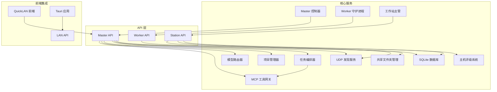
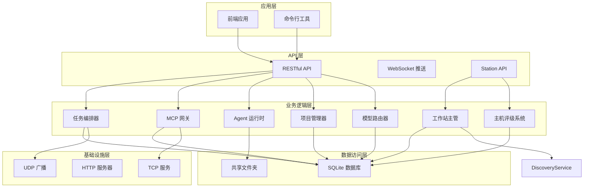
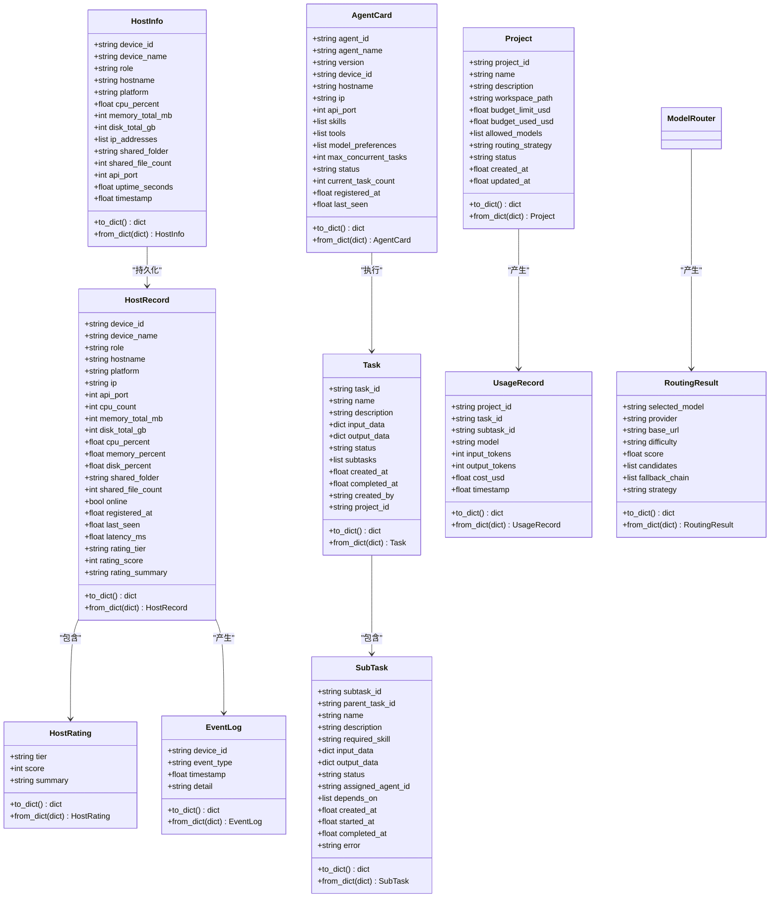
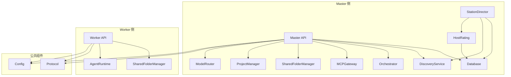
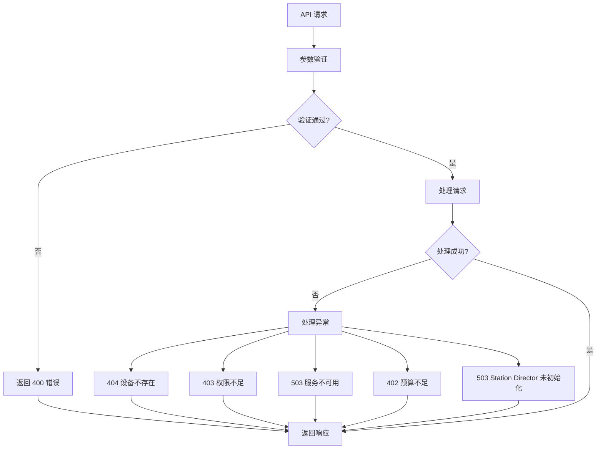

# Web API 接口

<cite>
**本文档引用的文件**
- [api.py](file://lan_mesh/api.py)
- [master.py](file://lan_mesh/master.py)
- [worker.py](file://lan_mesh/worker.py)
- [protocol.py](file://lan_mesh/protocol.py)
- [shared_folder.py](file://lan_mesh/shared_folder.py)
- [database.py](file://lan_mesh/database.py)
- [discovery.py](file://lan_mesh/discovery.py)
- [orchestrator.py](file://lan_mesh/orchestrator.py)
- [mcp_gateway.py](file://lan_mesh/mcp_gateway.py)
- [project.py](file://lan_mesh/project.py)
- [model_router.py](file://lan_mesh/model_router.py)
- [station_director.py](file://lan_mesh/station_director.py)
- [host_rating.py](file://lan_mesh/host_rating.py)
- [config.yaml](file://config.yaml)
- [api.ts](file://quicklan-main/src/api.ts)
- [types.ts](file://quicklan-main/src/types.ts)
- [lan_api.rs](file://quicklan-main/src-tauri/src/lan_api.rs)
- [dashboard.html](file://lan_mesh/web/templates/dashboard.html)
- [secretary.py](file://lan_mesh/secretary.py)
- [main.py](file://main.py)
</cite>

## 更新摘要
**变更内容**
- 新增 `/api/station/` 命名空间下的六个舰队管理端点
- 新增主机评级和舰队统计功能
- 增强了 Web UI 仪表盘的舰队管理能力
- 完善了事件历史和实时监控功能

## 目录
1. [简介](#简介)
2. [项目结构](#项目结构)
3. [核心组件](#核心组件)
4. [架构概览](#架构概览)
5. [详细接口规范](#详细接口规范)
6. [数据模型](#数据模型)
7. [依赖关系分析](#依赖关系分析)
8. [性能考虑](#性能考虑)
9. [故障排除指南](#故障排除指南)
10. [结论](#结论)

## 简介

Work Station 项目是一个基于局域网的分布式任务执行平台，采用 Master/Worker 架构设计。该项目提供了完整的 Web API 接口，支持设备管理、文件传输、任务执行、工具调度和项目管理等功能。系统通过 UDP 广播发现机制实现设备自动发现，通过 HTTP API 提供 RESTful 接口，通过 WebSocket 实现实时状态推送。

**更新** 新增了 `/api/station/` 命名空间，提供全面的舰队管理能力，包括主机评级、事件历史、统计摘要等功能。

## 项目结构

项目采用模块化设计，主要包含以下核心模块：

**图表来源**
- [master.py:66-319](file://lan_mesh/master.py#L66-L319)
- [worker.py:62-325](file://lan_mesh/worker.py#L62-L325)
- [api.py:37-570](file://lan_mesh/api.py#L37-L570)
- [station_director.py:28-224](file://lan_mesh/station_director.py#L28-L224)
- [host_rating.py:13-115](file://lan_mesh/host_rating.py#L13-L115)

**章节来源**
- [master.py:1-332](file://lan_mesh/master.py#L1-L332)
- [worker.py:1-325](file://lan_mesh/worker.py#L1-L325)
- [api.py:1-570](file://lan_mesh/api.py#L1-L570)
- [station_director.py:1-224](file://lan_mesh/station_director.py#L1-L224)
- [host_rating.py:1-115](file://lan_mesh/host_rating.py#L1-L115)

## 核心组件

### Master 控制器
Master 控制器作为系统的中央协调者，负责：
- 设备注册与状态管理
- 任务编排与分发
- MCP 工具网关管理
- 项目管理与预算控制
- 模型路由决策
- WebSocket 实时推送
- Web UI 仪表盘提供

### Worker 守护进程
Worker 守护进程部署在各个主机上，负责：
- 设备信息采集与上报
- 文件共享服务
- 任务执行
- Agent 能力注册

### 发现服务
基于 UDP 广播的设备发现机制，实现设备自动发现和状态同步。

### 项目管理器
项目管理器负责：
- 项目生命周期管理（创建、查询、更新、归档）
- 预算控制与成本核算
- 模型调用计费与路由策略
- 消费记录追踪与分析

### 模型路由器
模型路由器负责：
- 任务难度分级（L1-L4）
- 加权评分算法
- 降级链容灾
- 多 Provider 支持
- 策略适配（cost_first、quality_first、balanced）

### 工作站主管 (Station Director)
**新增** 工作站主管负责：
- 主机注册入站处理和评级计算
- 心跳处理和实时指标更新
- 离线检测和事件记录
- 舰队管理（主机列表、统计、事件历史）
- 资源池查询（按评级筛选在线主机）
- 手动评级重算功能

### 主机评级系统
**新增** 主机评级系统负责：
- 基于硬件配置（CPU、内存、磁盘）自动计算综合得分
- 映射到 S/A/B/C/D 五级评级
- 生成人类可读的评级摘要
- 支持手动重算和评级变更事件记录

**章节来源**
- [master.py:66-170](file://lan_mesh/master.py#L66-L170)
- [worker.py:62-120](file://lan_mesh/worker.py#L62-L120)
- [discovery.py:33-136](file://lan_mesh/discovery.py#L33-L136)
- [project.py:62-320](file://lan_mesh/project.py#L62-L320)
- [model_router.py:116-327](file://lan_mesh/model_router.py#L116-L327)
- [station_director.py:28-224](file://lan_mesh/station_director.py#L28-L224)
- [host_rating.py:13-115](file://lan_mesh/host_rating.py#L13-L115)

## 架构概览

系统采用分层架构设计，各层职责明确：

**图表来源**
- [master.py:183-218](file://lan_mesh/master.py#L183-L218)
- [worker.py:219-238](file://lan_mesh/worker.py#L219-L238)
- [api.py:37-570](file://lan_mesh/api.py#L37-L570)
- [station_director.py:28-224](file://lan_mesh/station_director.py#L28-L224)
- [host_rating.py:13-115](file://lan_mesh/host_rating.py#L13-L115)

## 详细接口规范

### Master API 接口

#### 设备管理接口

**设备注册**
- 方法：POST `/api/register`
- 功能：Worker 注册到 Master
- 请求体：HostInfo 对象
- 响应：注册结果

**心跳管理**
- 方法：POST `/api/heartbeat`
- 功能：Worker 心跳上报
- 请求体：包含设备ID和资源使用率
- 响应：心跳确认

**设备列表**
- 方法：GET `/api/hosts`
- 功能：获取所有注册设备
- 响应：设备列表和统计信息

**单设备查询**
- 方法：GET `/api/hosts/{device_id}`
- 功能：查询指定设备详情
- 响应：设备信息或发现设备信息

**网络状态**
- 方法：GET `/api/network`
- 功能：获取 Master 网络状态
- 响应：网络配置信息

**设备发现**
- 方法：GET `/api/discovery`
- 功能：获取 UDP 发现的设备列表
- 响应：发现设备列表

**主动探测**
- 方法：POST `/api/probe/{ip}`
- 功能：主动探测指定 IP
- 响应：探测结果

**健康检查**
- 方法：GET `/api/health`
- 功能：服务健康检查
- 响应：健康状态信息

**Master 信息**
- 方法：GET `/api/master-info`
- 功能：获取 Master 自身信息
- 响应：HostInfo 对象

#### 文件共享接口

**共享文件列表**
- 方法：GET `/api/shared`
- 功能：获取 Master 共享文件列表
- 响应：文件列表和统计信息

#### Agent 管理接口

**Agent 注册**
- 方法：POST `/api/agents/register`
- 功能：Worker 注册 Agent Card
- 请求体：AgentCard 对象
- 响应：注册结果

**Agent 列表**
- 方法：GET `/api/agents`
- 功能：获取所有 Agent 列表
- 参数：status（可选）
- 响应：Agent 列表和统计信息

**单 Agent 查询**
- 方法：GET `/api/agents/{agent_id}`
- 功能：查询指定 Agent 详情
- 响应：Agent 信息

#### 任务管理接口

**任务提交**
- 方法：POST `/api/tasks`
- 功能：提交新任务
- 请求体：任务描述和输入数据
- 响应：Task 对象
- **更新** 支持关联项目进行预算控制

**任务列表**
- 方法：GET `/api/tasks`
- 功能：获取任务列表
- 参数：status（可选）、limit（默认50）
- 响应：任务列表

**任务查询**
- 方法：GET `/api/tasks/{task_id}`
- 功能：查询指定任务状态
- 响应：Task 对象

#### 项目管理接口

**项目创建**
- 方法：POST `/api/projects`
- 功能：创建新项目
- 请求体：项目配置（名称、描述、预算、模型限制、路由策略等）
- 响应：Project 对象
- **新增** 支持独立工作空间、预算控制和模型白名单

**项目列表**
- 方法：GET `/api/projects`
- 功能：获取项目列表
- 参数：status（可选，按状态过滤）
- 响应：项目列表和统计信息

**单项目查询**
- 方法：GET `/api/projects/{project_id}`
- 功能：查询项目详情（含预算状态）
- 响应：项目状态信息（包含预算使用率、剩余预算、消费统计等）

**项目更新**
- 方法：PUT `/api/projects/{project_id}`
- 功能：更新项目配置
- 请求体：可更新字段（名称、描述、预算、模型、路由策略、状态等）
- 响应：更新后的项目对象

**项目归档**
- 方法：DELETE `/api/projects/{project_id}`
- 功能：归档项目（软删除）
- 响应：归档结果

**项目消费记录**
- 方法：GET `/api/projects/{project_id}/usage`
- 功能：查询项目消费记录
- 参数：limit（默认100，限制返回记录数）
- 响应：消费记录列表和统计信息

#### 模型路由接口

**路由决策预览**
- 方法：POST `/api/route/dry-run`
- 功能：模型路由决策预览（dry-run）
- 请求体：包含任务描述、技能类型、项目ID
- 响应：RoutingResult 对象

**模型列表**
- 方法：GET `/api/models`
- 功能：返回模型池列表（含可用状态）
- 响应：模型列表

#### MCP 工具接口

**工具列表**
- 方法：GET `/tools/list`
- 功能：获取所有可用工具
- 参数：model（可选，模型类型）
- 响应：工具列表和服务器信息

**工具调用**
- 方法：POST `/tools/call`
- 功能：调用指定工具
- 请求体：包含工具名称和参数
- 响应：工具执行结果

**MCP 服务器列表**
- 方法：GET `/tools/servers`
- 功能：获取所有 MCP 服务器
- 响应：服务器列表和统计信息

**MCP 服务器注册**
- 方法：POST `/tools/servers`
- 功能：动态注册 MCP 服务器
- 请求体：服务器配置
- 响应：注册结果

**MCP 服务器注销**
- 方法：DELETE `/tools/servers/{name}`
- 功能：注销 MCP 服务器
- 响应：注销结果

#### 实时通信接口

**WebSocket 连接**
- 方法：WS `/ws`
- 功能：实时推送设备状态变化
- 消息类型：hosts、heartbeat、agent_registered、project_created、project_updated、project_archived 等

### Station API 接口

**新增** 工作站 API 提供舰队管理能力：

#### 舰队概览统计

**舰队概览**
- 方法：GET `/api/station/fleet`
- 功能：获取舰队概览统计信息
- 响应：包含总主机数、在线/离线主机数、各评级分布的统计摘要

**主机列表**
- 方法：GET `/api/station/hosts`
- 功能：获取所有主机列表（含评级和状态）
- 参数：min_tier（可选，默认"D"），online_only（可选，默认False）
- 响应：主机列表，支持按评级筛选和在线状态过滤

**单主机事件历史**
- 方法：GET `/api/station/hosts/{device_id}/events`
- 功能：查询指定主机的出入站事件历史
- 参数：device_id（路径参数），limit（可选，默认20）
- 响应：事件历史列表

**全局事件流**
- 方法：GET `/api/station/events`
- 功能：获取最近全站事件流
- 参数：limit（可选，默认50）
- 响应：全站事件历史列表

**手动评级**
- 方法：POST `/api/station/rate`
- 功能：手动触发重新评级所有在线主机
- 响应：包含更新主机数量的结果

**舰队统计**
- 方法：GET `/api/station/stats`
- 功能：获取统计摘要
- 响应：与 `/api/station/fleet` 相同的统计信息

#### 实时事件推送

**WebSocket 事件推送**
- 方法：WS `/ws`
- 功能：实时推送主机状态变更和事件
- 消息类型：hosts、heartbeat、agent_registered、project_created、project_updated、project_archived、station_events 等

**章节来源**
- [api.py:543-579](file://lan_mesh/api.py#L543-L579)
- [station_director.py:154-219](file://lan_mesh/station_director.py#L154-L219)
- [host_rating.py:45-83](file://lan_mesh/host_rating.py#L45-L83)

### Worker API 接口

#### 设备信息接口

**设备信息**
- 方法：GET `/info`
- 功能：获取本机完整配置信息
- 响应：HostInfo 对象

#### 任务执行接口

**任务执行**
- 方法：POST `/tasks/execute`
- 功能：执行 Master 分发的任务
- 请求体：任务执行参数
- 响应：执行结果

#### 文件共享接口

**共享文件列表**
- 方法：GET `/shared`
- 功能：列出共享文件
- 响应：文件列表和统计信息

**文件下载**
- 方法：GET `/shared/{path}`
- 功能：下载共享文件
- 参数：文件路径
- 响应：文件流

**文件上传**
- 方法：POST `/shared`
- 功能：上传文件到共享目录
- 请求体：multipart/form-data
- 响应：上传结果

#### 实时通信接口

**WebSocket 连接**
- 方法：WS `/ws`
- 功能：实时推送设备状态变化
- 消息类型：hosts、heartbeat、agent_registered、project_created、project_updated、project_archived 等

**章节来源**
- [api.py:39-98](file://lan_mesh/api.py#L39-L98)

### 前端集成接口

#### QuickLAN 前端接口

**设备管理**
- `listDevices()`: 获取设备列表
- `updateDeviceNote(deviceId, note)`: 更新设备备注
- `discoverIp(ip)`: 发现指定 IP

**文件传输**
- `sendFiles(targetId, filePaths)`: 发送文件
- `acceptTransfer(transferId)`: 接受传输
- `rejectTransfer(transferId)`: 拒绝传输
- `getTransfers()`: 获取传输列表

**共享管理**
- `listSharedResources()`: 列出共享资源
- `listMyShares()`: 列出我的分享
- `downloadShare(shareId, password)`: 下载共享

**项目管理**
- `createProject(projectData)`: 创建新项目
- `listProjects(status)`: 获取项目列表
- `getProjectStatus(projectId)`: 查询项目状态
- `updateProject(projectId, projectData)`: 更新项目配置
- `archiveProject(projectId)`: 归档项目
- `getProjectUsage(projectId, limit)`: 获取项目消费记录

**舰队管理**（新增）
- `getFleetStats()`: 获取舰队统计
- `getHosts(minTier, onlineOnly)`: 获取主机列表
- `getHostEvents(deviceId, limit)`: 获取主机事件历史
- `getStationEvents(limit)`: 获取全站事件流
- `recomputeRatings()`: 重新计算评级

**章节来源**
- [api.ts:13-130](file://quicklan-main/src/api.ts#L13-L130)

## 数据模型

### 核心数据结构

**图表来源**
- [protocol.py:69-388](file://lan_mesh/protocol.py#L69-L388)
- [host_rating.py:30-43](file://lan_mesh/host_rating.py#L30-L43)
- [database.py:312-334](file://lan_mesh/database.py#L312-L334)

### 端口和服务配置

| 服务 | 默认端口 | 用途 |
|------|----------|------|
| UDP 发现 | 45454 | 设备发现和状态广播 |
| Worker API | 45460 | Worker HTTP API |
| Master API | 45470 | Master HTTP API + Web UI |
| LAN API | 45480 | QuickLAN LAN API |

**章节来源**
- [protocol.py:17-24](file://lan_mesh/protocol.py#L17-L24)
- [config.yaml:5-22](file://config.yaml#L5-L22)

## 依赖关系分析

### 组件依赖图

**图表来源**
- [master.py:32-106](file://lan_mesh/master.py#L32-L106)
- [worker.py:43-44](file://lan_mesh/worker.py#L43-L44)
- [api.py:33-34](file://lan_mesh/api.py#L33-L34)
- [station_director.py:31-36](file://lan_mesh/station_director.py#L31-L36)
- [host_rating.py:13-25](file://lan_mesh/host_rating.py#L13-L25)

### 错误处理机制

系统实现了完善的错误处理机制：

**章节来源**
- [api.py:81-84](file://lan_mesh/api.py#L81-L84)
- [api.py:152-153](file://lan_mesh/api.py#L152-L153)
- [api.py:569](file://lan_mesh/api.py#L569)

## 性能考虑

### 系统性能指标

| 指标 | 默认值 | 优化建议 |
|------|--------|----------|
| 心跳间隔 | 5 秒 | 根据网络状况调整 |
| 设备 TTL | 12 秒 | 平衡响应速度和准确性 |
| 心跳日志保留 | 24 小时 | 根据存储容量调整 |
| 最大并发任务 | 5 个 | 根据硬件配置调整 |
| 文件上传大小限制 | 无限制 | 建议设置合理限制 |
| 项目消费记录保留 | 100 条 | 可根据需求调整 |
| 模型路由候选数量 | 10 个 | 根据性能调整 |
| **新增** 事件历史保留 | 50 条 | 可根据需求调整 |
| **新增** 舰队统计缓存 | 3 秒 | 减少数据库查询频率 |

### 缓存策略

- **设备信息缓存**：Worker 定期刷新共享文件夹中的配置报告
- **工具列表缓存**：MCP 网关缓存工具定义，减少查询开销
- **Agent 状态缓存**：数据库中维护 Agent 状态，避免重复查询
- **项目状态缓存**：项目预算和消费信息的内存缓存，提高查询性能
- **模型路由缓存**：路由决策结果的短期缓存，减少重复计算
- ****新增** 舰队统计缓存**：主机评级和统计信息的短期缓存
- ****新增** 事件历史缓存**：最近事件的内存缓存，提高查询性能

### 网络优化

- **UDP 广播**：使用多播地址提高发现效率
- **WebSocket 长连接**：减少频繁连接开销
- **批量操作**：支持批量文件传输和设备查询
- **项目状态推送**：通过 WebSocket 实时推送项目状态变更
- **心跳去抖**：避免频繁的心跳请求
- ****新增** 事件流推送**：通过 WebSocket 实时推送舰队事件

## 故障排除指南

### 常见问题及解决方案

**设备无法发现**
1. 检查防火墙设置是否允许 UDP 45454 端口
2. 验证网络连通性和广播地址配置
3. 确认设备在同一子网内

**API 连接失败**
1. 检查 Master 和 Worker 的 API 端口配置
2. 验证网络连通性
3. 查看服务日志获取详细错误信息

**文件传输失败**
1. 检查共享文件夹权限设置
2. 验证磁盘空间充足
3. 确认文件路径安全（防止路径穿越）

**任务执行异常**
1. 检查 Agent 是否在线且具备所需技能
2. 验证 Worker 端口可达性
3. 查看任务日志获取执行详情

**项目管理异常**
1. 检查项目管理器是否正确初始化
2. 验证数据库连接和表结构
3. 确认项目预算配置合理

**模型路由异常**
1. 检查模型池配置和 API Key 设置
2. 验证项目模型白名单配置
3. 查看路由决策日志

****新增** 舰队管理异常**
1. 检查 Station Director 是否正确初始化
2. 验证数据库连接和主机表结构
3. 确认主机评级配置和阈值设置
4. 查看事件日志和评级变更记录
5. 验证 Discovery 服务是否正常工作

****新增** WebSocket 连接问题**
1. 检查 WebSocket 端口配置
2. 验证客户端连接状态
3. 查看服务器日志获取连接错误信息
4. 确认事件推送机制正常工作

### 日志和监控

系统提供详细的日志输出：
- 启动和停止日志
- 设备发现和状态变更日志
- API 请求和响应日志
- 错误和异常日志
- 项目创建、更新、归档的日志记录
- 项目预算超支和状态变更的告警日志
- **新增** 模型路由决策日志
- **新增** 任务执行和消费记录日志
- **新增** 舰队管理操作日志（主机注册、评级变更、事件记录）
- **新增** 主机离线检测和清理日志
- **新增** WebSocket 连接和事件推送日志

**章节来源**
- [master.py:300-313](file://lan_mesh/master.py#L300-L313)
- [worker.py:314-318](file://lan_mesh/worker.py#L314-L318)
- [station_director.py:92-150](file://lan_mesh/station_director.py#L92-L150)

## 结论

Work Station 项目提供了完整的 Web API 接口体系，支持高效的局域网设备管理和任务执行。系统采用模块化设计，具有良好的扩展性和稳定性。通过合理的架构设计和完善的错误处理机制，确保了系统的可靠运行。

**主要特点**：
- **完整的 API 覆盖**：支持设备管理、文件传输、任务执行、项目管理等核心功能
- **实时通信**：通过 WebSocket 实现实时状态推送，包括项目状态变更
- **灵活的架构**：支持 Master/Worker 模式和 MCP 工具集成
- **完善的错误处理**：提供详细的错误信息和恢复机制
- **高性能设计**：优化的缓存策略和网络通信机制
- **项目管理功能**：提供完整的项目生命周期管理和预算控制
- **智能路由**：基于难度分级和加权评分的模型路由决策
- **成本控制**：实时预算跟踪和自动暂停机制
- ****新增** 舰队管理能力**：提供全面的主机评级、事件历史和统计功能
- ****新增** 实时监控**：通过 WebSocket 实时推送舰队状态和事件

**建议在生产环境中**：
1. 根据实际网络环境调整心跳间隔和 TTL 设置
2. 配置适当的日志级别和轮转策略
3. 设置合理的文件大小限制和权限控制
4. 定期备份数据库和重要配置文件
5. 配置项目管理器的预算阈值和路由策略
6. 监控项目预算使用情况，及时预警
7. **新增** 定期检查模型池配置和 API Key 有效性
8. **新增** 监控模型路由性能和决策准确性
9. **新增** 定期清理过期事件记录，维护数据库性能
10. **新增** 监控主机评级准确性，必要时手动重算
11. **新增** 配置合适的事件推送频率，避免过度推送
12. **新增** 监控 WebSocket 连接状态，确保实时通信正常