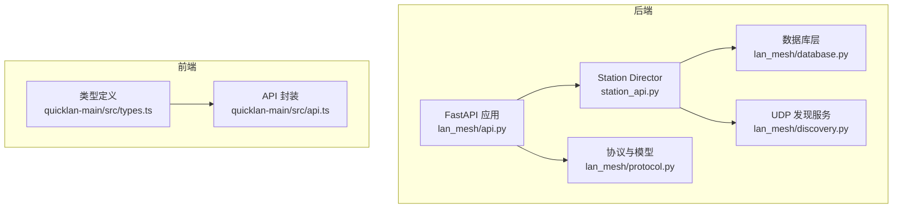
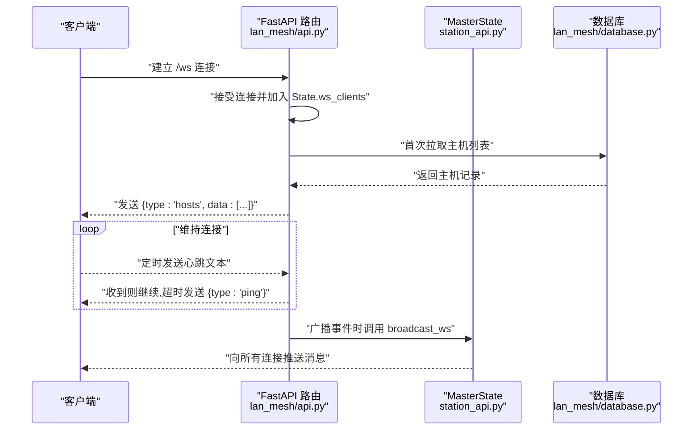
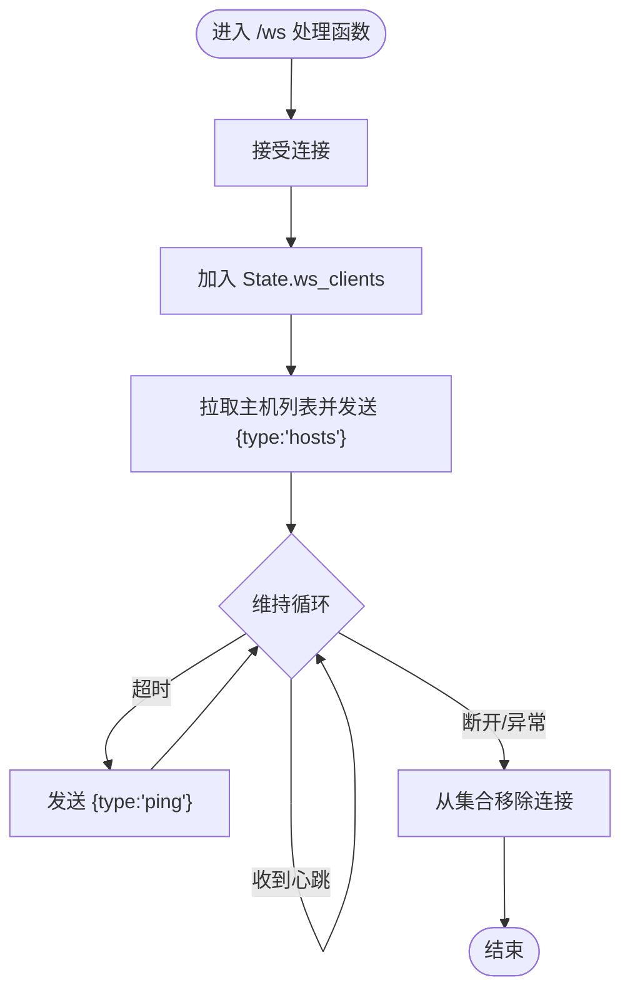
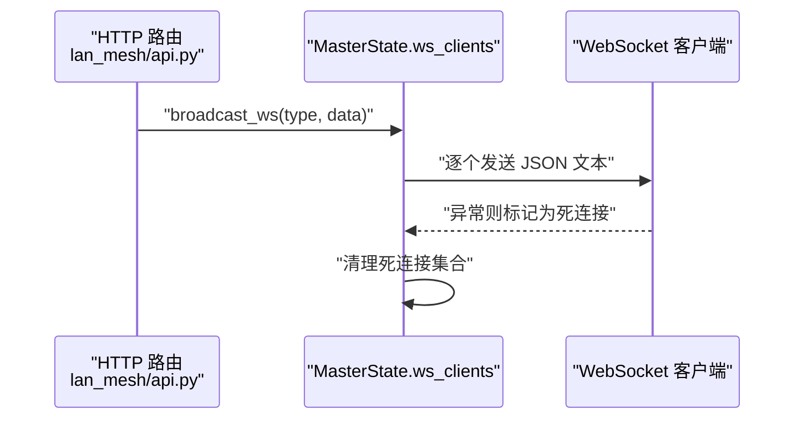
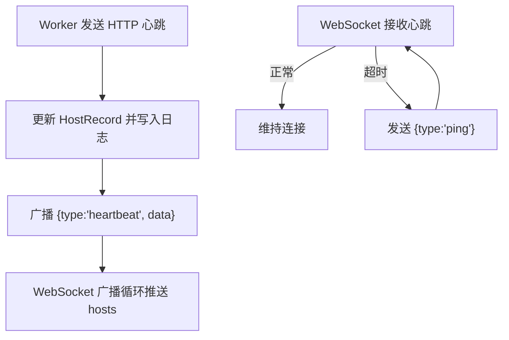
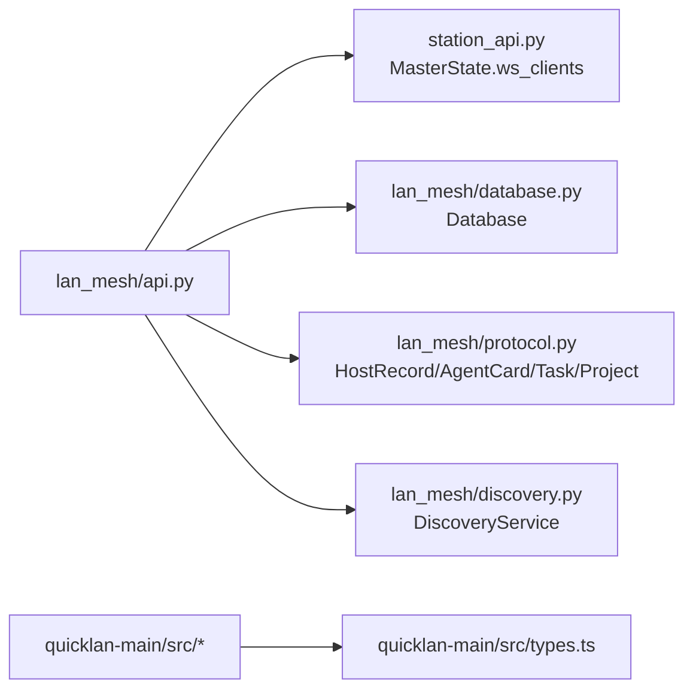

# WebSocket 实时通信

<cite>
**本文引用的文件**
- [api.py](file://lan_mesh/api.py)
- [station_api.py](file://lan_mesh/station_api.py)
- [protocol.py](file://lan_mesh/protocol.py)
- [database.py](file://lan_mesh/database.py)
- [discovery.py](file://lan_mesh/discovery.py)
- [main.py](file://main.py)
- [types.ts](file://quicklan-main/src/types.ts)
- [api.ts](file://quicklan-main/src/api.ts)
</cite>

## 目录
1. [简介](#简介)
2. [项目结构](#项目结构)
3. [核心组件](#核心组件)
4. [架构总览](#架构总览)
5. [详细组件分析](#详细组件分析)
6. [依赖分析](#依赖分析)
7. [性能考虑](#性能考虑)
8. [故障排查指南](#故障排查指南)
9. [结论](#结论)
10. [附录](#附录)

## 简介
本文件系统性地阐述 LAN Mesh 项目中的 WebSocket 实时通信接口，重点围绕 /ws 端点的连接建立、消息格式与事件类型、实时推送机制（主机状态变更、心跳检测、客户端连接管理）、以及面向前端的集成示例与最佳实践。同时给出连接超时处理、错误恢复与性能优化建议，并对消息类型定义、数据格式与客户端实现提供指导。

## 项目结构
与 WebSocket 实时通信相关的核心模块分布如下：
- 后端（Python/FastAPI）：负责 /ws WebSocket 端点、广播推送、心跳处理与数据库交互
- 前端（TypeScript/Tauri）：提供设备信息类型定义与 API 调用封装，便于对接 WebSocket 消息

**图表来源**
- [api.py:500-538](file://lan_mesh/api.py#L500-L538)
- [station_api.py](file://lan_mesh/station_api.py#L48-L323)
- [protocol.py:1-356](file://lan_mesh/protocol.py#L1-L356)
- [database.py:1-611](file://lan_mesh/database.py#L1-L611)
- [discovery.py:1-259](file://lan_mesh/discovery.py#L1-L259)
- [types.ts:1-128](file://quicklan-main/src/types.ts#L1-L128)
- [api.ts:1-130](file://quicklan-main/src/api.ts#L1-L130)

**章节来源**
- [api.py:500-538](file://lan_mesh/api.py#L500-L538)
- [station_api.py](file://lan_mesh/station_api.py#L48-L323)
- [protocol.py:1-356](file://lan_mesh/protocol.py#L1-L356)
- [database.py:1-611](file://lan_mesh/database.py#L1-L611)
- [discovery.py:1-259](file://lan_mesh/discovery.py#L1-L259)
- [types.ts:1-128](file://quicklan-main/src/types.ts#L1-L128)
- [api.ts:1-130](file://quicklan-main/src/api.ts#L1-L130)

## 核心组件
- WebSocket 端点 /ws：接受客户端连接，首次推送当前主机状态，随后通过 ping 心跳维持连接
- 广播推送：在多种业务事件发生时，向所有已连接的 WebSocket 客户端广播消息
- 心跳与离线判定：HTTP 心跳与 WebSocket ping 心跳共同保障状态一致性
- 数据模型：统一的主机信息、Agent 卡片、任务与项目等模型，确保消息结构稳定

**章节来源**
- [api.py:500-538](file://lan_mesh/api.py#L500-L538)
- [api.py:148-168](file://lan_mesh/api.py#L148-L168)
- [api.py:268-279](file://lan_mesh/api.py#L268-L279)
- [api.py:302-326](file://lan_mesh/api.py#L302-L326)
- [api.py:347-411](file://lan_mesh/api.py#L347-L411)
- [protocol.py:69-147](file://lan_mesh/protocol.py#L69-L147)
- [protocol.py:202-234](file://lan_mesh/protocol.py#L202-L234)
- [protocol.py:276-297](file://lan_mesh/protocol.py#L276-L297)
- [protocol.py:310-334](file://lan_mesh/protocol.py#L310-L334)

## 架构总览
WebSocket 实时通信在后端由 FastAPI 路由与 Master 控制器协作完成，前端通过 Tauri 应用与 WebSocket 连接交互。

**图表来源**
- [api.py:500-538](file://lan_mesh/api.py#L500-L538)
- [station_api.py](file://lan_mesh/station_api.py#L55-L65)
- [database.py:233-262](file://lan_mesh/database.py#L233-L262)

## 详细组件分析

### WebSocket 端点 /ws
- 连接建立：接受客户端连接后，将 WebSocket 对象加入全局状态集合
- 首次推送：拉取数据库中的主机列表，发送 type 为 hosts 的 JSON 消息
- 心跳维持：使用 receive_text + 超时机制，若超时则发送 type 为 ping 的心跳消息
- 断开处理：捕获断开异常并从集合中移除连接；最终清理保证资源释放

**图表来源**
- [api.py:500-538](file://lan_mesh/api.py#L500-L538)

**章节来源**
- [api.py:500-538](file://lan_mesh/api.py#L500-L538)

### 广播推送机制
- 触发时机：HTTP 端点在多个业务事件发生时调用广播函数
  - 注册事件：主机注册、Agent 注册
  - 任务事件：任务提交、项目创建/更新/归档
  - 心跳事件：Worker 心跳上报
- 广播实现：遍历所有已连接的 WebSocket，逐个发送 JSON 文本；对失败连接进行回收

**图表来源**
- [api.py:529-538](file://lan_mesh/api.py#L529-L538)
- [api.py:148-168](file://lan_mesh/api.py#L148-L168)
- [api.py:268-279](file://lan_mesh/api.py#L268-L279)
- [api.py:302-326](file://lan_mesh/api.py#L302-L326)
- [api.py:347-411](file://lan_mesh/api.py#L347-L411)

**章节来源**
- [api.py:529-538](file://lan_mesh/api.py#L529-L538)
- [api.py:148-168](file://lan_mesh/api.py#L148-L168)
- [api.py:268-279](file://lan_mesh/api.py#L268-L279)
- [api.py:302-326](file://lan_mesh/api.py#L302-L326)
- [api.py:347-411](file://lan_mesh/api.py#L347-L411)

### 心跳检测与离线判定
- WebSocket 心跳：服务端通过超时检测客户端心跳，超时发送 ping；客户端需定时回传心跳文本以维持连接
- HTTP 心跳：Worker 定期上报 CPU/Mem/Disk 使用率与共享文件数，服务端更新数据库并广播心跳事件
- 离线判定：数据库层按 TTL 清理长时间未活跃的主机

**图表来源**
- [api.py:148-168](file://lan_mesh/api.py#L148-L168)
- [database.py:194-201](file://lan_mesh/database.py#L194-L201)
- [station_api.py](file://lan_mesh/station_api.py#L175-L183)
- [api.py:500-538](file://lan_mesh/api.py#L500-L538)

**章节来源**
- [api.py:148-168](file://lan_mesh/api.py#L148-L168)
- [database.py:194-201](file://lan_mesh/database.py#L194-L201)
- [station_api.py](file://lan_mesh/station_api.py#L175-L183)
- [api.py:500-538](file://lan_mesh/api.py#L500-L538)

### 消息类型定义与数据格式
- hosts：首次连接或周期推送时发送，data 为主机记录数组
- ping：心跳超时触发，客户端需在收到后尽快回传心跳文本
- 其他事件类型（由广播触发）：host_registered、agent_registered、task_submitted、project_created、project_updated、project_archived、heartbeat 等，均以 {type, data} 结构发送

消息结构字段
- type: 字符串，事件类型标识
- data: 对象或数组，承载具体业务数据

**章节来源**
- [api.py:508-512](file://lan_mesh/api.py#L508-L512)
- [api.py:516-518](file://lan_mesh/api.py#L516-L518)
- [api.py:529-538](file://lan_mesh/api.py#L529-L538)
- [api.py:148-168](file://lan_mesh/api.py#L148-L168)
- [api.py:268-279](file://lan_mesh/api.py#L268-L279)
- [api.py:302-326](file://lan_mesh/api.py#L302-L326)
- [api.py:347-411](file://lan_mesh/api.py#L347-L411)

### 客户端集成示例与最佳实践
- 连接建立：使用标准浏览器 WebSocket API 或前端库连接至后端 /ws 端点
- 首次订阅：收到 {type:'hosts'} 后渲染初始主机列表
- 心跳处理：收到 {type:'ping'} 后立即回传任意文本（如 "pong"），避免超时断开
- 事件处理：根据 type 分发到不同 UI 更新逻辑（主机注册、心跳、任务/项目变更）
- 错误与重连：捕获断开/异常，指数退避重连；重连后再次请求 {type:'hosts'}
- 性能优化：批量处理消息、节流 UI 更新、避免频繁 DOM 重建

前端类型参考（用于理解数据结构）
- 设备信息类型 DeviceInfo：包含 id、name、ip、api_port、online、last_seen_ms 等字段
- 传输与网络状态类型：用于理解前后端数据契约

**章节来源**
- [types.ts:1-15](file://quicklan-main/src/types.ts#L1-L15)
- [types.ts:67-73](file://quicklan-main/src/types.ts#L67-L73)
- [api.ts:13-15](file://quicklan-main/src/api.ts#L13-L15)

## 依赖分析
- WebSocket 端点依赖 MasterState 中的 ws_clients 集合进行广播
- 广播函数依赖 JSON 序列化与异步发送能力
- 心跳事件依赖数据库层的 HostRecord 更新与心跳日志记录
- UDP 发现服务提供设备在线状态与网络信息，辅助 HTTP 心跳与 UI 展示

**图表来源**
- [api.py:500-538](file://lan_mesh/api.py#L500-L538)
- [station_api.py](file://lan_mesh/station_api.py#L55-L65)
- [database.py:147-192](file://lan_mesh/database.py#L147-L192)
- [protocol.py:115-147](file://lan_mesh/protocol.py#L115-L147)
- [protocol.py:202-234](file://lan_mesh/protocol.py#L202-L234)
- [protocol.py:276-297](file://lan_mesh/protocol.py#L276-L297)
- [protocol.py:310-334](file://lan_mesh/protocol.py#L310-L334)
- [discovery.py:97-126](file://lan_mesh/discovery.py#L97-L126)
- [types.ts:1-128](file://quicklan-main/src/types.ts#L1-L128)

**章节来源**
- [api.py:500-538](file://lan_mesh/api.py#L500-L538)
- [station_api.py](file://lan_mesh/station_api.py#L55-L65)
- [database.py:147-192](file://lan_mesh/database.py#L147-L192)
- [protocol.py:115-147](file://lan_mesh/protocol.py#L115-L147)
- [protocol.py:202-234](file://lan_mesh/protocol.py#L202-L234)
- [protocol.py:276-297](file://lan_mesh/protocol.py#L276-L297)
- [protocol.py:310-334](file://lan_mesh/protocol.py#L310-L334)
- [discovery.py:97-126](file://lan_mesh/discovery.py#L97-L126)
- [types.ts:1-128](file://quicklan-main/src/types.ts#L1-L128)

## 性能考虑
- 连接池与广播效率：广播时对异常连接进行回收，避免阻塞；可考虑按主题分区减少无关消息
- 心跳频率：WebSocket ping 与 HTTP 心跳共同作用，建议客户端心跳周期与服务端超时时间匹配，避免频繁 ping
- 数据压缩：对于 hosts 大列表，可在客户端侧做增量更新或差分推送（需服务端配合）
- UI 更新节流：批量合并 UI 变更，降低主线程压力
- 端口与网络：确保服务端监听 0.0.0.0 并开放相应端口，避免 NAT/防火墙导致连接失败

[本节为通用性能建议，不直接分析具体文件]

## 故障排查指南
- 连接立即断开
  - 检查客户端是否及时回传心跳文本
  - 确认服务端端口与防火墙策略
- 心跳频繁超时
  - 客户端应收到 {type:'ping'} 后立即回传心跳
  - 服务端超时时间为固定窗口，客户端需在窗口内响应
- 无法收到实时事件
  - 确认广播触发点（HTTP 端点）是否正确调用广播函数
  - 检查 ws_clients 集合是否被异常清理
- 离线判定异常
  - 核对 HTTP 心跳上报频率与数据库 TTL 设置
  - 检查 UDP 发现服务是否正常运行

**章节来源**
- [api.py:516-518](file://lan_mesh/api.py#L516-L518)
- [api.py:529-538](file://lan_mesh/api.py#L529-L538)
- [database.py:272-280](file://lan_mesh/database.py#L272-L280)
- [discovery.py:216-228](file://lan_mesh/discovery.py#L216-L228)

## 结论
WebSocket 实时通信在 LAN Mesh 中承担着“状态同步”的关键职责：通过 /ws 端点与广播机制，将主机注册、心跳、任务与项目变更等事件实时推送给前端。结合 HTTP 心跳与数据库 TTL，系统实现了可靠的在线状态管理。前端可依据消息类型进行差异化处理，并通过心跳与重连策略提升鲁棒性。

[本节为总结性内容，不直接分析具体文件]

## 附录

### 端点与事件一览
- WebSocket
  - /ws：首次推送 hosts；维持心跳；断开清理
- HTTP 广播事件
  - /api/register：host_registered
  - /api/heartbeat：heartbeat
  - /api/agents/register：agent_registered
  - /api/tasks：task_submitted
  - /api/projects：project_created/updated/archived

**章节来源**
- [api.py:500-538](file://lan_mesh/api.py#L500-L538)
- [api.py:116-146](file://lan_mesh/api.py#L116-L146)
- [api.py:148-168](file://lan_mesh/api.py#L148-L168)
- [api.py:268-279](file://lan_mesh/api.py#L268-L279)
- [api.py:302-326](file://lan_mesh/api.py#L302-L326)
- [api.py:347-411](file://lan_mesh/api.py#L347-L411)

### 数据模型参考
- 主机记录 HostRecord：包含设备标识、平台信息、CPU/内存/磁盘指标、在线状态与时间戳
- Agent 卡片 AgentCard：描述 Agent 能力与工具、状态与任务计数
- 任务 Task/SubTask：任务生命周期与子任务 DAG
- 项目 Project/UsageRecord：项目预算与消费记录

**章节来源**
- [protocol.py:115-147](file://lan_mesh/protocol.py#L115-L147)
- [protocol.py:202-234](file://lan_mesh/protocol.py#L202-L234)
- [protocol.py:276-297](file://lan_mesh/protocol.py#L276-L297)
- [protocol.py:310-334](file://lan_mesh/protocol.py#L310-L334)
- [protocol.py:337-355](file://lan_mesh/protocol.py#L337-L355)
