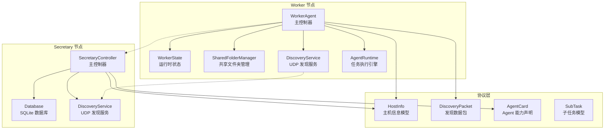
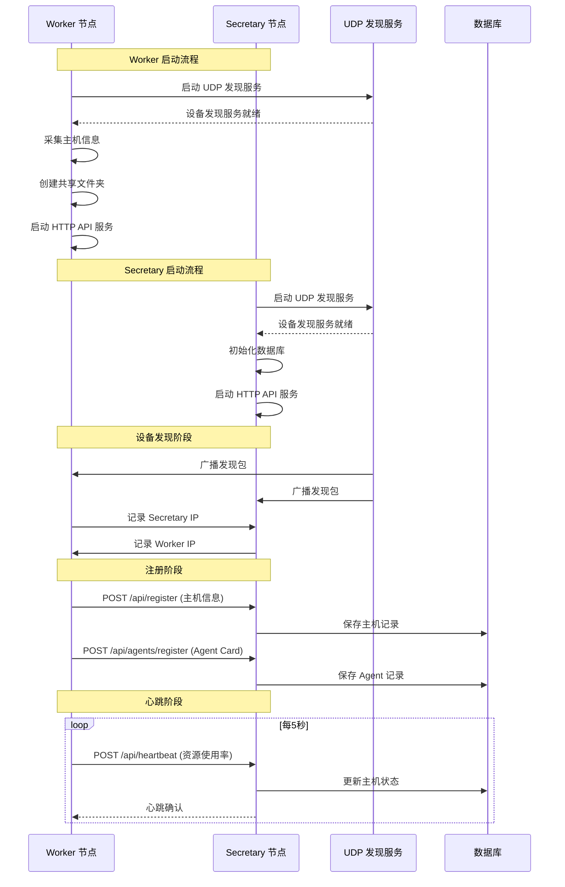
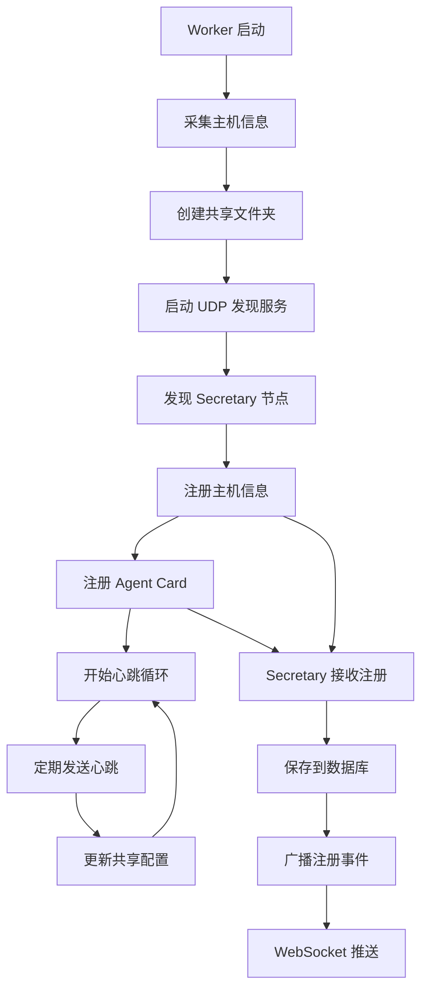
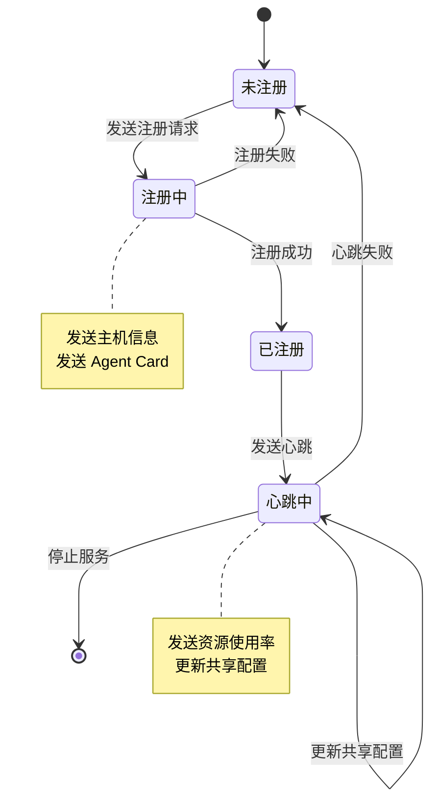
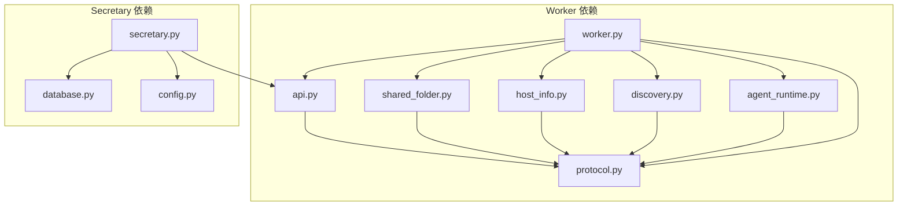

# Worker API 接口

<cite>
**本文档引用的文件**
- [worker.py](file://lan_mesh/worker.py)
- [api.py](file://lan_mesh/api.py)
- [secretary.py](file://lan_mesh/secretary.py)
- [shared_folder.py](file://lan_mesh/shared_folder.py)
- [protocol.py](file://lan_mesh/protocol.py)
- [host_info.py](file://lan_mesh/host_info.py)
- [discovery.py](file://lan_mesh/discovery.py)
- [agent_runtime.py](file://lan_mesh/agent_runtime.py)
- [config.py](file://lan_mesh/config.py)
- [config.yaml](file://config.yaml)
- [database.py](file://lan_mesh/database.py)
- [preflight.py](file://lan_mesh/preflight.py)
</cite>

## 更新摘要
**变更内容**
- 更新 Worker 与 Secretary 节点通信机制说明
- 新增 Agent Card 注册流程和 API 接口
- 更新注册和心跳机制为与 Secretary 的双向通信
- 新增任务执行接口的详细说明
- 更新架构图以反映新的 Worker-Secretary 模式

## 目录
1. [简介](#简介)
2. [项目结构](#项目结构)
3. [核心组件](#核心组件)
4. [架构概览](#架构概览)
5. [详细组件分析](#详细组件分析)
6. [依赖关系分析](#依赖关系分析)
7. [性能考虑](#性能考虑)
8. [故障排除指南](#故障排除指南)
9. [结论](#结论)

## 简介

本文档详细描述了 LAN Mesh 系统中 Worker 节点的 API 接口规范。Worker 节点作为部署在各主机上的守护进程，负责自动采集本机配置、创建并暴露共享文件夹、通过 UDP 广播发现 Secretary 节点、通过 HTTP 向 Secretary 注册并发送心跳，以及提供 HTTP API 供 Secretary 查询。

Worker 节点的核心职责包括：
- 自动采集本机配置（CPU/内存/磁盘/OS/网络）
- 自动创建并暴露共享文件夹
- UDP 广播发现 Secretary 节点
- 通过 HTTP 向 Secretary 注册并发送心跳
- 提供 HTTP API 供 Secretary 查询与文件下载
- 执行来自 Secretary 的子任务

## 项目结构



**图表来源**
- [worker.py:62-325](file://lan_mesh/worker.py#L62-L325)
- [api.py:39-98](file://lan_mesh/api.py#L39-L98)
- [protocol.py:69-234](file://lan_mesh/protocol.py#L69-L234)

**章节来源**
- [worker.py:1-325](file://lan_mesh/worker.py#L1-L325)
- [api.py:1-539](file://lan_mesh/api.py#L1-L539)

## 核心组件

### WorkerAgent 类
WorkerAgent 是 Worker 节点的主控制器，负责协调各个子系统的启动和运行。

主要功能：
- 设备身份管理：生成并持久化设备 ID
- 共享文件夹管理：自动创建和管理共享目录
- UDP 发现服务：广播自身存在并监听 Secretary 节点
- HTTP API 服务：提供 RESTful API 接口
- 心跳机制：定期向 Secretary 发送状态更新
- 任务执行：接收并执行来自 Secretary 的子任务

### SharedFolderManager 类
共享文件夹管理器负责文件的存储、检索和安全管理。

核心特性：
- 自动创建共享目录
- 文件列表和统计
- 安全路径解析，防止路径穿越攻击
- 自动生成主机配置报告

### DiscoveryService 类
UDP 发现服务实现设备间的自动发现和通信。

关键功能：
- 定期广播设备存在信息
- 监听和处理其他设备的发现包
- 设备状态跟踪和清理
- 网络状态检测

**章节来源**
- [worker.py:62-325](file://lan_mesh/worker.py#L62-L325)
- [shared_folder.py:16-219](file://lan_mesh/shared_folder.py#L16-L219)
- [discovery.py:33-259](file://lan_mesh/discovery.py#L33-L259)

## 架构概览



**图表来源**
- [worker.py:126-216](file://lan_mesh/worker.py#L126-L216)
- [api.py:116-168](file://lan_mesh/api.py#L116-L168)
- [database.py:147-231](file://lan_mesh/database.py#L147-L231)

## 详细组件分析

### Worker API 接口规范

#### /info 端点
**HTTP 方法**: GET  
**功能**: 返回本机完整配置信息

**请求参数**: 无  
**响应格式**: HostInfo 对象的 JSON 表示

**响应示例**:
```json
{
  "device_id": "string",
  "device_name": "string", 
  "role": "worker",
  "hostname": "string",
  "platform": "string",
  "platform_release": "string",
  "architecture": "string",
  "python_version": "string",
  "cpu_count": 0,
  "cpu_percent": 0.0,
  "cpu_freq_mhz": 0.0,
  "memory_total_mb": 0,
  "memory_available_mb": 0,
  "memory_percent": 0.0,
  "disk_total_gb": 0,
  "disk_used_gb": 0,
  "disk_free_gb": 0,
  "disk_percent": 0.0,
  "ip_addresses": ["string"],
  "mac_address": "string",
  "shared_folder": "string",
  "shared_file_count": 0,
  "api_port": 0,
  "uptime_seconds": 0.0,
  "timestamp": 0.0
}
```

**错误处理**: 无特定错误处理，正常情况下返回 200 OK

**章节来源**
- [api.py:47-50](file://lan_mesh/api.py#L47-L50)
- [worker.py:98-108](file://lan_mesh/worker.py#L98-L108)

#### /shared 端点
**HTTP 方法**: GET  
**功能**: 列出共享文件夹内容

**请求参数**: 无  
**响应格式**:
```json
{
  "folder": "string",
  "files": [
    {
      "name": "string",
      "path": "string", 
      "size": 0,
      "is_dir": true,
      "file_count": 0,
      "modified": 0
    }
  ],
  "file_count": 0
}
```

**错误处理**: 无特定错误处理，正常情况下返回 200 OK

**章节来源**
- [api.py:62-69](file://lan_mesh/api.py#L62-L69)
- [shared_folder.py:39-86](file://lan_mesh/shared_folder.py#L39-L86)

#### /shared/{path} 端点
**HTTP 方法**: GET  
**功能**: 下载共享文件

**请求参数**:
- path: 文件相对路径参数

**响应格式**: 文件流或 JSON 错误信息

**错误处理**:
- 404 Not Found: 文件不存在
- 403 Forbidden: 路径越界或其他权限错误

**章节来源**
- [api.py:71-85](file://lan_mesh/api.py#L71-L85)
- [shared_folder.py:96-101](file://lan_mesh/shared_folder.py#L96-L101)

#### /shared 端点 (POST)
**HTTP 方法**: POST  
**功能**: 上传文件到共享目录

**请求参数**: multipart/form-data 格式的文件  
**响应格式**:
```json
{
  "ok": true,
  "filename": "string",
  "path": "string",
  "size": 0
}
```

**错误处理**: 无特定错误处理，正常情况下返回 200 OK

**章节来源**
- [api.py:86-96](file://lan_mesh/api.py#L86-L96)
- [shared_folder.py:103-118](file://lan_mesh/shared_folder.py#L103-L118)

#### /tasks/execute 端点
**HTTP 方法**: POST  
**功能**: 接收 Secretary 分发的子任务并执行

**请求参数**: 子任务负载 (SubTask 对象)  
**响应格式**:
```json
{
  "output": {},
  "status": "completed|failed",
  "error": "string",
  "usage": {
    "model": "string",
    "input_tokens": 0,
    "output_tokens": 0
  }
}
```

**错误处理**:
- 503 Service Unavailable: Agent 运行时未初始化
- 400 Bad Request: 未知的技能类型

**章节来源**
- [api.py:54-60](file://lan_mesh/api.py#L54-L60)
- [agent_runtime.py:47-74](file://lan_mesh/agent_runtime.py#L47-L74)

### Worker 注册流程



**图表来源**
- [worker.py:126-171](file://lan_mesh/worker.py#L126-L171)
- [api.py:116-146](file://lan_mesh/api.py#L116-L146)

### 心跳机制



**图表来源**
- [worker.py:203-216](file://lan_mesh/worker.py#L203-L216)
- [api.py:148-168](file://lan_mesh/api.py#L148-L168)

**章节来源**
- [worker.py:126-216](file://lan_mesh/worker.py#L126-L216)
- [api.py:116-168](file://lan_mesh/api.py#L116-L168)

### Agent Card 注册机制

Worker 节点启动时会生成 Agent Card 并向 Secretary 注册，包含以下信息：
- 设备标识和主机信息
- 可用技能列表
- 工具定义
- 模型偏好
- 最大并发任务数

**章节来源**
- [worker.py:148-171](file://lan_mesh/worker.py#L148-L171)
- [api.py:269-281](file://lan_mesh/api.py#L269-L281)

## 依赖关系分析



**图表来源**
- [worker.py:28-44](file://lan_mesh/worker.py#L28-L44)
- [api.py:33-34](file://lan_mesh/api.py#L33-L34)

**章节来源**
- [worker.py:28-44](file://lan_mesh/worker.py#L28-L44)
- [api.py:33-34](file://lan_mesh/api.py#L33-L34)

## 性能考虑

### 端口分配策略
Worker 节点采用递增端口策略，从配置的起始端口开始查找可用端口，最多尝试 20 个连续端口。

### 心跳频率优化
- 心跳间隔默认 5 秒，平衡了实时性和网络开销
- 资源使用率采样采用非阻塞方式
- 共享配置文件写入采用覆盖模式，避免频繁 I/O

### 文件操作优化
- 文件上传采用二进制读取，支持大文件传输
- 路径解析严格验证，防止路径穿越攻击
- 文件列表递归遍历限制在单层深度，提高响应速度

### 任务执行优化
- 支持多 Provider 模型路由和降级链重试
- 模型调用超时控制和错误处理
- 任务执行结果的 token 用量统计

## 故障排除指南

### 常见启动问题

**问题**: 端口被占用
**解决方案**: 
- 检查配置文件中的端口设置
- 系统会自动尝试下一个可用端口
- 使用 `netstat` 检查端口占用情况

**问题**: UDP 端口绑定失败
**解决方案**:
- 检查防火墙设置
- 确认没有其他 LAN Mesh 实例运行
- 检查用户权限是否足够

**问题**: 共享文件夹不可写
**解决方案**:
- 检查路径权限
- 确认磁盘空间充足
- 验证路径有效性

### API 接口问题

**问题**: /info 端点返回 500 错误
**可能原因**:
- 主机信息采集失败
- psutil 库版本不兼容
- 权限不足访问系统信息

**问题**: /shared 下载返回 404
**可能原因**:
- 文件路径错误
- 文件已被删除
- 路径穿越攻击防护触发

**问题**: /tasks/execute 返回 503
**可能原因**:
- Agent 运行时未正确初始化
- LLM API 密钥未配置
- 系统资源不足

**问题**: 注册到 Secretary 失败
**可能原因**:
- Secretary 未启动或不可达
- 网络连接问题
- 端口冲突或防火墙阻止

**章节来源**
- [preflight.py:226-290](file://lan_mesh/preflight.py#L226-L290)
- [worker.py:240-249](file://lan_mesh/worker.py#L240-L249)

## 结论

Worker 节点提供了完整的 API 接口生态系统，支持设备信息查询、文件共享、任务执行和 Agent 能力注册等核心功能。通过 UDP 发现机制和 HTTP 注册流程，Worker 能够自动融入 LAN Mesh 网络，并通过心跳机制与 Secretary 节点保持持续通信。

系统设计注重安全性（路径验证、权限控制）、可靠性（自动重连、错误恢复）和性能（优化的心跳频率、高效的文件操作）。配置文件和启动前自检机制确保了部署的便利性和系统的稳定性。

**更新** 本版本反映了 Worker 与 Secretary 节点的直接通信机制，新增了 Agent Card 注册和任务执行功能，体现了更完整的分布式任务调度架构。