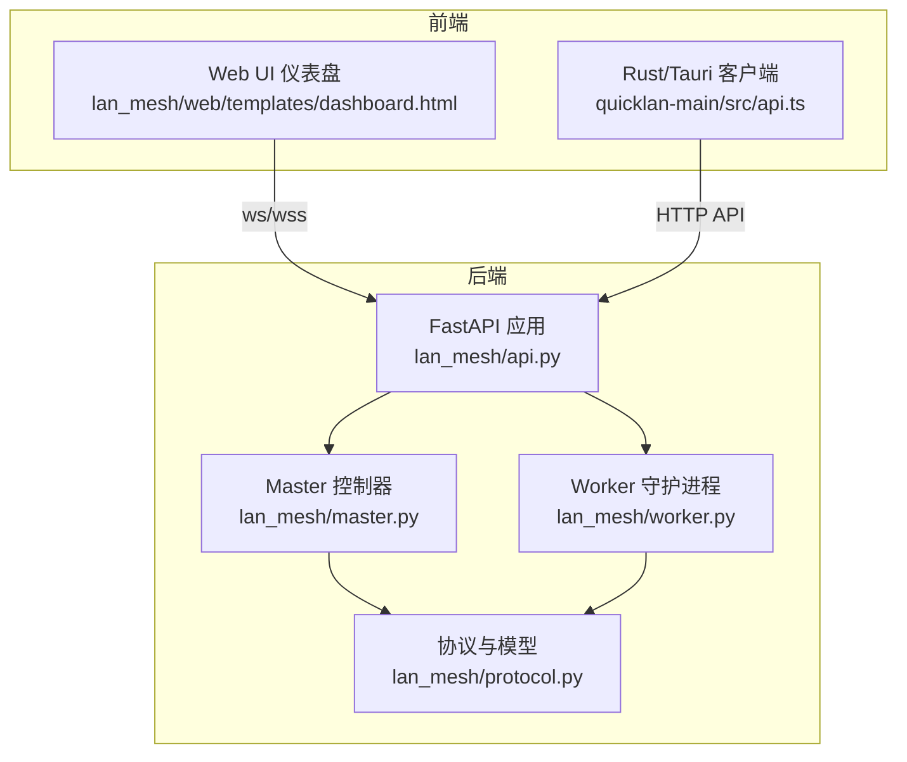
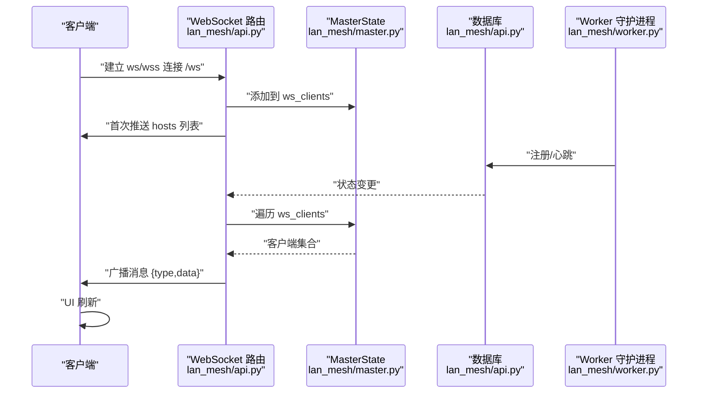
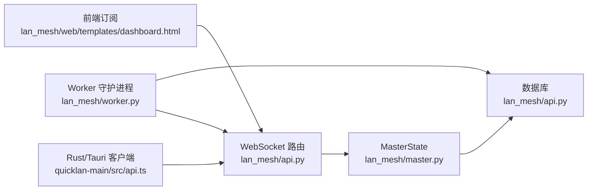

# WebSocket 实时通信

<cite>
**本文引用的文件**
- [main.py](file://main.py)
- [api.py](file://lan_mesh/api.py)
- [master.py](file://lan_mesh/master.py)
- [worker.py](file://lan_mesh/worker.py)
- [protocol.py](file://lan_mesh/protocol.py)
- [dashboard.html](file://lan_mesh/web/templates/dashboard.html)
- [protocol.rs](file://quicklan-main/src-tauri/src/protocol.rs)
- [api.ts](file://quicklan-main/src/api.ts)
</cite>

## 目录
1. [简介](#简介)
2. [项目结构](#项目结构)
3. [核心组件](#核心组件)
4. [架构总览](#架构总览)
5. [详细组件分析](#详细组件分析)
6. [依赖关系分析](#依赖关系分析)
7. [性能考量](#性能考量)
8. [故障排查指南](#故障排查指南)
9. [结论](#结论)
10. [附录](#附录)

## 简介
本文件系统性阐述本项目的 WebSocket 实时通信机制，包括：
- 实时推送的实现原理与架构设计
- 连接建立流程、消息格式规范与事件类型定义
- 客户端集成指南（JavaScript 与 Rust/Tauri）
- 状态同步机制与消息队列管理
- 错误处理策略与重连机制
- 性能优化建议与监控指标
- 安全考虑与连接限制等最佳实践

## 项目结构
本项目采用多语言混合架构：Python 后端提供 FastAPI 服务与 WebSocket；前端 Web UI 通过浏览器 WebSocket 订阅；Rust/Tauri 客户端通过 @tauri-apps/api 与后端交互。WebSocket 位于 Python 后端，负责向所有连接的客户端广播主机状态变更。

图表来源
- [api.py](file://lan_mesh/api.py)
- [master.py](file://lan_mesh/master.py)
- [worker.py](file://lan_mesh/worker.py)
- [protocol.py](file://lan_mesh/protocol.py)
- [dashboard.html](file://lan_mesh/web/templates/dashboard.html)
- [api.ts](file://quicklan-main/src/api.ts)

章节来源
- [main.py](file://main.py)
- [api.py](file://lan_mesh/api.py)
- [master.py](file://lan_mesh/master.py)
- [worker.py](file://lan_mesh/worker.py)
- [protocol.py](file://lan_mesh/protocol.py)
- [dashboard.html](file://lan_mesh/web/templates/dashboard.html)
- [api.ts](file://quicklan-main/src/api.ts)

## 核心组件
- WebSocket 路由与广播器：在 FastAPI 中定义 /ws 路由，接受连接并向所有客户端广播状态变更。
- Master 状态与后台推送：MasterController 维护 ws_clients 集合并周期性推送主机列表。
- Worker 心跳与注册：Worker 定期向 Master 发送心跳，触发广播。
- 前端订阅：Web UI 通过浏览器 WebSocket 订阅 /ws，接收实时状态更新。
- Rust/Tauri 客户端：通过 @tauri-apps/api 调用后端 HTTP API，结合 WebSocket 实现实时联动。

章节来源
- [api.py](file://lan_mesh/api.py)
- [master.py](file://lan_mesh/master.py)
- [worker.py](file://lan_mesh/worker.py)
- [dashboard.html](file://lan_mesh/web/templates/dashboard.html)
- [api.ts](file://quicklan-main/src/api.ts)

## 架构总览
WebSocket 实时推送的整体流程如下：
- 客户端建立 WebSocket 连接到 /ws
- 服务器接受连接并将客户端加入 ws_clients
- 服务器首次推送当前主机列表
- 服务器周期性推送主机列表，或在特定事件（如心跳、注册）发生时广播
- 客户端收到消息后刷新 UI

图表来源
- [api.py](file://lan_mesh/api.py)
- [master.py](file://lan_mesh/master.py)
- [worker.py](file://lan_mesh/worker.py)

## 详细组件分析

### WebSocket 路由与消息格式
- 路由定义：/ws 使用 FastAPI WebSocket 路由，接受连接后将客户端加入集合，并首次推送 hosts 列表。
- 心跳保活：若客户端在超时时间内未发送消息，服务器发送 ping 类型消息以检测连接活性。
- 广播机制：broadcast_ws 将消息序列化为 JSON，遍历 ws_clients 并发送；异常客户端会被移除。

消息格式规范
- 通用字段
  - type: 字符串，事件类型标识
  - data: 对象或数组，承载具体数据
- hosts 类型
  - data: 主机记录数组，每项为 HostRecord.to_dict() 结果
- ping 类型
  - data: 通常为空，用于保活

事件类型定义
- hosts：推送当前所有主机状态列表
- heartbeat：Worker 心跳触发的实时状态更新
- host_registered：Worker 注册触发的新增主机通知
- ping：服务器侧保活探测

章节来源
- [api.py](file://lan_mesh/api.py)

### Master 状态与后台推送
- MasterState 维护 ws_clients 集合，作为广播目标。
- MasterController._ws_push_loop 周期性拉取数据库中的主机列表并广播 hosts。
- broadcast_ws 在发送失败时收集异常客户端并清理集合，避免后续发送异常。

章节来源
- [master.py](file://lan_mesh/master.py)
- [api.py](file://lan_mesh/api.py)

### Worker 注册与心跳
- Worker 在发现 Master 后，向 Master 发送注册请求与 Agent Card 注册。
- Worker 定期发送心跳，携带 CPU/内存/磁盘使用率与共享文件数量等实时指标。
- Master 收到心跳后更新数据库并广播 heartbeat 事件。

章节来源
- [worker.py](file://lan_mesh/worker.py)
- [api.py](file://lan_mesh/api.py)

### 前端订阅与 UI 刷新
- Web UI 仪表盘通过浏览器 WebSocket 订阅 /ws，连接成功后显示“已连接”，断开则显示“断开，重试中…”。
- 收到 hosts/heartbeat/host_registered 类型消息后，前端刷新主机列表与统计信息。
- 前端还通过 HTTP API 获取主机列表，作为 WebSocket 的补充与降级。

章节来源
- [dashboard.html](file://lan_mesh/web/templates/dashboard.html)
- [api.py](file://lan_mesh/api.py)

### Rust/Tauri 客户端集成
- Rust/Tauri 客户端通过 @tauri-apps/api 调用后端 HTTP API，实现设备发现、网络状态查询、传输管理等功能。
- WebSocket 可作为实时状态订阅通道，Rust 客户端可通过 @tauri-apps/api 的 WebSocket 封装或原生 WebSocket 连接 /ws。
- 建议在 Rust 客户端中实现指数退避重连与心跳保活逻辑。

章节来源
- [api.ts](file://quicklan-main/src/api.ts)
- [protocol.rs](file://quicklan-main/src-tauri/src/protocol.rs)

### 状态同步机制与消息队列管理
- 状态来源：Worker 心跳与注册写入数据库；Master 周期性推送或事件触发广播。
- 客户端状态：前端基于收到的消息更新本地状态并渲染 UI。
- 队列管理：WebSocket 侧未实现显式消息队列；异常客户端会被自动剔除，保证广播效率。

章节来源
- [api.py](file://lan_mesh/api.py)
- [master.py](file://lan_mesh/master.py)
- [worker.py](file://lan_mesh/worker.py)

### 错误处理策略与重连机制
- 连接断开：前端在 onclose 回调中延迟重连，3 秒一次。
- 保活：服务器在客户端超时未响应时发送 ping；客户端收到 ping 后继续维持连接。
- 异常清理：广播失败的客户端会被从集合中移除，避免阻塞后续广播。

章节来源
- [dashboard.html](file://lan_mesh/web/templates/dashboard.html)
- [api.py](file://lan_mesh/api.py)

## 依赖关系分析
WebSocket 实时通信涉及以下关键依赖：
- FastAPI WebSocket 路由与生命周期管理
- MasterState 与广播器
- Worker 心跳与注册流程
- 前端 WebSocket 订阅与 UI 刷新
- Rust/Tauri 客户端通过 HTTP API 与 WebSocket 协同

图表来源
- [api.py](file://lan_mesh/api.py)
- [master.py](file://lan_mesh/master.py)
- [worker.py](file://lan_mesh/worker.py)
- [dashboard.html](file://lan_mesh/web/templates/dashboard.html)
- [api.ts](file://quicklan-main/src/api.ts)

## 性能考量
- 广播频率：MasterController._ws_push_loop 每 3 秒推送一次 hosts，可根据 UI 需求调整。
- 客户端数量：广播器遍历 ws_clients，异常客户端会被清理；建议限制并发连接数并启用连接池。
- 心跳保活：服务器在 30 秒超时后发送 ping，避免僵尸连接占用资源。
- 前端渲染：前端在收到 hosts/heartbeat/host_registered 后刷新 UI，建议使用虚拟滚动与节流优化大列表渲染。

[本节为通用性能建议，不直接分析具体文件]

## 故障排查指南
- WebSocket 无法连接
  - 检查后端是否正确挂载 /ws 路由
  - 确认前端协议（ws/wss）与后端一致
- 连接断开频繁
  - 检查网络稳定性与防火墙设置
  - 前端 onclose 回调中确认重连逻辑生效
- 无实时更新
  - 确认 Worker 是否成功注册并发送心跳
  - 检查 Master 是否正常广播
- 性能问题
  - 减少广播频率或按需推送
  - 限制并发连接数并清理异常客户端

章节来源
- [api.py](file://lan_mesh/api.py)
- [master.py](file://lan_mesh/master.py)
- [worker.py](file://lan_mesh/worker.py)
- [dashboard.html](file://lan_mesh/web/templates/dashboard.html)

## 结论
本项目的 WebSocket 实时通信以简洁高效为核心：通过 FastAPI WebSocket 路由与 Master 的周期性/事件驱动广播，实现了对前端与 Rust/Tauri 客户端的低延迟状态同步。配合心跳保活与异常清理机制，整体具备良好的鲁棒性与可扩展性。建议在生产环境中进一步引入连接数限制、消息去重与更细粒度的事件类型，以提升性能与用户体验。

[本节为总结性内容，不直接分析具体文件]

## 附录

### 客户端集成指南

#### JavaScript 客户端
- 连接方式
  - 使用浏览器原生 WebSocket 连接 ws:// 或 wss:// 后端地址的 /ws
  - 建议在 onclose 回调中实现指数退避重连
- 消息处理
  - 监听 onmessage，解析 type 与 data
  - hosts/heartbeat/host_registered 类型触发 UI 刷新
- 示例路径
  - 连接与重连逻辑参考：[dashboard.html](file://lan_mesh/web/templates/dashboard.html)

章节来源
- [dashboard.html](file://lan_mesh/web/templates/dashboard.html)

#### Rust/Tauri 客户端
- HTTP API 调用
  - 使用 @tauri-apps/api 调用后端 HTTP API，实现设备发现、网络状态查询、传输管理等
  - 示例路径：[api.ts](file://quicklan-main/src/api.ts)
- WebSocket 订阅
  - 通过 @tauri-apps/api 的 WebSocket 封装或原生 WebSocket 订阅 /ws
  - 建议实现心跳保活与异常重连
- 协议与类型
  - 参考 Rust 端协议定义，了解设备信息、网络状态、传输事件等数据结构
  - 示例路径：[protocol.rs](file://quicklan-main/src-tauri/src/protocol.rs)

章节来源
- [api.ts](file://quicklan-main/src/api.ts)
- [protocol.rs](file://quicklan-main/src-tauri/src/protocol.rs)

### 消息格式与事件类型对照
- hosts
  - 用途：首次推送或周期性推送当前所有主机状态
  - 数据：主机记录数组
- heartbeat
  - 用途：Worker 心跳触发的实时状态更新
  - 数据：更新后的主机记录
- host_registered
  - 用途：Worker 注册触发的新主机通知
  - 数据：新注册主机记录
- ping
  - 用途：服务器侧保活探测
  - 数据：空对象

章节来源
- [api.py](file://lan_mesh/api.py)