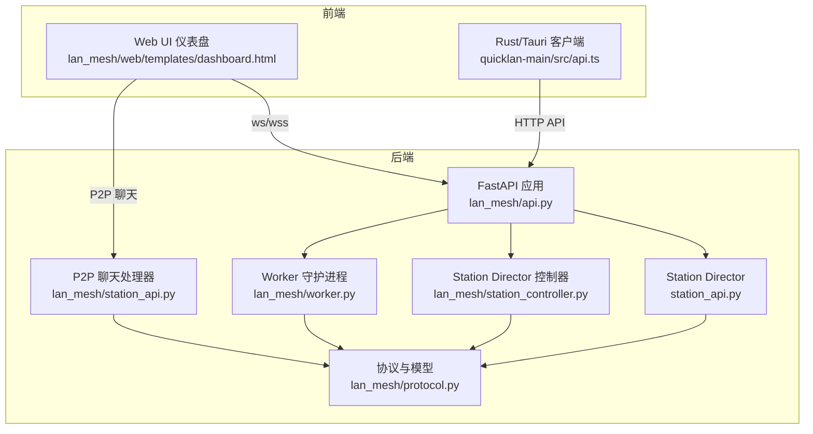
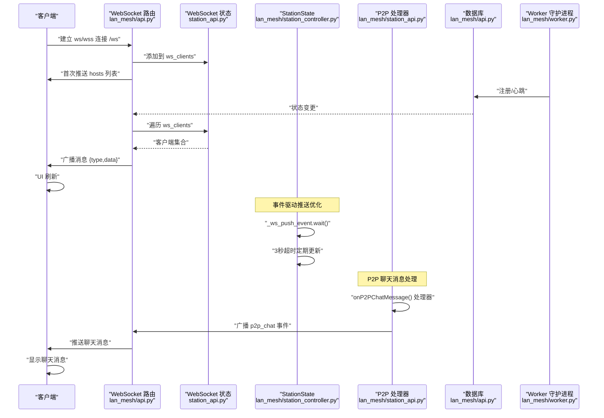
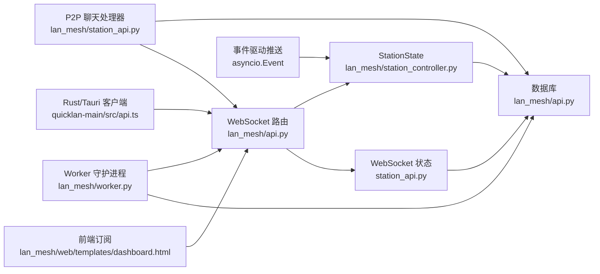
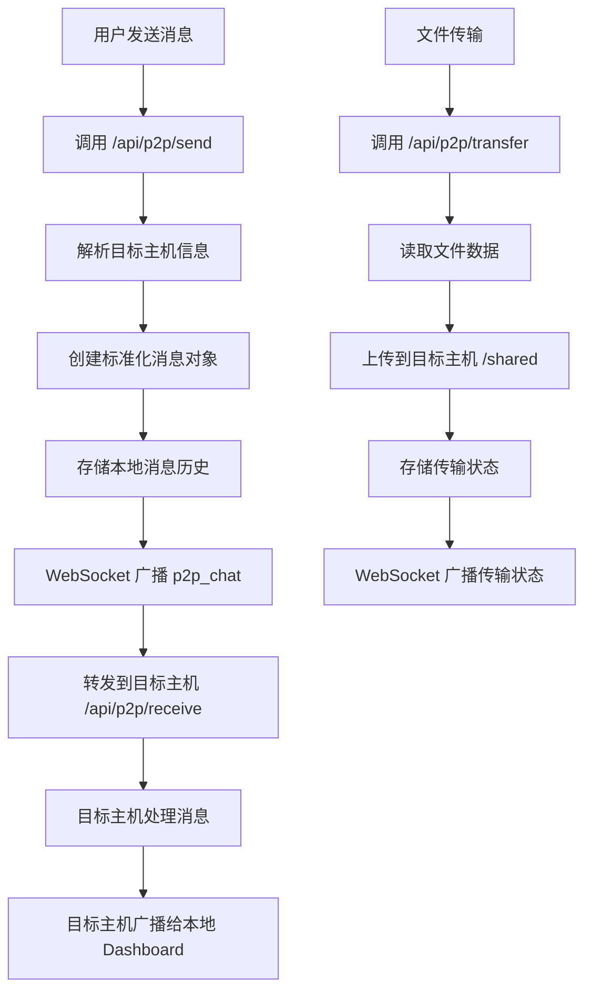

# WebSocket 实时通信

<cite>
**本文引用的文件**
- [main.py](file://main.py)
- [api.py](file://lan_mesh/api.py)
- [station_api.py](file://lan_mesh/station_api.py)
- [worker.py](file://lan_mesh/worker.py)
- [protocol.py](file://lan_mesh/protocol.py)
- [dashboard.html](file://lan_mesh/web/templates/dashboard.html)
- [protocol.rs](file://quicklan-main/src-tauri/src/protocol.rs)
- [api.ts](file://quicklan-main/src/api.ts)
- [station_api.py](file://lan_mesh/station_api.py)
- [station_controller.py](file://lan_mesh/station_controller.py)
</cite>

## 更新摘要
**变更内容**
- 新增 P2P 聊天消息实时推送功能，支持主机间即时通讯
- 实现 onP2PChatMessage() 处理器，处理 p2p_chat 类型事件广播
- 增强文件传输状态实时更新，支持上传进度和结果反馈
- 完善 P2P 消息存储和历史记录查询机制
- 扩展前端 UI 支持 P2P 聊天界面和文件传输功能

## 目录
1. [简介](#简介)
2. [项目结构](#项目结构)
3. [核心组件](#核心组件)
4. [架构总览](#架构总览)
5. [详细组件分析](#详细组件分析)
6. [依赖关系分析](#依赖关系分析)
7. [性能考量](#性能考量)
8. [故障排查指南](#故障排查指南)
9. [结论](#结论)
10. [附录](#附录)

## 简介
本文件系统性阐述本项目的 WebSocket 实时通信机制，包括：
- 实时推送的实现原理与架构设计
- 连接建立流程、消息格式规范与事件类型定义
- 客户端集成指南（JavaScript 与 Rust/Tauri）
- 状态同步机制与消息队列管理
- 错误处理策略与重连机制
- 性能优化建议与监控指标
- 安全考虑与连接限制等最佳实践
- **新增** P2P 聊天消息实时推送和文件传输功能

## 项目结构
本项目采用多语言混合架构：Python 后端提供 FastAPI 服务与 WebSocket；前端 Web UI 通过浏览器 WebSocket 订阅；Rust/Tauri 客户端通过 @tauri-apps/api 与后端交互。WebSocket 位于 Python 后端，负责向所有连接的客户端广播主机状态变更和 P2P 聊天消息。

图表来源
- [api.py](file://lan_mesh/api.py)
- [station_api.py](file://lan_mesh/station_api.py)
- [station_controller.py](file://lan_mesh/station_controller.py)
- [worker.py](file://lan_mesh/worker.py)
- [protocol.py](file://lan_mesh/protocol.py)
- [dashboard.html](file://lan_mesh/web/templates/dashboard.html)
- [api.ts](file://quicklan-main/src/api.ts)
- [station_api.py](file://lan_mesh/station_api.py)

章节来源
- [main.py](file://main.py)
- [api.py](file://lan_mesh/api.py)
- [station_api.py](file://lan_mesh/station_api.py)
- [worker.py](file://lan_mesh/worker.py)
- [protocol.py](file://lan_mesh/protocol.py)
- [dashboard.html](file://lan_mesh/web/templates/dashboard.html)
- [api.ts](file://quicklan-main/src/api.ts)
- [station_api.py](file://lan_mesh/station_api.py)
- [station_controller.py](file://lan_mesh/station_controller.py)

## 核心组件
- WebSocket 路由与广播器：在 FastAPI 中定义 /ws 路由，接受连接并向所有客户端广播状态变更和 P2P 聊天消息。
- Secretary 状态与后台推送：SecretaryController 维护 ws_clients 集合并通过事件驱动方式推送主机列表。
- Station Director 事件驱动推送：StationController 使用 asyncio.Event 实现事件驱动的实时推送，支持设备自动注册即时响应。
- Worker 心跳与注册：Worker 定期向 Master 发送心跳，触发广播。
- **新增** P2P 聊天处理器：处理主机间聊天消息的接收、存储和广播。
- **新增** 文件传输处理器：支持大文件传输和实时状态反馈。
- 前端订阅：Web UI 通过浏览器 WebSocket 订阅 /ws，接收实时状态更新和 P2P 聊天消息。
- Rust/Tauri 客户端：通过 @tauri-apps/api 调用后端 HTTP API，结合 WebSocket 实现实时联动。

章节来源
- [api.py](file://lan_mesh/api.py)
- [station_api.py](file://lan_mesh/station_api.py)
- [station_controller.py](file://lan_mesh/station_controller.py)
- [worker.py](file://lan_mesh/worker.py)
- [dashboard.html](file://lan_mesh/web/templates/dashboard.html)
- [api.ts](file://quicklan-main/src/api.ts)
- [station_api.py](file://lan_mesh/station_api.py)

## 架构总览
WebSocket 实时推送的整体流程如下：
- 客户端建立 WebSocket 连接到 /ws
- 服务器接受连接并将客户端加入 ws_clients
- 服务器首次推送当前主机列表
- 服务器通过事件驱动或周期性推送主机列表，或在特定事件（如心跳、注册、P2P 聊天）发生时广播
- 客户端收到消息后刷新 UI，包括 P2P 聊天消息的实时更新

图表来源
- [api.py](file://lan_mesh/api.py)
- [station_api.py](file://lan_mesh/station_api.py)
- [station_controller.py](file://lan_mesh/station_controller.py)
- [worker.py](file://lan_mesh/worker.py)
- [station_api.py](file://lan_mesh/station_api.py)

## 详细组件分析

### WebSocket 路由与消息格式
- 路由定义：/ws 使用 FastAPI WebSocket 路由，接受连接后将客户端加入集合，并首次推送 hosts 列表。
- 心跳保活：若客户端在超时时间内未发送消息，服务器发送 ping 类型消息以检测连接活性。
- 广播机制：broadcast_ws 将消息序列化为 JSON，遍历 ws_clients 并发送；异常客户端会被移除。

**更新** 新增 P2P 聊天消息格式支持：
- p2p_chat 类型：用于主机间聊天消息的实时推送
- 支持文本消息和文件传输消息
- 包含完整的消息元数据（发送方、接收方、时间戳等）

消息格式规范
- 通用字段
  - type: 字符串，事件类型标识
  - data: 对象或数组，承载具体数据
- hosts 类型
  - data: 主机记录数组，每项为 HostRecord.to_dict() 结果
- ping 类型
  - data: 通常为空，用于保活
- **新增** p2p_chat 类型
  - data: P2P 聊天消息对象，包含方向、类型、内容、时间戳、发送方和接收方信息
  - 支持 text 和 file 两种消息类型
  - 文件传输包含文件名、大小、状态等信息

事件类型定义
- hosts：推送当前所有主机状态列表
- heartbeat：Worker 心跳触发的实时状态更新
- host_registered：Worker 注册触发的新增主机通知
- agent_registered：Agent 注册通知
- task_submitted：任务提交通知
- project_created/project_updated/project_archived：项目管理相关通知
- pm_registered/pm_status_change：PM Agent 状态变更
- progress_report：进度报告
- chat_reply：秘书聊天回复
- skill_assigned/skill_revoked/skills_scanned：技能库管理通知
- secretary_activated/deactivated/assigned/revoked：Secretary 状态变更
- ping：服务器侧保活探测
- **新增** p2p_chat：P2P 聊天消息实时推送

章节来源
- [api.py](file://lan_mesh/api.py)
- [station_api.py](file://lan_mesh/station_api.py)

### Secretary 状态与后台推送
- SecretaryState 维护 ws_clients 集合，作为广播目标。
- SecretaryController._ws_push_loop 周期性拉取数据库中的主机列表并广播 hosts。
- broadcast_ws 在发送失败时收集异常客户端并清理集合，避免后续发送异常。

章节来源
- [station_api.py](file://lan_mesh/station_api.py)
- [api.py](file://lan_mesh/api.py)

### Station Director 事件驱动推送
**更新** Station Director 的 WebSocket 推送循环已优化为事件驱动方式，显著提升响应性能。

- StationState 维护 ws_clients 集合和 _ws_push_event 事件对象。
- StationController._ws_push_loop 使用 asyncio.Event 实现事件驱动推送，替代固定轮询。
- 设备自动注册时立即触发推送：当 UDP 发现新设备时，通过线程安全的方式设置事件，实现即时 UI 更新。
- 保持 3 秒超时机制：即使使用事件驱动，仍保留 3 秒超时用于定期状态同步。
- _broadcast 函数在发送失败时清理异常客户端，确保广播效率。

章节来源
- [station_controller.py](file://lan_mesh/station_controller.py)
- [station_api.py](file://lan_mesh/station_api.py)

### P2P 聊天消息处理器
**新增** 完整的 P2P 聊天消息处理系统：

- **消息发送处理器** (`/api/p2p/send`)：
  - 解析目标主机网络信息
  - 创建标准化的聊天消息对象
  - 存储本地消息历史
  - 通过 WebSocket 广播 p2p_chat 事件
  - 转发到目标主机的 `/api/p2p/receive` 端点

- **消息接收处理器** (`/api/p2p/receive`)：
  - 接收来自远程主机的消息
  - 创建入站消息对象
  - 存储本地消息历史
  - 通过 WebSocket 广播给本机 Dashboard

- **消息历史查询** (`/api/p2p/messages/{device_id}`)：
  - 获取与指定主机的完整聊天历史
  - 支持按设备 ID 过滤消息

- **文件传输处理器** (`/api/p2p/transfer`)：
  - 支持大文件传输到目标主机
  - 实时反馈传输状态（成功/失败）
  - 通过 WebSocket 广播文件传输状态

章节来源
- [station_api.py](file://lan_mesh/station_api.py)

### Worker 注册与心跳
- Worker 在发现 Master 后，向 Master 发送注册请求与 Agent Card 注册。
- Worker 定期发送心跳，携带 CPU/内存/磁盘使用率与共享文件数量等实时指标。
- Master 收到心跳后更新数据库并广播 heartbeat 事件。

章节来源
- [worker.py](file://lan_mesh/worker.py)
- [api.py](file://lan_mesh/api.py)

### 前端订阅与 UI 刷新
**更新** 前端 UI 现已支持 P2P 聊天功能：

- Web UI 仪表盘通过浏览器 WebSocket 订阅 /ws，连接成功后显示"已连接"，断开则显示"断开，重试中…"。
- 收到 hosts/heartbeat/host_registered 类型消息后，前端刷新主机列表与统计信息。
- **新增** onP2PChatMessage() 处理器：专门处理 p2p_chat 类型的 WebSocket 消息
- **新增** P2P 聊天界面：支持选择目标主机、发送文字消息、传输文件
- **新增** 消息历史记录：加载与特定主机的完整聊天历史
- **新增** 文件传输状态显示：实时显示上传进度和传输结果
- 前端还通过 HTTP API 获取主机列表，作为 WebSocket 的补充与降级。
- 支持 PM Agent 架构的新消息类型：chat_reply、pm_registered、pm_status_change、team_update、progress_report。

章节来源
- [dashboard.html](file://lan_mesh/web/templates/dashboard.html)
- [api.py](file://lan_mesh/api.py)

### Rust/Tauri 客户端集成
- Rust/Tauri 客户端通过 @tauri-apps/api 调用后端 HTTP API，实现设备发现、网络状态查询、传输管理等功能。
- WebSocket 可作为实时状态订阅通道，Rust 客户端可通过 @tauri-apps/api 的 WebSocket 封装或原生 WebSocket 连接 /ws。
- 建议在 Rust 客户端中实现指数退避重连与心跳保活逻辑。
- **新增** 支持 P2P 聊天功能的集成，可调用 `/api/p2p/*` 相关端点。

章节来源
- [api.ts](file://quicklan-main/src/api.ts)
- [protocol.rs](file://quicklan-main/src-tauri/src/protocol.rs)

### 状态同步机制与消息队列管理
- 状态来源：Worker 心跳与注册写入数据库；Secretary 周期性推送或事件触发广播；Station Director 事件驱动推送。
- **新增** P2P 消息存储：每个主机的聊天消息存储在 `state.p2p_messages` 字典中，按设备 ID 分组。
- 客户端状态：前端基于收到的消息更新本地状态并渲染 UI。
- 队列管理：WebSocket 侧未实现显式消息队列；异常客户端会被自动剔除，保证广播效率。
- 事件驱动优化：Station Director 使用 asyncio.Event 实现高效的事件驱动推送，减少不必要的轮询开销。

章节来源
- [api.py](file://lan_mesh/api.py)
- [station_api.py](file://lan_mesh/station_api.py)
- [station_controller.py](file://lan_mesh/station_controller.py)
- [worker.py](file://lan_mesh/worker.py)
- [station_api.py](file://lan_mesh/station_api.py)

### 错误处理策略与重连机制
- 连接断开：前端在 onclose 回调中延迟重连，3 秒一次。
- 保活：服务器在客户端超时未响应时发送 ping；客户端收到 ping 后继续维持连接。
- 异常清理：广播失败的客户端会被从集合中移除，避免阻塞后续广播。
- 线程安全：Station Director 使用 call_soon_threadsafe 确保从非异步线程安全地触发事件。
- **新增** P2P 消息错误处理：
  - 发送失败时生成系统消息并广播
  - 文件传输失败时记录错误信息
  - 目标主机不可达时的友好提示

章节来源
- [dashboard.html](file://lan_mesh/web/templates/dashboard.html)
- [api.py](file://lan_mesh/api.py)
- [station_controller.py](file://lan_mesh/station_controller.py)
- [station_api.py](file://lan_mesh/station_api.py)

## 依赖关系分析
WebSocket 实时通信涉及以下关键依赖：
- FastAPI WebSocket 路由与生命周期管理
- SecretaryState 与广播器
- StationDirector 事件驱动推送系统
- Worker 心跳与注册流程
- **新增** P2P 聊天消息处理器
- 前端 WebSocket 订阅与 UI 刷新
- Rust/Tauri 客户端通过 HTTP API 与 WebSocket 协同

图表来源
- [api.py](file://lan_mesh/api.py)
- [station_api.py](file://lan_mesh/station_api.py)
- [station_controller.py](file://lan_mesh/station_controller.py)
- [worker.py](file://lan_mesh/worker.py)
- [dashboard.html](file://lan_mesh/web/templates/dashboard.html)
- [api.ts](file://quicklan-main/src/api.ts)
- [station_api.py](file://lan_mesh/station_api.py)

## 性能考量
**更新** 事件驱动推送优化显著提升了系统性能，P2P 聊天功能进一步优化了用户体验。

- 广播频率：SecretaryController._ws_push_loop 每 3 秒推送一次 hosts，StationController 使用事件驱动方式，仅在设备注册或超时后推送。
- 客户端数量：广播器遍历 ws_clients，异常客户端会被清理；建议限制并发连接数并启用连接池。
- 心跳保活：服务器在 30 秒超时后发送 ping，避免僵尸连接占用资源。
- 前端渲染：前端在收到 hosts/heartbeat/host_registered 后刷新 UI，建议使用虚拟滚动与节流优化大列表渲染。
- 事件驱动优势：Station Director 的事件驱动推送减少了不必要的轮询开销，设备自动注册时可实现毫秒级响应。
- 内存优化：异常客户端及时清理，避免内存泄漏。
- **新增** P2P 消息性能优化：
  - 消息存储按设备 ID 分组，提高查询效率
  - 文件传输支持断点续传和大文件处理
  - WebSocket 广播仅推送必要的消息数据
  - 前端消息列表支持分页加载

## 故障排查指南
- WebSocket 无法连接
  - 检查后端是否正确挂载 /ws 路由
  - 确认前端协议（ws/wss）与后端一致
- 连接断开频繁
  - 检查网络稳定性与防火墙设置
  - 前端 onclose 回调中确认重连逻辑生效
- 无实时更新
  - 确认 Worker 是否成功注册并发送心跳
  - 检查 Secretary 是否正常周期性广播
  - 验证 Station Director 事件驱动推送是否正常工作
- **新增** P2P 聊天问题排查：
  - 确认目标主机可达且 API 端口开放
  - 检查 P2P 消息存储是否正常
  - 验证 WebSocket 广播是否成功
  - 查看文件传输日志和错误信息
- 性能问题
  - 减少广播频率或按需推送
  - 限制并发连接数并清理异常客户端
  - 监控 asyncio.Event 的使用情况，确保事件正确触发
  - **新增** 监控 P2P 消息队列长度和内存使用情况

章节来源
- [api.py](file://lan_mesh/api.py)
- [station_api.py](file://lan_mesh/station_api.py)
- [station_controller.py](file://lan_mesh/station_controller.py)
- [worker.py](file://lan_mesh/worker.py)
- [dashboard.html](file://lan_mesh/web/templates/dashboard.html)
- [station_api.py](file://lan_mesh/station_api.py)

## 结论
本项目的 WebSocket 实时通信以简洁高效为核心：通过 FastAPI WebSocket 路由与 Secretary 的周期性/事件驱动广播，以及 Station Director 的事件驱动推送优化，实现了对前端与 Rust/Tauri 客户端的低延迟状态同步。**新增的 P2P 聊天消息实时推送功能**进一步增强了系统的实时通信能力，支持主机间的即时文字聊天和文件传输。配合心跳保活与异常清理机制，整体具备良好的鲁棒性与可扩展性。事件驱动方式的引入显著提升了系统响应性能，特别是在设备自动注册场景下实现了即时 UI 更新。建议在生产环境中进一步引入连接数限制、消息去重与更细粒度的事件类型，以提升性能与用户体验。

## 附录

### 客户端集成指南

#### JavaScript 客户端
- 连接方式
  - 使用浏览器原生 WebSocket 连接 ws:// 或 wss:// 后端地址的 /ws
  - 建议在 onclose 回调中实现指数退避重连
- 消息处理
  - 监听 onmessage，解析 type 与 data
  - hosts/heartbeat/host_registered 类型触发 UI 刷新
  - **新增** p2p_chat 类型触发 onP2PChatMessage() 处理器
  - 支持 PM Agent 架构的新消息类型：chat_reply、pm_registered、pm_status_change、team_update、progress_report
- **新增** P2P 聊天功能集成
  - 调用 `/api/p2p/send` 发送文字消息
  - 调用 `/api/p2p/transfer` 传输文件
  - 调用 `/api/p2p/messages/{device_id}` 获取聊天历史
- 示例路径
  - 连接与重连逻辑参考：[dashboard.html](file://lan_mesh/web/templates/dashboard.html)

章节来源
- [dashboard.html](file://lan_mesh/web/templates/dashboard.html)

#### Rust/Tauri 客户端
- HTTP API 调用
  - 使用 @tauri-apps/api 调用后端 HTTP API，实现设备发现、网络状态查询、传输管理等
  - **新增** 支持 P2P 聊天相关 API 调用
  - 示例路径：[api.ts](file://quicklan-main/src/api.ts)
- WebSocket 订阅
  - 通过 @tauri-apps/api 的 WebSocket 封装或原生 WebSocket 订阅 /ws
  - 建议实现心跳保活与异常重连
- 协议与类型
  - 参考 Rust 端协议定义，了解设备信息、网络状态、传输事件等数据结构
  - **新增** P2P 聊天消息类型定义
  - 示例路径：[protocol.rs](file://quicklan-main/src-tauri/src/protocol.rs)

章节来源
- [api.ts](file://quicklan-main/src/api.ts)
- [protocol.rs](file://quicklan-main/src-tauri/src/protocol.rs)

### 消息格式与事件类型对照
- hosts
  - 用途：首次推送或周期性推送当前所有主机状态
  - 数据：主机记录数组
- heartbeat
  - 用途：Worker 心跳触发的实时状态更新
  - 数据：更新后的主机记录
- host_registered
  - 用途：Worker 注册触发的新主机通知
  - 数据：新注册主机记录
- agent_registered
  - 用途：Agent 注册通知
  - 数据：Agent 卡片信息
- task_submitted/task_updated
  - 用途：任务提交与状态更新通知
  - 数据：任务详细信息
- project_created/project_updated/project_archived
  - 用途：项目管理相关通知
  - 数据：项目信息或项目ID
- pm_registered/pm_status_change
  - 用途：PM Agent 状态变更通知
  - 数据：PM Agent 信息或状态变更详情
- progress_report
  - 用途：进度报告通知
  - 数据：进度报告信息
- chat_reply
  - 用途：秘书聊天回复
  - 数据：聊天回复内容
- skill_assigned/skill_revoked/skills_scanned
  - 用途：技能库管理通知
  - 数据：技能分配信息或扫描结果
- secretary_activated/deactivated/assigned/revoked
  - 用途：Secretary 状态变更通知
  - 数据：Secretary 配置信息
- ping
  - 用途：服务器侧保活探测
  - 数据：空对象
- **新增** p2p_chat
  - 用途：P2P 聊天消息实时推送
  - 数据：聊天消息对象，包含方向、类型、内容、时间戳、发送方和接收方信息
  - 支持 text 和 file 两种消息类型
  - 文件传输包含文件名、大小、状态、错误信息等

章节来源
- [api.py](file://lan_mesh/api.py)
- [station_api.py](file://lan_mesh/station_api.py)

### 事件驱动推送架构详解
**更新** Station Director 的事件驱动推送架构提供了更高的性能和响应性，同时集成了 P2P 聊天消息处理。

- asyncio.Event 机制：使用 asyncio.Event 对象实现高效的异步事件通知
- 线程安全触发：通过 loop.call_soon_threadsafe 确保从非异步线程安全地触发事件
- 双重保障：事件驱动 + 3秒超时，既保证即时响应又确保定期同步
- 自动注册优化：UDP 发现新设备时立即触发推送，无需等待下一个轮询周期
- 资源优化：减少不必要的数据库查询和网络传输
- **新增** P2P 消息处理集成：
  - P2P 聊天消息通过相同的 WebSocket 广播机制推送
  - 支持多线程安全的消息处理和广播
  - 与现有事件驱动架构无缝集成

章节来源
- [station_controller.py](file://lan_mesh/station_controller.py)
- [station_api.py](file://lan_mesh/station_api.py)

### P2P 聊天消息处理流程
**新增** 详细的 P2P 聊天消息处理流程说明：

图表来源
- [station_api.py](file://lan_mesh/station_api.py)

**章节来源**
- [station_api.py](file://lan_mesh/station_api.py)
- [dashboard.html](file://lan_mesh/web/templates/dashboard.html)
