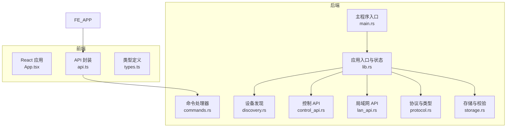
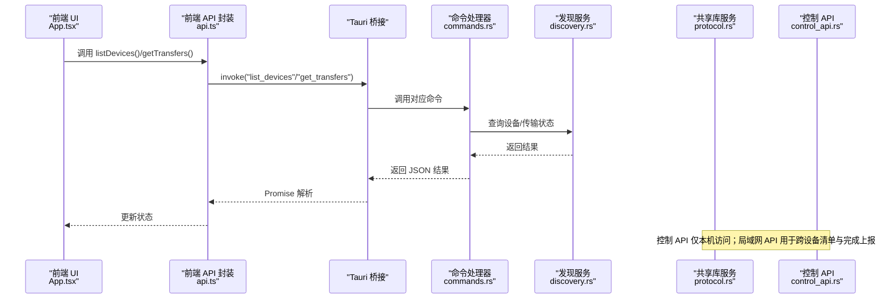
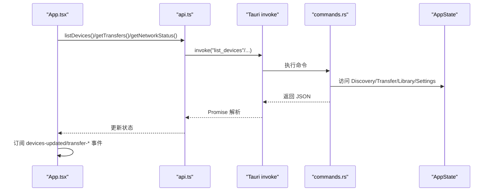
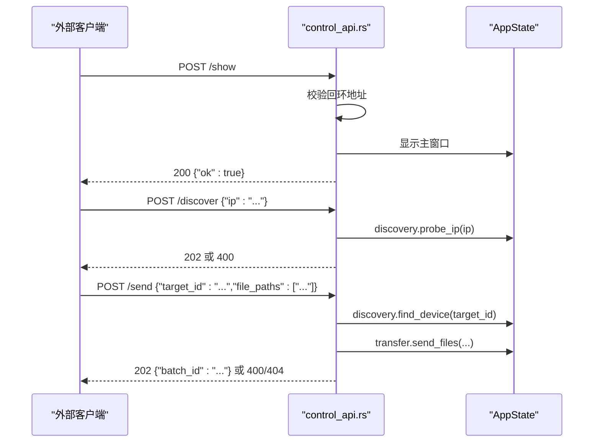
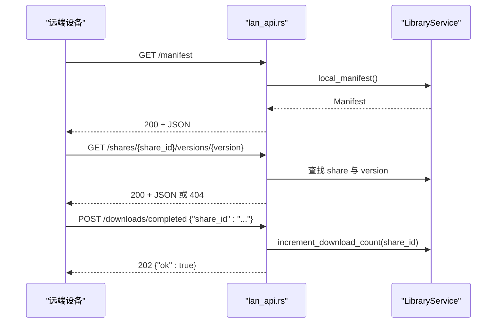
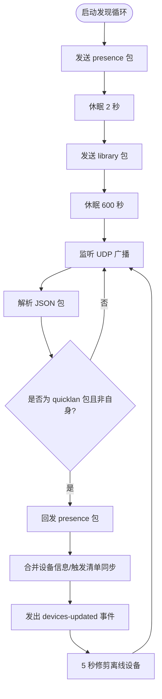
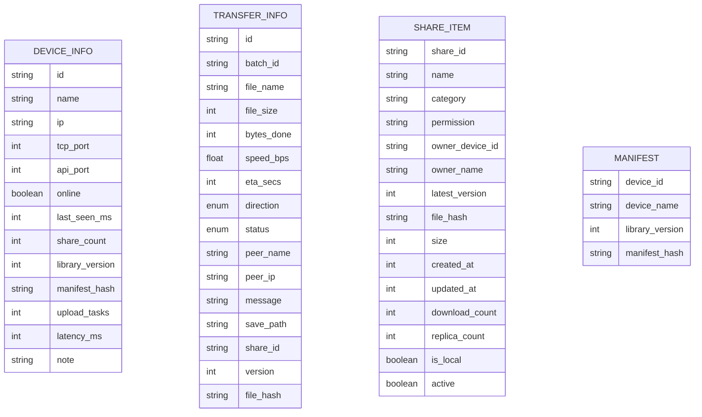
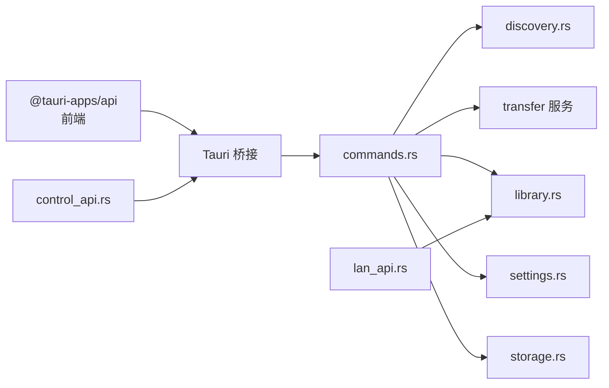

# API 集成

<cite>
**本文引用的文件**
- [api.ts](file://quicklan-main/src/api.ts)
- [types.ts](file://quicklan-main/src/types.ts)
- [App.tsx](file://quicklan-main/src/App.tsx)
- [lib.rs](file://quicklan-main/src-tauri/src/lib.rs)
- [main.rs](file://quicklan-main/src-tauri/src/main.rs)
- [commands.rs](file://quicklan-main/src-tauri/src/commands.rs)
- [control_api.rs](file://quicklan-main/src-tauri/src/control_api.rs)
- [lan_api.rs](file://quicklan-main/src-tauri/src/lan_api.rs)
- [protocol.rs](file://quicklan-main/src-tauri/src/protocol.rs)
- [discovery.rs](file://quicklan-main/src-tauri/src/discovery.rs)
- [storage.rs](file://quicklan-main/src-tauri/src/storage.rs)
- [Cargo.toml](file://quicklan-main/src-tauri/Cargo.toml)
- [package.json](file://quicklan-main/package.json)
</cite>

## 目录
1. [简介](#简介)
2. [项目结构](#项目结构)
3. [核心组件](#核心组件)
4. [架构总览](#架构总览)
5. [详细组件分析](#详细组件分析)
6. [依赖关系分析](#依赖关系分析)
7. [性能考量](#性能考量)
8. [故障排查指南](#故障排查指南)
9. [结论](#结论)
10. [附录](#附录)

## 简介
本文件面向 QuickLAN 的前端与后端 API 集成，系统性阐述以下内容：
- 前端通过 Tauri 桥接调用后端命令，实现设备发现、文件传输、共享资源管理、网络状态查询等能力
- 后端提供两类对外接口：控制 API（仅本机回环访问）与局域网 API（HTTP/1.1 文本协议）
- 数据交换格式以 JSON 为主，类型定义统一在 TypeScript 与 Rust 协议模块中声明
- 提供 API 调用封装、错误处理策略、认证与安全考虑、版本管理与兼容性建议，以及使用示例与最佳实践

## 项目结构
QuickLAN 采用前后端分离但通过 Tauri 桥接的架构：
- 前端（React + Vite）位于 quicklan-main/src，负责 UI 与用户交互
- 后端（Rust + Tauri）位于 quicklan-main/src-tauri，负责网络发现、传输调度、共享库与持久化
- 二者通过 Tauri 的 invoke 机制进行命令调用；同时后端还提供两个 TCP 服务：
  - 控制 API：仅监听 127.0.0.1，用于外部工具或脚本触发界面显示与健康检查
  - 局域网 API：基于 HTTP/1.1 文本协议，用于跨设备拉取清单与完成通知

**图表来源**
- [App.tsx:1-120](file://quicklan-main/src/App.tsx#L1-L120)
- [api.ts:1-130](file://quicklan-main/src/api.ts#L1-L130)
- [lib.rs:138-250](file://quicklan-main/src-tauri/src/lib.rs#L138-L250)
- [main.rs:1-6](file://quicklan-main/src-tauri/src/main.rs#L1-L6)
- [commands.rs:1-259](file://quicklan-main/src-tauri/src/commands.rs#L1-L259)
- [discovery.rs:1-384](file://quicklan-main/src-tauri/src/discovery.rs#L1-L384)
- [control_api.rs:1-147](file://quicklan-main/src-tauri/src/control_api.rs#L1-L147)
- [lan_api.rs:1-177](file://quicklan-main/src-tauri/src/lan_api.rs#L1-L177)
- [protocol.rs:1-230](file://quicklan-main/src-tauri/src/protocol.rs#L1-L230)
- [storage.rs:1-313](file://quicklan-main/src-tauri/src/storage.rs#L1-L313)

**章节来源**
- [lib.rs:138-250](file://quicklan-main/src-tauri/src/lib.rs#L138-L250)
- [main.rs:1-6](file://quicklan-main/src-tauri/src/main.rs#L1-L6)
- [package.json:1-32](file://quicklan-main/package.json#L1-L32)
- [Cargo.toml:1-33](file://quicklan-main/src-tauri/Cargo.toml#L1-L33)

## 核心组件
- 前端 API 封装层：在 api.ts 中导出一系列函数，每个函数对应一个后端命令名称，并携带参数与返回值类型
- 类型系统：types.ts 定义前端可见的数据模型；protocol.rs 定义后端网络协议与传输结构
- 命令处理器：commands.rs 将前端调用映射到具体业务逻辑（设备发现、传输、共享、设置等）
- 控制 API：control_api.rs 提供仅本机可访问的 HTTP 接口，用于健康检查、设备列表、网络状态、发起探测与发送文件
- 局域网 API：lan_api.rs 提供基于 HTTP/1.1 的文本协议，支持获取清单与下载完成上报
- 发现与传输：discovery.rs 负责 UDP 广播、设备发现、清单同步；storage.rs 负责共享内容复制与哈希校验

**章节来源**
- [api.ts:1-130](file://quicklan-main/src/api.ts#L1-L130)
- [types.ts:1-128](file://quicklan-main/src/types.ts#L1-L128)
- [commands.rs:1-259](file://quicklan-main/src-tauri/src/commands.rs#L1-L259)
- [control_api.rs:1-147](file://quicklan-main/src-tauri/src/control_api.rs#L1-L147)
- [lan_api.rs:1-177](file://quicklan-main/src-tauri/src/lan_api.rs#L1-L177)
- [protocol.rs:1-230](file://quicklan-main/src-tauri/src/protocol.rs#L1-L230)
- [discovery.rs:1-384](file://quicklan-main/src-tauri/src/discovery.rs#L1-L384)
- [storage.rs:1-313](file://quicklan-main/src-tauri/src/storage.rs#L1-L313)

## 架构总览
前端通过 Tauri invoke 调用后端命令，命令处理器根据当前应用状态执行业务逻辑，并通过事件向前端推送设备与传输状态变更。同时，后端启动控制 API 与局域网 API 服务，分别服务于本机控制与跨设备数据交换。

**图表来源**
- [App.tsx:144-200](file://quicklan-main/src/App.tsx#L144-L200)
- [api.ts:13-130](file://quicklan-main/src/api.ts#L13-L130)
- [commands.rs:11-259](file://quicklan-main/src-tauri/src/commands.rs#L11-L259)
- [discovery.rs:60-120](file://quicklan-main/src-tauri/src/discovery.rs#L60-L120)
- [control_api.rs:22-45](file://quicklan-main/src-tauri/src/control_api.rs#L22-L45)

**章节来源**
- [lib.rs:138-250](file://quicklan-main/src-tauri/src/lib.rs#L138-L250)
- [control_api.rs:22-147](file://quicklan-main/src-tauri/src/control_api.rs#L22-L147)
- [lan_api.rs:19-177](file://quicklan-main/src-tauri/src/lan_api.rs#L19-L177)

## 详细组件分析

### 前端 API 封装与调用流程
- api.ts 中的每个函数均以 invoke 调用后端命令，泛型约束返回类型，确保类型安全
- App.tsx 在挂载时批量拉取设备、传输、网络状态、设置、控制 API 信息与应用版本，随后订阅设备与传输事件，实时更新 UI
- 错误处理集中在 runAction 包装器中，统一捕获异常并展示提示

**图表来源**
- [App.tsx:144-200](file://quicklan-main/src/App.tsx#L144-L200)
- [api.ts:13-130](file://quicklan-main/src/api.ts#L13-L130)
- [commands.rs:11-259](file://quicklan-main/src-tauri/src/commands.rs#L11-L259)

**章节来源**
- [api.ts:1-130](file://quicklan-main/src/api.ts#L1-L130)
- [App.tsx:144-200](file://quicklan-main/src/App.tsx#L144-L200)

### 控制 API（仅本机回环）
- 绑定地址：127.0.0.1:45456
- 限制：仅接受来自回环地址的连接，拒绝非本机请求
- 支持端点：
  - GET /health：健康检查
  - GET /devices：列出设备
  - GET /network：网络状态
  - GET /transfers：传输列表
  - POST /discover：探测指定 IP
  - POST /send：向目标设备发送文件（需先通过 /devices 获取目标设备）
- 响应：JSON，含状态码与消息体

**图表来源**
- [control_api.rs:22-147](file://quicklan-main/src-tauri/src/control_api.rs#L22-L147)
- [commands.rs:26-46](file://quicklan-main/src-tauri/src/commands.rs#L26-L46)

**章节来源**
- [control_api.rs:1-147](file://quicklan-main/src-tauri/src/control_api.rs#L1-L147)
- [lib.rs:37-43](file://quicklan-main/src-tauri/src/lib.rs#L37-L43)

### 局域网 API（HTTP/1.1 文本协议）
- 端口：默认 45457，启动时尝试连续端口直至可用
- 支持端点：
  - GET /manifest：返回本地清单（包含设备信息与共享项）
  - GET /shares/{share_id}/versions/{version}：按 share_id 与版本号返回特定版本信息
  - POST /downloads/completed：上报下载完成（携带 share_id）
- 响应：HTTP/1.1 文本响应，Content-Type: application/json

**图表来源**
- [lan_api.rs:19-177](file://quicklan-main/src-tauri/src/lan_api.rs#L19-L177)
- [protocol.rs:214-230](file://quicklan-main/src-tauri/src/protocol.rs#L214-L230)

**章节来源**
- [lan_api.rs:1-177](file://quicklan-main/src-tauri/src/lan_api.rs#L1-L177)
- [protocol.rs:1-230](file://quicklan-main/src-tauri/src/protocol.rs#L1-L230)

### 设备发现与网络状态
- 发现协议：UDP 广播，周期性发送“presence”与“library”包
- 本地状态：维护设备表，定期修剪离线设备
- 网络状态：暴露 UDP/TCP/API 端口、本机 IPv4 列表与广播目标

**图表来源**
- [discovery.rs:60-276](file://quicklan-main/src-tauri/src/discovery.rs#L60-L276)

**章节来源**
- [discovery.rs:1-384](file://quicklan-main/src-tauri/src/discovery.rs#L1-L384)
- [protocol.rs:11-56](file://quicklan-main/src-tauri/src/protocol.rs#L11-L56)

### 数据模型与类型系统
- 前端类型：DeviceInfo、TransferInfo、ControlApiInfo、AppInfo、NetworkStatus、ShareItem、LibrarySettings 等
- 后端协议：DeviceInfo、TransferInfo、Manifest、ShareItem、LibrarySettings 等，用于网络传输与持久化

**图表来源**
- [types.ts:1-128](file://quicklan-main/src/types.ts#L1-L128)
- [protocol.rs:32-230](file://quicklan-main/src-tauri/src/protocol.rs#L32-L230)

**章节来源**
- [types.ts:1-128](file://quicklan-main/src/types.ts#L1-L128)
- [protocol.rs:1-230](file://quicklan-main/src-tauri/src/protocol.rs#L1-L230)

## 依赖关系分析
- 前端依赖 @tauri-apps/api 进行命令调用，依赖 lucide-react 提供图标，依赖 react 与 react-dom 构建 UI
- 后端依赖 tauri、tokio、serde、serde_json、uuid、rusqlite 等，构建网络服务与存储
- 前后端通过 Tauri 桥接解耦，命令注册集中于 lib.rs 的 invoke_handler

**图表来源**
- [package.json:15-31](file://quicklan-main/package.json#L15-L31)
- [Cargo.toml:19-33](file://quicklan-main/src-tauri/Cargo.toml#L19-L33)
- [lib.rs:218-246](file://quicklan-main/src-tauri/src/lib.rs#L218-L246)

**章节来源**
- [package.json:1-32](file://quicklan-main/package.json#L1-L32)
- [Cargo.toml:1-33](file://quicklan-main/src-tauri/Cargo.toml#L1-L33)
- [lib.rs:218-246](file://quicklan-main/src-tauri/src/lib.rs#L218-L246)

## 性能考量
- 端口选择：局域网 API 启动时尝试连续端口，避免冲突
- 异步运行时：Tokio 提供异步 I/O 与多线程运行时，提升并发处理能力
- 缓存与去重：共享存储采用文件哈希作为键，重复内容复用，减少磁盘占用
- 传输优化：分块大小固定，结合速率与 ETA 计算，提升用户体验
- 事件驱动：设备与传输状态通过事件推送，避免轮询带来的开销

**章节来源**
- [lan_api.rs:19-51](file://quicklan-main/src-tauri/src/lan_api.rs#L19-L51)
- [storage.rs:129-203](file://quicklan-main/src-tauri/src/storage.rs#L129-L203)
- [protocol.rs:9-9](file://quicklan-main/src-tauri/src/protocol.rs#L9-L9)

## 故障排查指南
- 控制 API 仅本机访问：若从非 127.0.0.1 访问被拒绝，确认客户端为本机或调整安全策略
- 健康检查失败：使用 GET /health 确认服务已启动；若 503，检查应用状态初始化
- 设备未上线：确认 UDP 广播可达、端口未被防火墙阻断；使用 POST /discover 对目标 IP 进行探测
- 发送文件失败：检查目标设备是否在线、TCP 端口连通性；查看命令返回的错误信息
- 局域网 API 访问：确保目标设备已启动局域网 API 且端口开放；GET /manifest 与 /shares/{id}/versions/{ver} 返回 404 表示资源不存在
- 下载完成上报：POST /downloads/completed 成功返回 202，失败不影响传输流程

**章节来源**
- [control_api.rs:38-44](file://quicklan-main/src-tauri/src/control_api.rs#L38-L44)
- [control_api.rs:82-122](file://quicklan-main/src-tauri/src/control_api.rs#L82-L122)
- [lan_api.rs:77-114](file://quicklan-main/src-tauri/src/lan_api.rs#L77-L114)

## 结论
QuickLAN 通过清晰的前后端职责划分与 Tauri 桥接，实现了稳定高效的局域网文件共享与传输能力。控制 API 与局域网 API 分别满足本机控制与跨设备数据交换需求，配合完善的类型系统与事件驱动机制，既保证了易用性也兼顾了扩展性。建议在生产环境中强化网络安全策略（如仅允许受信用户访问控制 API），并持续关注协议演进与版本兼容性。

## 附录

### API 端点一览与参数规范
- 控制 API（127.0.0.1:45456）
  - GET /health：健康检查
  - GET /devices：返回设备列表
  - GET /network：返回网络状态（UDP/TCP/API 端口、本机 IP、广播目标）
  - GET /transfers：返回传输列表
  - POST /discover {"ip":"..."}：探测指定 IP
  - POST /send {"target_id":"...","file_paths":["..."]}：向目标设备发送文件
- 局域网 API（HTTP/1.1）
  - GET /manifest：返回本地清单
  - GET /shares/{share_id}/versions/{version}：返回指定版本信息
  - POST /downloads/completed {"share_id":"..."}：上报下载完成

**章节来源**
- [control_api.rs:82-122](file://quicklan-main/src-tauri/src/control_api.rs#L82-L122)
- [lan_api.rs:77-114](file://quicklan-main/src-tauri/src/lan_api.rs#L77-L114)

### 前端 API 函数与类型
- 设备与网络：listDevices、getNetworkStatus、discoverIp
- 传输：getTransfers、getTransfer、acceptTransfer、rejectTransfer、removeTransferRecord、clearFinishedTransfers
- 应用与设置：getAppInfo、getControlApiInfo、getSettings、updateNickname、getLibrarySettings、updateLibrarySettings
- 路径与打开：chooseDownloadDir、chooseSharePaths、chooseFolderPath、openPathLocation
- 共享：listSharedResources、listMyShares、addSharePaths、updateShare、removeShare、downloadShare

**章节来源**
- [api.ts:13-130](file://quicklan-main/src/api.ts#L13-L130)
- [types.ts:1-128](file://quicklan-main/src/types.ts#L1-L128)

### 认证机制与安全考虑
- 控制 API 仅接受回环地址连接，降低外部攻击面
- 局域网 API 未内置认证，建议仅在受信局域网内使用
- 建议在部署层面限制访问源、启用防火墙规则，并对敏感操作（如发送文件）增加二次确认

**章节来源**
- [control_api.rs:38-44](file://quicklan-main/src-tauri/src/control_api.rs#L38-L44)

### 版本管理与向后兼容
- 版本号来源于 Cargo 与 package.json 的 version 字段，建议遵循语义化版本
- 协议字段（如 DiscoveryPacket.version）用于区分协议版本，便于未来升级
- 建议在新增字段时保持向后兼容，或通过版本路径（如 /shares/{id}/versions/{ver}）提供多版本支持

**章节来源**
- [Cargo.toml:3-3](file://quicklan-main/src-tauri/Cargo.toml#L3-L3)
- [package.json:3-3](file://quicklan-main/package.json#L3-L3)
- [protocol.rs:26-30](file://quicklan-main/src-tauri/src/protocol.rs#L26-L30)

### 使用示例与最佳实践
- 使用示例
  - 刷新设备与传输：在应用启动时并行调用 listDevices、getTransfers、getNetworkStatus、getSettings、getLibrarySettings、getControlApiInfo、getAppInfo
  - 快速发送文件：先选择目标设备与文件路径，再调用 sendFiles
  - 下载共享资源：根据权限类型决定是否需要密码，然后调用 downloadShare
- 最佳实践
  - 统一使用 runAction 包装器进行错误处理与忙碌态管理
  - 对大文件传输监控进度事件，及时清理已完成记录
  - 定期清理过期设备与传输记录，保持状态整洁

**章节来源**
- [App.tsx:180-200](file://quicklan-main/src/App.tsx#L180-L200)
- [App.tsx:337-344](file://quicklan-main/src/App.tsx#L337-L344)
- [App.tsx:247-250](file://quicklan-main/src/App.tsx#L247-L250)