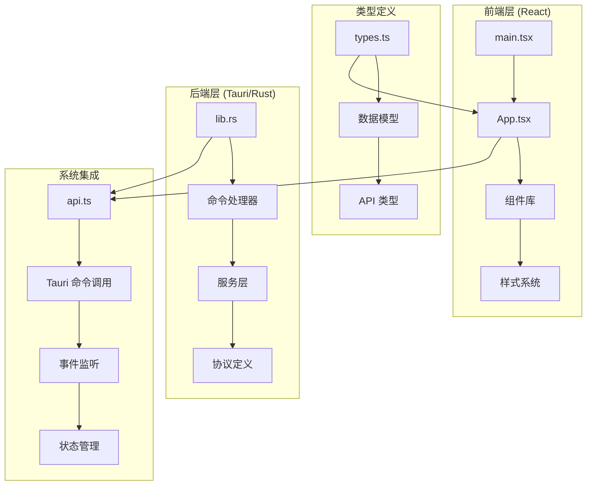
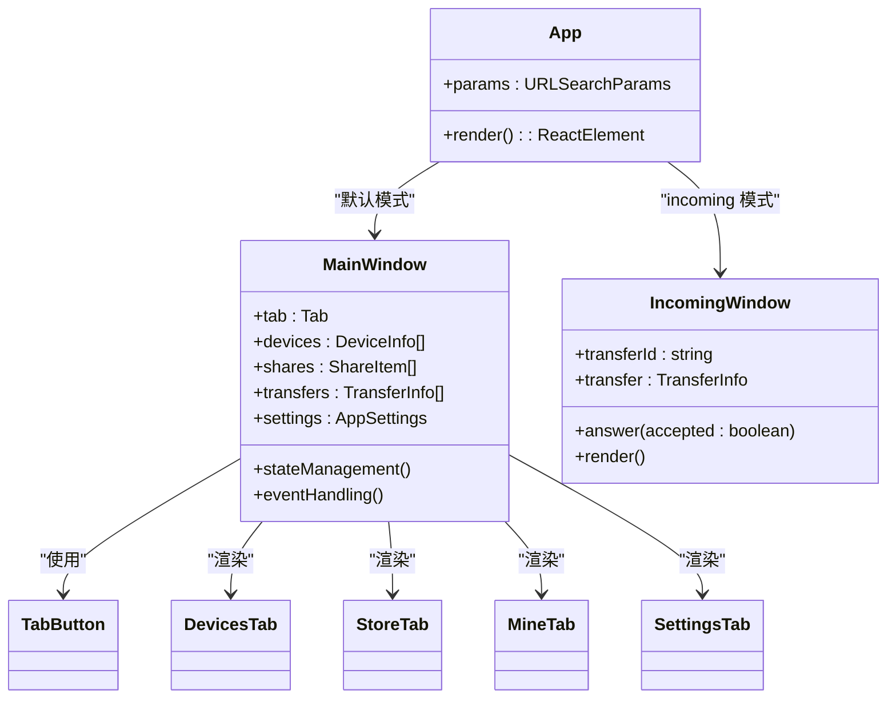
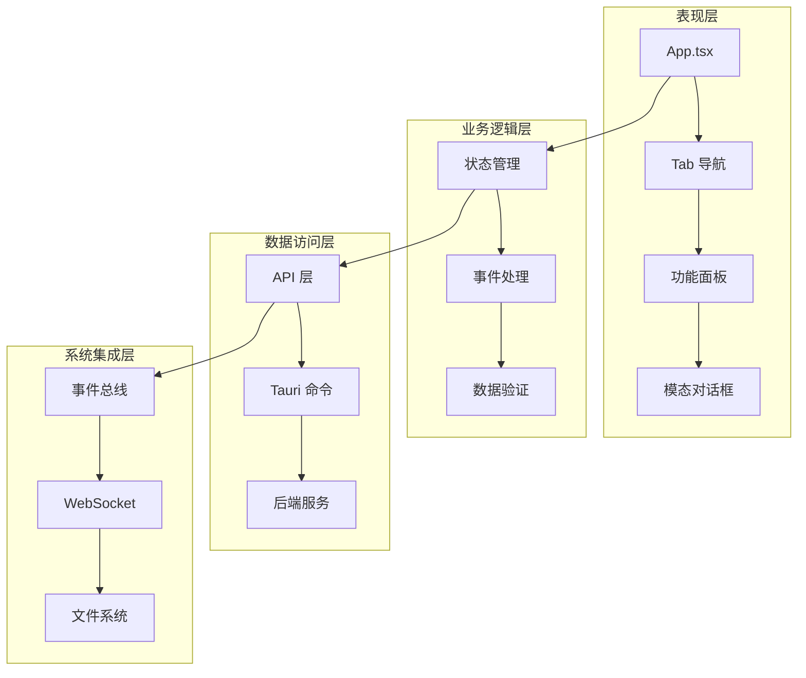
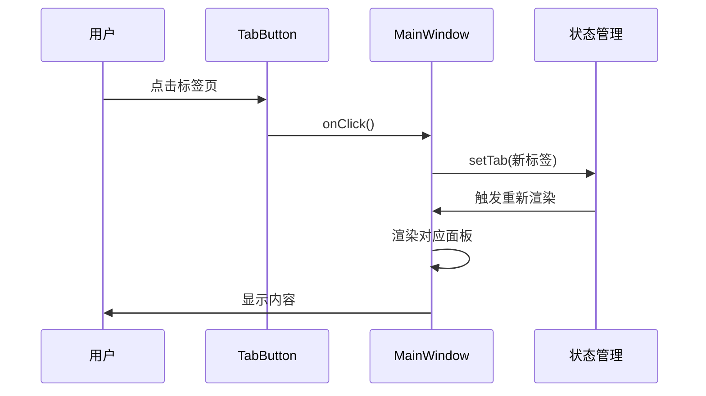
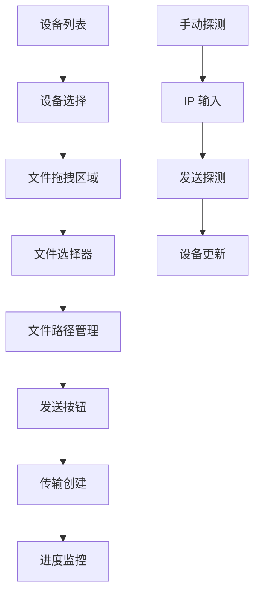
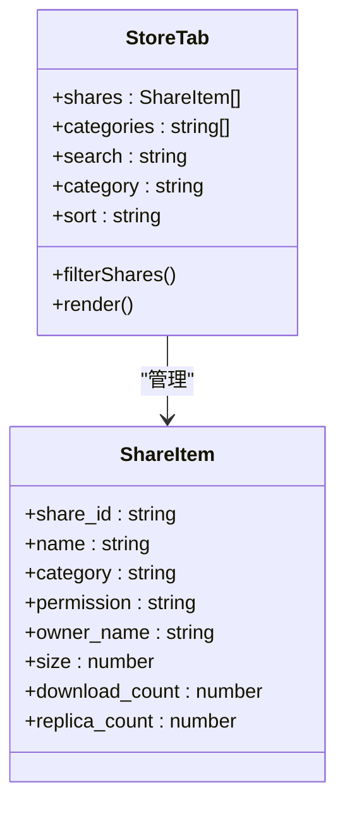
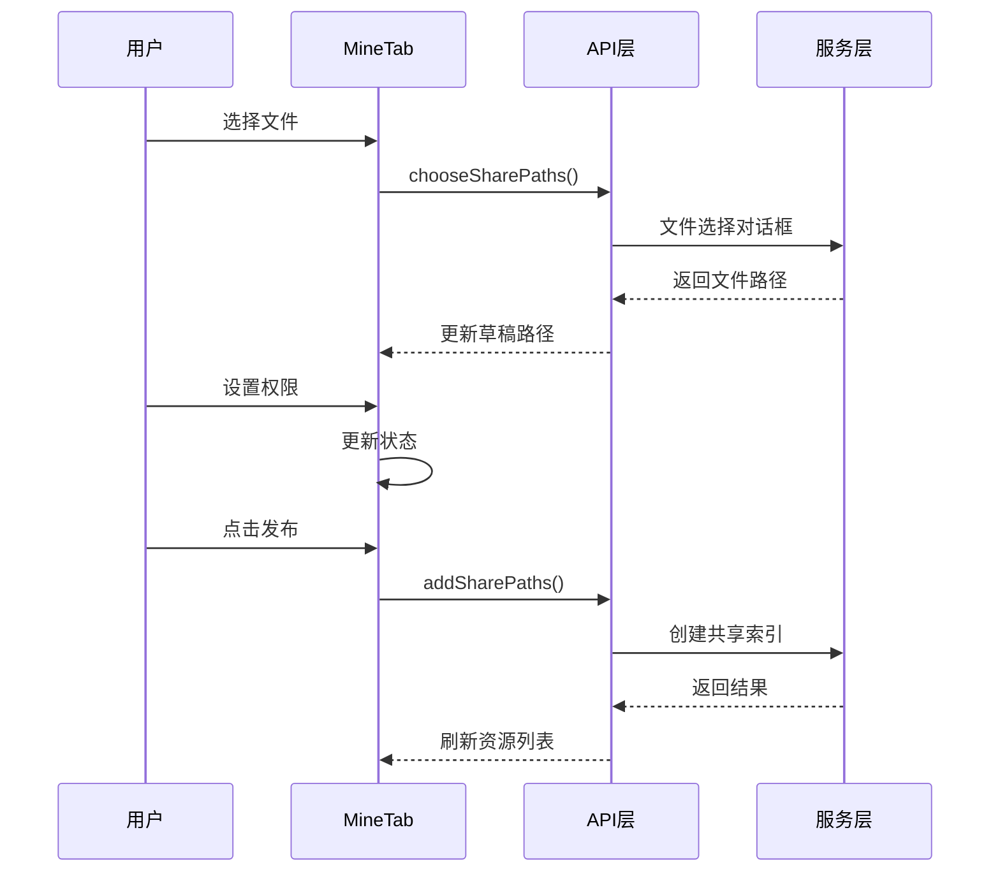
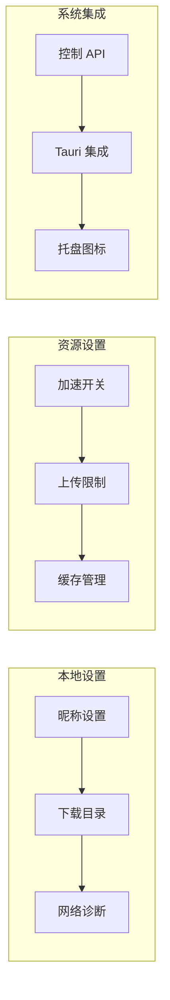
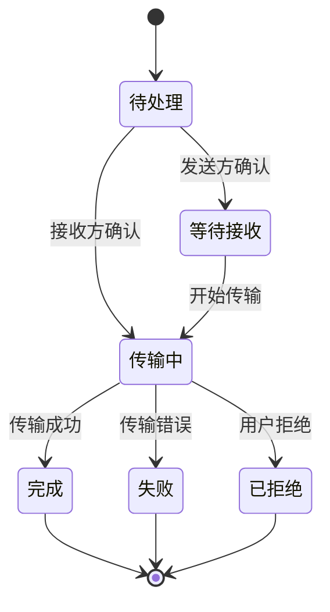
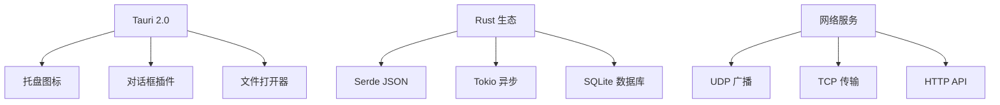

# React 组件架构

<cite>
**本文档引用的文件**
- [App.tsx](file://quicklan-main/src/App.tsx)
- [main.tsx](file://quicklan-main/src/main.tsx)
- [types.ts](file://quicklan-main/src/types.ts)
- [api.ts](file://quicklan-main/src/api.ts)
- [styles.css](file://quicklan-main/src/styles.css)
- [package.json](file://quicklan-main/package.json)
- [vite.config.ts](file://quicklan-main/vite.config.ts)
- [lib.rs](file://quicklan-main/src-tauri/src/lib.rs)
- [commands.rs](file://quicklan-main/src-tauri/src/commands.rs)
- [protocol.rs](file://quicklan-main/src-tauri/src/protocol.rs)
- [Cargo.toml](file://quicklan-main/src-tauri/Cargo.toml)
</cite>

## 目录
1. [简介](#简介)
2. [项目结构](#项目结构)
3. [核心组件](#核心组件)
4. [架构概览](#架构概览)
5. [详细组件分析](#详细组件分析)
6. [依赖关系分析](#依赖关系分析)
7. [性能考虑](#性能考虑)
8. [故障排除指南](#故障排除指南)
9. [结论](#结论)

## 简介

QuickLAN 是一个基于 React 和 Tauri 的局域网分布式文件共享与传输应用程序。该应用提供了去中心化的 P2P 文件传输能力，支持设备发现、资源共享、实时传输监控等功能。应用采用双窗口模式设计，包括主界面和专门的文件接收窗口。

## 项目结构

QuickLAN 采用前后端分离的架构设计，前端使用 React + TypeScript 构建用户界面，后端使用 Rust + Tauri 提供系统级功能和跨平台支持。



**图表来源**
- [main.tsx:1-11](file://quicklan-main/src/main.tsx#L1-L11)
- [App.tsx:1-85](file://quicklan-main/src/App.tsx#L1-L85)
- [lib.rs:138-250](file://quicklan-main/src-tauri/src/lib.rs#L138-L250)

**章节来源**
- [package.json:1-32](file://quicklan-main/package.json#L1-L32)
- [vite.config.ts:1-15](file://quicklan-main/vite.config.ts#L1-L15)

## 核心组件

### 主应用组件结构

应用采用单一入口点设计，通过 URL 参数决定显示模式：



**图表来源**
- [App.tsx:78-84](file://quicklan-main/src/App.tsx#L78-L84)
- [App.tsx:86-554](file://quicklan-main/src/App.tsx#L86-L554)
- [App.tsx:1076-1122](file://quicklan-main/src/App.tsx#L1076-L1122)

### 状态管理模式

应用采用 React Hooks 实现状态管理，包括：

- **本地状态管理**: 使用 useState 管理组件内部状态
- **计算状态**: 使用 useMemo 优化复杂计算
- **副作用处理**: 使用 useEffect 处理异步操作和事件监听
- **全局状态**: 通过 Tauri 命令与后端同步状态

**章节来源**
- [App.tsx:86-246](file://quicklan-main/src/App.tsx#L86-L246)

## 架构概览

QuickLAN 采用分层架构设计，实现了清晰的职责分离：



**图表来源**
- [App.tsx:144-178](file://quicklan-main/src/App.tsx#L144-L178)
- [api.ts:1-130](file://quicklan-main/src/api.ts#L1-L130)
- [lib.rs:218-246](file://quicklan-main/src-tauri/src/lib.rs#L218-L246)

## 详细组件分析

### Tab 导航系统

Tab 导航系统是应用的核心交互模式，支持四种主要视图：



**图表来源**
- [App.tsx:272-293](file://quicklan-main/src/App.tsx#L272-L293)
- [App.tsx:556-573](file://quicklan-main/src/App.tsx#L556-L573)

#### 标签页配置

| 标签页 | 值 | 图标 | 功能 |
|--------|-----|------|------|
| 设备 | devices | 🖥️ | 在线设备管理和文件快传 |
| 共享广场 | store | 📚 | 共享资源浏览和下载 |
| 我的共享 | mine | 🔗 | 资源发布和管理 |
| 设置 | settings | ⚙️ | 应用配置和网络诊断 |

**章节来源**
- [App.tsx:71](file://quicklan-main/src/App.tsx#L71)

### 设备管理面板 (DevicesTab)

设备管理面板提供完整的设备发现和文件传输功能：



**图表来源**
- [App.tsx:575-665](file://quicklan-main/src/App.tsx#L575-L665)

#### 关键特性

- **设备发现**: 自动扫描局域网设备
- **文件快传**: 支持多文件拖拽和批量选择
- **手动探测**: 支持指定 IP 地址探测
- **设备备注**: 本地设备标记功能

**章节来源**
- [App.tsx:591-665](file://quicklan-main/src/App.tsx#L591-L665)

### 共享资源面板 (StoreTab)

共享资源面板实现去中心化的资源发现和管理：



**图表来源**
- [App.tsx:667-717](file://quicklan-main/src/App.tsx#L667-L717)
- [types.ts:75-91](file://quicklan-main/src/types.ts#L75-L91)

#### 搜索和过滤功能

- **全文搜索**: 支持文件名、所有者、哈希值搜索
- **分类筛选**: 按文档、图片、视频、软件等分类
- **排序选项**: 支持按更新时间、下载次数、文件大小排序

**章节来源**
- [App.tsx:120-142](file://quicklan-main/src/App.tsx#L120-L142)

### 我的共享面板 (MineTab)

我的共享面板提供资源发布和版本管理功能：



**图表来源**
- [App.tsx:719-816](file://quicklan-main/src/App.tsx#L719-L816)

#### 发布流程

1. **文件选择**: 支持单个文件和文件夹
2. **权限设置**: 公开共享或密码保护
3. **版本管理**: 支持资源更新和撤销
4. **状态跟踪**: 实时显示发布进度

**章节来源**
- [App.tsx:736-816](file://quicklan-main/src/App.tsx#L736-L816)

### 设置面板 (SettingsTab)

设置面板提供全面的应用配置选项：



**图表来源**
- [App.tsx:818-918](file://quicklan-main/src/App.tsx#L818-L918)

#### 核心配置项

- **应用信息**: 版本号和设备标识
- **网络配置**: 端口绑定和本地 IP
- **传输设置**: 上传速度限制和并发数
- **缓存策略**: 存储空间管理和清理规则

**章节来源**
- [App.tsx:831-918](file://quicklan-main/src/App.tsx#L831-L918)

### 传输监控面板

传输监控面板提供实时的传输状态跟踪：



**图表来源**
- [App.tsx:979-1062](file://quicklan-main/src/App.tsx#L979-L1062)

#### 状态管理

- **实时更新**: 通过事件驱动的状态更新
- **进度跟踪**: 百分比、速度、剩余时间
- **历史记录**: 支持清理已完成的传输记录
- **文件操作**: 支持打开下载文件位置

**章节来源**
- [App.tsx:991-1062](file://quicklan-main/src/App.tsx#L991-L1062)

## 依赖关系分析

### 前端依赖关系

```mermaid
graph TD
A[React 18.3.1] --> B[Lucide React 图标]
A --> C[TypeScript 类型]
D[@tauri-apps/api] --> E[系统集成]
F[开发工具] --> G[Vite 构建]
F --> H[TypeScript 检查]
I[样式系统] --> J[CSS Modules]
I --> K[响应式设计]
L[事件处理] --> M[WebSocket 事件]
L --> N[文件系统事件]
```

**图表来源**
- [package.json:15-31](file://quicklan-main/package.json#L15-L31)

### 后端依赖关系

后端使用 Rust + Tauri 提供系统级功能：



**图表来源**
- [Cargo.toml:19-33](file://quicklan-main/src-tauri/Cargo.toml#L19-L33)

**章节来源**
- [lib.rs:138-250](file://quicklan-main/src-tauri/src/lib.rs#L138-L250)

## 性能考虑

### 状态优化策略

1. **计算状态缓存**: 使用 useMemo 避免重复计算
2. **事件监听管理**: 正确清理事件订阅避免内存泄漏
3. **批量更新**: 使用 Promise.all 并行获取多个数据源
4. **虚拟滚动**: 对于大量数据使用虚拟化技术

### 网络优化

- **去中心化索引**: 减少中央服务器负载
- **智能路由**: 基于延迟和带宽选择最优传输路径
- **断点续传**: 支持大文件的可靠传输
- **压缩传输**: 对文本文件进行压缩减少带宽占用

### 内存管理

- **状态清理**: 及时清理已完成的传输记录
- **文件句柄**: 合理管理文件系统访问权限
- **事件队列**: 控制事件处理的频率和数量

## 故障排除指南

### 常见问题及解决方案

#### 设备无法发现

1. **检查防火墙设置**: 确保 UDP 45454 端口开放
2. **网络隔离**: 验证设备在同一子网内
3. **路由器设置**: 检查是否启用了 ARP 广播

#### 传输失败

1. **磁盘空间**: 确保有足够存储空间
2. **权限问题**: 检查文件访问权限
3. **网络中断**: 重试连接或调整超时设置

#### 性能问题

1. **CPU 占用**: 降低并发传输任务数量
2. **内存泄漏**: 检查事件监听器是否正确清理
3. **磁盘 I/O**: 优化文件写入策略

**章节来源**
- [commands.rs:116-187](file://quicklan-main/src-tauri/src/commands.rs#L116-L187)

### 调试工具

- **开发者工具**: 使用浏览器开发者工具调试
- **日志系统**: 后端提供详细的日志输出
- **状态监控**: 实时查看应用状态变化
- **网络诊断**: 检查网络连接和端口状态

## 结论

QuickLAN 的 React 组件架构展现了现代前端应用的最佳实践：

1. **清晰的分层设计**: 表现层、业务逻辑层、数据访问层职责明确
2. **组件化思维**: 功能模块高度解耦，便于维护和扩展
3. **状态管理**: 合理的状态管理模式确保数据一致性
4. **用户体验**: 响应式设计和流畅的交互体验
5. **系统集成**: 优秀的 Tauri 集成提供了强大的系统级功能

该架构为类似的分布式应用开发提供了良好的参考模板，特别是在去中心化和 P2P 传输场景下的实现思路。