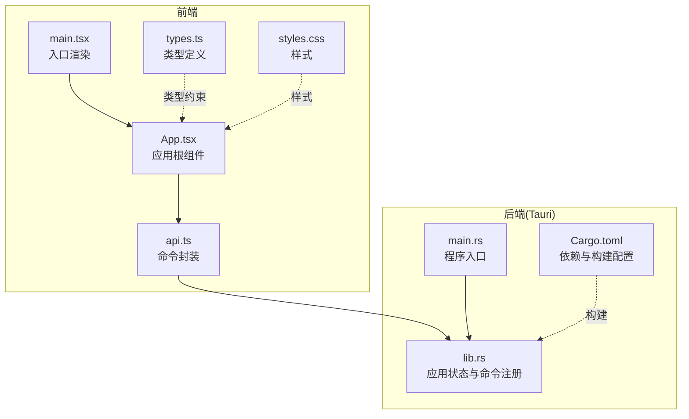
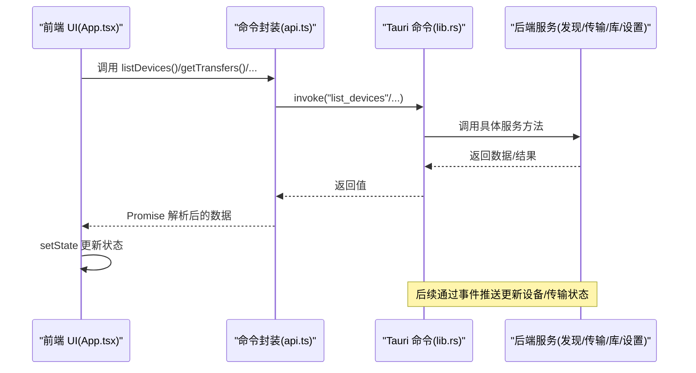
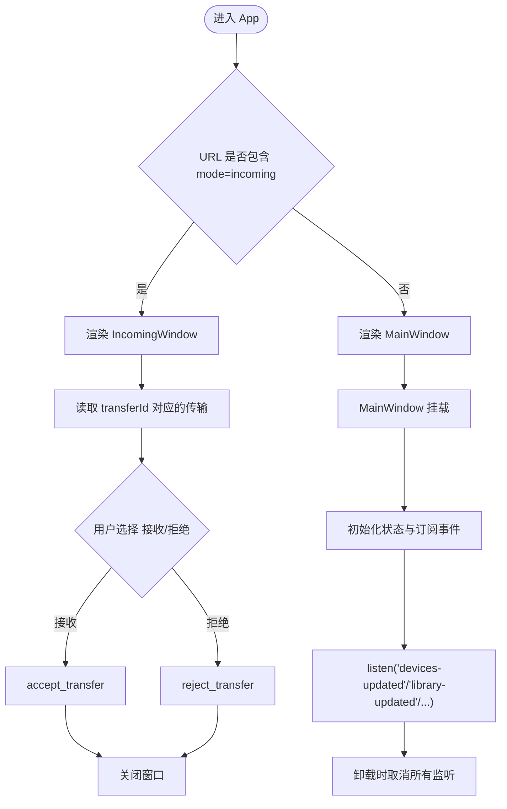
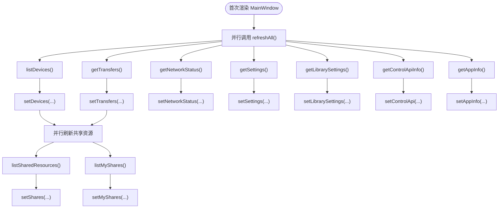
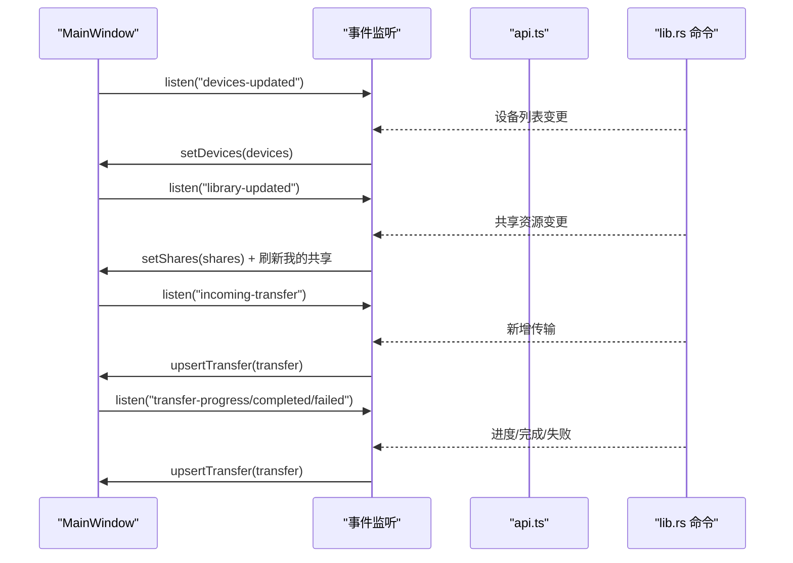
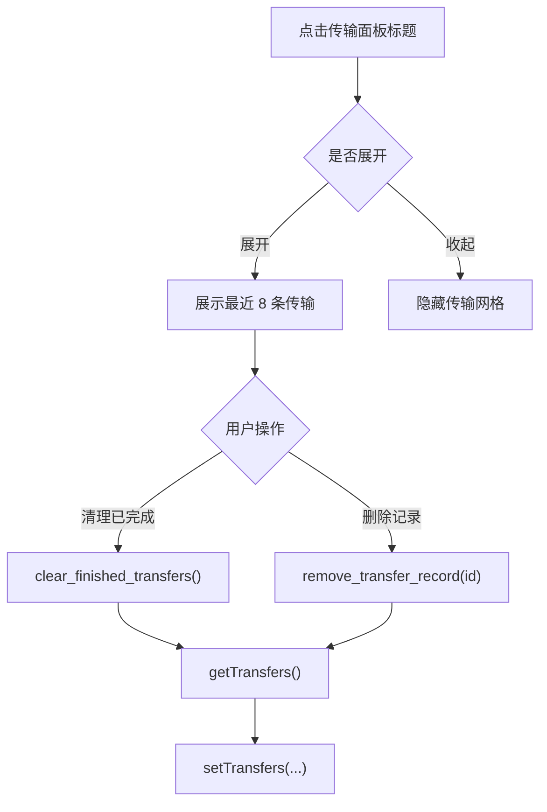
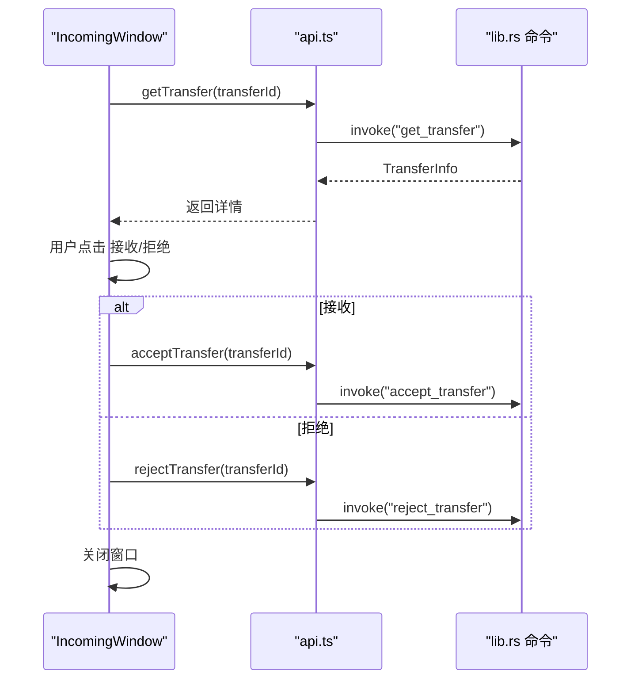
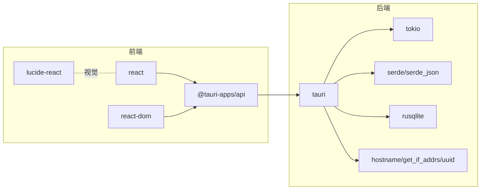

# 主应用组件

<cite>
**本文引用的文件**
- [App.tsx](file://quicklan-main/src/App.tsx)
- [main.tsx](file://quicklan-main/src/main.tsx)
- [types.ts](file://quicklan-main/src/types.ts)
- [api.ts](file://quicklan-main/src/api.ts)
- [styles.css](file://quicklan-main/src/styles.css)
- [lib.rs](file://quicklan-main/src-tauri/src/lib.rs)
- [Cargo.toml](file://quicklan-main/src-tauri/Cargo.toml)
- [main.rs](file://quicklan-main/src-tauri/src/main.rs)
- [package.json](file://quicklan-main/package.json)
</cite>

## 目录
1. [简介](#简介)
2. [项目结构](#项目结构)
3. [核心组件](#核心组件)
4. [架构总览](#架构总览)
5. [组件详细分析](#组件详细分析)
6. [依赖关系分析](#依赖关系分析)
7. [性能考量](#性能考量)
8. [故障排查指南](#故障排查指南)
9. [结论](#结论)
10. [附录](#附录)

## 简介
本文件面向 QuickLAN 主应用组件，聚焦于前端 React 应用与 Tauri 后端的协作方式，系统性阐述以下主题：
- App 组件的整体架构与窗口模式切换逻辑（MainWindow 与 IncomingWindow）
- 主组件的状态管理（设备列表、共享资源、传输状态、设置信息等）及其初始化与更新机制
- 事件监听系统（WebSocket 事件）在前端的订阅与处理流程
- 生命周期管理最佳实践与错误处理策略

## 项目结构
QuickLAN 采用前端 React + Tauri 的桌面应用架构。前端通过 @tauri-apps/api 调用后端命令，后端通过 Rust 实现设备发现、传输、库管理、设置与控制 API，并通过 Tauri 注册命令供前端调用。

**图表来源**
- [main.tsx:1-11](file://quicklan-main/src/main.tsx#L1-L11)
- [App.tsx:1-84](file://quicklan-main/src/App.tsx#L1-L84)
- [api.ts:1-130](file://quicklan-main/src/api.ts#L1-L130)
- [types.ts:1-128](file://quicklan-main/src/types.ts#L1-L128)
- [styles.css:1-682](file://quicklan-main/src/styles.css#L1-L682)
- [lib.rs:138-249](file://quicklan-main/src-tauri/src/lib.rs#L138-L249)
- [main.rs:1-6](file://quicklan-main/src-tauri/src/main.rs#L1-L6)
- [Cargo.toml:1-33](file://quicklan-main/src-tauri/Cargo.toml#L1-L33)

**章节来源**
- [main.tsx:1-11](file://quicklan-main/src/main.tsx#L1-L11)
- [package.json:1-32](file://quicklan-main/package.json#L1-L32)

## 核心组件
- 应用根组件：负责根据 URL 参数决定渲染 MainWindow 或 IncomingWindow，并统一管理全局状态与事件监听。
- 子组件：DevicesTab、StoreTab、MineTab、SettingsTab、TransfersPanel、IncomingWindow 等，分别承载设备管理、共享资源浏览、个人共享、设置与传输面板等功能。
- 命令层：api.ts 封装所有 @tauri-apps/api.invoke 调用，对应后端 lib.rs 中注册的命令。
- 类型系统：types.ts 定义设备、传输、共享、设置等数据模型，确保前后端一致的数据契约。
- 样式层：styles.css 提供响应式布局与交互态样式，保证跨屏体验。

**章节来源**
- [App.tsx:78-84](file://quicklan-main/src/App.tsx#L78-L84)
- [App.tsx:86-554](file://quicklan-main/src/App.tsx#L86-L554)
- [api.ts:13-130](file://quicklan-main/src/api.ts#L13-L130)
- [types.ts:1-128](file://quicklan-main/src/types.ts#L1-L128)
- [styles.css:43-682](file://quicklan-main/src/styles.css#L43-L682)

## 架构总览
前端通过 @tauri-apps/api 与后端通信，后端以 Tauri Builder 注册命令，形成“前端命令 → 后端服务”的调用链。事件方面，前端使用 listen 订阅后端推送的设备与传输事件，实现状态的实时更新。

**图表来源**
- [App.tsx:144-178](file://quicklan-main/src/App.tsx#L144-L178)
- [api.ts:13-130](file://quicklan-main/src/api.ts#L13-L130)
- [lib.rs:218-246](file://quicklan-main/src-tauri/src/lib.rs#L218-L246)

## 组件详细分析

### 窗口模式切换与生命周期
- 切换逻辑：App 组件解析 URL 查询参数 mode，若为 incoming，则渲染 IncomingWindow；否则渲染 MainWindow。
- MainWindow 生命周期：首次挂载时触发 refreshAll 并建立事件监听；卸载时统一取消所有监听，避免内存泄漏。
- IncomingWindow 生命周期：加载时读取单个传输详情，用户操作后调用接受/拒绝并关闭窗口。

**图表来源**
- [App.tsx:78-84](file://quicklan-main/src/App.tsx#L78-L84)
- [App.tsx:144-178](file://quicklan-main/src/App.tsx#L144-L178)
- [App.tsx:1076-1122](file://quicklan-main/src/App.tsx#L1076-L1122)

**章节来源**
- [App.tsx:78-84](file://quicklan-main/src/App.tsx#L78-L84)
- [App.tsx:144-178](file://quicklan-main/src/App.tsx#L144-L178)
- [App.tsx:1076-1122](file://quicklan-main/src/App.tsx#L1076-L1122)

### 状态管理与初始化
- 状态集合：设备列表、共享资源、我的共享、传输列表、应用设置、应用信息、库设置、控制 API 信息、网络状态、选中设备、文件路径、搜索与排序参数、错误提示、吐司消息、忙碌态等。
- 初始化策略：refreshAll 并行拉取设备、传输、网络状态、设置、库设置、控制 API 信息与应用信息，并随后刷新共享资源；refreshShares 并行获取共享资源与我的共享。
- 事件驱动更新：设备更新、库更新、传输进度、完成、失败等事件到达后，通过 upsertTransfer 或直接 set 更新状态，保持 UI 与后端同步。

**图表来源**
- [App.tsx:180-206](file://quicklan-main/src/App.tsx#L180-L206)
- [App.tsx:144-178](file://quicklan-main/src/App.tsx#L144-L178)

**章节来源**
- [App.tsx:86-206](file://quicklan-main/src/App.tsx#L86-L206)

### 事件监听系统
- 设备更新：devices-updated 事件触发 setDevices，即时反映设备在线/离线与属性变化。
- 库更新：library-updated 事件触发 setShares 并随后刷新我的共享。
- 传输事件：incoming-transfer、transfer-progress、transfer-completed、transfer-failed 四类事件均通过 upsertTransfer 合并进最近 100 条传输记录，完成时再刷新共享资源。
- 拖拽事件：onDragDropEvent 监听原生拖放，按当前标签页将路径加入快速发送或共享草稿。

**图表来源**
- [App.tsx:144-178](file://quicklan-main/src/App.tsx#L144-L178)
- [api.ts:13-130](file://quicklan-main/src/api.ts#L13-L130)
- [lib.rs:218-246](file://quicklan-main/src-tauri/src/lib.rs#L218-L246)

**章节来源**
- [App.tsx:144-178](file://quicklan-main/src/App.tsx#L144-L178)

### 数据模型与复杂度
- 设备信息 DeviceInfo：包含标识、网络地址、在线状态、共享数量、延迟等字段，用于设备列表展示与选择。
- 传输信息 TransferInfo：包含方向、状态、进度、速度、ETA、对端信息、保存路径等，支持传输面板的可视化与交互。
- 共享项 ShareItem：包含名称、分类、权限、拥有者、哈希、大小、下载次数、副本数等，支撑共享广场与我的共享视图。
- 网络状态 NetworkStatus：包含端口、本地 IP、广播目标等，辅助诊断与网络配置。
- 库设置 LibrarySettings：包含加速开关、最大上传速度、并发任务、缓存上限等，影响资源分发与存储。

上述数据结构在前端用于渲染与排序筛选，在后端由对应服务维护与持久化。

**章节来源**
- [types.ts:1-128](file://quicklan-main/src/types.ts#L1-L128)

### 传输面板与交互
- 传输面板默认折叠，点击可展开；显示进行中/总计统计；最多展示最近 8 条传输。
- 传输行包含文件名、对端、状态徽标、进度条、已传输/总量、速率、ETA、可选打开保存路径按钮。
- 支持清理已完成传输与删除某条传输记录，清理后重新拉取传输列表。

**图表来源**
- [App.tsx:979-1018](file://quicklan-main/src/App.tsx#L979-L1018)
- [App.tsx:1020-1062](file://quicklan-main/src/App.tsx#L1020-L1062)

**章节来源**
- [App.tsx:979-1062](file://quicklan-main/src/App.tsx#L979-L1062)

### IncomingWindow 交互流程
- 加载阶段：根据 transferId 调用 getTransfer 获取传输详情。
- 用户决策：点击“接收”调用 acceptTransfer，点击“拒绝”调用 rejectTransfer。
- 结束：无论接受或拒绝，均关闭窗口。

**图表来源**
- [App.tsx:1076-1122](file://quicklan-main/src/App.tsx#L1076-L1122)
- [api.ts:25-31](file://quicklan-main/src/api.ts#L25-L31)

**章节来源**
- [App.tsx:1076-1122](file://quicklan-main/src/App.tsx#L1076-L1122)

### 生命周期管理与错误处理最佳实践
- 生命周期
  - 在 MainWindow 的 useEffect 中建立监听，返回函数统一取消监听，避免重复订阅与内存泄漏。
  - IncomingWindow 在 mount 时读取一次传输详情，操作完成后立即关闭，减少长生命周期组件的复杂度。
- 错误处理
  - runAction 包裹异步操作：设置 busy、捕获异常、显示错误、最终恢复 busy；成功时可选显示吐司提示。
  - 事件回调中对错误进行局部捕获，避免中断整个 UI 更新流。
  - 对空输入（如未选择设备、未添加文件）进行显式校验并抛出用户可读错误。
- 交互反馈
  - 使用 error 与 toast 区分错误与成功提示，toast 自动消失，提升可用性。
  - busy 状态禁用关键按钮，防止重复提交。

**章节来源**
- [App.tsx:144-178](file://quicklan-main/src/App.tsx#L144-L178)
- [App.tsx:234-245](file://quicklan-main/src/App.tsx#L234-L245)
- [App.tsx:295-302](file://quicklan-main/src/App.tsx#L295-L302)
- [App.tsx:551](file://quicklan-main/src/App.tsx#L551)

## 依赖关系分析
- 前端依赖
  - @tauri-apps/api：提供 invoke 与事件监听能力，连接前端与后端。
  - lucide-react：图标库，统一界面视觉风格。
  - react/react-dom：框架基础。
- 后端依赖
  - tauri：窗口、托盘、菜单、事件与命令注册。
  - tokio：异步运行时，支撑网络与文件 IO。
  - serde/serde_json：序列化与 JSON 处理。
  - rusqlite：本地数据库存储。
  - 其他：hostname、get_if_addrs、uuid 等网络与标识相关工具。

**图表来源**
- [package.json:15-32](file://quicklan-main/package.json#L15-L32)
- [Cargo.toml:19-33](file://quicklan-main/src-tauri/Cargo.toml#L19-L33)

**章节来源**
- [package.json:15-32](file://quicklan-main/package.json#L15-L32)
- [Cargo.toml:19-33](file://quicklan-main/src-tauri/Cargo.toml#L19-L33)

## 性能考量
- 并行初始化：refreshAll 与 refreshShares 使用 Promise.all 并行拉取，缩短首屏等待时间。
- 事件合并：upsertTransfer 限制传输列表长度为 100，避免无限增长导致的渲染与内存压力。
- 懒加载与条件渲染：按标签页切换渲染对应面板，减少不必要的 DOM 与计算。
- 本地格式化：日期、字节、速度、时长格式化函数避免重复计算，提高渲染效率。
- 网络诊断：网络状态信息用于帮助用户定位端口与广播问题，减少无效重试。

[本节为通用指导，不直接分析特定文件，故无“章节来源”]

## 故障排查指南
- 无法收到设备/传输更新
  - 检查事件监听是否正确建立与取消；确认后端命令已注册。
  - 查看网络状态与端口绑定是否正常。
- 传输进度不更新
  - 确认 transfer-progress/transfer-completed/transfer-failed 事件是否被订阅。
  - 检查 upsertTransfer 是否被调用且列表长度限制生效。
- 接收窗口无法关闭
  - 确认 IncomingWindow 的 answer 流程与窗口关闭逻辑。
- 设置保存失败
  - 使用 runAction 的错误捕获查看具体错误信息；检查设置项合法性。
- 吐司未消失
  - 确认自动清除定时器是否执行；检查样式动画是否被覆盖。

**章节来源**
- [App.tsx:144-178](file://quicklan-main/src/App.tsx#L144-L178)
- [App.tsx:234-245](file://quicklan-main/src/App.tsx#L234-L245)
- [App.tsx:1076-1122](file://quicklan-main/src/App.tsx#L1076-L1122)

## 结论
QuickLAN 主应用组件通过清晰的窗口模式划分、完善的事件驱动状态管理与严格的生命周期与错误处理实践，实现了设备发现、共享浏览、传输管理与设置配置的一体化体验。前端与后端通过 Tauri 命令与事件机制紧密协作，既保证了功能完整性，也兼顾了性能与可维护性。

[本节为总结性内容，不直接分析特定文件，故无“章节来源”]

## 附录
- 命令与事件映射参考
  - 设备与传输：listDevices、getTransfers、getTransfer、sendFiles、acceptTransfer、rejectTransfer、remove_transfer_record、clear_finished_transfers
  - 共享与库：list_shared_resources、list_my_shares、add_share_paths、update_share、remove_share、download_share、get_library_settings、update_library_settings
  - 设置与网络：get_settings、update_nickname、choose_download_dir、get_network_status、get_control_api_info、get_app_info、discover_ip、open_path_location、choose_share_paths、choose_folder_path
  - 事件：devices-updated、library-updated、incoming-transfer、transfer-progress、transfer-completed、transfer-failed

**章节来源**
- [api.ts:13-130](file://quicklan-main/src/api.ts#L13-L130)
- [lib.rs:218-246](file://quicklan-main/src-tauri/src/lib.rs#L218-L246)