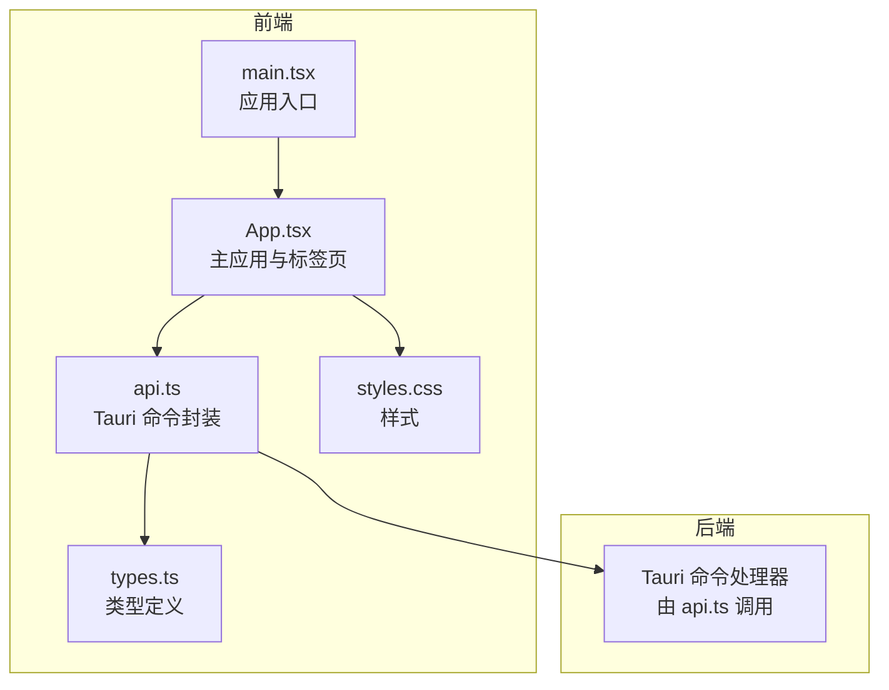
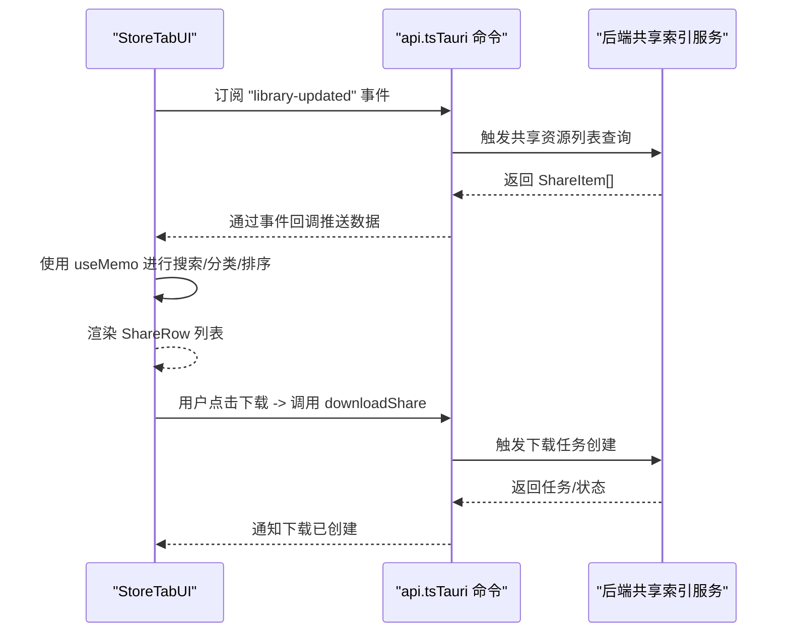
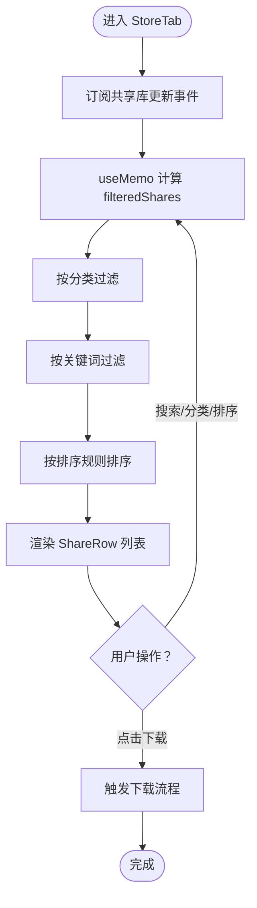
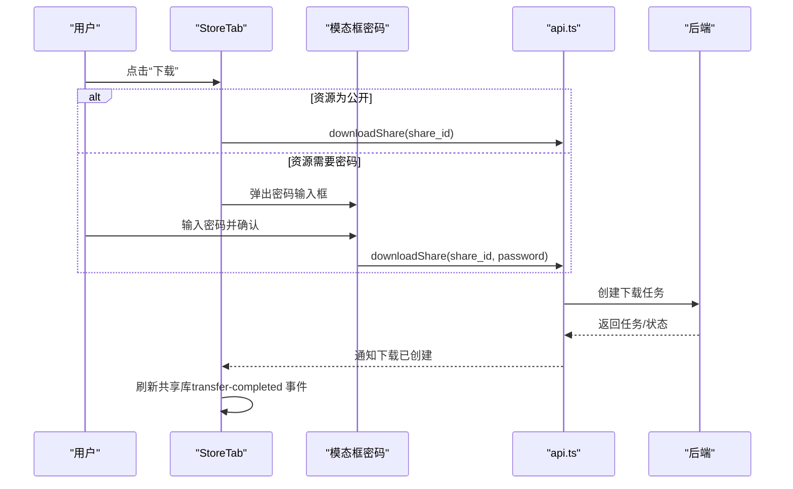
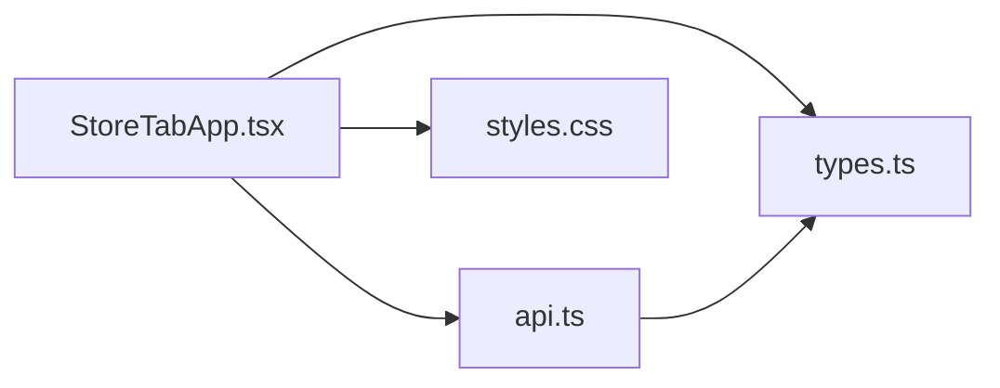

# 共享资源面板

<cite>
**本文引用的文件**
- [App.tsx](file://quicklan-main/src/App.tsx)
- [api.ts](file://quicklan-main/src/api.ts)
- [types.ts](file://quicklan-main/src/types.ts)
- [styles.css](file://quicklan-main/src/styles.css)
- [main.tsx](file://quicklan-main/src/main.tsx)
</cite>

## 目录
1. [简介](#简介)
2. [项目结构](#项目结构)
3. [核心组件](#核心组件)
4. [架构概览](#架构概览)
5. [详细组件分析](#详细组件分析)
6. [依赖关系分析](#依赖关系分析)
7. [性能考虑](#性能考虑)
8. [故障排除指南](#故障排除指南)
9. [结论](#结论)

## 简介
共享资源面板（StoreTab）是 QuickLAN 局域网文件共享与快传应用中的“共享广场”模块，负责展示来自网络中其他设备的共享资源，支持搜索过滤、分类管理和排序，并提供下载入口。该模块采用前端 React 组件与 Tauri 后端通信的方式实现，数据流从后端共享索引服务经事件监听更新到前端状态，再由用户交互驱动下载动作。

## 项目结构
- 前端位于 quicklan-main/src，包含入口、应用主组件、类型定义、API 调用封装与样式文件。
- StoreTab 作为 App.tsx 中的一个标签页组件，依赖全局状态（设备、共享资源、传输等）与 API 层进行数据交互。
- 类型定义集中于 types.ts，明确 ShareItem 等关键数据结构；API 封装位于 api.ts，统一暴露 Tauri 命令调用。

图表来源
- [main.tsx:1-11](file://quicklan-main/src/main.tsx#L1-L11)
- [App.tsx:1-120](file://quicklan-main/src/App.tsx#L1-L120)
- [api.ts:1-130](file://quicklan-main/src/api.ts#L1-L130)
- [types.ts:1-128](file://quicklan-main/src/types.ts#L1-L128)

章节来源
- [main.tsx:1-11](file://quicklan-main/src/main.tsx#L1-L11)
- [App.tsx:1-120](file://quicklan-main/src/App.tsx#L1-L120)
- [api.ts:1-130](file://quicklan-main/src/api.ts#L1-L130)
- [types.ts:1-128](file://quicklan-main/src/types.ts#L1-L128)

## 核心组件
- StoreTab：共享资源面板的核心组件，提供搜索框、分类筛选与排序下拉菜单，并渲染资源列表。
- ShareRow：资源项渲染组件，显示文件名、分享者、版本、大小、哈希摘要、副本数量、下载次数以及权限标识。
- 全局状态与事件：通过 Tauri 事件监听订阅设备列表、共享库更新、传输进度等，驱动 StoreTab 的数据刷新与交互。

章节来源
- [App.tsx:667-717](file://quicklan-main/src/App.tsx#L667-L717)
- [App.tsx:957-977](file://quicklan-main/src/App.tsx#L957-L977)

## 架构概览
StoreTab 的数据流从后端共享索引服务经 Tauri 事件推送至前端，前端使用 useMemo 对资源进行本地过滤与排序，最终渲染到 UI。

图表来源
- [App.tsx:120-137](file://quicklan-main/src/App.tsx#L120-L137)
- [App.tsx:144-178](file://quicklan-main/src/App.tsx#L144-L178)
- [App.tsx:247-250](file://quicklan-main/src/App.tsx#L247-L250)
- [api.ts:89-91](file://quicklan-main/src/api.ts#L89-L91)
- [api.ts:119-121](file://quicklan-main/src/api.ts#L119-L121)

## 详细组件分析

### StoreTab 组件
- 功能职责
  - 提供搜索框：支持按文件名、分享者、文件哈希进行模糊匹配。
  - 分类筛选：基于资源类别进行过滤，类别来源于共享资源集合去重后的结果。
  - 排序控制：支持按最近更新、下载次数、文件大小、文件名排序。
  - 资源渲染：遍历 filteredShares，每个条目渲染为 ShareRow，并附带下载按钮。
- 数据处理
  - 使用 useMemo 对 shares 进行三步过滤与一步排序，避免重复计算。
  - categories 通过 Set 去重并排序生成选项列表。
- 交互流程
  - 用户输入搜索词、选择分类、调整排序时，重新计算 filteredShares。
  - 点击下载按钮触发下载流程（见下节）。

图表来源
- [App.tsx:120-137](file://quicklan-main/src/App.tsx#L120-L137)
- [App.tsx:139-142](file://quicklan-main/src/App.tsx#L139-L142)
- [App.tsx:667-717](file://quicklan-main/src/App.tsx#L667-L717)

章节来源
- [App.tsx:667-717](file://quicklan-main/src/App.tsx#L667-L717)
- [App.tsx:120-142](file://quicklan-main/src/App.tsx#L120-L142)

### ShareRow 组件
- 显示字段
  - 文件名、分享者、版本、大小
  - 上传/更新时间、文件哈希前缀、副本数量
  - 分类标签、权限标签（公开/密码）、下载次数
- 交互
  - 作为 StoreTab 的子项，接收下载按钮作为 action 插槽。

章节来源
- [App.tsx:957-977](file://quicklan-main/src/App.tsx#L957-L977)

### 搜索算法实现
- 关键点
  - 搜索词预处理：去除首尾空白并转为小写，提升匹配鲁棒性。
  - 多字段匹配：同时匹配文件名、分享者名称、文件哈希。
  - 匹配策略：包含关系（includes），大小写不敏感。
- 复杂度
  - 对于 n 个资源，每次过滤为 O(n)，整体复杂度 O(n)。
  - 由于使用 useMemo 并基于稳定依赖数组，避免不必要的重复计算。

章节来源
- [App.tsx:120-129](file://quicklan-main/src/App.tsx#L120-L129)

### 分类管理与统计
- 分类来源
  - 来自共享资源集合的 category 字段，使用 Set 去重并排序生成选项。
- 统计维度
  - 资源总数：顶部状态条显示“共享资源数量”。
  - 分类分布：通过分类筛选快速定位资源。
  - 下载热度：通过 download_count 字段反映资源受欢迎程度。

章节来源
- [App.tsx:139-142](file://quicklan-main/src/App.tsx#L139-L142)
- [App.tsx:264-264](file://quicklan-main/src/App.tsx#L264-L264)
- [types.ts:75-91](file://quicklan-main/src/types.ts#L75-L91)

### 排序机制
- 支持字段
  - updated（最近更新）
  - downloads（下载次数）
  - size（文件大小）
  - name（文件名）
- 排序策略
  - 数值字段使用降序排列，字符串字段使用 localeCompare 进行字典序比较。
  - 通过 useMemo 在依赖变化时一次性计算，保证渲染性能。

章节来源
- [App.tsx:131-136](file://quicklan-main/src/App.tsx#L131-L136)

### 资源下载流程
- 公开下载
  - 当资源权限为 public 时，点击下载按钮直接调用 downloadShare。
- 密码下载
  - 当资源权限为 password 时，弹出模态框要求输入密码，确认后调用 downloadShare 并携带密码参数。
- 事件驱动更新
  - 下载任务创建后，通过 transfer-completed 事件刷新共享库，使下载次数等指标更新。

图表来源
- [App.tsx:360-370](file://quicklan-main/src/App.tsx#L360-L370)
- [App.tsx:477-513](file://quicklan-main/src/App.tsx#L477-L513)
- [App.tsx:247-250](file://quicklan-main/src/App.tsx#L247-L250)
- [api.ts:119-121](file://quicklan-main/src/api.ts#L119-L121)

章节来源
- [App.tsx:360-370](file://quicklan-main/src/App.tsx#L360-L370)
- [App.tsx:477-513](file://quicklan-main/src/App.tsx#L477-L513)
- [App.tsx:247-250](file://quicklan-main/src/App.tsx#L247-L250)
- [api.ts:119-121](file://quicklan-main/src/api.ts#L119-L121)

### 资源列表渲染与分页加载
- 渲染策略
  - StoreTab 使用简单列表渲染，未实现虚拟滚动或分页加载。
  - 当资源较多时，建议结合虚拟列表或分页策略以提升性能。
- 现状
  - 通过事件驱动的全量更新，保证 UI 与后端共享库一致。

章节来源
- [App.tsx:698-714](file://quicklan-main/src/App.tsx#L698-L714)
- [App.tsx:144-178](file://quicklan-main/src/App.tsx#L144-L178)

### 用户体验优化方案
- 搜索体验
  - 建议增加搜索占位提示文案，区分“文件名/分享者/hash”三种维度。
  - 增加“清空”按钮与回车快捷键支持。
- 分类与排序
  - 分类下拉默认显示“全部”，便于快速恢复全量展示。
  - 排序下拉默认“最近更新”，符合用户直觉。
- 反馈与提示
  - 下载任务创建后显示 Toast 提示，增强即时反馈。
  - 错误场景统一通过错误气泡提示，避免中断用户操作。

章节来源
- [App.tsx:682-696](file://quicklan-main/src/App.tsx#L682-L696)
- [App.tsx:215-218](file://quicklan-main/src/App.tsx#L215-L218)
- [App.tsx:295-302](file://quicklan-main/src/App.tsx#L295-L302)

## 依赖关系分析
- 组件依赖
  - StoreTab 依赖全局状态（devices、shares、myShares、transfers 等）与事件监听。
  - ShareRow 依赖 ShareItem 类型定义。
- API 依赖
  - StoreTab 通过 api.ts 的 listSharedResources、downloadShare 等命令与后端交互。
- 类型依赖
  - types.ts 定义 ShareItem、TransferInfo 等核心类型，确保前后端数据契约一致。

图表来源
- [App.tsx:667-717](file://quicklan-main/src/App.tsx#L667-L717)
- [api.ts:1-130](file://quicklan-main/src/api.ts#L1-L130)
- [types.ts:75-91](file://quicklan-main/src/types.ts#L75-L91)
- [styles.css:1-200](file://quicklan-main/src/styles.css#L1-L200)

章节来源
- [App.tsx:667-717](file://quicklan-main/src/App.tsx#L667-L717)
- [api.ts:1-130](file://quicklan-main/src/api.ts#L1-L130)
- [types.ts:75-91](file://quicklan-main/src/types.ts#L75-L91)

## 性能考虑
- 计算优化
  - 使用 useMemo 缓存 filteredShares 与 categories，避免每次渲染都重新计算。
- 渲染优化
  - StoreTab 未实现虚拟列表或分页，当资源规模较大时建议引入虚拟滚动或分页加载。
- 事件驱动
  - 通过事件监听批量更新，减少轮询带来的性能损耗。
- 样式与交互
  - 使用 CSS Flex/Grid 布局，避免过度重绘；按钮禁用态与忙碌态减少无效交互。

章节来源
- [App.tsx:120-142](file://quicklan-main/src/App.tsx#L120-L142)
- [App.tsx:144-178](file://quicklan-main/src/App.tsx#L144-L178)
- [styles.css:1-200](file://quicklan-main/src/styles.css#L1-L200)

## 故障排除指南
- 下载失败
  - 确认目标设备在线且共享资源有效；检查权限（公开/密码）是否正确。
  - 查看传输面板中的任务状态与错误信息。
- 搜索无结果
  - 检查搜索关键词是否过短；尝试切换分类或调整排序。
- 分类/排序异常
  - 确认 shares 数据已更新；检查事件监听是否正常工作。
- 密码下载
  - 确认输入的密码与资源发布时设置一致；注意大小写与特殊字符。

章节来源
- [App.tsx:295-302](file://quicklan-main/src/App.tsx#L295-L302)
- [App.tsx:477-513](file://quicklan-main/src/App.tsx#L477-L513)

## 结论
共享资源面板（StoreTab）通过清晰的搜索、分类与排序机制，为用户提供了高效的共享资源发现与下载入口。其基于事件驱动的数据更新与 useMemo 优化保证了良好的交互体验。未来可在大规模资源场景下引入虚拟列表与分页加载，进一步提升性能与可扩展性。