# 功能面板组件

<cite>
**本文档引用的文件**
- [App.tsx](file://quicklan-main/src/App.tsx)
- [main.tsx](file://quicklan-main/src/main.tsx)
- [types.ts](file://quicklan-main/src/types.ts)
- [api.ts](file://quicklan-main/src/api.ts)
- [styles.css](file://quicklan-main/src/styles.css)
- [lib.rs](file://quicklan-main/src-tauri/src/lib.rs)
- [commands.rs](file://quicklan-main/src-tauri/src/commands.rs)
- [settings.rs](file://quicklan-main/src-tauri/src/settings.rs)
- [discovery.rs](file://quicklan-main/src-tauri/src/discovery.rs)
- [library.rs](file://quicklan-main/src-tauri/src/library.rs)
</cite>

## 目录
1. [简介](#简介)
2. [项目结构](#项目结构)
3. [核心组件架构](#核心组件架构)
4. [四大功能面板详解](#四大功能面板详解)
5. [数据流与状态管理](#数据流与状态管理)
6. [组件复用策略](#组件复用策略)
7. [扩展性与维护性最佳实践](#扩展性与维护性最佳实践)
8. [性能考虑](#性能考虑)
9. [故障排除指南](#故障排除指南)
10. [总结](#总结)

## 简介

QuickLAN是一个基于Tauri框架开发的局域网文件共享与传输应用。该应用提供了四个主要的功能面板，每个面板都经过精心设计以提供直观的用户体验和高效的数据管理能力。本文档将深入分析这些功能面板的设计架构、数据流、状态管理和用户交互模式。

## 项目结构

QuickLAN采用前后端分离的架构设计，前端使用React + TypeScript构建用户界面，后端使用Rust实现高性能的系统服务。

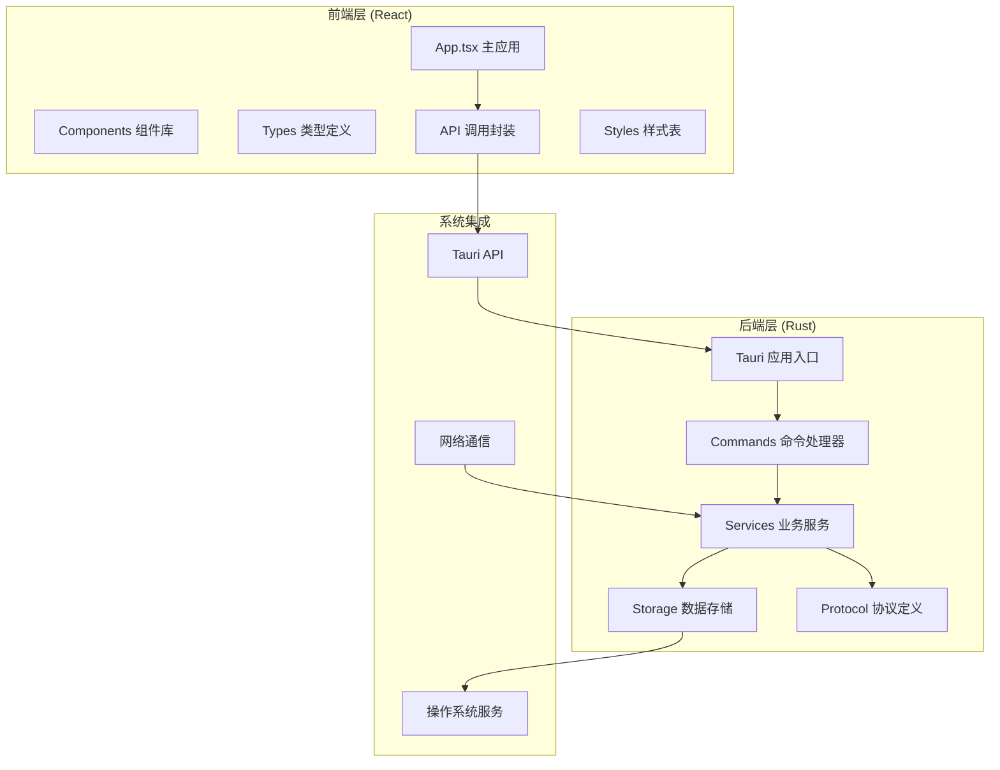

**图表来源**
- [App.tsx:1-800](file://quicklan-main/src/App.tsx#L1-L800)
- [lib.rs:138-250](file://quicklan-main/src-tauri/src/lib.rs#L138-L250)

**章节来源**
- [main.tsx:1-11](file://quicklan-main/src/main.tsx#L1-L11)
- [App.tsx:78-84](file://quicklan-main/src/App.tsx#L78-L84)

## 核心组件架构

### 应用状态管理

应用采用集中式状态管理模式，所有全局状态都集中在主应用组件中管理：

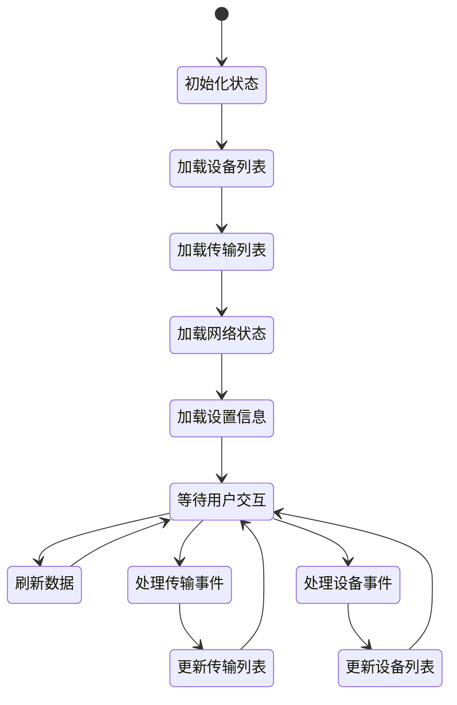

**图表来源**
- [App.tsx:144-178](file://quicklan-main/src/App.tsx#L144-L178)
- [App.tsx:180-206](file://quicklan-main/src/App.tsx#L180-L206)

### 组件层次结构

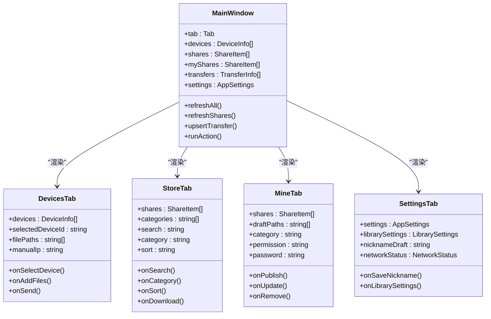

**图表来源**
- [App.tsx:575-665](file://quicklan-main/src/App.tsx#L575-L665)
- [App.tsx:667-717](file://quicklan-main/src/App.tsx#L667-L717)
- [App.tsx:719-816](file://quicklan-main/src/App.tsx#L719-L816)
- [App.tsx:818-918](file://quicklan-main/src/App.tsx#L818-L918)

**章节来源**
- [App.tsx:86-116](file://quicklan-main/src/App.tsx#L86-L116)
- [App.tsx:120-142](file://quicklan-main/src/App.tsx#L120-L142)

## 四大功能面板详解

### DevicesTab（设备管理）

DevicesTab是QuickLAN的核心功能面板之一，负责局域网内设备的发现、管理和文件传输。

#### 核心功能特性

1. **设备发现与管理**
   - 自动扫描局域网内的QuickLAN设备
   - 支持手动IP探测功能
   - 设备在线状态实时监控
   - 设备备注功能

2. **文件快传**
   - 支持单文件和文件夹选择
   - 拖拽上传功能
   - 实时传输进度显示
   - P2P直连传输

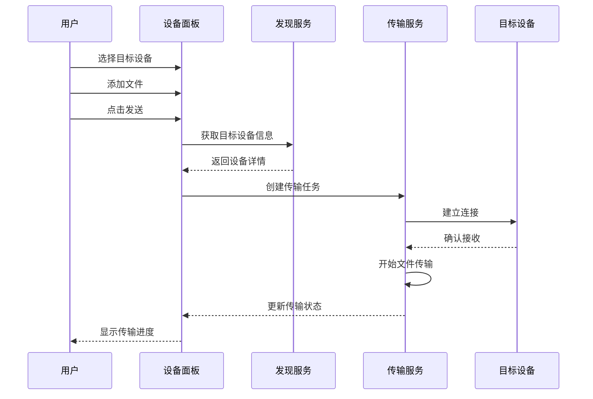

**图表来源**
- [App.tsx:304-347](file://quicklan-main/src/App.tsx#L304-L347)
- [commands.rs:25-46](file://quicklan-main/src-tauri/src/commands.rs#L25-L46)

#### 用户交互流程

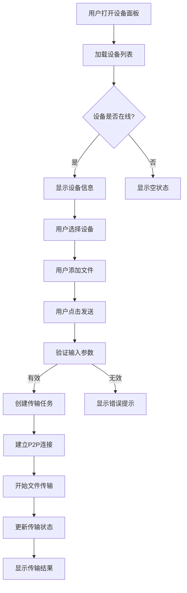

**图表来源**
- [App.tsx:337-344](file://quicklan-main/src/App.tsx#L337-L344)
- [App.tsx:613-632](file://quicklan-main/src/App.tsx#L613-L632)

**章节来源**
- [App.tsx:575-665](file://quicklan-main/src/App.tsx#L575-L665)

### StoreTab（共享资源）

StoreTab提供了一个去中心化的共享资源浏览和下载平台，用户可以发现和下载其他设备共享的资源。

#### 核心功能特性

1. **资源搜索与筛选**
   - 多维度搜索（文件名、分享者、哈希值）
   - 分类筛选功能
   - 多种排序方式（更新时间、下载次数、文件大小、文件名）

2. **资源展示**
   - 详细的资源元信息
   - 权限标识（公开/密码）
   - 下载统计和副本数量
   - 快速下载入口

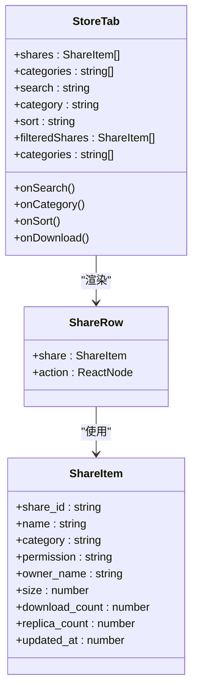

**图表来源**
- [App.tsx:667-717](file://quicklan-main/src/App.tsx#L667-L717)
- [App.tsx:957-977](file://quicklan-main/src/App.tsx#L957-L977)
- [types.ts:75-91](file://quicklan-main/src/types.ts#L75-L91)

#### 数据过滤逻辑

```mermaid
flowchart LR
A[原始资源列表] --> B[应用分类筛选]
B --> C[应用搜索条件]
C --> D[执行排序算法]
D --> E[最终显示列表]
B --> |category === "全部"| F[不过滤]
B --> |指定分类| G[按分类匹配]
C --> |无搜索词| H[不过滤]
C --> |有搜索词| I[按名称/所有者/哈希匹配]
D --> |按更新时间| J[降序排列]
D --> |按下载次数| K[降序排列]
D --> |按文件大小| L[降序排列]
D --> |按文件名| M[字母序排列]
```

**图表来源**
- [App.tsx:120-137](file://quicklan-main/src/App.tsx#L120-L137)

**章节来源**
- [App.tsx:667-717](file://quicklan-main/src/App.tsx#L667-L717)

### MineTab（我的共享）

MineTab专注于用户的资源共享管理，允许用户发布、更新和管理自己的共享内容。

#### 核心功能特性

1. **共享发布**
   - 支持文件和文件夹选择
   - 分类设置（文档、图片、视频、软件、其他）
   - 权限控制（公开共享/密码共享）
   - 密码保护功能

2. **共享管理**
   - 查看所有已发布的共享
   - 实时更新共享内容
   - 取消共享功能
   - 共享统计信息

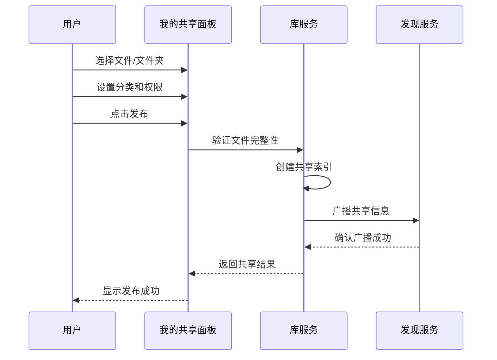

**图表来源**
- [App.tsx:373-422](file://quicklan-main/src/App.tsx#L373-L422)
- [commands.rs:199-212](file://quicklan-main/src-tauri/src/commands.rs#L199-L212)

#### 共享生命周期管理

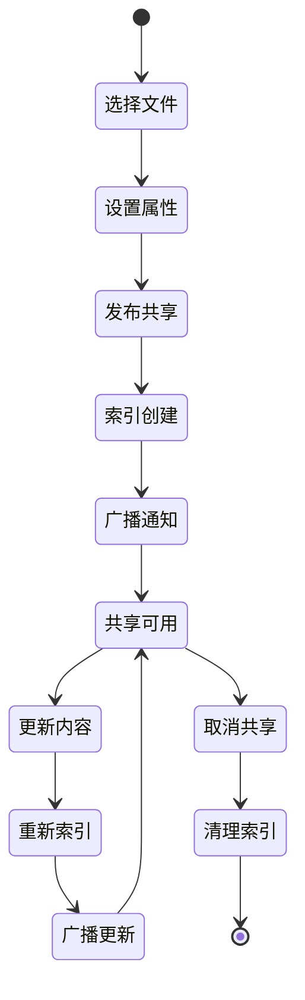

**图表来源**
- [App.tsx:400-420](file://quicklan-main/src/App.tsx#L400-L420)
- [commands.rs:214-230](file://quicklan-main/src-tauri/src/commands.rs#L214-L230)

**章节来源**
- [App.tsx:719-816](file://quicklan-main/src/App.tsx#L719-L816)

### SettingsTab（设置管理）

SettingsTab提供全面的系统配置选项，包括基本设置、网络诊断和资源加速配置。

#### 核心配置模块

1. **基本设置**
   - 昵称管理
   - 下载目录配置
   - 版本信息显示

2. **网络诊断**
   - 端口状态检查
   - 本地IP地址显示
   - 广播目标地址

3. **资源加速配置**
   - 上传速度限制
   - 并发任务数控制
   - 缓存容量管理

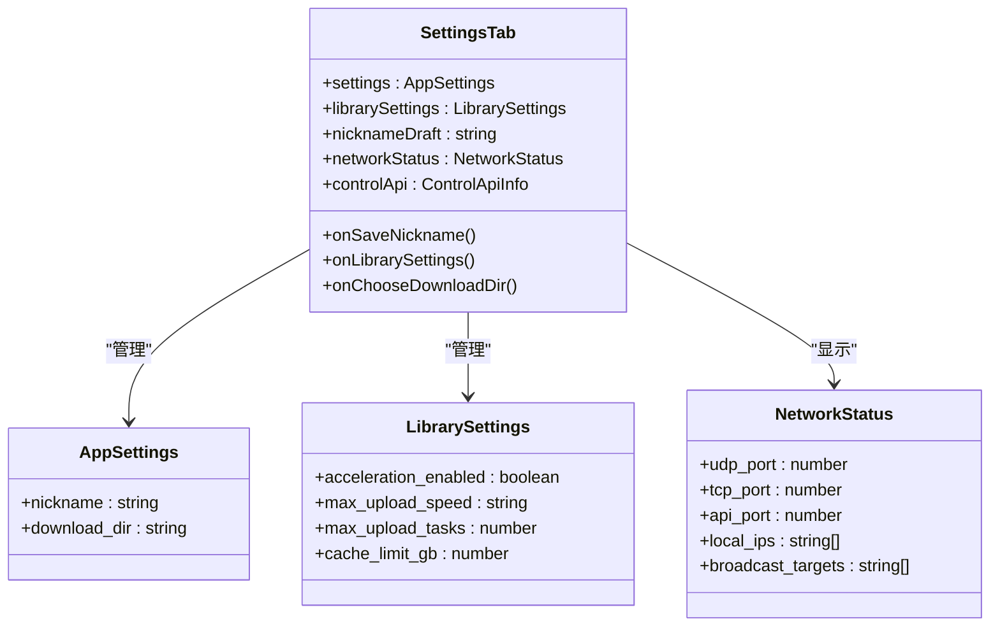

**图表来源**
- [App.tsx:818-918](file://quicklan-main/src/App.tsx#L818-L918)
- [types.ts:55-73](file://quicklan-main/src/types.ts#L55-L73)
- [types.ts:60-65](file://quicklan-main/src/types.ts#L60-L65)
- [types.ts:67-73](file://quicklan-main/src/types.ts#L67-L73)

**章节来源**
- [App.tsx:818-918](file://quicklan-main/src/App.tsx#L818-L918)

## 数据流与状态管理

### 全局状态架构

QuickLAN采用React Hooks实现的状态管理模式，所有面板共享同一套全局状态：

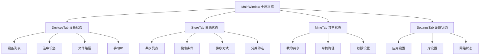

**图表来源**
- [App.tsx:86-116](file://quicklan-main/src/App.tsx#L86-L116)
- [App.tsx:120-142](file://quicklan-main/src/App.tsx#L120-L142)

### 异步数据流

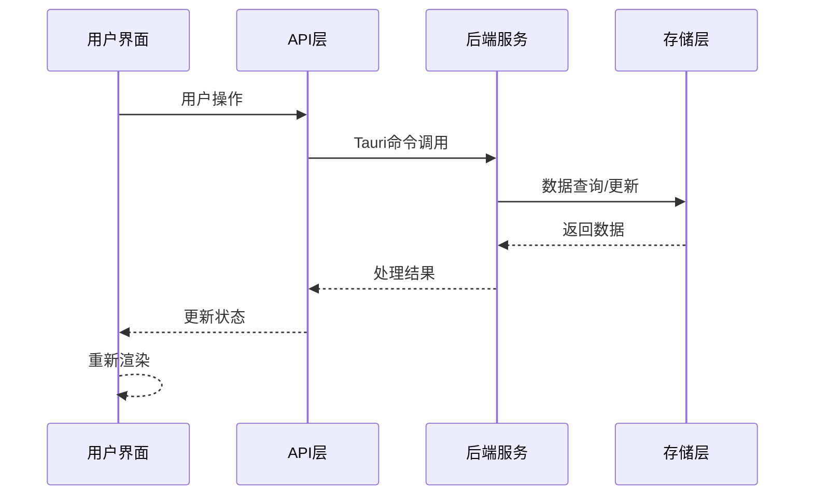

**图表来源**
- [api.ts:13-129](file://quicklan-main/src/api.ts#L13-L129)
- [commands.rs:11-259](file://quicklan-main/src-tauri/src/commands.rs#L11-L259)

### 事件驱动架构

应用通过事件系统实现组件间的解耦通信：

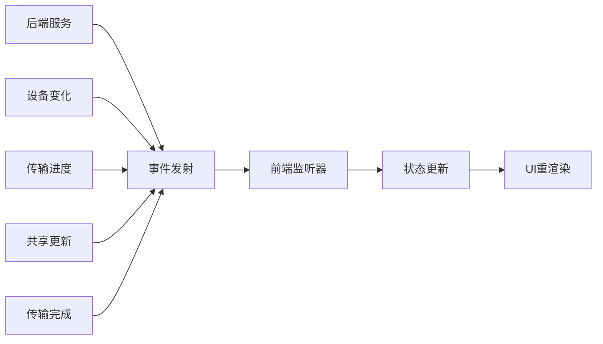

**图表来源**
- [App.tsx:144-178](file://quicklan-main/src/App.tsx#L144-L178)
- [discovery.rs:96-98](file://quicklan-main/src-tauri/src/discovery.rs#L96-L98)

**章节来源**
- [App.tsx:144-178](file://quicklan-main/src/App.tsx#L144-L178)
- [api.ts:13-129](file://quicklan-main/src/api.ts#L13-L129)

## 组件复用策略

### 通用组件设计

QuickLAN实现了高度复用的组件架构，通过统一的接口设计支持多个面板的使用：

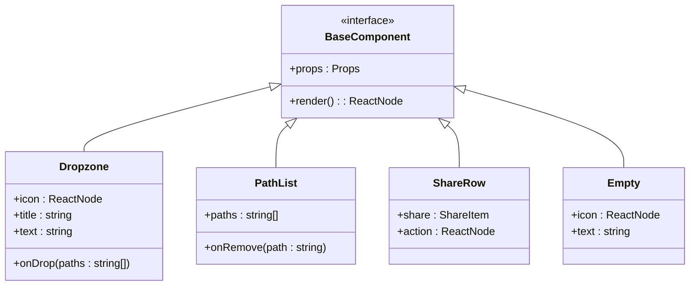

**图表来源**
- [App.tsx:920-955](file://quicklan-main/src/App.tsx#L920-L955)
- [App.tsx:957-977](file://quicklan-main/src/App.tsx#L957-L977)
- [App.tsx:1124-1131](file://quicklan-main/src/App.tsx#L1124-L1131)

### 属性传递模式

各功能面板通过标准化的属性传递实现组件复用：

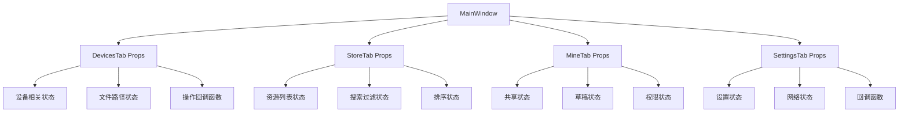

**图表来源**
- [App.tsx:304-458](file://quicklan-main/src/App.tsx#L304-L458)

**章节来源**
- [App.tsx:920-955](file://quicklan-main/src/App.tsx#L920-L955)
- [App.tsx:957-977](file://quicklan-main/src/App.tsx#L957-L977)

## 扩展性与维护性最佳实践

### 架构设计原则

1. **单一职责原则**
   - 每个组件只负责特定的功能领域
   - 状态管理集中在主应用组件
   - API调用封装在独立模块

2. **开放封闭原则**
   - 新增功能通过扩展而非修改现有代码
   - 组件接口设计考虑未来扩展
   - 插件化架构支持功能模块化

3. **依赖倒置原则**
   - 高层组件不依赖低层实现
   - 通过抽象接口实现松耦合
   - 便于单元测试和模拟

### 代码组织策略

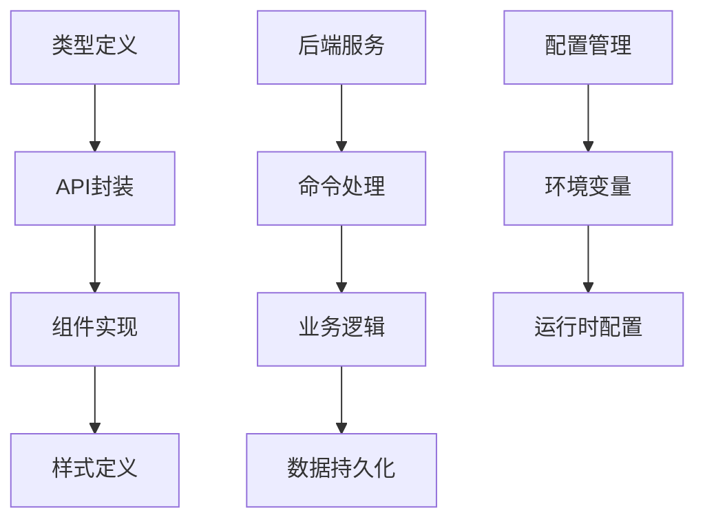

**图表来源**
- [types.ts:1-128](file://quicklan-main/src/types.ts#L1-L128)
- [api.ts:1-130](file://quicklan-main/src/api.ts#L1-L130)
- [lib.rs:138-250](file://quicklan-main/src-tauri/src/lib.rs#L138-L250)

### 错误处理策略

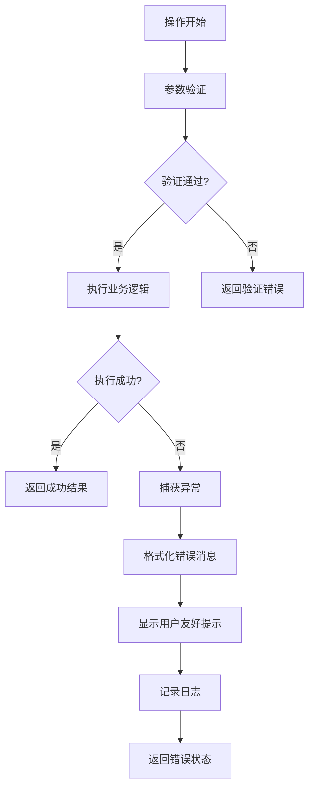

**图表来源**
- [App.tsx:234-245](file://quicklan-main/src/App.tsx#L234-L245)

**章节来源**
- [App.tsx:234-245](file://quicklan-main/src/App.tsx#L234-L245)
- [api.ts:13-129](file://quicklan-main/src/api.ts#L13-L129)

## 性能考虑

### 前端性能优化

1. **状态更新优化**
   - 使用useMemo避免不必要的计算
   - 使用useCallback优化回调函数
   - 合理的组件重渲染策略

2. **内存管理**
   - 及时清理事件监听器
   - 合理的数组和对象处理
   - 避免内存泄漏

3. **渲染性能**
   - 虚拟滚动处理大量列表
   - 图片懒加载
   - 组件拆分和按需加载

### 后端性能优化

1. **并发处理**
   - 多线程架构处理I/O密集任务
   - 异步操作避免阻塞主线程
   - 连接池管理网络连接

2. **数据缓存**
   - 内存缓存热点数据
   - 数据库查询优化
   - 磁盘I/O最小化

3. **网络优化**
   - UDP广播优化
   - TCP连接复用
   - 压缩传输数据

**章节来源**
- [App.tsx:120-142](file://quicklan-main/src/App.tsx#L120-L142)
- [discovery.rs:146-161](file://quicklan-main/src-tauri/src/discovery.rs#L146-L161)

## 故障排除指南

### 常见问题诊断

1. **设备无法发现**
   - 检查防火墙设置
   - 验证网络连通性
   - 确认端口监听状态

2. **传输失败**
   - 检查磁盘空间
   - 验证文件权限
   - 确认网络稳定性

3. **界面响应缓慢**
   - 检查内存使用情况
   - 监控CPU占用率
   - 分析事件循环阻塞

### 调试工具使用


**图表来源**
- [lib.rs:138-250](file://quicklan-main/src-tauri/src/lib.rs#L138-L250)

**章节来源**
- [lib.rs:138-250](file://quicklan-main/src-tauri/src/lib.rs#L138-L250)

## 总结

QuickLAN功能面板组件展现了现代前端应用的最佳实践，通过精心设计的架构实现了功能完整性、用户体验和可维护性的平衡。四大功能面板各有特色但又紧密协作，形成了完整的局域网文件共享生态系统。

### 核心优势

1. **清晰的架构设计** - 前后端分离，职责明确
2. **优秀的用户体验** - 直观的界面和流畅的交互
3. **强大的扩展能力** - 模块化设计支持功能扩展
4. **可靠的性能表现** - 优化的算法和资源管理

### 技术亮点

- 基于React Hooks的状态管理
- Tauri框架实现跨平台部署
- Rust后端提供高性能服务
- 去中心化的网络架构
- 完善的错误处理机制

这个项目为类似的应用开发提供了宝贵的参考模板，展示了如何在保证功能完整性的同时实现代码的可维护性和扩展性。