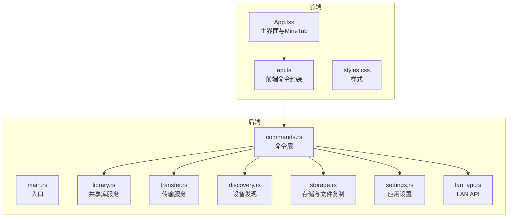
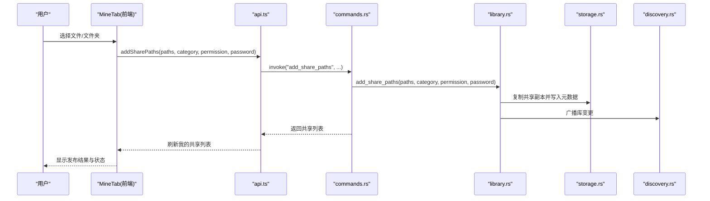
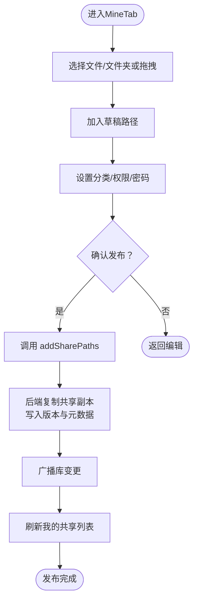
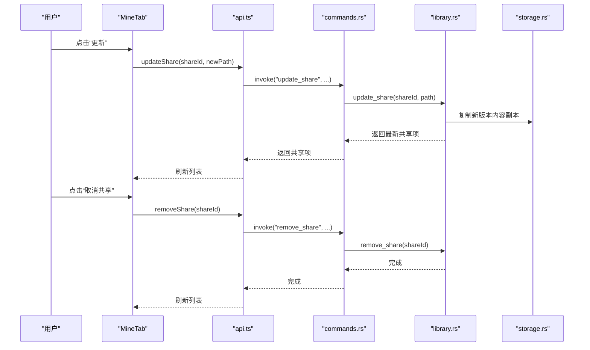
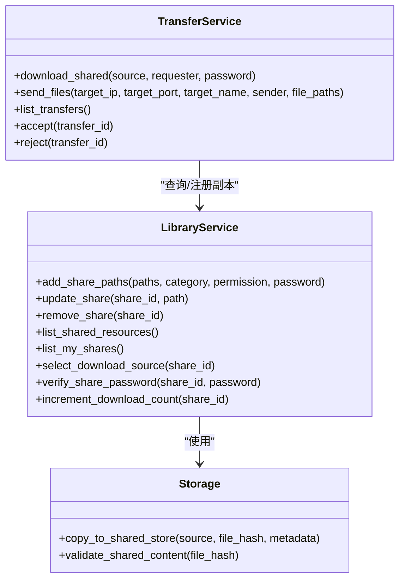
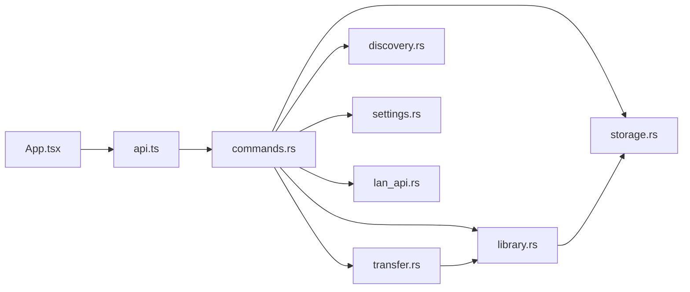

# 我的共享面板

<cite>
**本文档引用的文件**
- [App.tsx](file://quicklan-main/src/App.tsx)
- [api.ts](file://quicklan-main/src/api.ts)
- [types.ts](file://quicklan-main/src/types.ts)
- [main.rs](file://quicklan-main/src-tauri/src/main.rs)
- [commands.rs](file://quicklan-main/src-tauri/src/commands.rs)
- [storage.rs](file://quicklan-main/src-tauri/src/storage.rs)
- [transfer.rs](file://quicklan-main/src-tauri/src/transfer.rs)
- [library.rs](file://quicklan-main/src-tauri/src/library.rs)
- [discovery.rs](file://quicklan-main/src-tauri/src/discovery.rs)
- [settings.rs](file://quicklan-main/src-tauri/src/settings.rs)
- [lan_api.rs](file://quicklan-main/src-tauri/src/lan_api.rs)
- [styles.css](file://quicklan-main/src/styles.css)
</cite>

## 目录
1. [简介](#简介)
2. [项目结构](#项目结构)
3. [核心组件](#核心组件)
4. [架构总览](#架构总览)
5. [详细组件分析](#详细组件分析)
6. [依赖关系分析](#依赖关系分析)
7. [性能考虑](#性能考虑)
8. [故障排除指南](#故障排除指南)
9. [结论](#结论)
10. [附录](#附录)

## 简介
本文档面向“MineTab”（我的共享面板）功能，系统性阐述共享发布流程、权限与密码管理、共享更新与删除、共享草稿与路径选择、批量操作、状态跟踪、版本管理以及用户体验优化策略。文档基于前端 React 应用与 Rust 后端的完整实现，结合命令层、存储层、传输层与库管理层，提供从用户界面到数据持久化的全栈视角。

## 项目结构
项目采用前后端分离架构：
- 前端使用 React + TypeScript，通过 Tauri 暴露的命令接口与后端交互。
- 后端使用 Rust，提供设备发现、共享库管理、文件传输、存储与网络协议支持。
- 数据持久化采用 SQLite，共享内容以哈希命名的副本形式存储于本地目录。

图表来源
- [App.tsx](file://quicklan-main/src/App.tsx)
- [api.ts](file://quicklan-main/src/api.ts)
- [main.rs](file://quicklan-main/src-tauri/src/main.rs)
- [commands.rs](file://quicklan-main/src-tauri/src/commands.rs)
- [library.rs](file://quicklan-main/src-tauri/src/library.rs)
- [transfer.rs](file://quicklan-main/src-tauri/src/transfer.rs)
- [discovery.rs](file://quicklan-main/src-tauri/src/discovery.rs)
- [storage.rs](file://quicklan-main/src-tauri/src/storage.rs)
- [settings.rs](file://quicklan-main/src-tauri/src/settings.rs)
- [lan_api.rs](file://quicklan-main/src-tauri/src/lan_api.rs)

章节来源
- [App.tsx](file://quicklan-main/src/App.tsx)
- [api.ts](file://quicklan-main/src/api.ts)
- [main.rs](file://quicklan-main/src-tauri/src/main.rs)

## 核心组件
- MineTab 组件：负责共享发布、草稿管理、路径选择、权限与密码配置、共享更新与删除。
- 前端命令封装：统一调用后端命令，处理错误与加载状态。
- 后端命令层：对接库服务、传输服务、存储与发现模块。
- 库服务：维护共享索引、版本、副本节点与下载统计。
- 传输服务：实现点对点与共享下载的传输逻辑，含进度、状态事件与校验。
- 存储服务：共享内容的复制、校验与去重，确保副本一致性。
- 发现服务：设备发现、清单广播与同步。
- 设置服务：应用昵称、下载目录等配置。
- LAN API：本地 HTTP 接口，供其他进程查询清单与上报下载完成。

章节来源
- [App.tsx](file://quicklan-main/src/App.tsx)
- [api.ts](file://quicklan-main/src/api.ts)
- [commands.rs](file://quicklan-main/src-tauri/src/commands.rs)
- [library.rs](file://quicklan-main/src-tauri/src/library.rs)
- [transfer.rs](file://quicklan-main/src-tauri/src/transfer.rs)
- [storage.rs](file://quicklan-main/src-tauri/src/storage.rs)
- [discovery.rs](file://quicklan-main/src-tauri/src/discovery.rs)
- [settings.rs](file://quicklan-main/src-tauri/src/settings.rs)
- [lan_api.rs](file://quicklan-main/src-tauri/src/lan_api.rs)

## 架构总览
MineTab 的工作流贯穿前端 UI、命令层、库服务与传输服务：

图表来源
- [App.tsx](file://quicklan-main/src/App.tsx)
- [api.ts](file://quicklan-main/src/api.ts)
- [commands.rs](file://quicklan-main/src-tauri/src/commands.rs)
- [library.rs](file://quicklan-main/src-tauri/src/library.rs)
- [storage.rs](file://quicklan-main/src-tauri/src/storage.rs)
- [discovery.rs](file://quicklan-main/src-tauri/src/discovery.rs)

## 详细组件分析

### MineTab 共享发布流程
- 文件选择与草稿管理
  - 支持“选择文件/文件夹”与拖拽加入草稿区。
  - 草稿路径集合用于临时聚合待发布文件。
- 分类设置
  - 提供文档/图片/视频/软件/其他等分类选项。
- 权限配置
  - 公开共享：无需密码，直接可下载。
  - 密码共享：需输入访问密码，后端验证通过后方可下载。
- 密码管理
  - 发布时可选填密码；下载时若为密码共享，弹出密码输入框。
- 发布执行
  - 调用 addSharePaths，后端复制共享副本、写入版本与元数据，并广播库变更。
  - 成功后刷新“我的共享”列表。

图表来源
- [App.tsx](file://quicklan-main/src/App.tsx)
- [api.ts](file://quicklan-main/src/api.ts)
- [commands.rs](file://quicklan-main/src-tauri/src/commands.rs)
- [library.rs](file://quicklan-main/src-tauri/src/library.rs)
- [storage.rs](file://quicklan-main/src-tauri/src/storage.rs)
- [discovery.rs](file://quicklan-main/src-tauri/src/discovery.rs)

章节来源
- [App.tsx](file://quicklan-main/src/App.tsx)
- [api.ts](file://quicklan-main/src/api.ts)
- [commands.rs](file://quicklan-main/src-tauri/src/commands.rs)

### 共享更新与删除
- 更新共享
  - 选择已有共享，重新选择单个文件进行版本升级。
  - 后端生成新版本，复制新内容副本，更新元数据并广播。
- 删除共享
  - 将共享标记为非活跃，不影响历史版本与副本节点。
  - 广播库变更，其他设备同步更新。

图表来源
- [App.tsx](file://quicklan-main/src/App.tsx)
- [api.ts](file://quicklan-main/src/api.ts)
- [commands.rs](file://quicklan-main/src-tauri/src/commands.rs)
- [library.rs](file://quicklan-main/src-tauri/src/library.rs)
- [storage.rs](file://quicklan-main/src-tauri/src/storage.rs)

章节来源
- [App.tsx](file://quicklan-main/src/App.tsx)
- [api.ts](file://quicklan-main/src/api.ts)
- [commands.rs](file://quicklan-main/src-tauri/src/commands.rs)
- [library.rs](file://quicklan-main/src-tauri/src/library.rs)

### 共享草稿管理、路径选择与批量操作
- 草稿路径
  - 使用 shareDraftPaths 状态维护待发布文件集合，支持增删。
- 路径选择
  - 通过 chooseSharePaths 与 chooseFolderPath 获取文件/文件夹路径。
  - 支持拖拽事件，自动加入草稿区。
- 批量操作
  - 一次发布可包含多个文件；每个文件独立生成版本。
  - 传输层支持批量发送任务，但共享发布按文件逐个处理版本。

章节来源
- [App.tsx](file://quicklan-main/src/App.tsx)
- [api.ts](file://quicklan-main/src/api.ts)

### 共享状态跟踪与版本管理
- 版本管理
  - 每次更新共享即新增版本，保留历史版本与文件哈希。
  - 选择下载源时优先选择最新版本，其次考虑上传任务数、延迟与是否本地副本。
- 状态跟踪
  - 传输事件通过事件总线推送：进度、完成、失败、接收请求。
  - MineTab 监听事件并更新传输面板与共享列表。
- 下载统计
  - 下载完成后通过 LAN API 上报，库服务递增下载计数。

图表来源
- [library.rs](file://quicklan-main/src-tauri/src/library.rs)
- [transfer.rs](file://quicklan-main/src-tauri/src/transfer.rs)
- [storage.rs](file://quicklan-main/src-tauri/src/storage.rs)

章节来源
- [library.rs](file://quicklan-main/src-tauri/src/library.rs)
- [transfer.rs](file://quicklan-main/src-tauri/src/transfer.rs)
- [storage.rs](file://quicklan-main/src-tauri/src/storage.rs)

### 用户体验优化策略
- 加载与错误提示
  - 统一的 runAction 包装，集中处理忙碌态、错误弹窗与成功提示。
- 传输面板
  - 实时显示传输进度、速度、剩余时间与状态徽章。
  - 支持清理已完成任务与打开保存目录。
- 响应式设计
  - 样式针对小屏设备自适应布局，保证在移动端也能良好使用。
- 交互反馈
  - Toast 提示发布/更新/取消成功消息。
  - 模态框处理密码输入与接收确认。

章节来源
- [App.tsx](file://quicklan-main/src/App.tsx)
- [styles.css](file://quicklan-main/src/styles.css)

## 依赖关系分析
- 前端依赖
  - App.tsx 依赖 api.ts 中的命令函数，组合状态与事件处理。
  - 类型定义集中在 types.ts，确保前后端一致的数据契约。
- 后端依赖
  - commands.rs 作为命令入口，调用 library.rs、transfer.rs、discovery.rs、storage.rs、settings.rs、lan_api.rs。
  - library.rs 依赖 storage.rs 进行内容复制与校验，依赖 SQLite 进行元数据持久化。
  - transfer.rs 依赖 library.rs 查询共享内容，依赖 storage.rs 写入/读取副本。
  - discovery.rs 依赖 library.rs 合并与观察设备清单，定时广播。

图表来源
- [App.tsx](file://quicklan-main/src/App.tsx)
- [api.ts](file://quicklan-main/src/api.ts)
- [commands.rs](file://quicklan-main/src-tauri/src/commands.rs)
- [library.rs](file://quicklan-main/src-tauri/src/library.rs)
- [transfer.rs](file://quicklan-main/src-tauri/src/transfer.rs)
- [discovery.rs](file://quicklan-main/src-tauri/src/discovery.rs)
- [storage.rs](file://quicklan-main/src-tauri/src/storage.rs)
- [settings.rs](file://quicklan-main/src-tauri/src/settings.rs)
- [lan_api.rs](file://quicklan-main/src-tauri/src/lan_api.rs)

章节来源
- [App.tsx](file://quicklan-main/src/App.tsx)
- [api.ts](file://quicklan-main/src/api.ts)
- [commands.rs](file://quicklan-main/src-tauri/src/commands.rs)

## 性能考虑
- 共享副本复用
  - 相同哈希的文件仅存储一份副本，避免重复占用空间。
- 传输校验
  - 传输完成后进行 SHA256 校验，确保数据完整性。
- 选择下载源
  - 优先本地副本与低延迟节点，减少网络抖动与带宽竞争。
- 限制与节流
  - 设置最大上传任务数与缓存上限，避免过度占用系统资源。

## 故障排除指南
- 发布失败
  - 检查所选路径是否包含有效文件；确认磁盘空间与权限。
- 下载失败
  - 若为密码共享，确认密码正确；检查网络连通性与防火墙设置。
- 传输卡住
  - 查看传输面板状态与日志；必要时清理已完成任务并重试。
- 设备未上线
  - 使用手动探测 IP 功能；确认同一局域网与广播可达性。

章节来源
- [transfer.rs](file://quicklan-main/src-tauri/src/transfer.rs)
- [discovery.rs](file://quicklan-main/src-tauri/src/discovery.rs)
- [App.tsx](file://quicklan-main/src/App.tsx)

## 结论
MineTab 通过清晰的前端工作流与健壮的后端服务，实现了从文件选择、权限配置到版本管理与状态跟踪的完整闭环。其基于哈希的共享副本机制与多节点下载源选择，兼顾了易用性与性能。建议在实际部署中关注网络环境与存储容量规划，并利用内置的传输面板与诊断信息持续优化用户体验。

## 附录
- 关键类型与字段
  - ShareItem：共享标识、名称、分类、权限、所有者、版本、大小、时间戳、下载计数、副本数量等。
  - TransferInfo：传输 ID、批次 ID、文件名、大小、进度、速度、ETA、方向、状态、对端信息、保存路径、版本与哈希等。
  - LibrarySettings：加速开关、最大上传速度、最大上传任务、缓存上限等。

章节来源
- [types.ts](file://quicklan-main/src/types.ts)