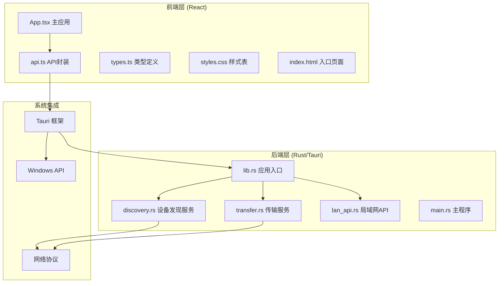
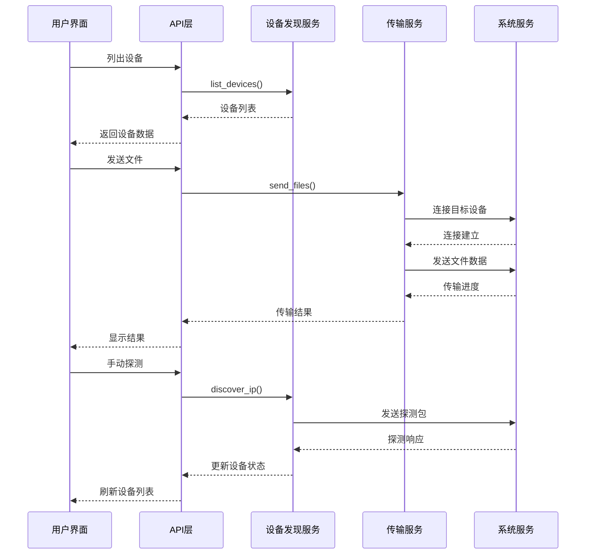
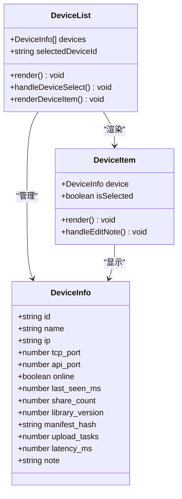
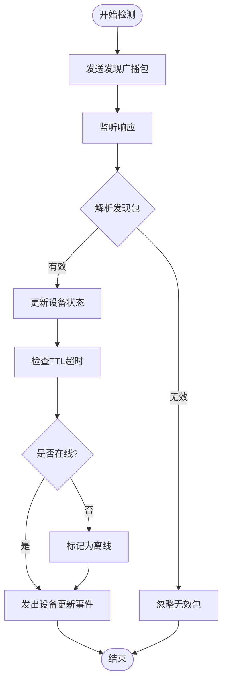
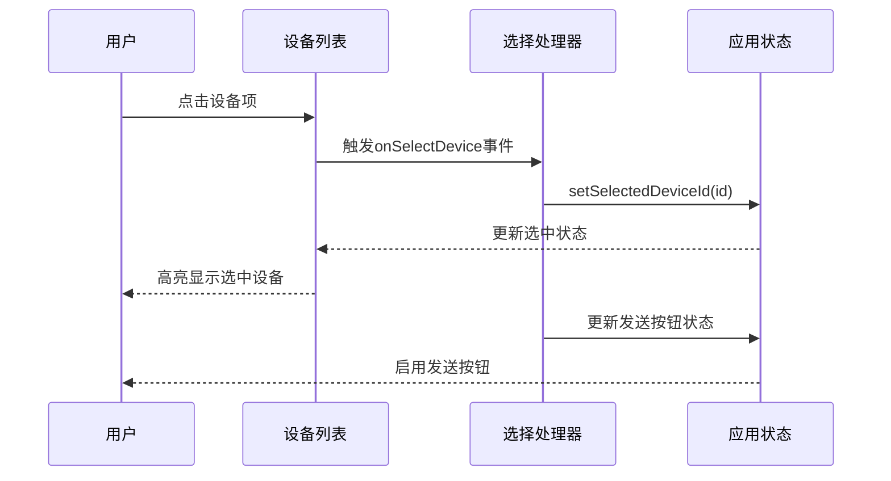
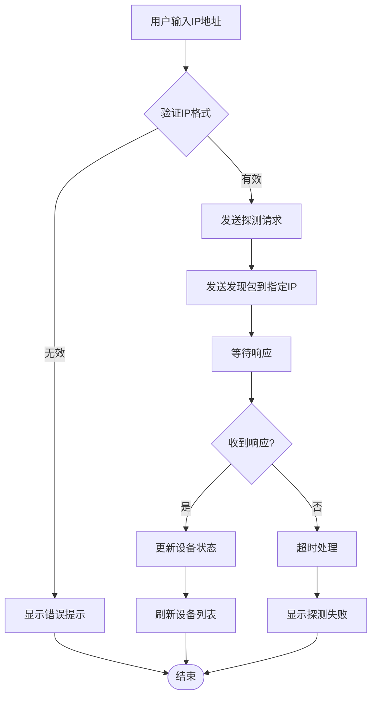
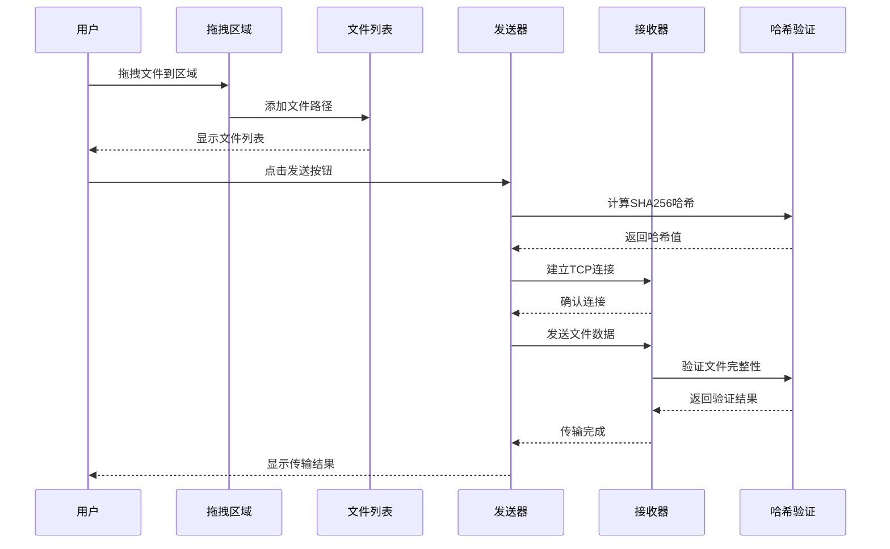
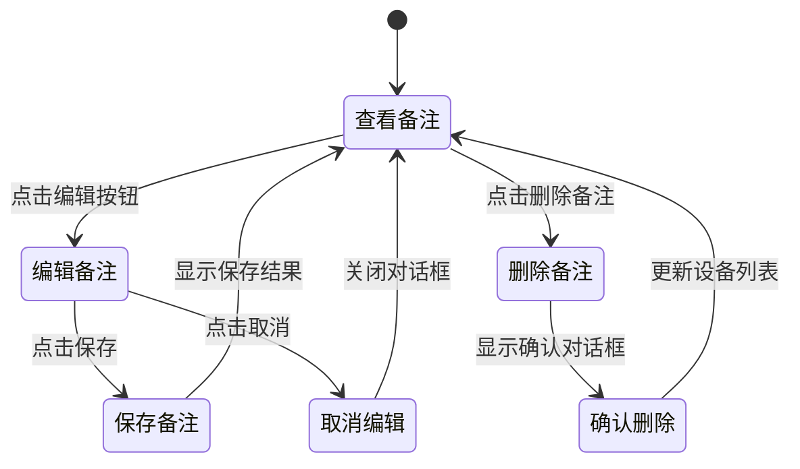
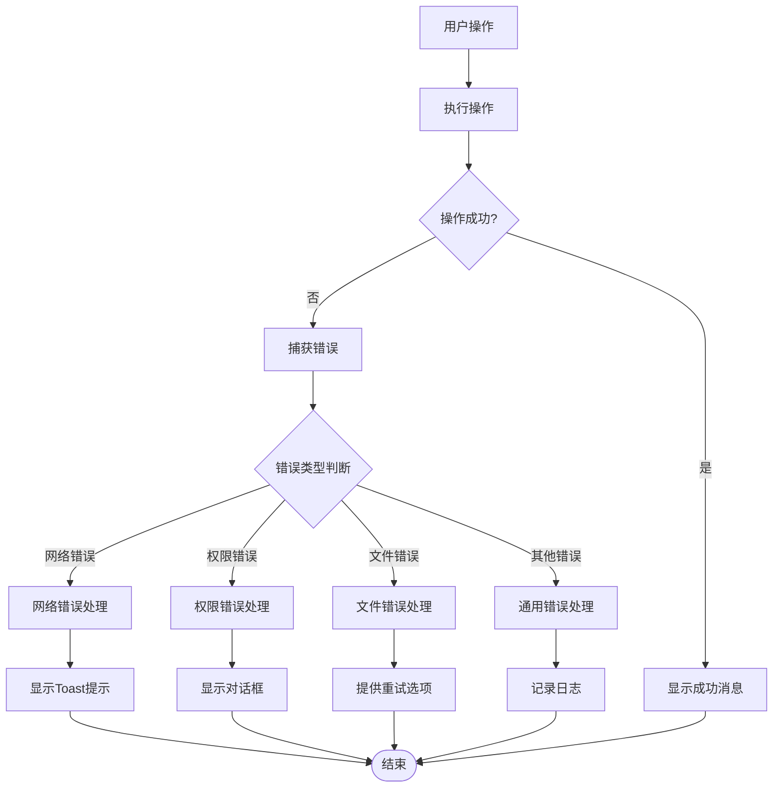
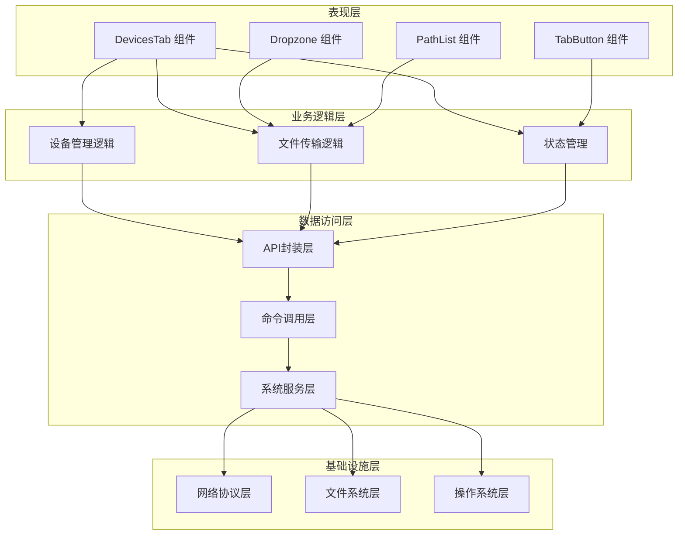

# 设备管理面板

<cite>
**本文档引用的文件**
- [App.tsx](file://quicklan-main/src/App.tsx)
- [api.ts](file://quicklan-main/src/api.ts)
- [types.ts](file://quicklan-main/src/types.ts)
- [lib.rs](file://quicklan-main/src-tauri/src/lib.rs)
- [discovery.rs](file://quicklan-main/src-tauri/src/discovery.rs)
- [transfer.rs](file://quicklan-main/src-tauri/src/transfer.rs)
- [lan_api.rs](file://quicklan-main/src-tauri/src/lan_api.rs)
- [main.rs](file://quicklan-main/src-tauri/src/main.rs)
- [styles.css](file://quicklan-main/src/styles.css)
- [index.html](file://quicklan-main/index.html)
</cite>

## 目录
1. [简介](#简介)
2. [项目结构](#项目结构)
3. [核心组件](#核心组件)
4. [架构概览](#架构概览)
5. [详细组件分析](#详细组件分析)
6. [依赖关系分析](#依赖关系分析)
7. [性能考虑](#性能考虑)
8. [故障排除指南](#故障排除指南)
9. [结论](#结论)

## 简介

设备管理面板是 QuickLAN 应用程序的核心界面组件，负责管理局域网中的设备发现、状态监控和文件传输功能。该面板提供了直观的用户界面来展示在线设备、管理设备备注、执行手动IP探测以及进行快速文件传输。

QuickLAN 是一个去中心化的局域网文件共享和传输系统，支持设备间的直接通信和文件传输。设备管理面板作为用户交互的主要入口，集成了设备发现、状态显示、文件传输和设备管理等核心功能。

## 项目结构

QuickLAN 采用前后端分离的架构设计，前端使用 React 构建用户界面，后端使用 Rust 和 Tauri 提供系统级功能。

**图表来源**
- [App.tsx:1-1170](file://quicklan-main/src/App.tsx#L1-L1170)
- [lib.rs:1-250](file://quicklan-main/src-tauri/src/lib.rs#L1-L250)
- [main.rs:1-6](file://quicklan-main/src-tauri/src/main.rs#L1-L6)

**章节来源**
- [App.tsx:1-1170](file://quicklan-main/src/App.tsx#L1-L1170)
- [lib.rs:1-250](file://quicklan-main/src-tauri/src/lib.rs#L1-L250)
- [main.rs:1-6](file://quicklan-main/src-tauri/src/main.rs#L1-L6)

## 核心组件

设备管理面板由多个核心组件构成，每个组件都有特定的功能和职责：

### 设备列表组件
设备列表组件负责展示所有在线设备的状态信息，包括设备名称、IP地址、端口号、资源数量等关键信息。

### 手动探测组件
手动探测组件允许用户输入特定的IP地址来主动探测目标设备，这对于网络拓扑复杂或设备发现异常的情况非常有用。

### 文件快传组件
文件快传组件提供拖拽上传、文件选择和批量传输功能，支持点对点直连传输和SHA256校验确保数据完整性。

### 设备备注组件
设备备注组件允许用户为设备添加本地备注，便于识别和管理不同设备。

**章节来源**
- [App.tsx:575-665](file://quicklan-main/src/App.tsx#L575-L665)
- [types.ts:1-128](file://quicklan-main/src/types.ts#L1-L128)

## 架构概览

QuickLAN 采用了分层架构设计，从前端用户界面到后端系统服务形成了完整的数据流和控制流。

**图表来源**
- [api.ts:13-51](file://quicklan-main/src/api.ts#L13-L51)
- [discovery.rs:67-104](file://quicklan-main/src-tauri/src/discovery.rs#L67-L104)
- [transfer.rs:180-220](file://quicklan-main/src-tauri/src/transfer.rs#L180-L220)

## 详细组件分析

### 设备列表展示组件

设备列表组件是设备管理面板的核心部分，负责实时显示局域网中所有可发现的设备。

**图表来源**
- [types.ts:1-15](file://quicklan-main/src/types.ts#L1-L15)
- [App.tsx:609-633](file://quicklan-main/src/App.tsx#L609-L633)

设备列表的渲染逻辑包含以下关键特性：

1. **在线状态指示**：使用绿色圆点表示设备在线状态
2. **设备信息展示**：显示设备名称、IP地址、端口号和资源数量
3. **选择机制**：点击设备项可选中目标设备用于文件传输
4. **备注显示**：支持显示用户自定义的设备备注

**章节来源**
- [App.tsx:609-633](file://quicklan-main/src/App.tsx#L609-L633)
- [types.ts:1-15](file://quicklan-main/src/types.ts#L1-L15)

### 在线状态检测机制

设备在线状态检测基于UDP广播协议实现，系统会定期发送发现包并维护设备状态缓存。

**图表来源**
- [discovery.rs:146-275](file://quicklan-main/src-tauri/src/discovery.rs#L146-L275)

状态检测的关键参数包括：
- **存在间隔**：每30秒发送一次存在广播
- **库公告间隔**：每300秒广播一次库摘要
- **TTL超时**：超过180秒认为设备离线
- **广播目标**：自动检测本地网络接口的广播地址

**章节来源**
- [discovery.rs:67-120](file://quicklan-main/src-tauri/src/discovery.rs#L67-L120)
- [discovery.rs:253-275](file://quicklan-main/src-tauri/src/discovery.rs#L253-L275)

### 设备选择机制

设备选择机制提供了直观的用户交互方式来选择目标传输设备。

**图表来源**
- [App.tsx:618-618](file://quicklan-main/src/App.tsx#L618-L618)

选择机制的特点：
- **单选模式**：每次只能选择一个设备
- **视觉反馈**：选中设备会有高亮显示
- **状态同步**：选择变化会同步更新发送按钮状态

**章节来源**
- [App.tsx:582-582](file://quicklan-main/src/App.tsx#L582-L582)
- [App.tsx:618-618](file://quicklan-main/src/App.tsx#L618-L618)

### 手动IP探测功能

手动IP探测功能允许用户针对特定IP地址发起设备发现请求。

**图表来源**
- [discovery.rs:100-104](file://quicklan-main/src-tauri/src/discovery.rs#L100-L104)
- [App.tsx:326-332](file://quicklan-main/src/App.tsx#L326-L332)

探测功能的工作流程：
1. **输入验证**：检查IP地址格式有效性
2. **探测发送**：向指定IP地址发送发现包
3. **响应等待**：等待目标设备的响应
4. **状态更新**：根据响应更新设备状态
5. **界面刷新**：自动刷新设备列表显示

**章节来源**
- [App.tsx:299-332](file://quicklan-main/src/App.tsx#L299-L332)
- [discovery.rs:100-104](file://quicklan-main/src-tauri/src/discovery.rs#L100-L104)

### 文件快传功能实现

文件快传功能是设备管理面板的核心特性，支持拖拽上传、文件路径管理和批量传输。

**图表来源**
- [App.tsx:646-661](file://quicklan-main/src/App.tsx#L646-L661)
- [transfer.rs:298-375](file://quicklan-main/src-tauri/src/transfer.rs#L298-L375)

文件快传的关键技术实现：

1. **拖拽上传**：支持多文件拖拽，自动过滤无效路径
2. **文件路径管理**：维护文件路径集合，支持动态增删
3. **设备选择集成**：与设备选择机制无缝结合
4. **发送流程控制**：协调发送和接收两端的传输过程

**章节来源**
- [App.tsx:646-661](file://quicklan-main/src/App.tsx#L646-L661)
- [transfer.rs:298-375](file://quicklan-main/src-tauri/src/transfer.rs#L298-L375)

### 设备备注编辑功能

设备备注功能允许用户为设备添加本地备注，便于设备识别和管理。

**图表来源**
- [App.tsx:514-550](file://quicklan-main/src/App.tsx#L514-L550)
- [discovery.rs:86-98](file://quicklan-main/src-tauri/src/discovery.rs#L86-L98)

备注编辑功能的实现特点：
- **本地存储**：备注信息仅存储在本地设备上
- **实时更新**：修改后立即反映在设备列表中
- **最大长度限制**：限制备注文本长度防止过长输入
- **安全存储**：使用库服务安全地更新设备备注

**章节来源**
- [App.tsx:514-550](file://quicklan-main/src/App.tsx#L514-L550)
- [discovery.rs:86-98](file://quicklan-main/src-tauri/src/discovery.rs#L86-L98)

### 错误处理机制

系统实现了多层次的错误处理机制，确保用户能够获得清晰的错误信息和恢复选项。

**图表来源**
- [App.tsx:234-245](file://quicklan-main/src/App.tsx#L234-L245)

错误处理策略：
- **统一错误包装**：所有异步操作都通过runAction函数包装
- **分类错误处理**：根据错误类型提供相应的处理方案
- **用户友好提示**：使用Toast和对话框提供清晰的错误信息
- **自动恢复**：某些错误情况提供自动重试机制

**章节来源**
- [App.tsx:234-245](file://quicklan-main/src/App.tsx#L234-L245)
- [App.tsx:295-302](file://quicklan-main/src/App.tsx#L295-L302)

## 依赖关系分析

设备管理面板的依赖关系体现了清晰的分层架构和模块化设计。

**图表来源**
- [App.tsx:575-665](file://quicklan-main/src/App.tsx#L575-L665)
- [api.ts:1-130](file://quicklan-main/src/api.ts#L1-L130)
- [lib.rs:218-246](file://quicklan-main/src-tauri/src/lib.rs#L218-L246)

依赖关系特点：
- **单向依赖**：从表现层到基础设施层单向依赖
- **松耦合**：各层之间通过清晰的接口进行通信
- **可测试性**：底层服务可以独立测试和替换
- **扩展性**：新增功能只需扩展相应层次

**章节来源**
- [App.tsx:575-665](file://quicklan-main/src/App.tsx#L575-L665)
- [api.ts:1-130](file://quicklan-main/src/api.ts#L1-L130)
- [lib.rs:218-246](file://quicklan-main/src-tauri/src/lib.rs#L218-L246)

## 性能考虑

设备管理面板在设计时充分考虑了性能优化，特别是在设备发现、文件传输和界面响应方面。

### 设备发现性能优化

1. **智能缓存策略**：设备状态缓存避免重复查询
2. **批量更新机制**：设备状态变更批量通知UI更新
3. **TTL超时控制**：合理设置设备超时时间平衡准确性
4. **广播优化**：智能选择广播目标减少网络开销

### 文件传输性能优化

1. **并发传输**：支持多文件并发传输提高效率
2. **进度回调**：细粒度进度报告避免UI阻塞
3. **内存管理**：大文件传输使用流式处理
4. **校验优化**：SHA256计算与传输并行进行

### 界面响应性能优化

1. **虚拟滚动**：大量设备时使用虚拟滚动提升渲染性能
2. **状态分离**：设备状态和UI状态分离避免不必要的重渲染
3. **防抖处理**：输入事件防抖减少频繁更新
4. **懒加载**：非关键资源懒加载提升初始加载速度

## 故障排除指南

### 常见问题及解决方案

**设备无法发现**
- 检查防火墙设置是否阻止UDP广播
- 验证网络连接和IP地址配置
- 使用手动探测功能尝试特定IP
- 检查路由器设置是否允许局域网广播

**文件传输失败**
- 确认目标设备在线状态
- 检查网络连接稳定性
- 验证文件权限和磁盘空间
- 查看传输日志获取详细错误信息

**界面响应缓慢**
- 清理浏览器缓存和临时文件
- 检查系统资源使用情况
- 减少同时进行的传输任务
- 重启应用程序恢复正常状态

**章节来源**
- [discovery.rs:169-175](file://quicklan-main/src-tauri/src/discovery.rs#L169-L175)
- [transfer.rs:130-159](file://quicklan-main/src-tauri/src/transfer.rs#L130-L159)

### 调试工具和方法

1. **开发者工具**：使用浏览器开发者工具监控网络请求
2. **日志查看**：查看应用程序日志获取详细错误信息
3. **状态监控**：监控设备状态变化和传输进度
4. **性能分析**：使用性能分析工具识别性能瓶颈

## 结论

设备管理面板作为 QuickLAN 的核心界面组件，成功实现了去中心化局域网设备管理的所有关键功能。通过精心设计的架构和优化的实现，该面板提供了流畅的用户体验和可靠的设备管理能力。

主要成就包括：
- **完整的设备管理**：从发现到状态监控的一站式解决方案
- **高效的文件传输**：支持多文件并发传输和完整性校验
- **用户友好的界面**：直观的操作流程和清晰的状态反馈
- **健壮的错误处理**：完善的错误检测和恢复机制

未来改进方向：
- 增强设备分组和标签功能
- 优化大文件传输性能
- 添加传输历史和统计功能
- 改进跨平台兼容性