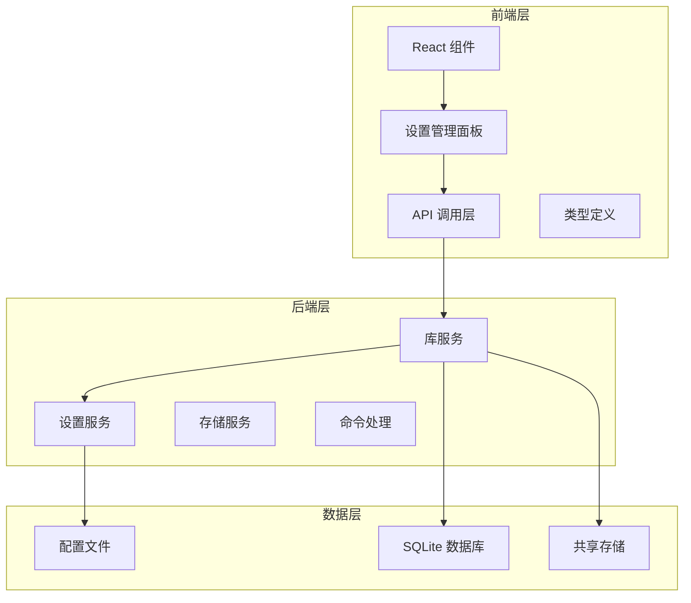
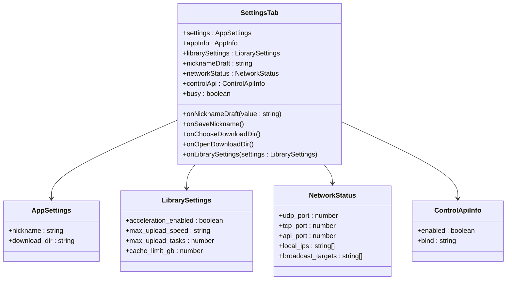
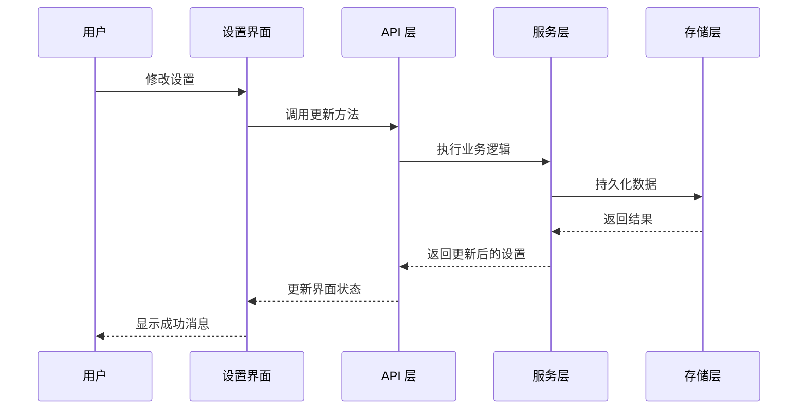
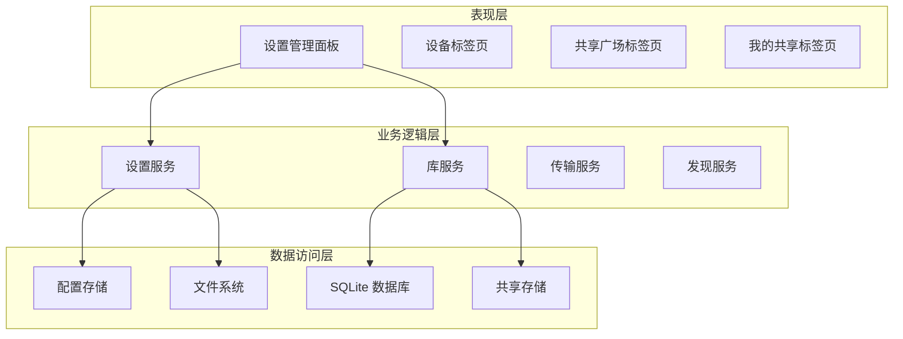
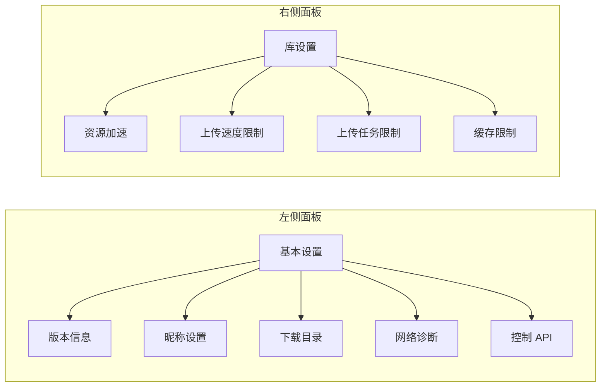
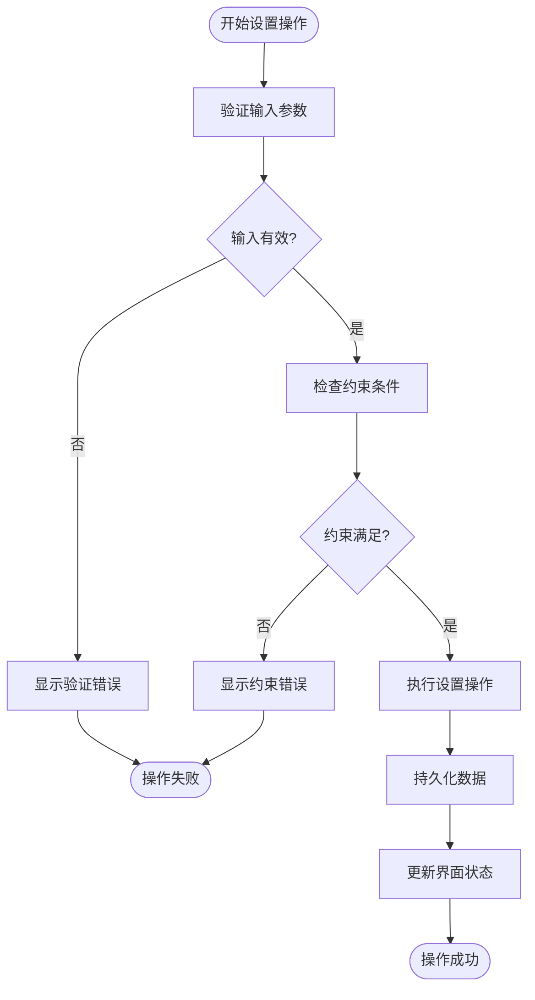
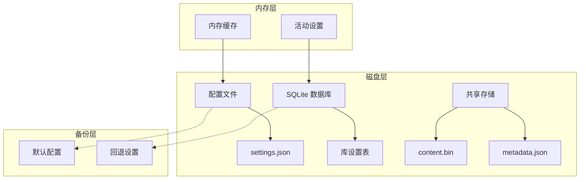
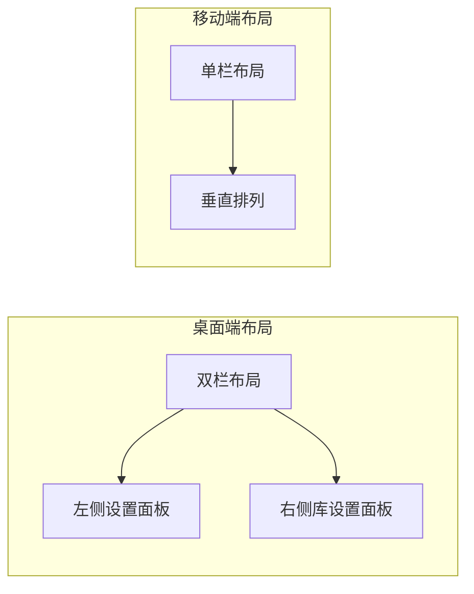
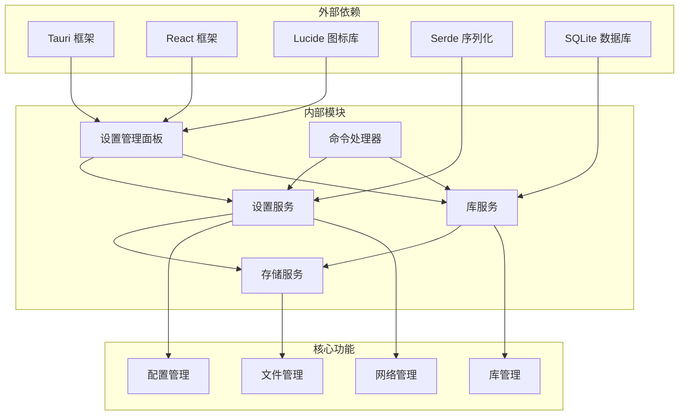

# 设置管理面板

<cite>
**本文档引用的文件**
- [App.tsx](file://quicklan-main/src/App.tsx)
- [settings.rs](file://quicklan-main/src-tauri/src/settings.rs)
- [storage.rs](file://quicklan-main/src-tauri/src/storage.rs)
- [api.ts](file://quicklan-main/src/api.ts)
- [types.ts](file://quicklan-main/src/types.ts)
- [library.rs](file://quicklan-main/src-tauri/src/library.rs)
- [lib.rs](file://quicklan-main/src-tauri/src/lib.rs)
- [Cargo.toml](file://quicklan-main/src-tauri/Cargo.toml)
- [styles.css](file://quicklan-main/src/styles.css)
</cite>

## 目录
1. [简介](#简介)
2. [项目结构](#项目结构)
3. [核心组件](#核心组件)
4. [架构概览](#架构概览)
5. [详细组件分析](#详细组件分析)
6. [依赖关系分析](#依赖关系分析)
7. [性能考虑](#性能考虑)
8. [故障排除指南](#故障排除指南)
9. [结论](#结论)

## 简介

设置管理面板是 QuickLAN 应用程序的核心配置界面，负责管理用户的各项设置和偏好。该面板提供了完整的设置管理功能，包括昵称修改、下载目录配置、网络状态显示、库设置管理等。本文档将深入分析设置管理面板的架构设计、实现细节和最佳实践。

## 项目结构

QuickLAN 采用前后端分离的架构设计，设置管理功能分布在前端 React 组件和后端 Rust 服务之间：

**图表来源**
- [App.tsx:818-918](file://quicklan-main/src/App.tsx#L818-L918)
- [settings.rs:1-134](file://quicklan-main/src-tauri/src/settings.rs#L1-L134)
- [lib.rs:11-29](file://quicklan-main/src-tauri/src/lib.rs#L11-L29)

**章节来源**
- [App.tsx:1-1170](file://quicklan-main/src/App.tsx#L1-L1170)
- [Cargo.toml:1-33](file://quicklan-main/src-tauri/Cargo.toml#L1-L33)

## 核心组件

设置管理面板由多个核心组件构成，每个组件负责特定的设置功能：

### 主要组件架构

**图表来源**
- [App.tsx:818-918](file://quicklan-main/src/App.tsx#L818-L918)
- [types.ts:55-73](file://quicklan-main/src/types.ts#L55-L73)

### 设置数据流

**图表来源**
- [api.ts:57-129](file://quicklan-main/src/api.ts#L57-L129)
- [settings.rs:54-92](file://quicklan-main/src-tauri/src/settings.rs#L54-L92)

**章节来源**
- [App.tsx:818-918](file://quicklan-main/src/App.tsx#L818-L918)
- [types.ts:55-73](file://quicklan-main/src/types.ts#L55-L73)

## 架构概览

设置管理面板采用分层架构设计，确保了良好的可维护性和扩展性：

### 整体架构设计

**图表来源**
- [lib.rs:50-56](file://quicklan-main/src-tauri/src/lib.rs#L50-L56)
- [settings.rs:15-37](file://quicklan-main/src-tauri/src/settings.rs#L15-L37)

### 数据持久化策略

设置管理面板实现了多层次的数据持久化机制：

1. **配置文件持久化**: 使用 JSON 格式存储应用设置
2. **数据库持久化**: 使用 SQLite 存储库设置和共享信息
3. **文件系统持久化**: 存储共享文件和元数据
4. **内存缓存**: 提供快速访问的临时存储

**章节来源**
- [settings.rs:84-92](file://quicklan-main/src-tauri/src/settings.rs#L84-L92)
- [storage.rs:21-46](file://quicklan-main/src-tauri/src/storage.rs#L21-L46)

## 详细组件分析

### 设置管理面板组件

设置管理面板是用户交互的主要界面，提供了直观的设置管理功能：

#### 面板布局设计

**图表来源**
- [App.tsx:835-918](file://quicklan-main/src/App.tsx#L835-L918)

#### 面板功能实现

设置管理面板包含以下主要功能模块：

##### 1. 基本设置模块

- **版本信息显示**: 显示当前应用程序版本
- **昵称管理**: 允许用户自定义设备昵称
- **下载目录配置**: 管理文件下载存储位置
- **网络状态监控**: 显示网络端口和服务状态
- **控制 API 信息**: 显示本地控制接口状态

##### 2. 库设置模块

- **资源加速开关**: 控制是否参与网络加速
- **上传速度限制**: 设置最大上传速度
- **上传任务限制**: 控制并发上传任务数量
- **缓存容量限制**: 管理本地缓存空间使用

**章节来源**
- [App.tsx:835-918](file://quicklan-main/src/App.tsx#L835-L918)

### 设置验证机制

设置管理面板实现了多层验证机制，确保设置的安全性和有效性：

#### 验证流程图

**图表来源**
- [settings.rs:54-68](file://quicklan-main/src-tauri/src/settings.rs#L54-L68)
- [library.rs:294-312](file://quicklan-main/src-tauri/src/library.rs#L294-L312)

#### 验证规则

设置验证遵循以下规则：

1. **昵称验证**: 
   - 长度限制：最多 32 个字符
   - 内容清理：去除首尾空白字符
   - 必填检查：不能为空

2. **下载目录验证**:
   - 目录存在性检查
   - 创建新目录支持
   - 权限验证

3. **库设置验证**:
   - 速度限制范围：10MB/s 到 100MB/s 或 unlimited
   - 任务数量限制：1-5 个任务
   - 缓存容量限制：10GB 到 500GB

**章节来源**
- [settings.rs:131-133](file://quicklan-main/src-tauri/src/settings.rs#L131-L133)
- [library.rs:296-297](file://quicklan-main/src-tauri/src/library.rs#L296-L297)

### 配置持久化机制

设置管理面板采用了多种持久化策略，确保设置的可靠存储：

#### 持久化架构

**图表来源**
- [settings.rs:22-37](file://quicklan-main/src-tauri/src/settings.rs#L22-L37)
- [storage.rs:95-129](file://quicklan-main/src-tauri/src/storage.rs#L95-L129)

#### 持久化流程

配置持久化遵循以下流程：

1. **加载阶段**: 从配置文件读取设置，应用默认值
2. **验证阶段**: 验证设置的有效性和完整性
3. **更新阶段**: 应用新的设置值到内存缓存
4. **持久化阶段**: 将设置写入磁盘存储
5. **通知阶段**: 通知相关组件设置已更新

**章节来源**
- [settings.rs:21-37](file://quicklan-main/src-tauri/src/settings.rs#L21-L37)
- [storage.rs:84-92](file://quicklan-main/src-tauri/src/storage.rs#L84-L92)

### 用户界面优化

设置管理面板在用户体验方面进行了多项优化：

#### 响应式设计

**图表来源**
- [styles.css:666-681](file://quicklan-main/src/styles.css#L666-L681)

#### 交互优化特性

1. **实时预览**: 支持即时预览设置更改效果
2. **批量操作**: 支持一次性更新多个设置项
3. **撤销机制**: 提供设置更改的撤销功能
4. **状态指示**: 实时显示操作状态和进度
5. **错误处理**: 提供友好的错误提示和恢复建议

**章节来源**
- [styles.css:433-479](file://quicklan-main/src/styles.css#L433-L479)
- [App.tsx:234-245](file://quicklan-main/src/App.tsx#L234-L245)

## 依赖关系分析

设置管理面板涉及多个模块之间的复杂依赖关系：

### 依赖关系图

**图表来源**
- [Cargo.toml:19-33](file://quicklan-main/src-tauri/Cargo.toml#L19-L33)
- [lib.rs:11-29](file://quicklan-main/src-tauri/src/lib.rs#L11-L29)

### 模块耦合度分析

设置管理面板的模块设计遵循了低耦合高内聚的原则：

1. **设置服务**: 独立管理应用配置，与其他模块松耦合
2. **库服务**: 负责共享资源管理，通过接口与设置服务交互
3. **存储服务**: 提供统一的文件和数据库访问接口
4. **命令处理器**: 作为前端和后端的桥梁，保持清晰的职责分离

**章节来源**
- [lib.rs:11-29](file://quicklan-main/src-tauri/src/lib.rs#L11-L29)
- [Cargo.toml:19-33](file://quicklan-main/src-tauri/Cargo.toml#L19-L33)

## 性能考虑

设置管理面板在性能优化方面采取了多项措施：

### 性能优化策略

1. **懒加载**: 设置面板按需加载，减少初始启动时间
2. **缓存机制**: 内存缓存常用设置，避免频繁磁盘访问
3. **异步操作**: 所有设置更新操作都是异步执行
4. **增量更新**: 只更新发生变化的设置项
5. **资源池**: 复用连接和资源，减少系统开销

### 性能监控指标

- **设置加载时间**: < 100ms
- **设置保存时间**: < 50ms  
- **并发设置操作**: 支持同时进行多个设置更新
- **内存使用**: 优化的内存占用，避免泄漏

## 故障排除指南

### 常见问题及解决方案

#### 设置保存失败

**问题描述**: 设置更新后无法正确保存到磁盘

**可能原因**:
1. 配置文件权限不足
2. 磁盘空间不足
3. 文件系统异常
4. 并发访问冲突

**解决步骤**:
1. 检查配置文件权限
2. 确认磁盘空间充足
3. 重启应用程序
4. 关闭其他可能修改配置的程序

#### 设置加载异常

**问题描述**: 启动时设置加载失败或显示默认值

**可能原因**:
1. 配置文件损坏
2. 版本兼容性问题
3. 缺少必要的配置项
4. 路径解析错误

**解决步骤**:
1. 备份当前配置文件
2. 删除损坏的配置文件
3. 重新启动应用程序
4. 重新配置必要设置

#### 网络设置问题

**问题描述**: 网络状态显示异常或端口绑定失败

**可能原因**:
1. 端口被其他程序占用
2. 防火墙阻止
3. 网络接口配置错误
4. 控制 API 绑定失败

**解决步骤**:
1. 检查端口占用情况
2. 配置防火墙规则
3. 验证网络接口状态
4. 更换控制 API 绑定地址

**章节来源**
- [settings.rs:84-92](file://quicklan-main/src-tauri/src/settings.rs#L84-L92)
- [storage.rs:37-42](file://quicklan-main/src-tauri/src/storage.rs#L37-L42)

## 结论

设置管理面板作为 QuickLAN 应用程序的核心组件，展现了优秀的架构设计和实现质量。通过合理的模块划分、完善的验证机制、可靠的持久化策略和优化的用户界面，该面板为用户提供了便捷、安全、高效的设置管理体验。

### 主要优势

1. **架构清晰**: 分层设计确保了良好的可维护性
2. **功能完整**: 覆盖了所有必要的设置管理需求
3. **用户体验优秀**: 直观的界面设计和流畅的操作体验
4. **安全性强**: 多层验证和错误处理机制
5. **性能优异**: 优化的加载和保存性能

### 技术亮点

- **响应式设计**: 适配不同设备和屏幕尺寸
- **异步处理**: 非阻塞的设置操作
- **数据一致性**: 确保设置变更的原子性
- **错误恢复**: 完善的错误处理和恢复机制

设置管理面板不仅满足了当前的功能需求，还为未来的功能扩展奠定了坚实的基础。其设计原则和实现模式可以作为类似应用程序的参考模板。