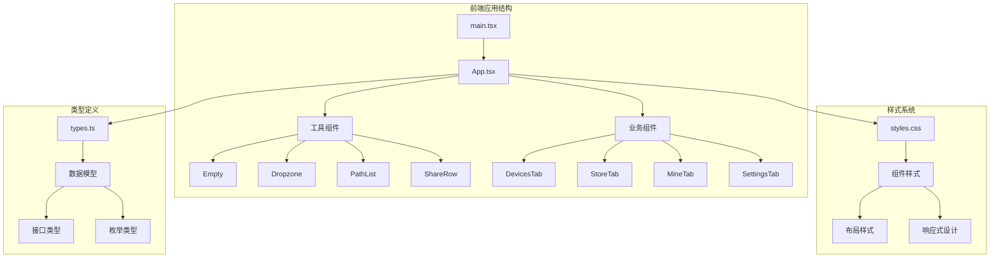
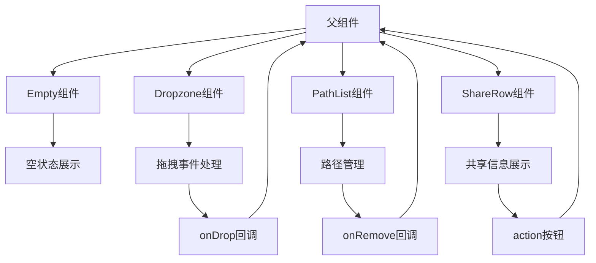
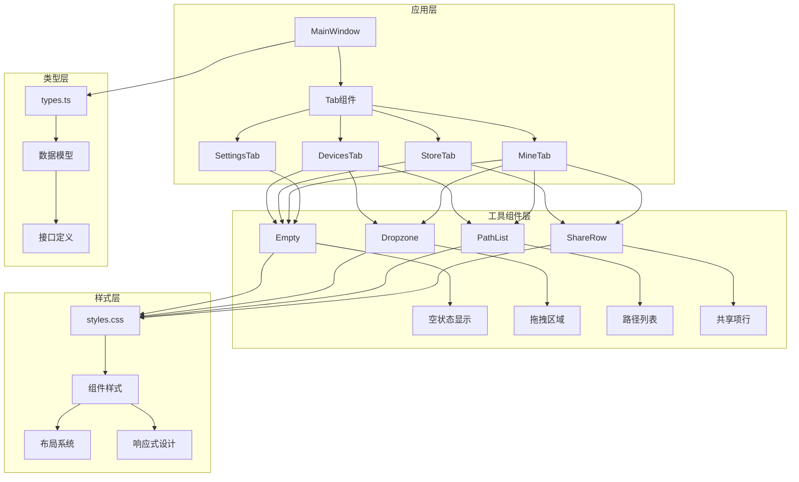
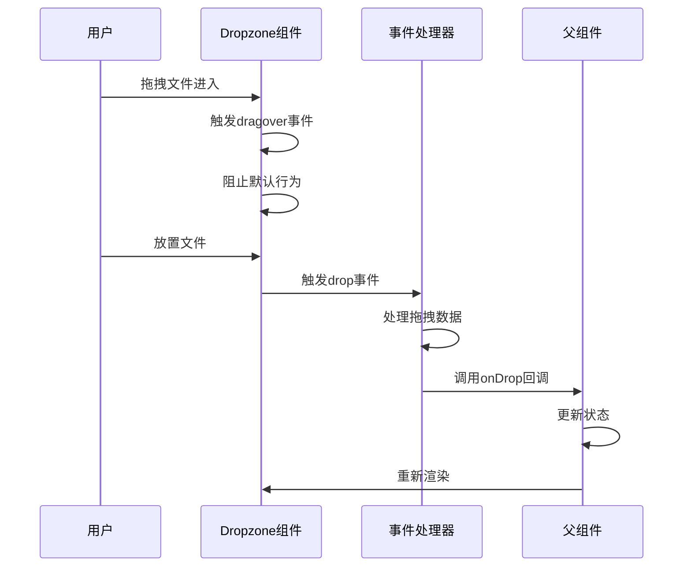
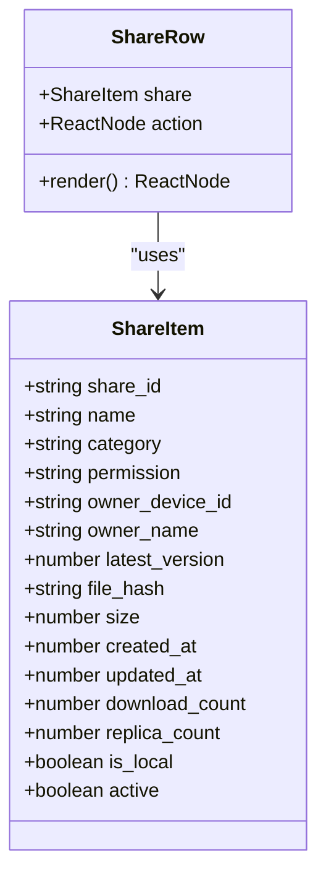

# 工具组件

<cite>
**本文档引用的文件**
- [App.tsx](file://quicklan-main/src/App.tsx)
- [main.tsx](file://quicklan-main/src/main.tsx)
- [styles.css](file://quicklan-main/src/styles.css)
- [types.ts](file://quicklan-main/src/types.ts)
- [package.json](file://quicklan-main/package.json)
</cite>

## 目录
1. [简介](#简介)
2. [项目结构](#项目结构)
3. [核心组件](#核心组件)
4. [架构概览](#架构概览)
5. [详细组件分析](#详细组件分析)
6. [依赖关系分析](#依赖关系分析)
7. [性能考虑](#性能考虑)
8. [故障排除指南](#故障排除指南)
9. [结论](#结论)

## 简介

QuickLAN 是一个基于 React 和 Tauri 的局域网文件共享与传输应用。本文档专注于其通用工具组件的设计与实现，包括 Empty（空状态显示）、Dropzone（拖拽区域）、PathList（路径列表）、ShareRow（共享项行）等核心组件。这些组件采用高度可复用的设计模式，通过参数化配置和事件处理机制实现了良好的扩展性和一致性。

## 项目结构

QuickLAN 项目采用模块化的前端架构，主要包含以下关键文件：



**图表来源**
- [main.tsx:1-11](file://quicklan-main/src/main.tsx#L1-L11)
- [App.tsx:1-1170](file://quicklan-main/src/App.tsx#L1-L1170)

**章节来源**
- [main.tsx:1-11](file://quicklan-main/src/main.tsx#L1-L11)
- [App.tsx:1-1170](file://quicklan-main/src/App.tsx#L1-L1170)

## 核心组件

QuickLAN 的工具组件系统由四个核心组件构成，每个组件都遵循统一的设计原则：

### 组件设计原则

1. **参数化配置**：所有组件都接受明确的 props 参数
2. **事件驱动**：通过回调函数处理用户交互
3. **样式解耦**：样式通过 CSS 类名管理，支持主题定制
4. **类型安全**：使用 TypeScript 定义严格的接口类型
5. **可复用性**：组件设计独立，可在不同场景下重用

### 数据流架构



**图表来源**
- [App.tsx:1124-1131](file://quicklan-main/src/App.tsx#L1124-L1131)
- [App.tsx:920-939](file://quicklan-main/src/App.tsx#L920-L939)
- [App.tsx:941-955](file://quicklan-main/src/App.tsx#L941-L955)
- [App.tsx:957-977](file://quicklan-main/src/App.tsx#L957-L977)

**章节来源**
- [App.tsx:1124-1131](file://quicklan-main/src/App.tsx#L1124-L1131)
- [App.tsx:920-939](file://quicklan-main/src/App.tsx#L920-L939)
- [App.tsx:941-955](file://quicklan-main/src/App.tsx#L941-L955)
- [App.tsx:957-977](file://quicklan-main/src/App.tsx#L957-L977)

## 架构概览

QuickLAN 采用分层架构设计，工具组件位于应用的核心层，为上层业务组件提供基础功能支撑。



**图表来源**
- [App.tsx:78-84](file://quicklan-main/src/App.tsx#L78-L84)
- [App.tsx:575-665](file://quicklan-main/src/App.tsx#L575-L665)
- [App.tsx:667-717](file://quicklan-main/src/App.tsx#L667-L717)
- [App.tsx:719-816](file://quicklan-main/src/App.tsx#L719-L816)

**章节来源**
- [App.tsx:78-84](file://quicklan-main/src/App.tsx#L78-L84)
- [App.tsx:575-816](file://quicklan-main/src/App.tsx#L575-L816)

## 详细组件分析

### Empty 组件

Empty 组件是 QuickLAN 中最简单的工具组件，专门用于显示空状态信息。

#### 组件特性

- **最小化设计**：仅包含图标和文本内容
- **语义化结构**：使用语义化的 HTML 结构
- **样式隔离**：通过 CSS 类名实现样式隔离
- **灵活内容**：支持任意 React 节点作为图标

#### 属性定义

| 属性名 | 类型 | 必需 | 描述 |
|--------|------|------|------|
| icon | React.ReactNode | 是 | 显示的图标元素 |
| text | string | 是 | 显示的文本内容 |

#### 使用示例

```typescript
// 在设备列表为空时显示
{devices.length === 0 ? (
  <Empty icon={<Laptop size={34} />} text="等待局域网内的 QuickLAN 设备出现" />
) : (
  // 设备列表内容
)}

// 在共享资源列表为空时显示
{shares.length === 0 ? (
  <Empty icon={<Library size={34} />} text="暂无可下载的共享资源" />
) : (
  // 共享资源列表
)}
```

#### 样式定制

Empty 组件的样式通过 `.empty` 类名定义，支持以下自定义选项：

```css
.empty {
  min-height: 132px;
  display: grid;
  place-items: center;
  align-content: center;
  gap: 8px;
  color: #75889a;
  text-align: center;
}
```

**章节来源**
- [App.tsx:1124-1131](file://quicklan-main/src/App.tsx#L1124-L1131)
- [styles.css:544-552](file://quicklan-main/src/styles.css#L544-L552)

### Dropzone 组件

Dropzone 组件提供了拖拽文件上传的功能，是 QuickLAN 中最重要的交互组件之一。

#### 组件特性

- **拖拽事件处理**：完整实现 HTML5 拖拽 API
- **视觉反馈**：提供拖拽悬停效果
- **事件冒泡控制**：防止默认行为和事件冒泡
- **灵活配置**：支持自定义图标、标题和描述

#### 属性定义

| 属性名 | 类型 | 必需 | 描述 |
|--------|------|------|------|
| icon | React.ReactNode | 是 | 显示的图标元素 |
| title | string | 是 | 主要标题文本 |
| text | string | 是 | 描述性文本 |
| onDrop | (paths: string[]) => void | 是 | 拖拽释放时的回调函数 |

#### 事件处理机制



**图表来源**
- [App.tsx:920-939](file://quicklan-main/src/App.tsx#L920-L939)

#### 使用示例

```typescript
// 在设备快传功能中使用
<Dropzone
  icon={<UploadCloud size={42} />}
  title="拖入文件进行点对点快传"
  text="接收方确认后开始传输，完成后进行 SHA256 校验。"
  onDrop={props.onAddFiles}
/>

// 在共享发布功能中使用
<Dropzone
  icon={<HardDrive size={42} />}
  title="拖入文件加入 Shared Store"
  text="发布时会创建共享副本，原始文件后续修改不会影响已共享版本。"
  onDrop={props.onAddDraftPaths}
/>
```

#### 样式定制

Dropzone 组件的样式通过 `.dropzone` 类名定义，支持以下自定义选项：

```css
.dropzone {
  min-height: 178px;
  border: 2px dashed #b8cce0;
  border-radius: 8px;
  background: #f7fbff;
  display: grid;
  place-items: center;
  align-content: center;
  gap: 10px;
  text-align: center;
  color: #37516a;
  padding: 22px;
}
```

**章节来源**
- [App.tsx:920-939](file://quicklan-main/src/App.tsx#L920-L939)
- [styles.css:295-311](file://quicklan-main/src/styles.css#L295-L311)

### PathList 组件

PathList 组件用于显示和管理文件路径列表，提供了路径的可视化展示和删除功能。

#### 组件特性

- **路径截断显示**：使用 `basename` 函数截断显示路径
- **标题提示**：完整路径作为标题显示
- **批量操作**：支持批量删除路径
- **空状态处理**：当路径列表为空时不渲染

#### 属性定义

| 属性名 | 类型 | 必需 | 描述 |
|--------|------|------|------|
| paths | string[] | 是 | 路径字符串数组 |
| onRemove | (path: string) => void | 是 | 删除路径时的回调函数 |

#### 复杂度分析

- **时间复杂度**：O(n)，其中 n 是路径数量
- **空间复杂度**：O(n)，用于存储路径列表

#### 使用示例

```typescript
// 在设备快传功能中使用
<PathList paths={props.filePaths} onRemove={props.onRemoveFile} />

// 在共享发布功能中使用
<PathList paths={props.draftPaths} onRemove={props.onRemoveDraftPath} />
```

#### 样式定制

PathList 组件的样式通过 `.file-list` 和 `.file-row` 类名定义：

```css
.file-list {
  display: grid;
  gap: 9px;
}

.file-row {
  justify-content: space-between;
  gap: 12px;
  border: 1px solid #e3eaf1;
  border-radius: 7px;
  padding: 9px 10px;
}
```

**章节来源**
- [App.tsx:941-955](file://quicklan-main/src/App.tsx#L941-L955)
- [styles.css:237-241](file://quicklan-main/src/styles.css#L237-L241)
- [styles.css:328-334](file://quicklan-main/src/styles.css#L328-L334)

### ShareRow 组件

ShareRow 组件用于展示共享资源的详细信息，是 QuickLAN 中最重要的信息展示组件。

#### 组件特性

- **多列布局**：使用 CSS Grid 实现复杂的布局结构
- **信息层次化**：将共享信息分为主内容和元数据
- **动态状态**：根据共享权限显示不同的标签
- **灵活操作**：支持自定义的操作按钮

#### 属性定义

| 属性名 | 类型 | 必需 | 描述 |
|--------|------|------|------|
| share | ShareItem | 是 | 共享资源数据对象 |
| action | React.ReactNode | 是 | 操作按钮或控件 |

#### 数据模型

ShareRow 组件基于 `ShareItem` 类型，该类型定义了共享资源的所有属性：



**图表来源**
- [types.ts:75-91](file://quicklan-main/src/types.ts#L75-L91)
- [App.tsx:957-977](file://quicklan-main/src/App.tsx#L957-L977)

#### 使用示例

```typescript
// 在共享广场中使用
{props.shares.map((share) => (
  <ShareRow
    key={share.share_id}
    share={share}
    action={
      <button className="primary compact" disabled={props.busy} onClick={() => props.onDownload(share)}>
        <Download size={16} /> 下载
      </button>
    }
  />
))}

// 在我的共享中使用
{props.shares.map((share) => (
  <ShareRow
    key={share.share_id}
    share={share}
    action={
      <div className="row-actions">
        <button className="secondary compact" onClick={() => props.onUpdate(share.share_id)}>
          <RefreshCw size={15} /> 更新
        </button>
        <button className="icon-button danger" onClick={() => props.onRemove(share.share_id)} title="取消共享">
          <Trash2 size={15} />
        </button>
      </div>
    }
  />
))}
```

#### 样式定制

ShareRow 组件的样式通过多个类名组合实现：

```css
.resource {
  display: grid;
  grid-template-columns: minmax(0, 1fr) auto auto;
  align-items: center;
  gap: 14px;
  border: 1px solid #dce4ed;
  border-radius: 8px;
  background: #fbfcfe;
  padding: 12px;
}

.resource-main {
  min-width: 0;
  display: grid;
  gap: 4px;
}

.resource-meta {
  justify-content: flex-end;
  gap: 7px;
  flex-wrap: wrap;
}
```

**章节来源**
- [App.tsx:957-977](file://quicklan-main/src/App.tsx#L957-L977)
- [types.ts:75-91](file://quicklan-main/src/types.ts#L75-L91)
- [styles.css:366-393](file://quicklan-main/src/styles.css#L366-L393)

## 依赖关系分析

QuickLAN 工具组件之间的依赖关系清晰且松散耦合，遵循单一职责原则。

```mermaid
graph TB
subgraph "外部依赖"
A[React] --> B[组件基础]
C[lucide-react] --> D[图标库]
E[@tauri-apps/api] --> F[Tauri集成]
end
subgraph "内部依赖"
G[App.tsx] --> H[Empty组件]
G --> I[Dropzone组件]
G --> J[PathList组件]
G --> K[ShareRow组件]
G --> L[工具函数]
L --> M[格式化函数]
L --> N[辅助函数]
end
subgraph "样式依赖"
O[styles.css] --> P[组件样式]
P --> Q[布局系统]
P --> R[响应式设计]
end
subgraph "类型依赖"
S[types.ts] --> T[数据模型]
T --> U[接口定义]
T --> V[枚举类型]
end
G --> O
G --> S
H --> O
I --> O
J --> O
K --> O
L --> S
```

**图表来源**
- [package.json:15-22](file://quicklan-main/package.json#L15-L22)
- [App.tsx:1-69](file://quicklan-main/src/App.tsx#L1-L69)

**章节来源**
- [package.json:15-22](file://quicklan-main/package.json#L15-L22)
- [App.tsx:1-69](file://quicklan-main/src/App.tsx#L1-L69)

## 性能考虑

### 组件优化策略

1. **虚拟化渲染**：对于大量数据的列表，可以考虑实现虚拟化渲染
2. **事件防抖**：在频繁触发的事件中使用防抖机制
3. **记忆化计算**：使用 `useMemo` 和 `useCallback` 优化重渲染
4. **懒加载**：对于大型组件实现懒加载机制

### 内存管理

- **及时清理**：确保事件监听器在组件卸载时正确清理
- **状态管理**：避免不必要的状态更新
- **引用优化**：使用稳定的引用避免不必要重渲染

### 性能监控

```typescript
// 示例：性能监控装饰器
function withPerformanceMonitoring(componentName: string) {
  return function(Component: React.ComponentType) {
    return function(props: any) {
      const start = performance.now();
      const result = <Component {...props} />;
      const end = performance.now();
      
      console.log(`${componentName} 渲染耗时: ${end - start}ms`);
      return result;
    };
  };
}
```

## 故障排除指南

### 常见问题及解决方案

#### 拖拽功能失效

**问题症状**：Dropzone 组件无法响应拖拽操作

**可能原因**：
1. 事件处理器未正确绑定
2. CSS 样式冲突
3. 浏览器兼容性问题

**解决方案**：
```typescript
// 确保正确的事件处理
<Dropzone
  icon={<UploadCloud size={42} />}
  title="拖入文件进行点对点快传"
  text="接收方确认后开始传输，完成后进行 SHA256 校验。"
  onDrop={(paths) => {
    console.log('拖拽的文件:', paths);
    // 处理拖拽逻辑
  }}
/>
```

#### 路径显示异常

**问题症状**：PathList 组件中的路径显示不完整或格式错误

**可能原因**：
1. 路径格式不符合预期
2. 字符串截断逻辑问题

**解决方案**：
```typescript
// 确保路径格式正确
const cleanPaths = paths.filter(Boolean); // 移除空值
setShareDraftPaths((current) => Array.from(new Set([...current, ...cleanPaths])));
```

#### 样式冲突

**问题症状**：组件样式与其他样式发生冲突

**解决方案**：
1. 检查 CSS 类名是否唯一
2. 使用更具体的选择器
3. 避免全局样式污染

**章节来源**
- [App.tsx:920-939](file://quicklan-main/src/App.tsx#L920-L939)
- [App.tsx:941-955](file://quicklan-main/src/App.tsx#L941-L955)

## 结论

QuickLAN 的工具组件系统展现了优秀的前端架构设计，通过 Empty、Dropzone、PathList、ShareRow 四个核心组件，构建了一个功能完善、可扩展的 UI 组件库。这些组件具有以下特点：

1. **设计一致性**：统一的 API 设计和样式规范
2. **高度可复用**：独立的功能模块，可在不同场景下重用
3. **类型安全**：完整的 TypeScript 类型定义
4. **易于扩展**：清晰的接口设计支持功能扩展
5. **性能优化**：合理的渲染策略和内存管理

通过参数化配置和事件驱动的设计模式，这些组件为 QuickLAN 应用提供了强大的基础功能，同时也为开发者提供了良好的扩展平台。建议在使用这些组件时遵循其设计原则，在保持一致性的前提下进行适当的定制化开发。