# 标签导航系统

<cite>
**本文档引用的文件**
- [App.tsx](file://quicklan-main/src/App.tsx)
- [main.tsx](file://quicklan-main/src/main.tsx)
- [styles.css](file://quicklan-main/src/styles.css)
- [types.ts](file://quicklan-main/src/types.ts)
- [api.ts](file://quicklan-main/src/api.ts)
- [package.json](file://quicklan-main/package.json)
</cite>

## 目录
1. [简介](#简介)
2. [项目结构](#项目结构)
3. [核心组件](#核心组件)
4. [架构概览](#架构概览)
5. [详细组件分析](#详细组件分析)
6. [依赖关系分析](#依赖关系分析)
7. [性能考虑](#性能考虑)
8. [故障排除指南](#故障排除指南)
9. [结论](#结论)

## 简介

QuickLAN 是一个基于 React 和 Tauri 构建的局域网文件共享与快传应用。标签导航系统是该应用的核心交互组件，提供了四个主要功能区域：设备管理、共享广场、我的共享、设置页面。本文档深入解析了 TabButton 组件的实现原理、样式设计规范，以及各标签页的功能定位和状态管理机制。

## 项目结构

QuickLAN 采用现代化的前端架构，主要由以下关键部分组成：

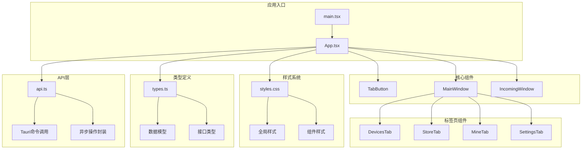

**图表来源**
- [main.tsx:1-11](file://quicklan-main/src/main.tsx#L1-L11)
- [App.tsx:78-84](file://quicklan-main/src/App.tsx#L78-L84)
- [styles.css:1-682](file://quicklan-main/src/styles.css#L1-L682)

**章节来源**
- [main.tsx:1-11](file://quicklan-main/src/main.tsx#L1-L11)
- [package.json:1-32](file://quicklan-main/package.json#L1-L32)

## 核心组件

### TabButton 组件

TabButton 是标签导航系统的核心组件，实现了简洁而功能完整的标签按钮设计。

#### 组件实现分析

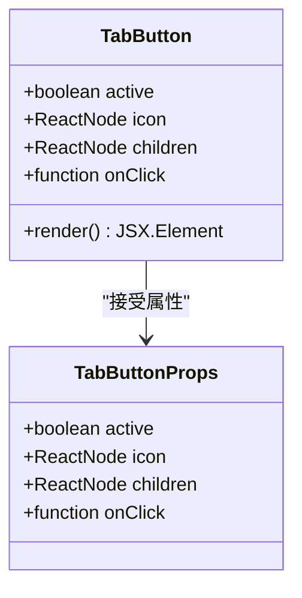

**图表来源**
- [App.tsx:556-573](file://quicklan-main/src/App.tsx#L556-L573)

#### 样式设计规范

TabButton 组件采用了精心设计的视觉层次和交互反馈机制：

| 属性 | 值 | 描述 |
|------|-----|------|
| 内边距 | 9px 13px | 提供舒适的点击区域 |
| 圆角半径 | 8px | 现代化的视觉风格 |
| 边框 | 1px 实线 | 区分按钮与背景 |
| 字体权重 | 800 | 强调标签重要性 |
| 图标尺寸 | 17px | 与文本保持视觉平衡 |

#### 状态管理机制

TabButton 通过简单的布尔属性 `active` 控制激活状态，与父组件的 `tab` 状态形成双向绑定关系。

**章节来源**
- [App.tsx:556-573](file://quicklan-main/src/App.tsx#L556-L573)
- [styles.css:107-124](file://quicklan-main/src/styles.css#L107-L124)

## 架构概览

QuickLAN 的标签导航系统采用集中式状态管理模式，所有标签页的状态都由 MainWindow 组件统一管理。

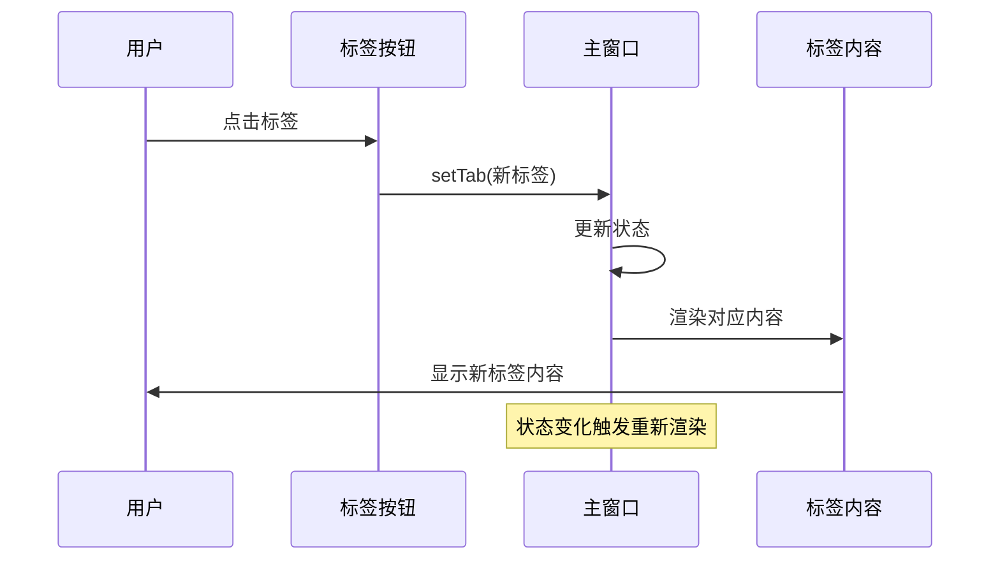

**图表来源**
- [App.tsx:86-87](file://quicklan-main/src/App.tsx#L86-L87)
- [App.tsx:272-284](file://quicklan-main/src/App.tsx#L272-L284)

### 状态管理架构

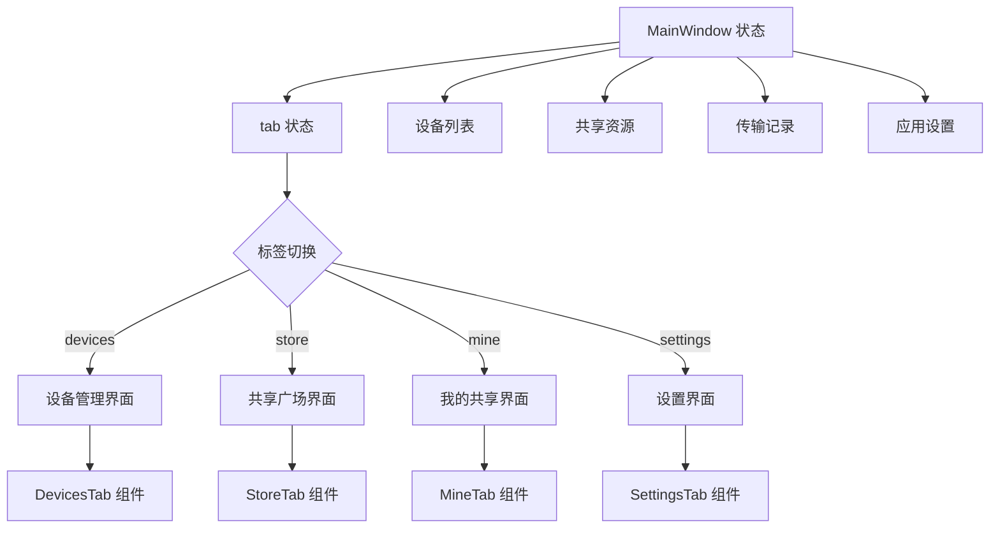

**图表来源**
- [App.tsx:86-116](file://quicklan-main/src/App.tsx#L86-L116)
- [App.tsx:304-458](file://quicklan-main/src/App.tsx#L304-L458)

**章节来源**
- [App.tsx:86-116](file://quicklan-main/src/App.tsx#L86-L116)
- [App.tsx:272-284](file://quicklan-main/src/App.tsx#L272-L284)

## 详细组件分析

### 四个主要标签页功能定位

#### 设备管理标签 (devices)

设备管理标签负责局域网内设备的发现、管理和文件传输功能。

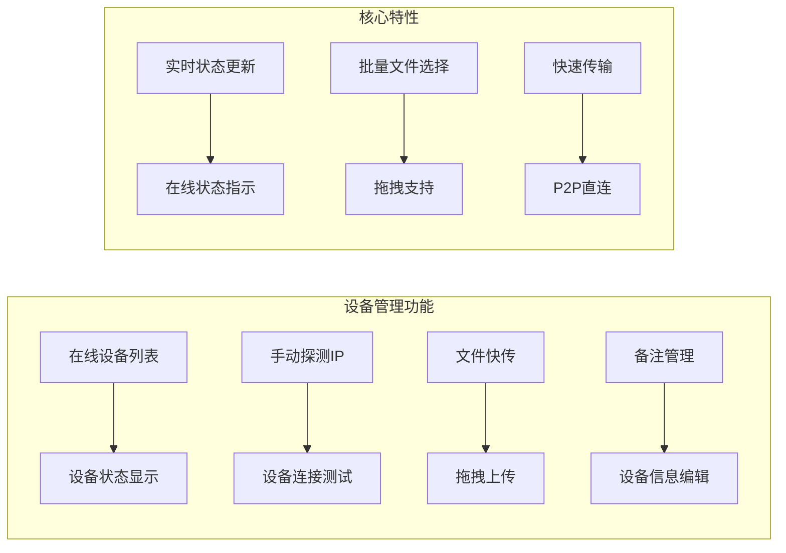

**图表来源**
- [App.tsx:575-665](file://quicklan-main/src/App.tsx#L575-L665)

**功能特点**：
- 实时设备状态监控和显示
- 支持手动IP探测和自动发现
- 文件快传功能，支持拖拽上传
- 设备备注和信息管理

#### 共享广场标签 (store)

共享广场标签提供全局共享资源的浏览、搜索和下载功能。

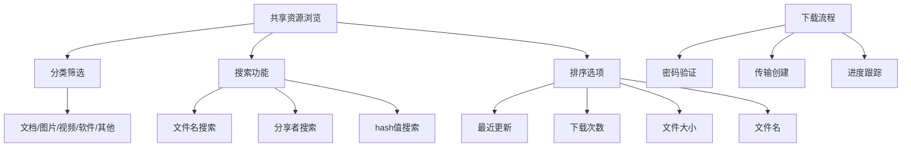

**图表来源**
- [App.tsx:667-717](file://quicklan-main/src/App.tsx#L667-L717)

**功能特点**：
- 多维度搜索和筛选
- 资源分类管理和排序
- 密码保护资源共享
- 实时下载进度跟踪

#### 我的共享标签 (mine)

我的共享标签专注于用户自己的资源共享和管理。

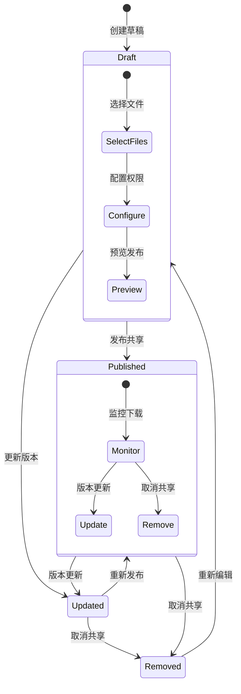

**图表来源**
- [App.tsx:719-816](file://quicklan-main/src/App.tsx#L719-L816)

**功能特点**：
- 多种权限模式（公开/密码）
- 分类管理和版本控制
- 发布流程自动化
- 下载统计和监控

#### 设置标签 (settings)

设置标签提供应用配置和系统诊断功能。

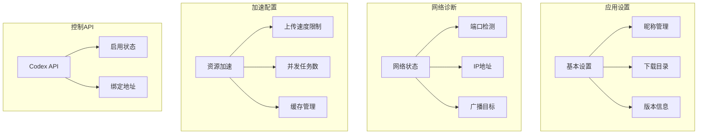

**图表来源**
- [App.tsx:818-918](file://quicklan-main/src/App.tsx#L818-L918)

**功能特点**：
- 应用基本信息和配置
- 网络状态诊断和监控
- 资源加速参数调节
- 控制API配置管理

**章节来源**
- [App.tsx:575-816](file://quicklan-main/src/App.tsx#L575-L816)

### 标签页切换的状态管理机制

标签页切换采用 React 的 useState Hook 实现集中式状态管理：

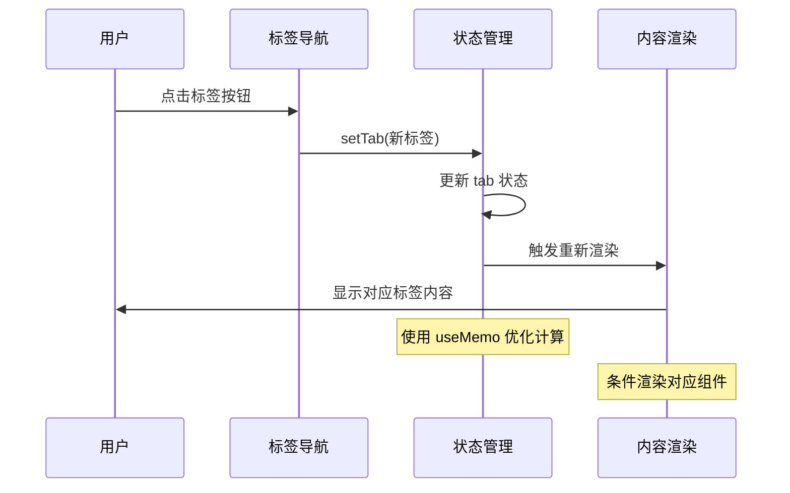

**图表来源**
- [App.tsx:87](file://quicklan-main/src/App.tsx#L87)
- [App.tsx:304-458](file://quicklan-main/src/App.tsx#L304-L458)

**章节来源**
- [App.tsx:87](file://quicklan-main/src/App.tsx#L87)
- [App.tsx:304-458](file://quicklan-main/src/App.tsx#L304-L458)

### 标签页内容区域的渲染策略

QuickLAN 采用条件渲染策略，根据当前标签状态动态渲染对应的内容组件：

```mermaid
flowchart TD
A[标签状态检查] --> B{tab === "devices"}
A --> C{tab === "store"}
A --> D{tab === "mine"}
A --> E{tab === "settings"}
B --> F[DevicesTab 组件]
C --> G[StoreTab 组件]
D --> H[MineTab 组件]
E --> I[SettingsTab 组件]
F --> J[设备管理界面]
G --> K[共享资源界面]
H --> L[我的共享界面]
I --> M[设置管理界面]
J --> N[实时设备监控]
K --> O[全局资源共享]
L --> P[个人资源共享]
M --> Q[系统配置管理]
```

**图表来源**
- [App.tsx:304-458](file://quicklan-main/src/App.tsx#L304-L458)

**章节来源**
- [App.tsx:304-458](file://quicklan-main/src/App.tsx#L304-L458)

## 依赖关系分析

### 外部依赖

QuickLAN 使用了现代化的前端技术栈，主要依赖包括：

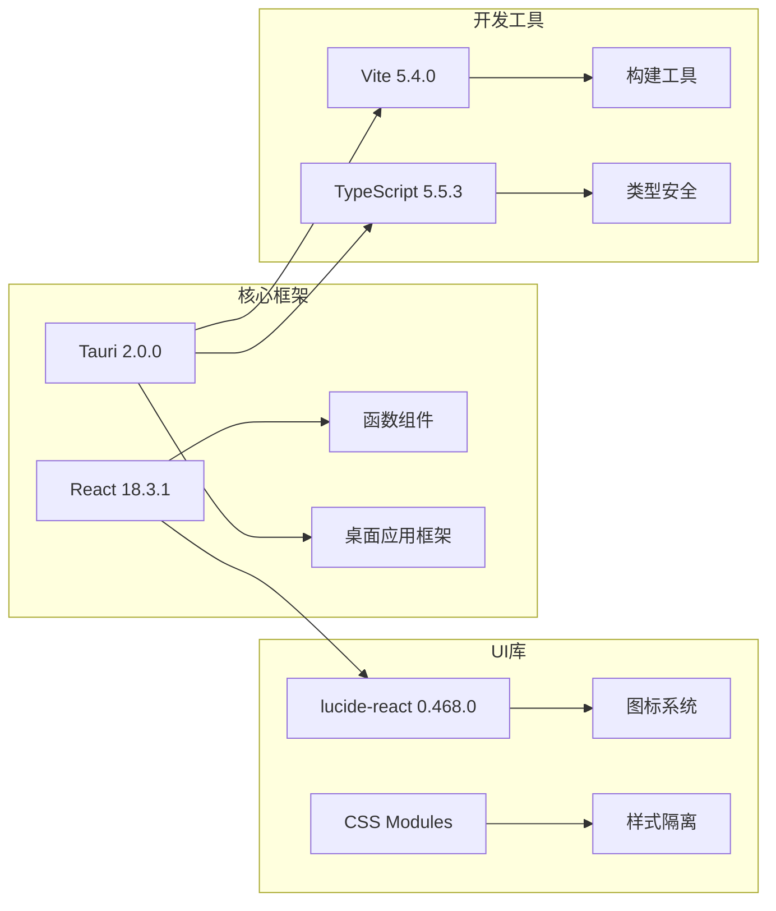

**图表来源**
- [package.json:15-22](file://quicklan-main/package.json#L15-L22)

### 内部模块依赖

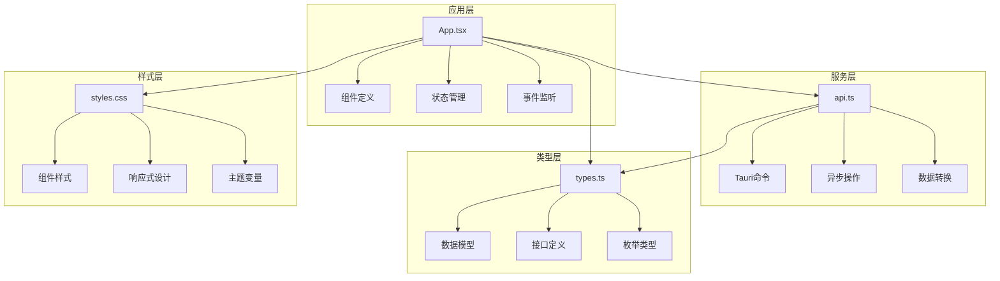

**图表来源**
- [App.tsx:1-69](file://quicklan-main/src/App.tsx#L1-L69)
- [api.ts:1-130](file://quicklan-main/src/api.ts#L1-L130)
- [types.ts:1-128](file://quicklan-main/src/types.ts#L1-L128)

**章节来源**
- [package.json:15-32](file://quicklan-main/package.json#L15-L32)
- [App.tsx:1-69](file://quicklan-main/src/App.tsx#L1-L69)

## 性能考虑

### 渲染优化策略

QuickLAN 采用了多种性能优化技术来确保流畅的用户体验：

1. **条件渲染**：只渲染当前激活的标签页内容
2. **状态分离**：将不同标签页的状态独立管理
3. **事件监听优化**：在组件卸载时正确清理事件监听器
4. **数据缓存**：利用 useMemo 优化复杂计算

### 性能监控指标

| 指标 | 目标值 | 说明 |
|------|--------|------|
| 首次渲染时间 | < 2 秒 | 确保快速启动体验 |
| 标签切换延迟 | < 100ms | 即时响应用户操作 |
| 内存使用 | < 100MB | 控制应用资源占用 |
| CPU 占用 | < 50% | 保持系统响应性 |

### 优化建议

1. **虚拟滚动**：对于大量共享资源，可考虑实现虚拟滚动
2. **懒加载**：对大型标签页内容实现按需加载
3. **缓存策略**：建立更完善的数据缓存机制
4. **并发优化**：优化多个 API 请求的并发处理

## 故障排除指南

### 常见问题及解决方案

#### 标签页不响应点击

**症状**：点击标签按钮但内容不变化

**可能原因**：
- 状态更新函数未正确传递
- 事件处理器绑定错误
- 组件重新渲染问题

**解决方法**：
1. 检查 `setTab` 函数的调用方式
2. 确认 `onClick` 事件处理器的正确绑定
3. 验证组件的重新渲染逻辑

#### 样式显示异常

**症状**：标签按钮样式不符合预期

**可能原因**：
- CSS 类名冲突
- 样式优先级问题
- 动态样式计算错误

**解决方法**：
1. 检查 `.tab` 和 `.tab.active` 类的定义
2. 验证 CSS 优先级顺序
3. 确认 `active` 状态的正确传递

#### 数据加载失败

**症状**：标签页内容为空或显示错误

**可能原因**：
- API 调用失败
- 数据格式不匹配
- 网络连接问题

**解决方法**：
1. 检查 API 调用的返回值
2. 验证数据类型的正确性
3. 添加错误处理和重试机制

**章节来源**
- [App.tsx:144-178](file://quicklan-main/src/App.tsx#L144-L178)
- [styles.css:107-124](file://quicklan-main/src/styles.css#L107-L124)

## 结论

QuickLAN 的标签导航系统展现了现代前端应用的最佳实践，通过精心设计的组件架构、清晰的状态管理机制和优雅的样式系统，为用户提供了直观易用的局域网文件共享体验。

### 主要优势

1. **简洁的组件设计**：TabButton 组件实现了最小必要功能，易于维护和扩展
2. **清晰的状态管理**：集中式状态管理模式确保了数据的一致性和可预测性
3. **优秀的用户体验**：流畅的标签切换和即时的视觉反馈
4. **完善的样式系统**：基于 CSS Grid 和 Flexbox 的响应式设计

### 技术亮点

- **TypeScript 类型安全**：完整的类型定义确保了代码质量
- **Tauri 集成**：原生桌面应用体验与 Web 技术的完美结合
- **现代化构建工具**：Vite 提供了快速的开发和构建体验
- **图标系统集成**：Lucide React 提供了丰富的图标资源

### 未来发展方向

1. **性能进一步优化**：实现更高级的渲染优化技术
2. **功能扩展**：增加更多标签页和功能模块
3. **用户体验改进**：增强交互反馈和视觉效果
4. **可访问性提升**：改善键盘导航和屏幕阅读器支持

通过持续的迭代和优化，QuickLAN 的标签导航系统将继续为用户提供卓越的局域网文件共享体验。