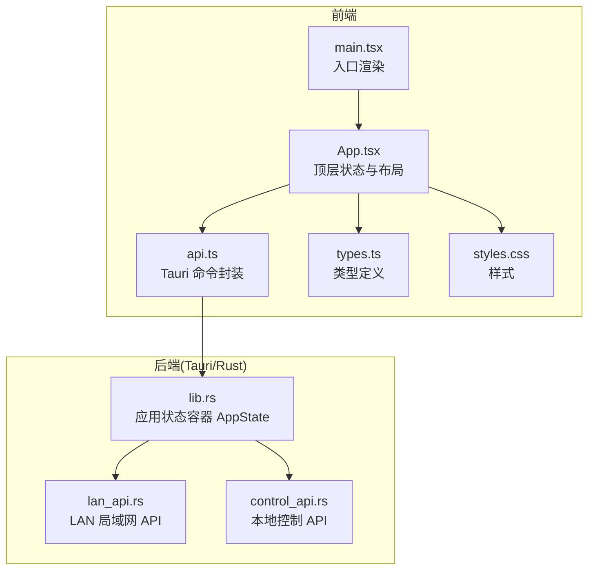
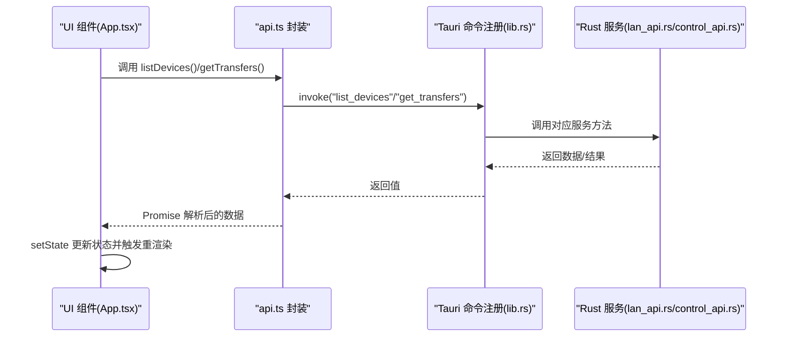
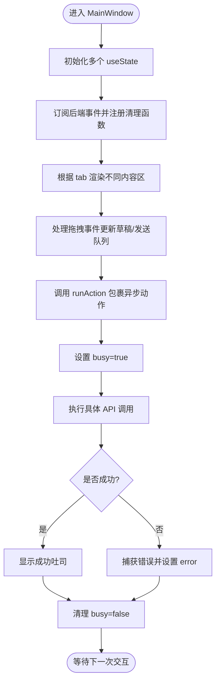
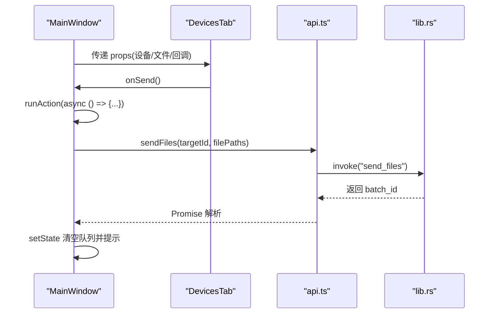
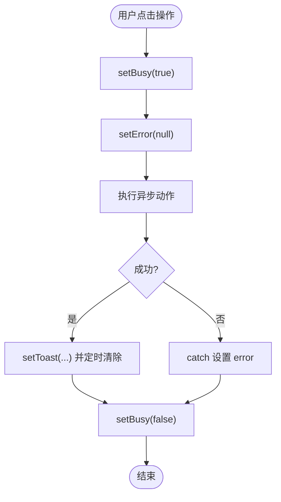
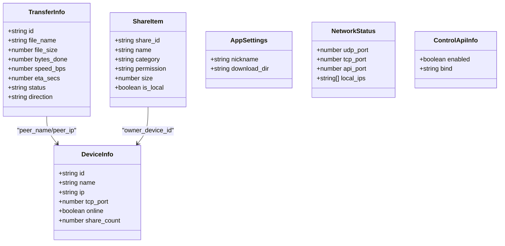
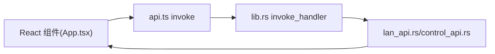

# 状态管理模式

<cite>
**本文引用的文件**
- [App.tsx](file://quicklan-main/src/App.tsx)
- [main.tsx](file://quicklan-main/src/main.tsx)
- [api.ts](file://quicklan-main/src/api.ts)
- [types.ts](file://quicklan-main/src/types.ts)
- [styles.css](file://quicklan-main/src/styles.css)
- [lib.rs](file://quicklan-main/src-tauri/src/lib.rs)
- [lan_api.rs](file://quicklan-main/src-tauri/src/lan_api.rs)
- [control_api.rs](file://quicklan-main/src-tauri/src/control_api.rs)
</cite>

## 目录
1. [简介](#简介)
2. [项目结构](#项目结构)
3. [核心组件](#核心组件)
4. [架构总览](#架构总览)
5. [详细组件分析](#详细组件分析)
6. [依赖关系分析](#依赖关系分析)
7. [性能考量](#性能考量)
8. [故障排查指南](#故障排查指南)
9. [结论](#结论)

## 简介
本文件系统性梳理 QuickLAN 前端的状态管理模式，重点覆盖以下方面：
- React Hooks 使用策略：useState、useEffect、useMemo 的最佳实践与适用场景
- 组件间状态共享机制：props 传递、事件回调、全局状态管理（基于 Tauri 事件与 API）
- 异步操作的状态管理：加载、错误、完成三态处理与用户反馈
- 状态提升与状态下沉的设计原则：在多标签页、弹窗、面板等复杂交互中的应用

## 项目结构
前端采用 React + TypeScript 构建，通过 @tauri-apps/api 与 Rust 后端通信；状态主要集中在顶层组件中集中管理，并通过 props 向子组件下放。

图表来源
- [main.tsx:1-11](file://quicklan-main/src/main.tsx#L1-L11)
- [App.tsx:1-120](file://quicklan-main/src/App.tsx#L1-L120)
- [api.ts:1-130](file://quicklan-main/src/api.ts#L1-L130)
- [lib.rs:138-250](file://quicklan-main/src-tauri/src/lib.rs#L138-L250)
- [lan_api.rs:19-51](file://quicklan-main/src-tauri/src/lan_api.rs#L19-L51)
- [control_api.rs:22-45](file://quicklan-main/src-tauri/src/control_api.rs#L22-L45)

章节来源
- [main.tsx:1-11](file://quicklan-main/src/main.tsx#L1-L11)
- [App.tsx:1-120](file://quicklan-main/src/App.tsx#L1-L120)
- [api.ts:1-130](file://quicklan-main/src/api.ts#L1-L130)
- [lib.rs:138-250](file://quicklan-main/src-tauri/src/lib.rs#L138-L250)

## 核心组件
- 顶层应用组件负责：
  - 集中式状态声明与更新（设备列表、共享资源、传输任务、设置、网络状态等）
  - 生命周期与事件监听（设备变更、传输进度、完成、失败等）
  - 异步动作的统一调度与错误处理
  - 多标签页内容区与弹窗的条件渲染

章节来源
- [App.tsx:78-554](file://quicklan-main/src/App.tsx#L78-L554)

## 架构总览
前端通过 @tauri-apps/api 的 invoke 调用后端命令，后端以 AppState 管理发现、传输、设置、库等服务；前端通过事件监听与 API 查询实现状态同步。

图表来源
- [api.ts:13-130](file://quicklan-main/src/api.ts#L13-L130)
- [lib.rs:218-246](file://quicklan-main/src-tauri/src/lib.rs#L218-L246)
- [lan_api.rs:77-114](file://quicklan-main/src-tauri/src/lan_api.rs#L77-L114)
- [control_api.rs:81-119](file://quicklan-main/src-tauri/src/control_api.rs#L81-L119)

## 详细组件分析

### 顶层状态与生命周期管理
- 状态声明
  - 设备、共享、传输、设置、应用信息、网络状态、选中设备、文件路径、筛选条件、排序、权限、密码、错误提示、吐司消息、忙碌态等
- 计算派生状态
  - 使用 useMemo 对资源列表进行过滤与排序，避免每次渲染都重新计算
- 生命周期与事件
  - useEffect 中订阅多个后端事件，收到事件后直接 setState，确保 UI 与后端状态保持一致
  - 通过 getCurrentWebview().onDragDropEvent 处理拖拽事件，动态更新草稿路径或快速发送队列
- 异步动作封装
  - runAction 将“设置忙碌态 → 清空错误 → 执行动作 → 成功提示/错误捕获 → 清理忙碌态”流程标准化

图表来源
- [App.tsx:86-178](file://quicklan-main/src/App.tsx#L86-L178)
- [App.tsx:234-245](file://quicklan-main/src/App.tsx#L234-L245)
- [App.tsx:144-178](file://quicklan-main/src/App.tsx#L144-L178)

章节来源
- [App.tsx:86-178](file://quicklan-main/src/App.tsx#L86-L178)
- [App.tsx:120-142](file://quicklan-main/src/App.tsx#L120-L142)
- [App.tsx:234-245](file://quicklan-main/src/App.tsx#L234-L245)

### 组件间状态共享机制
- Props 传递
  - MainWindow 将状态与回调以 props 下发至 DevicesTab、StoreTab、MineTab、SettingsTab、TransfersPanel 等子组件
- 事件回调
  - 子组件通过回调函数向上更新状态（如 onSend、onDownload、onPublish 等），由父组件统一处理异步逻辑与错误
- 全局状态管理
  - 通过 @tauri-apps/api 的事件系统（listen）实现跨组件的全局状态同步（设备列表、传输进度、完成/失败等）

图表来源
- [App.tsx:304-347](file://quicklan-main/src/App.tsx#L304-L347)
- [App.tsx:337-344](file://quicklan-main/src/App.tsx#L337-L344)
- [api.ts:21-23](file://quicklan-main/src/api.ts#L21-L23)
- [lib.rs:218-246](file://quicklan-main/src-tauri/src/lib.rs#L218-L246)

章节来源
- [App.tsx:304-347](file://quicklan-main/src/App.tsx#L304-L347)
- [App.tsx:337-344](file://quicklan-main/src/App.tsx#L337-L344)
- [api.ts:21-23](file://quicklan-main/src/api.ts#L21-L23)
- [lib.rs:218-246](file://quicklan-main/src-tauri/src/lib.rs#L218-L246)

### 异步操作的状态管理
- 加载态(busy)
  - 在 runAction 开始前设置 busy，结束时清理，用于禁用按钮与阻止重复提交
- 错误态(error)
  - try/catch 捕获异常，统一设置 error 并在 UI 中展示；支持一键关闭
- 完成态(toast)
  - 成功后设置 toast 并定时清除，提供轻量反馈
- 传输状态
  - 通过事件监听实时更新传输列表，使用 upsertTransfer 保证列表长度与去重

图表来源
- [App.tsx:234-245](file://quicklan-main/src/App.tsx#L234-L245)
- [App.tsx:295-302](file://quicklan-main/src/App.tsx#L295-L302)
- [App.tsx:215-218](file://quicklan-main/src/App.tsx#L215-L218)

章节来源
- [App.tsx:234-245](file://quicklan-main/src/App.tsx#L234-L245)
- [App.tsx:295-302](file://quicklan-main/src/App.tsx#L295-L302)
- [App.tsx:215-218](file://quicklan-main/src/App.tsx#L215-L218)

### 状态提升与状态下沉的设计原则
- 状态提升
  - 将跨区域共享的数据（如设备列表、传输列表、设置）提升到顶层组件，避免多处重复拉取与不一致
- 状态下沉
  - 将与 UI 行为强相关的临时状态（如搜索词、排序方式、草稿路径）下沉到对应 Tab 或子组件，减少顶层重渲染
- 事件驱动
  - 对于全局性状态（设备/传输），通过事件监听自动更新，无需层层 props 传递
- 作用域隔离
  - 不同 Tab 内部的状态尽量局部化，仅在需要时通过回调提升到顶层

章节来源
- [App.tsx:86-178](file://quicklan-main/src/App.tsx#L86-L178)
- [App.tsx:120-142](file://quicklan-main/src/App.tsx#L120-L142)

### 类型与数据模型
- 关键类型
  - 设备信息、传输信息、共享项、设置、网络状态、控制 API 信息等
- 传输状态枚举
  - pending、waiting_for_receiver、transferring、completed、rejected、failed

图表来源
- [types.ts:1-128](file://quicklan-main/src/types.ts#L1-L128)

章节来源
- [types.ts:1-128](file://quicklan-main/src/types.ts#L1-L128)

### 样式与交互反馈
- 吐司提示、错误条、模态框、传输面板等 UI 组件均通过状态驱动显示/隐藏
- 通过 CSS 动画实现吐司的淡入淡出效果

章节来源
- [styles.css:564-594](file://quicklan-main/src/styles.css#L564-L594)
- [App.tsx:295-302](file://quicklan-main/src/App.tsx#L295-L302)
- [App.tsx:551](file://quicklan-main/src/App.tsx#L551)

## 依赖关系分析
- 前端依赖
  - @tauri-apps/api 提供 invoke 与事件监听能力
  - lucide-react 提供图标
  - React 生态提供组件与 Hooks
- 后端依赖
  - Tauri 提供窗口、菜单、托盘、插件与命令注册
  - 自研服务模块（发现、传输、库、设置）通过 AppState 聚合

图表来源
- [App.tsx:1-69](file://quicklan-main/src/App.tsx#L1-L69)
- [api.ts:1-12](file://quicklan-main/src/api.ts#L1-L12)
- [lib.rs:218-246](file://quicklan-main/src-tauri/src/lib.rs#L218-L246)

章节来源
- [App.tsx:1-69](file://quicklan-main/src/App.tsx#L1-L69)
- [api.ts:1-12](file://quicklan-main/src/api.ts#L1-L12)
- [lib.rs:218-246](file://quicklan-main/src-tauri/src/lib.rs#L218-L246)

## 性能考量
- useMemo 的使用
  - 对资源列表的过滤与排序进行 memo 化，减少不必要的渲染与计算
- 并发拉取
  - 初次加载时使用 Promise.all 并发获取设备、传输、网络、设置等数据
- 事件驱动更新
  - 通过事件监听替代轮询，降低无效请求与渲染成本
- 传输列表截断
  - upsertTransfer 限制列表长度，避免内存膨胀

章节来源
- [App.tsx:120-142](file://quicklan-main/src/App.tsx#L120-L142)
- [App.tsx:180-200](file://quicklan-main/src/App.tsx#L180-L200)
- [App.tsx:208-213](file://quicklan-main/src/App.tsx#L208-L213)

## 故障排查指南
- 常见问题
  - 操作无响应：检查 busy 是否被长时间置为 true，确认 runAction 是否正确清理
  - 错误信息不消失：确认错误状态设置与关闭按钮逻辑
  - 传输状态不更新：检查事件监听是否注册成功，以及 upsertTransfer 的合并逻辑
- 调试建议
  - 在 runAction 中增加日志输出，定位异常抛出位置
  - 在 useEffect 注册处打印订阅事件名称，验证事件是否到达
  - 对关键 API 调用增加 try/catch 并设置 error，便于用户感知

章节来源
- [App.tsx:234-245](file://quicklan-main/src/App.tsx#L234-L245)
- [App.tsx:144-178](file://quicklan-main/src/App.tsx#L144-L178)
- [App.tsx:208-213](file://quicklan-main/src/App.tsx#L208-L213)

## 结论
QuickLAN 前端采用“顶层集中状态 + 子组件状态下沉”的模式，结合 useMemo 优化渲染、useEffect 管理生命周期与事件、runAction 规范异步流程，形成清晰、可维护且高性能的状态管理方案。通过 Tauri 事件与 API 的配合，实现了前后端状态的一致性与实时性。