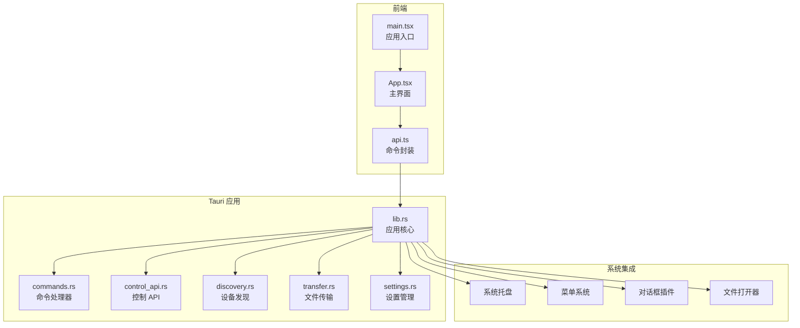
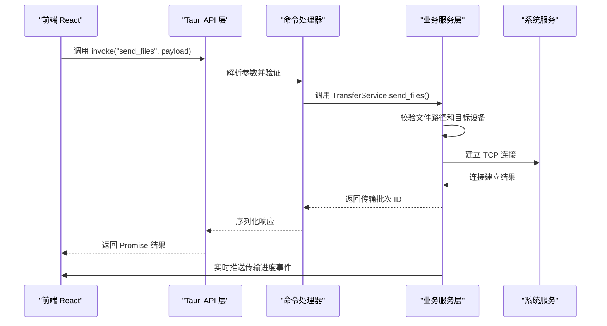
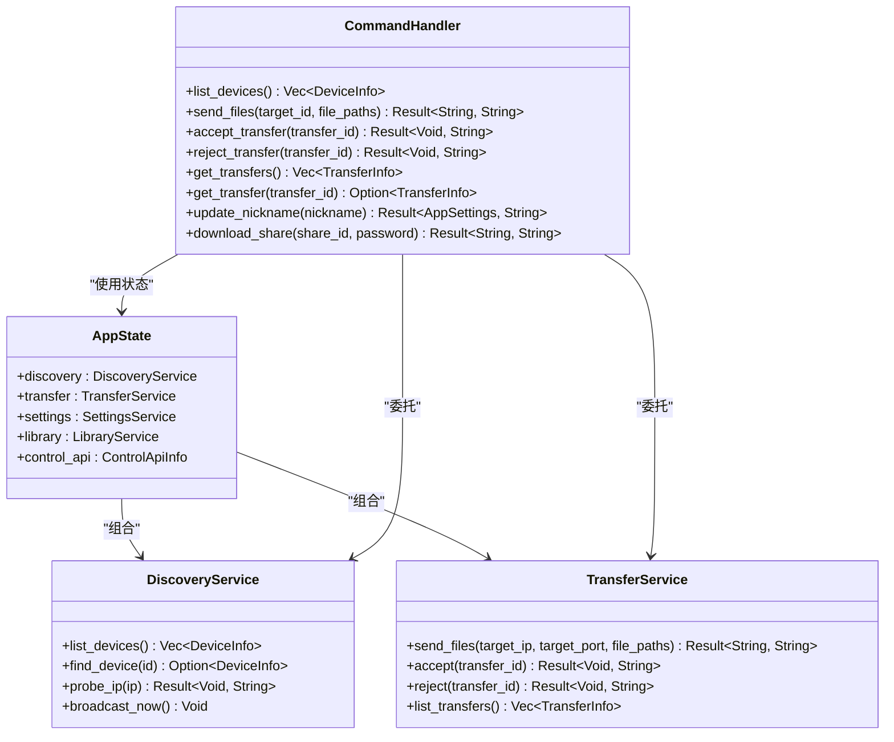
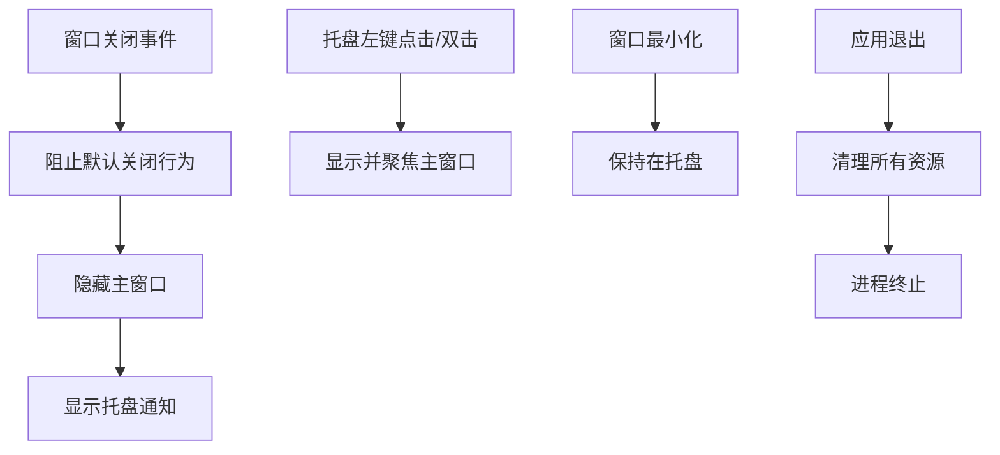
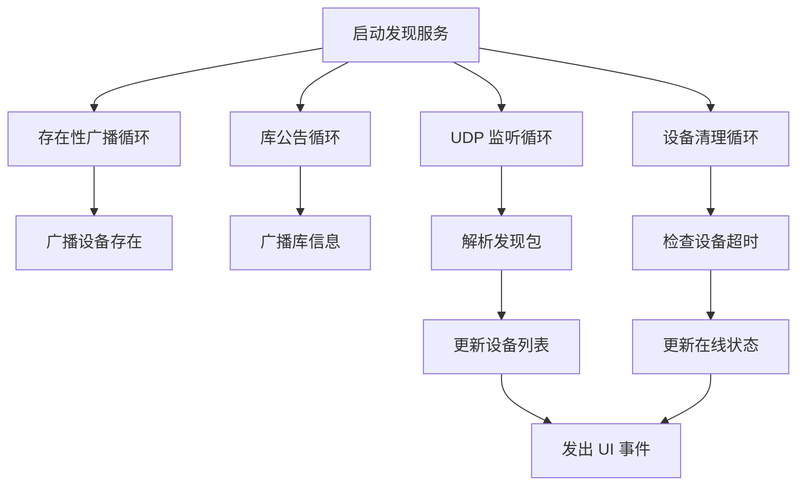
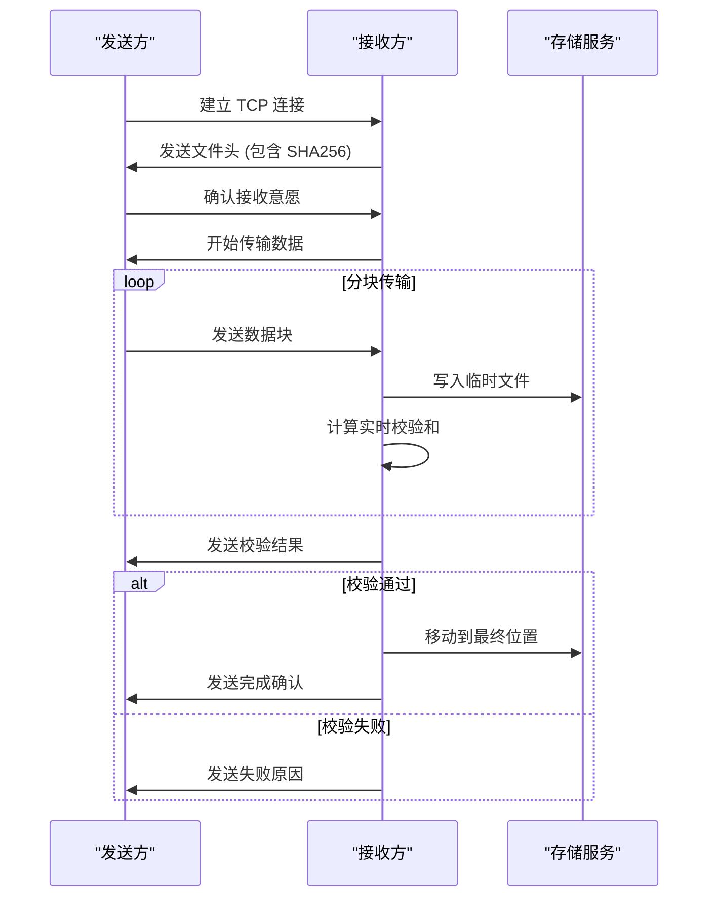
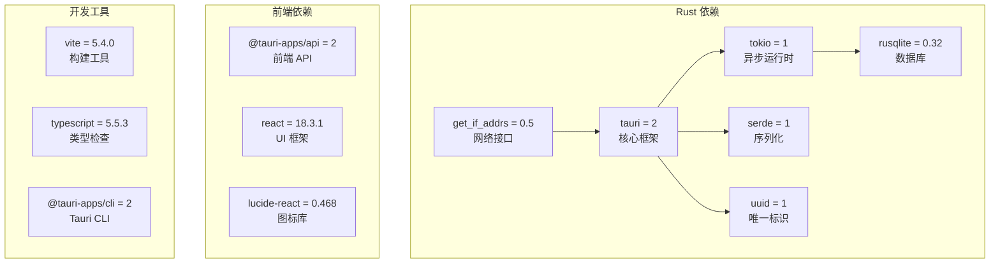

# Tauri 框架集成

<cite>
**本文档引用的文件**
- [Cargo.toml](file://quicklan-main/src-tauri/Cargo.toml)
- [tauri.conf.json](file://quicklan-main/src-tauri/tauri.conf.json)
- [main.rs](file://quicklan-main/src-tauri/src/main.rs)
- [lib.rs](file://quicklan-main/src-tauri/src/lib.rs)
- [commands.rs](file://quicklan-main/src-tauri/src/commands.rs)
- [control_api.rs](file://quicklan-main/src-tauri/src/control_api.rs)
- [discovery.rs](file://quicklan-main/src-tauri/src/discovery.rs)
- [transfer.rs](file://quicklan-main/src-tauri/src/transfer.rs)
- [settings.rs](file://quicklan-main/src-tauri/src/settings.rs)
- [package.json](file://quicklan-main/package.json)
- [main.tsx](file://quicklan-main/src/main.tsx)
- [App.tsx](file://quicklan-main/src/App.tsx)
- [api.ts](file://quicklan-main/src/api.ts)
- [vite.config.ts](file://quicklan-main/vite.config.ts)
- [tsconfig.json](file://quicklan-main/tsconfig.json)
</cite>

## 目录
1. [简介](#简介)
2. [项目结构](#项目结构)
3. [核心组件](#核心组件)
4. [架构总览](#架构总览)
5. [详细组件分析](#详细组件分析)
6. [依赖关系分析](#依赖关系分析)
7. [性能考虑](#性能考虑)
8. [故障排除指南](#故障排除指南)
9. [结论](#结论)
10. [附录](#附录)

## 简介
本项目基于 Tauri 2 框架构建 Windows 局域网分布式文件共享与传输应用。通过 Rust 后端提供高性能的网络发现、文件传输、库管理等核心能力，结合 React 前端实现直观易用的用户界面。Tauri 在桌面应用中提供了以下优势：
- 更小的应用体积和更低的内存占用
- 更高的运行时性能和安全性
- 原生系统集成功能（系统托盘、菜单、对话框等）
- 跨平台兼容性（当前主要针对 Windows）

## 项目结构
项目采用前后端分离的模块化组织方式：
- quicklan-main/src-tauri：Rust 后端，包含 Tauri 应用、命令系统、服务层
- quicklan-main/src：React 前端，包含 TypeScript 组件和样式
- 根目录：Python 后端服务（lan_mesh），与 Tauri 前端通过控制 API 交互

**图表来源**
- [lib.rs:138-249](file://quicklan-main/src-tauri/src/lib.rs#L138-L249)
- [commands.rs:11-259](file://quicklan-main/src-tauri/src/commands.rs#L11-L259)
- [control_api.rs:22-45](file://quicklan-main/src-tauri/src/control_api.rs#L22-L45)

**章节来源**
- [Cargo.toml:1-33](file://quicklan-main/src-tauri/Cargo.toml#L1-L33)
- [tauri.conf.json:1-48](file://quicklan-main/src-tauri/tauri.conf.json#L1-L48)
- [package.json:1-32](file://quicklan-main/package.json#L1-L32)

## 核心组件
本项目的核心组件包括：

### 应用状态管理
- AppState：集中管理 DiscoveryService、TransferService、SettingsService、LibraryService 和 ControlApiInfo
- 单实例保护：Windows 平台使用互斥量确保单实例运行
- 窗口生命周期：最小化到托盘，关闭事件拦截

### 服务层架构
- DiscoveryService：负责设备发现、网络状态检测、库同步
- TransferService：处理文件传输、接收确认、进度跟踪
- SettingsService：管理应用设置、下载目录、设备昵称
- LibraryService：维护共享资源索引、版本管理和权限控制

### 命令系统
通过 Tauri 的 #[tauri::command] 宏自动注册 28 个后端命令，从前端调用实现各种功能。

**章节来源**
- [lib.rs:50-56](file://quicklan-main/src-tauri/src/lib.rs#L50-L56)
- [lib.rs:138-249](file://quicklan-main/src-tauri/src/lib.rs#L138-L249)
- [commands.rs:11-259](file://quicklan-main/src-tauri/src/commands.rs#L11-L259)

## 架构总览
系统采用分层架构设计，前后端通过 Tauri 的 IPC 机制通信：

**图表来源**
- [api.ts:13-23](file://quicklan-main/src/api.ts#L13-L23)
- [commands.rs:26-46](file://quicklan-main/src-tauri/src/commands.rs#L26-L46)
- [transfer.rs:180-220](file://quicklan-main/src-tauri/src/transfer.rs#L180-L220)

## 详细组件分析

### 命令系统实现
命令系统是 Tauri 框架的核心通信机制，采用类型安全的设计：

**图表来源**
- [commands.rs:11-259](file://quicklan-main/src-tauri/src/commands.rs#L11-L259)
- [lib.rs:50-56](file://quicklan-main/src-tauri/src/lib.rs#L50-L56)
- [discovery.rs:41-84](file://quicklan-main/src-tauri/src/discovery.rs#L41-L84)
- [transfer.rs:74-105](file://quicklan-main/src-tauri/src/transfer.rs#L74-L105)

### 窗口管理系统
应用实现了智能的窗口管理策略：

**图表来源**
- [lib.rs:209-217](file://quicklan-main/src-tauri/src/lib.rs#L209-L217)
- [lib.rs:189-208](file://quicklan-main/src-tauri/src/lib.rs#L189-L208)

### 系统托盘与菜单集成
托盘系统提供便捷的系统级访问：

- 托盘图标：支持自定义图标和动态状态
- 菜单系统：包含"打开 QuickLAN"和"退出"选项
- 事件处理：支持左键点击和双击事件
- 跨平台适配：Windows 特定的互斥量实现单实例

**章节来源**
- [lib.rs:66-81](file://quicklan-main/src-tauri/src/lib.rs#L66-L81)
- [lib.rs:189-208](file://quicklan-main/src-tauri/src/lib.rs#L189-L208)

### 设备发现与网络管理
设备发现系统采用多线程架构：

**图表来源**
- [discovery.rs:60-65](file://quicklan-main/src-tauri/src/discovery.rs#L60-L65)
- [discovery.rs:146-161](file://quicklan-main/src-tauri/src/discovery.rs#L146-L161)
- [discovery.rs:163-251](file://quicklan-main/src-tauri/src/discovery.rs#L163-L251)

### 文件传输引擎
传输系统支持多种传输模式：

**图表来源**
- [transfer.rs:377-443](file://quicklan-main/src-tauri/src/transfer.rs#L377-L443)
- [transfer.rs:541-616](file://quicklan-main/src-tauri/src/transfer.rs#L541-L616)

**章节来源**
- [transfer.rs:130-159](file://quicklan-main/src-tauri/src/transfer.rs#L130-L159)
- [transfer.rs:298-375](file://quicklan-main/src-tauri/src/transfer.rs#L298-L375)

### 控制 API 服务
提供 HTTP 接口供外部工具集成：

- 本地回环地址绑定（127.0.0.1:45456）
- 支持健康检查、设备查询、传输控制
- JSON 响应格式，标准 HTTP 状态码
- 与主应用状态同步

**章节来源**
- [control_api.rs:22-45](file://quicklan-main/src-tauri/src/control_api.rs#L22-L45)
- [lib.rs:173-186](file://quicklan-main/src-tauri/src/lib.rs#L173-L186)

## 依赖关系分析

**图表来源**
- [Cargo.toml:19-32](file://quicklan-main/src-tauri/Cargo.toml#L19-L32)
- [package.json:15-31](file://quicklan-main/package.json#L15-L31)

**章节来源**
- [Cargo.toml:1-33](file://quicklan-main/src-tauri/Cargo.toml#L1-L33)
- [package.json:1-32](file://quicklan-main/package.json#L1-L32)

## 性能考虑
- 异步 I/O：使用 Tokio 提供非阻塞的网络操作
- 分块传输：文件传输采用 64KB 分块，平衡内存使用和网络效率
- 实时校验：SHA256 校验确保数据完整性
- 缓存策略：设备列表和传输状态的内存缓存
- 端口复用：统一的传输端口范围，减少端口冲突

## 故障排除指南

### 常见问题诊断
1. **传输失败排查**
   - 检查防火墙设置是否允许 TCP 连接
   - 验证目标设备在线状态
   - 确认文件路径有效且可访问

2. **设备发现异常**
   - 确认网络广播正常工作
   - 检查 UDP 端口 45457 是否被占用
   - 验证子网广播地址配置

3. **托盘功能失效**
   - Windows 平台检查互斥量创建
   - 确认托盘图标资源加载成功

**章节来源**
- [transfer.rs:347-375](file://quicklan-main/src-tauri/src/transfer.rs#L347-L375)
- [discovery.rs:169-175](file://quicklan-main/src-tauri/src/discovery.rs#L169-L175)
- [lib.rs:96-119](file://quicklan-main/src-tauri/src/lib.rs#L96-L119)

## 结论
QuickLAN 项目展示了 Tauri 框架在桌面应用开发中的强大能力。通过精心设计的服务层架构和命令系统，实现了高性能的局域网文件共享与传输功能。项目的关键优势包括：

- **性能卓越**：Rust 后端提供高效的网络处理和文件传输能力
- **用户体验优秀**：React 前端配合 Tauri 原生集成，提供流畅的桌面体验
- **扩展性强**：模块化的服务架构便于功能扩展和维护
- **跨平台兼容**：基于 Tauri 的跨平台特性，具备良好的移植性

## 附录

### 构建配置详解
- 开发环境：Vite + React + TypeScript
- 生产构建：Tauri CLI 自动集成前端产物
- 打包格式：NSIS 安装程序，支持中文界面
- 图标资源：多分辨率图标适配不同 DPI 设置

### 安全策略
- 本地回环访问控制：控制 API 仅接受 127.0.0.1 连接
- 文件完整性校验：SHA256 校验确保传输数据正确性
- 路径安全验证：严格的文件路径解析和验证
- 权限控制：共享资源的访问权限和密码保护

**章节来源**
- [tauri.conf.json:27-46](file://quicklan-main/src-tauri/tauri.conf.json#L27-L46)
- [vite.config.ts:1-15](file://quicklan-main/vite.config.ts#L1-L15)
- [tsconfig.json:1-22](file://quicklan-main/tsconfig.json#L1-L22)