# 命令系统实现

<cite>
**本文档引用的文件**
- [lib.rs](file://quicklan-main/src-tauri/src/lib.rs)
- [main.rs](file://quicklan-main/src-tauri/src/main.rs)
- [commands.rs](file://quicklan-main/src-tauri/src/commands.rs)
- [settings.rs](file://quicklan-main/src-tauri/src/settings.rs)
- [storage.rs](file://quicklan-main/src-tauri/src/storage.rs)
- [transfer.rs](file://quicklan-main/src-tauri/src/transfer.rs)
- [discovery.rs](file://quicklan-main/src-tauri/src/discovery.rs)
- [lan_api.rs](file://quicklan-main/src-tauri/src/lan_api.rs)
- [control_api.rs](file://quicklan-main/src-tauri/src/control_api.rs)
- [protocol.rs](file://quicklan-main/src-tauri/src/protocol.rs)
- [Cargo.toml](file://quicklan-main/src-tauri/Cargo.toml)
- [api.ts](file://quicklan-main/src/api.ts)
- [tauri.conf.json](file://quicklan-main/src-tauri/tauri.conf.json)
- [package.json](file://quicklan-main/package.json)
</cite>

## 目录
1. [简介](#简介)
2. [项目结构](#项目结构)
3. [核心组件](#核心组件)
4. [架构概览](#架构概览)
5. [详细组件分析](#详细组件分析)
6. [依赖关系分析](#依赖关系分析)
7. [性能考虑](#性能考虑)
8. [故障排除指南](#故障排除指南)
9. [结论](#结论)
10. [附录](#附录)

## 简介

QuickLAN 是一个基于 Tauri 的 Windows 局域网分布式文件共享和传输应用程序。本文档详细解释了 QuickLAN 命令系统的实现，包括 Tauri invoke_handler 如何将前端 JavaScript 调用映射到 Rust 后端函数，以及所有可用的命令函数、参数传递、返回值处理和错误处理机制。

QuickLAN 使用 Tauri 2.x 框架，通过 invoke_handler 将前端的 JavaScript API 调用路由到对应的 Rust 命令函数。每个命令函数都经过精心设计，支持异步操作、状态管理和错误处理。

## 项目结构

QuickLAN 采用模块化的 Rust 代码结构，主要分为以下几个部分：

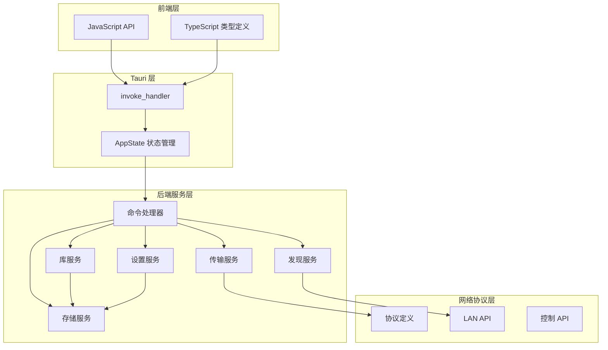

**图表来源**
- [lib.rs:138-249](file://quicklan-main/src-tauri/src/lib.rs#L138-L249)
- [commands.rs:11-259](file://quicklan-main/src-tauri/src/commands.rs#L11-L259)

**章节来源**
- [lib.rs:1-250](file://quicklan-main/src-tauri/src/lib.rs#L1-L250)
- [main.rs:1-6](file://quicklan-main/src-tauri/src/main.rs#L1-L6)

## 核心组件

### 应用状态管理

应用使用 AppState 结构体统一管理所有服务实例：

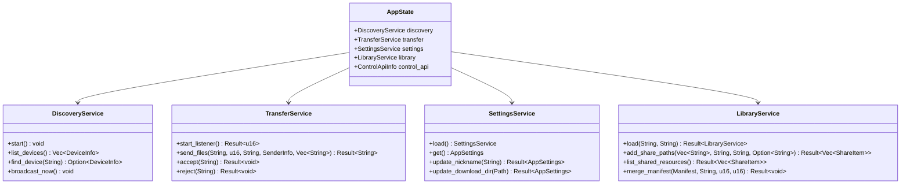

**图表来源**
- [lib.rs:50-56](file://quicklan-main/src-tauri/src/lib.rs#L50-L56)
- [discovery.rs:24-33](file://quicklan-main/src-tauri/src/discovery.rs#L24-L33)
- [transfer.rs:30-39](file://quicklan-main/src-tauri/src/transfer.rs#L30-L39)
- [settings.rs:15-19](file://quicklan-main/src-tauri/src/settings.rs#L15-L19)
- [library.rs:21-30](file://quicklan-main/src-tauri/src/library.rs#L21-L30)

### 命令系统架构

Tauri 的 invoke_handler 将前端调用映射到 Rust 函数：

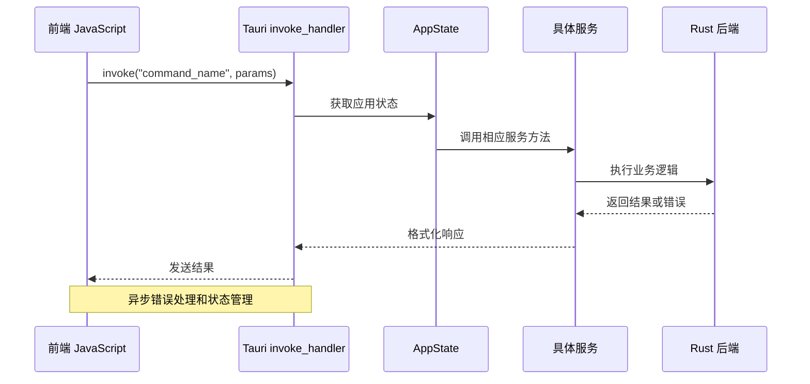

**图表来源**
- [lib.rs:218-246](file://quicklan-main/src-tauri/src/lib.rs#L218-L246)
- [commands.rs:11-259](file://quicklan-main/src-tauri/src/commands.rs#L11-L259)

**章节来源**
- [lib.rs:138-249](file://quicklan-main/src-tauri/src/lib.rs#L138-L249)
- [commands.rs:11-259](file://quicklan-main/src-tauri/src/commands.rs#L11-L259)

## 架构概览

QuickLAN 采用分层架构设计，确保各组件职责清晰、耦合度低：

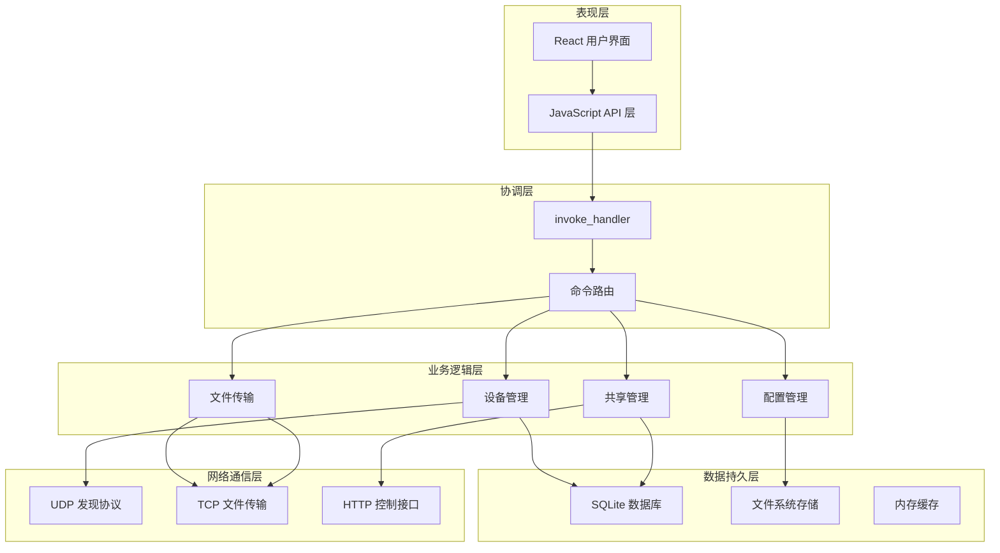

**图表来源**
- [lib.rs:138-249](file://quicklan-main/src-tauri/src/lib.rs#L138-L249)
- [discovery.rs:60-65](file://quicklan-main/src-tauri/src/discovery.rs#L60-L65)
- [transfer.rs:130-159](file://quicklan-main/src-tauri/src/transfer.rs#L130-L159)
- [lan_api.rs:19-51](file://quicklan-main/src-tauri/src/lan_api.rs#L19-L51)

## 详细组件分析

### 设备管理命令

设备管理功能负责局域网内设备的发现、识别和状态跟踪：

#### 列出设备
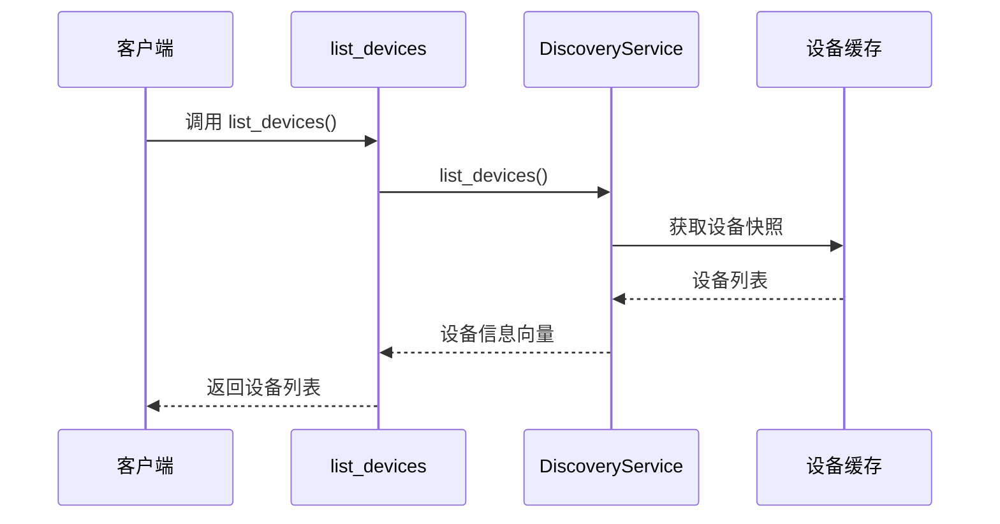

**图表来源**
- [commands.rs:12-14](file://quicklan-main/src-tauri/src/commands.rs#L12-L14)
- [discovery.rs:72-77](file://quicklan-main/src-tauri/src/discovery.rs#L72-L77)

#### 更新设备备注
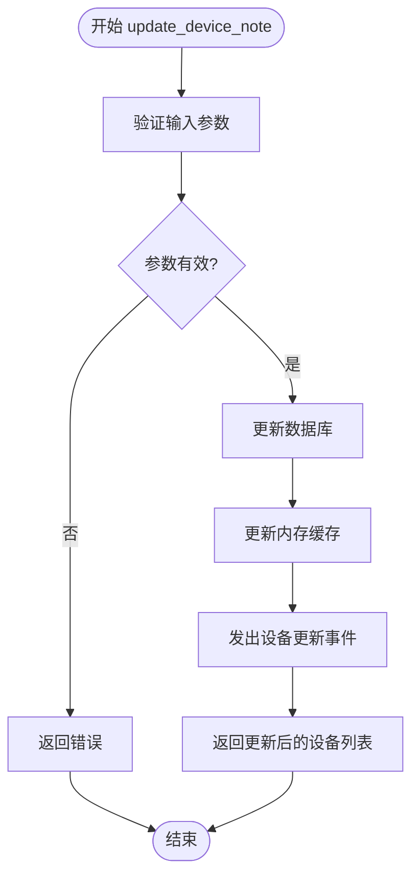

**图表来源**
- [commands.rs:17-23](file://quicklan-main/src-tauri/src/commands.rs#L17-L23)
- [discovery.rs:86-98](file://quicklan-main/src-tauri/src/discovery.rs#L86-L98)

**章节来源**
- [commands.rs:11-23](file://quicklan-main/src-tauri/src/commands.rs#L11-L23)
- [discovery.rs:72-98](file://quicklan-main/src-tauri/src/discovery.rs#L72-L98)

### 文件传输命令

文件传输系统支持点对点文件传输和共享文件下载：

#### 发送文件
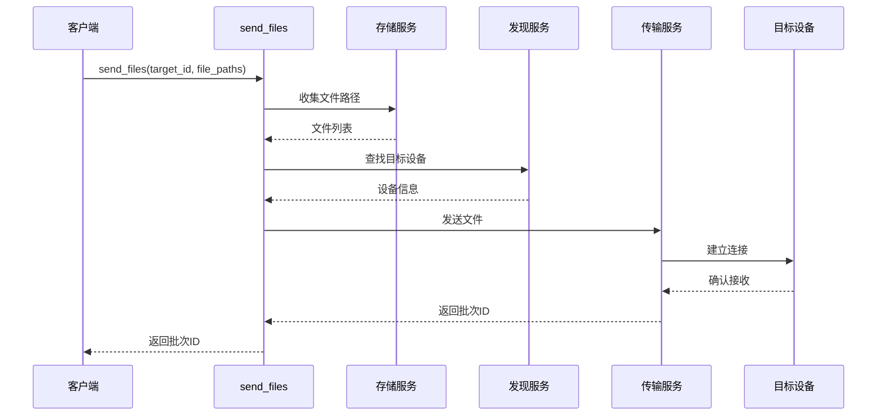

**图表来源**
- [commands.rs:26-46](file://quicklan-main/src-tauri/src/commands.rs#L26-L46)
- [storage.rs:101-114](file://quicklan-main/src-tauri/src/storage.rs#L101-L114)
- [transfer.rs:180-220](file://quicklan-main/src-tauri/src/transfer.rs#L180-L220)

#### 接收文件
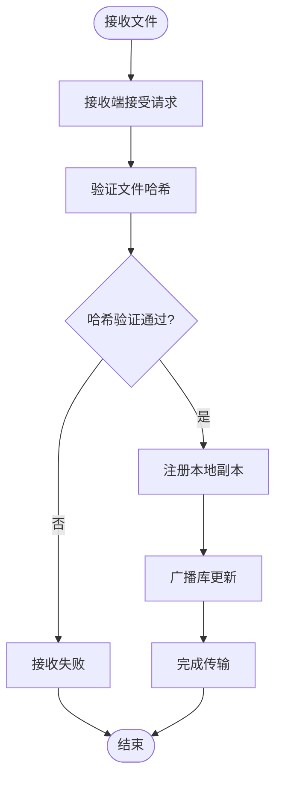

**图表来源**
- [transfer.rs:441-443](file://quicklan-main/src-tauri/src/transfer.rs#L441-L443)
- [transfer.rs:596-616](file://quicklan-main/src-tauri/src/transfer.rs#L596-L616)

**章节来源**
- [commands.rs:25-81](file://quicklan-main/src-tauri/src/commands.rs#L25-L81)
- [transfer.rs:180-261](file://quicklan-main/src-tauri/src/transfer.rs#L180-L261)

### 共享管理命令

共享管理系统允许用户管理本地共享文件和远程共享资源：

#### 添加共享路径
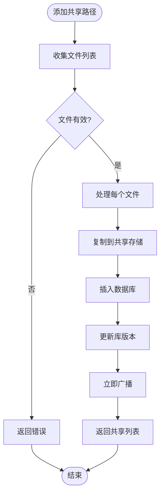

**图表来源**
- [commands.rs:200-212](file://quicklan-main/src-tauri/src/commands.rs#L200-L212)
- [library.rs:314-332](file://quicklan-main/src-tauri/src/library.rs#L314-L332)

#### 下载共享
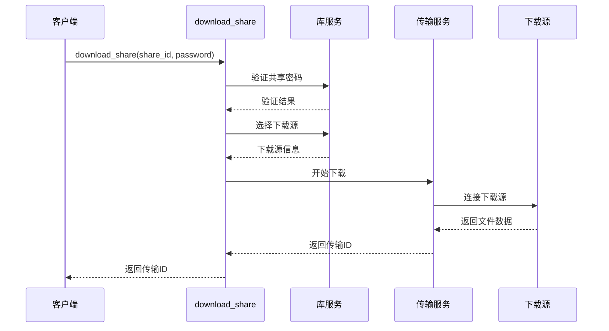

**图表来源**
- [commands.rs:233-245](file://quicklan-main/src-tauri/src/commands.rs#L233-L245)
- [library.rs:630-659](file://quicklan-main/src-tauri/src/library.rs#L630-L659)
- [transfer.rs:222-261](file://quicklan-main/src-tauri/src/transfer.rs#L222-L261)

**章节来源**
- [commands.rs:189-259](file://quicklan-main/src-tauri/src/commands.rs#L189-L259)
- [library.rs:314-701](file://quicklan-main/src-tauri/src/library.rs#L314-L701)

### 设置管理命令

设置管理系统负责应用程序的各种配置选项：

#### 应用程序设置
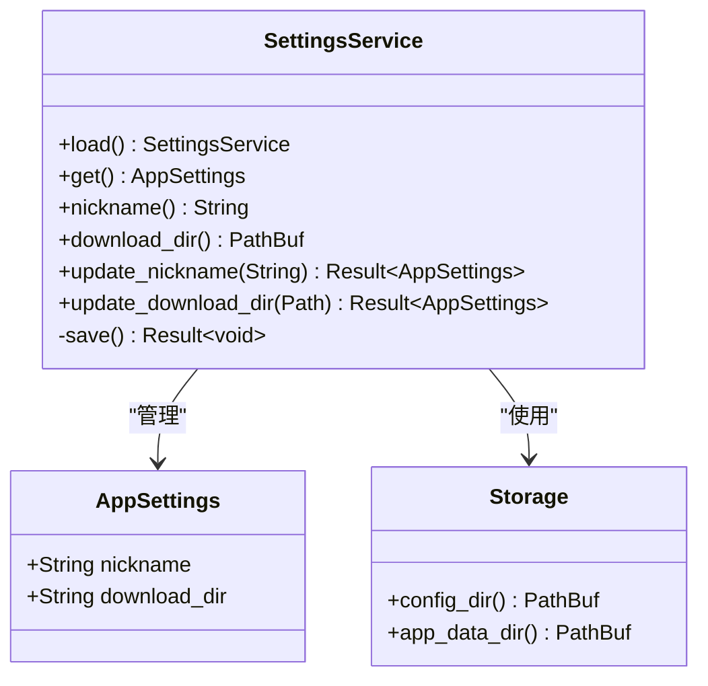

**图表来源**
- [settings.rs:9-13](file://quicklan-main/src-tauri/src/settings.rs#L9-L13)
- [settings.rs:15-93](file://quicklan-main/src-tauri/src/settings.rs#L15-L93)
- [storage.rs:9-23](file://quicklan-main/src-tauri/src/storage.rs#L9-L23)

**章节来源**
- [settings.rs:9-134](file://quicklan-main/src-tauri/src/settings.rs#L9-L134)
- [commands.rs:100-128](file://quicklan-main/src-tauri/src/commands.rs#L100-L128)

## 依赖关系分析

QuickLAN 的依赖关系体现了清晰的分层架构：

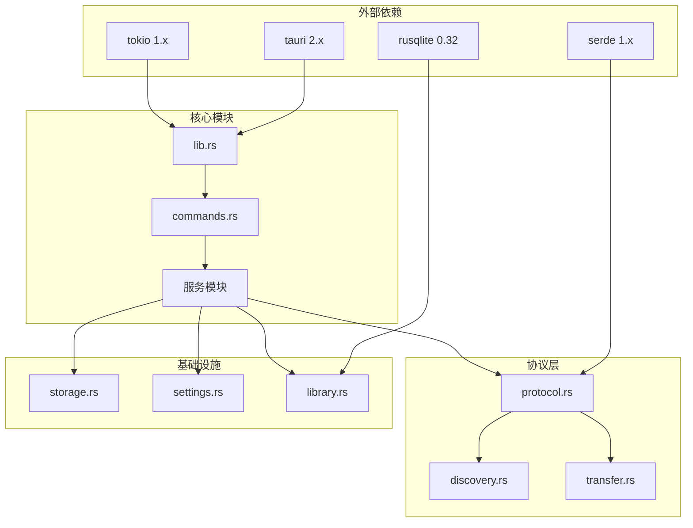

**图表来源**
- [Cargo.toml:19-33](file://quicklan-main/src-tauri/Cargo.toml#L19-L33)
- [lib.rs:1-35](file://quicklan-main/src-tauri/src/lib.rs#L1-L35)

### 关键依赖特性

1. **异步运行时**: 使用 Tokio 提供高性能的异步 I/O 操作
2. **序列化支持**: 使用 Serde 实现数据结构的 JSON 序列化
3. **数据库访问**: 使用 Rusqlite 提供轻量级的 SQLite 数据库支持
4. **网络协议**: 实现自定义的 UDP/TCP 协议用于设备发现和文件传输

**章节来源**
- [Cargo.toml:19-33](file://quicklan-main/src-tauri/Cargo.toml#L19-L33)
- [lib.rs:20-35](file://quicklan-main/src-tauri/src/lib.rs#L20-L35)

## 性能考虑

### 并发模型

QuickLAN 采用多线程并发模型来处理高并发场景：

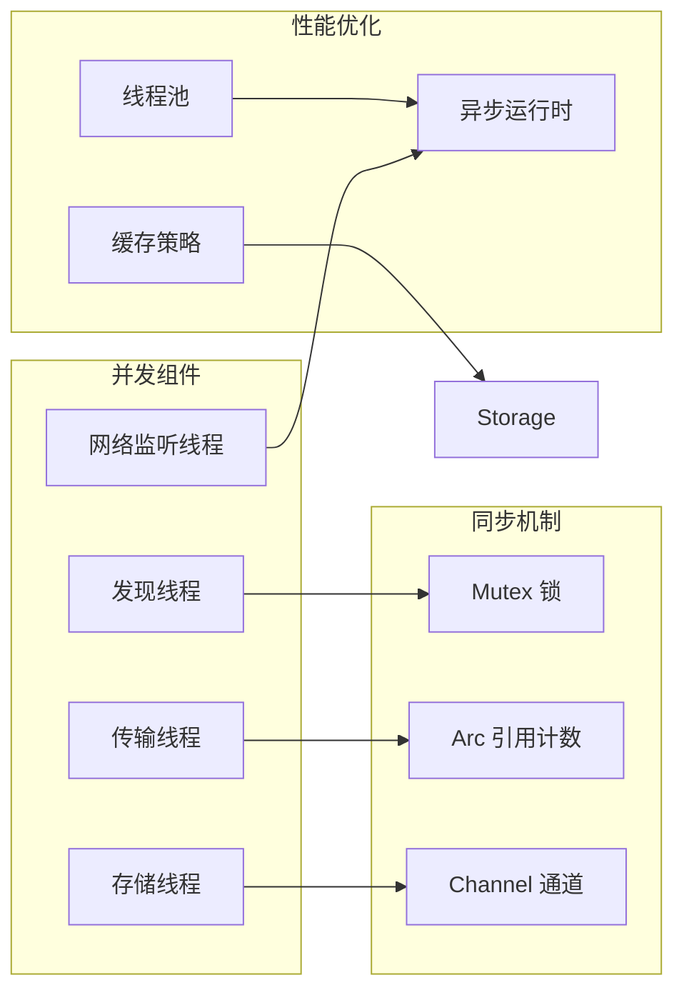

### 内存管理

1. **智能指针**: 使用 Arc 和 Mutex 实现安全的共享状态管理
2. **零拷贝优化**: 在可能的情况下避免不必要的数据复制
3. **流式处理**: 对大文件采用流式处理减少内存占用

### 网络性能

1. **缓冲区优化**: 使用 1MB 的传输块大小平衡吞吐量和延迟
2. **连接复用**: 复用 TCP 连接减少建立连接的开销
3. **背压控制**: 实现流量控制防止网络拥塞

## 故障排除指南

### 常见错误类型

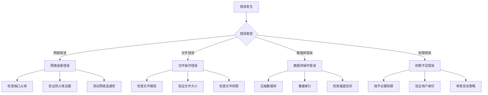

### 错误处理策略

1. **具体错误消息**: 每个命令都提供详细的错误描述
2. **渐进式恢复**: 系统自动尝试恢复和重试机制
3. **日志记录**: 详细的错误日志便于调试和问题定位

**章节来源**
- [transfer.rs:663-668](file://quicklan-main/src-tauri/src/transfer.rs#L663-L668)
- [storage.rs:175-186](file://quicklan-main/src-tauri/src/storage.rs#L175-L186)
- [library.rs:630-659](file://quicklan-main/src-tauri/src/library.rs#L630-L659)

## 结论

QuickLAN 的命令系统实现了高效、可靠的跨平台文件共享解决方案。通过精心设计的模块化架构和完善的错误处理机制，系统能够在复杂的局域网环境中稳定运行。

### 主要优势

1. **模块化设计**: 清晰的职责分离使得系统易于维护和扩展
2. **异步处理**: 高效的异步 I/O 操作提升了整体性能
3. **强类型安全**: Rust 的类型系统确保了运行时的安全性
4. **跨平台兼容**: 基于 Tauri 的跨平台特性支持多种操作系统

### 技术亮点

- **自定义协议**: 实现了高效的局域网发现和文件传输协议
- **智能缓存**: 基于 SHA256 的内容寻址存储系统
- **实时同步**: 基于 UDP 的设备发现和库同步机制
- **安全传输**: 完整的文件完整性验证和可选的密码保护

## 附录

### 命令函数完整列表

#### 设备管理命令
- `list_devices` - 列出所有在线设备
- `update_device_note` - 更新设备备注信息
- `discover_ip` - 探测指定 IP 地址的设备

#### 文件传输命令
- `send_files` - 发送文件给指定设备
- `accept_transfer` - 接受传入的文件传输
- `reject_transfer` - 拒绝传入的文件传输
- `get_transfers` - 获取传输任务列表
- `get_transfer` - 获取特定传输任务信息
- `remove_transfer_record` - 删除传输记录
- `clear_finished_transfers` - 清理已完成的传输记录

#### 应用信息命令
- `get_app_info` - 获取应用程序信息
- `get_control_api_info` - 获取控制 API 信息
- `get_network_status` - 获取网络状态信息

#### 设置管理命令
- `get_settings` - 获取应用程序设置
- `update_nickname` - 更新设备昵称
- `choose_download_dir` - 选择下载目录
- `choose_share_paths` - 选择共享文件路径
- `choose_folder_path` - 选择文件夹路径
- `open_path_location` - 在资源管理器中打开路径

#### 共享管理命令
- `list_shared_resources` - 列出共享资源
- `list_my_shares` - 列出我的共享
- `add_share_paths` - 添加共享路径
- `update_share` - 更新共享路径
- `remove_share` - 移除共享
- `download_share` - 下载共享文件
- `get_library_settings` - 获取库设置
- `update_library_settings` - 更新库设置

### 参数和返回值规范

所有命令都遵循统一的参数传递和返回值处理规范：

1. **参数传递**: 使用结构化参数对象，支持复杂数据类型的传递
2. **返回值处理**: 统一使用 Result 类型处理成功和失败情况
3. **错误处理**: 提供详细的错误信息和状态码
4. **异步支持**: 支持异步操作和进度报告

### 扩展开发指南

#### 添加新命令的步骤

1. **定义命令函数**: 在 `commands.rs` 中添加新的命令函数
2. **实现业务逻辑**: 在相应的服务模块中实现功能
3. **注册命令**: 在 `lib.rs` 的 `invoke_handler` 中注册新命令
4. **前端集成**: 在 `api.ts` 中添加对应的 TypeScript 函数
5. **类型定义**: 更新 `types.ts` 中的类型定义
6. **测试验证**: 编写单元测试和集成测试

#### 最佳实践

1. **错误处理**: 始终提供有意义的错误消息
2. **资源管理**: 正确管理文件句柄和网络连接
3. **并发安全**: 使用适当的同步机制保证线程安全
4. **性能优化**: 避免不必要的数据复制和内存分配
5. **日志记录**: 记录重要的操作和错误信息

**章节来源**
- [lib.rs:218-246](file://quicklan-main/src-tauri/src/lib.rs#L218-L246)
- [commands.rs:11-259](file://quicklan-main/src-tauri/src/commands.rs#L11-L259)
- [api.ts:13-130](file://quicklan-main/src/api.ts#L13-L130)