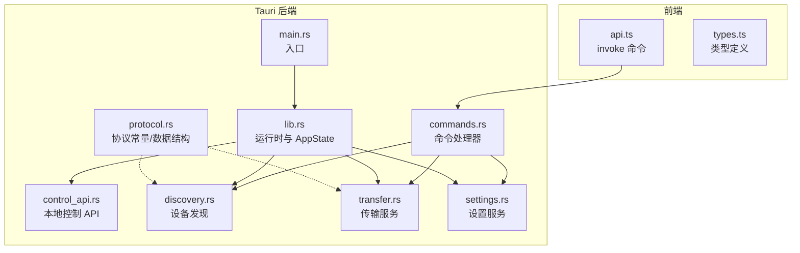
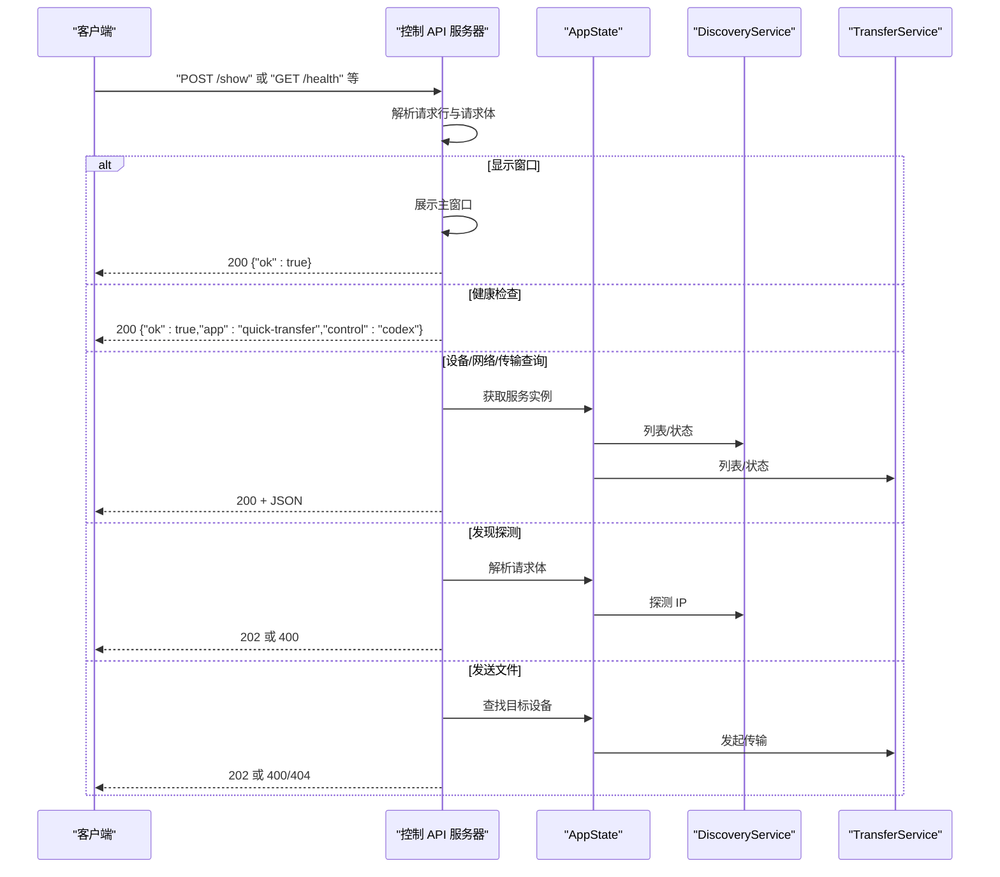
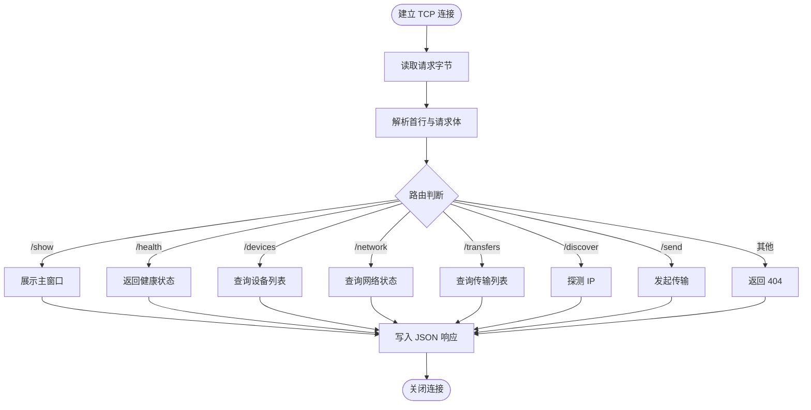
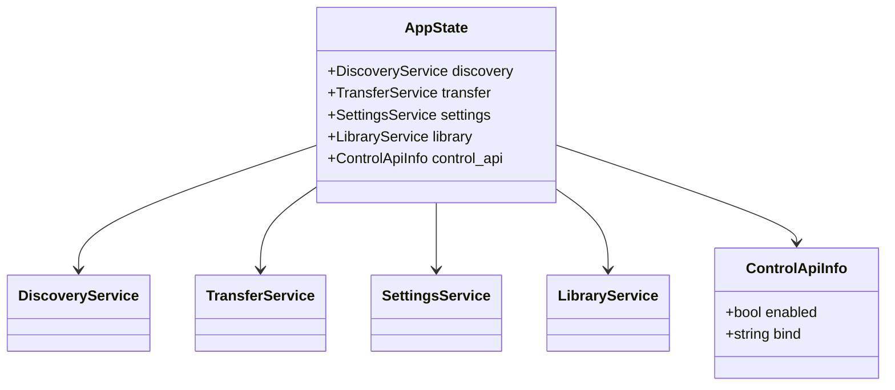
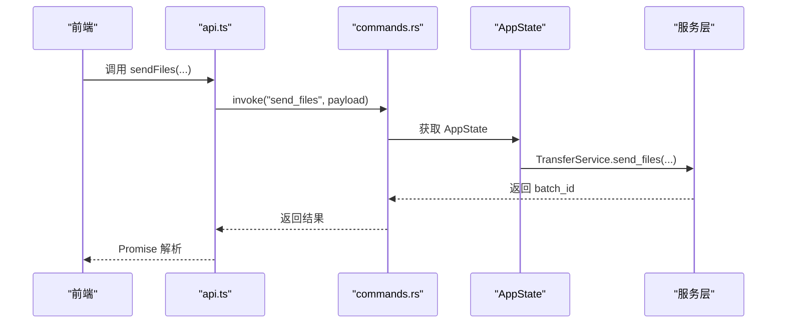
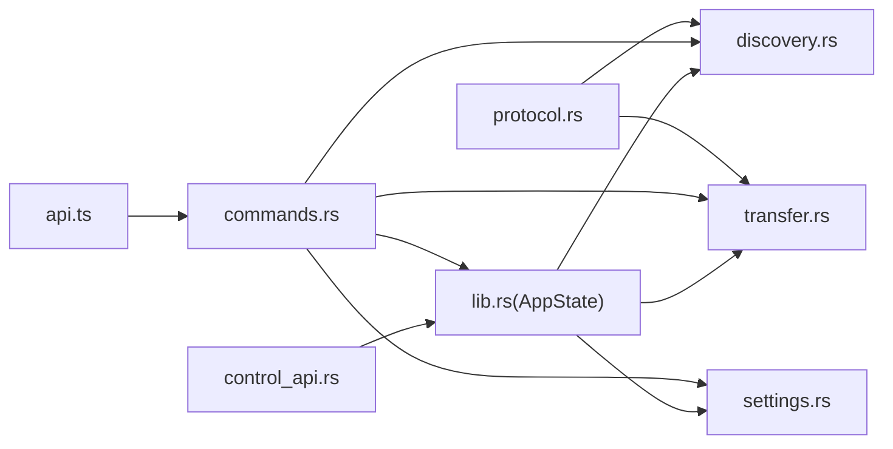

# 控制 API

<cite>
**本文引用的文件**
- [control_api.rs](file://quicklan-main/src-tauri/src/control_api.rs)
- [lib.rs](file://quicklan-main/src-tauri/src/lib.rs)
- [main.rs](file://quicklan-main/src-tauri/src/main.rs)
- [commands.rs](file://quicklan-main/src-tauri/src/commands.rs)
- [discovery.rs](file://quicklan-main/src-tauri/src/discovery.rs)
- [transfer.rs](file://quicklan-main/src-tauri/src/transfer.rs)
- [protocol.rs](file://quicklan-main/src-tauri/src/protocol.rs)
- [settings.rs](file://quicklan-main/src-tauri/src/settings.rs)
- [api.ts](file://quicklan-main/src/api.ts)
- [types.ts](file://quicklan-main/src/types.ts)
- [Cargo.toml](file://quicklan-main/src-tauri/Cargo.toml)
</cite>

## 目录
1. [简介](#简介)
2. [项目结构](#项目结构)
3. [核心组件](#核心组件)
4. [架构总览](#架构总览)
5. [详细组件分析](#详细组件分析)
6. [依赖关系分析](#依赖关系分析)
7. [性能考量](#性能考量)
8. [故障排查指南](#故障排查指南)
9. [结论](#结论)
10. [附录](#附录)

## 简介
本文件面向 QuickLAN 的“控制 API”，即基于 TCP 的本地控制接口。该接口以简易的文本协议在本机回环地址上提供一组 HTTP 风格的端点，用于：
- 应用健康检查
- 查询设备列表、网络状态、传输任务
- 触发发现探测
- 向指定设备发送文件
- 显示主界面窗口

控制 API 的设计目标是为自动化脚本、外部工具或系统集成提供轻量、低耦合的本地控制能力，同时通过仅监听回环地址与最小权限模型确保安全性。

## 项目结构
QuickLAN 的控制 API 位于 Tauri 后端 Rust 模块中，前端通过 @tauri-apps/api 的 invoke 通道调用命令，命令再委托到控制 API 或内部服务。

图表来源
- [main.rs:1-6](file://quicklan-main/src-tauri/src/main.rs#L1-L6)
- [lib.rs:138-250](file://quicklan-main/src-tauri/src/lib.rs#L138-L250)
- [control_api.rs:22-45](file://quicklan-main/src-tauri/src/control_api.rs#L22-L45)
- [commands.rs:11-259](file://quicklan-main/src-tauri/src/commands.rs#L11-L259)
- [discovery.rs:41-127](file://quicklan-main/src-tauri/src/discovery.rs#L41-L127)
- [transfer.rs:73-159](file://quicklan-main/src-tauri/src/transfer.rs#L73-L159)
- [protocol.rs:3-9](file://quicklan-main/src-tauri/src/protocol.rs#L3-L9)
- [settings.rs:21-93](file://quicklan-main/src-tauri/src/settings.rs#L21-L93)

章节来源
- [main.rs:1-6](file://quicklan-main/src-tauri/src/main.rs#L1-L6)
- [lib.rs:138-250](file://quicklan-main/src-tauri/src/lib.rs#L138-L250)

## 核心组件
- 控制 API 服务器：在回环地址绑定 TCP 端口，解析简单请求行与 JSON 请求体，返回 JSON 响应。
- 应用状态容器：包含发现、传输、设置、库、控制 API 自身信息。
- 前端命令桥接：通过 Tauri invoke 将前端调用映射到后端命令，命令再驱动控制 API 或服务。

章节来源
- [control_api.rs:22-147](file://quicklan-main/src-tauri/src/control_api.rs#L22-L147)
- [lib.rs:37-64](file://quicklan-main/src-tauri/src/lib.rs#L37-L64)
- [api.ts:1-130](file://quicklan-main/src/api.ts#L1-L130)

## 架构总览
控制 API 的工作流如下：
- 启动时在回环地址绑定固定端口
- 接收连接后按行解析请求，识别方法与路径
- 对特定路径执行业务逻辑（如显示窗口、触发探测、发起传输）
- 对通用路径委托到 AppState 中的服务读取状态或执行操作
- 统一以 HTTP 风格响应返回 JSON

图表来源
- [control_api.rs:47-122](file://quicklan-main/src-tauri/src/control_api.rs#L47-L122)
- [lib.rs:173-186](file://quicklan-main/src-tauri/src/lib.rs#L173-L186)
- [discovery.rs:72-104](file://quicklan-main/src-tauri/src/discovery.rs#L72-L104)
- [transfer.rs:180-200](file://quicklan-main/src-tauri/src/transfer.rs#L180-L200)

## 详细组件分析

### 控制 API 服务器
- 绑定地址与端口：仅绑定到回环地址，限制为本机访问。
- 请求解析：读取首行作为“方法 路径 HTTP/1.x”形式，支持空行分隔的请求体。
- 路由与处理：
  - POST /show：展示主窗口
  - GET /health：返回健康状态
  - GET /devices：列出设备
  - GET /network：返回网络状态
  - GET /transfers：返回传输任务
  - POST /discover：探测指定 IP
  - POST /send：向目标设备发送文件
- 响应格式：统一为 HTTP/1.1 + JSON，包含 Content-Type、Content-Length、Access-Control-Allow-Origin 头部。

图表来源
- [control_api.rs:47-122](file://quicklan-main/src-tauri/src/control_api.rs#L47-L122)
- [control_api.rs:124-147](file://quicklan-main/src-tauri/src/control_api.rs#L124-L147)

章节来源
- [control_api.rs:22-147](file://quicklan-main/src-tauri/src/control_api.rs#L22-L147)

### 应用状态与服务
- AppState：聚合 DiscoveryService、TransferService、SettingsService、LibraryService、ControlApiInfo。
- ControlApiInfo：记录控制 API 是否启用及绑定地址。
- 单实例保护：在 Windows 上通过全局互斥避免重复启动；若已有实例，会向现有实例发送“显示主窗口”的控制请求。

图表来源
- [lib.rs:50-56](file://quicklan-main/src-tauri/src/lib.rs#L50-L56)
- [lib.rs:39-43](file://quicklan-main/src-tauri/src/lib.rs#L39-L43)
- [lib.rs:138-250](file://quicklan-main/src-tauri/src/lib.rs#L138-L250)

章节来源
- [lib.rs:37-64](file://quicklan-main/src-tauri/src/lib.rs#L37-L64)
- [lib.rs:138-250](file://quicklan-main/src-tauri/src/lib.rs#L138-L250)

### 命令与前端桥接
- 前端通过 api.ts 的函数封装调用 Tauri 命令。
- commands.rs 定义了所有命令，部分命令直接委托到 AppState 中的服务，另一些命令用于 UI 交互（如打开资源管理器、选择路径等）。
- get_control_api_info 命令返回 ControlApiInfo，供前端展示控制 API 的可用性与绑定地址。

图表来源
- [api.ts:21-23](file://quicklan-main/src/api.ts#L21-L23)
- [commands.rs:26-46](file://quicklan-main/src-tauri/src/commands.rs#L26-L46)
- [transfer.rs:180-200](file://quicklan-main/src-tauri/src/transfer.rs#L180-L200)

章节来源
- [api.ts:1-130](file://quicklan-main/src/api.ts#L1-L130)
- [commands.rs:11-259](file://quicklan-main/src-tauri/src/commands.rs#L11-L259)

### 设备发现与传输服务
- DiscoveryService：负责设备发现、网络状态查询、设备备注更新、探测指定 IP。
- TransferService：负责传输任务的创建、接受/拒绝、状态查询、清理已完成任务，并启动 TCP 接收监听。

章节来源
- [discovery.rs:72-127](file://quicklan-main/src-tauri/src/discovery.rs#L72-L127)
- [transfer.rs:90-128](file://quicklan-main/src-tauri/src/transfer.rs#L90-L128)
- [transfer.rs:130-159](file://quicklan-main/src-tauri/src/transfer.rs#L130-L159)

### 协议与数据结构
- 协议常量：定义了发现端口、传输端口、LAN API 端口等。
- 数据结构：DeviceInfo、NetworkStatus、TransferInfo、SenderInfo 等，用于跨模块传递状态与事件。

章节来源
- [protocol.rs:3-9](file://quicklan-main/src-tauri/src/protocol.rs#L3-L9)
- [protocol.rs:32-56](file://quicklan-main/src-tauri/src/protocol.rs#L32-L56)
- [protocol.rs:119-136](file://quicklan-main/src-tauri/src/protocol.rs#L119-L136)
- [protocol.rs:58-62](file://quicklan-main/src-tauri/src/protocol.rs#L58-L62)

## 依赖关系分析
- 控制 API 依赖 AppState 提供的服务实例。
- 命令层依赖 AppState 与具体服务（发现、传输、设置、库）。
- 前端通过 Tauri invoke 与命令层交互，命令层再与服务层交互。
- 协议模块为发现与传输提供统一的数据结构与端口常量。

图表来源
- [control_api.rs:81-119](file://quicklan-main/src-tauri/src/control_api.rs#L81-L119)
- [lib.rs:173-186](file://quicklan-main/src-tauri/src/lib.rs#L173-L186)
- [commands.rs:11-259](file://quicklan-main/src-tauri/src/commands.rs#L11-L259)
- [protocol.rs:3-9](file://quicklan-main/src-tauri/src/protocol.rs#L3-L9)

章节来源
- [lib.rs:138-250](file://quicklan-main/src-tauri/src/lib.rs#L138-L250)
- [commands.rs:11-259](file://quicklan-main/src-tauri/src/commands.rs#L11-L259)

## 性能考量
- 控制 API 使用异步运行时处理连接，避免阻塞主线程。
- 仅监听回环地址，减少网络开销与潜在攻击面。
- 响应采用短连接与小 JSON 负载，适合频繁调用场景。
- 建议客户端批量请求或合并操作，减少连接建立成本。

## 故障排查指南
- 控制 API 启动失败
  - 检查绑定地址是否已被占用（默认回环地址与端口）。
  - 查看启动日志输出的错误信息。
- 请求解析错误
  - 确认请求行格式正确（方法、路径、HTTP/1.x）。
  - 确认请求体使用空行分隔。
- 访问受限
  - 控制 API 仅允许来自回环地址的连接，请确保从本机发起请求。
- 设备未发现
  - 使用 /discover 探测指定 IP。
  - 检查网络状态与广播目标。
- 发送文件失败
  - 确认目标设备在线且可连通。
  - 检查传输服务监听端口与防火墙设置。

章节来源
- [control_api.rs:24-30](file://quicklan-main/src-tauri/src/control_api.rs#L24-L30)
- [control_api.rs:38-42](file://quicklan-main/src-tauri/src/control_api.rs#L38-L42)
- [discovery.rs:100-104](file://quicklan-main/src-tauri/src/discovery.rs#L100-L104)
- [transfer.rs:130-159](file://quicklan-main/src-tauri/src/transfer.rs#L130-L159)

## 结论
QuickLAN 的控制 API 通过极简的 TCP 文本协议提供了本地化的应用控制能力，覆盖健康检查、设备查询、网络状态、传输查询、发现探测与文件发送等核心功能。其回环绑定与最小权限设计确保了安全性，配合 Tauri 的命令体系实现了从前端到后端的无缝集成。对于需要自动化或系统集成的用户，控制 API 是一个可靠、易用的本地控制入口。

## 附录

### API 端点定义
- GET /health
  - 功能：应用健康检查
  - 成功响应：200，包含应用标识与控制接口标识
- GET /devices
  - 功能：列出当前网络中的设备
  - 成功响应：200，设备数组
- GET /network
  - 功能：返回网络状态（端口、本地 IP、广播目标）
  - 成功响应：200，网络状态对象
- GET /transfers
  - 功能：返回传输任务列表
  - 成功响应：200，传输任务数组
- POST /discover
  - 请求体：JSON，包含目标 IP 字段
  - 成功响应：202，Accepted
  - 错误响应：400，错误信息
- POST /send
  - 请求体：JSON，包含目标设备 ID 与文件路径数组
  - 成功响应：202，返回批次 ID
  - 错误响应：400，错误信息；404，目标离线
- POST /show
  - 功能：显示主窗口
  - 成功响应：200，{"ok":true}

章节来源
- [control_api.rs:76-116](file://quicklan-main/src-tauri/src/control_api.rs#L76-L116)

### 安全机制与访问控制
- 仅监听回环地址，限制为本机访问。
- 无认证与授权机制，适用于受信任的本地环境。
- 建议仅在可信主机上启用，避免暴露到公网。

章节来源
- [control_api.rs:38-42](file://quicklan-main/src-tauri/src/control_api.rs#L38-L42)

### 调用示例与集成方法
- 示例（概念性，非代码内容）
  - 健康检查：向回环地址的控制端口发送 GET /health，解析 JSON 响应。
  - 显示窗口：发送 POST /show，无需请求体。
  - 发送文件：构造 JSON 请求体，包含目标设备 ID 与文件路径数组，发送 POST /send。
- 集成建议
  - 在同一主机上通过 TCP 客户端发起请求。
  - 使用短连接与小负载，避免长连接占用资源。
  - 对于需要 UI 交互的场景，优先使用前端通过 Tauri invoke 的命令方式。

章节来源
- [control_api.rs:76-116](file://quicklan-main/src-tauri/src/control_api.rs#L76-L116)
- [api.ts:1-130](file://quicklan-main/src/api.ts#L1-L130)

### 版本管理与向后兼容
- 当前版本：见包元数据版本号。
- 兼容性策略
  - 控制 API 为本地接口，不涉及跨版本客户端兼容问题。
  - 若新增端点，建议保持现有端点不变，避免破坏既有集成。
  - 前端命令与类型定义变更需同步更新，确保 invoke 调用与类型匹配。

章节来源
- [Cargo.toml:3](file://quicklan-main/src-tauri/Cargo.toml#L3)
- [types.ts:1-128](file://quicklan-main/src/types.ts#L1-L128)