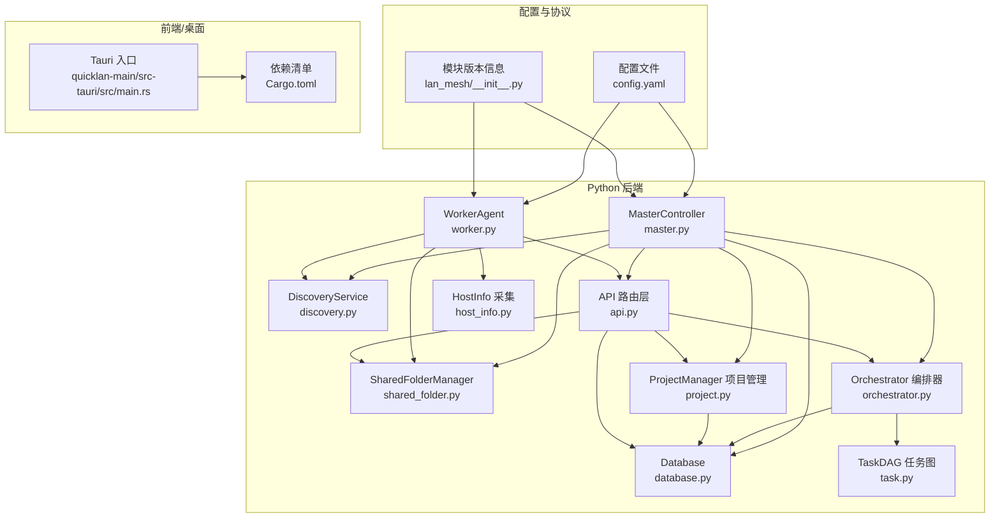
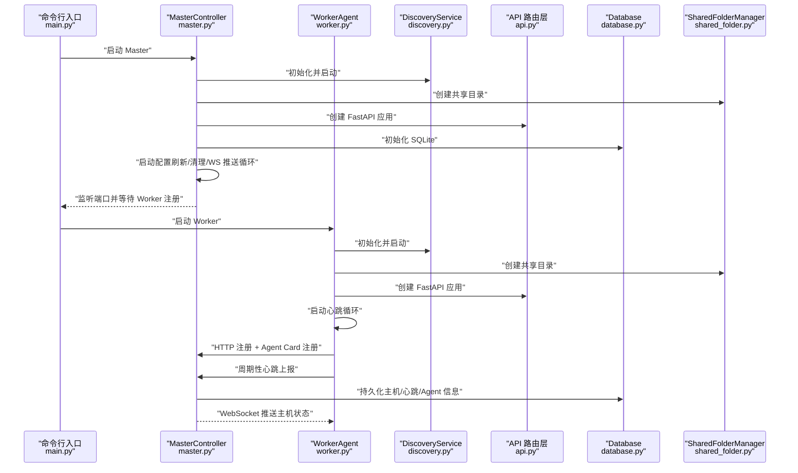
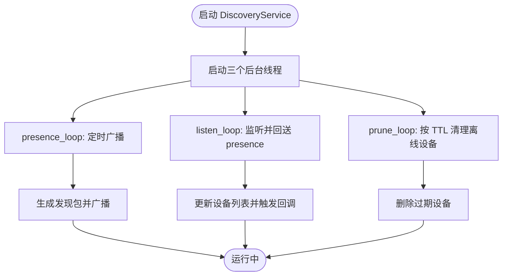
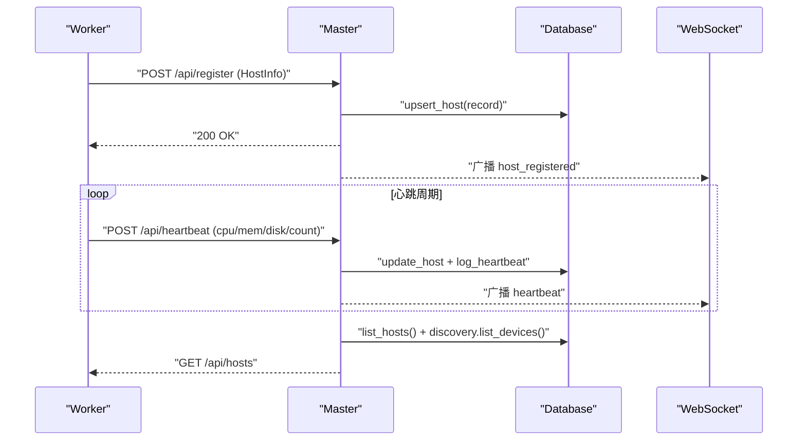
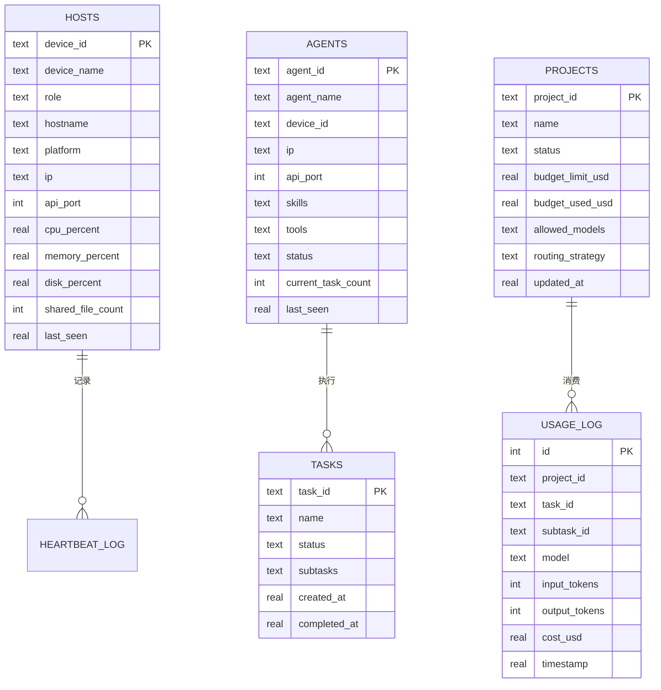
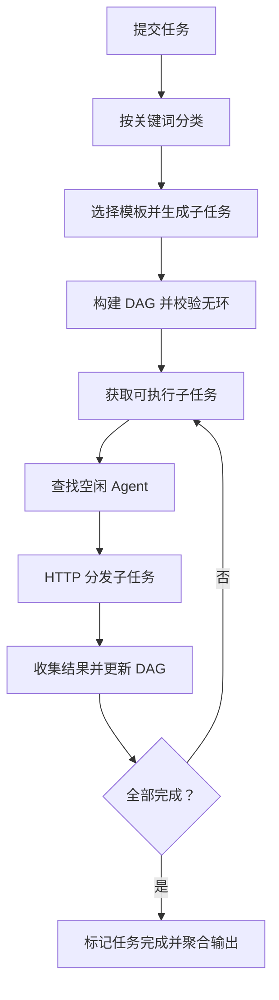
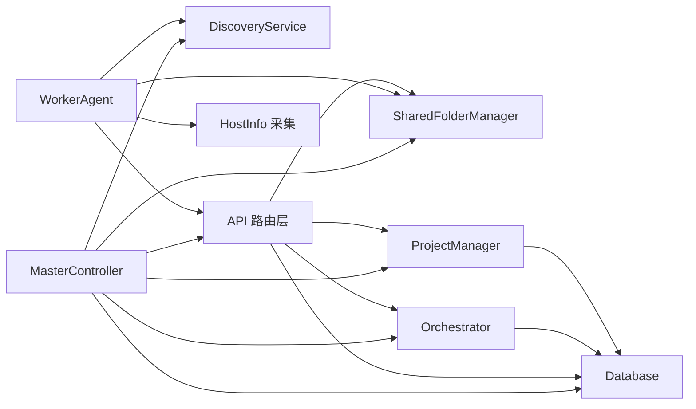

# 服务集成

<cite>
**本文引用的文件**
- [main.py](file://main.py)
- [lan_mesh/__init__.py](file://lan_mesh/__init__.py)
- [lan_mesh/master.py](file://lan_mesh/master.py)
- [lan_mesh/worker.py](file://lan_mesh/worker.py)
- [lan_mesh/discovery.py](file://lan_mesh/discovery.py)
- [lan_mesh/api.py](file://lan_mesh/api.py)
- [lan_mesh/database.py](file://lan_mesh/database.py)
- [lan_mesh/shared_folder.py](file://lan_mesh/shared_folder.py)
- [lan_mesh/host_info.py](file://lan_mesh/host_info.py)
- [lan_mesh/orchestrator.py](file://lan_mesh/orchestrator.py)
- [lan_mesh/project.py](file://lan_mesh/project.py)
- [lan_mesh/task.py](file://lan_mesh/task.py)
- [config.yaml](file://config.yaml)
- [quicklan-main/src-tauri/Cargo.toml](file://quicklan-main/src-tauri/Cargo.toml)
- [quicklan-main/src-tauri/src/main.rs](file://quicklan-main/src-tauri/src/main.rs)
</cite>

## 目录
1. [简介](#简介)
2. [项目结构](#项目结构)
3. [核心组件](#核心组件)
4. [架构总览](#架构总览)
5. [详细组件分析](#详细组件分析)
6. [依赖分析](#依赖分析)
7. [性能考虑](#性能考虑)
8. [故障排查指南](#故障排查指南)
9. [结论](#结论)
10. [附录](#附录)

## 简介
本文件面向 QuickLAN 服务集成，系统性阐述服务模块的初始化与集成流程，涵盖发现服务、传输服务、库服务与设置服务，并深入说明服务间依赖关系与数据流；同时给出服务状态管理与错误恢复机制、扩展与自定义服务添加方法，以及性能监控与调试技巧。文档旨在帮助开发者快速理解并高效运维该分布式局域网服务框架。

## 项目结构
项目由三层组成：
- Python 后端服务层：负责节点角色（Master/Worker）的生命周期、发现、API、数据库与任务编排。
- 配置与协议层：统一的配置文件与协议定义，支撑跨模块的数据交换。
- 前端与桌面集成层（可选）：基于 Tauri 的桌面应用入口，承载 UI 与本地能力。

图表来源
- [lan_mesh/master.py:67-324](file://lan_mesh/master.py#L67-L324)
- [lan_mesh/worker.py:62-325](file://lan_mesh/worker.py#L62-L325)
- [lan_mesh/discovery.py:33-259](file://lan_mesh/discovery.py#L33-L259)
- [lan_mesh/api.py:103-526](file://lan_mesh/api.py#L103-L526)
- [lan_mesh/database.py:16-611](file://lan_mesh/database.py#L16-L611)
- [lan_mesh/shared_folder.py:16-219](file://lan_mesh/shared_folder.py#L16-L219)
- [lan_mesh/host_info.py:19-212](file://lan_mesh/host_info.py#L19-L212)
- [lan_mesh/orchestrator.py:58-262](file://lan_mesh/orchestrator.py#L58-L262)
- [lan_mesh/project.py:62-320](file://lan_mesh/project.py#L62-L320)
- [lan_mesh/task.py:16-91](file://lan_mesh/task.py#L16-L91)
- [config.yaml:1-22](file://config.yaml#L1-L22)
- [lan_mesh/__init__.py:1-11](file://lan_mesh/__init__.py#L1-L11)
- [quicklan-main/src-tauri/src/main.rs:1-6](file://quicklan-main/src-tauri/src/main.rs#L1-L6)
- [quicklan-main/src-tauri/Cargo.toml:1-33](file://quicklan-main/src-tauri/Cargo.toml#L1-L33)

章节来源
- [main.py:25-90](file://main.py#L25-L90)
- [config.yaml:1-22](file://config.yaml#L1-L22)
- [lan_mesh/__init__.py:1-11](file://lan_mesh/__init__.py#L1-L11)

## 核心组件
- 发现服务（DiscoveryService）
  - 基于 UDP 广播实现设备发现，定时广播自身存在、监听其他设备、TTL 清理离线设备。
  - 提供设备查询、网络状态、主动探测等能力。
- 传输服务（FastAPI + WebSocket）
  - Master/Worker 均提供 HTTP API，Master 还提供 WebSocket 实时推送。
  - Worker 暴露共享文件下载/上传、任务执行端点；Master 提供注册、心跳、主机/Agent/任务/项目管理端点。
- 库服务（Database）
  - 基于 SQLite 的线程安全存储，持久化主机、心跳、Agent、任务、项目与消费记录。
- 设置服务（配置与协议）
  - YAML 配置文件集中管理发现、Worker/Master 端口、共享目录、TTL 等参数。
  - 协议层定义 HostInfo、DiscoveryPacket、AgentCard、Task/SubTask、Project 等数据结构。

章节来源
- [lan_mesh/discovery.py:33-259](file://lan_mesh/discovery.py#L33-L259)
- [lan_mesh/api.py:103-526](file://lan_mesh/api.py#L103-L526)
- [lan_mesh/database.py:16-611](file://lan_mesh/database.py#L16-L611)
- [config.yaml:1-22](file://config.yaml#L1-L22)

## 架构总览
下图展示 Master/Worker 的启动与交互流程，以及服务间的数据流与依赖关系。

图表来源
- [main.py:77-85](file://main.py#L77-L85)
- [lan_mesh/master.py:238-318](file://lan_mesh/master.py#L238-L318)
- [lan_mesh/worker.py:253-318](file://lan_mesh/worker.py#L253-L318)
- [lan_mesh/discovery.py:71-89](file://lan_mesh/discovery.py#L71-L89)
- [lan_mesh/api.py:116-168](file://lan_mesh/api.py#L116-L168)
- [lan_mesh/database.py:16-611](file://lan_mesh/database.py#L16-L611)
- [lan_mesh/shared_folder.py:16-219](file://lan_mesh/shared_folder.py#L16-L219)

## 详细组件分析

### 发现服务（DiscoveryService）
- 职责
  - 定时广播自身存在（presence），监听其他设备包并回送 presence。
  - 维护设备列表，按 TTL 清理离线设备。
  - 提供设备查询、网络状态、主动探测等接口。
- 关键流程
  - 启动三个后台线程：presence、listen、prune。
  - 广播与单播均通过 UDP 实现，支持多子网广播地址计算。
- 错误处理
  - 端口占用时尝试降级运行；异常捕获避免线程退出。
- 性能特性
  - RLock 保护设备字典，线程安全；TTL 清理降低内存占用。

图表来源
- [lan_mesh/discovery.py:71-259](file://lan_mesh/discovery.py#L71-L259)

章节来源
- [lan_mesh/discovery.py:33-259](file://lan_mesh/discovery.py#L33-L259)

### 传输服务（FastAPI + WebSocket）
- Master API
  - 注册/心跳：Worker 注册与心跳上报，持久化主机与心跳日志。
  - 主机/Agent/任务/项目管理：查询、分页、状态变更。
  - MCP 工具网关：动态注册/注销、工具列表与调用。
  - WebSocket：实时推送主机状态与事件。
- Worker API
  - 信息查询、共享文件列表/下载/上传。
  - 任务执行端点：接收 Master 分发的子任务并执行。
- 数据流
  - Worker 通过 HTTP 与 Master 交互；Master 通过 WebSocket 推送状态变化。

图表来源
- [lan_mesh/api.py:116-168](file://lan_mesh/api.py#L116-L168)
- [lan_mesh/database.py:147-201](file://lan_mesh/database.py#L147-L201)
- [lan_mesh/api.py:170-204](file://lan_mesh/api.py#L170-L204)

章节来源
- [lan_mesh/api.py:103-526](file://lan_mesh/api.py#L103-L526)
- [lan_mesh/database.py:16-611](file://lan_mesh/database.py#L16-L611)

### 库服务（Database）
- 表结构
  - hosts、heartbeat_log、agents、tasks、projects、usage_log。
  - 索引优化查询性能（如 tasks/status、agents/status）。
- 能力
  - 主机/Agent/任务/项目 CRUD 与状态维护。
  - 心跳日志记录与清理。
  - 项目预算与消费记录。
- 线程安全
  - 每线程独立连接，避免 SQLite 同线程限制问题。

图表来源
- [lan_mesh/database.py:36-143](file://lan_mesh/database.py#L36-L143)
- [lan_mesh/database.py:492-585](file://lan_mesh/database.py#L492-L585)

章节来源
- [lan_mesh/database.py:16-611](file://lan_mesh/database.py#L16-L611)

### 设置服务（配置与协议）
- 配置文件
  - discovery：端口、广播间隔、TTL。
  - worker/master：API 端口、共享目录、设备名、Master DB 路径。
- 协议
  - HostInfo、DiscoveryPacket、AgentCard、Task/SubTask、Project 等结构定义。
- 设备标识
  - 每台主机在数据目录持久化 UUID，角色区分（Master/Worker）。

章节来源
- [config.yaml:1-22](file://config.yaml#L1-L22)
- [lan_mesh/host_info.py:21-37](file://lan_mesh/host_info.py#L21-L37)

### 任务编排与项目管理
- 任务编排（Orchestrator）
  - 任务分类与模板分解，构建子任务 DAG，拓扑排序确定执行顺序。
  - 匹配具备所需技能的空闲 Agent，HTTP 分发子任务并聚合结果。
  - 记录模型调用消费并联动项目预算控制。
- 项目管理（ProjectManager）
  - 项目生命周期管理、预算与路由策略、消费记录与超支暂停。

图表来源
- [lan_mesh/orchestrator.py:70-156](file://lan_mesh/orchestrator.py#L70-L156)
- [lan_mesh/task.py:35-70](file://lan_mesh/task.py#L35-L70)

章节来源
- [lan_mesh/orchestrator.py:58-262](file://lan_mesh/orchestrator.py#L58-L262)
- [lan_mesh/project.py:62-320](file://lan_mesh/project.py#L62-L320)
- [lan_mesh/task.py:16-91](file://lan_mesh/task.py#L16-L91)

### 共享文件夹与主机信息采集
- 共享文件夹
  - 自动创建目录、文件列举、下载/上传、安全路径解析、主机配置报告生成。
- 主机信息采集
  - CPU/内存/磁盘/网络/平台信息采集，生成 DiscoveryPacket 摘要。

章节来源
- [lan_mesh/shared_folder.py:16-219](file://lan_mesh/shared_folder.py#L16-L219)
- [lan_mesh/host_info.py:129-212](file://lan_mesh/host_info.py#L129-L212)

## 依赖分析
- 模块耦合
  - Master/Worker 均依赖 DiscoveryService、API 路由层、SharedFolderManager、Database。
  - Orchestrator 与 ProjectManager 依赖 Database。
  - API 路由层对 DiscoveryService、Database、SharedFolderManager、Orchestrator、ProjectManager 进行组合。
- 外部依赖
  - Python：FastAPI、Uvicorn、requests、psutil、sqlite3（标准库）。
  - Rust/Tauri（可选）：用于桌面应用入口与插件生态。

图表来源
- [lan_mesh/master.py:77-113](file://lan_mesh/master.py#L77-L113)
- [lan_mesh/worker.py:73-96](file://lan_mesh/worker.py#L73-L96)
- [lan_mesh/api.py:103-112](file://lan_mesh/api.py#L103-L112)

章节来源
- [lan_mesh/master.py:77-113](file://lan_mesh/master.py#L77-L113)
- [lan_mesh/worker.py:73-96](file://lan_mesh/worker.py#L73-L96)
- [lan_mesh/api.py:103-112](file://lan_mesh/api.py#L103-L112)

## 性能考虑
- 线程与并发
  - DiscoveryService 使用三个后台线程，避免阻塞主流程。
  - Database 每线程独立连接，减少锁竞争。
- 网络与 I/O
  - UDP 广播批量发送至多个子网广播地址，提升可达性。
  - 共享文件夹采用安全路径解析与最小权限原则，避免路径穿越。
- 数据库优化
  - 为高频查询建立索引（任务状态、Agent 状态、项目状态、心跳时间戳）。
  - 定期清理心跳日志与离线主机，控制表规模。
- 任务调度
  - DAG 拓扑排序与就绪队列减少无效轮询，提升吞吐。
- 前端/桌面
  - Tauri 二进制体积小、启动快，适合局域网轻量场景。

## 故障排查指南
- 启动失败
  - 端口占用：自动寻找可用端口；若失败，检查端口范围与防火墙。
  - 配置不合法：检查 YAML 配置项与路径权限。
- 发现异常
  - 端口绑定失败：尝试降级运行或更换端口；确认网络接口与广播地址计算。
  - 设备未上线：检查 TTL 与心跳频率；使用主动探测接口验证连通性。
- 通信异常
  - Worker 无法注册/心跳失败：检查 Master IP/端口、网络连通性、超时设置。
  - WebSocket 断开：检查心跳保活与客户端断线重连策略。
- 数据库问题
  - 表结构不一致：首次启动自动初始化；如升级需注意迁移兼容。
  - 性能下降：检查索引使用与日志清理策略。
- 任务失败
  - Agent 不可用：检查 Agent 状态与技能匹配；查看编排器日志。
  - 子任务失败：核对 Worker 端执行结果与错误码。

章节来源
- [lan_mesh/discovery.py:155-214](file://lan_mesh/discovery.py#L155-L214)
- [lan_mesh/worker.py:126-194](file://lan_mesh/worker.py#L126-L194)
- [lan_mesh/api.py:148-168](file://lan_mesh/api.py#L148-L168)
- [lan_mesh/database.py:282-289](file://lan_mesh/database.py#L282-L289)

## 结论
本服务集成以“发现—传输—库—设置”为核心，通过清晰的模块边界与协议抽象，实现了 Master/Worker 的稳定协作与可扩展的任务编排。借助 SQLite 持久化与 WebSocket 实时推送，系统在局域网环境下具备良好的可观测性与可维护性。通过合理的性能优化与完善的故障排查机制，可满足中小规模分布式任务编排与文件共享场景。

## 附录

### 服务初始化与集成步骤
- Master
  - 加载配置 → 生成设备 ID → 初始化数据库 → 创建共享目录 → 启动 DiscoveryService → 创建 FastAPI 应用 → 启动配置刷新/清理/WS 推送循环。
- Worker
  - 加载配置 → 生成设备 ID → 创建共享目录 → 启动 DiscoveryService → 创建 FastAPI 应用 → 启动心跳循环 → 注册到 Master → 上报心跳。

章节来源
- [lan_mesh/master.py:238-318](file://lan_mesh/master.py#L238-L318)
- [lan_mesh/worker.py:253-318](file://lan_mesh/worker.py#L253-L318)

### 服务状态管理与错误恢复
- 状态管理
  - Master/Worker 维护运行时状态对象，包含设备 ID、名称、角色、API 端口、共享目录、WS 客户端集合等。
  - Database 记录主机在线状态、心跳历史、Agent 状态、任务状态与项目预算。
- 错误恢复
  - DiscoveryService 在端口占用时降级运行；Worker 心跳失败自动重试注册。
  - Orchestrator 子任务失败后回滚 Agent 状态并记录错误。

章节来源
- [lan_mesh/master.py:55-114](file://lan_mesh/master.py#L55-L114)
- [lan_mesh/worker.py:47-96](file://lan_mesh/worker.py#L47-L96)
- [lan_mesh/discovery.py:160-174](file://lan_mesh/discovery.py#L160-L174)
- [lan_mesh/orchestrator.py:210-226](file://lan_mesh/orchestrator.py#L210-L226)

### 服务扩展与自定义服务添加
- 新增服务模块
  - 定义数据结构与协议（如新的记录类型），在 Database 中新增表与 CRUD 方法。
  - 在 API 路由层添加端点，注入依赖（DiscoveryService、Database、SharedFolderManager 等）。
  - 在 Master/Worker 启动流程中初始化并启动后台线程。
- 自定义编排
  - 在 Orchestrator 中扩展任务模板与技能匹配策略，或引入 LLM 驱动的分解逻辑。
- MCP 工具网关
  - 通过 API 动态注册/注销 MCP Server，统一暴露工具列表与调用接口。

章节来源
- [lan_mesh/api.py:427-498](file://lan_mesh/api.py#L427-L498)
- [lan_mesh/orchestrator.py:26-55](file://lan_mesh/orchestrator.py#L26-L55)

### 性能监控与调试技巧
- 监控指标
  - 主机在线率、心跳频率、Agent 空闲/忙碌比例、任务完成率、项目预算使用率。
- 调试建议
  - 开启 WebSocket 实时推送观察状态变化；使用主动探测接口验证网络连通性。
  - 定期清理心跳日志与离线主机，避免数据库膨胀。
  - 在 Worker 端打印注册/心跳日志，定位网络与权限问题。

章节来源
- [lan_mesh/api.py:500-525](file://lan_mesh/api.py#L500-L525)
- [lan_mesh/database.py:282-289](file://lan_mesh/database.py#L282-L289)