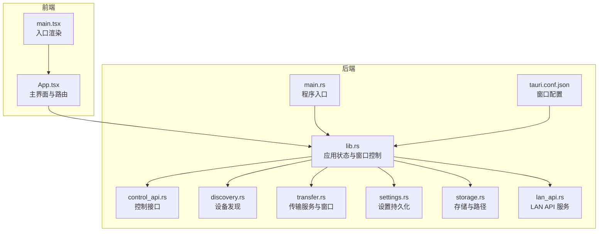
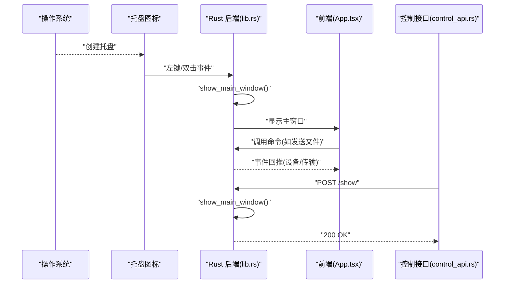
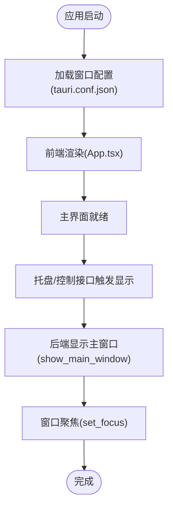
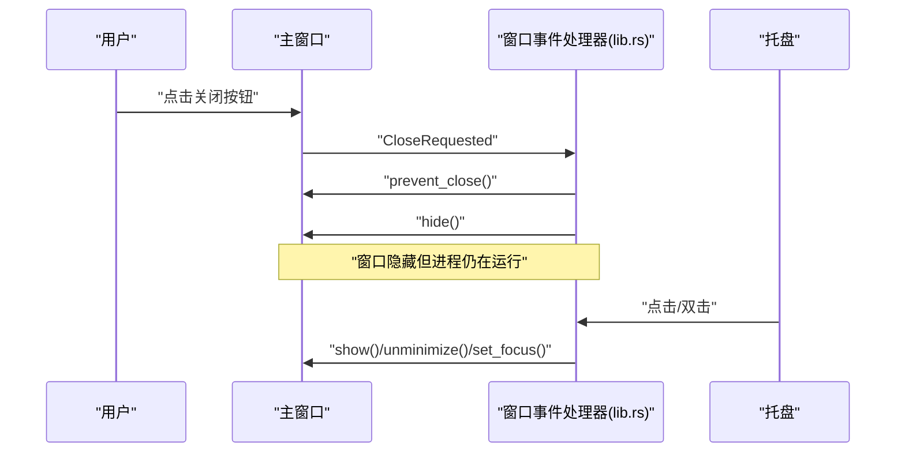
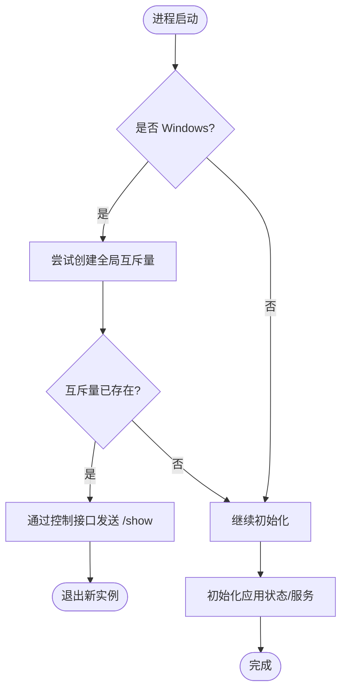
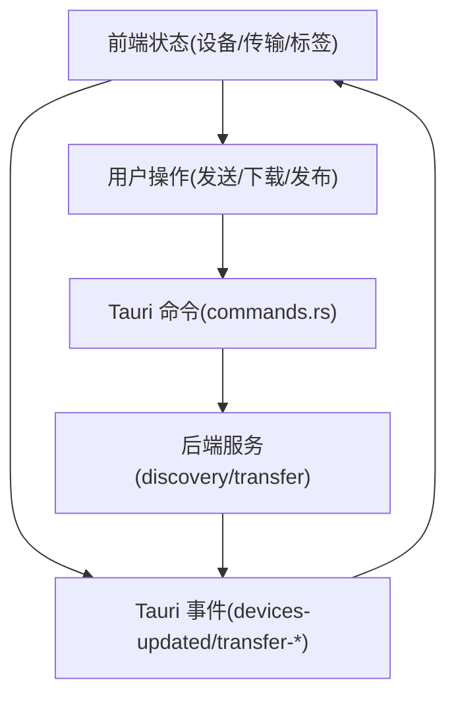
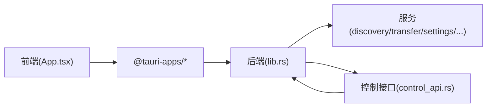

# 窗口管理

<cite>
**本文引用的文件**
- [main.tsx](file://quicklan-main/src/main.tsx)
- [App.tsx](file://quicklan-main/src/App.tsx)
- [main.rs](file://quicklan-main/src-tauri/src/main.rs)
- [tauri.conf.json](file://quicklan-main/src-tauri/tauri.conf.json)
- [lib.rs](file://quicklan-main/src-tauri/src/lib.rs)
- [commands.rs](file://quicklan-main/src-tauri/src/commands.rs)
- [control_api.rs](file://quicklan-main/src-tauri/src/control_api.rs)
- [discovery.rs](file://quicklan-main/src-tauri/src/discovery.rs)
- [transfer.rs](file://quicklan-main/src-tauri/src/transfer.rs)
- [settings.rs](file://quicklan-main/src-tauri/src/settings.rs)
- [storage.rs](file://quicklan-main/src-tauri/src/storage.rs)
- [lan_api.rs](file://quicklan-main/src-tauri/src/lan_api.rs)
</cite>

## 目录
1. [简介](#简介)
2. [项目结构](#项目结构)
3. [核心组件](#核心组件)
4. [架构总览](#架构总览)
5. [详细组件分析](#详细组件分析)
6. [依赖关系分析](#依赖关系分析)
7. [性能考虑](#性能考虑)
8. [故障排查指南](#故障排查指南)
9. [结论](#结论)

## 简介
本文件面向 QuickLAN 的窗口管理与单实例控制，系统性梳理主窗口的创建、显示与隐藏机制，窗口事件处理（关闭请求、最小化、焦点管理），单实例实现（跨平台策略），以及窗口状态管理与用户体验优化方案，并给出跨平台行为差异与解决方案。

## 项目结构
QuickLAN 采用前端 React + Tauri 桌面框架，窗口与托盘逻辑集中在 Rust 后端，前端负责 UI 渲染与交互，二者通过 Tauri 命令与事件通信。

图表来源
- [main.tsx](file://quicklan-main/src/main.tsx)
- [App.tsx](file://quicklan-main/src/App.tsx)
- [lib.rs](file://quicklan-main/src-tauri/src/lib.rs)
- [main.rs](file://quicklan-main/src-tauri/src/main.rs)
- [tauri.conf.json](file://quicklan-main/src-tauri/tauri.conf.json)
- [control_api.rs](file://quicklan-main/src-tauri/src/control_api.rs)
- [discovery.rs](file://quicklan-main/src-tauri/src/discovery.rs)
- [transfer.rs](file://quicklan-main/src-tauri/src/transfer.rs)
- [settings.rs](file://quicklan-main/src-tauri/src/settings.rs)
- [storage.rs](file://quicklan-main/src-tauri/src/storage.rs)
- [lan_api.rs](file://quicklan-main/src-tauri/src/lan_api.rs)

章节来源
- [main.tsx](file://quicklan-main/src/main.tsx)
- [App.tsx](file://quicklan-main/src/App.tsx)
- [lib.rs](file://quicklan-main/src-tauri/src/lib.rs)
- [main.rs](file://quicklan-main/src-tauri/src/main.rs)
- [tauri.conf.json](file://quicklan-main/src-tauri/tauri.conf.json)

## 核心组件
- 主窗口与路由
  - 前端根据 URL 参数决定渲染主界面还是“接收文件”子窗口，主界面负责设备、共享、传输等模块。
- 托盘与单实例
  - 构建托盘菜单，左键双击或点击“打开 QuickLAN”显示主窗口；Windows 使用互斥量确保单实例，非 Windows 平台直接允许多实例。
- 窗口事件
  - 拦截主窗口关闭请求，改为隐藏而非销毁，实现“最小化到托盘”的行为。
- 控制接口
  - 提供 /show 等控制命令，用于外部唤醒主窗口或触发业务动作。
- 传输窗口
  - 接收文件时动态创建独立窗口，避免阻塞主界面。

章节来源
- [App.tsx](file://quicklan-main/src/App.tsx)
- [lib.rs](file://quicklan-main/src-tauri/src/lib.rs)
- [control_api.rs](file://quicklan-main/src-tauri/src/control_api.rs)
- [transfer.rs](file://quicklan-main/src-tauri/src/transfer.rs)

## 架构总览
下图展示窗口生命周期与事件流：前端渲染主界面，后端注册托盘与窗口事件，控制接口在需要时唤醒主窗口。

图表来源
- [lib.rs](file://quicklan-main/src-tauri/src/lib.rs)
- [control_api.rs](file://quicklan-main/src-tauri/src/control_api.rs)
- [App.tsx](file://quicklan-main/src/App.tsx)

## 详细组件分析

### 主窗口创建与显示
- 前端入口负责挂载 React 根节点，渲染顶层组件。
- 主界面由顶层组件根据 URL 参数选择渲染主面板或“接收文件”子窗口。
- 后端通过 Tauri 窗口管理器获取名为 “main” 的窗口，执行显示、反最小化与聚焦操作。

图表来源
- [tauri.conf.json](file://quicklan-main/src-tauri/tauri.conf.json)
- [App.tsx](file://quicklan-main/src/App.tsx)
- [lib.rs](file://quicklan-main/src-tauri/src/lib.rs)

章节来源
- [main.tsx](file://quicklan-main/src/main.tsx)
- [App.tsx](file://quicklan-main/src/App.tsx)
- [tauri.conf.json](file://quicklan-main/src-tauri/tauri.conf.json)
- [lib.rs](file://quicklan-main/src-tauri/src/lib.rs)

### 窗口事件处理：关闭请求、最小化、焦点管理
- 关闭请求拦截
  - 监听主窗口 CloseRequested 事件，阻止默认关闭，改为隐藏窗口。
- 最小化与托盘
  - 通过托盘菜单项“打开 QuickLAN”或双击托盘图标显示主窗口。
- 焦点管理
  - 显示主窗口后立即请求焦点，保证用户体验一致性。

图表来源
- [lib.rs](file://quicklan-main/src-tauri/src/lib.rs)

章节来源
- [lib.rs](file://quicklan-main/src-tauri/src/lib.rs)

### 单实例实现：跨平台策略
- Windows
  - 创建全局互斥量，若已存在则判定为已有实例，向现有实例发送控制请求以唤醒窗口，然后退出新实例。
- 非 Windows
  - 直接允许启动，不强制单实例。

图表来源
- [lib.rs](file://quicklan-main/src-tauri/src/lib.rs)
- [control_api.rs](file://quicklan-main/src-tauri/src/control_api.rs)

章节来源
- [lib.rs](file://quicklan-main/src-tauri/src/lib.rs)
- [control_api.rs](file://quicklan-main/src-tauri/src/control_api.rs)

### 窗口状态管理与用户体验优化
- 状态驱动
  - 主界面使用 React 状态管理设备列表、传输列表、标签页、模态框等，确保 UI 与业务状态一致。
- 事件驱动更新
  - 后端通过 Tauri 事件推送设备变更、传输进度、完成与失败等，前端统一订阅并更新 UI。
- 传输窗口
  - 接收文件时弹出独立窗口，避免阻塞主界面，同时支持接受/拒绝操作。
- 拖拽与快捷操作
  - 支持拖拽文件进入不同区域，快速发起快传或加入共享索引。

图表来源
- [App.tsx](file://quicklan-main/src/App.tsx)
- [discovery.rs](file://quicklan-main/src-tauri/src/discovery.rs)
- [transfer.rs](file://quicklan-main/src-tauri/src/transfer.rs)
- [commands.rs](file://quicklan-main/src-tauri/src/commands.rs)

章节来源
- [App.tsx](file://quicklan-main/src/App.tsx)
- [discovery.rs](file://quicklan-main/src-tauri/src/discovery.rs)
- [transfer.rs](file://quicklan-main/src-tauri/src/transfer.rs)
- [commands.rs](file://quicklan-main/src-tauri/src/commands.rs)

### 跨平台窗口行为差异与解决方案
- Windows
  - 使用互斥量实现单实例；窗口关闭时隐藏到托盘；支持系统托盘图标与菜单。
- Linux/macOS
  - 默认允许多实例；托盘功能通过 Tauri 插件启用，行为与 Windows 类似但细节略有差异。
- 解决方案
  - 在非 Windows 平台保持一致的“最小化到托盘”体验，必要时通过配置或条件编译增强行为一致性。

章节来源
- [lib.rs](file://quicklan-main/src-tauri/src/lib.rs)
- [tauri.conf.json](file://quicklan-main/src-tauri/tauri.conf.json)

## 依赖关系分析
- 前端依赖 Tauri API 进行窗口与事件交互，命令通过 Tauri 注册分发至后端。
- 后端服务之间通过共享状态与事件解耦，避免循环依赖。
- 控制接口作为外部入口，仅依赖后端状态与窗口句柄。

图表来源
- [App.tsx](file://quicklan-main/src/App.tsx)
- [lib.rs](file://quicklan-main/src-tauri/src/lib.rs)
- [control_api.rs](file://quicklan-main/src-tauri/src/control_api.rs)

章节来源
- [App.tsx](file://quicklan-main/src/App.tsx)
- [lib.rs](file://quicklan-main/src-tauri/src/lib.rs)
- [control_api.rs](file://quicklan-main/src-tauri/src/control_api.rs)

## 性能考虑
- 窗口事件与命令处理均在异步运行时中执行，避免阻塞主线程。
- 传输进度与设备列表通过事件批量推送，减少频繁重渲染。
- 存储与网络 I/O 使用异步接口，降低 UI 卡顿风险。

## 故障排查指南
- 窗口无法显示
  - 检查托盘是否正常创建与响应；确认控制接口 /show 是否可连通。
- 点击关闭按钮窗口消失
  - 正常行为，应通过托盘菜单或控制接口唤醒；若托盘异常，检查后端托盘构建逻辑。
- 多实例问题
  - Windows 应仅有一个实例；若出现多个，检查互斥量创建与通知流程。
- 传输窗口未弹出
  - 确认传输服务是否正确触发 open_incoming_window；检查窗口标签唯一性与构建参数。

章节来源
- [lib.rs](file://quicklan-main/src-tauri/src/lib.rs)
- [control_api.rs](file://quicklan-main/src-tauri/src/control_api.rs)
- [transfer.rs](file://quicklan-main/src-tauri/src/transfer.rs)

## 结论
QuickLAN 的窗口管理以“托盘 + 单实例 + 事件驱动”为核心设计，既满足桌面应用的交互习惯，又通过控制接口与动态窗口提升可用性。建议在非 Windows 平台进一步统一托盘行为，并持续优化事件推送与状态同步，以获得更流畅的用户体验。