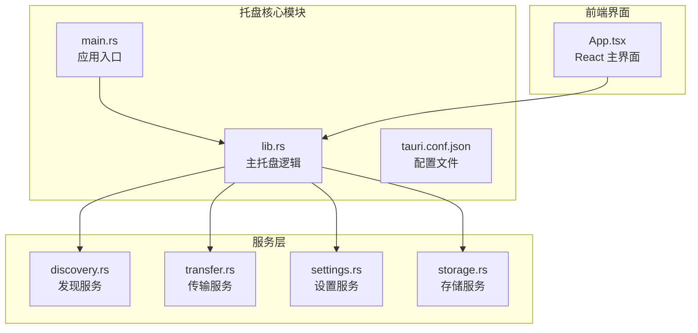
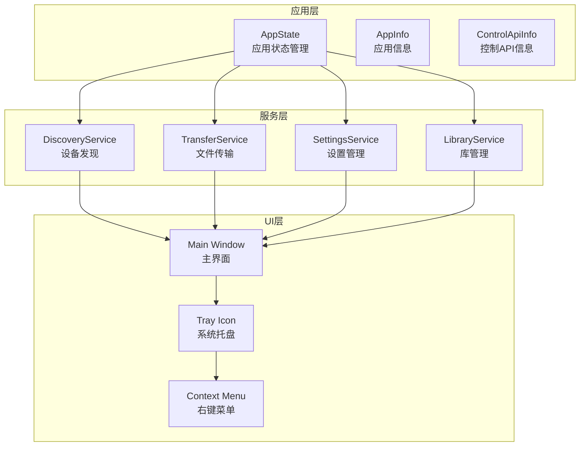
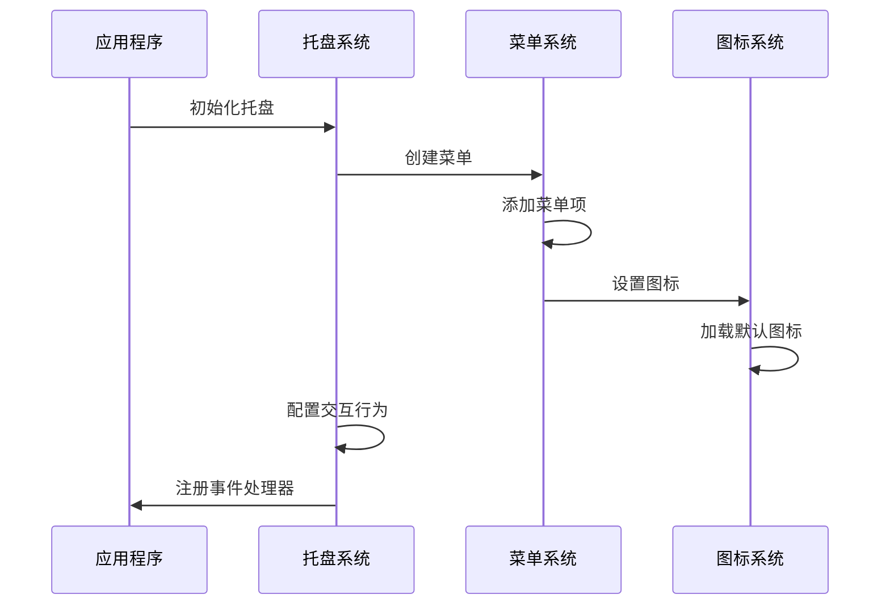
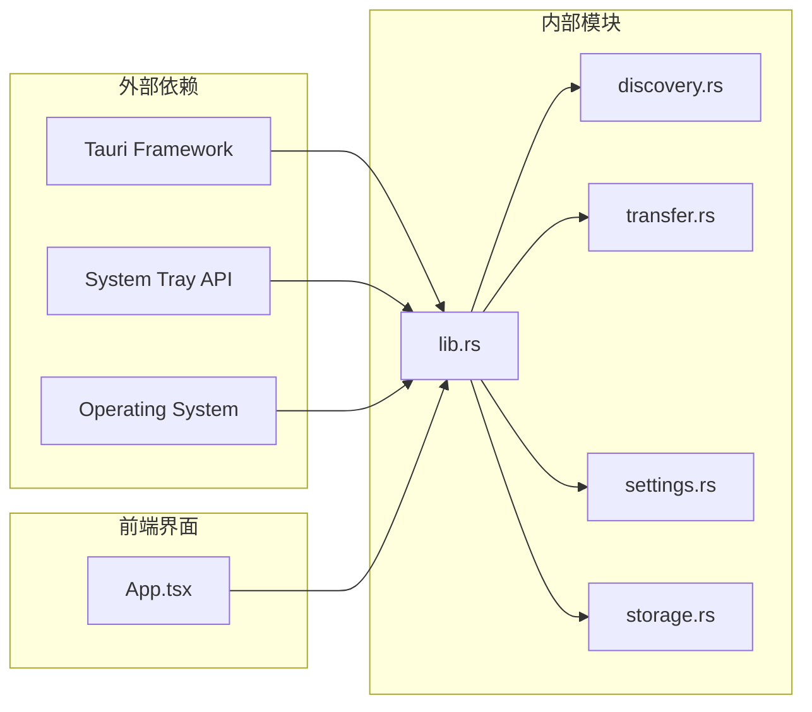

# 系统托盘集成

<cite>
**本文档引用的文件**
- [main.rs](file://quicklan-main/src-tauri/src/main.rs)
- [lib.rs](file://quicklan-main/src-tauri/src/lib.rs)
- [tauri.conf.json](file://quicklan-main/src-tauri/tauri.conf.json)
- [settings.rs](file://quicklan-main/src-tauri/src/settings.rs)
- [storage.rs](file://quicklan-main/src-tauri/src/storage.rs)
- [discovery.rs](file://quicklan-main/src-tauri/src/discovery.rs)
- [transfer.rs](file://quicklan-main/src-tauri/src/transfer.rs)
- [App.tsx](file://quicklan-main/src/App.tsx)
</cite>

## 目录
1. [简介](#简介)
2. [项目结构](#项目结构)
3. [核心组件](#核心组件)
4. [架构概览](#架构概览)
5. [详细组件分析](#详细组件分析)
6. [依赖关系分析](#依赖关系分析)
7. [性能考虑](#性能考虑)
8. [故障排除指南](#故障排除指南)
9. [结论](#结论)

## 简介

QuickLAN 系统托盘集成功能为用户提供了便捷的应用程序入口和状态管理。该功能实现了完整的系统托盘生命周期管理，包括托盘图标的创建、菜单构建、事件处理以及跨平台兼容性。

本系统采用 Tauri 框架实现跨平台桌面应用程序，通过系统原生托盘接口提供一致的用户体验。托盘功能支持多种交互方式，包括左键点击、右键菜单、双击等操作，并集成了通知和状态显示机制。

## 项目结构

QuickLAN 的托盘集成功能主要分布在以下关键文件中：

**图表来源**
- [lib.rs:66-81](file://quicklan-main/src-tauri/src/lib.rs#L66-L81)
- [main.rs:3-5](file://quicklan-main/src-tauri/src/main.rs#L3-L5)

**章节来源**
- [lib.rs:1-250](file://quicklan-main/src-tauri/src/lib.rs#L1-L250)
- [main.rs:1-6](file://quicklan-main/src-tauri/src/main.rs#L1-L6)
- [tauri.conf.json:1-48](file://quicklan-main/src-tauri/tauri.conf.json#L1-L48)

## 核心组件

### 托盘图标创建与配置

托盘图标通过 `TrayIconBuilder` 进行创建和配置，支持以下特性：

- **图标资源管理**: 自动使用默认窗口图标作为托盘图标
- **工具提示**: 显示 "QuickLAN" 工具提示文本
- **菜单集成**: 集成上下文菜单功能
- **交互控制**: 配置左键点击行为

### 菜单构建系统

托盘菜单采用 `MenuBuilder` 构建，包含两个主要菜单项：

- **打开 QuickLAN**: 显示主应用程序窗口
- **退出**: 安全退出应用程序

### 事件处理机制

系统实现了多层级的事件处理：

- **菜单事件**: 处理托盘菜单项点击
- **托盘图标事件**: 处理左键点击和双击事件
- **窗口事件**: 管理主窗口的显示/隐藏行为

**章节来源**
- [lib.rs:66-81](file://quicklan-main/src-tauri/src/lib.rs#L66-L81)
- [lib.rs:188-208](file://quicklan-main/src-tauri/src/lib.rs#L188-L208)

## 架构概览

QuickLAN 的托盘系统采用分层架构设计，确保各组件职责清晰分离：

**图表来源**
- [lib.rs:50-56](file://quicklan-main/src-tauri/src/lib.rs#L50-L56)
- [lib.rs:178-185](file://quicklan-main/src-tauri/src/lib.rs#L178-L185)

## 详细组件分析

### 托盘初始化流程

托盘初始化过程遵循严格的顺序执行：

**图表来源**
- [lib.rs:138-147](file://quicklan-main/src-tauri/src/lib.rs#L138-L147)
- [lib.rs:66-81](file://quicklan-main/src-tauri/src/lib.rs#L66-L81)

### 事件处理机制

系统实现了多层次的事件处理架构：

#### 菜单事件处理
- **显示窗口事件**: 处理 "打开 QuickLAN" 菜单项点击
- **退出事件**: 处理 "退出" 菜单项点击

#### 托盘图标事件处理
- **左键点击**: 触发主窗口显示
- **双击事件**: 同样触发主窗口显示
- **右键菜单**: 显示上下文菜单

#### 窗口事件处理
- **关闭请求**: 防止窗口真正关闭，改为隐藏
- **最小化**: 支持窗口最小化到托盘

**章节来源**
- [lib.rs:188-217](file://quicklan-main/src-tauri/src/lib.rs#L188-L217)

### 跨平台适配方案

QuickLAN 实现了完善的跨平台兼容性：

#### Windows 平台特性
- **单实例保护**: 使用互斥量确保单实例运行
- **进程间通信**: 通过 TCP 套接字与现有实例通信
- **系统集成**: 深度集成 Windows 系统托盘

#### 非 Windows 平台特性
- **简化实现**: 在其他平台上提供基础托盘功能
- **兼容模式**: 保持一致的用户体验

**章节来源**
- [lib.rs:83-136](file://quicklan-main/src-tauri/src/lib.rs#L83-L136)

### 通知和状态显示机制

系统通过多种方式实现状态通知：

#### 传输状态通知
- **实时进度**: 传输过程中的进度更新
- **完成通知**: 传输完成后的状态反馈
- **错误报告**: 传输失败时的错误信息

#### 网络状态显示
- **设备列表**: 在线设备数量和状态
- **网络统计**: 共享资源数量和状态
- **连接状态**: 网络连接健康状况

**章节来源**
- [transfer.rs:731-749](file://quicklan-main/src-tauri/src/transfer.rs#L731-L749)
- [discovery.rs:106-120](file://quicklan-main/src-tauri/src/discovery.rs#L106-L120)

## 依赖关系分析

托盘系统的依赖关系呈现清晰的层次结构：

**图表来源**
- [lib.rs:30-35](file://quicklan-main/src-tauri/src/lib.rs#L30-L35)
- [lib.rs:11-29](file://quicklan-main/src-tauri/src/lib.rs#L11-L29)

### 组件耦合度分析

托盘系统在设计上实现了良好的内聚性和低耦合：

- **高内聚**: 托盘相关功能集中在 lib.rs 中
- **低耦合**: 通过服务接口与核心业务逻辑解耦
- **可扩展性**: 易于添加新的托盘功能和菜单项

**章节来源**
- [lib.rs:1-250](file://quicklan-main/src-tauri/src/lib.rs#L1-L250)

## 性能考虑

### 内存管理
- **图标缓存**: 默认图标资源的智能缓存机制
- **事件处理器**: 避免重复注册相同的事件处理器
- **状态管理**: 合理的状态存储和访问模式

### 线程安全
- **并发访问**: 使用 Arc<Mutex<>> 确保线程安全
- **异步操作**: 避免阻塞主线程的长时间操作
- **资源释放**: 正确的资源生命周期管理

### 资源优化
- **图标尺寸**: 提供多种分辨率的图标资源
- **内存使用**: 控制托盘菜单项的数量和复杂度
- **系统资源**: 最小化对系统资源的占用

## 故障排除指南

### 常见问题及解决方案

#### 托盘图标不显示
- **检查图标资源**: 确认默认图标正确加载
- **验证权限**: 确保应用程序有访问系统托盘的权限
- **平台兼容性**: 检查目标操作系统的托盘支持情况

#### 菜单项无响应
- **事件监听器**: 验证事件处理器是否正确注册
- **菜单配置**: 检查菜单项的 ID 和回调函数
- **状态同步**: 确保应用程序状态与 UI 同步

#### 窗口显示问题
- **窗口管理**: 检查窗口的显示/隐藏逻辑
- **焦点管理**: 确保窗口获得正确的焦点
- **最小化行为**: 验证最小化到托盘的功能

**章节来源**
- [lib.rs:58-64](file://quicklan-main/src-tauri/src/lib.rs#L58-L64)
- [lib.rs:209-217](file://quicklan-main/src-tauri/src/lib.rs#L209-L217)

## 结论

QuickLAN 的系统托盘集成功能展现了现代桌面应用程序的最佳实践。通过精心设计的架构和完善的跨平台支持，该系统为用户提供了流畅、可靠的托盘体验。

### 主要优势
- **完整的功能覆盖**: 包含所有必要的托盘交互功能
- **优秀的用户体验**: 直观的界面设计和响应式交互
- **强大的跨平台支持**: 在不同操作系统上保持一致的行为
- **可维护的代码结构**: 清晰的模块划分和依赖关系

### 技术亮点
- **事件驱动架构**: 基于事件的松耦合设计
- **异步处理**: 高效的异步操作和状态管理
- **资源管理**: 智能的资源加载和缓存策略
- **错误处理**: 完善的异常处理和恢复机制

该托盘系统为 QuickLAN 提供了坚实的基础，支持未来功能的扩展和改进。通过持续的优化和维护，该系统将继续为用户提供优质的桌面应用程序体验。