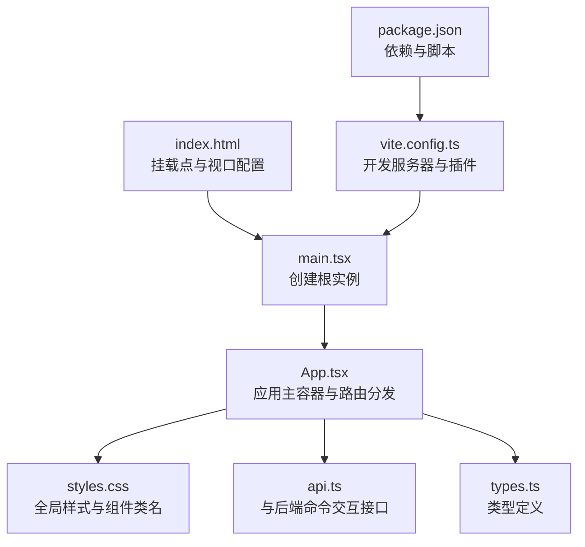
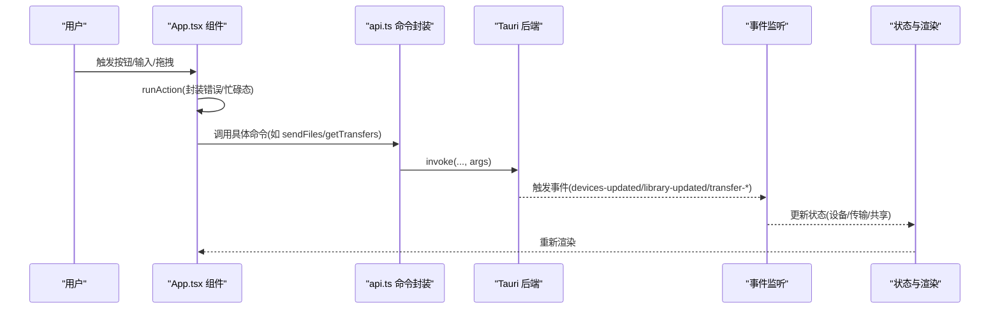
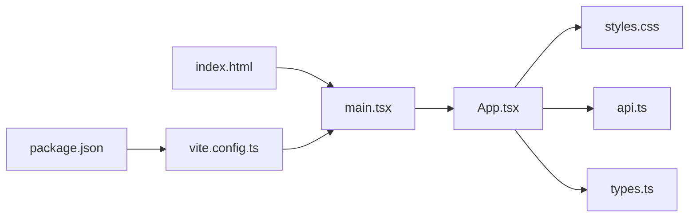
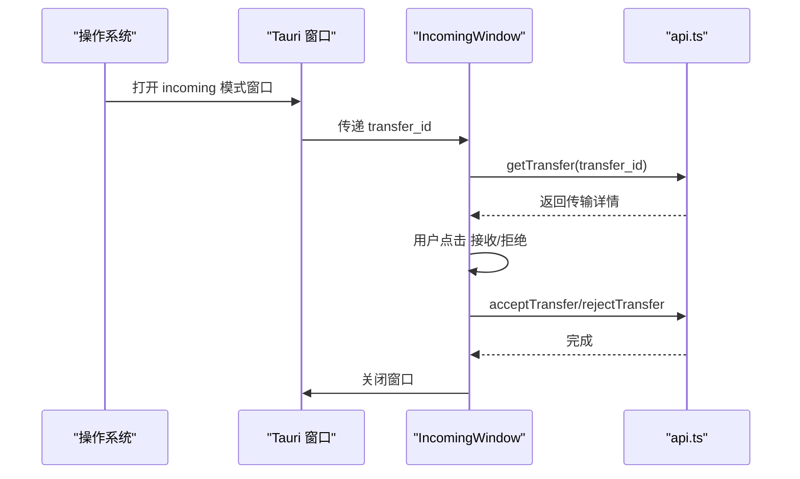

# UI 组件设计

<cite>
**本文引用的文件**
- [styles.css](file://quicklan-main/src/styles.css)
- [App.tsx](file://quicklan-main/src/App.tsx)
- [main.tsx](file://quicklan-main/src/main.tsx)
- [types.ts](file://quicklan-main/src/types.ts)
- [api.ts](file://quicklan-main/src/api.ts)
- [index.html](file://quicklan-main/index.html)
- [package.json](file://quicklan-main/package.json)
- [vite.config.ts](file://quicklan-main/vite.config.ts)
</cite>

## 目录
1. [简介](#简介)
2. [项目结构](#项目结构)
3. [核心组件](#核心组件)
4. [架构总览](#架构总览)
5. [组件详解](#组件详解)
6. [依赖关系分析](#依赖关系分析)
7. [性能考量](#性能考量)
8. [故障排查指南](#故障排查指南)
9. [结论](#结论)
10. [附录](#附录)

## 简介
本文件系统性梳理 QuickLAN 的 UI 组件设计，覆盖整体视觉与交互原则、组件规范（按钮、输入框、模态框、列表等）、响应式布局与移动端适配、样式组织与命名规范、主题与自定义样式建议、动画与交互反馈理念，并通过图示展示关键流程与数据流。文档面向开发者与产品/设计人员，既提供高层概览也给出可落地的实现参考。

## 项目结构
QuickLAN 前端基于 React + Vite 构建，使用 Tauri 作为原生壳，CSS 采用全局样式组织，组件以函数式组件与少量内联样式组合实现。页面入口在 index.html 中挂载 React 根节点，应用根组件负责路由与状态管理，样式集中于 styles.css。

**图表来源**
- [index.html:1-13](file://quicklan-main/index.html#L1-L13)
- [main.tsx:1-11](file://quicklan-main/src/main.tsx#L1-L11)
- [App.tsx:1-120](file://quicklan-main/src/App.tsx#L1-L120)
- [styles.css:1-682](file://quicklan-main/src/styles.css#L1-L682)
- [api.ts:1-130](file://quicklan-main/src/api.ts#L1-L130)
- [types.ts:1-128](file://quicklan-main/src/types.ts#L1-L128)
- [vite.config.ts:1-15](file://quicklan-main/vite.config.ts#L1-L15)
- [package.json:1-32](file://quicklan-main/package.json#L1-L32)

**章节来源**
- [index.html:1-13](file://quicklan-main/index.html#L1-L13)
- [main.tsx:1-11](file://quicklan-main/src/main.tsx#L1-L11)
- [vite.config.ts:1-15](file://quicklan-main/vite.config.ts#L1-L15)
- [package.json:1-32](file://quicklan-main/package.json#L1-L32)

## 核心组件
- 主容器与路由：顶层 App 组件根据 URL 参数决定渲染主界面或“接收文件”窗口；内部通过标签页切换不同功能区。
- 功能面板：设备、共享广场、我的共享、设置四个标签页，每个标签页对应独立组件，负责各自的数据筛选、排序与操作。
- 通用组件：TabButton、Empty、Dropzone、PathList、ShareRow、TransferRow、StatusBadge、IncomingWindow 等。
- 交互与状态：统一的错误提示（error 区块）、成功提示（toast）、加载状态（busy）、传输面板（TransfersPanel）等。

**章节来源**
- [App.tsx:78-554](file://quicklan-main/src/App.tsx#L78-L554)
- [App.tsx:556-573](file://quicklan-main/src/App.tsx#L556-L573)
- [App.tsx:919-977](file://quicklan-main/src/App.tsx#L919-L977)
- [App.tsx:979-1062](file://quicklan-main/src/App.tsx#L979-L1062)
- [App.tsx:1064-1074](file://quicklan-main/src/App.tsx#L1064-L1074)
- [App.tsx:1076-1122](file://quicklan-main/src/App.tsx#L1076-L1122)
- [App.tsx:1124-1131](file://quicklan-main/src/App.tsx#L1124-L1131)

## 架构总览
下图展示从用户交互到数据更新的关键序列：点击操作触发 runAction 封装的异步动作，调用 api.ts 中的命令，监听后端事件更新状态，最终驱动 UI 重绘。

**图表来源**
- [App.tsx:144-178](file://quicklan-main/src/App.tsx#L144-L178)
- [App.tsx:234-245](file://quicklan-main/src/App.tsx#L234-L245)
- [api.ts:13-130](file://quicklan-main/src/api.ts#L13-L130)

**章节来源**
- [App.tsx:144-178](file://quicklan-main/src/App.tsx#L144-L178)
- [api.ts:13-130](file://quicklan-main/src/api.ts#L13-L130)

## 组件详解

### 视觉设计与用户体验原则
- 对齐与留白：大量使用 flex/grid 容器，统一 gap 与 padding，确保内容层级清晰。
- 层级与卡片化：panel、resource、transfer 等采用圆角边框与背景色区分层级，提升可读性。
- 强弱对比：强调色用于按钮、选中态与状态徽标，弱信息使用 muted 辅助文本。
- 一致性：图标尺寸、字号、间距在同类组件中保持一致，减少认知负担。
- 无障碍：表单控件继承字体、禁用态有明确视觉反馈，按钮具备 hover/click 行为。

**章节来源**
- [styles.css:43-146](file://quicklan-main/src/styles.css#L43-L146)
- [styles.css:165-215](file://quicklan-main/src/styles.css#L165-L215)
- [styles.css:366-393](file://quicklan-main/src/styles.css#L366-L393)

### 按钮 Button
- 主要类型：primary、secondary、icon-button、compact。
- 语义与状态：primary 用于主要操作；secondary 用于次要操作；icon-button 仅图标按钮；compact 用于细粒度控制。
- 禁用态：禁用时降低透明度并改变光标，避免误触。
- 图标配合：按钮内嵌 Lucide 图标，保证视觉平衡与可读性。

**章节来源**
- [styles.css:181-215](file://quicklan-main/src/styles.css#L181-L215)
- [App.tsx:556-573](file://quicklan-main/src/App.tsx#L556-L573)
- [App.tsx:639-644](file://quicklan-main/src/App.tsx#L639-L644)

### 输入框 Input 与表单
- 基础输入：统一高度、边框、圆角与内边距，支持占位符与禁用态。
- 搜索框：searchbox 使用网格布局，左侧放图标，右侧放输入，便于识别。
- 表单栅格：form-grid 三列等分布局，适合多字段设置。
- 复杂输入：toggle-row 支持开关类设置；label 提供标题与说明。

**章节来源**
- [styles.css:217-226](file://quicklan-main/src/styles.css#L217-L226)
- [styles.css:349-364](file://quicklan-main/src/styles.css#L349-L364)
- [styles.css:419-423](file://quicklan-main/src/styles.css#L419-L423)
- [styles.css:449-458](file://quicklan-main/src/styles.css#L449-L458)

### 列表与卡片
- 列表容器：device-list、resource-list、file-list、transfer-grid 使用 grid 控制间距与换行。
- 卡片模式：resource、transfer、device 采用带边框与背景的卡片，突出内容区块。
- 选中态：device 支持选中高亮，增强交互反馈。
- 空态：Empty 组件统一空列表/无数据的视觉表达。

**章节来源**
- [styles.css:235-241](file://quicklan-main/src/styles.css#L235-L241)
- [styles.css:366-375](file://quicklan-main/src/styles.css#L366-L375)
- [styles.css:483-489](file://quicklan-main/src/styles.css#L483-L489)
- [styles.css:243-271](file://quicklan-main/src/styles.css#L243-L271)
- [App.tsx:1124-1131](file://quicklan-main/src/App.tsx#L1124-L1131)

### 模态框 Modal
- 结构：modal-backdrop + modal 内容区，modal-actions 右对齐操作按钮。
- 交互：输入型模态（密码访问）与确认型模态（编辑备注/接收文件）分别承载不同业务。
- 动画：Backdrop 提供半透明遮罩，modal 自带阴影与位移，形成层级感。

**章节来源**
- [styles.css:605-623](file://quicklan-main/src/styles.css#L605-L623)
- [styles.css:643-653](file://quicklan-main/src/styles.css#L643-L653)
- [App.tsx:477-551](file://quicklan-main/src/App.tsx#L477-L551)
- [App.tsx:1076-1122](file://quicklan-main/src/App.tsx#L1076-L1122)

### 传输与进度
- 传输卡片：包含文件名、方向、peer、进度条、速度/剩余时间、消息与打开路径按钮。
- 状态徽标：badge 根据状态动态类名显示不同颜色与文案。
- 进度条：progress 容器 + span 百分比宽度，过渡动画平滑。

**章节来源**
- [App.tsx:1020-1062](file://quicklan-main/src/App.tsx#L1020-L1062)
- [App.tsx:1064-1074](file://quicklan-main/src/App.tsx#L1064-L1074)
- [styles.css:504-516](file://quicklan-main/src/styles.css#L504-L516)
- [styles.css:518-542](file://quicklan-main/src/styles.css#L518-L542)

### 工具栏与标签页
- 工具栏：toolbar 使用 flex，内置搜索框、筛选器与排序器，支持换行。
- 标签页：tabs 底部分隔线，tab active 时高亮；TabButton 作为复用按钮组件。

**章节来源**
- [styles.css:51-86](file://quicklan-main/src/styles.css#L51-L86)
- [styles.css:102-123](file://quicklan-main/src/styles.css#L102-L123)
- [App.tsx:679-717](file://quicklan-main/src/App.tsx#L679-L717)
- [App.tsx:556-573](file://quicklan-main/src/App.tsx#L556-L573)

### 拖拽与占位区域
- Dropzone：提供拖拽区域与提示文案，支持拖入文件/文件夹，统一视觉与交互。
- PathList：展示已选择路径，支持逐项移除。

**章节来源**
- [App.tsx:919-940](file://quicklan-main/src/App.tsx#L919-L940)
- [App.tsx:941-956](file://quicklan-main/src/App.tsx#L941-L956)

### 响应式布局与移动端适配
- 断点：在窄屏（最大 920px）下调整布局：
  - shell、sendbar、topbar 改为纵向排列，提升可读性。
  - 两列 grid（.grid.two）与 resource、form-grid 回退为单列。
  - settings-row 在窄屏下将按钮/输入/代码块跨列铺满。
- 移动端 viewport：index.html 已设置 viewport，适配移动设备缩放。

**章节来源**
- [styles.css:655-681](file://quicklan-main/src/styles.css#L655-L681)
- [index.html:5](file://quicklan-main/index.html#L5)

### 样式系统组织与 CSS 类命名规范
- 命名体系：采用功能语义化命名（如 panel、tabs、status-strip、resource、transfer），辅以状态类（如 active、selected、disabled、compact）。
- 容器与布局：.grid/.stack/.panel-title 等统一布局容器，减少重复样式。
- 组件边界：每个组件尽量使用单一类名包裹，内部通过子选择器或组合类实现细节差异化。
- 动画与过渡：toast 使用 @keyframes 实现淡入淡出；progress 使用 transition 控制宽度变化。

**章节来源**
- [styles.css:43-146](file://quicklan-main/src/styles.css#L43-L146)
- [styles.css:580-594](file://quicklan-main/src/styles.css#L580-L594)
- [styles.css:504-516](file://quicklan-main/src/styles.css#L504-L516)

### 主题切换与自定义样式
- 当前主题：:root 定义基础色彩变量，整体为浅色背景与深色文字的明暗搭配。
- 自定义建议：
  - 新增 :root 变量（如 --theme-primary、--theme-bg）并在组件类中引用。
  - 通过 JS 切换根元素 class 或 CSS 变量，动态切换主题。
  - 为关键组件（按钮、输入、卡片）提供暗色变体类，按需覆盖默认值。
- 注意：当前仓库未内置主题切换逻辑，以上为扩展建议。

**章节来源**
- [styles.css:1-8](file://quicklan-main/src/styles.css#L1-L8)

### 动画效果与交互反馈
- Toast：固定定位，居中出现并淡出，提供轻量反馈。
- Progress：进度条宽度过渡，直观反映传输状态。
- 状态徽标：根据状态类名切换颜色与文案，快速传达结果。
- 按钮反馈：hover/click 与禁用态明确区分，避免误操作。

**章节来源**
- [styles.css:564-594](file://quicklan-main/src/styles.css#L564-L594)
- [styles.css:504-516](file://quicklan-main/src/styles.css#L504-L516)
- [App.tsx:1064-1074](file://quicklan-main/src/App.tsx#L1064-L1074)
- [styles.css:181-215](file://quicklan-main/src/styles.css#L181-L215)

## 依赖关系分析

**图表来源**
- [index.html:1-13](file://quicklan-main/index.html#L1-L13)
- [main.tsx:1-11](file://quicklan-main/src/main.tsx#L1-L11)
- [App.tsx:1-120](file://quicklan-main/src/App.tsx#L1-L120)
- [styles.css:1-682](file://quicklan-main/src/styles.css#L1-L682)
- [api.ts:1-130](file://quicklan-main/src/api.ts#L1-L130)
- [types.ts:1-128](file://quicklan-main/src/types.ts#L1-L128)
- [vite.config.ts:1-15](file://quicklan-main/vite.config.ts#L1-L15)
- [package.json:1-32](file://quicklan-main/package.json#L1-L32)

**章节来源**
- [index.html:1-13](file://quicklan-main/index.html#L1-L13)
- [main.tsx:1-11](file://quicklan-main/src/main.tsx#L1-L11)
- [vite.config.ts:1-15](file://quicklan-main/vite.config.ts#L1-L15)
- [package.json:1-32](file://quicklan-main/package.json#L1-L32)

## 性能考量
- 渲染优化：使用 useMemo 缓存过滤后的共享列表与分类集合，避免每次渲染都重新计算。
- 并发加载：首次进入页面并行拉取设备、传输、网络状态、设置等数据，缩短首屏时间。
- 事件监听：组件卸载时统一取消订阅，防止内存泄漏与重复监听。
- 传输面板：限制展示最近若干条记录，避免长列表造成重排压力。

**章节来源**
- [App.tsx:120-142](file://quicklan-main/src/App.tsx#L120-L142)
- [App.tsx:180-200](file://quicklan-main/src/App.tsx#L180-L200)
- [App.tsx:173-178](file://quicklan-main/src/App.tsx#L173-L178)
- [App.tsx:1010-1017](file://quicklan-main/src/App.tsx#L1010-L1017)

## 故障排查指南
- 错误提示：全局 error 区块用于展示异常信息，支持一键关闭。
- 成功提示：runAction 成功分支触发 toast，2.4 秒后自动消失。
- 传输状态：通过 transfer-completed/failed 等事件更新状态，若 UI 未刷新，检查事件订阅是否生效。
- 拖拽行为：onDragDropEvent 仅在 devices/mine 标签页启用不同逻辑，确认当前 tab 是否正确。

**章节来源**
- [App.tsx:295-302](file://quicklan-main/src/App.tsx#L295-L302)
- [App.tsx:215-218](file://quicklan-main/src/App.tsx#L215-L218)
- [App.tsx:144-178](file://quicklan-main/src/App.tsx#L144-L178)
- [App.tsx:165-170](file://quicklan-main/src/App.tsx#L165-L170)

## 结论
QuickLAN 的 UI 以卡片化布局与清晰的层级关系为核心，结合统一的按钮与输入规范、完善的响应式策略以及简洁的动画反馈，构建了高效易用的局域网共享与快传界面。通过模块化的组件与全局样式组织，系统具备良好的可维护性与扩展性。建议后续引入主题切换机制与更丰富的交互反馈，进一步提升可用性与个性化体验。

## 附录

### 关键流程：接收文件确认

**图表来源**
- [App.tsx:1076-1122](file://quicklan-main/src/App.tsx#L1076-L1122)
- [api.ts:25-39](file://quicklan-main/src/api.ts#L25-L39)