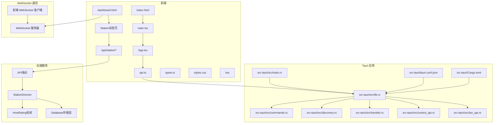
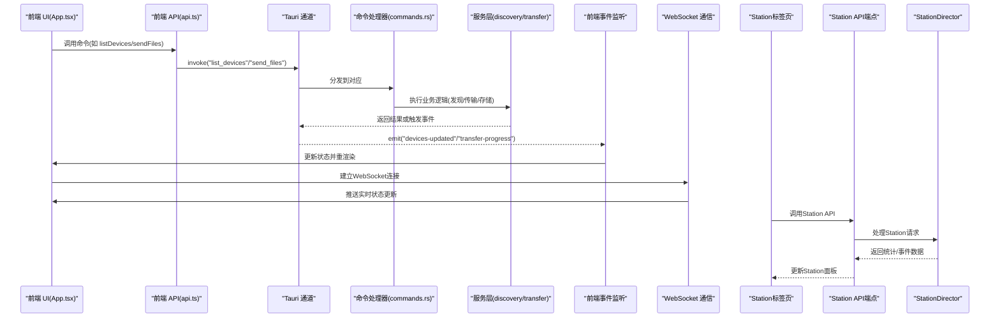
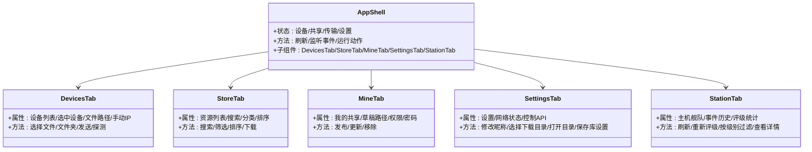
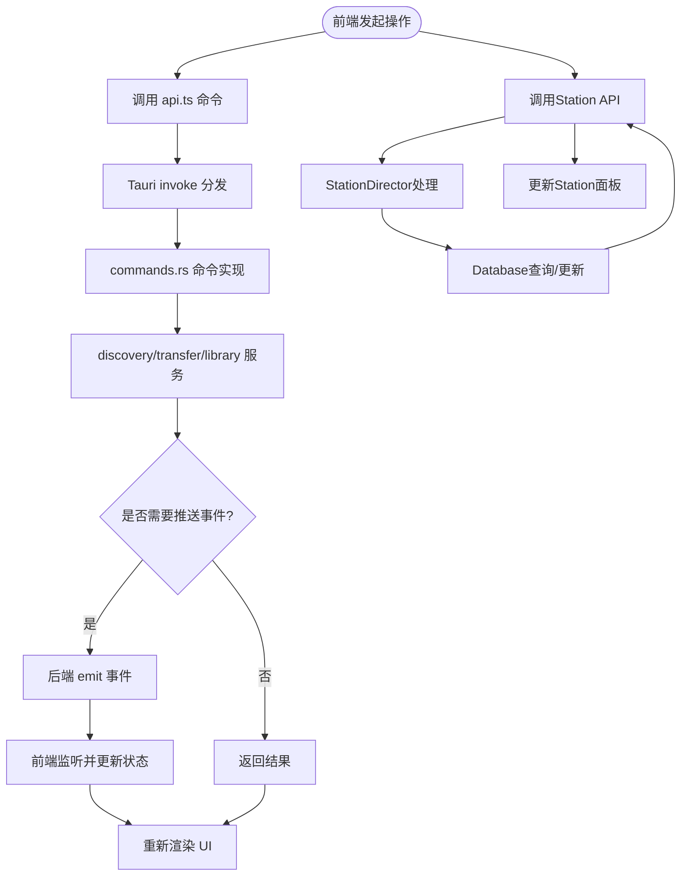
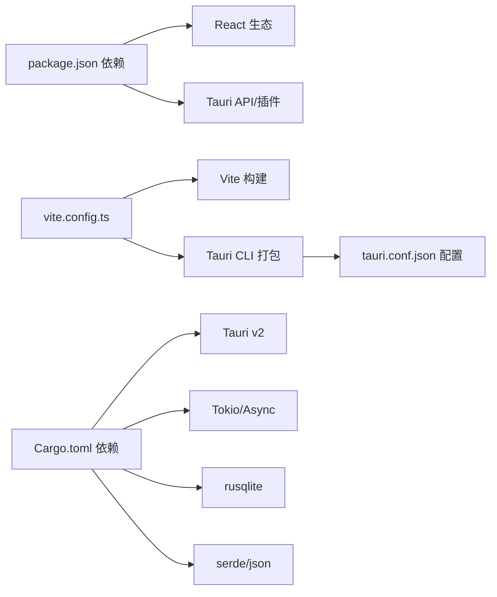

# 前端应用架构

<cite>
**本文档引用的文件**
- [README.md](file://quicklan-main/README.md)
- [dashboard.html](file://lan_mesh/web/templates/dashboard.html)
- [main.tsx](file://quicklan-main/src/main.tsx)
- [App.tsx](file://quicklan-main/src/App.tsx)
- [api.ts](file://quicklan-main/src/api.ts)
- [types.ts](file://quicklan-main/src/types.ts)
- [styles.css](file://quicklan-main/src/styles.css)
- [index.html](file://quicklan-main/index.html)
- [package.json](file://quicklan-main/package.json)
- [vite.config.ts](file://quicklan-main/vite.config.ts)
- [main.rs](file://quicklan-main/src-tauri/src/main.rs)
- [lib.rs](file://quicklan-main/src-tauri/src/lib.rs)
- [commands.rs](file://quicklan-main/src-tauri/src/commands.rs)
- [Cargo.toml](file://quicklan-main/src-tauri/Cargo.toml)
- [tauri.conf.json](file://quicklan-main/src-tauri/tauri.conf.json)
- [discovery.rs](file://quicklan-main/src-tauri/src/discovery.rs)
- [transfer.rs](file://quicklan-main/src-tauri/src/transfer.rs)
- [control_api.rs](file://quicklan-main/src-tauri/src/control_api.rs)
- [lan_api.rs](file://quicklan-main/src-tauri/src/lan_api.rs)
- [library.rs](file://quicklan-main/src-tauri/src/library.rs)
- [storage.rs](file://quicklan-main/src-tauri/src/storage.rs)
- [settings.rs](file://quicklan-main/src-tauri/src/settings.rs)
- [protocol.rs](file://quicklan-main/src-tauri/src/protocol.rs)
- [station_director.py](file://lan_mesh/station_director.py)
- [host_rating.py](file://lan_mesh/host_rating.py)
- [api.py](file://lan_mesh/api.py)
- [database.py](file://lan_mesh/database.py)
</cite>

## 更新摘要
**所做更改**
- 新增了Station标签页的详细分析，包含统计卡片、舰队表格、事件时间线等核心功能
- 更新了实时评级重计算功能的实现细节和交互流程
- 完善了按评级层级过滤主机的功能说明
- 新增了查看单个设备事件历史的详细流程
- 增强了WebSocket实时通信功能的分析，特别是Station标签页的实时数据同步

## 目录
1. [简介](#简介)
2. [项目结构](#项目结构)
3. [核心组件](#核心组件)
4. [架构总览](#架构总览)
5. [详细组件分析](#详细组件分析)
6. [依赖关系分析](#依赖关系分析)
7. [性能考虑](#性能考虑)
8. [故障排查指南](#故障排查指南)
9. [结论](#结论)
10. [附录](#附录)

## 简介
本文件为 QuickLAN 前端应用的全面架构文档，面向使用 React + Tauri 构建的桌面应用。文档覆盖组件层次结构、状态管理模式、路由设计、与后端 API 的集成方式与数据流管理，并对设备监控面板、文件传输界面、任务管理界面等用户界面模块进行深入说明。同时解释 Tauri 框架的使用与原生功能集成，以及样式设计与响应式布局的实现。最后提供开发环境配置与构建部署指南。

**更新** 本次更新重点关注dashboard.html模板中新增的Station标签页，这是一个全新的基础设施资源管理面板，提供统计卡片、舰队表格、事件时间线等功能，支持实时评级重计算、按评级层级过滤主机、查看单个设备事件历史等交互功能。

## 项目结构
QuickLAN 采用"前端 React/Vite + 后端 Tauri/Rust"的双层架构：
- 前端位于 quicklan-main/src，使用 React + TypeScript，通过 Vite 开发服务器提供页面渲染与交互逻辑。
- 后端位于 quicklan-main/src-tauri，使用 Rust + Tauri v2，负责系统托盘、窗口管理、网络发现、文件传输、本地存储与系统对话框等原生能力。
- 前后端通过 Tauri 的 invoke 通道通信，前端调用后端命令，后端通过事件向前端推送状态变更。
- 新增了基于dashboard.html的Web UI仪表盘，提供WebSocket实时通信功能和Station标签页的基础设施管理功能。

**图表来源**
- [index.html:1-13](file://quicklan-main/index.html#L1-L13)
- [main.tsx:1-11](file://quicklan-main/src/main.tsx#L1-L11)
- [App.tsx:1-1170](file://quicklan-main/src/App.tsx#L1-L1170)
- [api.ts:1-130](file://quicklan-main/src/api.ts#L1-L130)
- [lib.rs:1-250](file://quicklan-main/src-tauri/src/lib.rs#L1-L250)
- [commands.rs:1-259](file://quicklan-main/src-tauri/src/commands.rs#L1-L259)
- [discovery.rs:1-200](file://quicklan-main/src-tauri/src/discovery.rs#L1-L200)
- [transfer.rs:1-200](file://quicklan-main/src-tauri/src/transfer.rs#L1-L200)
- [control_api.rs:1-147](file://quicklan-main/src-tauri/src/control_api.rs#L1-L147)
- [lan_api.rs:1-177](file://quicklan-main/src-tauri/src/lan_api.rs#L1-L177)
- [dashboard.html:195-208](file://lan_mesh/web/templates/dashboard.html#L195-L208)
- [tauri.conf.json:1-48](file://quicklan-main/src-tauri/tauri.conf.json#L1-L48)
- [Cargo.toml:1-33](file://quicklan-main/src-tauri/Cargo.toml#L1-L33)
- [station_director.py:1-224](file://lan_mesh/station_director.py#L1-L224)
- [host_rating.py:1-115](file://lan_mesh/host_rating.py#L1-L115)
- [api.py:550-620](file://lan_mesh/api.py#L550-L620)
- [database.py:1-200](file://lan_mesh/database.py#L1-L200)

**章节来源**
- [index.html:1-13](file://quicklan-main/index.html#L1-L13)
- [main.tsx:1-11](file://quicklan-main/src/main.tsx#L1-L11)
- [vite.config.ts:1-15](file://quicklan-main/vite.config.ts#L1-L15)
- [package.json:1-32](file://quicklan-main/package.json#L1-L32)
- [tauri.conf.json:1-48](file://quicklan-main/src-tauri/tauri.conf.json#L1-L48)
- [Cargo.toml:1-33](file://quicklan-main/src-tauri/Cargo.toml#L1-L33)
- [README.md:16-22](file://quicklan-main/README.md#L16-L22)

## 核心组件
- 应用入口与挂载
  - index.html 提供根节点容器，main.tsx 使用 ReactDOM 将 App 渲染到 #root。
- 主应用组件 App
  - 负责全局状态管理（设备列表、共享资源、传输任务、设置等）、标签页切换、事件监听与错误提示。
  - 通过 api.ts 中的 invoke 方法与后端通信，订阅来自后端的设备/传输事件。
- API 层
  - api.ts 定义了所有前端可调用的后端命令，统一返回类型与错误处理。
- 类型定义
  - types.ts 定义了设备信息、传输状态、共享项、网络状态等核心数据模型。
- 样式与响应式
  - styles.css 提供基础布局、网格、卡片、按钮、表单、模态框、通知等样式，并在小屏设备上启用响应式适配。
- Web UI 仪表盘
  - dashboard.html 提供多标签面板界面，包含主机监控、任务管理、Agent状态、MCP工具、项目管理、Station等面板。
  - 通过WebSocket实现实时状态同步，提供丰富的交互功能。
- Station标签页
  - 专门的基础设施资源管理面板，提供统计卡片、舰队表格、事件时间线等核心功能。
  - 支持实时评级重计算、按评级层级过滤主机、查看单个设备事件历史等高级功能。

**章节来源**
- [main.tsx:1-11](file://quicklan-main/src/main.tsx#L1-L11)
- [App.tsx:1-1170](file://quicklan-main/src/App.tsx#L1-L1170)
- [api.ts:1-130](file://quicklan-main/src/api.ts#L1-L130)
- [types.ts:1-128](file://quicklan-main/src/types.ts#L1-L128)
- [styles.css:1-682](file://quicklan-main/src/styles.css#L1-L682)
- [dashboard.html:1-575](file://lan_mesh/web/templates/dashboard.html#L1-L575)

## 架构总览
QuickLAN 的前后端交互通过 Tauri 的 invoke 与事件机制完成：
- 前端通过 api.ts 的函数发起命令调用，后端在 lib.rs 中注册 invoke 处理器，commands.rs 实现具体业务逻辑。
- 后端通过 tauri::Emitter 向前端推送设备更新、传输进度、完成/失败等事件，前端在 App.tsx 中统一监听并更新状态。
- 原生能力由 Tauri 插件提供，如系统对话框、文件打开位置、托盘菜单等。
- 新增的WebSocket通信机制通过dashboard.html实现，提供实时状态更新和事件推送。
- Station标签页通过专用API端点提供基础设施资源管理功能。

**图表来源**
- [App.tsx:144-178](file://quicklan-main/src/App.tsx#L144-L178)
- [api.ts:13-130](file://quicklan-main/src/api.ts#L13-L130)
- [lib.rs:218-246](file://quicklan-main/src-tauri/src/lib.rs#L218-L246)
- [commands.rs:11-259](file://quicklan-main/src-tauri/src/commands.rs#L11-L259)
- [dashboard.html:195-208](file://lan_mesh/web/templates/dashboard.html#L195-L208)
- [station_director.py:1-224](file://lan_mesh/station_director.py#L1-L224)
- [api.py:550-620](file://lan_mesh/api.py#L550-L620)

## 详细组件分析

### 组件层次与状态管理
- 根组件 App.tsx
  - 状态集中管理：设备列表、共享资源、我的共享、传输任务、应用设置、网络状态、控制 API 信息等。
  - 生命周期：首次进入时并行拉取设备、传输、网络、设置、库设置、控制 API 与应用信息；随后订阅后端事件以保持 UI 最新。
  - 事件处理：监听 devices-updated、library-updated、incoming-transfer、transfer-progress/completed/failed 等事件，实时更新 UI。
  - 工作流封装：runAction 包装异步操作，统一错误捕获与忙碌态处理；upsertTransfer 维护传输列表的去重与截断。
- 标签页组件
  - 设备页 DevicesTab：展示在线设备、手动探测、快速发送文件、备注编辑。
  - 共享广场 StoreTab：资源检索、分类筛选、排序、下载。
  - 我的共享 MineTab：发布共享、更新共享、移除共享、草稿路径管理。
  - 设置页 SettingsTab：昵称、下载目录、库设置、网络诊断、控制 API 信息。
  - **新增** Station标签页：基础设施资源管理，包含统计卡片、舰队表格、事件时间线等。
- 通用 UI 组件
  - 模态框：密码下载弹窗、设备备注编辑弹窗、Station详情弹窗。
  - 通知 Toast：轻提示反馈操作结果。
  - 错误条：集中显示错误消息并可关闭。
  - 列表与表格：设备列表、资源列表、传输列表，支持分页与排序。

**图表来源**
- [App.tsx:86-554](file://quicklan-main/src/App.tsx#L86-L554)

**章节来源**
- [App.tsx:86-554](file://quicklan-main/src/App.tsx#L86-L554)

### 数据模型与复杂度
- 核心类型
  - 设备信息：包含设备标识、名称、IP、端口、在线状态、分享数量、延迟、评级等。
  - 传输信息：包含批次 ID、文件名、大小、已传输字节、速度、ETA、方向、状态、对端信息、保存路径、哈希等。
  - 共享项：包含共享 ID、名称、分类、权限、拥有者、版本、大小、时间戳、下载计数、是否本地等。
  - 网络状态：包含 UDP/TCP/API 端口、本地 IP、广播目标等。
  - **新增** Station主机信息：包含评级等级(S/A/B/C/D)、评级分数、评级摘要、事件历史等。
- 复杂度分析
  - 过滤与排序：资源列表按分类与关键词过滤并按字段排序，时间复杂度 O(n log n) 为主（排序主导）。
  - 传输列表维护：每次事件插入新项并去重截断，时间复杂度 O(n)。
  - **新增** Station评级统计：按评级层级统计主机数量，时间复杂度 O(n)。

**章节来源**
- [types.ts:1-128](file://quicklan-main/src/types.ts#L1-L128)
- [App.tsx:120-142](file://quicklan-main/src/App.tsx#L120-L142)

### 与后端 API 的集成与数据流
- 命令注册与调用
  - 后端在 lib.rs 中注册所有命令，前端通过 api.ts 的函数名与参数映射到后端命令。
  - commands.rs 实现具体逻辑：如发送文件、下载共享、更新设备备注、列出共享资源等。
- 事件驱动
  - discovery.rs 在设备发现与库变更时向前端推送 devices-updated 与 library-updated。
  - transfer.rs 在传输进度、完成、失败时推送相应事件，前端统一 upsertTransfer 更新列表。
- 错误处理
  - 前端 runAction 统一捕获异常并显示错误条；后端命令返回 Result，错误信息透传至前端。
- **新增** Station API集成
  - 通过/api/station/*端点提供Station标签页功能，包括舰队查询、事件历史、评级重算等。
  - WebSocket实时推送主机状态变更，Station标签页自动刷新相关数据。

**图表来源**
- [api.ts:13-130](file://quicklan-main/src/api.ts#L13-L130)
- [lib.rs:218-246](file://quicklan-main/src-tauri/src/lib.rs#L218-L246)
- [commands.rs:11-259](file://quicklan-main/src-tauri/src/commands.rs#L11-L259)
- [discovery.rs:60-120](file://quicklan-main/src-tauri/src/discovery.rs#L60-L120)
- [transfer.rs:130-159](file://quicklan-main/src-tauri/src/transfer.rs#L130-L159)
- [station_director.py:1-224](file://lan_mesh/station_director.py#L1-L224)
- [api.py:550-620](file://lan_mesh/api.py#L550-L620)

**章节来源**
- [api.ts:1-130](file://quicklan-main/src/api.ts#L1-L130)
- [lib.rs:218-246](file://quicklan-main/src-tauri/src/lib.rs#L218-L246)
- [commands.rs:11-259](file://quicklan-main/src-tauri/src/commands.rs#L11-L259)
- [discovery.rs:60-120](file://quicklan-main/src-tauri/src/discovery.rs#L60-L120)
- [transfer.rs:130-159](file://quicklan-main/src-tauri/src/transfer.rs#L130-L159)

### 用户界面组件详解
- 设备监控面板 DevicesTab
  - 功能：展示在线设备、手动探测 IP、选择文件/文件夹、拖拽上传、发送到选定设备、编辑设备备注。
  - 关键交互：选择设备后启用发送按钮；拖拽文件进入"拖入文件进行点对点快传"区域；点击探测按钮发送广播。
- 文件传输界面
  - 传输列表：显示传输进度、速度、ETA、状态徽章；支持接受/拒绝、移除记录、清理已完成。
  - 接收流程：后端收到传输请求时触发 incoming-transfer 事件，前端弹出确认窗口，用户确认后开始传输。
- 任务管理界面 MineTab
  - 发布共享：选择文件/文件夹，设置分类与权限（公开/密码），填写密码后发布；发布后自动刷新我的共享列表。
  - 更新与移除：支持更新共享版本（替换文件）与取消共享。
- 设置界面 SettingsTab
  - 昵称：本地可见的设备别名，更新后广播网络。
  - 下载目录：选择默认下载路径并打开所在目录。
  - 库设置：加速开关、最大上传速度、并发任务数、缓存限制等。
  - 网络诊断：显示 UDP/TCP/API 端口、本地 IP 与广播目标。
  - 控制 API：显示本地回环绑定地址，用于单实例唤醒等场景。
- **新增** Station标签页
  - **统计卡片**：显示在线主机数、离线主机数、各评级主机数量(S级、A级、B级、C/D级)。
  - **舰队表格**：展示所有主机的详细信息，包括状态、设备名、IP、平台、评级、最后心跳时间。
  - **事件时间线**：显示最近的主机事件，包括加入、离开、注册、评级变更等。
  - **实时功能**：支持重新评级所有主机、按评级层级过滤主机、查看单个设备事件历史。

**章节来源**
- [App.tsx:304-554](file://quicklan-main/src/App.tsx#L304-L554)
- [transfer.rs:161-178](file://quicklan-main/src-tauri/src/transfer.rs#L161-L178)
- [dashboard.html:200-218](file://lan_mesh/web/templates/dashboard.html#L200-L218)
- [dashboard.html:512-568](file://lan_mesh/web/templates/dashboard.html#L512-L568)

### Tauri 框架使用与原生功能集成
- 应用生命周期与托盘
  - 单实例保护：Windows 上通过互斥量确保仅有一个实例运行；若已有实例则通过控制 API 通知其显示主窗口。
  - 托盘菜单：提供"打开 QuickLAN/退出"，左键点击或双击托盘图标显示主窗口。
  - 窗口行为：关闭窗口改为隐藏到托盘，避免进程退出。
- 原生能力
  - 对话框：选择文件/文件夹、打开路径位置（资源管理器定位）。
  - 插件：tauri-plugin-dialog、tauri-plugin-opener。
- 配置
  - tauri.conf.json 定义产品名、版本、窗口尺寸、最小尺寸、拖拽启用、打包目标与安装器语言等。
  - Cargo.toml 定义依赖与构建产物类型（静态库/动态库/rlib）。

**章节来源**
- [lib.rs:138-218](file://quicklan-main/src-tauri/src/lib.rs#L138-L218)
- [lib.rs:66-81](file://quicklan-main/src-tauri/src/lib.rs#L66-L81)
- [lib.rs:126-136](file://quicklan-main/src-tauri/src/lib.rs#L126-L136)
- [tauri.conf.json:1-48](file://quicklan-main/src-tauri/tauri.conf.json#L1-L48)
- [Cargo.toml:1-33](file://quicklan-main/src-tauri/Cargo.toml#L1-L33)

### 样式设计与响应式布局
- 基础样式
  - 采用 CSS 变量与语义化类名，统一字体、间距与颜色体系。
  - 布局采用 Flex/Grid，常见结构：顶部栏、标签页、内容区、侧边面板、工具栏、列表与卡片。
- 组件样式
  - 按钮：主次按钮、紧凑按钮、禁用态；图标按钮统一尺寸与悬停状态。
  - 表单：输入框、选择框、栅格表单、设置行（含开关）。
  - 列表：设备列表、资源列表、文件列表、传输列表，均支持省略号与换行控制。
  - 徽章：根据传输状态显示不同颜色背景。
  - **新增** Station样式：统计卡片、舰队表格、事件时间线的专用样式设计。
- 响应式
  - 在小屏设备上调整网格为单列、工具栏换行、设置行两列变单列等，保证可用性。

**章节来源**
- [styles.css:1-682](file://quicklan-main/src/styles.css#L1-L682)
- [dashboard.html:79-111](file://lan_mesh/web/templates/dashboard.html#L79-L111)

### 基于dashboard.html的重大重构分析
**更新** 本次更新重点分析了基于dashboard.html的Web UI重大重构，该重构引入了更加丰富的多面板界面设计和Station标签页：

- **多面板架构设计**
  - 采用标签页导航系统，包含设备监控、任务管理、Agent状态、MCP工具、项目管理、Station等六个核心面板
  - 每个面板都有独立的数据获取和渲染逻辑，通过WebSocket实现实时状态同步
  - 支持面板间的无缝切换和状态保持

- **Station标签页核心功能**
  - **统计卡片**：实时显示在线主机数、离线主机数、各评级主机数量(S级、A级、B级、C/D级)，提供直观的资源概览
  - **舰队表格**：展示所有主机的详细信息，包括状态、设备名、IP、平台、评级、最后心跳时间，支持点击查看详情
  - **事件时间线**：显示最近的主机事件，包括加入、离开、注册、评级变更等，支持查看事件详情
  - **实时功能**：支持重新评级所有主机、按评级层级过滤主机、查看单个设备事件历史

- **任务管理系统**
  - 任务提交：支持任务名称、描述和项目关联的完整表单
  - 任务状态：实时显示任务进度百分比、子任务完成情况
  - 任务详情：支持查看子任务执行状态、分配的Agent、输出结果等详细信息

- **项目管理功能**
  - 项目创建：支持预算设置、路由策略、允许模型等配置
  - 预算控制：实时显示预算使用情况和剩余金额
  - 项目详情：展示项目配置、消费记录、令牌使用统计等

- **Agent状态监控**
  - Agent注册：自动发现和注册Worker节点
  - 资源监控：显示CPU、内存、磁盘使用率
  - 技能工具：展示Agent的技能和可用工具列表

- **MCP工具集成**
  - Server管理：支持注册、注销MCP Server
  - 工具调用：提供工具参数配置和执行结果展示
  - 实时通信：通过WebSocket实现工具调用的实时反馈

**章节来源**
- [dashboard.html:1-575](file://lan_mesh/web/templates/dashboard.html#L1-L575)

### WebSocket 实时通信功能
**新增** 本次更新新增了WebSocket实时通信功能的详细分析：

- **WebSocket 连接建立**
  - 前端通过 `connectWS()` 函数建立WebSocket连接，使用当前主机的协议（HTTP/HTTPS）和端口
  - 连接成功后更新状态指示器为"已连接"，断开时显示"重连中..."并自动重连

- **实时事件推送**
  - 主机状态：当有新的主机注册、心跳或主机信息变更时，推送 `hosts`、`heartbeat`、`host_registered` 事件
  - 任务状态：任务提交时推送 `task_submitted` 事件
  - Agent状态：Agent注册时推送 `agent_registered` 事件
  - 项目状态：项目创建、更新、归档时推送相应事件
  - **新增** Station事件：主机评级变更、事件历史更新等

- **面板自动刷新**
  - 接收特定事件后自动调用对应的刷新函数（如 `refreshHosts()`、`refreshTasks()`、`refreshAgents()`、`refreshProjects()`、`refreshStation()`）
  - 确保各个面板的数据始终保持最新状态

- **连接状态管理**
  - 成功连接：更新WebSocket状态指示器为在线状态
  - 连接断开：自动重连，间隔3秒，确保系统的健壮性
  - 错误处理：对各种异常情况进行适当的错误处理和用户提示

**章节来源**
- [dashboard.html:195-208](file://lan_mesh/web/templates/dashboard.html#L195-L208)
- [dashboard.html:210-250](file://lan_mesh/web/templates/dashboard.html#L210-L250)
- [dashboard.html:252-289](file://lan_mesh/web/templates/dashboard.html#L252-L289)
- [dashboard.html:291-320](file://lan_mesh/web/templates/dashboard.html#L291-L320)
- [dashboard.html:322-384](file://lan_mesh/web/templates/dashboard.html#L322-L384)
- [dashboard.html:386-451](file://lan_mesh/web/templates/dashboard.html#L386-L451)

### Station标签页的基础设施管理功能
**新增** 本次更新新增了Station标签页的详细分析：

- **StationDirector核心职责**
  - 主机注册入站：评级 + 记录事件 + 持久化
  - 心跳处理：更新实时指标，资源变化时重新评级
  - 离线检测：记录离线事件
  - 舰队管理：主机列表/统计/事件历史
  - 资源池查询：按评级筛选在线主机

- **评级系统实现**
  - 基于CPU核数、内存大小、磁盘容量计算综合得分(0-100分)
  - 映射到S/A/B/C/D五级评级
  - 生成人类可读的评级摘要
  - 支持手动重新评级和自动重算

- **事件管理系统**
  - 记录主机加入(join)、离开(leave)、重新注册(register)、评级变更(rating_change)等事件
  - 支持查询单台主机事件历史和全站事件流
  - 提供事件时间线展示

- **API端点设计**
  - `/api/station/fleet`：获取主机舰队列表
  - `/api/station/hosts/{device_id}/events`：获取单台主机事件历史
  - `/api/station/events`：获取全站事件流
  - `/api/station/rate`：重新评级所有主机
  - `/api/station/stats`：获取统计摘要

- **前端交互功能**
  - 统计卡片：实时显示在线/离线主机数和各评级分布
  - 舰队表格：支持点击查看详情、按状态筛选
  - 事件时间线：显示最近事件，支持查看详情
  - 实时刷新：WebSocket连接自动更新Station面板数据

**章节来源**
- [station_director.py:1-224](file://lan_mesh/station_director.py#L1-L224)
- [host_rating.py:1-115](file://lan_mesh/host_rating.py#L1-L115)
- [api.py:550-620](file://lan_mesh/api.py#L550-L620)
- [database.py:310-399](file://lan_mesh/database.py#L310-L399)
- [dashboard.html:512-568](file://lan_mesh/web/templates/dashboard.html#L512-L568)

## 依赖关系分析
- 前端依赖
  - React 生态：react、react-dom、lucide-react 图标库。
  - 开发工具：@vitejs/plugin-react、typescript、vite。
  - Tauri 集成：@tauri-apps/api、@tauri-apps/plugin-dialog、@tauri-apps/plugin-opener。
- 后端依赖
  - Tauri v2、tokio 异步运行时、serde JSON、rusqlite、uuid、get_if_addrs 网络接口、hostname 等。
- 构建与打包
  - Vite 作为开发服务器与构建工具，Tauri CLI 负责打包与安装器生成。

**图表来源**
- [package.json:15-30](file://quicklan-main/package.json#L15-L30)
- [vite.config.ts:1-15](file://quicklan-main/vite.config.ts#L1-L15)
- [Cargo.toml:19-33](file://quicklan-main/src-tauri/Cargo.toml#L19-L33)
- [tauri.conf.json:27-46](file://quicklan-main/src-tauri/tauri.conf.json#L27-L46)

**章节来源**
- [package.json:1-32](file://quicklan-main/package.json#L1-L32)
- [Cargo.toml:1-33](file://quicklan-main/src-tauri/Cargo.toml#L1-L33)
- [vite.config.ts:1-15](file://quicklan-main/vite.config.ts#L1-L15)
- [tauri.conf.json:1-48](file://quicklan-main/src-tauri/tauri.conf.json#L1-L48)

## 性能考虑
- 并行初始化：App 首次加载时并行获取设备、传输、网络、设置、库设置、控制 API 与应用信息，减少首屏等待。
- 事件驱动更新：通过后端事件增量更新，避免轮询带来的开销。
- 列表截断：传输列表最多保留固定数量最新项，防止内存膨胀。
- 异步与非阻塞：传输监听使用非阻塞 TCP 监听与 Tokio 异步 IO，提升并发能力。
- 端口绑定策略：传输监听尝试连续端口范围绑定，提高可用性。
- WebSocket 优化：采用自动重连机制，合理设置重连间隔，确保实时通信的稳定性。
- **新增** Station面板优化：使用Promise.all并行获取舰队和事件数据，减少请求次数。

**章节来源**
- [App.tsx:180-200](file://quicklan-main/src/App.tsx#L180-L200)
- [App.tsx:208-213](file://quicklan-main/src/App.tsx#L208-L213)
- [transfer.rs:41-63](file://quicklan-main/src-tauri/src/transfer.rs#L41-L63)
- [transfer.rs:130-159](file://quicklan-main/src-tauri/src/transfer.rs#L130-L159)
- [dashboard.html:195-208](file://lan_mesh/web/templates/dashboard.html#L195-L208)
- [dashboard.html:514-521](file://lan_mesh/web/templates/dashboard.html#L514-L521)

## 故障排查指南
- 常见错误与处理
  - 目标设备不在线：发送文件前检查设备在线状态，必要时手动探测 IP。
  - 无文件选择：发送前校验文件路径集合非空。
  - 路径选择失败：对话框取消或路径非法时返回空值，前端需做容错。
  - 打开资源管理器失败：命令执行失败时返回错误信息，前端显示错误条。
- 日志与诊断
  - 网络诊断：查看 UDP/TCP/API 端口、本地 IP 与广播目标，确认网络连通性。
  - 控制 API：确认本地回环绑定地址可访问，用于单实例唤醒。
- 事件调试
  - 订阅 devices-updated 与 library-updated 事件，观察设备列表与共享列表变化。
  - 订阅 transfer-progress/completed/failed 事件，核对传输状态与速度。
- WebSocket 连接问题
  - 检查WebSocket连接状态指示器，确认是否显示"已连接"
  - 查看浏览器开发者工具的网络面板，确认WebSocket握手和数据传输正常
  - 验证后端WebSocket服务是否正常运行
- **新增** Station标签页问题排查
  - 检查Station API端点是否正常响应
  - 验证StationDirector是否正确初始化
  - 确认数据库中的主机评级数据是否正确
  - 查看事件日志，确认事件记录是否正常

**章节来源**
- [commands.rs:35-46](file://quicklan-main/src-tauri/src/commands.rs#L35-L46)
- [commands.rs:117-128](file://quicklan-main/src-tauri/src/commands.rs#L117-L128)
- [commands.rs:157-187](file://quicklan-main/src-tauri/src/commands.rs#L157-L187)
- [App.tsx:144-178](file://quicklan-main/src/App.tsx#L144-L178)
- [dashboard.html:195-208](file://lan_mesh/web/templates/dashboard.html#L195-L208)

## 结论
QuickLAN 前端应用以 React + Tauri 为核心，实现了简洁高效的局域网文件共享与传输体验。通过清晰的组件分层、事件驱动的状态管理与完善的原生能力集成，应用在易用性与性能之间取得良好平衡。基于dashboard.html的重大重构进一步增强了应用的功能性和用户体验，引入了多面板架构和实时状态监控能力。新增的Station标签页提供了完整的基础设施资源管理功能，支持实时评级重计算、按评级层级过滤主机、查看单个设备事件历史等高级功能。新增的WebSocket实时通信功能提供了更加流畅的用户体验，实现了前后端之间的高效数据同步。建议在后续迭代中进一步完善错误恢复与日志上报机制，并持续优化传输并发与缓存策略。

## 附录

### 开发环境配置
- 安装依赖
  - 前端：npm install
  - 后端：Rust 工具链与 Tauri 依赖（见 Cargo.toml）
- 启动开发
  - 前端开发：npm run dev（Vite 开发服务器）
  - Tauri 开发：npm run app:dev（Tauri dev）
- 预览与构建
  - 预览：npm run preview
  - 构建应用：npm run app:build（生成安装包）

**章节来源**
- [package.json:7-14](file://quicklan-main/package.json#L7-L14)
- [vite.config.ts:1-15](file://quicklan-main/vite.config.ts#L1-L15)
- [tauri.conf.json:6-11](file://quicklan-main/src-tauri/tauri.conf.json#L6-L11)