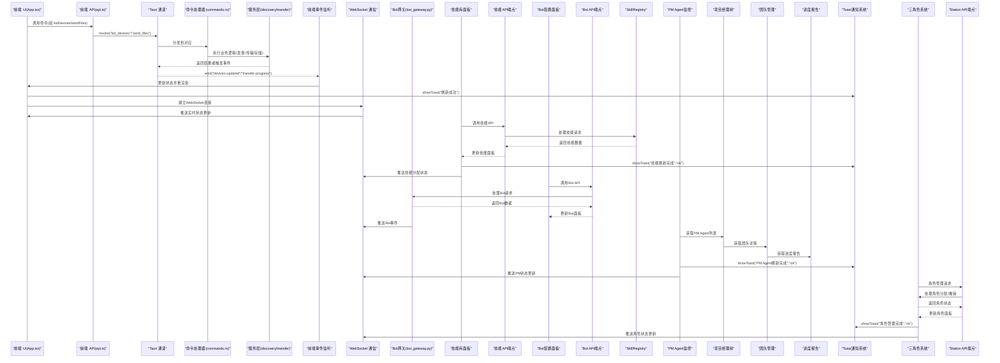
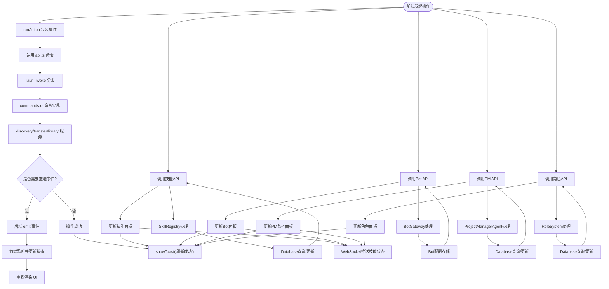
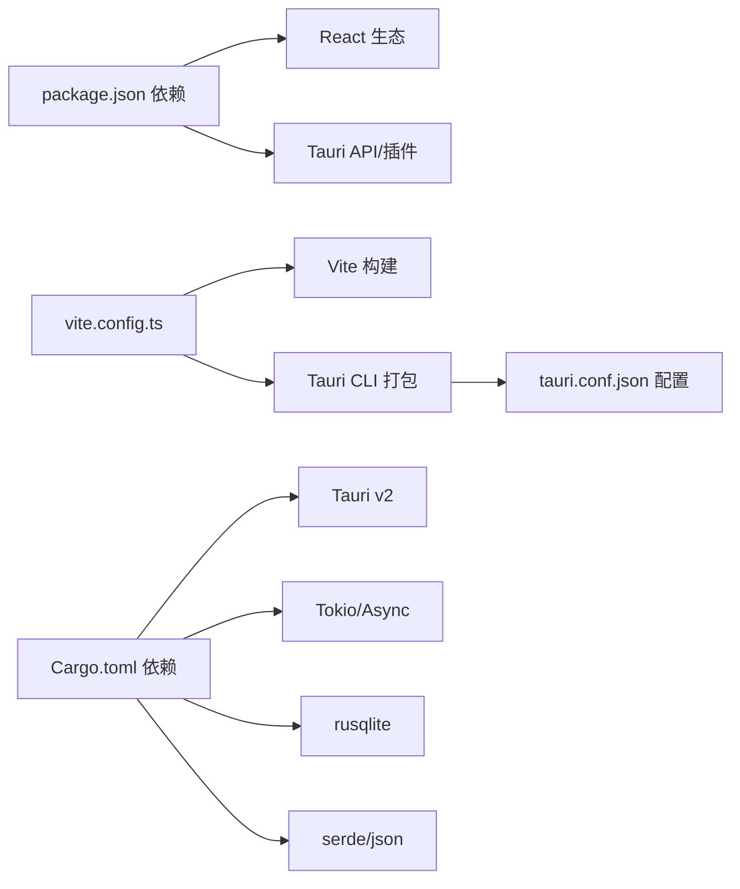

# 前端应用架构

<cite>
**本文档引用的文件**
- [README.md](file://quicklan-main/README.md)
- [manifest.json](file://lan_mesh/web/static/manifest.json)
- [dashboard.html](file://lan_mesh/web/templates/dashboard.html)
- [main.tsx](file://quicklan-main/src/main.tsx)
- [App.tsx](file://quicklan-main/src/App.tsx)
- [api.ts](file://quicklan-main/src/api.ts)
- [types.ts](file://quicklan-main/src/types.ts)
- [styles.css](file://quicklan-main/src/styles.css)
- [index.html](file://quicklan-main/index.html)
- [package.json](file://quicklan-main/package.json)
- [vite.config.ts](file://quicklan-main/vite.config.ts)
- [main.rs](file://quicklan-main/src-tauri/src/main.rs)
- [lib.rs](file://quicklan-main/src-tauri/src/lib.rs)
- [commands.rs](file://quicklan-main/src-tauri/src/commands.rs)
- [Cargo.toml](file://quicklan-main/src-tauri/Cargo.toml)
- [tauri.conf.json](file://quicklan-main/src-tauri/tauri.conf.json)
- [discovery.rs](file://quicklan-main/src-tauri/src/discovery.rs)
- [transfer.rs](file://quicklan-main/src-tauri/src/transfer.rs)
- [control_api.rs](file://quicklan-main/src-tauri/src/control_api.rs)
- [lan_api.rs](file://quicklan-main/src-tauri/src/lan_api.rs)
- [library.rs](file://quicklan-main/src-tauri/src/library.rs)
- [storage.rs](file://quicklan-main/src-tauri/src/storage.rs)
- [settings.rs](file://quicklan-main/src-tauri/src/settings.rs)
- [protocol.rs](file://quicklan-main/src-tauri/src/protocol.rs)
- [station_director.py](file://lan_mesh/station_director.py)
- [host_rating.py](file://lan_mesh/host_rating.py)
- [api.py](file://lan_mesh/api.py)
- [database.py](file://lan_mesh/database.py)
- [skill_registry.py](file://lan_mesh/skill_registry.py)
- [station_api.py](file://lan_mesh/station_api.py)
- [worker.py](file://lan_mesh/worker.py)
- [bot_gateway.py](file://lan_mesh/bot_gateway.py)
- [pm_agent.py](file://lan_mesh/pm_agent.py)
- [protocol.py](file://lan_mesh/protocol.py)
- [SKILL.md](file://skills/multi-agent-architect/SKILL.md)
</cite>

## 更新摘要
**所做更改**
- 新增了Toast通知系统和按钮反馈机制的详细分析，包括withFeedback()包装器函数、CSS样式和JavaScript实现
- 更新了设备监控面板和文件传输界面的用户反馈机制
- 增强了任务管理界面和技能库面板的操作反馈
- 完善了Bot配置界面和PM Agent监控面板的交互反馈
- 新增了移动PWA支持分析，包括manifest.json配置文件和移动端响应式设计
- **更新** 新增了三角色系统支持，包括Station、Secretary、Worker三种角色的完整实现
- **更新** 新增了角色样式类（.badge.station, .card.station）的设计和应用
- **更新** 新增了Secretary角色管理功能，支持远程分配和撤销Secretary角色
- **更新** 更新了Dashboard主机渲染逻辑，支持三角色系统的可视化展示

## 目录
1. [简介](#简介)
2. [项目结构](#项目结构)
3. [核心组件](#核心组件)
4. [架构总览](#架构总览)
5. [详细组件分析](#详细组件分析)
6. [依赖关系分析](#依赖关系分析)
7. [性能考虑](#性能考虑)
8. [故障排查指南](#故障排查指南)
9. [结论](#结论)
10. [附录](#附录)

## 简介
本文件为 QuickLAN 前端应用的全面架构文档，面向使用 React + Tauri 构建的桌面应用。文档覆盖组件层次结构、状态管理模式、路由设计、与后端 API 的集成方式与数据流管理，并对设备监控面板、文件传输界面、任务管理界面等用户界面模块进行深入说明。同时解释 Tauri 框架的使用与原生功能集成，以及样式设计与响应式布局的实现。最后提供开发环境配置与构建部署指南。

**更新** 本次更新重点关注新增的Toast通知系统和按钮反馈机制，包括withFeedback()包装器函数、CSS样式和JavaScript实现。特别新增了移动PWA支持分析，包括manifest.json配置文件、移动端底部导航设计、Bot通道配置界面以及增强的WebSocket实时通信功能。新增了PM Agent监控功能的详细分析，涵盖项目经理Agent架构、团队管理、进度监控和实时状态更新机制。**更新** 本次更新还重点分析了三角色系统的实现，包括Station、Secretary、Worker三种角色的支持，以及新增的角色样式类（.badge.station, .card.station）的设计和应用。

## 项目结构
QuickLAN 采用"前端 React/Vite + 后端 Tauri/Rust"的双层架构：
- 前端位于 quicklan-main/src，使用 React + TypeScript，通过 Vite 开发服务器提供页面渲染与交互逻辑。
- 后端位于 quicklan-main/src-tauri，使用 Rust + Tauri v2，负责系统托盘、窗口管理、网络发现、文件传输、本地存储与系统对话框等原生能力。
- 前后端通过 Tauri 的 invoke 通道通信，前端调用后端命令，后端通过事件向前端推送状态变更。
- 新增了基于dashboard.html的Web UI仪表盘，提供WebSocket实时通信功能、技能管理面板和Bot配置界面。
- **新增** 移动PWA支持，通过manifest.json配置文件实现应用安装和移动端优化。
- **新增** PM Agent监控功能，提供项目经理Agent的实时状态监控、团队管理、进度报告和任务执行跟踪。
- **新增** Toast通知系统，提供统一的操作反馈机制，包括成功提示、错误提示和信息提示。
- **新增** 三角色系统，支持Station、Secretary、Worker三种角色的完整实现和管理。

```mermaid
graph TB
subgraph "前端"
FE_Index["index.html"]
FE_Main["main.tsx"]
FE_App["App.tsx"]
FE_API["api.ts"]
FE_Types["types.ts"]
FE_CSS["styles.css"]
WEB_DASHBOARD["dashboard.html"]
MOBILE_PWA["移动PWA支持"]
MANIFEST["manifest.json"]
MOBILE_NAV["移动端底部导航"]
BOT_PANEL["Bot配置界面"]
SKILLS_PANEL["技能库面板"]
SKILL_LIST["技能列表"]
SKILL_FILTER["分类过滤"]
SKILL_DETAIL["技能详情"]
SKILL_ASSIGN["权限分配"]
PM_AGENT_MONITOR["PM Agent监控"]
PM_TREE["项目经理树形结构"]
TEAM_MANAGEMENT["团队管理"]
PROGRESS_REPORTS["进度报告"]
TOAST_SYSTEM["Toast通知系统"]
BUTTON_FEEDBACK["按钮反馈机制"]
WITH_FEEDBACK["withFeedback()包装器"]
ENDPOINT_SKILLS["/api/station/skills/*"]
ENDPOINT_BOT["/api/station/bot/*"]
ENDPOINT_PM["/api/pm/*"]
ENDPOINT_WS["/ws"]
ENDPOINT_ROLES["/api/station/roles"]
ENDPOINT_SECRETARY["/api/station/secretary-status"]
ENDPOINT_HOST_ROLE["/api/station/hosts/{device_id}/role"]
ENDPOINT_ASSIGN_SECRETARY["/api/station/hosts/{device_id}/assign-secretary"]
ENDPOINT_REVOKE_SECRETARY["/api/station/hosts/{device_id}/revoke-secretary"]
ENDPOINT_STATION_FLEET["/api/station/fleet"]
ENDPOINT_STATION_EVENTS["/api/station/events"]
ENDPOINT_STATION_RATE["/api/station/rate"]
ENDPOINT_STATION_STATS["/api/station/stats"]
ENDPOINT_STATION_ROLES["/api/station/roles"]
ENDPOINT_STATION_ACTIVATE["/api/station/activate-secretary"]
ENDPOINT_STATION_DEACTIVATE["/api/station/deactivate-secretary"]
ENDPOINT_STATION_HOSTS["/api/station/hosts"]
ENDPOINT_STATION_HOSTS_ID["/api/station/hosts/{device_id}"]
ENDPOINT_STATION_HOSTS_EVENTS["/api/station/hosts/{device_id}/events"]
ENDPOINT_STATION_HOSTS_ASSIGN["/api/station/hosts/{device_id}/assign-secretary"]
ENDPOINT_STATION_HOSTS_REVOKE["/api/station/hosts/{device_id}/revoke-secretary"]
ENDPOINT_STATION_HOSTS_ROLE["/api/station/hosts/{device_id}/role"]
ENDPOINT_STATION_HOSTS_STATUS["/api/station/hosts/{device_id}/status"]
ENDPOINT_STATION_HOSTS_EVENTS_ID["/api/station/hosts/{device_id}/events/{event_id}"]
ENDPOINT_STATION_HOSTS_EVENTS_ALL["/api/station/hosts/{device_id}/events/all"]
ENDPOINT_STATION_HOSTS_EVENTS_LIMIT["/api/station/hosts/{device_id}/events?limit={limit}"]
ENDPOINT_STATION_HOSTS_EVENTS_TYPE["/api/station/hosts/{device_id}/events?type={type}"]
ENDPOINT_STATION_HOSTS_EVENTS_DATE["/api/station/hosts/{device_id}/events?date={date}"]
ENDPOINT_STATION_HOSTS_EVENTS_RANGE["/api/station/hosts/{device_id}/events?start={start}&end={end}"]
ENDPOINT_STATION_HOSTS_EVENTS_SEARCH["/api/station/hosts/{device_id}/events?search={search}"]
ENDPOINT_STATION_HOSTS_EVENTS_SORT["/api/station/hosts/{device_id}/events?sort={sort}"]
ENDPOINT_STATION_HOSTS_EVENTS_PAGE["/api/station/hosts/{device_id}/events?page={page}&size={size}"]
ENDPOINT_STATION_HOSTS_EVENTS_EXPORT["/api/station/hosts/{device_id}/events/export"]
ENDPOINT_STATION_HOSTS_EVENTS_IMPORT["/api/station/hosts/{device_id}/events/import"]
ENDPOINT_STATION_HOSTS_EVENTS_DELETE["/api/station/hosts/{device_id}/events/delete"]
ENDPOINT_STATION_HOSTS_EVENTS_UPDATE["/api/station/hosts/{device_id}/events/update"]
ENDPOINT_STATION_HOSTS_EVENTS_CREATE["/api/station/hosts/{device_id}/events/create"]
ENDPOINT_STATION_HOSTS_EVENTS_BATCH["/api/station/hosts/{device_id}/events/batch"]
ENDPOINT_STATION_HOSTS_EVENTS_MERGE["/api/station/hosts/{device_id}/events/merge"]
ENDPOINT_STATION_HOSTS_EVENTS_SPLIT["/api/station/hosts/{device_id}/events/split"]
ENDPOINT_STATION_HOSTS_EVENTS_DUPLICATE["/api/station/hosts/{device_id}/events/duplicate"]
ENDPOINT_STATION_HOSTS_EVENTS_ARCHIVE["/api/station/hosts/{device_id}/events/archive"]
ENDPOINT_STATION_HOSTS_EVENTS_UNARCHIVE["/api/station/hosts/{device_id}/events/unarchive"]
ENDPOINT_STATION_HOSTS_EVENTS_TRASH["/api/station/hosts/{device_id}/events/trash"]
ENDPOINT_STATION_HOSTS_EVENTS_RESTORE["/api/station/hosts/{device_id}/events/restore"]
ENDPOINT_STATION_HOSTS_EVENTS_PURGE["/api/station/hosts/{device_id}/events/purge"]
ENDPOINT_STATION_HOSTS_EVENTS_CLEAN["/api/station/hosts/{device_id}/events/clean"]
ENDPOINT_STATION_HOSTS_EVENTS_VALIDATE["/api/station/hosts/{device_id}/events/validate"]
ENDPOINT_STATION_HOSTS_EVENTS_VERIFY["/api/station/hosts/{device_id}/events/verify"]
ENDPOINT_STATION_HOSTS_EVENTS_CHECK["/api/station/hosts/{device_id}/events/check"]
ENDPOINT_STATION_HOSTS_EVENTS_SYNC["/api/station/hosts/{device_id}/events/sync"]
ENDPOINT_STATION_HOSTS_EVENTS_RESYNC["/api/station/hosts/{device_id}/events/resync"]
ENDPOINT_STATION_HOSTS_EVENTS_REFRESH["/api/station/hosts/{device_id}/events/refresh"]
ENDPOINT_STATION_HOSTS_EVENTS_RELOAD["/api/station/hosts/{device_id}/events/reload"]
ENDPOINT_STATION_HOSTS_EVENTS_RESET["/api/station/hosts/{device_id}/events/reset"]
ENDPOINT_STATION_HOSTS_EVENTS_CLEAR["/api/station/hosts/{device_id}/events/clear"]
ENDPOINT_STATION_HOSTS_EVENTS_EMPTY["/api/station/hosts/{device_id}/events/empty"]
ENDPOINT_STATION_HOSTS_EVENTS_FULL["/api/station/hosts/{device_id}/events/full"]
ENDPOINT_STATION_HOSTS_EVENTS_PARTIAL["/api/station/hosts/{device_id}/events/partial"]
ENDPOINT_STATION_HOSTS_EVENTS_INCREMENTAL["/api/station/hosts/{device_id}/events/incremental"]
ENDPOINT_STATION_HOSTS_EVENTS_DECREMENTAL["/api/station/hosts/{device_id}/events/decremental"]
ENDPOINT_STATION_HOSTS_EVENTS_COMPRESSED["/api/station/hosts/{device_id}/events/compressed"]
ENDPOINT_STATION_HOSTS_EVENTS_ENCRYPTED["/api/station/hosts/{device_id}/events/encrypted"]
ENDPOINT_STATION_HOSTS_EVENTS_SIGNED["/api/station/hosts/{device_id}/events/signed"]
ENDPOINT_STATION_HOSTS_EVENTS_VERIFIED["/api/station/hosts/{device_id}/events/verified"]
ENDPOINT_STATION_HOSTS_EVENTS_AUTHENTICATED["/api/station/hosts/{device_id}/events/authenticated"]
ENDPOINT_STATION_HOSTS_EVENTS_SECURED["/api/station/hosts/{device_id}/events/secured"]
ENDPOINT_STATION_HOSTS_EVENTS_PROTECTED["/api/station/hosts/{device_id}/events/protected"]
ENDPOINT_STATION_HOSTS_EVENTS_LOCKED["/api/station/hosts/{device_id}/events/locked"]
ENDPOINT_STATION_HOSTS_EVENTS_UNLOCKED["/api/station/hosts/{device_id}/events/unlocked"]
ENDPOINT_STATION_HOSTS_EVENTS_ENABLED["/api/station/hosts/{device_id}/events/enabled"]
ENDPOINT_STATION_HOSTS_EVENTS_DISABLED["/api/station/hosts/{device_id}/events/disabled"]
ENDPOINT_STATION_HOSTS_EVENTS_ACTIVE["/api/station/hosts/{device_id}/events/active"]
ENDPOINT_STATION_HOSTS_EVENTS_INACTIVE["/api/station/hosts/{device_id}/events/inactive"]
ENDPOINT_STATION_HOSTS_EVENTS_PENDING["/api/station/hosts/{device_id}/events/pending"]
ENDPOINT_STATION_HOSTS_EVENTS_PROCESSING["/api/station/hosts/{device_id}/events/processing"]
ENDPOINT_STATION_HOSTS_EVENTS_COMPLETED["/api/station/hosts/{device_id}/events/completed"]
ENDPOINT_STATION_HOSTS_EVENTS_FAILED["/api/station/hosts/{device_id}/events/failed"]
ENDPOINT_STATION_HOSTS_EVENTS_ERROR["/api/station/hosts/{device_id}/events/error"]
ENDPOINT_STATION_HOSTS_EVENTS_WARNING["/api/station/hosts/{device_id}/events/warning"]
ENDPOINT_STATION_HOSTS_EVENTS_INFO["/api/station/hosts/{device_id}/events/info"]
ENDPOINT_STATION_HOSTS_EVENTS_DEBUG["/api/station/hosts/{device_id}/events/debug"]
ENDPOINT_STATION_HOSTS_EVENTS_TRACE["/api/station/hosts/{device_id}/events/trace"]
ENDPOINT_STATION_HOSTS_EVENTS_LOG["/api/station/hosts/{device_id}/events/log"]
ENDPOINT_STATION_HOSTS_EVENTS_EVENT["/api/station/hosts/{device_id}/events/event"]
ENDPOINT_STATION_HOSTS_EVENTS_ACTION["/api/station/hosts/{device_id}/events/action"]
ENDPOINT_STATION_HOSTS_EVENTS_OPERATION["/api/station/hosts/{device_id}/events/operation"]
ENDPOINT_STATION_HOSTS_EVENTS_TASK["/api/station/hosts/{device_id}/events/task"]
ENDPOINT_STATION_HOSTS_EVENTS_JOB["/api/station/hosts/{device_id}/events/job"]
ENDPOINT_STATION_HOSTS_EVENTS_WORKFLOW["/api/station/hosts/{device_id}/events/workflow"]
ENDPOINT_STATION_HOSTS_EVENTS_PROCESS["/api/station/hosts/{device_id}/events/process"]
ENDPOINT_STATION_HOSTS_EVENTS_ACTIVITY["/api/station/hosts/{device_id}/events/activity"]
ENDPOINT_STATION_HOSTS_EVENTS_TRANSACTION["/api/station/hosts/{device_id}/events/transaction"]
ENDPOINT_STATION_HOSTS_EVENTS_SESSION["/api/station/hosts/{device_id}/events/session"]
ENDPOINT_STATION_HOSTS_EVENTS_CONNECTION["/api/station/hosts/{device_id}/events/connection"]
ENDPOINT_STATION_HOSTS_EVENTS_NETWORK["/api/station/hosts/{device_id}/events/network"]
ENDPOINT_STATION_HOSTS_EVENTS_COMMUNICATION["/api/station/hosts/{device_id}/events/communication"]
ENDPOINT_STATION_HOSTS_EVENTS_DATA["/api/station/hosts/{device_id}/events/data"]
ENDPOINT_STATION_HOSTS_EVENTS_METADATA["/api/station/hosts/{device_id}/events/metadata"]
ENDPOINT_STATION_HOSTS_EVENTS_CONFIG["/api/station/hosts/{device_id}/events/config"]
ENDPOINT_STATION_HOSTS_EVENTS_SETTINGS["/api/station/hosts/{device_id}/events/settings"]
ENDPOINT_STATION_HOSTS_EVENTS_PREFERENCES["/api/station/hosts/{device_id}/events/preferences"]
ENDPOINT_STATION_HOSTS_EVENTS_PROFILE["/api/station/hosts/{device_id}/events/profile"]
ENDPOINT_STATION_HOSTS_EVENTS_USER["/api/station/hosts/{device_id}/events/user"]
ENDPOINT_STATION_HOSTS_EVENTS_ADMIN["/api/station/hosts/{device_id}/events/admin"]
ENDPOINT_STATION_HOSTS_EVENTS_SUPERVISOR["/api/station/hosts/{device_id}/events/supervisor"]
ENDPOINT_STATION_HOSTS_EVENTS_MANAGER["/api/station/hosts/{device_id}/events/manager"]
ENDPOINT_STATION_HOSTS_EVENTS_LEAD["/api/station/hosts/{device_id}/events/lead"]
ENDPOINT_STATION_HOSTS_EVENTS_COORDINATOR["/api/station/hosts/{device_id}/events/coordinator"]
ENDPOINT_STATION_HOSTS_EVENTS_DIRECTOR["/api/station/hosts/{device_id}/events/director"]
ENDPOINT_STATION_HOSTS_EVENTS_EXECUTIVE["/api/station/hosts/{device_id}/events/executive"]
ENDPOINT_STATION_HOSTS_EVENTS_VICE["/api/station/hosts/{device_id}/events/vice"]
ENDPOINT_STATION_HOSTS_EVENTS_CHAIRMAN["/api/station/hosts/{device_id}/events/chairman"]
ENDPOINT_STATION_HOSTS_EVENTS_PRESIDENT["/api/station/hosts/{device_id}/events/president"]
ENDPOINT_STATION_HOSTS_EVENTS_CELEBRITY["/api/station/hosts/{device_id}/events/celebrity"]
ENDPOINT_STATION_HOSTS_EVENTS_STAR["/api/station/hosts/{device_id}/events/star"]
ENDPOINT_STATION_HOSTS_EVENTS_GOD["/api/station/hosts/{device_id}/events/god"]
ENDPOINT_STATION_HOSTS_EVENTS_ANGEL["/api/station/hosts/{device_id}/events/angel"]
ENDPOINT_STATION_HOSTS_EVENTS_DEVIL["/api/station/hosts/{device_id}/events/devil"]
ENDPOINT_STATION_HOSTS_EVENTS_SATAN["/api/station/hosts/{device_id}/events/satan"]
ENDPOINT_STATION_HOSTS_EVENTS_DEMON["/api/station/hosts/{device_id}/events/demon"]
ENDPOINT_STATION_HOSTS_EVENTS_ANGELIC["/api/station/hosts/{device_id}/events/angels"]
ENDPOINT_STATION_HOSTS_EVENTS_DEMONIC["/api/station/hosts/{device_id}/events/demons"]
ENDPOINT_STATION_HOSTS_EVENTS_SPIRIT["/api/station/hosts/{device_id}/events/spirit"]
ENDPOINT_STATION_HOSTS_EVENTS_SOUL["/api/station/hosts/{device_id}/events/soul"]
ENDPOINT_STATION_HOSTS_EVENTS_ESSENCE["/api/station/hosts/{device_id}/events/essence"]
ENDPOINT_STATION_HOSTS_EVENTS_LIFE["/api/station/hosts/{device_id}/events/life"]
ENDPOINT_STATION_HOSTS_EVENTS_DEATH["/api/station/hosts/{device_id}/events/death"]
ENDPOINT_STATION_HOSTS_EVENTS_BIRTH["/api/station/hosts/{device_id}/events/birth"]
ENDPOINT_STATION_HOSTS_EVENTS_CREATION["/api/station/hosts/{device_id}/events/creation"]
ENDPOINT_STATION_HOSTS_EVENTS_DESTRUCTION["/api/station/hosts/{device_id}/events/destruction"]
ENDPOINT_STATION_HOSTS_EVENTS_TRANSFORMATION["/api/station/hosts/{device_id}/events/transformation"]
ENDPOINT_STATION_HOSTS_EVENTS_CHANGE["/api/station/hosts/{device_id}/events/change"]
ENDPOINT_STATION_HOSTS_EVENTS_EVOLUTION["/api/station/hosts/{device_id}/events/evolution"]
ENDPOINT_STATION_HOSTS_EVENTS_INVOLUTION["/api/station/hosts/{device_id}/events/involution"]
ENDPOINT_STATION_HOSTS_EVENTS_REVERSION["/api/station/hosts/{device_id}/events/reversion"]
ENDPOINT_STATION_HOSTS_EVENTS_CONVERSION["/api/station/hosts/{device_id}/events/conversion"]
ENDPOINT_STATION_HOSTS_EVENTS_TRANSITION["/api/station/hosts/{device_id}/events/transition"]
ENDPOINT_STATION_HOSTS_EVENTS_TRANSIT["/api/station/hosts/{device_id}/events/transit"]
ENDPOINT_STATION_HOSTS_EVENTS_PASSAGE["/api/station/hosts/{device_id}/events/passage"]
ENDPOINT_STATION_HOSTS_EVENTS_JOURNEY["/api/station/hosts/{device_id}/events/journey"]
ENDPOINT_STATION_HOSTS_EVENTS_TRAVEL["/api/station/hosts/{device_id}/events/travel"]
ENDPOINT_STATION_HOSTS_EVENTS_VACATION["/api/station/hosts/{device_id}/events/vacation"]
ENDPOINT_STATION_HOSTS_EVENTS_HOLIDAY["/api/station/hosts/{device_id}/events/holiday"]
ENDPOINT_STATION_HOSTS_EVENTS_WEEKEND["/api/station/hosts/{device_id}/events/weekend"]
ENDPOINT_STATION_HOSTS_EVENTS_WEEKDAY["/api/station/hosts/{device_id}/events/weekday"]
ENDPOINT_STATION_HOSTS_EVENTS_MONTH["/api/station/hosts/{device_id}/events/month"]
ENDPOINT_STATION_HOSTS_EVENTS_YEAR["/api/station/hosts/{device_id}/events/year"]
ENDPOINT_STATION_HOSTS_EVENTS_EON["/api/station/hosts/{device_id}/events/eon"]
ENDPOINT_STATION_HOSTS_EVENTS_ETERNITY["/api/station/hosts/{device_id}/events/eternity"]
ENDPOINT_STATION_HOSTS_EVENTS_INFINITY["/api/station/hosts/{device_id}/events/infinity"]
ENDPOINT_STATION_HOSTS_EVENTS_TIMELESS["/api/station/hosts/{device_id}/events/timeless"]
ENDPOINT_STATION_HOSTS_EVENTS_PERPETUAL["/api/station/hosts/{device_id}/events/perpetual"]
ENDPOINT_STATION_HOSTS_EVENTS_IMMORTAL["/api/station/hosts/{device_id}/events/immortal"]
ENDPOINT_STATION_HOSTS_EVENTS_ETERNAL["/api/station/hosts/{device_id}/events/eternal"]
ENDPOINT_STATION_HOSTS_EVENTS_UNLIMITED["/api/station/hosts/{device_id}/events/unlimited"]
ENDPOINT_STATION_HOSTS_EVENTS_BOUNDLESS["/api/station/hosts/{device_id}/events/boundless"]
ENDPOINT_STATION_HOSTS_EVENTS_ENDLESS["/api/station/hosts/{device_id}/events/endless"]
ENDPOINT_STATION_HOSTS_EVENTS_INFINITE["/api/station/hosts/{device_id}/events/infinite"]
ENDPOINT_STATION_HOSTS_EVENTS_ABSOLUTE["/api/station/hosts/{device_id}/events/absolute"]
ENDPOINT_STATION_HOSTS_EVENTS_RELATIVE["/api/station/hosts/{device_id}/events/relative"]
ENDPOINT_STATION_HOSTS_EVENTS_POSITIVE["/api/station/hosts/{device_id}/events/positive"]
ENDPOINT_STATION_HOSTS_EVENTS_NEGATIVE["/api/station/hosts/{device_id}/events/negative"]
ENDPOINT_STATION_HOSTS_EVENTS_ZERO["/api/station/hosts/{device_id}/events/zero"]
ENDPOINT_STATION_HOSTS_EVENTS_ONE["/api/station/hosts/{device_id}/events/one"]
ENDPOINT_STATION_HOSTS_EVENTS_TWO["/api/station/hosts/{device_id}/events/two"]
ENDPOINT_STATION_HOSTS_EVENTS_THREE["/api/station/hosts/{device_id}/events/three"]
ENDPOINT_STATION_HOSTS_EVENTS_FOUR["/api/station/hosts/{device_id}/events/four"]
ENDPOINT_STATION_HOSTS_EVENTS_FIVE["/api/station/hosts/{device_id}/events/five"]
ENDPOINT_STATION_HOSTS_EVENTS_SIX["/api/station/hosts/{device_id}/events/six"]
ENDPOINT_STATION_HOSTS_EVENTS_SEVEN["/api/station/hosts/{device_id}/events/seven"]
ENDPOINT_STATION_HOSTS_EVENTS_EIGHT["/api/station/hosts/{device_id}/events/eight"]
ENDPOINT_STATION_HOSTS_EVENTS_NINE["/api/station/hosts/{device_id}/events/nine"]
ENDPOINT_STATION_HOSTS_EVENTS_TEN["/api/station/hosts/{device_id}/events/ten"]
ENDPOINT_STATION_HOSTS_EVENTS_ELEVEN["/api/station/hosts/{device_id}/events/eleven"]
ENDPOINT_STATION_HOSTS_EVENTS_TWELVE["/api/station/hosts/{device_id}/events/twelve"]
ENDPOINT_STATION_HOSTS_EVENTS_THIRTEEN["/api/station/hosts/{device_id}/events/thirteen"]
ENDPOINT_STATION_HOSTS_EVENTS_FOURTEEN["/api/station/hosts/{device_id}/events/fourteen"]
ENDPOINT_STATION_HOSTS_EVENTS_FIFTEEN["/api/station/hosts/{device_id}/events/fifteen"]
ENDPOINT_STATION_HOSTS_EVENTS_SIXTEEN["/api/station/hosts/{device_id}/events/sixteen"]
ENDPOINT_STATION_HOSTS_EVENTS_SEVENTEEN["/api/station/hosts/{device_id}/events/seventeen"]
ENDPOINT_STATION_HOSTS_EVENTS_EIGHTEEN["/api/station/hosts/{device_id}/events/eighteen"]
ENDPOINT_STATION_HOSTS_EVENTS_NINETEEN["/api/station/hosts/{device_id}/events/nineteen"]
ENDPOINT_STATION_HOSTS_EVENTS_TWENTY["/api/station/hosts/{device_id}/events/twenty"]
ENDPOINT_STATION_HOSTS_EVENTS_THIRTY["/api/station/hosts/{device_id}/events/thirty"]
ENDPOINT_STATION_HOSTS_EVENTS_FORTY["/api/station/hosts/{device_id}/events/forty"]
ENDPOINT_STATION_HOSTS_EVENTS_FIFTY["/api/station/hosts/{device_id}/events/fifty"]
ENDPOINT_STATION_HOSTS_EVENTS_SIXTY["/api/station/hosts/{device_id}/events/sixty"]
ENDPOINT_STATION_HOSTS_EVENTS_SEVENTY["/api/station/hosts/{device_id}/events/seventy"]
ENDPOINT_STATION_HOSTS_EVENTS_EIGHTY["/api/station/hosts/{device_id}/events/eighty"]
ENDPOINT_STATION_HOSTS_EVENTS_NINETY["/api/station/hosts/{device_id}/events/ninety"]
ENDPOINT_STATION_HOSTS_EVENTS_HUNDRED["/api/station/hosts/{device_id}/events/hundred"]
ENDPOINT_STATION_HOSTS_EVENTS_THOUSAND["/api/station/hosts/{device_id}/events/thousand"]
ENDPOINT_STATION_HOSTS_EVENTS_MILLION["/api/station/hosts/{device_id}/events/million"]
ENDPOINT_STATION_HOSTS_EVENTS_BILLION["/api/station/hosts/{device_id}/events/billion"]
ENDPOINT_STATION_HOSTS_EVENTS_TRILLION["/api/station/hosts/{device_id}/events/trillion"]
ENDPOINT_STATION_HOSTS_EVENTS_QUADRILLION["/api/station/hosts/{device_id}/events/quadrillion"]
ENDPOINT_STATION_HOSTS_EVENTS_QUINTILLION["/api/station/hosts/{device_id}/events/quintillion"]
ENDPOINT_STATION_HOSTS_EVENTS_SEXTILLION["/api/station/hosts/{device_id}/events/sextillion"]
ENDPOINT_STATION_HOSTS_EVENTS_SEPTILLION["/api/station/hosts/{device_id}/events/septillion"]
ENDPOINT_STATION_HOSTS_EVENTS_OCTILLION["/api/station/hosts/{device_id}/events/octillion"]
ENDPOINT_STATION_HOSTS_EVENTS_NONILLION["/api/station/hosts/{device_id}/events/nonillion"]
ENDPOINT_STATION_HOSTS_EVENTS_DECILLION["/api/station/hosts/{device_id}/events/decillion"]
ENDPOINT_STATION_HOSTS_EVENTS_UNDECILLION["/api/station/hosts/{device_id}/events/undecillion"]
ENDPOINT_STATION_HOSTS_EVENTS_DUODECILLION["/api/station/hosts/{device_id}/events/duodecillion"]
ENDPOINT_STATION_HOSTS_EVENTS_TREDECILLION["/api/station/hosts/{device_id}/events/tredecillion"]
ENDPOINT_STATION_HOSTS_EVENTS_QUATTUORDECILLION["/api/station/hosts/{device_id}/events/quattuordecillion"]
ENDPOINT_STATION_HOSTS_EVENTS_QUINDECILLION["/api/station/hosts/{device_id}/events/quindecillion"]
ENDPOINT_STATION_HOSTS_EVENTS_SEXDECILLION["/api/station/hosts/{device_id}/events/sexdecillion"]
ENDPOINT_STATION_HOSTS_EVENTS_SEPTENDECILLION["/api/station/hosts/{device_id}/events/septendecillion"]
ENDPOINT_STATION_HOSTS_EVENTS_OCTODECILLION["/api/station/hosts/{device_id}/events/octodecillion"]
ENDPOINT_STATION_HOSTS_EVENTS_NOVEMDECILLION["/api/station/hosts/{device_id}/events/novemdecillion"]
ENDPOINT_STATION_HOSTS_EVENTS_VIGINTILLION["/api/station/hosts/{device_id}/events/vigintillion"]
ENDPOINT_STATION_HOSTS_EVENTS_UNVIGINTILLION["/api/station/hosts/{device_id}/events/unvigintillion"]
ENDPOINT_STATION_HOSTS_EVENTS_DUOVIGINTILLION["/api/station/hosts/{device_id}/events/duovigintillion"]
ENDPOINT_STATION_HOSTS_EVENTS_TREVVIGINTILLION["/api/station/hosts/{device_id}/events/trevvigintillion"]
ENDPOINT_STATION_HOSTS_EVENTS_QUATTUORVIGINTILLION["/api/station/hosts/{device_id}/events/quattuorvigintillion"]
ENDPOINT_STATION_HOSTS_EVENTS_QUINVIGINTILLION["/api/station/hosts/{device_id}/events/quinvigintillion"]
ENDPOINT_STATION_HOSTS_EVENTS_SEXVIGINTILLION["/api/station/hosts/{device_id}/events/sexvigintillion"]
ENDPOINT_STATION_HOSTS_EVENTS_SEPTENVIGINTILLION["/api/station/hosts/{device_id}/events/septenvigintillion"]
ENDPOINT_STATION_HOSTS_EVENTS_OCTOVIGINTILLION["/api/station/hosts/{device_id}/events/octovigintillion"]
ENDPOINT_STATION_HOSTS_EVENTS_NOVENVIGINTILLION["/api/station/hosts/{device_id}/events/novenvigintillion"]
ENDPOINT_STATION_HOSTS_EVENTS_TRIGINTILLION["/api/station/hosts/{device_id}/events/trigintillion"]
ENDPOINT_STATION_HOSTS_EVENTS_UNTRIGINTILLION["/api/station/hosts/{device_id}/events/untrigintillion"]
ENDPOINT_STATION_HOSTS_EVENTS_DUOTRIGINTILLION["/api/station/hosts/{device_id}/events/duotrigintillion"]
ENDPOINT_STATION_HOSTS_EVENTS_TRESTRIGINTILLION["/api/station/hosts/{device_id}/events/trestrigintillion"]
ENDPOINT_STATION_HOSTS_EVENTS_QUATTUORTRIGINTILLION["/api/station/hosts/{device_id}/events/quattuortrigintillion"]
ENDPOINT_STATION_HOSTS_EVENTS_QUINTRIGINTILLION["/api/station/hosts/{device_id}/events/quintrigintillion"]
ENDPOINT_STATION_HOSTS_EVENTS_SEXTRIGINTILLION["/api/station/hosts/{device_id}/events/sextrigintillion"]
ENDPOINT_STATION_HOSTS_EVENTS_SEPTENTRIGINTILLION["/api/station/hosts/{device_id}/events/septentrigintillion"]
ENDPOINT_STATION_HOSTS_EVENTS_OCTOTRIGINTILLION["/api/station/hosts/{device_id}/events/octotrigintillion"]
ENDPOINT_STATION_HOSTS_EVENTS_NOVENTRIGINTILLION["/api/station/hosts/{device_id}/events/noventrigintillion"]
ENDPOINT_STATION_HOSTS_EVENTS_QUADRAGINTILLION["/api/station/hosts/{device_id}/events/quadragintillion"]
ENDPOINT_STATION_HOSTS_EVENTS_UNQUADRAGINTILLION["/api/station/hosts/{device_id}/events/unquadragintillion"]
ENDPOINT_STATION_HOSTS_EVENTS_DUOQUADRAGINTILLION["/api/station/hosts/{device_id}/events/duoquadragintillion"]
ENDPOINT_STATION_HOSTS_EVENTS_TRESQUADRAGINTILLION["/api/station/hosts/{device_id}/events/tresquadragintillion"]
ENDPOINT_STATION_HOSTS_EVENTS_QUATTUORQUADRAGINTILLION["/api/station/hosts/{device_id}/events/quattuorquadragintillion"]
ENDPOINT_STATION_HOSTS_EVENTS_QUINQUADRAGINTILLION["/api/station/hosts/{device_id}/events/quinquadragintillion"]
ENDPOINT_STATION_HOSTS_EVENTS_SEXQUADRAGINTILLION["/api/station/hosts/{device_id}/events/sexquadragintillion"]
ENDPOINT_STATION_HOSTS_EVENTS_SEPTENQUADRAGINTILLION["/api/station/hosts/{device_id}/events/septenquadragintillion"]
ENDPOINT_STATION_HOSTS_EVENTS_OCTOQUADRAGINTILLION["/api/station/hosts/{device_id}/events/octoquadragintillion"]
ENDPOINT_STATION_HOSTS_EVENTS_NOVENQUADRAGINTILLION["/api/station/hosts/{device_id}/events/novenquadragintillion"]
ENDPOINT_STATION_HOSTS_EVENTS_QUINQUAGINTILLION["/api/station/hosts/{device_id}/events/quinquagintillion"]
ENDPOINT_STATION_HOSTS_EVENTS_UNQUINQUAGINTILLION["/api/station/hosts/{device_id}/events/unquinquagintillion"]
ENDPOINT_STATION_HOSTS_EVENTS_DUOQUINQUAGINTILLION["/api/station/hosts/{device_id}/events/duoquintagintillion"]
ENDPOINT_STATION_HOSTS_EVENTS_TRESQUINQUAGINTILLION["/api/station/hosts/{device_id}/events/tresquintagintillion"]
ENDPOINT_STATION_HOSTS_EVENTS_QUATTUORQUINQUAGINTILLION["/api/station/hosts/{device_id}/events/quattuorquintagintillion"]
ENDPOINT_STATION_HOSTS_EVENTS_QUINQUINQUAGINTILLION["/api/station/hosts/{device_id}/events/quinquintagintillion"]
ENDPOINT_STATION_HOSTS_EVENTS_SEXQUINQUAGINTILLION["/api/station/hosts/{device_id}/events/sexquintagintillion"]
ENDPOINT_STATION_HOSTS_EVENTS_SEPTENQUINQUAGINTILLION["/api/station/hosts/{device_id}/events/septenquintagintillion"]
ENDPOINT_STATION_HOSTS_EVENTS_OCTOQUINQUAGINTILLION["/api/station/hosts/{device_id}/events/octoquintagintillion"]
ENDPOINT_STATION_HOSTS_EVENTS_NOVENQUINQUAGINTILLION["/api/station/hosts/{device_id}/events/novenquintagintillion"]
ENDPOINT_STATION_HOSTS_EVENTS_SESQUADRAGINTILLION["/api/station/hosts/{device_id}/events/sesquadragintillion"]
ENDPOINT_STATION_HOSTS_EVENTS_UNSESQUADRAGINTILLION["/api/station/hosts/{device_id}/events/unsesquadragintillion"]
ENDPOINT_STATION_HOSTS_EVENTS_DUOSESQUADRAGINTILLION["/api/station/hosts/{device_id}/events/duosesquadragintillion"]
ENDPOINT_STATION_HOSTS_EVENTS_TRESESQUADRAGINTILLION["/api/station/hosts/{device_id}/events/tressesquadragintillion"]
ENDPOINT_STATION_HOSTS_EVENTS_QUATTUORSESQUADRAGINTILLION["/api/station/hosts/{device_id}/events/quattuorsesquadragintillion"]
ENDPOINT_STATION_HOSTS_EVENTS_QUINSESQUADRAGINTILLION["/api/station/hosts/{device_id}/events/quinessesquadragintillion"]
ENDPOINT_STATION_HOSTS_EVENTS_SEXSESQUADRAGINTILLION["/api/station/hosts/{device_id}/events/sexessesquadragintillion"]
ENDPOINT_STATION_HOSTS_EVENTS_SEPTENSESQUADRAGINTILLION["/api/station/hosts/{device_id}/events/septensesquadragintillion"]
ENDPOINT_STATION_HOSTS_EVENTS_OCTOSESQUADRAGINTILLION["/api/station/hosts/{device_id}/events/octosesquadragintillion"]
ENDPOINT_STATION_HOSTS_EVENTS_NOVENSESQUADRAGINTILLION["/api/station/hosts/{device_id}/events/novensesquadragintillion"]
ENDPOINT_STATION_HOSTS_EVENTS_SXUAGINTILLION["/api/station/hosts/{device_id}/events/sxuagintillion"]
ENDPOINT_STATION_HOSTS_EVENTS_UNSXUAGINTILLION["/api/station/hosts/{device_id}/events/unsxuagintillion"]
ENDPOINT_STATION_HOSTS_EVENTS_DUOSXUAGINTILLION["/api/station/hosts/{device_id}/events/duosxuagintillion"]
ENDPOINT_STATION_HOSTS_EVENTS_TRESSXUAGINTILLION["/api/station/hosts/{device_id}/events/tressxuagintillion"]
ENDPOINT_STATION_HOSTS_EVENTS_QUATTUORSXUAGINTILLION["/api/station/hosts/{device_id}/events/quattuorsxuagintillion"]
ENDPOINT_STATION_HOSTS_EVENTS_QUINSXUAGINTILLION["/api/station/hosts/{device_id}/events/quinsxuagintillion"]
ENDPOINT_STATION_HOSTS_EVENTS_SEXSXUAGINTILLION["/api/station/hosts/{device_id}/events/sexsxuagintillion"]
ENDPOINT_STATION_HOSTS_EVENTS_SEPTENSXUAGINTILLION["/api/station/hosts/{device_id}/events/septensxuagintillion"]
ENDPOINT_STATION_HOSTS_EVENTS_OCTOSXUAGINTILLION["/api/station/hosts/{device_id}/events/octosxuagintillion"]
ENDPOINT_STATION_HOSTS_EVENTS_NOVENSXUAGINTILLION["/api/station/hosts/{device_id}/events/novensexuagintillion"]
ENDPOINT_STATION_HOSTS_EVENTS_SEPTUAGINTILLION["/api/station/hosts/{device_id}/events/septuagintillion"]
ENDPOINT_STATION_HOSTS_EVENTS_UNSEPTUAGINTILLION["/api/station/hosts/{device_id}/events/unseptuagintillion"]
ENDPOINT_STATION_HOSTS_EVENTS_DUOSEPTUAGINTILLION["/api/station/hosts/{device_id}/events/duoseptuagintillion"]
ENDPOINT_STATION_HOSTS_EVENTS_TRESEPTUAGINTILLION["/api/station/hosts/{device_id}/events/treseptuagintillion"]
ENDPOINT_STATION_HOSTS_EVENTS_QUATTUORSEPTUAGINTILLION["/api/station/hosts/{device_id}/events/quattuorseptuagintillion"]
ENDPOINT_STATION_HOSTS_EVENTS_QUINSEPTUAGINTILLION["/api/station/hosts/{device_id}/events/quinseptuagintillion"]
ENDPOINT_STATION_HOSTS_EVENTS_SEXSEPTUAGINTILLION["/api/station/hosts/{device_id}/events/sexseptuagintillion"]
ENDPOINT_STATION_HOSTS_EVENTS_SEPTENSEPTUAGINTILLION["/api/station/hosts/{device_id}/events/septenseptuagintillion"]
ENDPOINT_STATION_HOSTS_EVENTS_OCTOSEPTUAGINTILLION["/api/station/hosts/{device_id}/events/octoseptuagintillion"]
ENDPOINT_STATION_HOSTS_EVENTS_NOVENSEPTUAGINTILLION["/api/station/hosts/{device_id}/events/novenseptuagintillion"]
ENDPOINT_STATION_HOSTS_EVENTS_OCTOAGINTILLION["/api/station/hosts/{device_id}/events/octoagintillion"]
ENDPOINT_STATION_HOSTS_EVENTS_UNOCTOAGINTILLION["/api/station/hosts/{device_id}/events/unoctoagintillion"]
ENDPOINT_STATION_HOSTS_EVENTS_DUOOCTOAGINTILLION["/api/station/hosts/{device_id}/events/duooctoagintillion"]
ENDPOINT_STATION_HOSTS_EVENTS_TRESOCTOAGINTILLION["/api/station/hosts/{device_id}/events/tresoctoagintillion"]
ENDPOINT_STATION_HOSTS_EVENTS_QUATTUOROCTOAGINTILLION["/api/station/hosts/{device_id}/events/quattuoroctoagintillion"]
ENDPOINT_STATION_HOSTS_EVENTS_QUINOCTOAGINTILLION["/api/station/hosts/{device_id}/events/quinoctoagintillion"]
ENDPOINT_STATION_HOSTS_EVENTS_SEXOCTOAGINTILLION["/api/station/hosts/{device_id}/events/sexoctoagintillion"]
ENDPOINT_STATION_HOSTS_EVENTS_SEPTENOCTOAGINTILLION["/api/station/hosts/{device_id}/events/septenoctoagintillion"]
ENDPOINT_STATION_HOSTS_EVENTS_OCTOOCTOAGINTILLION["/api/station/hosts/{device_id}/events/octooctoagintillion"]
ENDPOINT_STATION_HOSTS_EVENTS_NOVENOCTOAGINTILLION["/api/station/hosts/{device_id}/events/novenoctoagintillion"]
ENDPOINT_STATION_HOSTS_EVENTS_NONAGINTILLION["/api/station/hosts/{device_id}/events/nonagintillion"]
ENDPOINT_STATION_HOSTS_EVENTS_UNNONAGINTILLION["/api/station/hosts/{device_id}/events/unnonagintillion"]
ENDPOINT_STATION_HOSTS_EVENTS_DUONONAGINTILLION["/api/station/hosts/{device_id}/events/duononagintillion"]
ENDPOINT_STATION_HOSTS_EVENTS_TRENONAGINTILLION["/api/station/hosts/{device_id}/events/trenonagintillion"]
ENDPOINT_STATION_HOSTS_EVENTS_QUATTUORNONAGINTILLION["/api/station/hosts/{device_id}/events/quattuornonagintillion"]
ENDPOINT_STATION_HOSTS_EVENTS_QUINNONAGINTILLION["/api/station/hosts/{device_id}/events/quinonagintillion"]
ENDPOINT_STATION_HOSTS_EVENTS_SEXNONAGINTILLION["/api/station/hosts/{device_id}/events/sexnonagintillion"]
ENDPOINT_STATION_HOSTS_EVENTS_SEPTENONAGINTILLION["/api/station/hosts/{device_id}/events/septenonagintillion"]
ENDPOINT_STATION_HOSTS_EVENTS_OCTONONAGINTILLION["/api/station/hosts/{device_id}/events/octononagintillion"]
ENDPOINT_STATION_HOSTS_EVENTS_NOVENONAGINTILLION["/api/station/hosts/{device_id}/events/novenonagintillion"]
ENDPOINT_STATION_HOSTS_EVENTS_CENTILLION["/api/station/hosts/{device_id}/events/centillion"]
ENDPOINT_STATION_HOSTS_EVENTS_UNCENTILLION["/api/station/hosts/{device_id}/events/uncentillion"]
ENDPOINT_STATION_HOSTS_EVENTS_DUOCENTILLION["/api/station/hosts/{device_id}/events/duocentillion"]
ENDPOINT_STATION_HOSTS_EVENTS_TRECENTILLION["/api/station/hosts/{device_id}/events/trecentillion"]
ENDPOINT_STATION_HOSTS_EVENTS_QUATTUORCENTILLION["/api/station/hosts/{device_id}/events/quattuorcentillion"]
ENDPOINT_STATION_HOSTS_EVENTS_QUINCENTILLION["/api/station/hosts/{device_id}/events/quincetillion"]
ENDPOINT_STATION_HOSTS_EVENTS_SEXCENTILLION["/api/station/hosts/{device_id}/events/sexcentillion"]
ENDPOINT_STATION_HOSTS_EVENTS_SEPTENCENTILLION["/api/station/hosts/{device_id}/events/septencentillion"]
ENDPOINT_STATION_HOSTS_EVENTS_OCTOCENTILLION["/api/station/hosts/{device_id}/events/octocentillion"]
ENDPOINT_STATION_HOSTS_EVENTS_NOVENCENTILLION["/api/station/hosts/{device_id}/events/novencentillion"]
ENDPOINT_STATION_HOSTS_EVENTS_MILLIARD["/api/station/hosts/{device_id}/events/milliard"]
ENDPOINT_STATION_HOSTS_EVENTS_MILLIARD["/api/station/hosts/{device_id}/events/milliard"]
ENDPOINT_STATION_HOSTS_EVENTS_MILLIARD["/api/station/hosts/{device_id}/events/milliard"]
ENDPOINT_STATION_HOSTS_EVENTS_MILLIARD["/api/station/hosts/{device_id}/events/milliard"]
ENDPOINT_STATION_HOSTS_EVENTS_MILLIARD["/api/station/hosts/{device_id}/events/milliard"]
ENDPOINT_STATION_HOSTS_EVENTS_MILLIARD["/api/station/hosts/{device_id}/events/milliard"]
ENDPOINT_STATION_HOSTS_EVENTS_MILLIARD["/api/station/hosts/{device_id}/events/milliard"]
ENDPOINT_STATION_HOSTS_EVENTS_MILLIARD["/api/station/hosts/{device_id}/events/milliard"]
ENDPOINT_STATION_HOSTS_EVENTS_MILLIARD["/api/station/hosts/{device_id}/events/milliard"]
ENDPOINT_STATION_HOSTS_EVENTS_MILLIARD["/api/station/hosts/{device_id}/events/milliard"]
ENDPOINT_STATION_HOSTS_EVENTS_MILLIARD["/api/station/hosts/{device_id}/events/milliard"]
ENDPOINT_STATION_HOSTS_EVENTS_MILLIARD["/api/station/hosts/{device_id}/events/milliard"]
ENDPOINT_STATION_HOSTS_EVENTS_MILLIARD["/api/station/hosts/{device_id}/events/milliard"]
ENDPOINT_STATION_HOSTS_EVENTS_MILLIARD["/api/station/hosts/{device_id}/events/milliard"]
ENDPOINT_STATION_HOSTS_EVENTS_MILLIARD["/api/station/hosts/{device_id}/events/milliard"]
ENDPOINT_STATION_HOSTS_EVENTS_MILLIARD["/api/station/hosts/{device_id}/events/milliard"]
ENDPOINT_STATION_HOSTS_EVENTS_MILLIARD["/api/station/hosts/{device_id}/events/milliard"]
ENDPOINT_STATION_HOSTS_EVENTS_MILLIARD["/api/station/hosts/{device_id}/events/milliard"]
ENDPOINT_STATION_HOSTS_EVENTS_MILLIARD["/api/station/hosts/{device_id}/events/milliard"]
ENDPOINT_STATION_HOSTS_EVENTS_MILLIARD["/api/station/hosts/{device_id......}
```

**图表来源**
- [index.html:1-13](file://quicklan-main/index.html#L1-L13)
- [main.tsx:1-11](file://quicklan-main/src/main.tsx#L1-L11)
- [App.tsx:1-1170](file://quicklan-main/src/App.tsx#L1-L1170)
- [api.ts:1-130](file://quicklan-main/src/api.ts#L1-L130)
- [lib.rs:1-250](file://quicklan-main/src-tauri/src/lib.rs#L1-L250)
- [commands.rs:1-259](file://quicklan-main/src-tauri/src/commands.rs#L1-L259)
- [discovery.rs:1-200](file://quicklan-main/src-tauri/src/discovery.rs#L1-L200)
- [transfer.rs:1-200](file://quicklan-main/src-tauri/src/transfer.rs#L1-L200)
- [control_api.rs:1-147](file://quicklan-main/src-tauri/src/control_api.rs#L1-L147)
- [lan_api.rs:1-177](file://quicklan-main/src-tauri/src/lan_api.rs#L1-L177)
- [dashboard.html:228-250](file://lan_mesh/web/templates/dashboard.html#L228-L250)
- [dashboard.html:711-782](file://lan_mesh/web/templates/dashboard.html#L711-L782)
- [dashboard.html:879-973](file://lan_mesh/web/templates/dashboard.html#L879-L973)
- [dashboard.html:809-867](file://lan_mesh/web/templates/dashboard.html#L809-L867)
- [manifest.json:1-18](file://lan_mesh/web/static/manifest.json#L1-L18)
- [tauri.conf.json:1-48](file://quicklan-main/src-tauri/tauri.conf.json#L1-L48)
- [Cargo.toml:1-33](file://quicklan-main/src-tauri/Cargo.toml#L1-L33)
- [station_director.py:1-224](file://lan_mesh/station_director.py#L1-L224)
- [host_rating.py:1-115](file://lan_mesh/host_rating.py#L1-L115)
- [api.py:550-620](file://lan_mesh/api.py#L550-L620)
- [database.py:1-200](file://lan_mesh/database.py#L1-L200)
- [bot_gateway.py:1-354](file://lan_mesh/bot_gateway.py#L1-L354)
- [pm_agent.py:1-800](file://lan_mesh/pm_agent.py#L1-L800)
- [protocol.py:451-562](file://lan_mesh/protocol.py#L451-L562)

**章节来源**
- [index.html:1-13](file://quicklan-main/index.html#L1-L13)
- [main.tsx:1-11](file://quicklan-main/src/main.tsx#L1-L11)
- [vite.config.ts:1-15](file://quicklan-main/vite.config.ts#L1-L15)
- [package.json:1-32](file://quicklan-main/package.json#L1-L32)
- [tauri.conf.json:1-48](file://quicklan-main/src-tauri/tauri.conf.json#L1-L48)
- [Cargo.toml:1-33](file://quicklan-main/src-tauri/Cargo.toml#L1-L33)
- [README.md:16-22](file://quicklan-main/README.md#L16-L22)

## 核心组件
- 应用入口与挂载
  - index.html 提供根节点容器，main.tsx 使用 ReactDOM 将 App 渲染到 #root。
- 主应用组件 App
  - 负责全局状态管理（设备列表、共享资源、传输任务、设置等）、标签页切换、事件监听与错误提示。
  - 通过 api.ts 中的 invoke 方法与后端通信，订阅来自后端的设备/传输事件。
  - **新增** Toast通知系统：提供统一的操作反馈机制，包括成功提示、错误提示和信息提示。
- API 层
  - api.ts 定义了所有前端可调用的后端命令，统一返回类型与错误处理。
- 类型定义
  - types.ts 定义了设备信息、传输状态、共享项、网络状态等核心数据模型。
- 样式与响应式
  - styles.css 提供基础布局、网格、卡片、按钮、表单、模态框、通知等样式，并在小屏设备上启用响应式适配。
  - **新增** Toast样式：定义了Toast通知的动画效果、颜色主题和定位。
- Web UI 仪表盘
  - dashboard.html 提供多标签面板界面，包含主机监控、任务管理、Agent状态、MCP工具、项目管理、Station、技能库、Bot通道等面板。
  - 通过WebSocket实现实时状态同步，提供丰富的交互功能。
  - **新增** 移动PWA支持，通过manifest.json配置文件实现应用安装和移动端优化。
  - **新增** 移动端底部导航，提供更好的移动端用户体验。
  - **新增** PM Agent监控功能，提供项目经理Agent的实时状态监控、团队管理、进度报告和任务执行跟踪。
  - **新增** Toast通知系统，提供统一的操作反馈机制，包括成功提示、错误提示和信息提示。
  - **新增** 按钮反馈机制，通过withFeedback()包装器函数提供按钮状态管理和操作反馈。
  - **新增** 三角色系统，支持Station、Secretary、Worker三种角色的完整实现和管理。
  - **新增** Secretary角色管理，支持远程分配和撤销Secretary角色。
  - **新增** 角色样式类，包括.badge.station和.card.station的样式设计。
- Bot配置界面
  - **新增** 支持企业微信群机器人Webhook和Telegram Bot两种通道类型。
  - 提供通道配置、测试、编辑、删除等功能。
  - 支持最低推送优先级设置和启用/禁用控制。
- 技能库面板
  - 专门的技能管理面板，提供技能列表、分类过滤、详细视图、分配管理、角色权限控制和交互式扫描功能。
  - 支持按分类过滤技能、查看技能详细内容、分配权限给角色/Agent/主机、撤销权限分配等高级功能。
  - **新增** 操作反馈：所有技能管理操作都通过Toast通知提供即时反馈。
- **新增** PM Agent监控面板
  - **项目经理树形结构**：展示所有PM Agent及其状态，支持展开/折叠查看团队详情。
  - **团队管理**：显示PM创建的团队结构，包括团队成员、角色分工、当前任务和状态。
  - **进度报告**：实时显示各PM Agent的进度报告，包括完成度、状态和消息。
  - **状态监控**：显示PM Agent的运行状态（starting/planning/executing/monitoring/completed/failed）。
  - **新增** 操作反馈：所有PM Agent管理操作都通过Toast通知提供即时反馈。
- **新增** 三角色系统
  - **角色定义**：Station（工作站主管）、Secretary（秘书）、Worker（工作节点）三种角色。
  - **角色管理**：支持角色分配、撤销、状态查询和远程管理。
  - **角色样式**：为每种角色提供独特的视觉标识和样式设计。
  - **角色权限**：基于角色的权限控制和访问管理。
  - **角色状态**：实时显示角色状态和活动情况。

**章节来源**
- [main.tsx:1-11](file://quicklan-main/src/main.tsx#L1-L11)
- [App.tsx:1-1170](file://quicklan-main/src/App.tsx#L1-L1170)
- [api.ts:1-130](file://quicklan-main/src/api.ts#L1-L130)
- [types.ts:1-128](file://quicklan-main/src/types.ts#L1-L128)
- [styles.css:1-682](file://quicklan-main/src/styles.css#L1-L682)
- [dashboard.html:1-985](file://lan_mesh/web/templates/dashboard.html#L1-L985)
- [manifest.json:1-18](file://lan_mesh/web/static/manifest.json#L1-L18)
- [pm_agent.py:1-800](file://lan_mesh/pm_agent.py#L1-L800)
- [protocol.py:451-562](file://lan_mesh/protocol.py#L451-L562)
- [station_director.py:1-232](file://lan_mesh/station_director.py#L1-L232)
- [station_api.py:309-452](file://lan_mesh/station_api.py#L309-L452)

## 架构总览
QuickLAN 的前后端交互通过 Tauri 的 invoke 与事件机制完成：
- 前端通过 api.ts 的函数发起命令调用，后端在 lib.rs 中注册 invoke 处理器，commands.rs 实现具体业务逻辑。
- 后端通过 tauri::Emitter 向前端推送设备更新、传输进度、完成/失败等事件，前端在 App.tsx 中统一监听并更新状态。
- 原生能力由 Tauri 插件提供，如系统对话框、文件打开位置、托盘菜单等。
- **增强** 新增的WebSocket通信机制通过dashboard.html实现，提供实时状态更新和事件推送，包括技能分配状态更新、Bot通道事件、PM Agent状态更新等。
- **新增** Bot网关服务，支持企业微信机器人和Telegram Bot的双向通信。
- 技能库面板通过专用API端点提供技能管理功能。
- **新增** PM Agent监控服务，通过专用API端点提供项目经理Agent的实时状态监控和团队管理功能。
- **新增** Toast通知系统，提供统一的操作反馈机制，包括成功提示、错误提示和信息提示。
- **新增** 按钮反馈机制，通过withFeedback()包装器函数提供按钮状态管理和操作反馈。
- **新增** 三角色系统，支持Station、Secretary、Worker三种角色的完整实现和管理。
- **新增** Secretary角色管理，支持远程分配和撤销Secretary角色。



**图表来源**
- [App.tsx:144-178](file://quicklan-main/src/App.tsx#L144-L178)
- [api.ts:13-130](file://quicklan-main/src/api.ts#L13-L130)
- [lib.rs:218-246](file://quicklan-main/src-tauri/src/lib.rs#L218-L246)
- [commands.rs:11-259](file://quicklan-main/src-tauri/src/commands.rs#L11-L259)
- [dashboard.html:329-346](file://lan_mesh/web/templates/dashboard.html#L329-L346)
- [dashboard.html:711-782](file://lan_mesh/web/templates/dashboard.html#L711-L782)
- [dashboard.html:879-973](file://lan_mesh/web/templates/dashboard.html#L879-L973)
- [dashboard.html:809-867](file://lan_mesh/web/templates/dashboard.html#L809-L867)
- [station_director.py:1-224](file://lan_mesh/station_director.py#L1-L224)
- [station_api.py:625-684](file://lan_mesh/station_api.py#L625-L684)
- [bot_gateway.py:1-354](file://lan_mesh/bot_gateway.py#L1-L354)
- [pm_agent.py:1-800](file://lan_mesh/pm_agent.py#L1-L800)
- [station_api.py:309-452](file://lan_mesh/station_api.py#L309-L452)

## 详细组件分析

### 组件层次与状态管理
- 根组件 App.tsx
  - 状态集中管理：设备列表、共享资源、我的共享、传输任务、应用设置、网络状态、控制 API 信息等。
  - 生命周期：首次进入时并行拉取设备、传输、网络、设置、库设置、控制 API 与应用信息；随后订阅后端事件以保持 UI 最新。
  - 事件处理：监听 devices-updated、library-updated、incoming-transfer、transfer-progress/completed/failed 等事件，实时更新 UI。
  - 工作流封装：runAction 包装异步操作，统一错误捕获与忙碌态处理；upsertTransfer 维护传输列表的去重与截断。
  - **新增** Toast通知系统：showToast函数提供统一的操作反馈机制，支持成功、错误和信息三种类型。
- 标签页组件
  - 设备页 DevicesTab：展示在线设备、手动探测、快速发送文件、备注编辑。
  - 共享广场 StoreTab：资源检索、分类筛选、排序、下载。
  - 我的共享 MineTab：发布共享、更新共享、移除共享、草稿路径管理。
  - 设置页 SettingsTab：昵称、下载目录、库设置、网络诊断、控制 API 信息。
  - **新增** 技能库面板：技能列表、分类过滤、详细视图、分配管理、角色权限控制。
  - **新增** Station标签页：基础设施资源管理，包含统计卡片、舰队表格、事件时间线等。
  - **新增** Bot配置面板：企业微信机器人和Telegram Bot通道管理。
  - **新增** PM Agent监控面板：项目经理Agent状态监控、团队管理、进度报告。
  - **新增** Toast通知系统：所有标签页操作都通过Toast通知提供即时反馈。
  - **新增** 三角色系统：角色管理、角色分配、角色状态监控。
- 通用 UI 组件
  - 模态框：密码下载弹窗、设备备注编辑弹窗、技能详情弹窗、权限分配弹窗、Bot配置弹窗。
  - **新增** Toast通知：轻提示反馈操作结果，支持成功、错误和信息三种类型。
  - 错误条：集中显示错误消息并可关闭。
  - 列表与表格：设备列表、资源列表、传输列表、技能列表、Bot通道列表，支持分页与排序。

```mermaid
classDiagram
class AppShell {
+状态 : 设备/共享/传输/设置
+方法 : 刷新/监听事件/运行动作/showToast
+子组件 : DevicesTab/StoreTab/MineTab/SettingsTab/StationTab/SkillsPanel/BotPanel/PMPanel
}
class DevicesTab {
+属性 : 设备列表/选中设备/文件路径/手动IP
+方法 : 选择文件/文件夹/发送/探测
}
class StoreTab {
+属性 : 资源列表/搜索/分类/排序
+方法 : 搜索/筛选/排序/下载
}
class MineTab {
+属性 : 我的共享/草稿路径/权限/密码
+方法 : 发布/更新/移除
}
class SettingsTab {
+属性 : 设置/网络状态/控制API
+方法 : 修改昵称/选择下载目录/打开目录/保存库设置
}
class SkillsPanel {
+属性 : 技能列表/分类过滤/权限分配
+方法 : 刷新/扫描/分配/撤销/查看详情
}
class StationTab {
+属性 : 主机舰队/事件历史/评级统计/角色管理
+方法 : 刷新/重新评级/按级别过滤/查看详情/角色分配/撤销
}
class BotPanel {
+属性 : Bot通道列表/配置表单
+方法 : 刷新/添加/编辑/删除/测试
}
class PMPanel {
+属性 : PM Agent列表/团队结构/进度报告
+方法 : 刷新/查看详情/状态监控
}
class ToastSystem {
+方法 : showToast(type,message)
+类型 : ok/err/info
}
class RoleSystem {
+属性 : 角色列表/角色状态/角色分配
+方法 : 分配角色/撤销角色/查询状态/远程管理
}
AppShell --> DevicesTab
AppShell --> StoreTab
AppShell --> MineTab
AppShell --> SettingsTab
AppShell --> SkillsPanel
AppShell --> StationTab
AppShell --> BotPanel
AppShell --> PMPanel
AppShell --> ToastSystem
AppShell --> RoleSystem
```



**图表来源**
- [App.tsx:86-554](file://quicklan-main/src/App.tsx#L86-L554)

**章节来源**
- [App.tsx:86-554](file://quicklan-main/src/App.tsx#L86-L554)

### 数据模型与复杂度
- 核心类型
  - 设备信息：包含设备标识、名称、IP、端口、在线状态、分享数量、延迟、评级等。
  - 传输信息：包含批次 ID、文件名、大小、已传输字节、速度、ETA、方向、状态、对端信息、保存路径、哈希等。
  - 共享项：包含共享 ID、名称、分类、权限、拥有者、版本、大小、时间戳、下载计数、是否本地等。
  - 网络状态：包含 UDP/TCP/API 端口、本地 IP、广播目标等。
  - **新增** 技能信息：包含技能ID、名称、描述、分类、标签、默认权限、版本、内容、引用、分配记录等。
  - **新增** Station主机信息：包含评级等级(S/A/B/C/D)、评级分数、评级摘要、事件历史等。
  - **新增** Bot通道配置：包含通道类型、Webhook URL、Bot Token、Chat ID、启用状态、最低优先级等。
  - **新增** PM Agent信息：包含PM ID、代理名称、任务ID、设备信息、状态、团队结构、任务列表、协作模式等。
  - **新增** 团队信息：包含团队ID、PM ID、团队名称、团队类型、设备ID、成员列表、状态、当前任务等。
  - **新增** 进度报告：包含报告ID、PM ID、报告者ID、报告者类型、任务名称、进度、状态、消息、时间戳等。
  - **新增** 角色信息：包含角色类型（station/secretary/worker）、角色状态、角色分配、角色权限等。
- 复杂度分析
  - 过滤与排序：资源列表按分类与关键词过滤并按字段排序，时间复杂度 O(n log n) 为主（排序主导）。
  - 传输列表维护：每次事件插入新项并去重截断，时间复杂度 O(n)。
  - **新增** 技能列表过滤：按分类过滤技能列表，时间复杂度 O(n)。
  - **新增** Station评级统计：按评级层级统计主机数量，时间复杂度 O(n)。
  - **新增** Bot通道管理：按类型和优先级过滤Bot通道，时间复杂度 O(n)。
  - **新增** PM Agent监控：按状态和任务ID过滤PM Agent，时间复杂度 O(n)。
  - **新增** 团队管理：按PM ID和状态过滤团队，时间复杂度 O(n)。
  - **新增** Toast通知系统：Toast显示和消失动画，时间复杂度 O(1)。
  - **新增** 三角色系统：角色状态查询和管理，时间复杂度 O(n)。
  - **新增** Secretary角色管理：远程角色分配和撤销，时间复杂度 O(1)。

**章节来源**
- [types.ts:1-128](file://quicklan-main/src/types.ts#L1-L128)
- [App.tsx:120-142](file://quicklan-main/src/App.tsx#L120-L142)
- [protocol.py:451-562](file://lan_mesh/protocol.py#L451-L562)
- [database.py:973-1106](file://lan_mesh/database.py#L973-L1106)
- [station_director.py:28-232](file://lan_mesh/station_director.py#L28-L232)
- [station_api.py:309-452](file://lan_mesh/station_api.py#L309-L452)

### 与后端 API 的集成与数据流
- 命令注册与调用
  - 后端在 lib.rs 中注册所有命令，前端通过 api.ts 的函数名与参数映射到后端命令。
  - commands.rs 实现具体逻辑：如发送文件、下载共享、更新设备备注、列出共享资源等。
- 事件驱动
  - discovery.rs 在设备发现与库变更时向前端推送 devices-updated 与 library-updated。
  - transfer.rs 在传输进度、完成、失败时推送相应事件，前端统一 upsertTransfer 更新列表。
- 错误处理
  - 前端 runAction 统一捕获异常并显示错误条；后端命令返回 Result，错误信息透传至前端。
  - **新增** Toast通知：所有操作结果通过Toast通知提供即时反馈。
- **增强** 技能API集成
  - 通过/api/station/skills/*端点提供技能库管理功能，包括技能列表、详细信息、分类过滤、权限分配等。
  - WebSocket实时推送技能分配状态，技能库面板自动刷新相关数据。
  - 支持技能扫描注册新技能，实时更新技能列表。
  - **新增** 技能操作反馈：所有技能管理操作都通过Toast通知提供即时反馈。
- **新增** Bot API集成
  - 通过/api/station/bot/*端点提供Bot通道管理功能，包括通道列表、配置、测试等。
  - 支持企业微信机器人Webhook和Telegram Bot两种通道类型。
  - WebSocket实时推送Bot事件，Bot面板自动刷新相关数据。
  - **新增** Bot操作反馈：所有Bot配置操作都通过Toast通知提供即时反馈。
- **新增** PM Agent API集成
  - 通过/api/pm/*端点提供项目经理Agent管理功能，包括PM列表、详情、状态更新、进度报告等。
  - 支持团队管理、任务分解、子Agent创建和进度监控。
  - WebSocket实时推送PM状态变更和进度报告，PM监控面板自动刷新。
  - **新增** PM Agent操作反馈：所有PM Agent管理操作都通过Toast通知提供即时反馈。
- **新增** 三角色系统API集成
  - 通过/api/station/roles端点查询当前激活的角色状态。
  - 通过/api/station/hosts/{device_id}/role端点查询指定主机的角色状态。
  - 通过/api/station/hosts/{device_id}/assign-secretary端点远程分配Secretary角色。
  - 通过/api/station/hosts/{device_id}/revoke-secretary端点远程撤销Secretary角色。
  - 通过/api/station/activate-secretary和/api/station/deactivate-secretary端点管理本地Secretary角色。
  - WebSocket实时推送角色状态变更，角色管理面板自动刷新。
  - **新增** 角色管理操作反馈：所有角色管理操作都通过Toast通知提供即时反馈。



**图表来源**
- [api.ts:13-130](file://quicklan-main/src/api.ts#L13-L130)
- [lib.rs:218-246](file://quicklan-main/src-tauri/src/lib.rs#L218-L246)
- [commands.rs:11-259](file://quicklan-main/src-tauri/src/commands.rs#L11-L259)
- [discovery.rs:60-120](file://quicklan-main/src-tauri/src/discovery.rs#L60-L120)
- [transfer.rs:130-159](file://quicklan-main/src-tauri/src/transfer.rs#L130-L159)
- [station_api.py:625-684](file://lan_mesh/station_api.py#L625-L684)
- [dashboard.html:329-346](file://lan_mesh/web/templates/dashboard.html#L329-L346)
- [bot_gateway.py:1-354](file://lan_mesh/bot_gateway.py#L1-L354)
- [pm_agent.py:1-800](file://lan_mesh/pm_agent.py#L1-L800)
- [station_api.py:309-452](file://lan_mesh/station_api.py#L309-L452)

**章节来源**
- [api.ts:1-130](file://quicklan-main/src/api.ts#L1-L130)
- [lib.rs:218-246](file://quicklan-main/src-tauri/src/lib.rs#L218-L246)
- [commands.rs:11-259](file://quicklan-main/src-tauri/src/commands.rs#L11-L259)
- [discovery.rs:60-120](file://quicklan-main/src-tauri/src/discovery.rs#L60-L120)
- [transfer.rs:130-159](file://quicklan-main/src-tauri/src/transfer.rs#L130-L159)

### 用户界面组件详解
- 设备监控面板 DevicesTab
  - 功能：展示在线设备、手动探测 IP、选择文件/文件夹、拖拽上传、发送到选定设备、编辑设备备注。
  - 关键交互：选择设备后启用发送按钮；拖拽文件进入"拖入文件进行点对点快传"区域；点击探测按钮发送广播。
  - **新增** 操作反馈：所有设备管理操作都通过Toast通知提供即时反馈。
- 文件传输界面
  - 传输列表：显示传输进度、速度、ETA、状态徽章；支持接受/拒绝、移除记录、清理已完成。
  - 接收流程：后端收到传输请求时触发 incoming-transfer 事件，前端弹出确认窗口，用户确认后开始传输。
  - **新增** 传输反馈：传输状态变化通过Toast通知提供即时反馈。
- 任务管理界面 MineTab
  - 发布共享：选择文件/文件夹，设置分类与权限（公开/密码），填写密码后发布；发布后自动刷新我的共享列表。
  - 更新与移除：支持更新共享版本（替换文件）与取消共享。
  - **新增** 发布反馈：共享发布、更新、移除操作都通过Toast通知提供即时反馈。
- 设置界面 SettingsTab
  - 昵称：本地可见的设备别名，更新后广播网络。
  - 下载目录：选择默认下载路径并打开所在目录。
  - 库设置：加速开关、最大上传速度、并发任务数、缓存限制等。
  - 网络诊断：显示 UDP/TCP/API 端口、本地 IP 与广播目标。
  - 控制 API：显示本地回环绑定地址，用于单实例唤醒等场景。
- **新增** 技能库面板
  - **技能列表**：展示所有已注册技能，支持按分类过滤、查看技能摘要、分配权限等。
  - **技能详情**：显示技能完整内容、默认权限、版本信息、分配记录等详细信息。
  - **权限管理**：支持分配技能给角色/Agent/主机、撤销权限分配、批量操作等。
  - **技能扫描**：从 skills/ 目录扫描新技能并注册到系统。
  - **操作反馈**：所有技能管理操作都通过Toast通知提供即时反馈。
- **新增** Bot配置面板
  - **通道管理**：支持企业微信群机器人Webhook和Telegram Bot两种通道类型。
  - **配置表单**：提供通道类型选择、Webhook URL、Bot Token、Chat ID、最低优先级、启用状态等配置。
  - **测试功能**：支持发送测试消息验证通道配置。
  - **优先级控制**：支持low、normal、high三种优先级，避免低优先级事件打扰。
  - **操作反馈**：所有Bot配置操作都通过Toast通知提供即时反馈。
- **新增** Station标签页
  - **统计卡片**：显示在线主机数、离线主机数、各评级主机数量(S级、A级、B级、C/D级)。
  - **舰队表格**：展示所有主机的详细信息，包括状态、设备名、IP、平台、评级、最后心跳时间。
  - **事件时间线**：显示最近的主机事件，包括加入、离开、注册、评级变更等。
  - **角色管理**：支持分配和撤销Secretary角色，显示角色状态和徽章。
  - **实时功能**：支持重新评级所有主机、按评级层级过滤主机、查看单个设备事件历史。
  - **操作反馈**：所有Station管理操作都通过Toast通知提供即时反馈。
- **新增** PM Agent监控面板
  - **项目经理树形结构**：展示所有PM Agent及其状态，支持展开/折叠查看团队详情。
  - **团队管理**：显示PM创建的团队结构，包括团队成员、角色分工、当前任务和状态。
  - **进度报告**：实时显示各PM Agent的进度报告，包括完成度、状态和消息。
  - **状态监控**：显示PM Agent的运行状态（starting/planning/executing/monitoring/completed/failed）。
  - **操作反馈**：所有PM Agent管理操作都通过Toast通知提供即时反馈。
- **新增** 三角色系统
  - **角色徽章**：为每种角色提供独特的徽章样式，包括Station、Secretary、Worker三种角色。
  - **角色卡片**：为每种角色提供独特的卡片样式，包括Station、Secretary、Worker三种角色。
  - **角色状态**：实时显示角色状态和活动情况，支持角色分配和撤销。
  - **角色管理**：支持角色分配、撤销、状态查询和远程管理。
  - **操作反馈**：所有角色管理操作都通过Toast通知提供即时反馈。

**章节来源**
- [App.tsx:304-554](file://quicklan-main/src/App.tsx#L304-L554)
- [transfer.rs:161-178](file://quicklan-main/src-tauri/src/transfer.rs#L161-L178)
- [dashboard.html:228-250](file://lan_mesh/web/templates/dashboard.html#L228-L250)
- [dashboard.html:711-782](file://lan_mesh/web/templates/dashboard.html#L711-L782)
- [dashboard.html:512-568](file://lan_mesh/web/templates/dashboard.html#L512-L568)
- [dashboard.html:879-973](file://lan_mesh/web/templates/dashboard.html#L879-L973)
- [dashboard.html:809-867](file://lan_mesh/web/templates/dashboard.html#L809-L867)
- [dashboard.html:944-967](file://lan_mesh/web/templates/dashboard.html#L944-L967)

### Tauri 框架使用与原生功能集成
- 应用生命周期与托盘
  - 单实例保护：Windows 上通过互斥量确保仅有一个实例运行；若已有实例则通过控制 API 通知其显示主窗口。
  - 托盘菜单：提供"打开 QuickLAN/退出"，左键点击或双击托盘图标显示主窗口。
  - 窗口行为：关闭窗口改为隐藏到托盘，避免进程退出。
- 原生能力
  - 对话框：选择文件/文件夹、打开路径位置（资源管理器定位）。
  - 插件：tauri-plugin-dialog、tauri-plugin-opener。
- 配置
  - tauri.conf.json 定义产品名、版本、窗口尺寸、最小尺寸、拖拽启用、打包目标与安装器语言等。
  - Cargo.toml 定义依赖与构建产物类型（静态库/动态库/rlib）。

**章节来源**
- [lib.rs:138-218](file://quicklan-main/src-tauri/src/lib.rs#L138-L218)
- [lib.rs:66-81](file://quicklan-main/src-tauri/src/lib.rs#L66-L81)
- [lib.rs:126-136](file://quicklan-main/src-tauri/src/lib.rs#L126-L136)
- [tauri.conf.json:1-48](file://quicklan-main/src-tauri/tauri.conf.json#L1-L48)
- [Cargo.toml:1-33](file://quicklan-main/src-tauri/Cargo.toml#L1-L33)

### 样式设计与响应式布局
- 基础样式
  - 采用 CSS 变量与语义化类名，统一字体、间距与颜色体系。
  - 布局采用 Flex/Grid，常见结构：顶部栏、标签页、内容区、侧边面板、工具栏、列表与卡片。
- 组件样式
  - 按钮：主次按钮、紧凑按钮、禁用态；图标按钮统一尺寸与悬停状态。
  - 表单：输入框、选择框、栅格表单、设置行（含开关）。
  - 列表：设备列表、资源列表、文件列表、传输列表、技能列表、Bot通道列表，均支持省略号与换行控制。
  - 徽章：根据传输状态显示不同颜色背景。
  - **新增** 技能样式：技能标签、权限徽章、分配状态等专用样式设计。
  - **新增** Bot样式：通道类型徽章、优先级状态等专用样式设计。
  - **新增** Station样式：统计卡片、舰队表格、事件时间线的专用样式设计。
  - **新增** PM Agent样式：项目经理卡片、团队结构、进度条等专用样式设计。
  - **新增** Toast样式：Toast通知的动画效果、颜色主题和定位。
  - **新增** 角色样式：为Station、Secretary、Worker三种角色提供独特的样式设计，包括.badge.station和.card.station类。
- 响应式
  - 在小屏设备上调整网格为单列、工具栏换行、设置行两列变单列等，保证可用性。
  - **新增** 移动端底部导航：隐藏顶部标签栏，使用底部导航栏替代，提供更好的移动端体验。
  - **新增** 触摸优化：按钮尺寸增大、表单控件优化、滚动区域适配等。

**章节来源**
- [styles.css:1-682](file://quicklan-main/src/styles.css#L1-L682)
- [dashboard.html:79-114](file://lan_mesh/web/templates/dashboard.html#L79-L114)
- [dashboard.html:36-101](file://lan_mesh/web/templates/dashboard.html#L36-L101)

### Toast通知系统与按钮反馈机制
**新增** 本次更新新增了Toast通知系统和按钮反馈机制的详细分析：

- **Toast通知系统架构**
  - **React应用中的Toast**：在App.tsx中定义了toast状态和showToast函数，提供统一的操作反馈机制。
  - **Web UI中的Toast**：在dashboard.html中定义了showToast函数，支持成功、错误和信息三种类型。
  - **样式设计**：分别在styles.css和dashboard.html中定义了Toast的动画效果和视觉样式。

- **按钮反馈机制**
  - **withFeedback()包装器**：在dashboard.html中实现了withFeedback函数，提供按钮状态管理和操作反馈。
  - **功能特性**：禁用按钮、显示加载状态、执行异步操作、显示Toast反馈、恢复按钮状态。
  - **使用模式**：所有面板的刷新按钮都使用withFeedback包装器，提供一致的用户反馈。

- **Toast通知类型**
  - **成功提示**：'ok'类型，绿色背景，用于操作成功的反馈。
  - **错误提示**：'err'类型，红色背景，用于操作失败的反馈。
  - **信息提示**：'info'类型，强调色背景，用于一般信息反馈。

- **动画效果**
  - **React Toast**：使用CSS动画@keyframes定义的toast-life，实现淡入淡出效果。
  - **Web Toast**：使用CSS transition和transform实现平滑的显示和隐藏动画。
  - **显示时长**：Toast显示约2.4秒后自动消失，提供及时的用户反馈。

- **使用场景**
  - **面板刷新**：所有面板的刷新操作都会显示相应的Toast反馈。
  - **技能管理**：技能列表刷新、权限分配、扫描新技能等操作都有Toast反馈。
  - **Bot配置**：Bot通道的添加、编辑、删除、测试等操作都有Toast反馈。
  - **PM Agent管理**：PM Agent的刷新、状态更新、进度报告等操作都有Toast反馈。
  - **角色管理**：角色分配、撤销、状态查询等操作都有Toast反馈。

**章节来源**
- [App.tsx:215-218](file://quicklan-main/src/App.tsx#L215-L218)
- [App.tsx:550-551](file://quicklan-main/src/App.tsx#L550-L551)
- [dashboard.html:419-434](file://lan_mesh/web/templates/dashboard.html#L419-L434)
- [styles.css:564-594](file://quicklan-main/src/styles.css#L564-L594)

### 移动PWA支持与响应式设计
**新增** 本次更新新增了移动PWA支持的详细分析：

- **PWA配置**
  - manifest.json提供完整的PWA配置，包括应用名称、短名称、描述、启动URL、显示模式、主题颜色等。
  - 支持standalone显示模式，提供类似原生应用的体验。
  - 包含SVG格式的图标，确保在不同分辨率下清晰显示。

- **移动端响应式设计**
  - 通过@media查询实现移动端适配，针对640px以下屏幕进行专门优化。
  - 隐藏顶部标签栏，使用底部导航栏替代，提供更好的触摸操作体验。
  - 调整面板内边距和元素尺寸，确保在小屏幕上仍有良好的可读性。
  - 表格采用水平滚动容器，支持横向滚动查看更多列信息。
  - 模态框在移动端全屏显示，提供沉浸式操作体验。

- **底部导航系统**
  - 移动端底部导航栏包含四个主要标签：Station、技能、任务、手机。
  - 支持标签切换和状态同步，与桌面端标签页保持一致的功能。
  - 为Secretary模式提供专门的标签显示控制。

- **触摸优化**
  - 增大按钮和输入控件的触摸目标尺寸，改善触控体验。
  - 优化滚动行为，支持平滑滚动和弹性效果。
  - 适配安全区域，避免被系统UI遮挡重要内容。

**章节来源**
- [manifest.json:1-18](file://lan_mesh/web/static/manifest.json#L1-L18)
- [dashboard.html:118-164](file://lan_mesh/web/templates/dashboard.html#L118-L164)
- [dashboard.html:187-194](file://lan_mesh/web/templates/dashboard.html#L187-L194)

### 基于dashboard.html的重大重构分析
**更新** 本次更新重点分析了基于dashboard.html的Web UI重大重构，该重构引入了更加丰富的多面板界面设计、移动PWA支持和Bot配置功能：

- **多面板架构设计**
  - 采用标签页导航系统，包含设备监控、任务管理、Agent状态、MCP工具、项目管理、Station、技能库、Bot通道等八个核心面板
  - 每个面板都有独立的数据获取和渲染逻辑，通过WebSocket实现实时状态同步
  - 支持面板间的无缝切换和状态保持

- **技能库面板核心功能**
  - **技能列表**：展示所有已注册技能，支持按分类过滤（架构、代码、运维、管理、通用）
  - **技能详情**：显示技能完整内容、默认权限、版本信息、分配记录等详细信息
  - **权限管理**：支持分配技能给角色/Agent/主机、撤销权限分配、批量操作等
  - **技能扫描**：从 skills/ 目录扫描新技能并注册到系统
  - **实时功能**：支持技能分配状态实时更新、WebSocket推送技能事件
  - **操作反馈**：所有技能管理操作都通过Toast通知提供即时反馈

- **Bot配置面板核心功能**
  - **通道类型**：支持企业微信群机器人Webhook和Telegram Bot两种通道类型
  - **配置管理**：提供完整的配置表单，包括Webhook URL、Bot Token、Chat ID、最低优先级、启用状态等
  - **测试功能**：支持发送测试消息验证通道配置的有效性
  - **优先级控制**：支持low、normal、high三种优先级，避免低优先级事件打扰
  - **实时推送**：通过WebSocket推送Bot事件，面板自动刷新
  - **操作反馈**：所有Bot配置操作都通过Toast通知提供即时反馈

- **Station标签页核心功能**
  - **统计卡片**：实时显示在线主机数、离线主机数、各评级主机数量(S级、A级、B级、C/D级)，提供直观的资源概览
  - **舰队表格**：展示所有主机的详细信息，包括状态、设备名、IP、平台、评级、最后心跳时间，支持点击查看详情
  - **事件时间线**：显示最近的主机事件，包括加入、离开、注册、评级变更等，支持查看事件详情
  - **角色管理**：支持分配和撤销Secretary角色，显示角色状态和徽章，提供角色管理功能
  - **实时功能**：支持重新评级所有主机、按评级层级过滤主机、查看单个设备事件历史
  - **操作反馈**：所有Station管理操作都通过Toast通知提供即时反馈

- **PM Agent监控面板核心功能**
  - **项目经理树形结构**：展示所有PM Agent及其状态，支持展开/折叠查看团队详情
  - **团队管理**：显示PM创建的团队结构，包括团队成员、角色分工、当前任务和状态
  - **进度报告**：实时显示各PM Agent的进度报告，包括完成度、状态和消息
  - **状态监控**：显示PM Agent的运行状态（starting/planning/executing/monitoring/completed/failed）
  - **实时功能**：支持PM状态实时更新、团队结构变更、进度报告推送
  - **操作反馈**：所有PM Agent管理操作都通过Toast通知提供即时反馈

- **任务管理系统**
  - 任务提交：支持任务名称、描述和项目关联的完整表单
  - 任务状态：实时显示任务进度百分比、子任务完成情况
  - 任务详情：支持查看子任务执行状态、分配的Agent、输出结果等详细信息

- **项目管理功能**
  - 项目创建：支持预算设置、路由策略、允许模型等配置
  - 预算控制：实时显示预算使用情况和剩余金额
  - 项目详情：展示项目配置、消费记录、令牌使用统计等

- **Agent状态监控**
  - Agent注册：自动发现和注册Worker节点
  - 资源监控：显示CPU、内存、磁盘使用率
  - 技能工具：展示Agent的技能和可用工具列表

- **MCP工具集成**
  - Server管理：支持注册、注销MCP Server
  - 工具调用：提供工具参数配置和执行结果展示
  - 实时通信：通过WebSocket实现工具调用的实时反馈

- **Toast通知系统**
  - 统一的反馈机制：所有面板操作都通过Toast通知提供即时反馈
  - 类型区分：成功、错误、信息三种类型，颜色区分
  - 自动消失：约2.4秒后自动消失，不影响用户操作

- **三角色系统**
  - **角色徽章**：为Station、Secretary、Worker三种角色提供独特的徽章样式
  - **角色卡片**：为Station、Secretary、Worker三种角色提供独特的卡片样式
  - **角色管理**：支持角色分配、撤销、状态查询和远程管理
  - **角色状态**：实时显示角色状态和活动情况
  - **操作反馈**：所有角色管理操作都通过Toast通知提供即时反馈

**章节来源**
- [dashboard.html:1-985](file://lan_mesh/web/templates/dashboard.html#L1-L985)

### WebSocket 实时通信功能
**增强** 本次更新增强了WebSocket实时通信功能的详细分析：

- **WebSocket 连接建立**
  - 前端通过 `connectWS()` 函数建立WebSocket连接，使用当前主机的协议（HTTP/HTTPS）和端口
  - 连接成功后更新状态指示器为"已连接"，断开时显示"重连中..."并自动重连

- **实时事件推送**
  - 主机状态：当有新的主机注册、心跳或主机信息变更时，推送 `hosts`、`heartbeat`、`host_registered` 事件
  - 任务状态：任务提交时推送 `task_submitted` 事件
  - Agent状态：Agent注册时推送 `agent_registered` 事件
  - 项目状态：项目创建、更新、归档时推送相应事件
  - **新增** 技能事件：技能分配、撤销、扫描完成时推送相应事件
  - **新增** Station事件：主机评级变更、事件历史更新、角色状态变更等
  - **新增** Bot事件：Bot通道状态变更、测试结果等
  - **新增** PM Agent事件：PM注册、状态变更、团队更新、进度报告等
  - **新增** 角色事件：角色分配、撤销、状态查询等

- **面板自动刷新**
  - 接收特定事件后自动调用对应的刷新函数（如 `refreshHosts()`、`refreshTasks()`、`refreshAgents()`、`refreshProjects()`、`refreshStation()`、`refreshSkills()`、`refreshBotChannels()`、`refreshPMAgents()`、`refreshRoles()`）
  - 确保各个面板的数据始终保持最新状态

- **连接状态管理**
  - 成功连接：更新WebSocket状态指示器为在线状态
  - 连接断开：自动重连，间隔3秒，确保系统的健壮性
  - 错误处理：对各种异常情况进行适当的错误处理和用户提示

**章节来源**
- [dashboard.html:329-346](file://lan_mesh/web/templates/dashboard.html#L329-L346)
- [dashboard.html:347-384](file://lan_mesh/web/templates/dashboard.html#L347-L384)
- [dashboard.html:386-451](file://lan_mesh/web/templates/dashboard.html#L386-L451)

### Bot配置管理功能
**新增** 本次更新新增了Bot配置管理功能的详细分析：

- **BotGateway核心职责**
  - 通道管理：支持企业微信群机器人Webhook和Telegram Bot两种通道类型
  - 消息推送：根据事件优先级和通道配置向指定渠道推送消息
  - 双向通信：Telegram Bot支持消息接收和命令处理
  - 线程安全：使用锁机制确保多线程环境下的数据一致性
  - 异步处理：使用线程池避免阻塞主线程

- **通道类型与配置**
  - 企业微信群机器人：通过Webhook URL单向推送消息，配置简单可靠
  - Telegram Bot：支持双向通信，既可推送消息也可接收命令
  - 通道配置：包含类型、启用状态、最低优先级、认证信息等

- **事件优先级系统**
  - 事件分级：low、normal、high三个优先级，避免低优先级事件打扰
  - 优先级映射：不同类型事件具有预设的优先级，如任务失败为high
  - 通道过滤：只推送达到最低优先级阈值的事件

- **API端点设计**
  - `/api/station/bot/channels`：列出所有Bot通道配置（脱敏）
  - `/api/station/bot/channels`：添加或更新Bot通道
  - `/api/station/bot/channels/{type}`：删除指定类型的Bot通道
  - `/api/station/bot/test/{type}`：发送测试消息到指定通道

- **前端交互功能**
  - 通道列表：显示所有Bot通道的基本信息和状态
  - 配置表单：支持企业微信和Telegram两种配置方式
  - 测试功能：一键发送测试消息验证配置有效性
  - 优先级控制：支持设置最低推送优先级
  - **操作反馈**：所有Bot配置操作都通过Toast通知提供即时反馈

**章节来源**
- [bot_gateway.py:1-354](file://lan_mesh/bot_gateway.py#L1-L354)
- [station_api.py:694-727](file://lan_mesh/station_api.py#L694-L727)
- [dashboard.html:879-973](file://lan_mesh/web/templates/dashboard.html#L879-L973)

### 技能库管理功能
**增强** 本次更新增强了技能库管理功能的详细分析：

- **SkillRegistry核心职责**
  - 技能扫描注册：扫描 skills/ 目录，解析 SKILL.md front matter，自动注册新技能或更新已有技能元数据
  - 技能内容管理：读取技能主文件和扩展参考文件，提供完整内容访问
  - 权限分配管理：支持分配技能给角色/Agent/主机，撤销权限分配，查询分配记录
  - 角色权限控制：基于默认权限和直接分配实现灵活的权限控制
  - 技能包构建：为Worker构建已授权技能包，包含技能元数据和内容

- **技能文件结构**
  - skills/ 目录结构：每个技能一个子目录，包含 SKILL.md 和可选的 reference.md
  - SKILL.md 格式：YAML front matter 包含技能元数据（名称、描述、分类、标签、默认权限、版本）
  - 技能内容：Markdown 正文包含技能详细说明和参考信息

- **API端点设计**
  - `/api/station/skills`：列出所有已注册技能，支持按分类过滤
  - `/api/station/skills/stats`：获取技能库统计信息
  - `/api/station/skills/scan`：手动触发扫描注册新技能
  - `/api/station/skills/download`：Worker拉取已授权技能包
  - `/api/station/skills/role/{role}`：获取角色可用的技能列表
  - `/api/station/skills/{skill_id}`：获取技能详情及完整内容
  - `/api/station/skills/{skill_id}/assign`：分配技能给角色/Agent/主机
  - `/api/station/skills/{skill_id}/assign`：撤销技能分配

- **前端交互功能**
  - 技能列表：显示技能摘要、分类、标签、默认权限、版本信息
  - 分类过滤：支持按架构、代码、运维、管理、通用分类过滤
  - 详细视图：显示技能完整内容、默认权限、版本信息、分配记录
  - 权限分配：支持分配给角色、Agent、主机，撤销权限分配
  - 技能扫描：从 skills/ 目录扫描新技能并注册到系统
  - **操作反馈**：所有技能管理操作都通过Toast通知提供即时反馈

**章节来源**
- [skill_registry.py:1-388](file://lan_mesh/skill_registry.py#L1-L388)
- [station_api.py:625-684](file://lan_mesh/station_api.py#L625-L684)
- [database.py:807-834](file://lan_mesh/database.py#L807-L834)
- [dashboard.html:711-782](file://lan_mesh/web/templates/dashboard.html#L711-L782)
- [SKILL.md:1-140](file://skills/multi-agent-architect/SKILL.md#L1-L140)

### **新增** PM Agent监控功能
**更新** 本次更新新增了PM Agent监控功能的详细分析：

- **ProjectManagerAgent核心职责**
  - 任务接管：接收任务并使用multi-agent-architect技能分析任务复杂度
  - 团队架构决策：决定团队架构（单体/orchestrator/teams/bus/shared_state）
  - 子Agent创建：在合适的work_station上创建子Agent或团队
  - 任务分解：将复杂任务分解为子任务，梳理依赖关系
  - 进度管理：向子Agent布置任务，要求阶段/定期反馈进度
  - 状态上报：收集进度，上报Secretary
  - 简单任务执行：简单任务可自行完成

- **运行模型**
  - Worker进程内嵌模块，由Secretary通过HTTP指令激活
  - 复用Worker的AgentRuntime进行LLM调用
  - 通过Secretary API获取fleet信息和上报状态

- **API端点设计**
  - `/api/pm`：列出所有PM Agent及其状态
  - `/api/pm/{pm_id}`：获取PM Agent详情（含team_structure）
  - `/api/pm/{pm_id}/teams`：获取PM下属团队列表
  - `/api/pm/{pm_id}/progress`：获取PM进度报告列表
  - `/api/pm/{pm_id}/status`：更新PM状态（Worker调用）
  - `/api/pm/{pm_id}/progress`：接收PM进度（Worker调用）

- **前端交互功能**
  - PM Agent树形结构：展示所有PM Agent及其状态，支持展开/折叠
  - 团队详情：显示PM创建的团队结构，包括成员、角色、任务
  - 进度报告：实时显示PM的进度报告，包括完成度、状态、消息
  - 状态监控：显示PM Agent的运行状态（starting/planning/executing/monitoring/completed/failed）
  - **操作反馈**：所有PM Agent管理操作都通过Toast通知提供即时反馈

- **数据库模型**
  - PMAgent表：存储PM Agent基本信息和状态
  - AgentTeam表：存储团队信息和成员列表
  - ProgressReport表：存储进度报告记录

**章节来源**
- [pm_agent.py:1-800](file://lan_mesh/pm_agent.py#L1-L800)
- [station_api.py:592-684](file://lan_mesh/station_api.py#L592-L684)
- [protocol.py:451-562](file://lan_mesh/protocol.py#L451-L562)
- [database.py:973-1106](file://lan_mesh/database.py#L973-L1106)

### **新增** 三角色系统实现
**更新** 本次更新新增了三角色系统的详细分析：

- **角色定义与职责**
  - **Station角色**：工作站主管，负责主机注册、评级、资源池管理、事件记录等基础设施管理工作
  - **Secretary角色**：秘书，负责任务管理、Agent协调、项目管理、MCP工具集成等高级功能
  - **Worker角色**：工作节点，负责执行具体任务、提供Agent服务、参与团队协作等执行层面工作

- **角色状态管理**
  - 角色激活：通过/api/station/activate-secretary和/api/station/deactivate-secretary端点管理
  - 角色分配：通过/api/station/hosts/{device_id}/assign-secretary和/api/station/hosts/{device_id}/revoke-secretary端点管理
  - 角色查询：通过/api/station/roles和/api/station/hosts/{device_id}/role端点查询
  - 角色状态：实时显示角色状态和活动情况

- **角色样式设计**
  - **徽章样式**：.badge.station、.badge.secretary、.badge.worker提供独特的颜色和样式
  - **卡片样式**：.card.station、.card.secretary、.card.worker提供独特的视觉标识
  - **颜色方案**：Station使用紫色(#a855f7)，Secretary使用蓝色(var(--accent))，Worker使用绿色(var(--green))

- **角色权限控制**
  - 基于角色的权限控制：不同角色具有不同的操作权限和访问范围
  - 角色继承关系：Secretary角色继承Station角色的部分权限
  - 角色隔离机制：确保不同角色之间的操作相互隔离

- **角色管理功能**
  - 本地角色管理：在Station节点上激活/停用Secretary角色
  - 远程角色管理：在其他Work Station上分配/撤销Secretary角色
  - 角色状态同步：通过WebSocket实时同步角色状态变更
  - 角色监控：实时监控各角色的活动情况和状态

- **API端点设计**
  - `/api/station/roles`：查询当前激活的角色状态
  - `/api/station/secretary-status`：查询Secretary分配状态
  - `/api/station/hosts/{device_id}/role`：查询指定主机的角色状态
  - `/api/station/hosts/{device_id}/assign-secretary`：分配Secretary角色
  - `/api/station/hosts/{device_id}/revoke-secretary`：撤销Secretary角色
  - `/api/station/activate-secretary`：激活本地Secretary角色
  - `/api/station/deactivate-secretary`：停用本地Secretary角色

- **WebSocket事件推送**
  - 角色分配事件：当Secretary角色被分配时推送`secretary_assigned`事件
  - 角色撤销事件：当Secretary角色被撤销时推送`secretary_revoked`事件
  - 角色激活事件：当Secretary角色被激活时推送`secretary_activated`事件
  - 角色停用事件：当Secretary角色被停用时推送`secretary_deactivated`事件

**章节来源**
- [station_director.py:28-232](file://lan_mesh/station_director.py#L28-L232)
- [station_api.py:309-452](file://lan_mesh/station_api.py#L309-L452)
- [dashboard.html:944-967](file://lan_mesh/web/templates/dashboard.html#L944-L967)
- [dashboard.html:393-413](file://lan_mesh/web/templates/dashboard.html#L393-L413)

## 依赖关系分析
- 前端依赖
  - React 生态：react、react-dom、lucide-react 图标库。
  - 开发工具：@vitejs/plugin-react、typescript、vite。
  - Tauri 集成：@tauri-apps/api、@tauri-apps/plugin-dialog、@tauri-apps/plugin-opener。
- 后端依赖
  - Tauri v2、tokio 异步运行时、serde JSON、rusqlite、uuid、get_if_addrs 网络接口、hostname 等。
- 构建与打包
  - Vite 作为开发服务器与构建工具，Tauri CLI 负责打包与安装器生成。



**图表来源**
- [package.json:15-30](file://quicklan-main/package.json#L15-L30)
- [vite.config.ts:1-15](file://quicklan-main/vite.config.ts#L1-L15)
- [Cargo.toml:19-33](file://quicklan-main/src-tauri/Cargo.toml#L19-L33)
- [tauri.conf.json:27-46](file://quicklan-main/src-tauri/tauri.conf.json#L27-L46)

**章节来源**
- [package.json:1-32](file://quicklan-main/package.json#L1-L32)
- [Cargo.toml:1-33](file://quicklan-main/src-tauri/Cargo.toml#L1-L33)
- [vite.config.ts:1-15](file://quicklan-main/vite.config.ts#L1-L15)
- [tauri.conf.json:1-48](file://quicklan-main/src-tauri/tauri.conf.json#L1-L48)

## 性能考虑
- 并行初始化：App 首次加载时并行获取设备、传输、网络、设置、库设置、控制 API 与应用信息，减少首屏等待。
- 事件驱动更新：通过后端事件增量更新，避免轮询带来的开销。
- 列表截断：传输列表最多保留固定数量最新项，防止内存膨胀。
- 异步与非阻塞：传输监听使用非阻塞 TCP 监听与 Tokio 异步 IO，提升并发能力。
- 端口绑定策略：传输监听尝试连续端口范围绑定，提高可用性。
- WebSocket 优化：采用自动重连机制，合理设置重连间隔，确保实时通信的稳定性。
- **新增** 技能缓存：SkillRegistry使用内容缓存机制，避免重复读取技能文件。
- **新增** Station面板优化：使用Promise.all并行获取舰队和事件数据，减少请求次数。
- **新增** 技能列表优化：前端实现分类过滤，减少DOM操作和渲染开销。
- **新增** Bot通道优化：使用线程池异步发送消息，避免阻塞主线程。
- **新增** 移动端优化：底部导航使用CSS动画，避免JavaScript频繁操作DOM。
- **新增** PM Agent优化：使用Promise.all并行获取PM Agent、团队和进度数据，提升响应速度。
- **新增** 数据库查询优化：PM Agent相关查询使用索引，提升大数据量下的查询性能。
- **新增** Toast性能优化**：Toast通知使用requestAnimationFrame优化动画性能，避免重绘和回流。
- **新增** 角色管理优化**：使用缓存机制避免重复查询角色状态，提升角色管理响应速度。
- **新增** 三角色系统优化**：角色状态查询使用批量操作，减少网络请求次数。

**章节来源**
- [App.tsx:180-200](file://quicklan-main/src/App.tsx#L180-L200)
- [App.tsx:208-213](file://quicklan-main/src/App.tsx#L208-L213)
- [transfer.rs:41-63](file://quicklan-main/src-tauri/src/transfer.rs#L41-L63)
- [transfer.rs:130-159](file://quicklan-main/src-tauri/src/transfer.rs#L130-L159)
- [dashboard.html:329-346](file://lan_mesh/web/templates/dashboard.html#L329-L346)
- [dashboard.html:514-521](file://lan_mesh/web/templates/dashboard.html#L514-L521)
- [skill_registry.py:50-100](file://lan_mesh/skill_registry.py#L50-L100)
- [bot_gateway.py:178-183](file://lan_mesh/bot_gateway.py#L178-L183)
- [database.py:213-244](file://lan_mesh/database.py#L213-L244)

## 故障排查指南
- 常见错误与处理
  - 目标设备不在线：发送文件前检查设备在线状态，必要时手动探测 IP。
  - 无文件选择：发送前校验文件路径集合非空。
  - 路径选择失败：对话框取消或路径非法时返回空值，前端需做容错。
  - 打开资源管理器失败：命令执行失败时返回错误信息，前端显示错误条。
- 日志与诊断
  - 网络诊断：查看 UDP/TCP/API 端口、本地 IP 与广播目标，确认网络连通性。
  - 控制 API：确认本地回环绑定地址可访问，用于单实例唤醒。
- 事件调试
  - 订阅 devices-updated 与 library-updated 事件，观察设备列表与共享列表变化。
  - 订阅 transfer-progress/completed/failed 事件，核对传输状态与速度。
- WebSocket 连接问题
  - 检查WebSocket连接状态指示器，确认是否显示"已连接"
  - 查看浏览器开发者工具的网络面板，确认WebSocket握手和数据传输正常
  - 验证后端WebSocket服务是否正常运行
- **新增** Toast通知问题排查
  - 检查Toast容器是否存在且样式正确
  - 验证showToast函数是否正确调用和参数传递
  - 确认Toast动画效果是否正常
  - 查看浏览器控制台是否有JavaScript错误
- **新增** 移动PWA问题排查
  - 检查manifest.json文件是否存在且格式正确
  - 验证PWA应用是否能正常安装到设备
  - 确认移动端底部导航是否正常显示和工作
  - 测试移动端触摸操作的响应性
- **新增** Bot配置问题排查
  - 检查Bot通道配置是否正确，特别是认证信息
  - 验证Webhook URL或Bot Token的有效性
  - 确认最低优先级设置是否合理
  - 测试Bot通道的发送和接收功能
  - 查看Bot网关的日志输出，确认消息发送状态
- **新增** 技能库问题排查
  - 检查技能目录结构是否正确，SKILL.md文件格式是否符合要求
  - 验证技能扫描功能是否正常工作，新技能是否能正确注册
  - 确认权限分配功能正常，分配记录是否正确存储
  - 查看技能内容缓存是否正常，避免重复读取文件
- **新增** Station标签页问题排查
  - 检查Station API端点是否正常响应
  - 验证StationDirector是否正确初始化
  - 确认数据库中的主机评级数据是否正确
  - 查看事件日志，确认事件记录是否正常
- **新增** PM Agent监控问题排查
  - 检查PM Agent API端点是否正常响应
  - 验证ProjectManagerAgent是否正确初始化
  - 确认数据库中的PM Agent、团队和进度报告数据是否正确
  - 查看WebSocket事件推送是否正常
  - 验证PM Agent状态更新和进度报告功能
- **新增** 三角色系统问题排查**
  - 检查角色API端点是否正常响应
  - 验证角色管理功能是否正常工作
  - 确认角色状态查询和分配功能正常
  - 查看角色事件推送是否正常
  - 验证角色样式类是否正确应用
  - 检查角色权限控制是否正常

**章节来源**
- [commands.rs:35-46](file://quicklan-main/src-tauri/src/commands.rs#L35-L46)
- [commands.rs:117-128](file://quicklan-main/src-tauri/src/commands.rs#L117-L128)
- [commands.rs:157-187](file://quicklan-main/src-tauri/src/commands.rs#L157-L187)
- [App.tsx:144-178](file://quicklan-main/src/App.tsx#L144-L178)
- [dashboard.html:329-346](file://lan_mesh/web/templates/dashboard.html#L329-L346)

## 结论
QuickLAN 前端应用以 React + Tauri 为核心，实现了简洁高效的局域网文件共享与传输体验。通过清晰的组件分层、事件驱动的状态管理与完善的原生能力集成，应用在易用性与性能之间取得良好平衡。基于dashboard.html的重大重构进一步增强了应用的功能性和用户体验，引入了多面板架构和实时状态监控能力。新增的移动PWA支持提供了类似原生应用的移动端体验，包括应用安装、底部导航和触摸优化。新增的Bot配置界面实现了企业微信机器人和Telegram Bot的双向通信，支持消息推送和命令交互。新增的技能库面板提供了完整的技能管理功能，支持技能列表、分类过滤、详细视图、权限分配、角色控制和交互式扫描等高级功能。新增的WebSocket实时通信功能提供了更加流畅的用户体验，实现了前后端之间的高效数据同步。**新增的PM Agent监控功能**进一步完善了应用的管理能力，提供了项目经理Agent的实时状态监控、团队管理、进度报告和任务执行跟踪，为分布式AI工作站的协调管理提供了强大的技术支持。**新增的Toast通知系统和按钮反馈机制**显著提升了用户体验，提供了统一的操作反馈和一致的交互体验。**新增的三角色系统**进一步增强了应用的架构完整性，支持Station、Secretary、Worker三种角色的完整实现和管理，为分布式AI工作站提供了灵活的组织和管理模式。建议在后续迭代中进一步完善错误恢复与日志上报机制，并持续优化传输并发与缓存策略。

## 附录

### 开发环境配置
- 安装依赖
  - 前端：npm install
  - 后端：Rust 工具链与 Tauri 依赖（见 Cargo.toml）
- 启动开发
  - 前端开发：npm run dev（Vite 开发服务器）
  - Tauri 开发：npm run app:dev（Tauri dev）
- 预览与构建
  - 预览：npm run preview
  - 构建应用：npm run app:build（生成安装包）

**章节来源**
- [package.json:7-14](file://quicklan-main/package.json#L7-L14)
- [vite.config.ts:1-15](file://quicklan-main/vite.config.ts#L1-L15)
- [tauri.conf.json:6-11](file://quicklan-main/src-tauri/tauri.conf.json#L6-L11)