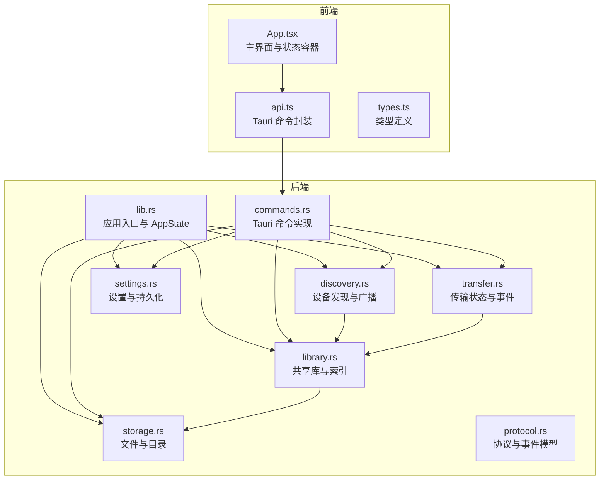
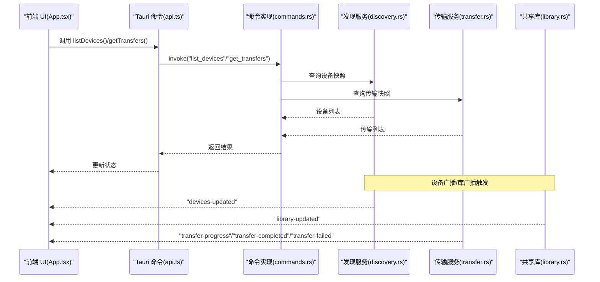
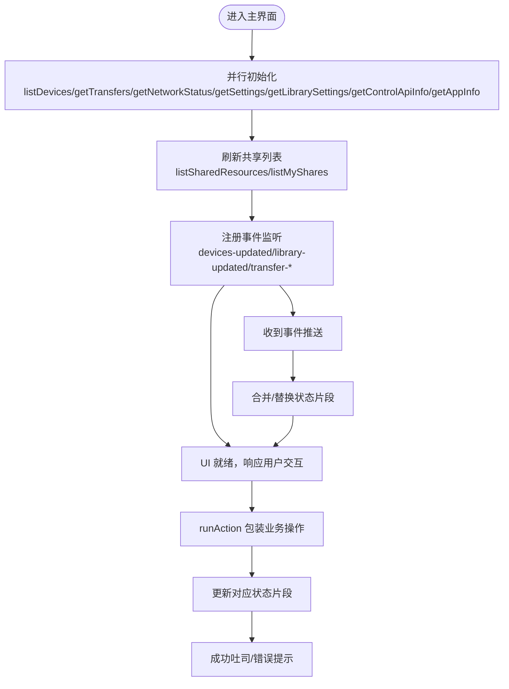
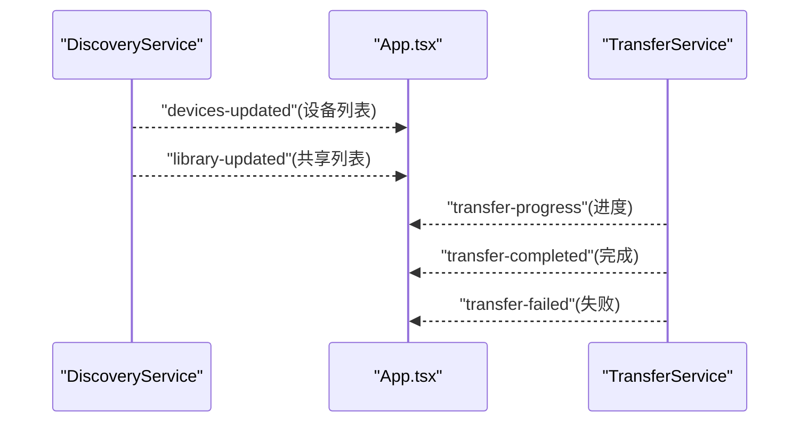
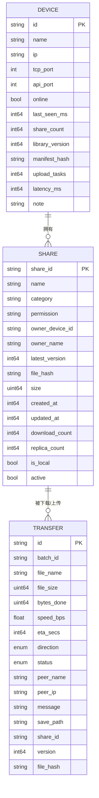
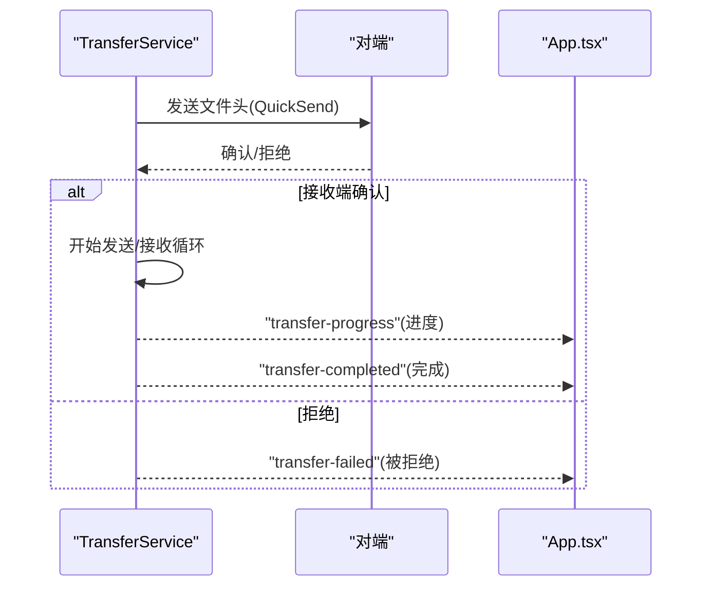
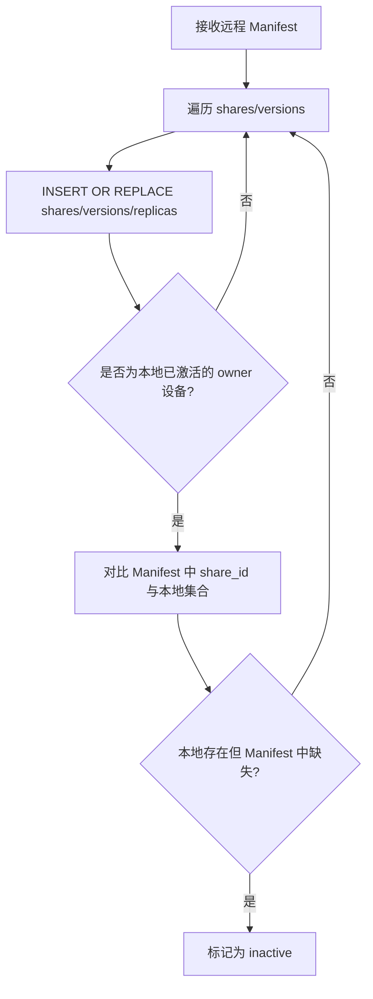
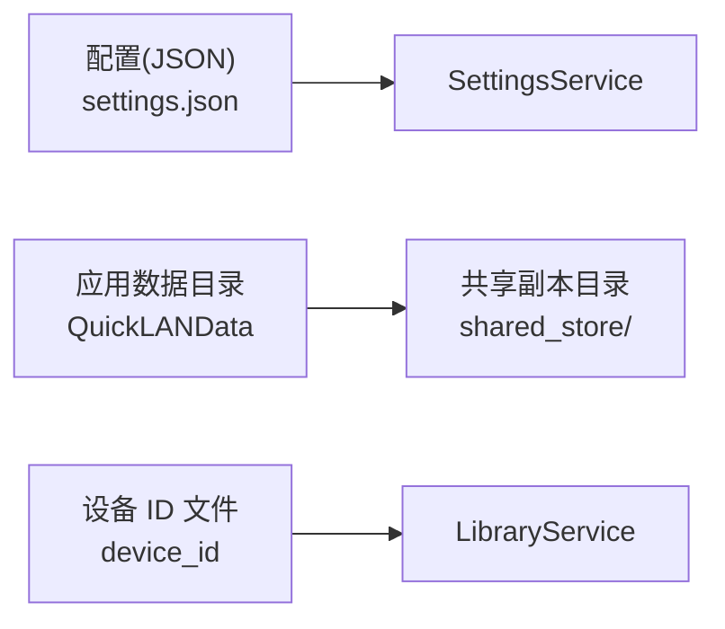
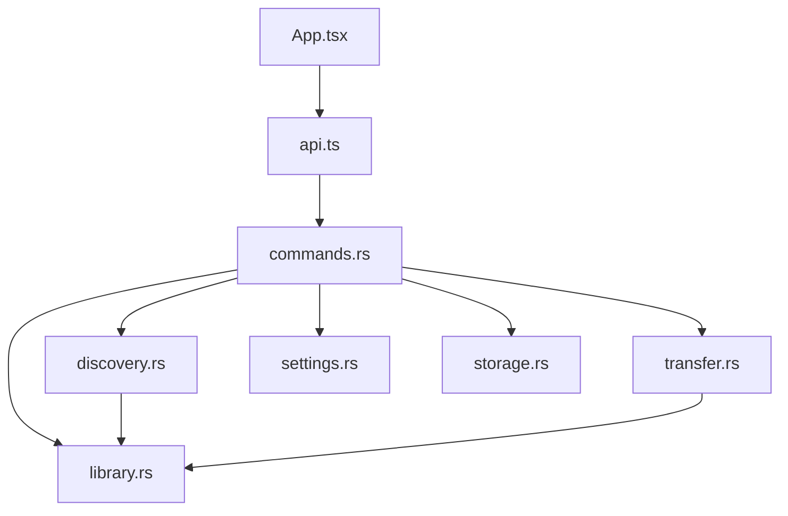

# 状态管理

<cite>
**本文引用的文件**
- [App.tsx](file://quicklan-main/src/App.tsx)
- [api.ts](file://quicklan-main/src/api.ts)
- [types.ts](file://quicklan-main/src/types.ts)
- [lib.rs](file://quicklan-main/src-tauri/src/lib.rs)
- [main.rs](file://quicklan-main/src-tauri/src/main.rs)
- [commands.rs](file://quicklan-main/src-tauri/src/commands.rs)
- [discovery.rs](file://quicklan-main/src-tauri/src/discovery.rs)
- [transfer.rs](file://quicklan-main/src-tauri/src/transfer.rs)
- [library.rs](file://quicklan-main/src-tauri/src/library.rs)
- [settings.rs](file://quicklan-main/src-tauri/src/settings.rs)
- [storage.rs](file://quicklan-main/src-tauri/src/storage.rs)
- [protocol.rs](file://quicklan-main/src-tauri/src/protocol.rs)
</cite>

## 目录
1. [简介](#简介)
2. [项目结构](#项目结构)
3. [核心组件](#核心组件)
4. [架构总览](#架构总览)
5. [详细组件分析](#详细组件分析)
6. [依赖分析](#依赖分析)
7. [性能考虑](#性能考虑)
8. [故障排查指南](#故障排查指南)
9. [结论](#结论)

## 简介
本文件系统性梳理 QuickLAN 的前端状态管理与后端状态服务，覆盖以下主题：
- React 层状态组织与数据流
- 全局状态分类（设备、共享、传输）
- WebSocket 事件驱动的实时状态更新
- 状态持久化与并发控制
- 错误状态管理与用户反馈
- 状态同步策略与一致性保障

## 项目结构
QuickLAN 采用“前端 React + Tauri 后端”的双层架构。前端负责 UI 交互与状态展示，后端通过 Tauri 命令暴露能力，并在 Rust 中维护设备、共享库、传输等核心状态。

图表来源
- [lib.rs:138-249](file://quicklan-main/src-tauri/src/lib.rs#L138-L249)
- [commands.rs:11-259](file://quicklan-main/src-tauri/src/commands.rs#L11-L259)
- [discovery.rs:41-276](file://quicklan-main/src-tauri/src/discovery.rs#L41-L276)
- [transfer.rs:30-750](file://quicklan-main/src-tauri/src/transfer.rs#L30-L750)
- [library.rs:21-755](file://quicklan-main/src-tauri/src/library.rs#L21-L755)
- [settings.rs:15-93](file://quicklan-main/src-tauri/src/settings.rs#L15-L93)
- [storage.rs:1-313](file://quicklan-main/src-tauri/src/storage.rs#L1-L313)
- [protocol.rs:11-230](file://quicklan-main/src-tauri/src/protocol.rs#L11-L230)

章节来源
- [lib.rs:138-249](file://quicklan-main/src-tauri/src/lib.rs#L138-L249)
- [main.rs:3-6](file://quicklan-main/src-tauri/src/main.rs#L3-L6)

## 核心组件
- 前端状态容器与事件订阅
  - 主窗口状态：设备列表、共享列表、传输列表、设置、网络状态、UI 状态（忙碌、错误、吐司、面板开关）
  - 事件监听：设备变更、库更新、传输进度/完成/失败、拖拽事件
  - 行为封装：统一的 runAction 包装器，集中处理错误与忙碌态
- 后端状态服务
  - AppState：聚合 Discovery、Transfer、Settings、Library、ControlApi 五类服务
  - Discovery：设备发现、广播、修剪离线设备、触发库同步
  - Transfer：传输生命周期、进度/完成/失败事件、接收/发送流程、本地副本登记
  - Library：共享索引、版本、副本节点、Manifest 合并、下载源选择、密码校验
  - Settings：应用设置持久化与并发安全
  - Storage：应用数据目录、共享副本存储、文件名规范化、去重命名

章节来源
- [App.tsx:86-246](file://quicklan-main/src/App.tsx#L86-L246)
- [lib.rs:50-56](file://quicklan-main/src-tauri/src/lib.rs#L50-L56)
- [discovery.rs:41-276](file://quicklan-main/src-tauri/src/discovery.rs#L41-L276)
- [transfer.rs:30-750](file://quicklan-main/src-tauri/src/transfer.rs#L30-L750)
- [library.rs:21-755](file://quicklan-main/src-tauri/src/library.rs#L21-L755)
- [settings.rs:15-93](file://quicklan-main/src-tauri/src/settings.rs#L15-L93)
- [storage.rs:1-313](file://quicklan-main/src-tauri/src/storage.rs#L1-L313)

## 架构总览
前端通过 Tauri 命令与后端交互，后端通过事件向前端推送状态变更。传输状态在后端维护并在前端实时显示，设备与共享状态通过广播与拉取结合的方式保持一致。

图表来源
- [App.tsx:144-178](file://quicklan-main/src/App.tsx#L144-L178)
- [api.ts:13-130](file://quicklan-main/src/api.ts#L13-L130)
- [commands.rs:11-81](file://quicklan-main/src-tauri/src/commands.rs#L11-L81)
- [discovery.rs:207-248](file://quicklan-main/src-tauri/src/discovery.rs#L207-L248)
- [transfer.rs:732-749](file://quicklan-main/src-tauri/src/transfer.rs#L732-L749)
- [library.rs:490-589](file://quicklan-main/src-tauri/src/library.rs#L490-L589)

## 详细组件分析

### 前端状态组织与数据流
- 全局状态
  - 设备状态：devices、selectedDeviceId、onlineCount
  - 共享状态：shares、myShares、shareDraftPaths、shareCategory、sharePermission、sharePassword
  - 传输状态：transfers、transfersOpen、pendingPasswordShare、downloadPassword
  - 应用状态：settings、appInfo、librarySettings、controlApi、networkStatus、nicknameDraft
  - UI 状态：filePaths、manualIp、search、category、sort、error、toast、busy
- 数据流
  - 初始化：一次性并行拉取设备、传输、网络、设置、库信息，随后刷新共享列表
  - 实时更新：监听 devices-updated、library-updated、transfer-* 事件，局部更新状态
  - 用户行为：通过 runAction 统一包装异步操作，集中处理错误与忙碌态，成功后吐司提示
- 过滤与排序：基于 search、category、sort 计算属性，避免重复渲染

图表来源
- [App.tsx:180-206](file://quicklan-main/src/App.tsx#L180-L206)
- [App.tsx:144-178](file://quicklan-main/src/App.tsx#L144-L178)
- [App.tsx:234-245](file://quicklan-main/src/App.tsx#L234-L245)

章节来源
- [App.tsx:86-246](file://quicklan-main/src/App.tsx#L86-L246)
- [App.tsx:180-206](file://quicklan-main/src/App.tsx#L180-L206)
- [App.tsx:144-178](file://quicklan-main/src/App.tsx#L144-L178)

### WebSocket 事件处理与实时状态更新
- 设备变更
  - 后端在发现循环中接收广播，更新设备映射并发出 devices-updated
  - 前端监听该事件，替换/合并设备列表，触发 UI 重绘
- 库更新
  - 当设备广播携带“library”类型且需同步时，后端拉取 Manifest 并合并，发出 library-updated
  - 前端监听后刷新共享列表
- 传输事件
  - 后端在传输过程中持续发出 transfer-progress
  - 传输完成/失败分别发出 transfer-completed/transfer-failed
  - 前端 upsert 传输项，限制保留数量，确保 UI 实时反馈

图表来源
- [discovery.rs:207-248](file://quicklan-main/src-tauri/src/discovery.rs#L207-L248)
- [transfer.rs:732-749](file://quicklan-main/src-tauri/src/transfer.rs#L732-L749)
- [App.tsx:144-178](file://quicklan-main/src/App.tsx#L144-L178)

章节来源
- [discovery.rs:207-248](file://quicklan-main/src-tauri/src/discovery.rs#L207-L248)
- [transfer.rs:732-749](file://quicklan-main/src-tauri/src/transfer.rs#L732-L749)
- [App.tsx:144-178](file://quicklan-main/src/App.tsx#L144-L178)

### 全局状态分类与数据模型
- 设备状态(DeviceInfo)
  - 关键字段：id、name、ip、tcp_port、api_port、online、last_seen_ms、share_count、library_version、manifest_hash、upload_tasks、latency_ms、note
- 共享状态(ShareItem)
  - 关键字段：share_id、name、category、permission(owner_device_id/owner_name)、latest_version、file_hash、size、created_at、updated_at、download_count、replica_count、is_local、active
- 传输状态(TransferInfo)
  - 关键字段：id、batch_id、file_name、file_size、bytes_done、speed_bps、eta_secs、direction、status、peer_name、peer_ip、message、save_path、share_id、version、file_hash
- 设置状态(AppSettings/LibrarySettings)
  - AppSettings：nickname、download_dir
  - LibrarySettings：acceleration_enabled、max_upload_speed、max_upload_tasks、cache_limit_gb

图表来源
- [types.ts:1-128](file://quicklan-main/src/types.ts#L1-L128)
- [protocol.rs:33-170](file://quicklan-main/src-tauri/src/protocol.rs#L33-L170)
- [protocol.rs:119-136](file://quicklan-main/src-tauri/src/protocol.rs#L119-L136)
- [protocol.rs:224-230](file://quicklan-main/src-tauri/src/protocol.rs#L224-L230)

章节来源
- [types.ts:1-128](file://quicklan-main/src/types.ts#L1-L128)
- [protocol.rs:33-170](file://quicklan-main/src-tauri/src/protocol.rs#L33-L170)
- [protocol.rs:119-136](file://quicklan-main/src-tauri/src/protocol.rs#L119-L136)
- [protocol.rs:224-230](file://quicklan-main/src-tauri/src/protocol.rs#L224-L230)

### 传输状态管理与并发控制
- 传输状态机
  - 状态枚举：pending、waiting_for_receiver、transferring、completed、rejected、failed
  - 方向枚举：sending、receiving
- 并发与线程模型
  - 传输监听器在独立线程中接受连接，每个文件发送/接收在异步任务中运行
  - 决策通道(oneshot)用于接收端确认/拒绝
  - 传输映射(HashMap)在锁保护下更新，保证多任务并发安全
- 事件驱动
  - upsert_and_emit 在每次进度/完成/失败时更新内存状态并广播事件
- 本地副本登记
  - 接收完成后登记本地副本，触发库广播，保持去中心化索引一致

图表来源
- [transfer.rs:298-375](file://quicklan-main/src-tauri/src/transfer.rs#L298-L375)
- [transfer.rs:377-443](file://quicklan-main/src-tauri/src/transfer.rs#L377-L443)
- [transfer.rs:732-749](file://quicklan-main/src-tauri/src/transfer.rs#L732-L749)

章节来源
- [transfer.rs:30-750](file://quicklan-main/src-tauri/src/transfer.rs#L30-L750)

### 共享库与索引同步
- Manifest 合并与裁剪
  - 合并远程 Manifest，插入/更新 shares、versions、replicas
  - 对于已不存在的 share_id，标记为 inactive
- 下载源选择
  - 按版本降序、上传任务升序、延迟升序、是否本地优先排序
- 密码校验
  - 下载前验证 share 的权限与密码，失败则直接拒绝
- 本地副本登记
  - 接收完成后复制到共享副本目录，写入元数据，登记版本与副本节点

图表来源
- [library.rs:490-589](file://quicklan-main/src-tauri/src/library.rs#L490-L589)

章节来源
- [library.rs:490-589](file://quicklan-main/src-tauri/src/library.rs#L490-L589)

### 状态持久化方案
- 设置持久化
  - SettingsService 使用 Mutex 保护 JSON 文件，支持昵称与下载目录更新
  - 默认值与规范化逻辑确保健壮性
- 应用数据与共享副本
  - 应用数据目录、共享存储目录、元数据文件与内容文件分离
  - 共享副本采用文件哈希作为目录名，避免重复与冲突
- 设备 ID
  - 首次运行生成 UUID 并持久化，保证跨会话一致性

图表来源
- [settings.rs:21-93](file://quicklan-main/src-tauri/src/settings.rs#L21-L93)
- [storage.rs:9-46](file://quicklan-main/src-tauri/src/storage.rs#L9-L46)
- [discovery.rs:357-376](file://quicklan-main/src-tauri/src/discovery.rs#L357-L376)

章节来源
- [settings.rs:21-93](file://quicklan-main/src-tauri/src/settings.rs#L21-L93)
- [storage.rs:9-46](file://quicklan-main/src-tauri/src/storage.rs#L9-L46)
- [discovery.rs:357-376](file://quicklan-main/src-tauri/src/discovery.rs#L357-L376)

### 错误状态管理与用户反馈
- 前端
  - runAction 包装器：捕获异常、设置错误、恢复忙碌态、成功吐司
  - 错误弹窗与关闭按钮、短暂吐司提示
- 后端
  - 命令层返回 Result，错误字符串透传至前端
  - 传输失败事件携带 message 字段，便于 UI 显示
- 一致性
  - 传输失败时更新状态并发出事件，前端 upsert 后立即可见

章节来源
- [App.tsx:234-245](file://quicklan-main/src/App.tsx#L234-L245)
- [transfer.rs:663-668](file://quicklan-main/src-tauri/src/transfer.rs#L663-L668)

## 依赖分析
- 前端依赖
  - App.tsx 依赖 api.ts 提供的命令封装，依赖 types.ts 的类型定义
- 后端依赖
  - lib.rs 组合各服务并注入 AppState
  - commands.rs 作为命令入口，调用 discovery、transfer、library、settings、storage
  - discovery 与 library 通过广播/拉取协作，transfer 与 library 通过事件联动

图表来源
- [lib.rs:11-19](file://quicklan-main/src-tauri/src/lib.rs#L11-L19)
- [commands.rs:11-259](file://quicklan-main/src-tauri/src/commands.rs#L11-L259)
- [discovery.rs:41-276](file://quicklan-main/src-tauri/src/discovery.rs#L41-L276)
- [transfer.rs:30-750](file://quicklan-main/src-tauri/src/transfer.rs#L30-L750)
- [library.rs:21-755](file://quicklan-main/src-tauri/src/library.rs#L21-L755)
- [settings.rs:15-93](file://quicklan-main/src-tauri/src/settings.rs#L15-L93)
- [storage.rs:1-313](file://quicklan-main/src-tauri/src/storage.rs#L1-L313)

章节来源
- [lib.rs:11-19](file://quicklan-main/src-tauri/src/lib.rs#L11-L19)
- [commands.rs:11-259](file://quicklan-main/src-tauri/src/commands.rs#L11-L259)

## 性能考虑
- 并行初始化：前端一次性并行拉取多个状态，减少首屏等待
- 事件驱动：后端仅在状态变化时推送，避免轮询
- 传输分块：固定 CHUNK_SIZE，平衡吞吐与内存占用
- 本地副本：接收完成后登记本地副本，后续下载可直接使用，降低网络负载
- 索引裁剪：定期修剪离线设备，减少快照规模

## 故障排查指南
- 无法接收传输
  - 检查防火墙是否拦截 TCP 端口
  - 查看 transfer-failed 事件中的 message 字段
- 下载失败或校验失败
  - 核对 SHA256 是否匹配，检查网络中断与磁盘写入
- 共享索引不同步
  - 触发 discovery 广播或等待库广播周期
  - 检查 library.merge_manifest 是否成功
- 设置无法保存
  - 检查配置目录权限与 JSON 序列化/反序列化

章节来源
- [transfer.rs:541-616](file://quicklan-main/src-tauri/src/transfer.rs#L541-L616)
- [discovery.rs:207-248](file://quicklan-main/src-tauri/src/discovery.rs#L207-L248)
- [settings.rs:84-92](file://quicklan-main/src-tauri/src/settings.rs#L84-L92)

## 结论
QuickLAN 的状态管理采用“前端事件驱动 + 后端服务聚合”的模式：前端负责 UI 状态与用户体验，后端通过 Discovery、Transfer、Library、Settings、Storage 五大服务维持全局一致性。WebSocket/事件驱动实现实时更新，SQLite/JSON 文件实现持久化，命令层提供清晰的边界与错误传播。整体设计在去中心化场景下实现了高效、可观测、可扩展的状态管理。