# 代码审查指南

<cite>
**本文引用的文件**   
- [main.py](file://main.py)
- [config.yaml](file://config.yaml)
- [requirements.txt](file://requirements.txt)
- [CODE_REVIEW_GUIDE.md](file://CODE_REVIEW_GUIDE.md)
- [lan_mesh/__init__.py](file://lan_mesh/__init__.py)
- [lan_mesh/config.py](file://lan_mesh/config.py)
- [lan_mesh/station_controller.py](file://lan_mesh/station_controller.py)
- [lan_mesh/secretary.py](file://lan_mesh/secretary.py)
- [lan_mesh/worker.py](file://lan_mesh/worker.py)
- [lan_mesh/discovery.py](file://lan_mesh/discovery.py)
- [lan_mesh/database.py](file://lan_mesh/database.py)
- [lan_mesh/api.py](file://lan_mesh/api.py)
- [lan_mesh/protocol.py](file://lan_mesh/protocol.py)
- [lan_mesh/host_info.py](file://lan_mesh/host_info.py)
- [lan_mesh/shared_folder.py](file://lan_mesh/shared_folder.py)
- [lan_mesh/station_api.py](file://lan_mesh/station_api.py)
- [lan_mesh/agent_prompt.py](file://lan_mesh/agent_prompt.py)
</cite>

## 目录
1. [引言](#引言)
2. [项目结构](#项目结构)
3. [核心组件](#核心组件)
4. [架构总览](#架构总览)
5. [详细组件分析](#详细组件分析)
6. [依赖关系分析](#依赖关系分析)
7. [性能考量](#性能考量)
8. [故障排查指南](#故障排查指南)
9. [结论](#结论)
10. [附录](#附录)

## 引言
本指南面向 LAN Mesh 分布式 AI 工作站的 Python/FastAPI 后端与 Tauri/React 桌面端双栈架构，结合多智能体协作场景，提供系统化的代码审查规范与实践。内容覆盖通用审核清单、命名与模块组织、错误处理、日志与安全、性能、分布式专项要求、配置管理、Git 提交与 PR 规范、CR 流程与自动化钩子等，帮助团队在评审中保持一致性与高质量。

## 项目结构
仓库采用“入口脚本 + 模块化包”的组织方式：
- 根目录 main.py 作为统一 CLI 入口，按角色启动不同控制器
- lan_mesh 包承载核心业务：配置、协议、发现、数据库、路由、控制器、Agent 运行时、项目管理、模型路由、MCP 网关等
- quicklan-main 为前端桌面应用（Tauri + React），与本指南的 Python 后端审查重点相对独立
- scripts 提供跨平台启动脚本
- config.yaml 提供默认配置项

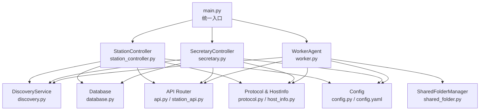

图示来源
- [main.py:26-98](file://main.py#L26-L98)
- [lan_mesh/station_controller.py:71-144](file://lan_mesh/station_controller.py#L71-L144)
- [lan_mesh/secretary.py:69-129](file://lan_mesh/secretary.py#L69-L129)
- [lan_mesh/worker.py:68-107](file://lan_mesh/worker.py#L68-L107)
- [lan_mesh/discovery.py:33-85](file://lan_mesh/discovery.py#L33-L85)
- [lan_mesh/database.py:16-46](file://lan_mesh/database.py#L16-L46)
- [lan_mesh/api.py:39-46](file://lan_mesh/api.py#L39-L46)
- [lan_mesh/protocol.py:29-56](file://lan_mesh/protocol.py#L29-L56)
- [lan_mesh/host_info.py:129-191](file://lan_mesh/host_info.py#L129-L191)
- [lan_mesh/shared_folder.py:16-37](file://lan_mesh/shared_folder.py#L16-L37)
- [lan_mesh/config.py:92-116](file://lan_mesh/config.py#L92-L116)
- [config.yaml:1-22](file://config.yaml#L1-L22)

章节来源
- [main.py:26-98](file://main.py#L26-L98)
- [lan_mesh/__init__.py:1-11](file://lan_mesh/__init__.py#L1-L11)
- [config.yaml:1-22](file://config.yaml#L1-L22)
- [requirements.txt:1-9](file://requirements.txt#L1-L9)

## 核心组件
- 统一入口与角色分发：根据命令行参数加载配置并启动对应控制器
- Station Director：基础设施管理与 Web UI，支持同进程激活 Secretary 模式
- Secretary：中心控制节点，负责主机注册、心跳、任务编排、Web UI
- Worker：各主机守护进程，自动采集信息、UDP 发现、HTTP 注册与心跳、PM Agent 执行
- DiscoveryService：UDP 广播发现服务，维护设备列表与 TTL 清理
- Database：SQLite 持久化层，包含主机、Agent、任务、项目、使用记录、PM Agent 等表
- API 路由层：FastAPI 路由，暴露 Worker/Secretary/Station 能力
- Protocol 与 HostInfo：协议常量、数据包与主机信息模型
- SharedFolderManager：共享文件夹自动管理、路径安全校验与报告生成
- Config：Pydantic 强类型配置模型与加载顺序

章节来源
- [main.py:26-98](file://main.py#L26-L98)
- [lan_mesh/station_controller.py:71-144](file://lan_mesh/station_controller.py#L71-L144)
- [lan_mesh/secretary.py:69-129](file://lan_mesh/secretary.py#L69-L129)
- [lan_mesh/worker.py:68-107](file://lan_mesh/worker.py#L68-L107)
- [lan_mesh/discovery.py:33-85](file://lan_mesh/discovery.py#L33-L85)
- [lan_mesh/database.py:16-46](file://lan_mesh/database.py#L16-L46)
- [lan_mesh/api.py:39-46](file://lan_mesh/api.py#L39-L46)
- [lan_mesh/protocol.py:29-56](file://lan_mesh/protocol.py#L29-L56)
- [lan_mesh/host_info.py:129-191](file://lan_mesh/host_info.py#L129-L191)
- [lan_mesh/shared_folder.py:16-37](file://lan_mesh/shared_folder.py#L16-L37)
- [lan_mesh/config.py:92-116](file://lan_mesh/config.py#L92-L116)

## 架构总览
LAN Mesh 采用“Station Director + Secretary + Worker”的多角色协同架构：
- Station Director 负责基础设施管理、Web UI 与可选的 Secretary 激活
- Secretary 作为中心控制节点，聚合主机状态、任务编排、WebSocket 推送
- Worker 在各主机上运行，通过 UDP 发现与 HTTP 注册/心跳维持在线
- Database 提供持久化，API 路由层对外暴露能力，DiscoveryService 实现局域网设备发现

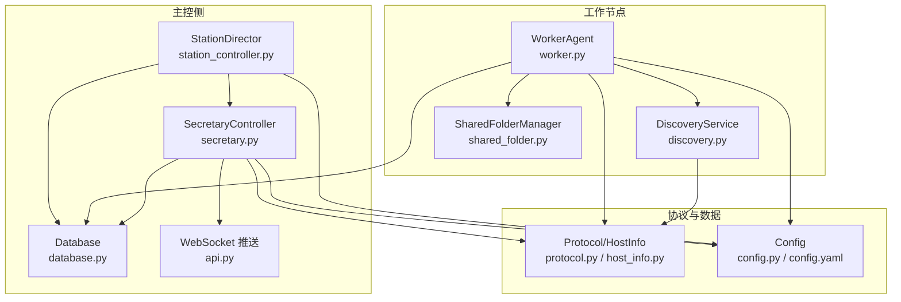

图示来源
- [lan_mesh/station_controller.py:71-144](file://lan_mesh/station_controller.py#L71-L144)
- [lan_mesh/secretary.py:69-129](file://lan_mesh/secretary.py#L69-L129)
- [lan_mesh/worker.py:68-107](file://lan_mesh/worker.py#L68-L107)
- [lan_mesh/discovery.py:33-85](file://lan_mesh/discovery.py#L33-L85)
- [lan_mesh/database.py:16-46](file://lan_mesh/database.py#L16-L46)
- [lan_mesh/api.py:719-757](file://lan_mesh/api.py#L719-L757)
- [lan_mesh/protocol.py:29-56](file://lan_mesh/protocol.py#L29-L56)
- [lan_mesh/host_info.py:129-191](file://lan_mesh/host_info.py#L129-L191)
- [lan_mesh/shared_folder.py:16-37](file://lan_mesh/shared_folder.py#L16-L37)
- [lan_mesh/config.py:92-116](file://lan_mesh/config.py#L92-L116)
- [config.yaml:1-22](file://config.yaml#L1-L22)

## 详细组件分析

### 统一入口与角色分发（main.py）
- 解析命令行参数 role/port/name/shared/config/version
- 加载配置并按角色实例化控制器或代理
- 支持向后兼容 secretary 与推荐 station 模式

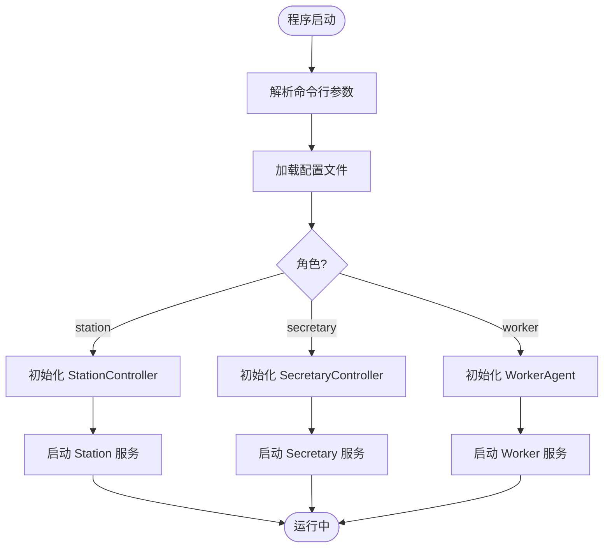

图示来源
- [main.py:26-98](file://main.py#L26-L98)

章节来源
- [main.py:26-98](file://main.py#L26-L98)

### 配置管理（config.py, config.yaml）
- Pydantic 强类型模型：DiscoveryConfig、WorkerConfig、SecretaryConfig、ModelPoolConfig、BotConfig 等
- 配置加载优先级：显式路径 > 环境变量 > 用户目录 > 项目根目录 > 默认值
- 工具函数：get_shared_folder、get_db_path、load_model_pool

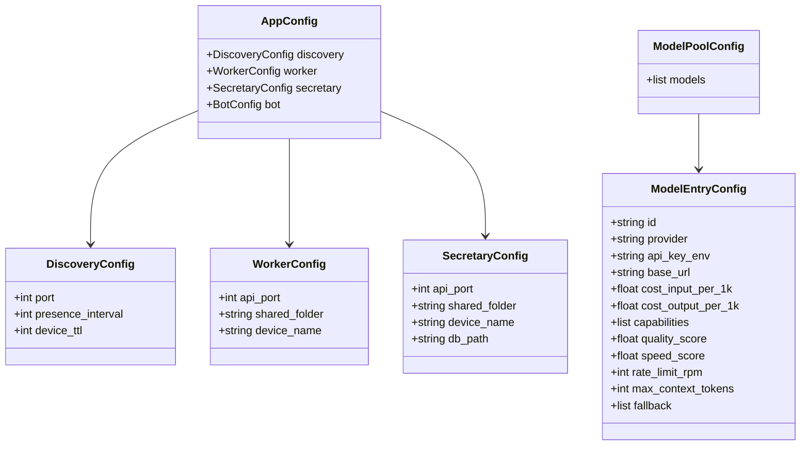

图示来源
- [lan_mesh/config.py:14-85](file://lan_mesh/config.py#L14-L85)
- [lan_mesh/config.py:55-58](file://lan_mesh/config.py#L55-L58)
- [lan_mesh/config.py:39-53](file://lan_mesh/config.py#L39-L53)

章节来源
- [lan_mesh/config.py:92-116](file://lan_mesh/config.py#L92-L116)
- [lan_mesh/config.py:130-159](file://lan_mesh/config.py#L130-L159)
- [config.yaml:1-22](file://config.yaml#L1-L22)

### 发现服务（discovery.py）
- 后台线程：presence_loop（定期广播）、listen_loop（监听并回送）、prune_loop（TTL 清理）
- 设备查询：list_devices、find_device、network_status
- 网络探测：probe_ip、单播/广播发送

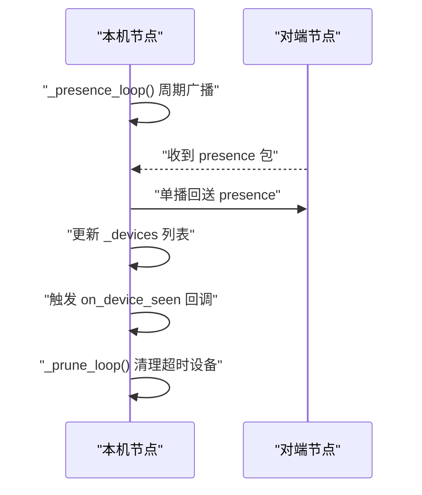

图示来源
- [lan_mesh/discovery.py:139-228](file://lan_mesh/discovery.py#L139-L228)

章节来源
- [lan_mesh/discovery.py:33-85](file://lan_mesh/discovery.py#L33-L85)
- [lan_mesh/discovery.py:97-136](file://lan_mesh/discovery.py#L97-L136)

### 主机信息采集（host_info.py, protocol.py）
- 设备 ID 持久化：按角色区分，跨重启保持身份
- 网络信息：IPv4 地址、MAC、广播目标计算
- 完整主机画像：CPU/内存/磁盘/网络/共享/运行时指标
- 发现包构造：从 HostInfo 生成 DiscoveryPacket

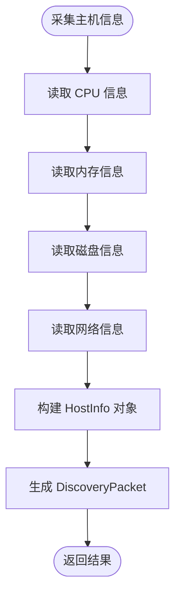

图示来源
- [lan_mesh/host_info.py:129-191](file://lan_mesh/host_info.py#L129-L191)
- [lan_mesh/protocol.py:29-56](file://lan_mesh/protocol.py#L29-L56)

章节来源
- [lan_mesh/host_info.py:21-37](file://lan_mesh/host_info.py#L21-L37)
- [lan_mesh/host_info.py:42-103](file://lan_mesh/host_info.py#L42-L103)
- [lan_mesh/protocol.py:69-111](file://lan_mesh/protocol.py#L69-L111)

### 共享文件夹管理（shared_folder.py）
- 自动创建目录与 README
- 列举文件（递归一层统计）、上传保存、下载获取
- 路径安全校验：防止路径穿越
- 自动生成主机配置报告（JSON/TXT）

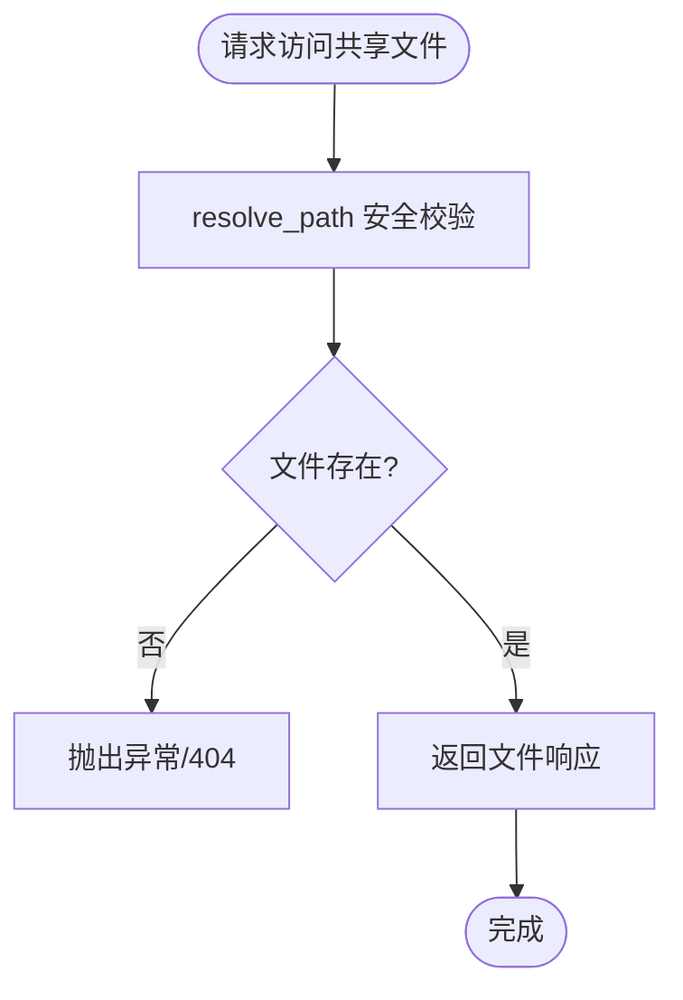

图示来源
- [lan_mesh/shared_folder.py:88-101](file://lan_mesh/shared_folder.py#L88-L101)
- [lan_mesh/shared_folder.py:122-144](file://lan_mesh/shared_folder.py#L122-L144)

章节来源
- [lan_mesh/shared_folder.py:16-37](file://lan_mesh/shared_folder.py#L16-L37)
- [lan_mesh/shared_folder.py:39-86](file://lan_mesh/shared_folder.py#L39-L86)
- [lan_mesh/shared_folder.py:103-118](file://lan_mesh/shared_folder.py#L103-L118)

### 数据库持久化（database.py）
- 线程安全连接池：每个线程独立连接
- 表结构：hosts、heartbeat_log、agents、tasks、projects、usage_log、host_events、skills、skill_assignments、pm_agents、agent_teams、progress_reports
- 迁移兼容：ALTER TABLE 安全添加列
- CRUD 方法：主机、Agent、任务、项目、使用记录、PM Agent 等

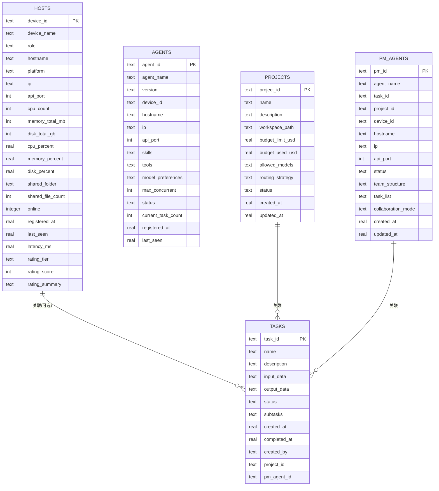

图示来源
- [lan_mesh/database.py:36-244](file://lan_mesh/database.py#L36-L244)

章节来源
- [lan_mesh/database.py:249-300](file://lan_mesh/database.py#L249-L300)
- [lan_mesh/database.py:365-380](file://lan_mesh/database.py#L365-L380)
- [lan_mesh/database.py:454-540](file://lan_mesh/database.py#L454-L540)
- [lan_mesh/database.py:582-652](file://lan_mesh/database.py#L582-L652)
- [lan_mesh/database.py:656-749](file://lan_mesh/database.py#L656-L749)
- [lan_mesh/database.py:928-973](file://lan_mesh/database.py#L928-L973)

### API 路由层（api.py）
- Worker 路由：/info、/tasks/execute、/shared、/role/*、/pm/*
- Secretary 路由：/api/register、/api/heartbeat、/api/hosts、/api/tasks、/api/projects、/tools/*、/api/route/*、/ws
- WebSocket 实时推送：首次推送当前状态，心跳 ping/pong

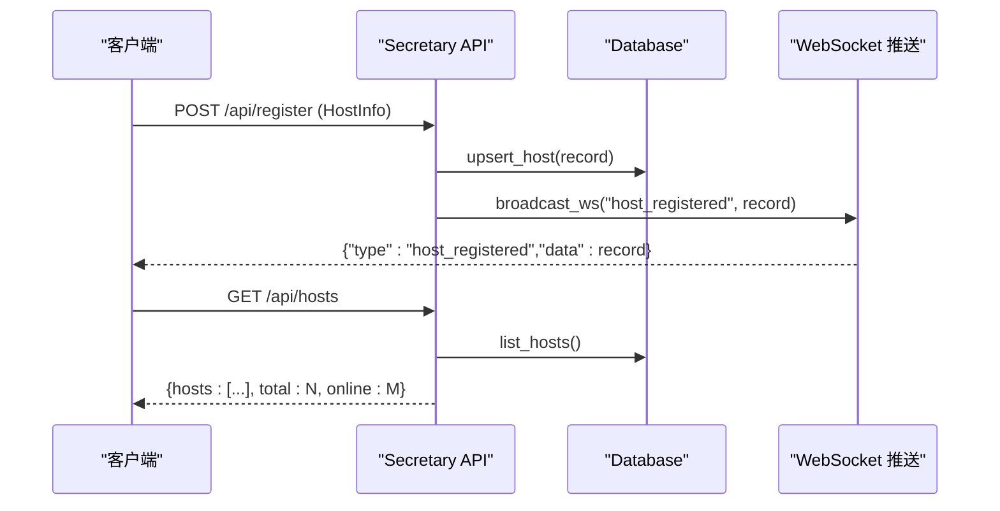

图示来源
- [lan_mesh/api.py:255-278](file://lan_mesh/api.py#L255-L278)
- [lan_mesh/api.py:311-345](file://lan_mesh/api.py#L311-L345)
- [lan_mesh/api.py:719-757](file://lan_mesh/api.py#L719-L757)

章节来源
- [lan_mesh/api.py:39-235](file://lan_mesh/api.py#L39-L235)
- [lan_mesh/api.py:240-744](file://lan_mesh/api.py#L240-L744)

### Station Controller（station_controller.py）
- 生命周期：自检 → 端口分配 → 启动 Discovery → 自注册 → 部署采集脚本 → 刷新配置报告 → 启动后台线程 → 启动 FastAPI
- 同进程激活 Secretary：加载 ProjectManager、ModelRouter、MCPGateway、ChatHandler、AgentRuntime
- 事件与推送：UDP 自动注册、WS 推送主机状态

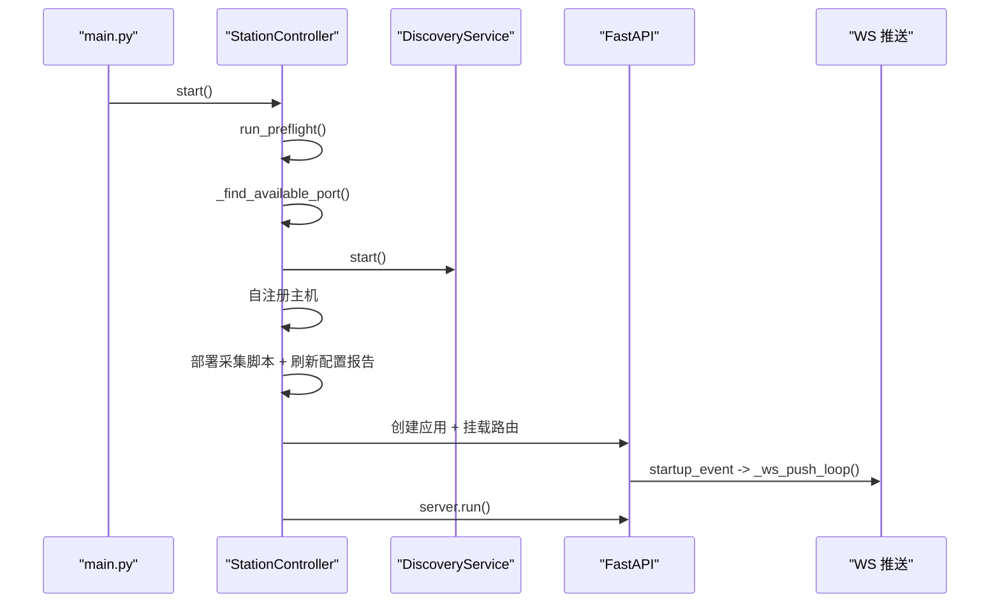

图示来源
- [lan_mesh/station_controller.py:442-538](file://lan_mesh/station_controller.py#L442-L538)
- [lan_mesh/station_controller.py:395-427](file://lan_mesh/station_controller.py#L395-L427)
- [lan_mesh/station_controller.py:376-392](file://lan_mesh/station_controller.py#L376-L392)

章节来源
- [lan_mesh/station_controller.py:71-144](file://lan_mesh/station_controller.py#L71-L144)
- [lan_mesh/station_controller.py:147-212](file://lan_mesh/station_controller.py#L147-L212)
- [lan_mesh/station_controller.py:277-333](file://lan_mesh/station_controller.py#L277-L333)

### Secretary Controller（secretary.py）
- 生命周期：自检 → 端口分配 → 启动 Discovery → 部署采集脚本 → 刷新配置报告 → 启动后台线程 → 启动 FastAPI
- 集成 StationDirector、Orchestrator、ProjectManager、ModelRouter、MCPGateway
- WS 推送：定时推送主机状态

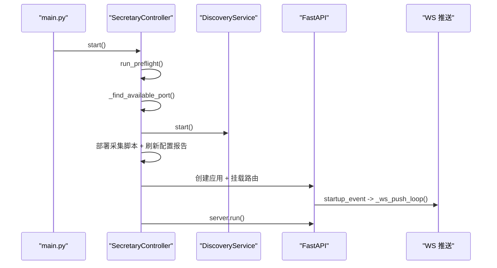

图示来源
- [lan_mesh/secretary.py:255-342](file://lan_mesh/secretary.py#L255-L342)
- [lan_mesh/secretary.py:202-240](file://lan_mesh/secretary.py#L202-L240)
- [lan_mesh/secretary.py:190-199](file://lan_mesh/secretary.py#L190-L199)

章节来源
- [lan_mesh/secretary.py:69-129](file://lan_mesh/secretary.py#L69-L129)
- [lan_mesh/secretary.py:130-189](file://lan_mesh/secretary.py#L130-L189)

### Worker Agent（worker.py）
- 生命周期：自检 → 端口分配 → 启动 Discovery → 部署采集脚本 → 生成初始配置报告 → 创建 AgentRuntime → 启动心跳循环 → 启动 FastAPI
- 注册与心跳：向 Secretary 注册主机信息与 Agent Card，周期性心跳
- PM Agent 管理：远程启动/停止 PM、创建子 Agent、进度上报、动态 prompt 更新

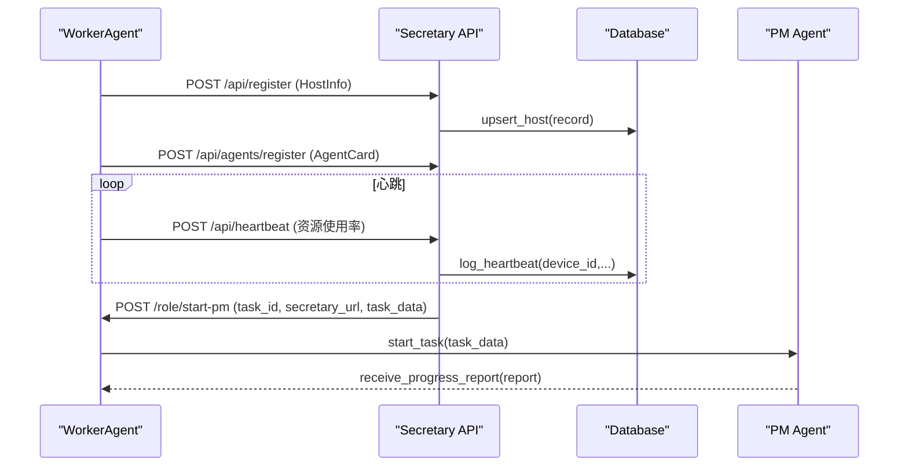

图示来源
- [lan_mesh/worker.py:517-593](file://lan_mesh/worker.py#L517-L593)
- [lan_mesh/worker.py:136-158](file://lan_mesh/worker.py#L136-L158)
- [lan_mesh/worker.py:212-234](file://lan_mesh/worker.py#L212-L234)
- [lan_mesh/worker.py:322-368](file://lan_mesh/worker.py#L322-L368)
- [lan_mesh/worker.py:389-426](file://lan_mesh/worker.py#L389-L426)
- [lan_mesh/worker.py:428-441](file://lan_mesh/worker.py#L428-L441)

章节来源
- [lan_mesh/worker.py:68-107](file://lan_mesh/worker.py#L68-L107)
- [lan_mesh/worker.py:125-158](file://lan_mesh/worker.py#L125-L158)
- [lan_mesh/worker.py:243-256](file://lan_mesh/worker.py#L243-L256)
- [lan_mesh/worker.py:259-312](file://lan_mesh/worker.py#L259-L312)
- [lan_mesh/worker.py:370-441](file://lan_mesh/worker.py#L370-L441)

### PM Agent 与 Prompt 定制（station_api.py, agent_prompt.py）
- 站点侧调度：选择目标 Worker，远程启动 PM Agent，更新任务状态与 PM 记录
- 子 Agent Prompt：BASE_SUBAGENT_PROMPT + build_subagent_prompt 定制角色/上下文/依赖/质量要求
- 进度上报格式：标准化 progress report

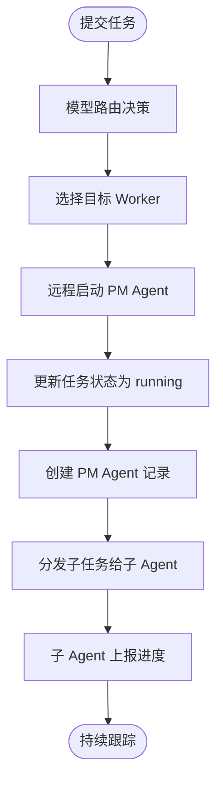

图示来源
- [lan_mesh/station_api.py:549-584](file://lan_mesh/station_api.py#L549-L584)
- [lan_mesh/agent_prompt.py:1-370](file://lan_mesh/agent_prompt.py#L1-370)

章节来源
- [lan_mesh/station_api.py:549-584](file://lan_mesh/station_api.py#L549-L584)
- [lan_mesh/agent_prompt.py:1-370](file://lan_mesh/agent_prompt.py#L1-370)

## 依赖关系分析
- 模块分层：protocol ← config ← database ← 业务模块（station/secretary/worker）← api
- 外部依赖：FastAPI、Uvicorn、WebSockets、psutil、PyYAML、requests、python-multipart
- 关键耦合点：
  - Station/Secretary/Worker 均依赖 DiscoveryService 进行设备发现
  - API 路由层依赖 Database 与 DiscoveryService 合并数据
  - Worker 与 Secretary 通过 HTTP 接口交互（注册/心跳/任务/PM 管理）
  - Station 可同进程激活 Secretary，动态加载项目管理与模型路由组件

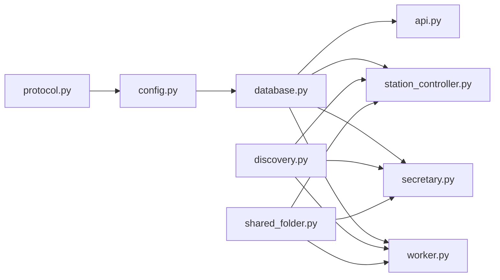

图示来源
- [lan_mesh/protocol.py:29-56](file://lan_mesh/protocol.py#L29-L56)
- [lan_mesh/config.py:92-116](file://lan_mesh/config.py#L92-L116)
- [lan_mesh/database.py:16-46](file://lan_mesh/database.py#L16-L46)
- [lan_mesh/api.py:39-46](file://lan_mesh/api.py#L39-L46)
- [lan_mesh/discovery.py:33-85](file://lan_mesh/discovery.py#L33-L85)
- [lan_mesh/shared_folder.py:16-37](file://lan_mesh/shared_folder.py#L16-L37)

章节来源
- [requirements.txt:1-9](file://requirements.txt#L1-L9)
- [lan_mesh/api.py:240-744](file://lan_mesh/api.py#L240-L744)
- [lan_mesh/station_controller.py:71-144](file://lan_mesh/station_controller.py#L71-L144)
- [lan_mesh/secretary.py:69-129](file://lan_mesh/secretary.py#L69-L129)
- [lan_mesh/worker.py:68-107](file://lan_mesh/worker.py#L68-L107)

## 性能考量
- LLM 调用：设置合理 timeout，追踪 token 用量，依据任务类型设置 max_tokens
- 异步与并发：IO 操作使用 async/await，长时间任务使用 threading/asyncio.create_task，心跳/推送循环避免空转
- 数据库：写操作使用事务保护，查询结果集限制上限，避免全表扫描
- 模型路由：决策应在 50ms 内完成，评分权重需与需求一致

[本节为通用指导，不直接分析具体文件]

## 故障排查指南
- 启动前自检失败：检查数据库路径、Web 模板是否存在、端口占用情况
- 设备未注册：确认 Worker 能访问 Secretary 的 /api/register，且 DiscoveryService 端口未被占用
- 心跳失败：检查网络连通性、/api/heartbeat 返回值、数据库写入是否成功
- WebSocket 断开：检查客户端心跳、服务端清理逻辑、WS 推送循环异常捕获
- 路径越界：共享文件访问时 resolve_path 校验失败，检查相对路径输入

章节来源
- [lan_mesh/station_controller.py:442-450](file://lan_mesh/station_controller.py#L442-L450)
- [lan_mesh/secretary.py:255-263](file://lan_mesh/secretary.py#L255-L263)
- [lan_mesh/worker.py:517-525](file://lan_mesh/worker.py#L517-L525)
- [lan_mesh/api.py:719-757](file://lan_mesh/api.py#L719-L757)
- [lan_mesh/shared_folder.py:88-101](file://lan_mesh/shared_folder.py#L88-L101)

## 结论
本指南基于仓库实际代码与规范文档，构建了从入口到组件、从协议到持久化、从路由到推送的全链路审查框架。建议团队在每次 CR 中对照通用清单与专项要求，结合自动化 Git Hooks 与 AI 深度审核，确保功能正确性、安全性、可维护性与性能达标。

[本节为总结，不直接分析具体文件]

## 附录
- 通用审核清单与命名规范、错误处理、日志与安全、分布式专项、配置管理、Git 提交与 PR 规范、CR 流程与自动化钩子详见：
  - [CODE_REVIEW_GUIDE.md](file://CODE_REVIEW_GUIDE.md)

章节来源
- [CODE_REVIEW_GUIDE.md:1-465](file://CODE_REVIEW_GUIDE.md#L1-L465)