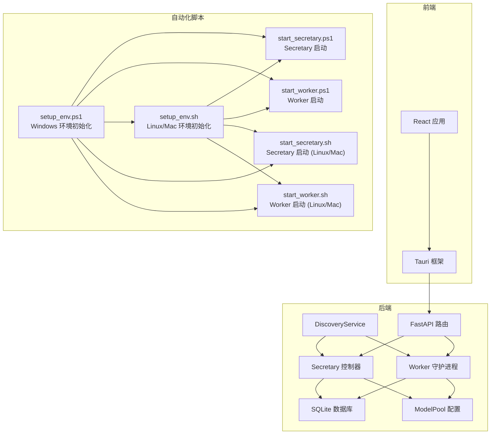
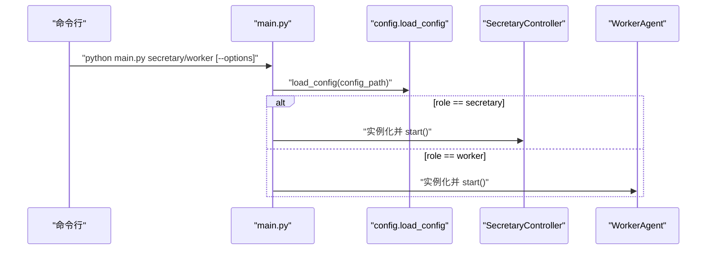
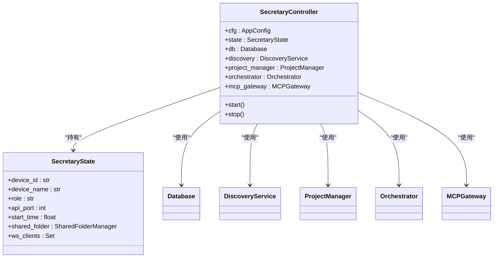
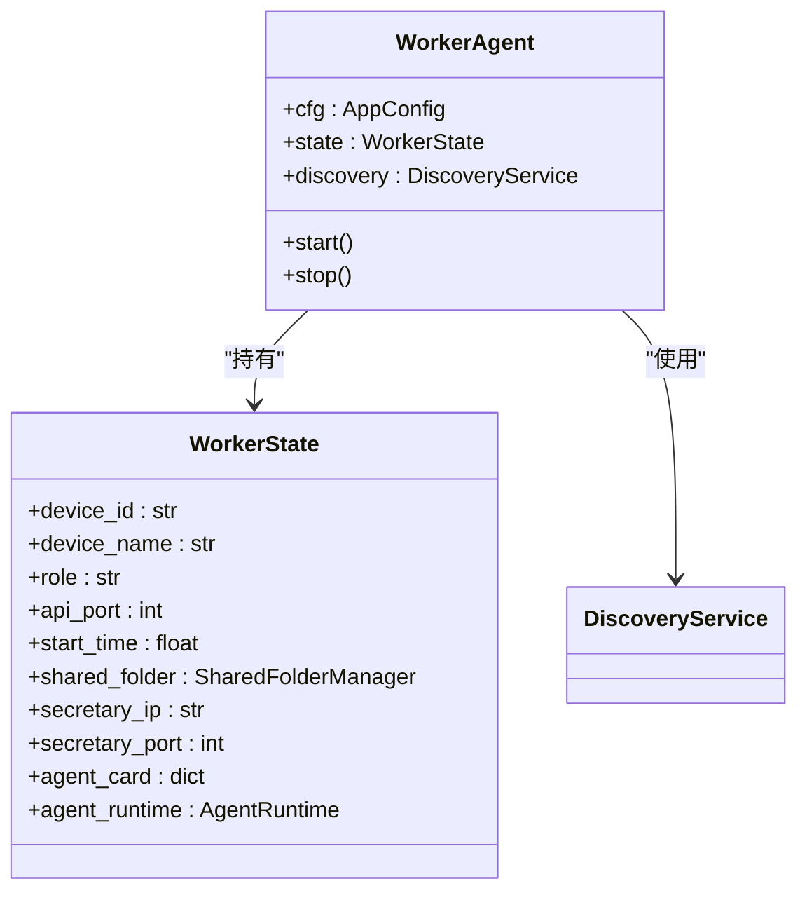
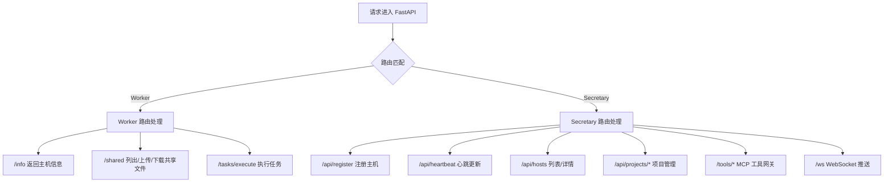
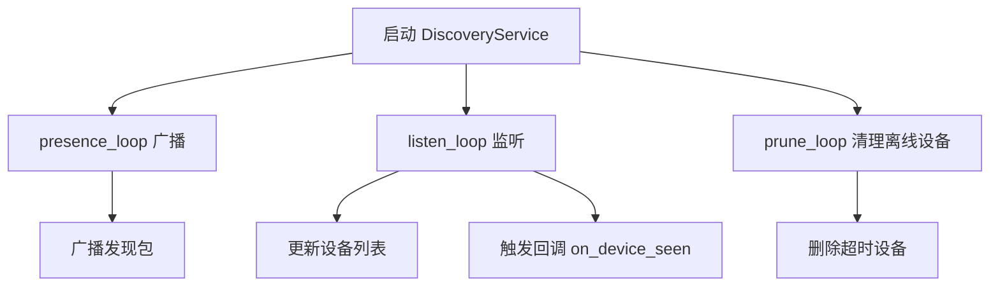
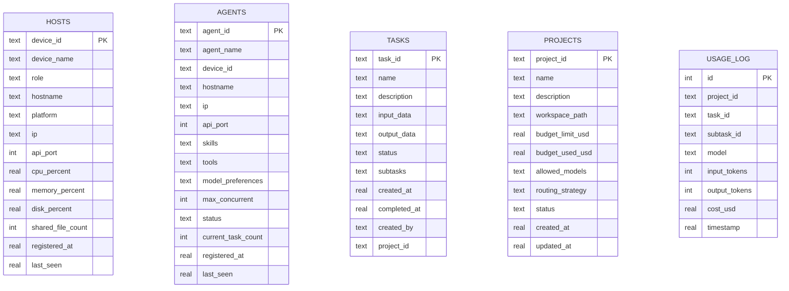
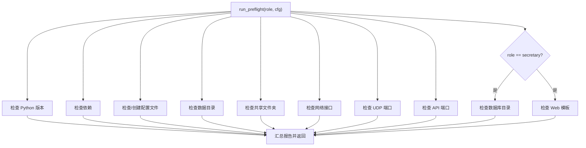
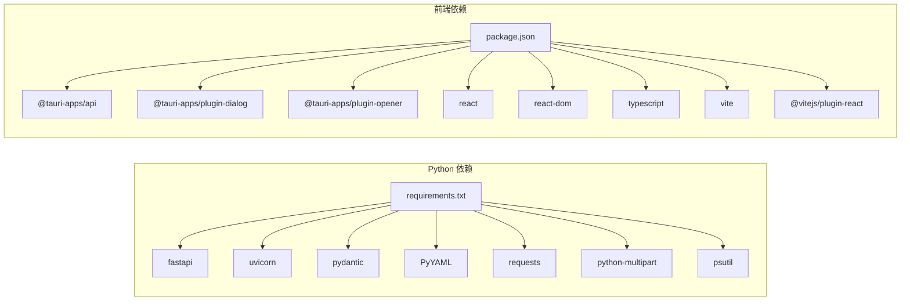

# 开发者指南

<cite>
**本文档引用的文件**
- [main.py](file://main.py)
- [requirements.txt](file://requirements.txt)
- [config.yaml](file://config.yaml)
- [lan_mesh/__init__.py](file://lan_mesh/__init__.py)
- [lan_mesh/config.py](file://lan_mesh/config.py)
- [station_controller.py](file://lan_mesh/station_controller.py)
- [lan_mesh/worker.py](file://lan_mesh/worker.py)
- [lan_mesh/api.py](file://lan_mesh/api.py)
- [lan_mesh/discovery.py](file://lan_mesh/discovery.py)
- [lan_mesh/database.py](file://lan_mesh/database.py)
- [lan_mesh/preflight.py](file://lan_mesh/preflight.py)
- [lan_mesh/model_pool.example.yaml](file://lan_mesh/model_pool.example.yaml)
- [scripts/setup_env.ps1](file://scripts/setup_env.ps1)
- [scripts/setup_env.sh](file://scripts/setup_env.sh)
- [scripts/start_secretary.ps1](file://scripts/start_secretary.ps1)
- [scripts/start_secretary.sh](file://scripts/start_secretary.sh)
- [scripts/start_worker.ps1](file://scripts/start_worker.ps1)
- [scripts/start_worker.sh](file://scripts/start_worker.sh)
- [quicklan-main/package.json](file://quicklan-main/package.json)
- [quicklan-main/vite.config.ts](file://quicklan-main/vite.config.ts)
- [quicklan-main/src/main.tsx](file://quicklan-main/src/main.tsx)
- [quicklan-main/src-tauri/tauri.conf.json](file://quicklan-main/src-tauri/tauri.conf.json)
</cite>

## 更新摘要
**所做更改**
- 新增阿里云百炼 Token Plan 环境变量配置章节，详细介绍 ALIYUN_TOKENPLAN_API_KEY 的设置和使用
- 更新模型池配置说明，包含完整的阿里云百炼 Token Plan 模型配置示例
- 增强跨平台环境变量设置指导，提供 Windows PowerShell 和 Linux/macOS Bash 的具体配置示例
- 完善自动化脚本使用指南，包含新增的环境变量配置步骤

## 目录
1. [简介](#简介)
2. [项目结构](#项目结构)
3. [核心组件](#核心组件)
4. [架构总览](#架构总览)
5. [详细组件分析](#详细组件分析)
6. [依赖分析](#依赖分析)
7. [性能考虑](#性能考虑)
8. [自动化脚本使用指南](#自动化脚本使用指南)
9. [环境变量配置指南](#环境变量配置指南)
10. [故障排查指南](#故障排查指南)
11. [结论](#结论)
12. [附录](#附录)

## 简介
本指南面向开发者，帮助你快速搭建开发环境、理解代码结构、遵循开发规范、完成贡献与发布流程，并掌握测试策略、调试技巧与扩展开发方法。项目由两部分组成：
- Python 后端：LAN Mesh 核心，负责设备发现、注册、心跳、任务编排、项目预算与 MCP 工具网关等。
- Tauri/React 前端：QuickLAN 桌面应用，提供本地化桌面体验。

## 项目结构
仓库采用"多根"组织方式，核心后端位于根目录的 lan_mesh 包，前端位于 quicklan-main 目录；另有统一入口脚本 main.py 与依赖清单 requirements.txt。新增的 scripts 目录提供跨平台自动化脚本，简化开发环境搭建和节点启动流程。

```mermaid
graph TB
A["根目录"] --> B["lan_mesh 包<br/>核心后端"]
A --> C["quicklan-main<br/>前端应用"]
A --> D["main.py<br/>统一入口"]
A --> E["requirements.txt<br/>Python 依赖"]
A --> F["scripts/<br/>自动化脚本"]
F --> F1["setup_env.ps1<br/>Windows 环境初始化"]
F --> F2["setup_env.sh<br/>Linux/Mac 环境初始化"]
F --> F3["start_secretary.ps1<br/>Secretary 启动脚本"]
F --> F4["start_secretary.sh<br/>Secretary 启动脚本"]
F --> F5["start_worker.ps1<br/>Worker 启动脚本"]
F --> F6["start_worker.sh<br/>Worker 启动脚本"]
B --> B1["station_controller.py<br/>Station Director"]
B --> B2["worker.py<br/>Worker 守护进程"]
B --> B3["api.py<br/>FastAPI 路由"]
B --> B4["discovery.py<br/>UDP 发现服务"]
B --> B5["database.py<br/>SQLite 存储"]
B --> B6["config.py<br/>配置管理"]
B --> B7["preflight.py<br/>启动前自检"]
B --> B8["model_pool.example.yaml<br/>模型池配置模板"]
C --> C1["src/main.tsx<br/>React 入口"]
C --> C2["vite.config.ts<br/>Vite 开发服务器"]
C --> C3["src-tauri/tauri.conf.json<br/>Tauri 配置"]
C --> C4["package.json<br/>NPM 脚本与依赖"]
```



**图表来源**
- [main.py:1-90](file://main.py#L1-L90)
- [station_controller.py](file://lan_mesh/station_controller.py#L1-L342)
- [lan_mesh/worker.py:1-325](file://lan_mesh/worker.py#L1-L325)
- [lan_mesh/api.py:1-539](file://lan_mesh/api.py#L1-L539)
- [lan_mesh/discovery.py:1-259](file://lan_mesh/discovery.py#L1-L259)
- [lan_mesh/database.py:1-611](file://lan_mesh/database.py#L1-L611)
- [lan_mesh/config.py:1-84](file://lan_mesh/config.py#L1-L84)
- [lan_mesh/preflight.py:1-290](file://lan_mesh/preflight.py#L1-L290)
- [lan_mesh/model_pool.example.yaml:1-331](file://lan_mesh/model_pool.example.yaml#L1-L331)
- [quicklan-main/src/main.tsx:1-11](file://quicklan-main/src/main.tsx#L1-L11)
- [quicklan-main/vite.config.ts:1-15](file://quicklan-main/vite.config.ts#L1-L15)
- [quicklan-main/src-tauri/tauri.conf.json:1-48](file://quicklan-main/src-tauri/tauri.conf.json#L1-L48)
- [quicklan-main/package.json:1-32](file://quicklan-main/package.json#L1-L32)
- [scripts/setup_env.ps1:1-74](file://scripts/setup_env.ps1#L1-L74)
- [scripts/setup_env.sh:1-57](file://scripts/setup_env.sh#L1-L57)
- [scripts/start_secretary.ps1:1-49](file://scripts/start_secretary.ps1#L1-L49)
- [scripts/start_secretary.sh:1-54](file://scripts/start_secretary.sh#L1-L54)
- [scripts/start_worker.ps1:1-49](file://scripts/start_worker.ps1#L1-L49)
- [scripts/start_worker.sh:1-54](file://scripts/start_worker.sh#L1-L54)

**章节来源**
- [main.py:1-90](file://main.py#L1-L90)
- [station_controller.py](file://lan_mesh/station_controller.py#L1-L342)
- [lan_mesh/worker.py:1-325](file://lan_mesh/worker.py#L1-L325)
- [quicklan-main/src/main.tsx:1-11](file://quicklan-main/src/main.tsx#L1-L11)
- [scripts/setup_env.ps1:1-74](file://scripts/setup_env.ps1#L1-L74)
- [scripts/setup_env.sh:1-57](file://scripts/setup_env.sh#L1-L57)

## 核心组件
- 统一入口与角色分发：main.py 解析命令行参数，加载配置，按角色启动 Secretary 或 Worker。
- 配置系统：基于 Pydantic 的强类型配置，支持 YAML 文件与环境变量覆盖。
- Secretary 控制器：负责设备发现、注册、心跳、Web UI、任务编排、项目预算与 MCP 工具网关。
- Worker 守护进程：负责设备发现、注册、心跳、共享文件夹、任务执行与 Agent 运行时。
- API 路由：Worker API（共享文件、信息查询）与 Secretary API（注册、心跳、主机列表、项目与任务管理、MCP 工具网关）。
- UDP 发现：基于广播的设备发现与 TTL 清理。
- 数据库：SQLite 存储主机、Agent、任务、项目与消费记录。
- 启动前自检：确保 Python 版本、依赖、端口、网络、共享目录等满足运行条件。
- **新增** 自动化脚本：提供跨平台一键环境初始化和节点启动功能。
- **新增** 模型池配置：支持多种 AI 模型提供商，包括阿里云百炼 Token Plan 订阅制服务。

**章节来源**
- [main.py:25-86](file://main.py#L25-L86)
- [lan_mesh/config.py:48-84](file://lan_mesh/config.py#L48-L84)
- [station_controller.py](file://lan_mesh/station_controller.py#L69-L342)
- [lan_mesh/worker.py:62-325](file://lan_mesh/worker.py#L62-L325)
- [lan_mesh/api.py:39-526](file://lan_mesh/api.py#L39-L526)
- [lan_mesh/discovery.py:33-259](file://lan_mesh/discovery.py#L33-L259)
- [lan_mesh/database.py:16-611](file://lan_mesh/database.py#L16-L611)
- [lan_mesh/preflight.py:226-290](file://lan_mesh/preflight.py#L226-L290)
- [lan_mesh/model_pool.example.yaml:140-331](file://lan_mesh/model_pool.example.yaml#L140-L331)
- [scripts/setup_env.ps1:1-74](file://scripts/setup_env.ps1#L1-L74)
- [scripts/setup_env.sh:1-57](file://scripts/setup_env.sh#L1-L57)

## 架构总览
系统采用"Secretary/Worker"分布式架构，通过 UDP 广播实现设备发现，通过 HTTP API 与 WebSocket 实现实时状态同步。前端 QuickLAN 作为桌面应用，通过 Tauri 与后端交互。新增的自动化脚本提供跨平台支持，简化开发流程。模型池配置支持多种 AI 服务提供商，包括阿里云百炼 Token Plan 订阅制服务。



**图表来源**
- [station_controller.py](file://lan_mesh/station_controller.py#L69-L342)
- [lan_mesh/worker.py:62-325](file://lan_mesh/worker.py#L62-L325)
- [lan_mesh/api.py:39-526](file://lan_mesh/api.py#L39-L526)
- [lan_mesh/discovery.py:33-259](file://lan_mesh/discovery.py#L33-L259)
- [lan_mesh/database.py:16-611](file://lan_mesh/database.py#L16-L611)
- [lan_mesh/model_pool.example.yaml:140-331](file://lan_mesh/model_pool.example.yaml#L140-L331)
- [quicklan-main/src/main.tsx:1-11](file://quicklan-main/src/main.tsx#L1-L11)
- [quicklan-main/src-tauri/tauri.conf.json:1-48](file://quicklan-main/src-tauri/tauri.conf.json#L1-L48)
- [scripts/setup_env.ps1:1-74](file://scripts/setup_env.ps1#L1-L74)
- [scripts/setup_env.sh:1-57](file://scripts/setup_env.sh#L1-L57)
- [scripts/start_secretary.ps1:1-49](file://scripts/start_secretary.ps1#L1-L49)
- [scripts/start_worker.ps1:1-49](file://scripts/start_worker.ps1#L1-L49)
- [scripts/start_secretary.sh:1-54](file://scripts/start_secretary.sh#L1-L54)
- [scripts/start_worker.sh:1-54](file://scripts/start_worker.sh#L1-L54)

## 详细组件分析

### 统一入口与角色启动
- 解析命令行参数，加载配置，覆盖设备名、端口、共享目录等。
- 根据角色实例化控制器并启动服务。



**图表来源**
- [main.py:25-86](file://main.py#L25-L86)
- [lan_mesh/config.py:48-72](file://lan_mesh/config.py#L48-L72)

**章节来源**
- [main.py:25-86](file://main.py#L25-L86)
- [lan_mesh/config.py:48-72](file://lan_mesh/config.py#L48-L72)

### Secretary 控ROLLER
- 职责：设备发现、注册、心跳、Web UI、任务编排、项目预算、MCP 工具网关。
- 生命周期：启动前自检、创建共享文件夹、部署采集脚本、启动发现服务、定时刷新配置、离线清理、启动 FastAPI 与 WebSocket 推送。



**图表来源**
- [station_controller.py](file://lan_mesh/station_controller.py#L69-L114)
- [station_controller.py](file://lan_mesh/station_controller.py#L238-L342)

**章节来源**
- [station_controller.py](file://lan_mesh/station_controller.py#L69-L342)

### Worker 守护进程
- 职责：设备发现、注册、心跳、共享文件夹、任务执行与 Agent 运行时。
- 生命周期：启动前自检、创建共享文件夹、部署采集脚本、启动发现服务、心跳循环、启动 FastAPI。



**图表来源**
- [lan_mesh/worker.py:62-96](file://lan_mesh/worker.py#L62-L96)
- [lan_mesh/worker.py:253-325](file://lan_mesh/worker.py#L253-L325)

**章节来源**
- [lan_mesh/worker.py:62-325](file://lan_mesh/worker.py#L62-L325)

### API 路由与端点
- Worker API：/info、/shared、/shared/{path}、/shared、/tasks/execute。
- Secretary API：/api/register、/api/heartbeat、/api/hosts、/api/hosts/{id}、/api/network、/api/probe/{ip}、/api/discovery、/api/health、/api/secretary-info、/api/shared、/api/agents/*、/api/tasks/*、/api/projects/*、/tools/*、/ws。



**图表来源**
- [lan_mesh/api.py:39-526](file://lan_mesh/api.py#L39-L526)

**章节来源**
- [lan_mesh/api.py:39-526](file://lan_mesh/api.py#L39-L526)

### UDP 发现服务
- 定期广播自身存在、监听其他设备、TTL 清理、网络状态查询、主动探测。



**图表来源**
- [lan_mesh/discovery.py:71-259](file://lan_mesh/discovery.py#L71-L259)

**章节来源**
- [lan_mesh/discovery.py:33-259](file://lan_mesh/discovery.py#L33-L259)

### 数据库与模型
- 表：hosts、heartbeat_log、agents、tasks、projects、usage_log。
- 支持 Upsert、查询、索引、清理与统计。



**图表来源**
- [lan_mesh/database.py:36-143](file://lan_mesh/database.py#L36-L143)
- [lan_mesh/database.py:490-585](file://lan_mesh/database.py#L490-L585)

**章节来源**
- [lan_mesh/database.py:16-611](file://lan_mesh/database.py#L16-L611)

### 启动前自检
- 检查 Python 版本、依赖、配置文件、数据目录、共享文件夹、网络、UDP 端口、API 端口、数据库目录、Web 模板等。



**图表来源**
- [lan_mesh/preflight.py:226-290](file://lan_mesh/preflight.py#L226-L290)

**章节来源**
- [lan_mesh/preflight.py:48-222](file://lan_mesh/preflight.py#L48-L222)

### 前端 QuickLAN（Tauri/React）
- Vite 开发服务器端口 1420，Tauri 构建后集成前端产物。
- package.json 提供 dev/build/app:dev/app:build 等脚本。
- tauri.conf.json 定义窗口尺寸、打包目标、图标与安装器配置。

**章节来源**
- [quicklan-main/vite.config.ts:1-15](file://quicklan-main/vite.config.ts#L1-L15)
- [quicklan-main/package.json:7-14](file://quicklan-main/package.json#L7-L14)
- [quicklan-main/src-tauri/tauri.conf.json:6-11](file://quicklan-main/src-tauri/tauri.conf.json#L6-L11)
- [quicklan-main/src/main.tsx:1-11](file://quicklan-main/src/main.tsx#L1-L11)

### 模型池配置系统
- 支持多种 AI 模型提供商，包括 OpenAI、DeepSeek、阿里云百炼等。
- **新增** 阿里云百炼 Token Plan 订阅制服务，提供统一的 Credits 计量方式。
- 模型配置包含 API Key 环境变量、基础 URL、成本计算、能力评分等参数。

**章节来源**
- [lan_mesh/model_pool.example.yaml:140-331](file://lan_mesh/model_pool.example.yaml#L140-L331)

## 依赖分析
- Python 后端依赖：FastAPI、Uvicorn、Pydantic、PyYAML、Requests、python-multipart、psutil。
- 前端依赖：React、React DOM、@tauri-apps/api、@tauri-apps/cli、TypeScript、Vite、@vitejs/plugin-react 等。



**图表来源**
- [requirements.txt:1-8](file://requirements.txt#L1-L8)
- [quicklan-main/package.json:15-30](file://quicklan-main/package.json#L15-L30)

**章节来源**
- [requirements.txt:1-8](file://requirements.txt#L1-L8)
- [quicklan-main/package.json:15-30](file://quicklan-main/package.json#L15-L30)

## 性能考虑
- 端口选择：API 端口被占用时自动递增寻找可用端口；UDP 端口需可绑定。
- 线程与并发：发现服务与心跳循环在独立线程运行；FastAPI/Uvicorn 提供异步支持。
- 数据库：每线程独立连接，避免跨线程共享连接；建立必要索引提升查询性能。
- 心跳与清理：合理设置心跳间隔与设备 TTL，平衡实时性与网络开销。
- 文件共享：上传/下载采用流式处理，避免大文件内存占用。
- **新增** 模型池性能：Token Plan 订阅制服务按 Credits 计量，避免按次计费的网络开销。

## 自动化脚本使用指南

### 脚本概览
项目提供完整的跨平台自动化脚本，支持 Windows PowerShell 和 Linux/macOS Bash 环境，简化开发环境搭建和节点启动流程。

### 环境初始化脚本

#### Windows PowerShell 版本
**setup_env.ps1** - Windows 环境初始化脚本
- 功能：创建虚拟环境、安装依赖、复制模型池配置模板
- 用法：`.\scripts\setup_env.ps1`
- 输出：彩色进度提示，包含下一步操作指引
- **新增** 环境变量设置：包含 ALIYUN_TOKENPLAN_API_KEY 的配置指导

#### Linux/Mac Bash 版本
**setup_env.sh** - Linux/Mac 环境初始化脚本
- 功能：创建虚拟环境、安装依赖、复制模型池配置模板
- 用法：`bash scripts/setup_env.sh`
- 输出：标准输出进度提示，包含下一步操作指引
- **新增** 环境变量设置：包含 ALIYUN_TOKENPLAN_API_KEY 的配置指导

**章节来源**
- [scripts/setup_env.ps1:1-74](file://scripts/setup_env.ps1#L1-L74)
- [scripts/setup_env.sh:1-57](file://scripts/setup_env.sh#L1-L57)

### Secretary 节点启动脚本

#### Windows PowerShell 版本
**start_secretary.ps1** - Windows Secretary 节点启动脚本
- 用法：`.\\scripts\\start_secretary.ps1 [-Port 45470] [-Name "控制中心"] [-Config "config.yaml"] [-Shared "/path/to/shared"]`
- 参数说明：
  - `-Port` 或 `-p`：指定 API 端口，默认 45470
  - `-Name` 或 `-n`：指定设备名称
  - `-Config` 或 `-c`：指定配置文件路径
  - `-Shared`：指定共享文件夹路径

#### Linux/macOS Bash 版本
**start_secretary.sh** - 跨平台 Secretary 节点启动脚本
- 用法：`bash scripts/start_secretary.sh [--port 45470] [--name "控制中心"] [--config "config.yaml"] [--shared "/path/to/shared"]`
- 参数说明：与 PowerShell 版本完全相同

**章节来源**
- [scripts/start_secretary.ps1:1-49](file://scripts/start_secretary.ps1#L1-L49)
- [scripts/start_secretary.sh:1-54](file://scripts/start_secretary.sh#L1-L54)

### Worker 节点启动脚本

#### Windows PowerShell 版本
**start_worker.ps1** - Windows Worker 节点启动脚本
- 用法：`.\\scripts\\start_worker.ps1 [-Port 45460] [-Name "计算节点-01"] [-Config "config.yaml"] [-Shared "/path/to/shared"]`
- 参数说明：
  - `-Port` 或 `-p`：指定 API 端口，默认 45460
  - `-Name` 或 `-n`：指定设备名称
  - `-Config` 或 `-c`：指定配置文件路径
  - `-Shared`：指定共享文件夹路径

#### Linux/macOS Bash 版本
**start_worker.sh** - 跨平台 Worker 节点启动脚本
- 用法：`bash scripts/start_worker.sh [--port 45460] [--name "计算节点-01"] [--config "config.yaml"] [--shared "/path/to/shared"]`
- 参数说明：与 PowerShell 版本完全相同

**章节来源**
- [scripts/start_worker.ps1:1-49](file://scripts/start_worker.ps1#L1-L49)
- [scripts/start_worker.sh:1-54](file://scripts/start_worker.sh#L1-L54)

### 虚拟环境检测机制改进

#### Windows PowerShell 脚本改进
- **增强的虚拟环境检测**：检查 .venv/Scripts/Activate.ps1 是否存在，确保虚拟环境格式正确
- **自动重建机制**：当检测到非 Windows 格式的虚拟环境时自动重建
- **明确的错误处理**：当虚拟环境 Python 不存在时提供清晰的错误信息

#### Linux/Mac Bash 脚本改进
- **统一的虚拟环境检测**：检查 $VENV/bin/python3 是否可执行，确保跨平台兼容性
- **智能 Python 选择**：优先使用虚拟环境中的 python3，否则回退到系统 python3
- **健壮的参数解析**：支持 --port、--name、--config、--shared 参数的完整解析

**章节来源**
- [scripts/setup_env.ps1:14-41](file://scripts/setup_env.ps1#L14-L41)
- [scripts/setup_env.sh:16-24](file://scripts/setup_env.sh#L16-L24)
- [scripts/start_secretary.ps1:21-29](file://scripts/start_secretary.ps1#L21-L29)
- [scripts/start_worker.ps1:21-29](file://scripts/start_worker.ps1#L21-L29)
- [scripts/start_secretary.sh:25-35](file://scripts/start_secretary.sh#L25-L35)
- [scripts/start_worker.sh:25-35](file://scripts/start_worker.sh#L25-L35)

### 跨平台开发环境最佳实践

#### Windows 环境设置
1. **PowerShell 执行策略**
   ```powershell
   Set-ExecutionPolicy -ExecutionPolicy RemoteSigned -Scope CurrentUser
   ```

2. **推荐的启动顺序**
   ```powershell
   # 1. 初始化环境
   .\scripts\setup_env.ps1
   
   # 2. 启动 Secretary 节点
   .\scripts\start_secretary.ps1 -Port 45470 -Name "控制中心"
   
   # 3. 启动 Worker 节点
   .\scripts\start_worker.ps1 -Port 45460 -Name "计算节点-01"
   ```

#### Linux/macOS 环境设置
1. **赋予执行权限**
   ```bash
   chmod +x scripts/*.sh
   ```

2. **推荐的启动顺序**
   ```bash
   # 1. 初始化环境
   bash scripts/setup_env.sh
   
   # 2. 启动 Secretary 节点
   bash scripts/start_secretary.sh --port 45470 --name "控制中心"
   
   # 3. 启动 Worker 节点
   bash scripts/start_worker.sh --port 45460 --name "计算节点-01"
   ```

#### 环境变量配置
- **API Key 配置**：设置模型池所需的 API 密钥环境变量
- **阿里云百炼 Token Plan**：设置 `ALIYUN_TOKENPLAN_API_KEY` 环境变量
- **自定义配置**：通过 `--config` 参数指定自定义配置文件路径
- **共享目录**：通过 `--shared` 参数自定义共享文件夹位置

**章节来源**
- [scripts/setup_env.ps1:51-55](file://scripts/setup_env.ps1#L51-L55)
- [scripts/setup_env.sh:48-55](file://scripts/setup_env.sh#L48-L55)
- [scripts/start_secretary.ps1:2-9](file://scripts/start_secretary.ps1#L2-L9)
- [scripts/start_worker.ps1:2-9](file://scripts/start_worker.ps1#L2-L9)
- [scripts/start_secretary.sh:2-23](file://scripts/start_secretary.sh#L2-L23)
- [scripts/start_worker.sh:2-23](file://scripts/start_worker.sh#L2-L23)

## 环境变量配置指南

### 阿里云百炼 Token Plan 配置

#### 环境变量设置

**Windows PowerShell**
```powershell
$env:ALIYUN_TOKENPLAN_API_KEY = "你的TokenPlan专属Key"
```

**Linux/macOS Bash**
```bash
export ALIYUN_TOKENPLAN_API_KEY="你的TokenPlan专属Key"
```

#### 配置说明
- **获取方式**：登录阿里云百炼控制台 → Token Plan → 成员管理 → 生成 API Key
- **注意事项**：Token Plan Key 与普通百炼 API Key 不通用
- **订阅制特点**：按 Credits 计量，无需担心按次计费的网络开销

#### 支持的模型系列
- **千问系列**：qwen3.7-max、qwen3.7-plus、qwen3.6-plus、qwen3.6-flash
- **DeepSeek系列**：deepseek-v4-pro、deepseek-v4-flash、deepseek-v3.2
- **月之暗面 Kimi系列**：kimi-k2.7-code、kimi-k2.6、kimi-k2.5
- **智谱 GLM系列**：glm-5.2、glm-5.1、glm-5
- **MiniMax系列**：MiniMax-M2.5

#### 跨平台最佳实践

**Windows PowerShell**
```powershell
# 1. 设置环境变量
$env:ALIYUN_TOKENPLAN_API_KEY = "sk-xxxxxxxxxxxxxxxxxxxxxxxxxxxxxxxx"

# 2. 验证设置
$env:ALIYUN_TOKENPLAN_API_KEY

# 3. 启动项目
.\scripts\setup_env.ps1
.\scripts\start_secretary.ps1
```

**Linux/macOS Bash**
```bash
# 1. 设置环境变量
export ALIYUN_TOKENPLAN_API_KEY="sk-xxxxxxxxxxxxxxxxxxxxxxxxxxxxxxxx"

# 2. 验证设置
echo $ALIYUN_TOKENPLAN_API_KEY

# 3. 启动项目
bash scripts/setup_env.sh
bash scripts/start_secretary.sh
```

**章节来源**
- [scripts/setup_env.ps1:67-70](file://scripts/setup_env.ps1#L67-L70)
- [scripts/setup_env.sh:50-53](file://scripts/setup_env.sh#L50-L53)
- [lan_mesh/model_pool.example.yaml:140-331](file://lan_mesh/model_pool.example.yaml#L140-L331)

## 故障排查指南
- 启动失败：查看启动前自检输出，确认致命检查项是否通过。
- 端口冲突：UDP 发现端口被占用会导致发现服务降级；API 端口被占用会自动递增。
- 网络问题：确认非回环 IPv4 接口可用，广播目标可达。
- 权限问题：确保数据目录与共享文件夹可写。
- 前端无法访问：确认 Vite 开发服务器端口 1420 可用，Tauri 构建产物正确。
- **新增** 脚本执行问题：检查 PowerShell 执行策略或 Bash 脚本权限设置。
- **新增** 虚拟环境问题：确认虚拟环境中包含正确的 Python 可执行文件，检查 .venv 目录结构。
- **新增** 环境变量问题：确认 ALIYUN_TOKENPLAN_API_KEY 设置正确，检查环境变量在当前会话中生效。

**章节来源**
- [lan_mesh/preflight.py:226-290](file://lan_mesh/preflight.py#L226-L290)
- [lan_mesh/discovery.py:155-174](file://lan_mesh/discovery.py#L155-L174)
- [lan_mesh/worker.py:267-269](file://lan_mesh/worker.py#L267-L269)
- [quicklan-main/vite.config.ts:7-13](file://quicklan-main/vite.config.ts#L7-L13)
- [scripts/setup_env.ps1:14-22](file://scripts/setup_env.ps1#L14-L22)
- [scripts/setup_env.sh:16-24](file://scripts/setup_env.sh#L16-L24)

## 结论
本指南提供了从环境搭建到贡献发布的全流程说明，结合架构图与组件分析，帮助开发者高效参与 LAN Mesh 与 QuickLAN 的开发与维护。新增的 Linux/Mac Bash 环境初始化脚本、改进的虚拟环境检测机制以及阿里云百炼 Token Plan 环境变量配置大幅简化了跨平台开发环境设置，增强了系统的可靠性和兼容性。建议在贡献前先完成自检并通过基本功能验证，再提交 Pull Request。

## 附录

### 开发环境搭建步骤
- Python 环境
  - 安装 Python ≥ 3.10。
  - 安装依赖：pip install -r requirements.txt。
- 前端环境
  - 安装 Node.js 与 npm。
  - 在 quicklan-main 目录执行 npm install。
- **新增** 自动化环境初始化
  - Windows：运行 `.\scripts\setup_env.ps1`
  - Linux/macOS：运行 `bash scripts/setup_env.sh`
- **新增** 环境变量配置
  - 设置 `ALIYUN_TOKENPLAN_API_KEY` 环境变量
  - 可选：设置 `DEEPSEEK_API_KEY` 和 `OPENAI_API_KEY`
- 启动后端
  - 使用 python main.py secretary 或 python main.py worker 启动。
- 启动前端
  - npm run dev 启动 Vite 开发服务器。
  - npm run app:dev 启动 Tauri 开发模式。

**章节来源**
- [requirements.txt:1-8](file://requirements.txt#L1-L8)
- [quicklan-main/package.json:7-14](file://quicklan-main/package.json#L7-L14)
- [main.py:25-86](file://main.py#L25-L86)
- [scripts/setup_env.ps1:1-74](file://scripts/setup_env.ps1#L1-L74)
- [scripts/setup_env.sh:1-57](file://scripts/setup_env.sh#L1-L57)

### IDE 配置与调试设置
- Python
  - 使用支持 Pylance/Pyright 的编辑器（如 VS Code），启用类型检查与导入优化。
  - 配置运行/调试：选择 main.py，传递参数 secretary/worker 与可选 --port/--name/--shared/--config。
- 前端
  - VS Code 中安装 React/TypeScript 插件，启用 ESLint/Prettier。
  - 配置 launch.json 启动 Vite 与 Tauri 开发调试。
- **新增** 脚本调试
  - PowerShell：在 PowerShell ISE 或 VS Code 中直接运行 `.ps1` 文件
  - Bash：在终端中使用 `bash` 命令执行 `.sh` 文件
- **新增** 环境变量调试
  - 在 IDE 中设置环境变量，确保调试会话能够访问 ALIYUN_TOKENPLAN_API_KEY

### 测试策略与质量保证
- 单元测试：针对关键函数（如配置解析、端口查找、心跳处理）编写单元测试。
- 集成测试：模拟 Secretary/Worker 启动、注册、心跳、发现与 API 调用。
- 端到端测试：通过浏览器或 Tauri 窗口验证 Web UI 与桌面应用交互。
- 质量门禁：在 CI 中执行类型检查、静态分析与最小化测试集。
- **新增** 脚本测试
  - 验证跨平台脚本在不同操作系统上的兼容性
  - 测试脚本参数解析和错误处理机制
  - 验证虚拟环境检测和自动重建功能
- **新增** 环境变量测试
  - 验证 ALIYUN_TOKENPLAN_API_KEY 在不同平台上的设置和读取
  - 测试模型池配置中 Token Plan 模型的可用性

### 贡献指南与 Pull Request 流程
- 分支策略：从 main 派生特性分支，完成后提交 PR 至 main。
- 提交流程：更新文档与变更日志，确保自检通过，PR 描述清晰，包含测试与截图（UI 变更）。
- 代码评审：关注可读性、性能与安全性，遵循现有命名与注释规范。
- **新增** 脚本贡献
  - 确保脚本在 Windows 和 Linux/macOS 上都能正常运行
  - 提供详细的参数说明和使用示例
  - 添加适当的错误处理和用户反馈
- **新增** 环境变量贡献
  - 提供跨平台的环境变量设置示例
  - 包含完整的配置说明和使用场景

### 扩展开发与插件开发
- 新增 API：在 api.py 中新增路由，确保参数校验与错误处理完善。
- 新增发现协议：扩展 protocol 中的数据结构并在 discovery.py 中处理。
- 插件/工具：通过 MCP 工具网关注册与调用外部工具，注意鉴权与超时控制。
- **新增** 脚本扩展
  - 可以基于现有脚本模板创建新的自动化任务
  - 支持添加更多平台特定的优化选项
- **新增** 模型提供商扩展
  - 可以在 model_pool.yaml 中添加新的模型提供商配置
  - 支持不同的认证方式和计费模式

### 版本管理与发布流程
- 版本号
  - Python 包版本：lan_mesh/__init__.py 中 __version__。
  - 前端版本：quicklan-main/package.json 中 version。
  - Tauri 版本：quicklan-main/src-tauri/tauri.conf.json 中 version。
- 发布步骤
  - 更新版本号与变更日志。
  - 构建前端：npm run build。
  - 构建桌面应用：npm run app:build（Windows NSIS 安装包）。
  - 生成发布包并上传至发布渠道。
- **新增** 脚本版本管理
  - 脚本文件包含版本信息和更新日志
  - 支持增量更新和向后兼容性检查
- **新增** 环境变量版本管理
  - 脚本中包含环境变量的版本兼容性检查
  - 提供环境变量迁移指南

**章节来源**
- [lan_mesh/__init__.py:10](file://lan_mesh/__init__.py#L10)
- [quicklan-main/package.json:2](file://quicklan-main/package.json#L2)
- [quicklan-main/src-tauri/tauri.conf.json:3](file://quicklan-main/src-tauri/tauri.conf.json#L3)
