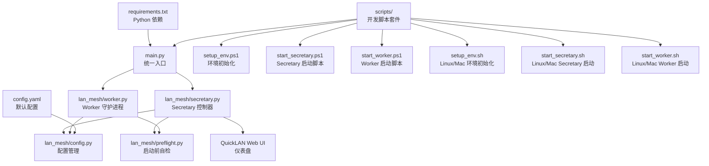

# 快速开始

<cite>
**本文引用的文件**
- [main.py](file://main.py)
- [requirements.txt](file://requirements.txt)
- [config.yaml](file://config.yaml)
- [scripts/setup_env.ps1](file://scripts/setup_env.ps1)
- [scripts/setup_env.sh](file://scripts/setup_env.sh)
- [scripts/start_secretary.ps1](file://scripts/start_secretary.ps1)
- [scripts/start_secretary.sh](file://scripts/start_secretary.sh)
- [scripts/start_worker.ps1](file://scripts/start_worker.ps1)
- [scripts/start_worker.sh](file://scripts/start_worker.sh)
- [lan_mesh/secretary.py](file://lan_mesh/secretary.py)
- [lan_mesh/worker.py](file://lan_mesh/worker.py)
- [lan_mesh/config.py](file://lan_mesh/config.py)
- [lan_mesh/preflight.py](file://lan_mesh/preflight.py)
- [lan_mesh/__init__.py](file://lan_mesh/__init__.py)
</cite>

## 更新摘要
**变更内容**
- 新增 Linux/Mac Bash 环境初始化脚本的使用说明
- 改进跨平台脚本套件的功能描述，包含 Secretary 节点支持
- 更新脚本套件的参数支持和启动流程说明
- 增强环境初始化脚本的跨平台兼容性

## 目录
1. [简介](#简介)
2. [项目结构](#项目结构)
3. [环境要求](#环境要求)
4. [安装步骤](#安装步骤)
5. [使用脚本套件](#使用脚本套件)
6. [启动 Secretary 节点](#启动-secretary-节点)
7. [启动 Worker 节点](#启动-worker-节点)
8. [配置文件说明](#配置文件说明)
9. [首次运行验证](#首次运行验证)
10. [常见问题与解决方案](#常见问题与解决方案)
11. [架构概览](#架构概览)
12. [结论](#结论)

## 简介
Work Station 是一个基于局域网的分布式主机管理与文件共享框架，支持 Secretary（主控）与 Worker（工作节点）两种角色。系统通过 UDP 广播进行设备发现，通过 HTTP API 进行注册与心跳，提供 Web UI 仪表盘用于可视化管理。项目同时包含一个配套的桌面应用 QuickLAN，用于跨平台的本地文件共享与传输。

**更新** 新增完整的开发环境脚本套件，提供一键化环境搭建和节点启动体验，支持 Windows PowerShell 和 Linux/Mac Bash 两种平台。

## 项目结构
项目采用分层组织方式：
- 核心 Python 包：lan_mesh，包含 Secretary/Worker 控制器、发现服务、数据库、共享文件夹管理等
- 入口脚本：main.py，统一入口，支持 secretary/worker 两种角色
- 开发脚本：scripts/ 目录下的 PowerShell 和 Bash 脚本，提供环境初始化和节点启动
- 配置：config.yaml，默认配置文件
- 依赖：requirements.txt，Python 依赖清单



**图表来源**
- [main.py:1-90](file://main.py#L1-L90)
- [lan_mesh/secretary.py:1-342](file://lan_mesh/secretary.py#L1-L342)
- [lan_mesh/worker.py:1-325](file://lan_mesh/worker.py#L1-L325)
- [lan_mesh/config.py:1-139](file://lan_mesh/config.py#L1-L139)
- [lan_mesh/preflight.py:1-290](file://lan_mesh/preflight.py#L1-L290)
- [scripts/setup_env.ps1:1-73](file://scripts/setup_env.ps1#L1-L73)
- [scripts/setup_env.sh:1-56](file://scripts/setup_env.sh#L1-L56)
- [scripts/start_secretary.ps1:1-49](file://scripts/start_secretary.ps1#L1-L49)
- [scripts/start_worker.ps1:1-49](file://scripts/start_worker.ps1#L1-L49)
- [scripts/start_secretary.sh:1-54](file://scripts/start_secretary.sh#L1-L54)
- [scripts/start_worker.sh:1-54](file://scripts/start_worker.sh#L1-L54)

**章节来源**
- [main.py:1-90](file://main.py#L1-L90)
- [lan_mesh/secretary.py:1-342](file://lan_mesh/secretary.py#L1-L342)
- [lan_mesh/worker.py:1-325](file://lan_mesh/worker.py#L1-L325)
- [lan_mesh/config.py:1-139](file://lan_mesh/config.py#L1-L139)
- [lan_mesh/preflight.py:1-290](file://lan_mesh/preflight.py#L1-L290)

## 环境要求
- Python 版本：3.11+（注意：自检模块要求 Python 版本不低于 3.10，脚本要求 3.11+）
- Python 依赖：通过 requirements.txt 安装
- 网络：需要可用的非回环 IPv4 网络接口
- 权限：对数据目录（~/.lan_mesh）和共享文件夹具有读写权限
- 端口：UDP 45454（发现），HTTP 端口（Secretary：45470，Worker：45460）

**更新** 脚本套件要求 Python 3.11+，提供了更严格的版本检查和自动化的环境准备。

注意：虽然文档目标提到 Python 3.8+，但实际代码要求 Python 3.10+。建议使用 Python 3.11 或更高版本以确保兼容性。

**章节来源**
- [lan_mesh/preflight.py:48-54](file://lan_mesh/preflight.py#L48-L54)
- [requirements.txt:1-8](file://requirements.txt#L1-L8)
- [scripts/start_secretary.ps1:14-19](file://scripts/start_secretary.ps1#L14-L19)
- [scripts/start_worker.ps1:14-19](file://scripts/start_worker.ps1#L14-L19)
- [scripts/start_secretary.sh:25-29](file://scripts/start_secretary.sh#L25-L29)
- [scripts/start_worker.sh:25-29](file://scripts/start_worker.sh#L25-L29)

## 安装步骤
### 方法一：使用脚本套件（推荐）
1. 克隆仓库
   ```bash
   git clone <repository-url>
   cd work_station
   ```

2. 运行环境初始化脚本
   - Windows PowerShell：
     ```powershell
     .\scripts\setup_env.ps1
     ```
   - Linux/Mac Bash：
     ```bash
     bash scripts/setup_env.sh
     ```

3. 环境初始化完成后，编辑模型池配置文件
   ```bash
   # 编辑 lan_mesh/model_pool.yaml 配置 API Key
   # 设置环境变量（可选）
   export DEEPSEEK_API_KEY="sk-xxx"
   export OPENAI_API_KEY="sk-xxx"
   ```

### 方法二：手动安装
1. 克隆仓库
   ```bash
   git clone <repository-url>
   cd work_station
   ```

2. 安装 Python 依赖
   ```bash
   pip install -r requirements.txt
   ```

3. 验证依赖安装
   ```bash
   python -c "import fastapi, uvicorn, psutil, pydantic, yaml, requests, multipart"
   ```

4. 准备配置文件
   - 默认配置文件位于项目根目录的 config.yaml
   - 也可放置在用户目录 ~/.lan_mesh/config.yaml
   - 系统会按以下顺序查找配置文件：显式指定 > 环境变量 > 用户目录 > 项目根目录

5. 准备共享文件夹
   - 默认共享文件夹为 ~/lan_mesh_shared
   - 确保该目录存在且可写
   - Secretary 和 Worker 都会创建该目录

**更新** 新增了完整的脚本套件，提供一键化环境搭建体验。环境初始化脚本会自动创建虚拟环境、安装依赖并复制配置模板。

**章节来源**
- [scripts/setup_env.ps1:14-43](file://scripts/setup_env.ps1#L14-L43)
- [scripts/setup_env.sh:16-42](file://scripts/setup_env.sh#L16-L42)
- [requirements.txt:1-8](file://requirements.txt#L1-L8)
- [config.yaml:1-22](file://config.yaml#L1-L22)
- [lan_mesh/config.py:48-72](file://lan_mesh/config.py#L48-L72)

## 使用脚本套件
**更新** 新增完整的脚本套件，提供跨平台的一键化操作体验，支持 Secretary 和 Worker 两种节点类型。

### 环境初始化脚本
- Windows PowerShell：`.\scripts\setup_env.ps1`
- Linux/Mac Bash：`bash scripts/setup_env.sh`

功能特性：
1. 自动创建虚拟环境（.venv）
2. 安装 Python 依赖
3. 复制模型池配置模板
4. 提供详细的下一步操作指导

### 跨平台启动脚本
#### Secretary 节点启动
- Windows PowerShell：`.\scripts\start_secretary.ps1`
- Linux/Mac Bash：`bash scripts/start_secretary.sh`

支持的参数：
- `--port` 或 `-p`：指定 API 端口（默认 45470）
- `--name` 或 `-n`：指定设备名称
- `--config` 或 `-c`：指定配置文件路径
- `--shared`：指定共享文件夹路径

示例：
```powershell
# Windows
.\scripts\start_secretary.ps1 --port 8080 --name "控制中心"
```

```bash
# Linux/Mac
bash scripts/start_secretary.sh --port 8080 --name "控制中心"
```

#### Worker 节点启动
- Windows PowerShell：`.\scripts\start_worker.ps1`
- Linux/Mac Bash：`bash scripts/start_worker.sh`

支持的参数：
- `--port` 或 `-p`：指定 API 端口（默认 45460）
- `--name` 或 `-n`：指定设备名称
- `--config` 或 `-c`：指定配置文件路径
- `--shared`：指定共享文件夹路径

示例：
```powershell
# Windows
.\scripts\start_worker.ps1 --shared /data/shared --name "计算节点-01"
```

```bash
# Linux/Mac
bash scripts/start_worker.sh --shared /data/shared --name "计算节点-01"
```

**章节来源**
- [scripts/setup_env.ps1:14-73](file://scripts/setup_env.ps1#L14-L73)
- [scripts/setup_env.sh:16-56](file://scripts/setup_env.sh#L16-L56)
- [scripts/start_secretary.ps1:4-49](file://scripts/start_secretary.ps1#L4-L49)
- [scripts/start_worker.ps1:4-49](file://scripts/start_worker.ps1#L4-L49)
- [scripts/start_secretary.sh:14-54](file://scripts/start_secretary.sh#L14-L54)
- [scripts/start_worker.sh:14-54](file://scripts/start_worker.sh#L14-L54)

## 启动 Secretary 节点
Secretary 节点负责：
- 启动 Web UI 仪表盘
- 管理数据库（SQLite）
- 广播自身存在
- 接收 Worker 注册与心跳
- 定期清理离线设备

### 使用传统方法
启动命令：
```bash
python main.py secretary
```

常用参数：
- `--port` 或 `-p`：指定 API 端口（默认 45470）
- `--name` 或 `-n`：指定设备名称
- `--shared`：指定共享文件夹路径
- `--config` 或 `-c`：指定配置文件路径

示例：
```bash
python main.py secretary --port 8080 --name "控制中心"
```

### 使用脚本套件
```powershell
# Windows
.\scripts\start_secretary.ps1 --port 8080 --name "控制中心"

# Linux/Mac
bash scripts/start_secretary.sh --port 8080 --name "控制中心"
```

启动流程：
1. 自检（Python 版本、依赖、配置、网络、端口等）
2. 生成设备 ID
3. 初始化数据库
4. 采集主机信息
5. 创建共享文件夹
6. 启动 FastAPI（含 Web UI）
7. 启动 UDP 发现服务
8. 启动后台任务（配置刷新、离线清理、WebSocket 推送）

**更新** 脚本套件提供了更友好的启动体验，包含自动激活虚拟环境、参数解析和详细的启动日志。

**章节来源**
- [main.py:25-86](file://main.py#L25-L86)
- [lan_mesh/secretary.py:255-342](file://lan_mesh/secretary.py#L255-L342)
- [lan_mesh/preflight.py:226-289](file://lan_mesh/preflight.py#L226-L289)
- [scripts/start_secretary.ps1:21-48](file://scripts/start_secretary.ps1#L21-L48)
- [scripts/start_secretary.sh:31-53](file://scripts/start_secretary.sh#L31-L53)

## 启动 Worker 节点
Worker 节点负责：
- 采集本机配置信息
- 创建并暴露共享文件夹
- 广播自身存在
- 向 Secretary 注册并发送心跳
- 提供 HTTP API 供 Secretary 查询

### 使用传统方法
启动命令：
```bash
python main.py worker
```

常用参数：
- `--port` 或 `-p`：指定 API 端口（默认 45460）
- `--name` 或 `-n`：指定设备名称
- `--shared`：指定共享文件夹路径
- `--config` 或 `-c`：指定配置文件路径

示例：
```bash
python main.py worker --shared /data/shared --name "计算节点-01"
```

### 使用脚本套件
```powershell
# Windows
.\scripts\start_worker.ps1 --shared /data/shared --name "计算节点-01"

# Linux/Mac
bash scripts/start_worker.sh --shared /data/shared --name "计算节点-01"
```

启动流程：
1. 自检（Python 版本、依赖、配置、网络、端口等）
2. 生成设备 ID
3. 采集主机信息
4. 创建共享文件夹
5. 启动 FastAPI
6. 启动 UDP 发现服务
7. 发现 Secretary 后注册
8. 启动心跳循环

**更新** 脚本套件提供了跨平台的一致启动体验，包含自动虚拟环境检测和参数处理。

**章节来源**
- [main.py:25-86](file://main.py#L25-L86)
- [lan_mesh/worker.py:253-325](file://lan_mesh/worker.py#L253-L325)
- [lan_mesh/preflight.py:226-289](file://lan_mesh/preflight.py#L226-L289)
- [scripts/start_worker.ps1:21-48](file://scripts/start_worker.ps1#L21-L48)
- [scripts/start_worker.sh:31-53](file://scripts/start_worker.sh#L31-L53)

## 配置文件说明
配置文件采用 YAML 格式，支持多处查找与合并：

位置查找顺序：
1. 显式指定的配置文件路径
2. 环境变量 LAN_MESH_CONFIG
3. ~/.lan_mesh/config.yaml
4. ./config.yaml

主要配置项：
- discovery（发现配置）
  - port：UDP 广播端口（默认 45454）
  - presence_interval：广播间隔（秒，默认 3）
  - device_ttl：设备离线判定阈值（秒，默认 12）

- worker（Worker 节点配置）
  - api_port：HTTP API 端口（默认 45460）
  - shared_folder：共享文件夹路径（默认 ~/lan_mesh_shared）
  - device_name：设备名称（留空则自动使用主机名）

- secretary（Secretary 节点配置）
  - api_port：HTTP API + Web UI 端口（默认 45470）
  - shared_folder：共享文件夹路径（默认 ~/lan_mesh_shared）
  - device_name：设备名称（留空则自动使用 hostname-secretary）
  - db_path：数据库文件路径（默认 ~/.lan_mesh/secretary.sqlite3）

路径展开规则：
- 支持 ~ 和环境变量展开
- 使用 os.path.expanduser 和 os.path.expandvars

**更新** 新增了模型池配置支持，用于高级功能的配置管理。

**章节来源**
- [config.yaml:1-22](file://config.yaml#L1-L22)
- [lan_mesh/config.py:48-139](file://lan_mesh/config.py#L48-L139)

## 首次运行验证
1. 启动 Secretary 节点
   - 查看控制台输出，确认 Web UI 地址
   - 默认端口 45470，可通过 http://localhost:45470 访问
   - 确认显示等待 Worker 节点注册

2. 启动 Worker 节点
   - 查看控制台输出，确认注册成功
   - Worker 会自动向 Secretary 发送注册请求
   - Secretary 仪表盘应显示 Worker 设备信息

3. 验证功能
   - 在 Secretary 仪表盘查看 Worker 列表
   - 检查共享文件夹同步
   - 验证心跳机制（每 3 秒一次）

4. 常见验证点
   - 端口占用：确保 45454（UDP）、45460/45470（TCP）未被占用
   - 网络连通：确保同一局域网内设备可达
   - 文件夹权限：确保共享文件夹可读写

**更新** 脚本套件提供了更清晰的启动日志和错误提示，便于问题诊断。

**章节来源**
- [lan_mesh/secretary.py:324-330](file://lan_mesh/secretary.py#L324-L330)
- [lan_mesh/worker.py:313-314](file://lan_mesh/worker.py#L313-L314)

## 常见问题与解决方案
1. Python 版本错误
   - 现象：启动时报错，提示 Python 版本过低
   - 解决：升级到 Python 3.11 或更高版本
   - 检查：python --version 或 python3 --version
   - **更新** 脚本套件会自动检查 Python 版本并给出明确提示

2. 依赖安装失败
   - 现象：ImportError 或 ModuleNotFoundError
   - 解决：重新安装依赖
   - 命令：pip install -r requirements.txt
   - **更新** 环境初始化脚本会自动安装所有依赖

3. 端口被占用
   - 现象：UDP 端口 45454 被占用或 HTTP 端口被占用
   - 解决：修改配置文件中的端口号，或释放占用端口
   - 检查：netstat -an | grep 45454
   - **更新** 脚本套件会自动检测端口占用情况

4. 网络接口不可用
   - 现象：找不到可用的非回环网络接口
   - 解决：确保有有效的网络连接
   - 检查：psutil.net_if_addrs()

5. 权限不足
   - 现象：无法创建 ~/.lan_mesh 目录或共享文件夹
   - 解决：授予相应目录的读写权限
   - 命令：chmod -R 755 ~/.lan_mesh

6. 配置文件缺失
   - 现象：系统无法找到配置文件
   - 解决：创建 config.yaml 或设置 LAN_MESH_CONFIG 环境变量
   - 建议：使用默认配置文件作为起点

7. Secretary 仪表盘空白
   - 现象：Web UI 页面显示为空或报错
   - 解决：确认 dashboard.html 模板文件存在
   - 检查：lan_mesh/web/templates/dashboard.html

8. **脚本执行权限问题**（新增）
   - 现象：Windows PowerShell 报告脚本无法执行
   - 解决：调整执行策略
   - 命令：Set-ExecutionPolicy -ExecutionPolicy RemoteSigned -Scope CurrentUser
   - **更新** 脚本套件包含详细的错误处理和用户指导

9. **Linux/Mac Bash 权限问题**（新增）
   - 现象：Bash 脚本无法执行
   - 解决：添加执行权限
   - 命令：chmod +x scripts/*.sh
   - **更新** 环境初始化脚本会在创建后自动设置执行权限

**更新** 新增了脚本套件相关的故障排除指南，涵盖跨平台执行权限和环境配置问题。

**章节来源**
- [lan_mesh/preflight.py:168-183](file://lan_mesh/preflight.py#L168-L183)
- [lan_mesh/preflight.py:186-198](file://lan_mesh/preflight.py#L186-L198)
- [lan_mesh/preflight.py:125-135](file://lan_mesh/preflight.py#L125-L135)
- [lan_mesh/preflight.py:138-149](file://lan_mesh/preflight.py#L138-L149)
- [lan_mesh/preflight.py:215-221](file://lan_mesh/preflight.py#L215-L221)
- [scripts/start_secretary.ps1:14-19](file://scripts/start_secretary.ps1#L14-L19)
- [scripts/start_worker.ps1:14-19](file://scripts/start_worker.ps1#L14-L19)

## 架构概览
系统采用分层架构，核心组件包括：

```mermaid
graph TB
subgraph "Secretary 节点"
M1["SecretaryController<br/>主控制器"]
M2["FastAPI 应用<br/>Web UI + API"]
M3["DiscoveryService<br/>UDP 发现"]
M4["Database<br/>SQLite"]
M5["SharedFolderManager<br/>共享文件夹"]
end
subgraph "Worker 节点"
W1["WorkerAgent<br/>守护进程"]
W2["FastAPI 应用<br/>HTTP API"]
W3["DiscoveryService<br/>UDP 发现"]
W4["SharedFolderManager<br/>共享文件夹"]
end
subgraph "公共组件"
C1["ConfigManager<br/>配置管理"]
C2["HostInfoCollector<br/>主机信息采集"]
C3["Protocol<br/>通信协议"]
end
subgraph "开发脚本套件"
S1["setup_env.ps1<br/>环境初始化"]
S2["start_secretary.ps1<br/>Secretary 启动"]
S3["start_worker.ps1<br/>Worker 启动"]
S4["setup_env.sh<br/>Linux/Mac 环境初始化"]
S5["start_secretary.sh<br/>Linux/Mac Secretary 启动"]
S6["start_worker.sh<br/>Linux/Mac Worker 启动"]
end
M1 --> M2
M1 --> M3
M1 --> M4
M1 --> M5
M1 --> C1
M1 --> C2
M1 --> C3
W1 --> W2
W1 --> W3
W1 --> W4
W1 --> C1
W1 --> C2
W1 --> C3
M3 < --> W3
M2 < --> W2
S1 --> S2
S1 --> S3
S2 --> S4
S3 --> S5
S4 --> S6
```

**更新** 新增了开发脚本套件的架构图，展示脚本层与核心系统的交互关系，包含 Linux/Mac Bash 脚本的支持。

**图表来源**
- [lan_mesh/secretary.py:69-129](file://lan_mesh/secretary.py#L69-L129)
- [lan_mesh/worker.py:62-96](file://lan_mesh/worker.py#L62-L96)
- [lan_mesh/config.py:36-41](file://lan_mesh/config.py#L36-L41)
- [scripts/setup_env.ps1:14-43](file://scripts/setup_env.ps1#L14-L43)
- [scripts/setup_env.sh:16-42](file://scripts/setup_env.sh#L16-L42)
- [scripts/start_secretary.ps1:30-34](file://scripts/start_secretary.ps1#L30-L34)
- [scripts/start_worker.ps1:30-34](file://scripts/start_worker.ps1#L30-L34)
- [scripts/start_secretary.sh:25-35](file://scripts/start_secretary.sh#L25-L35)
- [scripts/start_worker.sh:25-35](file://scripts/start_worker.sh#L25-L35)

## 结论
Work Station 提供了一个完整的局域网分布式主机管理解决方案。通过简单的安装步骤和明确的启动流程，用户可以在 15 分钟内完成环境搭建并看到效果。系统具备完善的自检机制、灵活的配置管理以及直观的 Web UI 仪表盘，适合在企业内部网络环境中部署使用。

**更新** 新增的脚本套件大幅简化了开发环境搭建流程，提供了跨平台的一致体验。环境初始化脚本自动处理虚拟环境创建、依赖安装和配置模板复制，启动脚本提供了参数化和自动化的节点启动能力。支持 Windows PowerShell 和 Linux/Mac Bash 两种平台，满足不同开发环境的需求。

建议在生产环境中：
- 使用稳定的网络环境
- 合理规划端口分配
- 定期备份数据库
- 监控 Worker 心跳状态
- 设置合适的设备 TTL 值
- **优先使用脚本套件进行环境管理和节点启动**
- **Linux/Mac 用户确保脚本具有执行权限**