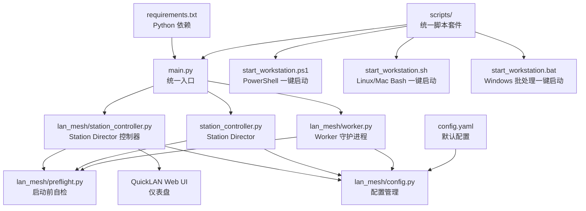

# 快速开始

<cite>
**本文引用的文件**
- [main.py](file://main.py)
- [requirements.txt](file://requirements.txt)
- [config.yaml](file://config.yaml)
- [scripts/start_workstation.bat](file://scripts/start_workstation.bat)
- [scripts/start_workstation.ps1](file://scripts/start_workstation.ps1)
- [scripts/start_workstation.sh](file://scripts/start_workstation.sh)
- [lan_mesh/station_controller.py](file://lan_mesh/station_controller.py)
- [station_controller.py](file://lan_mesh/station_controller.py)
- [lan_mesh/worker.py](file://lan_mesh/worker.py)
- [lan_mesh/config.py](file://lan_mesh/config.py)
- [lan_mesh/preflight.py](file://lan_mesh/preflight.py)
</cite>

## 更新摘要
**变更内容**
- 从多脚本架构简化为单一统一脚本系统
- 新增国际化编码支持，解决 GBK 编码崩溃问题
- 引入 Station Director 作为统一入口，替代传统的 Secretary/Worker 分离架构
- 增强跨平台脚本套件，支持一键化环境搭建和节点启动
- 新增模型池配置支持和 API Key 环境变量检测

## 目录
1. [简介](#简介)
2. [项目结构](#项目结构)
3. [环境要求](#环境要求)
4. [安装步骤](#安装步骤)
5. [使用统一脚本套件](#使用统一脚本套件)
6. [启动 Station Director](#启动-station-director)
7. [启动 Worker 节点](#启动-worker-节点)
8. [配置文件说明](#配置文件说明)
9. [首次运行验证](#首次运行验证)
10. [常见问题与解决方案](#常见问题与解决方案)
11. [架构概览](#架构概览)
12. [结论](#结论)

## 简介
Work Station 是一个基于局域网的分布式主机管理与文件共享框架，采用全新的 Station Director 统一入口架构。系统通过 UDP 广播进行设备发现，通过 HTTP API 进行注册与心跳，提供 Web UI 仪表盘用于可视化管理。项目同时包含一个配套的桌面应用 QuickLAN，用于跨平台的本地文件共享与传输。

**更新** 项目已从传统的 Secretary/Worker 分离架构升级为统一的 Station Director 架构，通过单一入口提供完整的基础设施管理能力，并支持动态激活 Secretary 模式。

## 项目结构
项目采用分层组织方式：
- 核心 Python 包：lan_mesh，包含 Station Director、Secretary 控制器、Worker 守护进程、发现服务、数据库、共享文件夹管理等
- 统一入口脚本：main.py，支持 station、secretary、worker 三种角色
- 开发脚本：scripts/ 目录下的统一 PowerShell、Bash 和批处理脚本，提供一键化环境搭建和节点启动
- 配置：config.yaml，默认配置文件
- 依赖：requirements.txt，Python 依赖清单



**图表来源**
- [main.py:1-98](file://main.py#L1-L98)
- [lan_mesh/station_controller.py:1-200](file://lan_mesh/station_controller.py#L1-L200)
- [station_controller.py](file://lan_mesh/station_controller.py#L1-L200)
- [lan_mesh/worker.py:1-200](file://lan_mesh/worker.py#L1-L200)
- [lan_mesh/config.py:1-159](file://lan_mesh/config.py#L1-L159)
- [lan_mesh/preflight.py:1-200](file://lan_mesh/preflight.py#L1-L200)
- [scripts/start_workstation.ps1:1-149](file://scripts/start_workstation.ps1#L1-L149)
- [scripts/start_workstation.sh:1-164](file://scripts/start_workstation.sh#L1-L164)
- [scripts/start_workstation.bat:1-93](file://scripts/start_workstation.bat#L1-L93)

**章节来源**
- [main.py:1-98](file://main.py#L1-L98)
- [lan_mesh/station_controller.py:1-200](file://lan_mesh/station_controller.py#L1-L200)
- [station_controller.py](file://lan_mesh/station_controller.py#L1-L200)
- [lan_mesh/worker.py:1-200](file://lan_mesh/worker.py#L1-L200)
- [lan_mesh/config.py:1-159](file://lan_mesh/config.py#L1-L159)
- [lan_mesh/preflight.py:1-200](file://lan_mesh/preflight.py#L1-L200)

## 环境要求
- Python 版本：3.10+（注意：自检模块要求 Python 版本不低于 3.10）
- Python 依赖：通过 requirements.txt 安装
- 网络：需要可用的非回环 IPv4 网络接口
- 权限：对数据目录（~/.lan_mesh）和共享文件夹具有读写权限
- 端口：UDP 45454（发现），HTTP 端口（默认 45470）

**更新** 新增了国际化编码支持，通过设置 PYTHONUTF8 和 PYTHONIOENCODING 环境变量解决 GBK 编码崩溃问题。

注意：虽然文档目标提到 Python 3.8+，但实际代码要求 Python 3.10+。建议使用 Python 3.11 或更高版本以确保兼容性。

**章节来源**
- [lan_mesh/preflight.py:63-69](file://lan_mesh/preflight.py#L63-L69)
- [requirements.txt:1-9](file://requirements.txt#L1-L9)
- [scripts/start_workstation.ps1:18-22](file://scripts/start_workstation.ps1#L18-L22)
- [scripts/start_workstation.sh:51-64](file://scripts/start_workstation.sh#L51-L64)
- [scripts/start_workstation.bat:17-27](file://scripts/start_workstation.bat#L17-L27)

## 安装步骤
### 方法一：使用统一脚本套件（推荐）
1. 克隆仓库
   ```bash
   git clone <repository-url>
   cd work_station
   ```

2. 运行一键启动脚本
   - Windows PowerShell：
     ```powershell
     .\scripts\start_workstation.ps1
     ```
   - Linux/Mac Bash：
     ```bash
     bash scripts/start_workstation.sh
     ```
   - Windows 批处理：
     ```cmd
     scripts\start_workstation.bat
     ```

3. 环境初始化完成后，编辑模型池配置文件
   ```bash
   # 编辑 lan_mesh/model_pool.yaml 配置 API Key
   # 设置环境变量（可选）
   export DEEPSEEK_API_KEY="sk-xxx"
   export OPENAI_API_KEY="sk-xxx"
   ```

### 方法二：手动安装
1. 克隆仓库
   ```bash
   git clone <repository-url>
   cd work_station
   ```

2. 安装 Python 依赖
   ```bash
   pip install -r requirements.txt
   ```

3. 验证依赖安装
   ```bash
   python -c "import fastapi, uvicorn, psutil, pydantic, yaml, requests, multipart"
   ```

4. 准备配置文件
   - 默认配置文件位于项目根目录的 config.yaml
   - 也可放置在用户目录 ~/.lan_mesh/config.yaml
   - 系统会按以下顺序查找配置文件：显式指定 > 环境变量 > 用户目录 > 项目根目录

5. 准备共享文件夹
   - 默认共享文件夹为 ~/lan_mesh_shared
   - 确保该目录存在且可写
   - Station Director、Secretary 和 Worker 都会创建该目录

**更新** 新增了统一的脚本套件，提供一键化环境搭建体验。脚本会自动创建虚拟环境、安装依赖并复制配置模板，同时支持国际化编码设置。

**章节来源**
- [scripts/start_workstation.ps1:34-149](file://scripts/start_workstation.ps1#L34-L149)
- [scripts/start_workstation.sh:51-164](file://scripts/start_workstation.sh#L51-L164)
- [scripts/start_workstation.bat:17-93](file://scripts/start_workstation.bat#L17-L93)
- [requirements.txt:1-9](file://requirements.txt#L1-L9)
- [config.yaml:1-22](file://config.yaml#L1-L22)
- [lan_mesh/config.py:92-117](file://lan_mesh/config.py#L92-L117)

## 使用统一脚本套件
**更新** 项目已从多脚本架构简化为单一统一脚本系统，提供跨平台的一键化操作体验。

### 统一启动脚本
- Windows PowerShell：`.\scripts\start_workstation.ps1`
- Linux/Mac Bash：`bash scripts/start_workstation.sh`
- Windows 批处理：`scripts\start_workstation.bat`

功能特性：
1. 自动检查 Python 版本（3.10+）
2. 自动创建虚拟环境（.venv）
3. 自动安装 Python 依赖
4. 自动复制模型池配置模板
5. 设置国际化编码环境变量
6. 支持一键启动 Station Director 和可选的本地 Worker

### 参数支持
所有脚本都支持以下通用参数：
- `--port` 或 `-p`：指定 API 端口（默认 45470）
- `--name` 或 `-n`：指定设备名称
- `--config` 或 `-c`：指定配置文件路径
- `--shared`：指定共享文件夹路径
- `--with-worker`：同时启动本地 Worker 节点
- `--worker-port`：指定 Worker 端口（默认 45460）

示例：
```powershell
# Windows PowerShell
.\scripts\start_workstation.ps1 --port 8080 --name "控制中心" --with-worker
```

```bash
# Linux/Mac Bash
bash scripts/start_workstation.sh --port 8080 --name "控制中心" --with-worker --worker-port 45461
```

```cmd
# Windows 批处理
scripts\start_workstation.bat
```

**章节来源**
- [scripts/start_workstation.ps1:1-149](file://scripts/start_workstation.ps1#L1-L149)
- [scripts/start_workstation.sh:1-164](file://scripts/start_workstation.sh#L1-L164)
- [scripts/start_workstation.bat:1-93](file://scripts/start_workstation.bat#L1-L93)

## 启动 Station Director
Station Director 作为统一入口，负责：
- 启动 Web UI 仪表盘
- 管理数据库（SQLite）
- 广播自身存在
- 接收 Worker 注册与心跳
- 定期清理离线设备
- 支持动态激活 Secretary 模式

### 使用统一脚本套件
```powershell
# Windows PowerShell
.\scripts\start_workstation.ps1 --port 8080 --name "控制中心"

# Linux/Mac Bash
bash scripts/start_workstation.sh --port 8080 --name "控制中心"

# Windows 批处理
scripts\start_workstation.bat
```

启动流程：
1. 设置国际化编码环境变量（PYTHONUTF8=1, PYTHONIOENCODING=utf-8）
2. 自检（Python 版本、依赖、配置、网络、端口等）
3. 生成设备 ID
4. 初始化数据库
5. 采集主机信息
6. 创建共享文件夹
7. 启动 FastAPI（含 Web UI）
8. 启动 UDP 发现服务
9. 启动后台任务（配置刷新、离线清理、WebSocket 推送）

### 使用传统方法
启动命令：
```bash
python main.py station
```

常用参数：
- `--port` 或 `-p`：指定 API 端口（默认 45470）
- `--name` 或 `-n`：指定设备名称
- `--shared`：指定共享文件夹路径
- `--config` 或 `-c`：指定配置文件路径

示例：
```bash
python main.py station --port 8080 --name "控制中心"
```

**更新** 新增了国际化编码支持，通过设置环境变量避免 GBK 编码崩溃问题。脚本套件会自动配置 UTF-8 编码环境。

**章节来源**
- [main.py:26-98](file://main.py#L26-L98)
- [lan_mesh/station_controller.py:71-200](file://lan_mesh/station_controller.py#L71-L200)
- [lan_mesh/preflight.py:33-46](file://lan_mesh/preflight.py#L33-L46)
- [scripts/start_workstation.ps1:18-22](file://scripts/start_workstation.ps1#L18-L22)
- [scripts/start_workstation.sh:119-131](file://scripts/start_workstation.sh#L119-L131)
- [scripts/start_workstation.bat:3-6](file://scripts/start_workstation.bat#L3-L6)

## 启动 Worker 节点
Worker 节点负责：
- 采集本机配置信息
- 创建并暴露共享文件夹
- 广播自身存在
- 向 Station Director 注册并发送心跳
- 提供 HTTP API 供 Station Director 查询

### 使用统一脚本套件
```powershell
# Windows PowerShell
.\scripts\start_workstation.ps1 --with-worker --worker-port 45461

# Linux/Mac Bash
bash scripts/start_workstation.sh --with-worker --worker-port 45461

# Windows 批处理
# 在脚本中直接启动
```

### 使用传统方法
启动命令：
```bash
python main.py worker
```

常用参数：
- `--port` 或 `-p`：指定 API 端口（默认 45460）
- `--name` 或 `-n`：指定设备名称
- `--shared`：指定共享文件夹路径
- `--config` 或 `-c`：指定配置文件路径

示例：
```bash
python main.py worker --shared /data/shared --name "计算节点-01"
```

启动流程：
1. 自检（Python 版本、依赖、配置、网络、端口等）
2. 生成设备 ID
3. 采集主机信息
4. 创建共享文件夹
5. 启动 FastAPI
6. 启动 UDP 发现服务
7. 发现 Station Director 后注册
8. 启动心跳循环

**更新** 脚本套件提供了跨平台的一致启动体验，包含自动虚拟环境检测、参数处理和国际化编码设置。

**章节来源**
- [main.py:26-98](file://main.py#L26-L98)
- [lan_mesh/worker.py:68-200](file://lan_mesh/worker.py#L68-L200)
- [lan_mesh/preflight.py:33-46](file://lan_mesh/preflight.py#L33-L46)
- [scripts/start_workstation.ps1:138-149](file://scripts/start_workstation.ps1#L138-L149)
- [scripts/start_workstation.sh:153-164](file://scripts/start_workstation.sh#L153-L164)

## 配置文件说明
配置文件采用 YAML 格式，支持多处查找与合并：

位置查找顺序：
1. 显式指定的配置文件路径
2. 环境变量 LAN_MESH_CONFIG
3. ~/.lan_mesh/config.yaml
4. ./config.yaml

主要配置项：
- discovery（发现配置）
  - port：UDP 广播端口（默认 45454）
  - presence_interval：广播间隔（秒，默认 3）
  - device_ttl：设备离线判定阈值（秒，默认 12）

- worker（Worker 节点配置）
  - api_port：HTTP API 端口（默认 45460）
  - shared_folder：共享文件夹路径（默认 ~/lan_mesh_shared）
  - device_name：设备名称（留空则自动使用主机名）

- secretary（Secretary 节点配置）
  - api_port：HTTP API + Web UI 端口（默认 45470）
  - shared_folder：共享文件夹路径（默认 ~/lan_mesh_shared）
  - device_name：设备名称（留空则自动使用 hostname-secretary）
  - db_path：数据库文件路径（默认 ~/.lan_mesh/secretary.sqlite3）

路径展开规则：
- 支持 ~ 和环境变量展开
- 使用 os.path.expanduser 和 os.path.expandvars

**更新** 新增了模型池配置支持，用于高级功能的配置管理。脚本会自动检测并复制模型池配置模板。

**章节来源**
- [config.yaml:1-22](file://config.yaml#L1-L22)
- [lan_mesh/config.py:92-159](file://lan_mesh/config.py#L92-L159)

## 首次运行验证
1. 启动 Station Director
   - 查看控制台输出，确认 Web UI 地址
   - 默认端口 45470，可通过 http://localhost:45470 访问
   - 确认显示等待 Worker 节点注册

2. 启动 Worker 节点
   - 查看控制台输出，确认注册成功
   - Worker 会自动向 Station Director 发送注册请求
   - Station Director 仪表盘应显示 Worker 设备信息

3. 验证功能
   - 在 Station Director 仪表盘查看 Worker 列表
   - 检查共享文件夹同步
   - 验证心跳机制（每 3 秒一次）

4. 常见验证点
   - 端口占用：确保 45454（UDP）、45460/45470（TCP）未被占用
   - 网络连通：确保同一局域网内设备可达
   - 文件夹权限：确保共享文件夹可读写
   - 编码支持：确认控制台输出中文不出现乱码

**更新** 新增了国际化编码验证，确保中文输出正常显示。

**章节来源**
- [lan_mesh/station_controller.py:190-200](file://lan_mesh/station_controller.py#L190-L200)
- [lan_mesh/worker.py:150-160](file://lan_mesh/worker.py#L150-L160)

## 常见问题与解决方案
1. Python 版本错误
   - 现象：启动时报错，提示 Python 版本过低
   - 解决：升级到 Python 3.10 或更高版本
   - 检查：python --version 或 python3 --version
   - **更新** 脚本套件会自动检查 Python 版本并给出明确提示

2. 依赖安装失败
   - 现象：ImportError 或 ModuleNotFoundError
   - 解决：重新安装依赖
   - 命令：pip install -r requirements.txt
   - **更新** 统一脚本套件会自动安装所有依赖

3. 端口被占用
   - 现象：UDP 端口 45454 被占用或 HTTP 端口被占用
   - 解决：修改配置文件中的端口号，或释放占用端口
   - 检查：netstat -an | grep 45454
   - **更新** 脚本套件会自动检测端口占用情况

4. 网络接口不可用
   - 现象：找不到可用的非回环网络接口
   - 解决：确保有有效的网络连接
   - 检查：psutil.net_if_addrs()

5. 权限不足
   - 现象：无法创建 ~/.lan_mesh 目录或共享文件夹
   - 解决：授予相应目录的读写权限
   - 命令：chmod -R 755 ~/.lan_mesh

6. 配置文件缺失
   - 现象：系统无法找到配置文件
   - 解决：创建 config.yaml 或设置 LAN_MESH_CONFIG 环境变量
   - 建议：使用默认配置文件作为起点

7. Station Director 仪表盘空白
   - 现象：Web UI 页面显示为空或报错
   - 解决：确认 dashboard.html 模板文件存在
   - 检查：lan_mesh/web/templates/dashboard.html

8. **国际化编码问题**（新增）
   - 现象：控制台输出中文出现乱码或 GBK 崩溃
   - 解决：脚本会自动设置 PYTHONUTF8=1 和 PYTHONIOENCODING=utf-8
   - 验证：确认中文输出正常显示

9. **脚本执行权限问题**（新增）
   - 现象：Windows PowerShell 报告脚本无法执行
   - 解决：调整执行策略
   - 命令：Set-ExecutionPolicy -ExecutionPolicy RemoteSigned -Scope CurrentUser
   - **更新** 统一脚本套件包含详细的错误处理和用户指导

10. **Linux/Mac Bash 权限问题**（新增）
    - 现象：Bash 脚本无法执行
    - 解决：添加执行权限
    - 命令：chmod +x scripts/start_workstation.sh
    - **更新** 统一脚本套件会在创建后自动设置执行权限

**更新** 新增了国际化编码支持和统一脚本套件相关的故障排除指南。

**章节来源**
- [lan_mesh/preflight.py:63-69](file://lan_mesh/preflight.py#L63-L69)
- [lan_mesh/preflight.py:183-199](file://lan_mesh/preflight.py#L183-L199)
- [scripts/start_workstation.ps1:18-22](file://scripts/start_workstation.ps1#L18-L22)
- [scripts/start_workstation.sh:119-131](file://scripts/start_workstation.sh#L119-L131)

## 架构概览
系统采用统一的 Station Director 架构，核心组件包括：

```mermaid
graph TB
subgraph "Station Director 统一入口"
S1["StationController<br/>统一控制器"]
S2["FastAPI 应用<br/>Web UI + API"]
S3["DiscoveryService<br/>UDP 发现"]
S4["Database<br/>SQLite"]
S5["SharedFolderManager<br/>共享文件夹"]
S6["SkillRegistry<br/>技能注册表"]
S7["BotGateway<br/>Bot 通道"]
end
subgraph "Secretary 模式"
SC1["SecretaryController<br/>Secretary 控制器"]
SC2["ProjectManager<br/>项目管理器"]
SC3["ModelRouter<br/>模型路由器"]
SC4["MCPGateway<br/>MCP 工具网关"]
SC5["ChatHandler<br/>聊天处理器"]
end
subgraph "Worker 节点"
W1["WorkerAgent<br/>Worker 守护进程"]
W2["FastAPI 应用<br/>HTTP API"]
W3["DiscoveryService<br/>UDP 发现"]
W4["SharedFolderManager<br/>共享文件夹"]
end
subgraph "公共组件"
C1["ConfigManager<br/>配置管理"]
C2["HostInfoCollector<br/>主机信息采集"]
C3["Protocol<br/>通信协议"]
end
subgraph "统一脚本套件"
U1["start_workstation.ps1<br/>PowerShell 一键启动"]
U2["start_workstation.sh<br/>Linux/Mac Bash 一键启动"]
U3["start_workstation.bat<br/>Windows 批处理一键启动"]
end
S1 --> S2
S1 --> S3
S1 --> S4
S1 --> S5
S1 --> S6
S1 --> S7
S1 --> C1
S1 --> C2
S1 --> C3
SC1 --> SC2
SC1 --> SC3
SC1 --> SC4
SC1 --> SC5
SC1 --> C1
SC1 --> C2
SC1 --> C3
W1 --> W2
W1 --> W3
W1 --> W4
W1 --> C1
W1 --> C2
W1 --> C3
S3 < --> W3
S2 < --> W2
U1 --> U2
U1 --> U3
U2 --> U3
```

**更新** 新增了统一的 Station Director 架构图，展示从传统分离架构到统一入口的演进过程，包含 Secretary 模式的动态激活能力和统一脚本套件的支持。

**图表来源**
- [lan_mesh/station_controller.py:71-200](file://lan_mesh/station_controller.py#L71-L200)
- [station_controller.py](file://lan_mesh/station_controller.py#L69-L200)
- [lan_mesh/worker.py:68-200](file://lan_mesh/worker.py#L68-L200)
- [lan_mesh/config.py:79-159](file://lan_mesh/config.py#L79-L159)
- [scripts/start_workstation.ps1:1-149](file://scripts/start_workstation.ps1#L1-L149)
- [scripts/start_workstation.sh:1-164](file://scripts/start_workstation.sh#L1-L164)
- [scripts/start_workstation.bat:1-93](file://scripts/start_workstation.bat#L1-L93)

## 结论
Work Station 提供了一个完整的局域网分布式主机管理解决方案。通过简化的统一入口架构和一键化脚本套件，用户可以在 15 分钟内完成环境搭建并看到效果。系统具备完善的自检机制、灵活的配置管理、国际化的编码支持以及直观的 Web UI 仪表盘，适合在企业内部网络环境中部署使用。

**更新** 新增的统一脚本套件大幅简化了开发环境搭建流程，提供了跨平台的一致体验。国际化编码支持解决了中文输出乱码问题，统一入口架构替代了传统的分离模式，提供了更简洁的管理界面。建议在生产环境中：
- 使用稳定的网络环境
- 合理规划端口分配
- 定期备份数据库
- 监控 Worker 心跳状态
- 设置合适的设备 TTL 值
- **优先使用统一脚本套件进行环境管理和节点启动**
- **Linux/Mac 用户确保脚本具有执行权限**
- **确认国际化编码设置正确**
