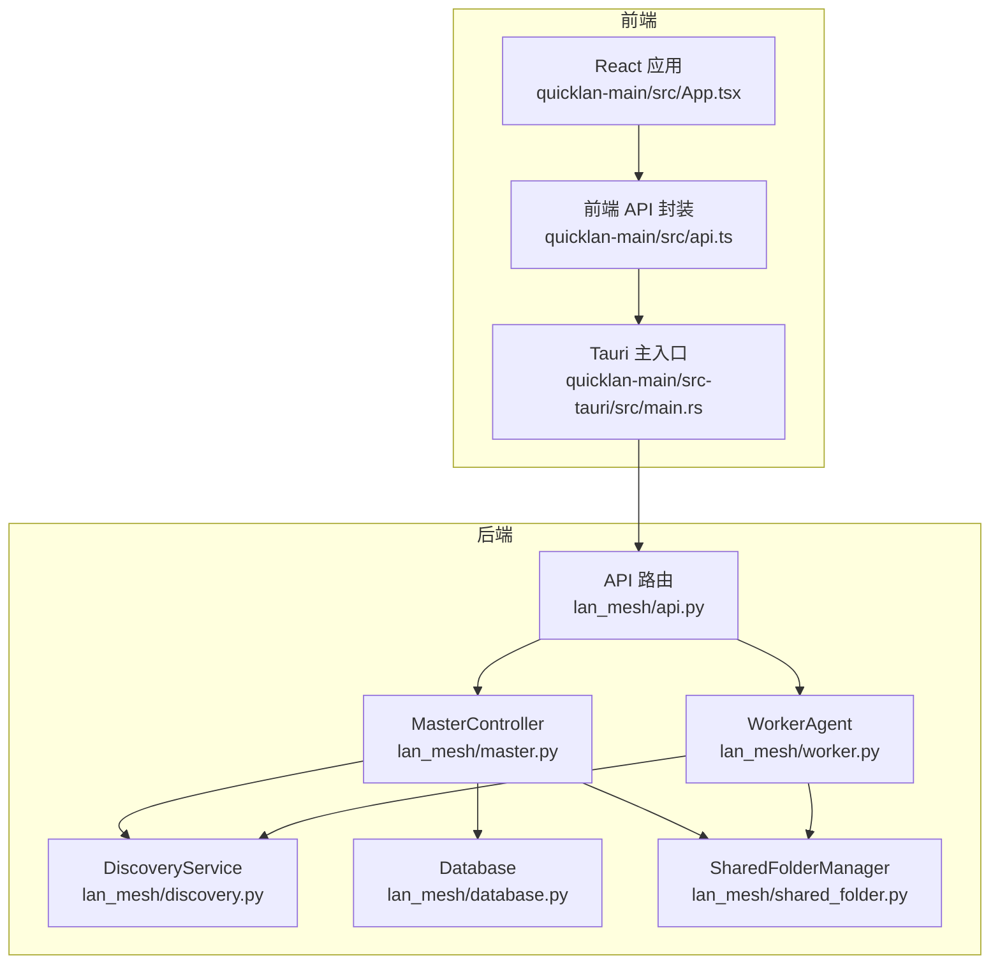
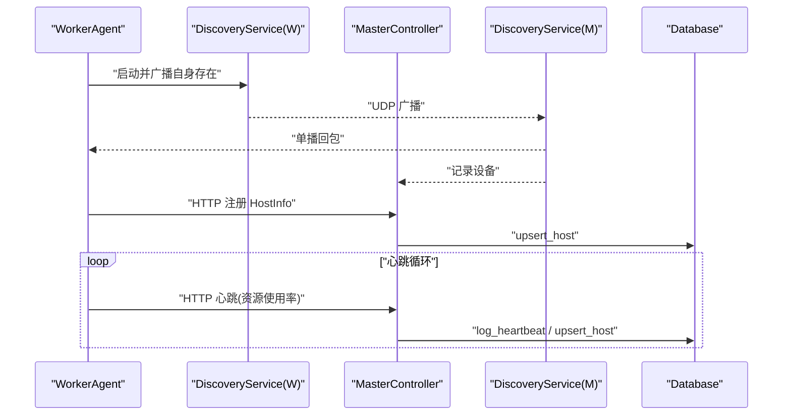
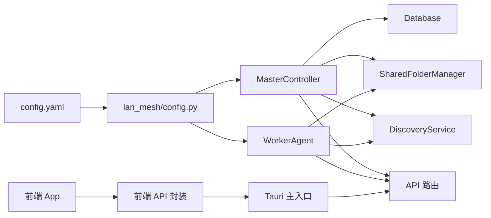

# 故障排除

<cite>
**本文引用的文件**
- [main.py](file://main.py)
- [config.yaml](file://config.yaml)
- [lan_mesh/config.py](file://lan_mesh/config.py)
- [lan_mesh/preflight.py](file://lan_mesh/preflight.py)
- [lan_mesh/discovery.py](file://lan_mesh/discovery.py)
- [lan_mesh/api.py](file://lan_mesh/api.py)
- [lan_mesh/master.py](file://lan_mesh/master.py)
- [lan_mesh/worker.py](file://lan_mesh/worker.py)
- [lan_mesh/database.py](file://lan_mesh/database.py)
- [lan_mesh/shared_folder.py](file://lan_mesh/shared_folder.py)
- [quicklan-main/src/App.tsx](file://quicklan-main/src/App.tsx)
- [quicklan-main/src/api.ts](file://quicklan-main/src/api.ts)
- [quicklan-main/src/main.tsx](file://quicklan-main/src/main.tsx)
- [quicklan-main/src-tauri/src/main.rs](file://quicklan-main/src-tauri/src/main.rs)
</cite>

## 目录
1. [简介](#简介)
2. [项目结构](#项目结构)
3. [核心组件](#核心组件)
4. [架构总览](#架构总览)
5. [详细组件分析](#详细组件分析)
6. [依赖分析](#依赖分析)
7. [性能考虑](#性能考虑)
8. [故障排除指南](#故障排除指南)
9. [结论](#结论)
10. [附录](#附录)

## 简介
本指南面向 LAN Mesh 系统的运维与开发人员，聚焦于常见问题的系统化诊断与解决：包括网络连接问题、设备发现失败、文件传输异常、性能瓶颈识别与优化、跨平台差异、监控与告警建议、以及紧急情况的处理与恢复流程。文档结合代码实现与配置文件，提供可操作的排查步骤与定位技巧。

## 项目结构
LAN Mesh 由 Python 后端与 Tauri 前端组成：
- 后端（Python）：负责 Master/Worker 节点、UDP 发现、HTTP API、数据库、共享文件夹、任务与项目管理等。
- 前端（React + Tauri）：提供桌面端 GUI，通过 Tauri 命令桥接后端能力，支持设备发现、文件快传、共享管理、传输状态等。

**图示来源**
- [lan_mesh/master.py:67-324](file://lan_mesh/master.py#L67-L324)
- [lan_mesh/worker.py:62-325](file://lan_mesh/worker.py#L62-L325)
- [lan_mesh/discovery.py:33-259](file://lan_mesh/discovery.py#L33-L259)
- [lan_mesh/api.py:1-539](file://lan_mesh/api.py#L1-L539)
- [lan_mesh/database.py:16-611](file://lan_mesh/database.py#L16-L611)
- [lan_mesh/shared_folder.py:16-219](file://lan_mesh/shared_folder.py#L16-L219)
- [quicklan-main/src/App.tsx:1-1170](file://quicklan-main/src/App.tsx#L1-L1170)
- [quicklan-main/src/api.ts:1-130](file://quicklan-main/src/api.ts#L1-L130)
- [quicklan-main/src-tauri/src/main.rs:1-6](file://quicklan-main/src-tauri/src/main.rs#L1-L6)

**章节来源**
- [main.py:1-90](file://main.py#L1-L90)
- [config.yaml:1-22](file://config.yaml#L1-L22)
- [lan_mesh/config.py:1-84](file://lan_mesh/config.py#L1-L84)

## 核心组件
- Master 控制器：负责设备注册、心跳、持久化、Web UI、任务与项目管理、MCP 网关集成。
- Worker 代理：负责本机信息采集、共享文件夹、UDP 发现、HTTP 注册与心跳、任务执行。
- DiscoveryService：基于 UDP 的局域网发现与设备列表维护。
- Database：SQLite 存储主机、心跳、Agent、任务、项目与用量日志。
- SharedFolderManager：共享目录的创建、列举、上传下载与配置报告生成。
- API 路由：统一暴露 Master/Worker 的 REST 与 WebSocket 接口。
- 前端应用：通过 Tauri 命令桥接后端，提供设备发现、文件快传、共享管理等交互。

**章节来源**
- [lan_mesh/master.py:67-324](file://lan_mesh/master.py#L67-L324)
- [lan_mesh/worker.py:62-325](file://lan_mesh/worker.py#L62-L325)
- [lan_mesh/discovery.py:33-259](file://lan_mesh/discovery.py#L33-L259)
- [lan_mesh/api.py:1-539](file://lan_mesh/api.py#L1-L539)
- [lan_mesh/database.py:16-611](file://lan_mesh/database.py#L16-L611)
- [lan_mesh/shared_folder.py:16-219](file://lan_mesh/shared_folder.py#L16-L219)

## 架构总览
系统采用“Master/Worker”集中式控制与去中心化发现相结合的模式：
- Master 作为控制中心与 Web UI，Worker 作为被调度的执行节点。
- UDP 广播用于设备发现与互相告知，HTTP API 用于注册、心跳、文件共享与任务编排。
- 数据持久化于 SQLite，WebSocket 实时推送状态变化。

**图示来源**
- [lan_mesh/worker.py:126-216](file://lan_mesh/worker.py#L126-L216)
- [lan_mesh/discovery.py:139-214](file://lan_mesh/discovery.py#L139-L214)
- [lan_mesh/api.py:116-168](file://lan_mesh/api.py#L116-L168)
- [lan_mesh/database.py:147-201](file://lan_mesh/database.py#L147-L201)

## 详细组件分析

### Master 控制器
- 职责：设备注册、心跳、持久化、Web UI、任务与项目管理、MCP 网关、共享文件夹与配置报告。
- 关键流程：启动前自检、UDP 发现、定时清理离线设备、WebSocket 推送、FastAPI 服务。
- 异常点：端口冲突（自动寻找可用端口）、数据库不可写、模板缺失、共享目录不可写。

**章节来源**
- [lan_mesh/master.py:67-324](file://lan_mesh/master.py#L67-L324)
- [lan_mesh/preflight.py:226-290](file://lan_mesh/preflight.py#L226-L290)
- [lan_mesh/database.py:16-144](file://lan_mesh/database.py#L16-L144)

### Worker 代理
- 职责：本机信息采集、共享文件夹、UDP 发现、HTTP 注册与心跳、任务执行。
- 关键流程：启动前自检、UDP 发现 Master、注册 HostInfo 与 Agent Card、心跳循环。
- 异常点：Master 地址未发现、HTTP 注册失败、心跳失败、共享目录不可写。

**章节来源**
- [lan_mesh/worker.py:62-325](file://lan_mesh/worker.py#L62-L325)
- [lan_mesh/preflight.py:226-290](file://lan_mesh/preflight.py#L226-L290)

### DiscoveryService（UDP 发现）
- 职责：广播自身存在、监听其他设备、清理超时设备、网络状态查询。
- 关键点：端口绑定失败降级、广播目标计算、单播回包、设备列表快照。
- 异常点：UDP 端口占用、权限不足、网络接口不可用。

**章节来源**
- [lan_mesh/discovery.py:33-259](file://lan_mesh/discovery.py#L33-L259)
- [lan_mesh/preflight.py:168-184](file://lan_mesh/preflight.py#L168-L184)

### API 路由与 WebSocket
- Master API：注册、心跳、主机列表、网络状态、发现设备、探活、Agent 管理、任务与项目管理、MCP 工具网关、WebSocket 推送。
- Worker API：本机信息、共享文件列表/下载/上传、任务执行端点。
- 异常点：404 未注册、503 未初始化、WebSocket 断连清理。

**章节来源**
- [lan_mesh/api.py:1-539](file://lan_mesh/api.py#L1-L539)

### 数据库与共享文件夹
- Database：线程安全连接、表结构初始化、心跳日志、主机/Agent/任务/项目/用量日志 CRUD。
- SharedFolderManager：目录创建、文件列举、安全路径解析、上传保存、配置报告生成。
- 异常点：目录不可写、路径越界、文件不存在、权限错误。

**章节来源**
- [lan_mesh/database.py:16-611](file://lan_mesh/database.py#L16-L611)
- [lan_mesh/shared_folder.py:16-219](file://lan_mesh/shared_folder.py#L16-L219)

### 前端与命令桥接
- React 应用通过 Tauri 命令调用后端能力，如设备发现、文件快传、共享管理、传输状态等。
- 异常点：命令未注册、IPC 失败、事件监听断开。

**章节来源**
- [quicklan-main/src/App.tsx:1-1170](file://quicklan-main/src/App.tsx#L1-L1170)
- [quicklan-main/src/api.ts:1-130](file://quicklan-main/src/api.ts#L1-L130)
- [quicklan-main/src-tauri/src/main.rs:1-6](file://quicklan-main/src-tauri/src/main.rs#L1-L6)

## 依赖分析
- 配置来源：config.yaml → AppConfig（Pydantic 校验）→ 各组件读取。
- 启动前自检：Python 版本、依赖、配置文件、数据目录、共享目录、网络接口、UDP 端口、API 端口、Master 专属数据库与模板。
- 组件耦合：Master/Worker 通过 DiscoveryService 与 HTTP API 交互；Database 为 Master 端持久化中心；SharedFolderManager 为共享与配置报告载体。

**图示来源**
- [lan_mesh/config.py:48-84](file://lan_mesh/config.py#L48-L84)
- [lan_mesh/master.py:77-114](file://lan_mesh/master.py#L77-L114)
- [lan_mesh/worker.py:73-96](file://lan_mesh/worker.py#L73-L96)
- [lan_mesh/database.py:16-27](file://lan_mesh/database.py#L16-L27)
- [lan_mesh/shared_folder.py:23-37](file://lan_mesh/shared_folder.py#L23-L37)
- [lan_mesh/discovery.py:42-68](file://lan_mesh/discovery.py#L42-L68)
- [lan_mesh/api.py:103-112](file://lan_mesh/api.py#L103-L112)
- [quicklan-main/src/api.ts:1-130](file://quicklan-main/src/api.ts#L1-L130)
- [quicklan-main/src-tauri/src/main.rs:1-6](file://quicklan-main/src-tauri/src/main.rs#L1-L6)

**章节来源**
- [lan_mesh/config.py:48-84](file://lan_mesh/config.py#L48-L84)
- [lan_mesh/preflight.py:226-290](file://lan_mesh/preflight.py#L226-L290)

## 性能考虑
- 心跳与发现频率：Discovery 的 presence_interval 与 Worker/Master 的心跳间隔直接影响 CPU 与网络负载。
- 数据库写入：频繁 upsert_host 与 log_heartbeat，建议避免在高并发场景下同时大量设备心跳。
- 共享文件夹 IO：大文件上传/下载与大量小文件列举会带来 IO 压力，建议合理规划共享目录与缓存策略。
- 端口选择：API 端口被占用时会自动递增尝试，避免阻塞启动，但需关注端口范围与防火墙策略。
- WebSocket：客户端心跳与断连清理，避免长时间空闲连接占用资源。

[本节为通用性能建议，不直接分析具体文件]

## 故障排除指南

### 一、启动与环境问题
- 症状：启动即失败或提示致命检查项未通过。
- 排查步骤：
  1) 检查 Python 版本是否满足要求。
  2) 检查核心依赖是否安装齐全。
  3) 检查配置文件是否存在，若缺失会自动创建默认配置。
  4) 检查数据目录与共享目录是否可写。
  5) 检查网络接口是否存在可用的非回环 IPv4。
  6) 检查 UDP 发现端口是否可绑定。
  7) 检查 HTTP API 端口是否可用（Master/Worker 分别检查）。
  8) Master 专属：检查数据库目录可写与 Web UI 模板存在。
- 相关实现：
  - 启动前自检：[run_preflight:226-290](file://lan_mesh/preflight.py#L226-L290)
  - 配置加载与展开：[load_config:48-72](file://lan_mesh/config.py#L48-L72)、[get_shared_folder:75-78](file://lan_mesh/config.py#L75-L78)、[get_db_path:81-84](file://lan_mesh/config.py#L81-L84)
  - 端口占用与自动递增：[Master._find_available_port:225-234](file://lan_mesh/master.py#L225-L234)、[Worker._find_available_port:240-249](file://lan_mesh/worker.py#L240-L249)

**章节来源**
- [lan_mesh/preflight.py:226-290](file://lan_mesh/preflight.py#L226-L290)
- [lan_mesh/config.py:48-84](file://lan_mesh/config.py#L48-L84)
- [lan_mesh/master.py:225-234](file://lan_mesh/master.py#L225-L234)
- [lan_mesh/worker.py:240-249](file://lan_mesh/worker.py#L240-L249)

### 二、网络连接与设备发现失败
- 症状：Worker 无法发现 Master、设备列表为空、探活无效。
- 排查步骤：
  1) 检查 UDP 端口占用与权限（端口绑定失败会降级运行）。
  2) 检查网络接口是否可用（至少一个非回环 IPv4）。
  3) 使用 Master 的“主动探测 IP”功能验证网络可达性。
  4) 查看 Master 的 UDP 发现设备列表与 Worker 的发现状态。
  5) 检查防火墙是否放行 UDP 端口与 HTTP API 端口。
- 相关实现：
  - UDP 绑定与降级：[DiscoveryService._listen_loop:155-174](file://lan_mesh/discovery.py#L155-L174)
  - 网络状态查询：[DiscoveryService.network_status:128-135](file://lan_mesh/discovery.py#L128-L135)
  - Master 探测端点：[POST /api/probe/{ip}:236-240](file://lan_mesh/api.py#L236-L240)
  - 前端探测调用：[discoverIp:49-51](file://quicklan-main/src/api.ts#L49-L51)

**章节来源**
- [lan_mesh/discovery.py:128-174](file://lan_mesh/discovery.py#L128-L174)
- [lan_mesh/api.py:236-240](file://lan_mesh/api.py#L236-L240)
- [quicklan-main/src/api.ts:49-51](file://quicklan-main/src/api.ts#L49-L51)

### 三、设备注册与心跳异常
- 症状：Worker 注册失败、心跳失败、Master 侧看不到设备。
- 排查步骤：
  1) 确认 Worker 成功发现 Master 并记录其地址与端口。
  2) 检查 Worker 的注册与心跳 HTTP 请求是否成功（超时/4xx/5xx）。
  3) 检查 Master 的注册与心跳路由是否正常响应。
  4) 检查数据库是否可写，心跳日志是否写入。
  5) 检查 Master 的离线清理是否误判（device_ttl 设置）。
- 相关实现：
  - Worker 注册与心跳：[_register_with_master:126-146](file://lan_mesh/worker.py#L126-L146)、[_send_heartbeat:172-194](file://lan_mesh/worker.py#L172-L194)
  - Master 注册与心跳路由：[POST /api/register:116-146](file://lan_mesh/api.py#L116-L146)、[POST /api/heartbeat:148-168](file://lan_mesh/api.py#L148-L168)
  - 离线清理：[Database.prune_offline:272-280](file://lan_mesh/database.py#L272-L280)

**章节来源**
- [lan_mesh/worker.py:126-194](file://lan_mesh/worker.py#L126-L194)
- [lan_mesh/api.py:116-168](file://lan_mesh/api.py#L116-L168)
- [lan_mesh/database.py:272-280](file://lan_mesh/database.py#L272-L280)

### 四、文件传输异常
- 症状：共享文件列表为空、下载 404、上传失败、路径越界。
- 排查步骤：
  1) 检查共享目录是否存在且可写。
  2) 检查文件路径是否越界（安全解析）。
  3) 检查文件是否存在与权限。
  4) 检查上传文件名清理与重名处理。
  5) 检查 Master/Worker 的共享文件夹路径一致性。
- 相关实现：
  - 共享文件夹安全解析与上传：[SharedFolderManager.resolve_path:88-94](file://lan_mesh/shared_folder.py#L88-L94)、[save_upload:103-118](file://lan_mesh/shared_folder.py#L103-L118)
  - 下载端点与 404/403：[GET /shared/{path}:71-84](file://lan_mesh/api.py#L71-L84)
  - 配置报告生成：[write_host_config:122-144](file://lan_mesh/shared_folder.py#L122-L144)

**章节来源**
- [lan_mesh/shared_folder.py:88-144](file://lan_mesh/shared_folder.py#L88-L144)
- [lan_mesh/api.py:71-84](file://lan_mesh/api.py#L71-L84)

### 五、性能问题识别与优化
- 识别手段：
  - 查看 Master/Worker 的心跳与资源使用率（CPU/Memory/Disk）。
  - 检查数据库心跳日志增长速度与清理策略。
  - 监控共享目录文件数量与 IO 压力。
- 优化建议：
  - 调整 Discovery presence_interval 与心跳间隔。
  - 合理设置 device_ttl，避免频繁离线/上线抖动。
  - 限制共享目录规模，分批上传/下载。
  - 使用 Master 的 WebSocket 推送减少轮询压力。

**章节来源**
- [lan_mesh/api.py:148-168](file://lan_mesh/api.py#L148-L168)
- [lan_mesh/database.py:282-289](file://lan_mesh/database.py#L282-L289)
- [lan_mesh/discovery.py:139-146](file://lan_mesh/discovery.py#L139-L146)

### 六、网络问题排查与防火墙配置
- 常见问题：UDP 端口被占用、Windows 防火墙拦截、Linux iptables 未放行。
- 排查步骤：
  1) 确认 UDP 端口（默认 45454）与 HTTP API 端口（Master 默认 45470，Worker 默认 45460）均可用。
  2) 在防火墙中放行 UDP 端口与 API 端口范围。
  3) 检查跨网段路由与广播目标可达性。
- 相关实现：
  - 端口检查与绑定：[preflight UDP/API 端口检查:168-198](file://lan_mesh/preflight.py#L168-L198)
  - 广播目标计算与发送：[DiscoveryService._broadcast_packet:231-242](file://lan_mesh/discovery.py#L231-L242)

**章节来源**
- [lan_mesh/preflight.py:168-198](file://lan_mesh/preflight.py#L168-L198)
- [lan_mesh/discovery.py:231-242](file://lan_mesh/discovery.py#L231-L242)

### 七、不同操作系统下的特定问题
- Windows：
  - UDP 端口绑定可能需要管理员权限；SO_REUSEPORT 不可用导致绑定失败时降级。
  - 防火墙默认拦截较多，需显式放行端口。
- Linux/macOS：
  - SO_REUSEPORT 可用，绑定更稳定；注意 SELinux/AppArmor 限制。
- macOS：
  - 网络接口命名与 IPv4/IPv6 叠加可能影响发现，建议固定 IPv4。

**章节来源**
- [lan_mesh/discovery.py:163-174](file://lan_mesh/discovery.py#L163-L174)

### 八、监控指标与告警配置
- 建议指标：
  - 设备在线数、离线数、新增设备数。
  - 心跳成功率、平均延迟、资源使用率（CPU/Mem/Disk）。
  - 共享文件数、共享目录容量、IO 吞吐。
  - 任务队列长度、完成/失败数、项目预算使用。
- 建议告警：
  - 设备长时间离线（超过 device_ttl）。
  - 心跳失败率持续升高。
  - 共享目录空间接近阈值。
  - 任务积压或失败率上升。

**章节来源**
- [lan_mesh/api.py:170-204](file://lan_mesh/api.py#L170-L204)
- [lan_mesh/database.py:194-201](file://lan_mesh/database.py#L194-L201)

### 九、紧急情况处理与恢复策略
- 紧急处理：
  - 停止 Master/Worker（Ctrl+C），检查日志与端口占用。
  - 清理共享目录中的异常文件，释放空间。
  - 临时提高日志级别定位异常请求。
- 恢复策略：
  - 重启 Master/Worker，触发自动端口递增与发现重连。
  - 清理数据库离线记录，重建索引。
  - 恢复配置文件与共享目录权限。

**章节来源**
- [lan_mesh/master.py:319-324](file://lan_mesh/master.py#L319-L324)
- [lan_mesh/worker.py:320-325](file://lan_mesh/worker.py#L320-L325)
- [lan_mesh/database.py:272-280](file://lan_mesh/database.py#L272-L280)

## 结论
通过系统化的启动前自检、网络与发现排查、注册与心跳验证、共享文件夹与数据库检查、以及性能与监控策略，可以高效定位并解决 LAN Mesh 的常见问题。建议在生产环境中启用完善的日志与告警，并定期审查配置与端口策略，确保系统稳定运行。

## 附录

### A. 常用命令与端口
- 启动 Master/Worker：[main:25-86](file://main.py#L25-L86)
- 默认端口：Discovery 45454、Master 45470、Worker 45460
- 配置文件位置：支持多候选路径，最终展开用户目录

**章节来源**
- [main.py:25-86](file://main.py#L25-L86)
- [config.yaml:1-22](file://config.yaml#L1-L22)
- [lan_mesh/config.py:48-72](file://lan_mesh/config.py#L48-L72)

### B. 前端交互与命令映射
- 前端通过 Tauri 命令调用后端能力，如设备发现、文件快传、共享管理等。
- 命令封装与调用示例：[api.ts:1-130](file://quicklan-main/src/api.ts#L1-L130)、[App.tsx 事件监听:144-178](file://quicklan-main/src/App.tsx#L144-L178)

**章节来源**
- [quicklan-main/src/api.ts:1-130](file://quicklan-main/src/api.ts#L1-L130)
- [quicklan-main/src/App.tsx:144-178](file://quicklan-main/src/App.tsx#L144-L178)