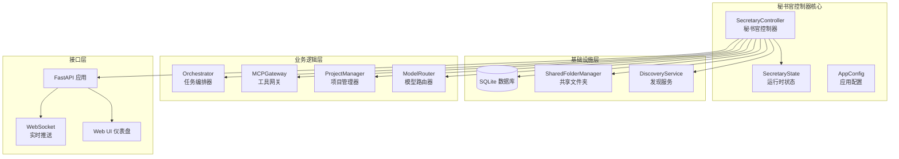
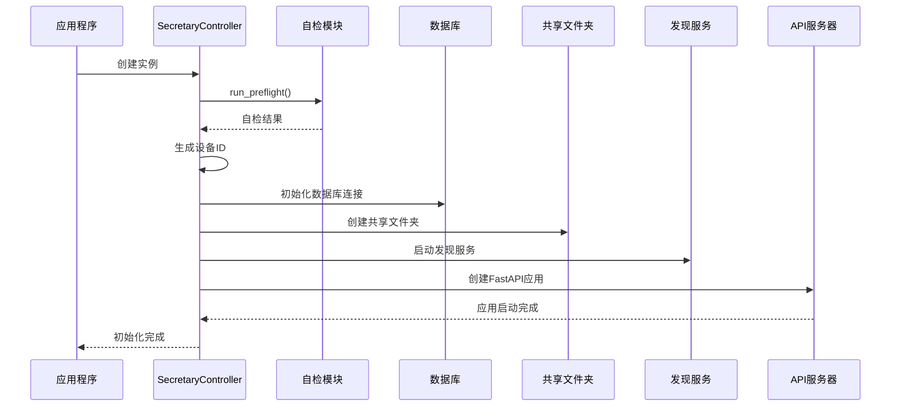
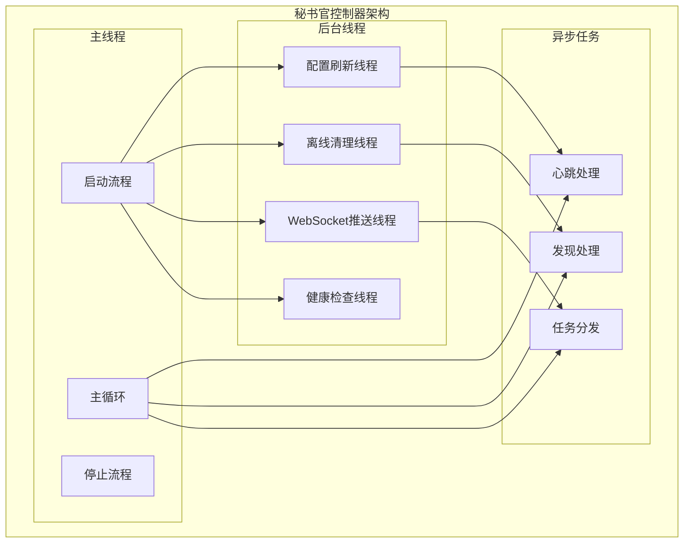
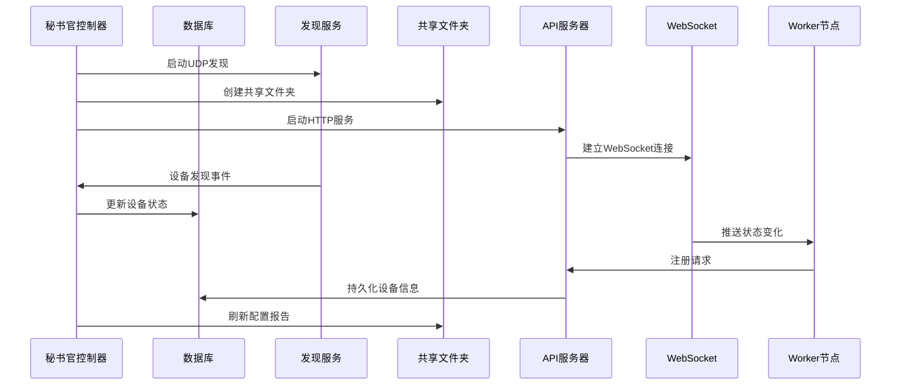
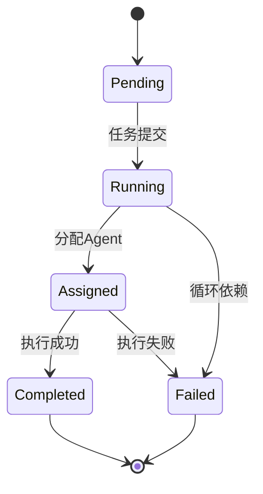
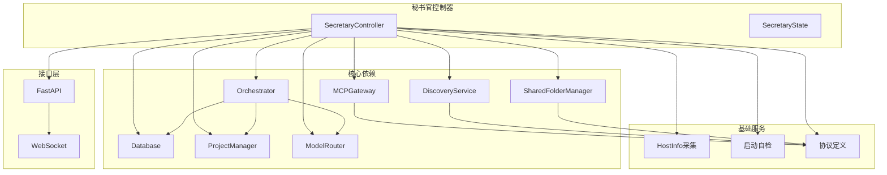

# 秘书官控制器

<cite>
**本文档引用的文件**
- [secretary.py](file://lan_mesh/secretary.py)
- [database.py](file://lan_mesh/database.py)
- [orchestrator.py](file://lan_mesh/orchestrator.py)
- [mcp_gateway.py](file://lan_mesh/mcp_gateway.py)
- [api.py](file://lan_mesh/api.py)
- [discovery.py](file://lan_mesh/discovery.py)
- [shared_folder.py](file://lan_mesh/shared_folder.py)
- [host_info.py](file://lan_mesh/host_info.py)
- [protocol.py](file://lan_mesh/protocol.py)
- [preflight.py](file://lan_mesh/preflight.py)
- [project.py](file://lan_mesh/project.py)
- [task.py](file://lan_mesh/task.py)
- [mcp_client.py](file://lan_mesh/mcp_client.py)
- [config.yaml](file://config.yaml)
- [dashboard.html](file://lan_mesh/web/templates/dashboard.html)
- [model_router.py](file://lan_mesh/model_router.py)
</cite>

## 更新摘要
**所做更改**
- 将所有 "Master 控制器" 相关术语更新为 "秘书官控制器"
- 更新架构图和组件关系以反映新的控制器名称
- 修改所有相关的类名、变量名和文档描述
- 更新启动流程和组件交互说明

## 目录
1. [简介](#简介)
2. [项目结构](#项目结构)
3. [核心组件](#核心组件)
4. [架构概览](#架构概览)
5. [详细组件分析](#详细组件分析)
6. [依赖关系分析](#依赖关系分析)
7. [性能考虑](#性能考虑)
8. [故障排除指南](#故障排除指南)
9. [结论](#结论)

## 简介

秘书官控制器是 LAN Mesh 分布式系统的核心协调节点，负责管理整个局域网内的设备发现、配置采集、资源共享和任务编排。作为中心节点，秘书官控制器承担着以下关键职责：

- **设备配置采集**：自动收集本机硬件配置信息，包括CPU、内存、磁盘、网络等详细信息
- **共享文件夹管理**：创建和维护共享文件目录，提供文件上传、下载和管理功能
- **UDP广播发现**：通过UDP广播协议实现设备自动发现和网络拓扑构建
- **HTTP API提供**：提供RESTful API接口，支持设备注册、心跳监控、任务管理等功能
- **Web UI仪表盘**：提供直观的Web界面，实时显示网络状态和设备信息
- **数据库集成**：持久化存储设备信息、任务状态和使用记录
- **任务编排**：协调分布式任务的分解、分配和执行
- **MCP工具网关**：统一管理各种外部工具和服务

## 项目结构

LAN Mesh 项目采用模块化设计，主要分为以下几个核心模块：

**图表来源**
- [secretary.py:68-332](file://lan_mesh/secretary.py#L68-L332)
- [database.py:16-611](file://lan_mesh/database.py#L16-L611)
- [api.py:103-539](file://lan_mesh/api.py#L103-L539)

**章节来源**
- [secretary.py:1-332](file://lan_mesh/secretary.py#L1-L332)
- [config.yaml:1-22](file://config.yaml#L1-L22)

## 核心组件

### SecretaryController 类

SecretaryController 是整个系统的主控制器，负责协调所有子系统的初始化和运行。

#### 核心属性
- **设备身份管理**：生成和维护设备ID，支持Secretary/Worker角色区分
- **数据目录管理**：自动创建和管理用户数据目录
- **组件生命周期**：协调各个子组件的启动和停止
- **运行时状态**：维护共享状态信息，包括WebSocket客户端连接

#### 初始化流程

**图表来源**
- [secretary.py:246-326](file://lan_mesh/secretary.py#L246-L326)
- [preflight.py:226-290](file://lan_mesh/preflight.py#L226-L290)

**章节来源**
- [secretary.py:68-121](file://lan_mesh/secretary.py#L68-L121)
- [secretary.py:246-326](file://lan_mesh/secretary.py#L246-L326)

### SecretaryState 数据结构

SecretaryState 是秘书官控制器的运行时共享状态容器，包含以下关键信息：

- **设备标识**：device_id、device_name、role
- **网络配置**：api_port、start_time
- **共享资源**：shared_folder、ws_clients集合
- **运行时信息**：WebSocket客户端连接状态

**章节来源**
- [secretary.py:56-66](file://lan_mesh/secretary.py#L56-L66)

## 架构概览

秘书官控制器采用多线程架构设计，通过事件驱动的方式协调各个子系统：

**图表来源**
- [secretary.py:167-191](file://lan_mesh/secretary.py#L167-L191)
- [discovery.py:71-89](file://lan_mesh/discovery.py#L71-L89)

### 组件交互图

**图表来源**
- [secretary.py:264-326](file://lan_mesh/secretary.py#L264-L326)
- [api.py:116-168](file://lan_mesh/api.py#L116-L168)

## 详细组件分析

### 数据库集成 (Database)

Database 类提供了线程安全的SQLite数据库访问层，支持以下核心功能：

#### 数据表结构
- **hosts表**：存储设备注册信息和状态
- **heartbeat_log表**：记录设备心跳历史
- **agents表**：存储Agent能力信息
- **tasks表**：管理任务生命周期
- **projects表**：项目隔离和预算控制
- **usage_log表**：消费记录追踪

#### 线程安全设计
- 使用threading.local()为每个线程维护独立的数据库连接
- 通过连接池避免频繁创建连接的开销
- 支持并发读写操作

**章节来源**
- [database.py:16-143](file://lan_mesh/database.py#L16-L143)
- [database.py:28-34](file://lan_mesh/database.py#L28-L34)

### 任务编排器 (Orchestrator)

Orchestrator 实现了借鉴LangGraph Supervisor模式的任务编排引擎：

#### 核心功能
- **任务分解**：根据任务类型自动分解为子任务
- **DAG构建**：构建子任务依赖关系图
- **Agent匹配**：根据技能要求匹配合适的Agent
- **任务分发**：通过HTTP协议分发子任务到Worker
- **结果聚合**：收集子任务结果并聚合为最终输出

#### 任务生命周期

**图表来源**
- [orchestrator.py:58-108](file://lan_mesh/orchestrator.py#L58-L108)
- [protocol.py:239-247](file://lan_mesh/protocol.py#L239-L247)

**章节来源**
- [orchestrator.py:58-262](file://lan_mesh/orchestrator.py#L58-L262)
- [task.py:16-91](file://lan_mesh/task.py#L16-L91)

### MCP 工具网关 (MCPGateway)

MCPGateway 提供统一的工具调度中心，支持多种传输方式：

#### 支持的传输方式
- **stdio传输**：启动本地子进程，通过标准输入输出通信
- **HTTP传输**：连接远程MCP Server，支持HTTP+JSON-RPC协议

#### 核心特性
- **连接池管理**：维护多个MCP Server的连接状态
- **工具聚合**：统一管理所有可用工具
- **智能路由**：根据工具名称自动路由到正确Server
- **自动重连**：断线后自动尝试重新连接

**章节来源**
- [mcp_gateway.py:33-280](file://lan_mesh/mcp_gateway.py#L33-L280)
- [mcp_client.py:22-252](file://lan_mesh/mcp_client.py#L22-L252)

### UDP 广播发现 (DiscoveryService)

DiscoveryService 实现了基于UDP广播的设备发现机制：

#### 核心机制
- **定期广播**：每3秒向局域网广播设备存在信息
- **设备发现**：监听其他设备的广播包，建立设备列表
- **TTL清理**：超过12秒未收到心跳的设备标记为离线
- **网络状态**：提供本机网络接口和广播地址信息

#### 后台线程
- **presence_loop**：定期发送广播包
- **listen_loop**：监听UDP广播包
- **prune_loop**：清理超时设备

**章节来源**
- [discovery.py:33-259](file://lan_mesh/discovery.py#L33-L259)
- [protocol.py:17-25](file://lan_mesh/protocol.py#L17-L25)

### 共享文件夹管理 (SharedFolderManager)

SharedFolderManager 提供自动化的文件共享管理：

#### 核心功能
- **目录创建**：自动创建和维护共享目录
- **文件管理**：支持文件上传、下载和列表
- **安全验证**：防止路径穿越攻击
- **配置报告**：自动生成主机配置报告

#### 文件报告格式
- **host_config.json**：机器可读的完整配置
- **host_config.txt**：人类可读的格式化报告

**章节来源**
- [shared_folder.py:16-219](file://lan_mesh/shared_folder.py#L16-L219)

### HTTP API 层 (FastAPI)

API层提供了完整的RESTful接口，支持以下功能：

#### Secretary API端点
- **设备管理**：注册、心跳、列表查询
- **网络状态**：发现设备列表、网络状态查询
- **任务管理**：任务提交、状态查询
- **Agent管理**：Agent注册、状态查询
- **项目管理**：项目创建、预算控制
- **工具管理**：MCP工具列表、调用

#### WebSocket 实时推送
- **主机状态**：实时推送设备注册和心跳
- **任务状态**：推送任务执行状态
- **Agent状态**：推送Agent可用性变化

**章节来源**
- [api.py:103-539](file://lan_mesh/api.py#L103-L539)

### 模型路由器 (ModelRouter)

ModelRouter 提供智能的模型选择和路由功能：

#### 核心功能
- **难度分类**：根据任务描述和技能类型进行难度分级
- **评分算法**：基于能力匹配度、成本、速度和负载的综合评分
- **降级链**：为失败的首选模型提供备用方案
- **策略适配**：支持成本优先、质量优先和平衡策略

**章节来源**
- [model_router.py:116-200](file://lan_mesh/model_router.py#L116-L200)

## 依赖关系分析

**图表来源**
- [secretary.py:78-121](file://lan_mesh/secretary.py#L78-L121)
- [api.py:103-112](file://lan_mesh/api.py#L103-L112)

### 组件耦合度分析

秘书官控制器采用了松耦合的设计原则：

- **低耦合**：各组件通过明确的接口进行交互
- **高内聚**：每个组件专注于特定的功能领域
- **可扩展性**：新增组件时对现有代码影响最小
- **可测试性**：组件间依赖通过构造函数注入，便于单元测试

**章节来源**
- [secretary.py:103-117](file://lan_mesh/secretary.py#L103-L117)
- [api.py:103-112](file://lan_mesh/api.py#L103-L112)

## 性能考虑

### 线程池设计
- **后台线程**：配置刷新、离线清理、健康检查
- **异步任务**：WebSocket推送、任务分发
- **数据库连接**：每个线程独立连接，避免锁竞争

### 缓存策略
- **工具索引**：MCP工具名称到Server的映射缓存
- **设备列表**：UDP发现的设备信息缓存
- **配置报告**：共享文件夹配置的定期刷新
- **模型路由**：难度分类和评分结果的缓存

### 内存管理
- **对象池**：重复使用的对象进行池化管理
- **及时释放**：WebSocket连接断开时及时清理资源
- **垃圾回收**：定期清理无用的对象引用

## 故障排除指南

### 常见启动问题

#### 端口冲突
**问题**：HTTP API端口被占用
**解决方案**：自动寻找下一个可用端口，或手动修改配置

#### 网络接口问题
**问题**：找不到可用的网络接口
**解决方案**：检查网络配置，确保至少有一个非回环IPv4接口

#### 权限问题
**问题**：共享文件夹或数据库目录不可写
**解决方案**：检查目录权限，确保具有读写权限

### 运行时监控

#### 健康检查端点
- **/api/health**：检查秘书官服务状态
- **/api/network**：查看网络接口和广播地址
- **/api/discovery**：查看发现到的设备列表

#### 日志分析
- **启动日志**：确认所有组件正常启动
- **错误日志**：定位具体故障原因
- **性能日志**：监控系统负载和响应时间

**章节来源**
- [preflight.py:226-290](file://lan_mesh/preflight.py#L226-L290)
- [api.py:242-255](file://lan_mesh/api.py#L242-L255)

## 结论

秘书官控制器作为LAN Mesh系统的核心协调节点，通过精心设计的架构实现了以下目标：

### 设计优势
- **模块化设计**：清晰的组件分离和职责划分
- **多线程架构**：高效的并发处理能力和响应性能
- **持久化存储**：可靠的数据持久化和状态恢复
- **实时通信**：WebSocket实现实时状态推送
- **可扩展性**：支持动态添加新的功能模块
- **智能路由**：模型选择和任务调度的智能化

### 技术特点
- **线程安全**：通过连接池和锁机制保证并发安全
- **错误处理**：完善的异常捕获和恢复机制
- **监控告警**：内置的健康检查和状态监控
- **配置灵活**：支持多种配置方式和环境定制
- **成本控制**：项目级别的预算管理和经济模型

### 未来改进方向
- **负载均衡**：支持多秘书官节点的集群部署
- **安全增强**：增加认证授权和数据加密机制
- **性能优化**：进一步优化大数据量下的查询性能
- **功能扩展**：支持更多类型的工具和服务集成
- **智能调度**：基于AI的更精准的任务分配和资源调度

秘书官控制器为分布式系统提供了一个稳定可靠的协调基础，为后续的功能扩展和性能优化奠定了坚实的技术基础。