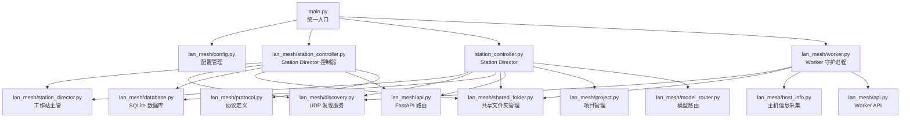
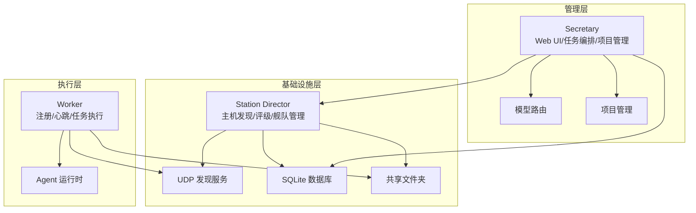
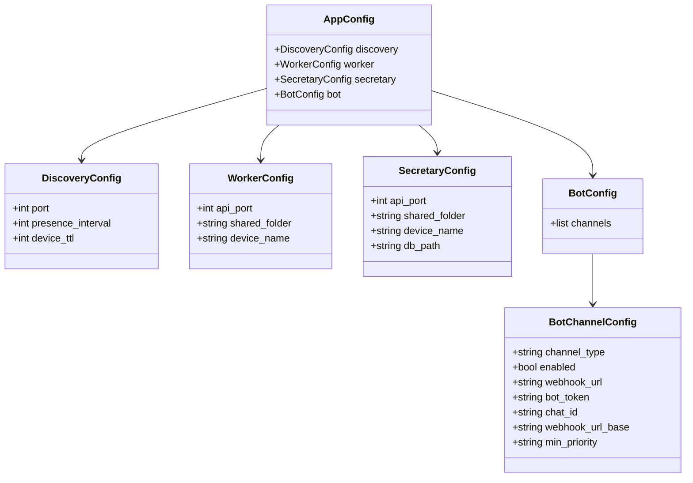
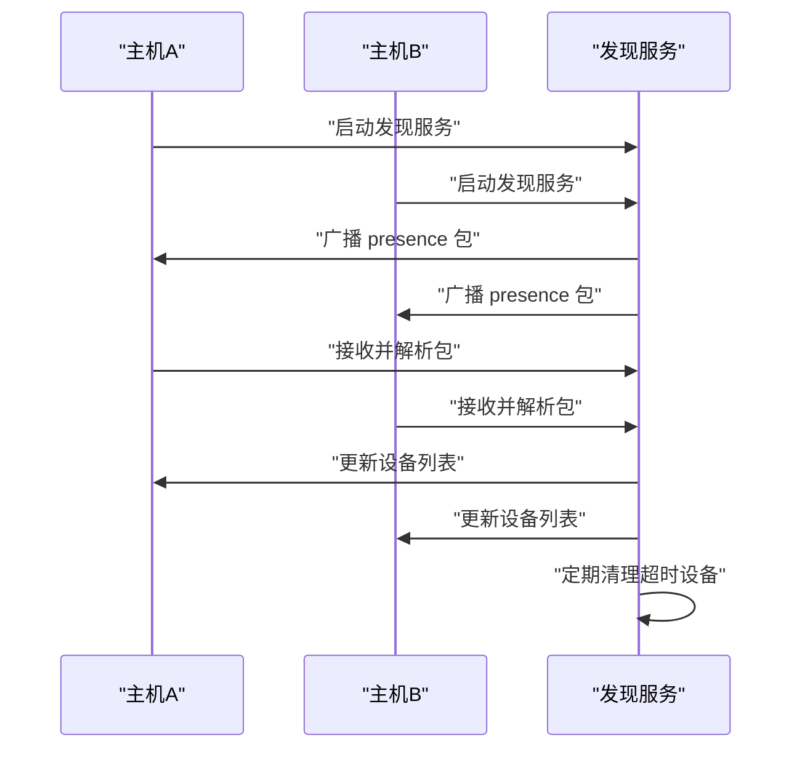
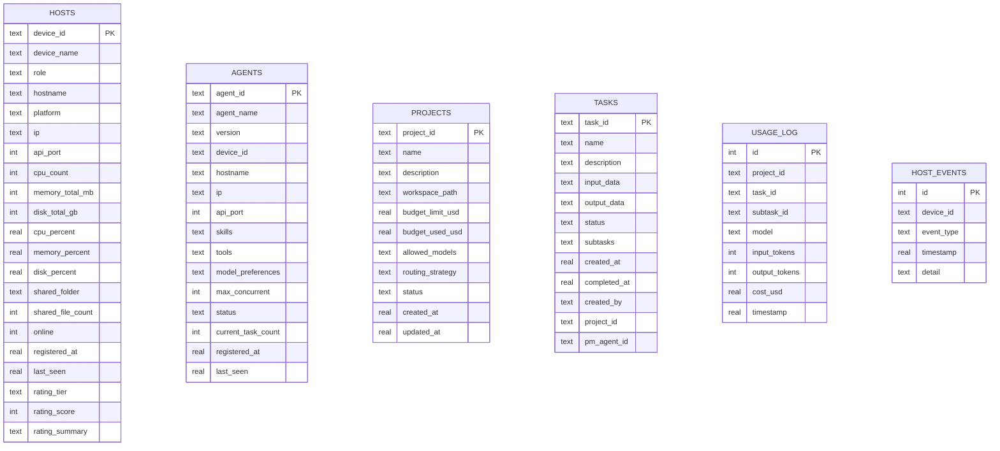
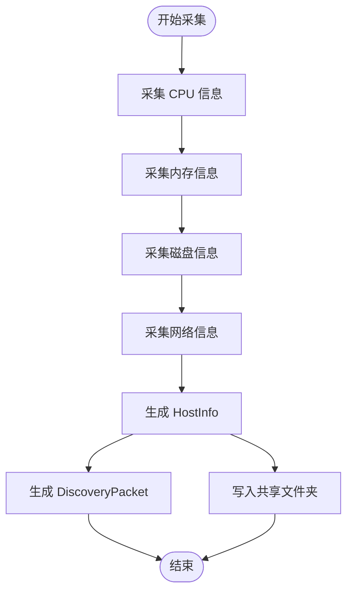
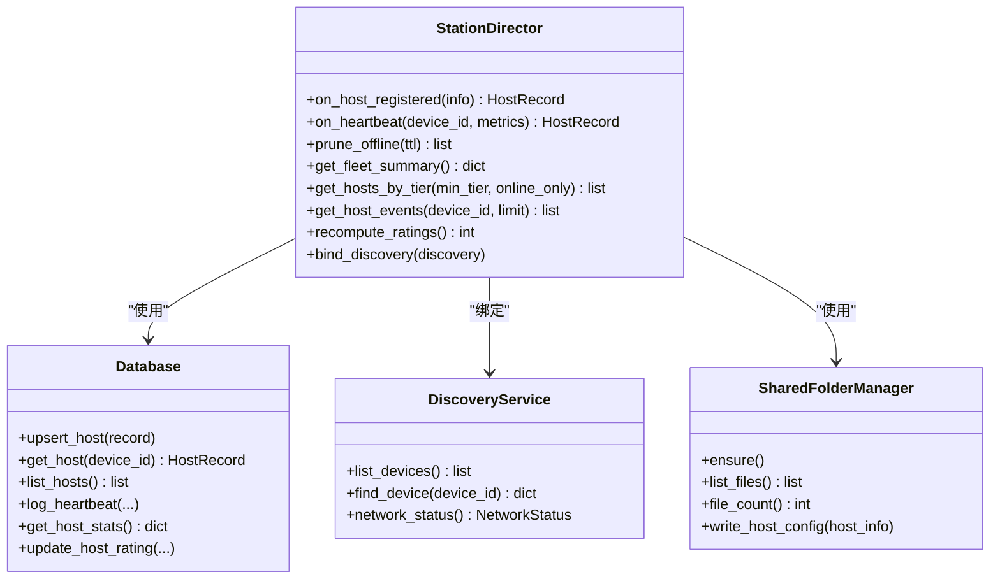
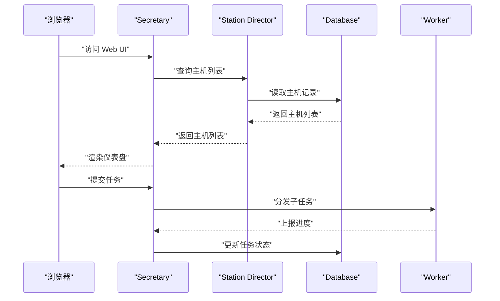
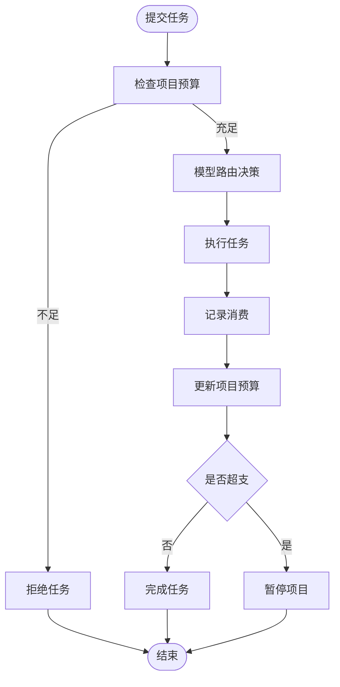
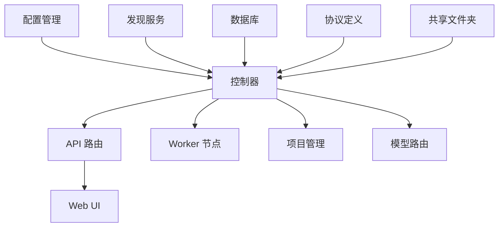

# PM Agent 系统

<cite>
**本文档引用的文件**
- [main.py](file://main.py)
- [lan_mesh/__init__.py](file://lan_mesh/__init__.py)
- [lan_mesh/config.py](file://lan_mesh/config.py)
- [lan_mesh/project.py](file://lan_mesh/project.py)
- [lan_mesh/station_controller.py](file://lan_mesh/station_controller.py)
- [lan_mesh/worker.py](file://lan_mesh/worker.py)
- [station_controller.py](file://lan_mesh/station_controller.py)
- [lan_mesh/station_director.py](file://lan_mesh/station_director.py)
- [lan_mesh/discovery.py](file://lan_mesh/discovery.py)
- [lan_mesh/database.py](file://lan_mesh/database.py)
- [lan_mesh/protocol.py](file://lan_mesh/protocol.py)
- [lan_mesh/api.py](file://lan_mesh/api.py)
- [lan_mesh/host_info.py](file://lan_mesh/host_info.py)
- [lan_mesh/shared_folder.py](file://lan_mesh/shared_folder.py)
- [lan_mesh/model_router.py](file://lan_mesh/model_router.py)
</cite>

## 目录
1. [简介](#简介)
2. [项目结构](#项目结构)
3. [核心组件](#核心组件)
4. [架构总览](#架构总览)
5. [详细组件分析](#详细组件分析)
6. [依赖关系分析](#依赖关系分析)
7. [性能考虑](#性能考虑)
8. [故障排除指南](#故障排除指南)
9. [结论](#结论)

## 简介
PM Agent 系统是一个基于局域网的分布式主机管理与任务编排框架，采用“Station Director + Secretary + Worker”的三层架构。系统通过 UDP 广播发现局域网内的主机，统一管理主机资源、项目预算与模型路由，并提供 Web UI 仪表盘进行可视化管理。

系统主要特性包括：
- 基于 UDP 的自动发现与心跳机制
- 主机资源评级与舰队管理
- 项目隔离与预算控制
- 模型路由与降级链
- 项目经理 Agent（PM Agent）的多智能体协作
- 共享文件夹与技能库管理

## 项目结构
系统采用模块化设计，核心代码位于 `lan_mesh/` 目录，入口脚本位于项目根目录。

**图表来源**
- [main.py:1-98](file://main.py#L1-L98)
- [lan_mesh/station_controller.py:1-494](file://lan_mesh/station_controller.py#L1-L494)
- [station_controller.py](file://lan_mesh/station_controller.py#L1-L342)
- [lan_mesh/worker.py:1-593](file://lan_mesh/worker.py#L1-L593)

**章节来源**
- [main.py:1-98](file://main.py#L1-L98)
- [lan_mesh/__init__.py:1-11](file://lan_mesh/__init__.py#L1-L11)

## 核心组件
- 配置管理：基于 Pydantic 的强类型配置，支持 YAML 与环境变量加载。
- 发现服务：基于 UDP 广播的局域网设备发现与心跳。
- 数据库：SQLite 存储主机、任务、项目、技能等元数据。
- 主机信息采集：使用 psutil 采集 CPU、内存、磁盘、网络等硬件信息。
- 共享文件夹：自动创建与管理跨主机共享目录。
- Station Director：基础设施资源管理，负责主机评级与舰队管理。
- Secretary：中心控制节点，提供 Web UI、任务编排与项目管理。
- Worker：各主机上的守护进程，负责注册、心跳与任务执行。
- 项目管理：预算控制、消费记录与路由策略。
- 模型路由：基于难度分级与策略的模型选择与降级链。

**章节来源**
- [lan_mesh/config.py:1-159](file://lan_mesh/config.py#L1-L159)
- [lan_mesh/discovery.py:1-259](file://lan_mesh/discovery.py#L1-L259)
- [lan_mesh/database.py:1-800](file://lan_mesh/database.py#L1-L800)
- [lan_mesh/host_info.py:1-212](file://lan_mesh/host_info.py#L1-L212)
- [lan_mesh/shared_folder.py:1-219](file://lan_mesh/shared_folder.py#L1-L219)
- [lan_mesh/station_director.py:1-224](file://lan_mesh/station_director.py#L1-L224)
- [station_controller.py](file://lan_mesh/station_controller.py#L1-L342)
- [lan_mesh/worker.py:1-593](file://lan_mesh/worker.py#L1-L593)
- [lan_mesh/project.py:1-320](file://lan_mesh/project.py#L1-L320)
- [lan_mesh/model_router.py:1-327](file://lan_mesh/model_router.py#L1-L327)

## 架构总览
系统采用三层架构：
- Station Director：基础设施管理层，负责主机发现、评级与舰队管理。
- Secretary：控制管理层，提供 Web UI、任务编排、项目管理与模型路由。
- Worker：执行层，负责注册、心跳与任务执行。

**图表来源**
- [lan_mesh/station_controller.py:1-494](file://lan_mesh/station_controller.py#L1-L494)
- [station_controller.py](file://lan_mesh/station_controller.py#L1-L342)
- [lan_mesh/worker.py:1-593](file://lan_mesh/worker.py#L1-L593)

## 详细组件分析

### 配置管理
配置系统基于 Pydantic，提供强类型校验与默认值。支持从多个位置加载配置文件，并支持环境变量覆盖。

**图表来源**
- [lan_mesh/config.py:14-84](file://lan_mesh/config.py#L14-L84)

**章节来源**
- [lan_mesh/config.py:1-159](file://lan_mesh/config.py#L1-L159)

### 发现服务（UDP 广播）
发现服务通过 UDP 广播实现局域网设备发现，支持定时广播、监听与离线清理。

**图表来源**
- [lan_mesh/discovery.py:33-259](file://lan_mesh/discovery.py#L33-L259)

**章节来源**
- [lan_mesh/discovery.py:1-259](file://lan_mesh/discovery.py#L1-L259)

### 数据库与协议
数据库使用 SQLite 存储主机、任务、项目、技能等元数据；协议定义了发现包、主机信息、任务状态等数据结构。

**图表来源**
- [lan_mesh/database.py:39-173](file://lan_mesh/database.py#L39-L173)
- [lan_mesh/protocol.py:29-151](file://lan_mesh/protocol.py#L29-L151)

**章节来源**
- [lan_mesh/database.py:1-800](file://lan_mesh/database.py#L1-L800)
- [lan_mesh/protocol.py:1-562](file://lan_mesh/protocol.py#L1-L562)

### 主机信息采集
主机信息采集模块使用 psutil 获取 CPU、内存、磁盘、网络等硬件信息，并生成发现包与配置报告。

**图表来源**
- [lan_mesh/host_info.py:129-212](file://lan_mesh/host_info.py#L129-L212)
- [lan_mesh/shared_folder.py:122-144](file://lan_mesh/shared_folder.py#L122-L144)

**章节来源**
- [lan_mesh/host_info.py:1-212](file://lan_mesh/host_info.py#L1-L212)
- [lan_mesh/shared_folder.py:1-219](file://lan_mesh/shared_folder.py#L1-L219)

### 共享文件夹管理
共享文件夹管理器负责自动创建共享目录、文件列表、下载与上传功能，并生成人类可读的配置报告。

**章节来源**
- [lan_mesh/shared_folder.py:1-219](file://lan_mesh/shared_folder.py#L1-L219)

### Station Director（工作站主管）
Station Director 负责主机注册、心跳处理、离线检测与舰队查询，提供资源池查询接口。

**图表来源**
- [lan_mesh/station_director.py:28-224](file://lan_mesh/station_director.py#L28-L224)
- [lan_mesh/database.py:249-450](file://lan_mesh/database.py#L249-L450)
- [lan_mesh/discovery.py:97-136](file://lan_mesh/discovery.py#L97-L136)
- [lan_mesh/shared_folder.py:23-86](file://lan_mesh/shared_folder.py#L23-L86)

**章节来源**
- [lan_mesh/station_director.py:1-224](file://lan_mesh/station_director.py#L1-L224)

### Secretary（中心控制节点）
Secretary 是系统的核心控制节点，提供 Web UI、任务编排、项目管理与模型路由，并与 Station Director 协同工作。

**图表来源**
- [station_controller.py](file://lan_mesh/station_controller.py#L69-L342)
- [lan_mesh/station_director.py:108-140](file://lan_mesh/station_director.py#L108-L140)
- [lan_mesh/database.py:582-652](file://lan_mesh/database.py#L582-L652)

**章节来源**
- [station_controller.py](file://lan_mesh/station_controller.py#L1-L342)

### Worker（工作节点）
Worker 是各主机上的守护进程，负责自动注册、心跳上报与任务执行。

**章节来源**
- [lan_mesh/worker.py:1-593](file://lan_mesh/worker.py#L1-L593)

### 项目管理（预算控制）
项目管理模块提供项目生命周期管理、预算控制与消费记录追踪。

**图表来源**
- [lan_mesh/project.py:176-291](file://lan_mesh/project.py#L176-L291)
- [lan_mesh/model_router.py:164-242](file://lan_mesh/model_router.py#L164-L242)

**章节来源**
- [lan_mesh/project.py:1-320](file://lan_mesh/project.py#L1-L320)

### 模型路由
模型路由模块根据任务难度与项目策略选择最优模型，并提供降级链。

**章节来源**
- [lan_mesh/model_router.py:1-327](file://lan_mesh/model_router.py#L1-L327)

## 依赖关系分析
系统采用模块化设计，各组件通过清晰的接口耦合：

**图表来源**
- [lan_mesh/api.py:1-757](file://lan_mesh/api.py#L1-L757)
- [lan_mesh/station_controller.py:1-494](file://lan_mesh/station_controller.py#L1-L494)
- [station_controller.py](file://lan_mesh/station_controller.py#L1-L342)

**章节来源**
- [lan_mesh/api.py:1-757](file://lan_mesh/api.py#L1-L757)

## 性能考虑
- 发现服务：UDP 广播频率与 TTL 配置影响网络开销与离线检测灵敏度。
- 数据库：SQLite 适合中小规模部署，高并发场景建议评估替代方案。
- 心跳间隔：合理设置心跳间隔平衡实时性与网络负载。
- 模型路由：评分算法复杂度较低，但在大规模模型池时可考虑缓存与索引优化。
- 共享文件夹：文件数量较多时注意 I/O 性能与磁盘空间管理。

## 故障排除指南
常见问题与排查步骤：
- 发现服务端口占用：检查端口占用情况并调整发现端口。
- 设备 ID 冲突：确认每台主机的角色设备 ID 是否正确生成与持久化。
- API 认证失败：检查模型池配置中的 API Key 环境变量。
- Web UI 无法访问：确认 API 端口与防火墙设置。
- 任务执行失败：检查 Worker 的 Agent 运行时与子任务分发状态。

**章节来源**
- [lan_mesh/discovery.py:160-174](file://lan_mesh/discovery.py#L160-L174)
- [lan_mesh/host_info.py:21-37](file://lan_mesh/host_info.py#L21-L37)
- [lan_mesh/model_router.py:288-300](file://lan_mesh/model_router.py#L288-L300)

## 结论
PM Agent 系统通过清晰的三层架构实现了局域网内的分布式主机管理与任务编排。系统具备良好的扩展性与可维护性，适合在需要跨主机协作与预算控制的场景中部署。通过合理的配置与监控，可以有效提升多智能体任务执行的效率与稳定性。
