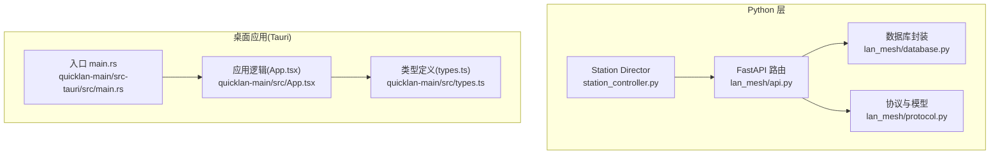
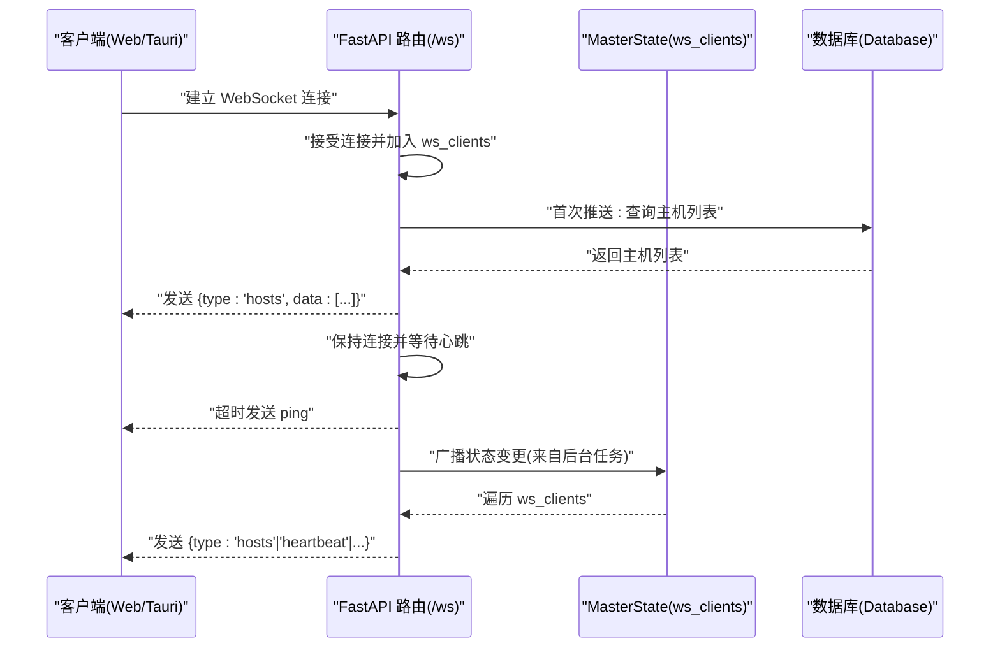
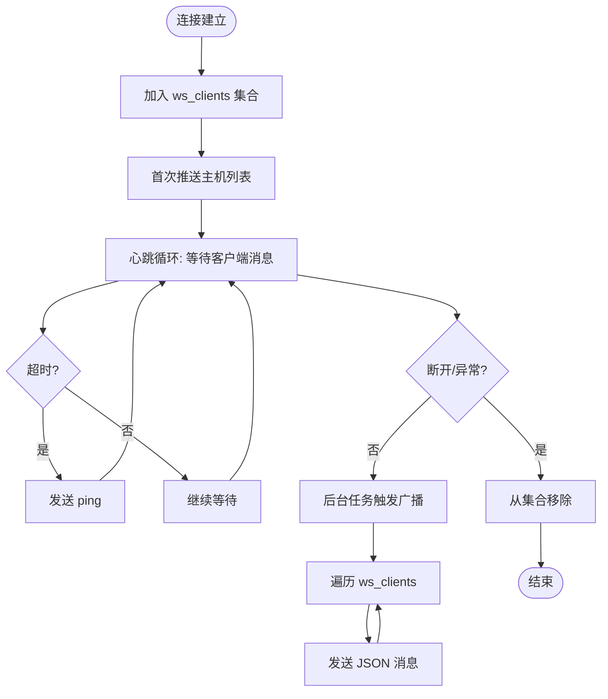
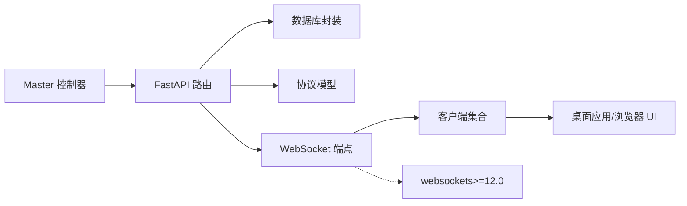

# WebSocket 实时通信

<cite>
**本文引用的文件**
- [requirements.txt](file://requirements.txt)
- [api.py](file://lan_mesh/api.py)
- [protocol.py](file://lan_mesh/protocol.py)
- [database.py](file://lan_mesh/database.py)
- [App.tsx](file://quicklan-main/src/App.tsx)
- [api.ts](file://quicklan-main/src/api.ts)
- [types.ts](file://quicklan-main/src/types.ts)
- [main.rs](file://quicklan-main/src-tauri/src/main.rs)
</cite>

## 更新摘要
**所做更改**
- 新增 websockets>=12.0 依赖要求章节，说明版本升级带来的性能改进
- 更新依赖关系分析，强调 WebSocket 服务器的稳定性提升
- 增强性能考量部分，详细说明新版本的实时通信能力

## 目录
1. [简介](#简介)
2. [项目结构](#项目结构)
3. [核心组件](#核心组件)
4. [架构总览](#架构总览)
5. [详细组件分析](#详细组件分析)
6. [依赖关系分析](#依赖关系分析)
7. [性能考量](#性能考量)
8. [故障排查指南](#故障排查指南)
9. [结论](#结论)

## 简介
本文件面向 WebSocket 实时通信的架构设计与实现，重点解释：
- Master 如何通过 WebSocket 向 Web UI 和桌面应用推送实时状态
- 连接管理、消息格式与客户端同步机制
- WebSocket 服务器的实现原理、客户端连接处理与消息广播机制
- 状态更新策略、连接断开处理与重连机制

## 项目结构
该系统采用"Python FastAPI + Tauri 桌面应用 + Web UI"的混合架构：
- Python 层：Master 控制器负责 UDP 发现、HTTP API、WebSocket 推送与数据库持久化
- Tauri 层：桌面应用通过 Rust 实现，提供事件总线与 UI 交互
- Web 层：浏览器端通过 React 组件订阅事件并渲染状态

**图表来源**
- [api.py:1-620](file://lan_mesh/api.py#L1-L620)
- [protocol.py:1-418](file://lan_mesh/protocol.py#L1-L418)
- [database.py:1-691](file://lan_mesh/database.py#L1-L691)
- [main.rs:1-6](file://quicklan-main/src-tauri/src/main.rs#L1-L6)
- [App.tsx:1-800](file://quicklan-main/src/App.tsx#L1-L800)
- [types.ts:1-128](file://quicklan-main/src/types.ts#L1-L128)

**章节来源**
- [api.py:1-620](file://lan_mesh/api.py#L1-L620)
- [protocol.py:1-418](file://lan_mesh/protocol.py#L1-L418)
- [database.py:1-691](file://lan_mesh/database.py#L1-L691)
- [main.rs:1-6](file://quicklan-main/src-tauri/src/main.rs#L1-L6)

## 核心组件
- Master 控制器：负责启动 FastAPI、管理线程、周期性推送状态、维护 WebSocket 客户端集合
- FastAPI 路由：提供 HTTP API 与 WebSocket 端点，处理注册、心跳、广播等
- 数据库封装：持久化主机状态、心跳日志、Agent 与任务信息
- 协议与模型：统一的数据结构定义，确保前后端消息契约一致
- 桌面应用：通过事件总线接收推送并更新 UI；Web UI 通过事件监听同步状态

**章节来源**
- [api.py:103-620](file://lan_mesh/api.py#L103-L620)
- [protocol.py:29-418](file://lan_mesh/protocol.py#L29-L418)
- [database.py:16-691](file://lan_mesh/database.py#L16-L691)

## 架构总览
WebSocket 实时推送的整体流程如下：
- Master 启动时创建 FastAPI 应用，并在启动事件中创建后台任务定时推送
- 客户端通过 /ws 建立 WebSocket 连接，首次连接即收到当前主机列表
- Master 周期性地从数据库拉取最新主机状态并通过广播函数推送给所有客户端
- 客户端收到消息后更新本地状态，实现 UI 实时同步

**图表来源**
- [api.py:582-606](file://lan_mesh/api.py#L582-L606)
- [api.py:610-620](file://lan_mesh/api.py#L610-L620)
- [database.py:268-274](file://lan_mesh/database.py#L268-L274)

## 详细组件分析

### WebSocket 服务器实现
- 连接接受与生命周期
  - /ws 端点接受连接并将 WebSocket 加入 MasterState.ws_clients
  - 首次推送当前主机列表，随后进入心跳循环
  - 心跳超时则发送 ping，维持连接活性
  - 异常断开或错误时从集合移除
- 广播机制
  - broadcast_ws 函数遍历所有连接，发送 JSON 消息
  - 对异常连接进行清理，避免阻塞后续广播

**图表来源**
- [api.py:582-606](file://lan_mesh/api.py#L582-L606)
- [api.py:610-620](file://lan_mesh/api.py#L610-L620)

**章节来源**
- [api.py:582-620](file://lan_mesh/api.py#L582-L620)

### 连接管理与客户端同步
- 连接集合
  - MasterState.ws_clients 是一个集合，保存所有活跃连接
- 客户端行为
  - 首次连接即收到 hosts 列表
  - 心跳超时收到 ping，维持连接活性
  - 断开后自动从集合移除，避免广播异常
- 客户端同步
  - 客户端收到消息后更新本地状态，UI 实时刷新
  - 桌面应用与 Web UI 通过事件总线接收并渲染

**章节来源**
- [api.py:582-606](file://lan_mesh/api.py#L582-L606)
- [App.tsx:144-178](file://quicklan-main/src/App.tsx#L144-L178)

### 消息格式与状态更新策略
- 消息结构
  - JSON 文本，包含 type 与 data 字段
  - type 可为 hosts、heartbeat、host_registered、agent_registered、task_submitted、project_created、project_updated、project_archived 等
  - data 为对应实体的字典表示
- 状态更新策略
  - 定时推送：每 3 秒从数据库拉取最新主机列表并广播
  - 事件驱动：注册、心跳、Agent/任务/项目变更时即时广播
- 数据一致性
  - 数据库封装提供线程安全连接池与索引优化
  - 心跳日志用于历史追踪与统计

**章节来源**
- [api.py:610-620](file://lan_mesh/api.py#L610-L620)
- [database.py:268-274](file://lan_mesh/database.py#L268-L274)

### 客户端连接处理与重连机制
- 连接处理
  - /ws 端点接受连接，首次推送当前状态
  - 心跳超时发送 ping，维持连接活性
  - 断开或异常时从集合移除
- 重连机制
  - 客户端应在断开后尝试重新连接 /ws
  - 首次连接即收到完整状态，保证 UI 一致性
  - 心跳 ping 用于检测连接健康

**章节来源**
- [api.py:582-606](file://lan_mesh/api.py#L582-L606)

### Master 状态推送与广播
- 后台任务
  - _ws_push_loop 每 3 秒查询数据库并广播 hosts
- 广播函数
  - broadcast_ws 将消息序列化后发送给所有连接
  - 对异常连接进行清理，确保广播效率

**章节来源**
- [api.py:610-620](file://lan_mesh/api.py#L610-L620)

### 数据模型与协议
- 主机信息模型
  - HostInfo：完整主机画像（HTTP API）
  - HostRecord：数据库持久化记录（含在线状态与最后心跳）
- 协议常量
  - 端口、心跳间隔、TTL 等时间参数
- Agent 与任务模型
  - AgentCard、Task/SubTask、Project/UsageRecord 支持更丰富的业务场景

**章节来源**
- [protocol.py:69-148](file://lan_mesh/protocol.py#L69-L148)
- [protocol.py:12-25](file://lan_mesh/protocol.py#L12-L25)
- [protocol.py:195-235](file://lan_mesh/protocol.py#L195-L235)
- [protocol.py:239-298](file://lan_mesh/protocol.py#L239-L298)
- [protocol.py:310-418](file://lan_mesh/protocol.py#L310-L418)

## 依赖关系分析
- 组件耦合
  - Master 控制器依赖 FastAPI 路由与数据库封装
  - 路由依赖协议模型与共享文件夹管理
  - 客户端通过事件总线与 UI 同步
- 外部依赖
  - FastAPI/uvicorn 提供 HTTP/WebSocket 服务
  - websockets>=12.0 提供高性能的 WebSocket 实现
  - SQLite 提供轻量级持久化
  - Tauri 提供桌面应用运行时与事件系统

**图表来源**
- [requirements.txt:1-9](file://requirements.txt#L1-L9)
- [api.py:103-620](file://lan_mesh/api.py#L103-L620)
- [database.py:16-691](file://lan_mesh/database.py#L16-L691)
- [protocol.py:29-418](file://lan_mesh/protocol.py#L29-L418)

**章节来源**
- [requirements.txt:1-9](file://requirements.txt#L1-L9)
- [api.py:103-620](file://lan_mesh/api.py#L103-L620)

## 性能考量
- 连接管理
  - 使用集合存储活跃连接，广播时遍历集合
  - 对异常连接进行清理，避免广播阻塞
- 广播频率
  - 默认每 3 秒推送一次主机列表，可根据负载调整
- 数据库访问
  - 线程安全连接池与索引优化，减少查询延迟
- 心跳与超时
  - 客户端心跳超时发送 ping，降低无效连接占用
- **WebSocket 性能提升**
  - websockets>=12.0 版本提供更好的连接管理和内存使用效率
  - 改进的异步 I/O 处理，提升高并发场景下的稳定性
  - 更好的错误处理和连接恢复机制

**更新** 新版本的 websockets>=12.0 依赖显著提升了 WebSocket 服务器的性能和稳定性，特别是在高并发连接场景下表现更加出色。

**章节来源**
- [requirements.txt:3](file://requirements.txt#L3)
- [api.py:610-620](file://lan_mesh/api.py#L610-L620)

## 故障排查指南
- 连接无法建立
  - 检查 /ws 端点是否正确接受连接
  - 确认 Master 是否在启动事件中创建后台任务
- 推送不生效
  - 检查广播函数是否被调用
  - 确认 MasterState.ws_clients 是否包含活跃连接
- 心跳异常
  - 客户端应响应 ping，否则可能断开
  - 检查网络连通性与防火墙设置
- 数据不同步
  - 确认数据库查询结果与广播数据一致
  - 检查客户端事件监听是否正确更新状态
- **WebSocket 连接问题**
  - 检查 websockets 版本是否满足 >=12.0 要求
  - 监控连接数增长，避免内存泄漏
  - 查看服务器日志中的 WebSocket 错误信息

**章节来源**
- [api.py:582-620](file://lan_mesh/api.py#L582-L620)
- [requirements.txt:3](file://requirements.txt#L3)

## 结论
本 WebSocket 实时通信方案通过 FastAPI 的 WebSocket 端点与广播机制，实现了 Master 对 Web UI 与桌面应用的状态推送。连接管理简洁高效，消息格式统一，客户端通过事件总线实现 UI 实时同步。配合数据库封装与协议模型，系统在可扩展性与一致性方面具备良好基础。

**更新** 新版本的 websockets>=12.0 依赖为系统带来了显著的性能提升和稳定性改进，特别是在处理大量并发连接时表现更加出色，为实时通信场景提供了更可靠的技术基础。
