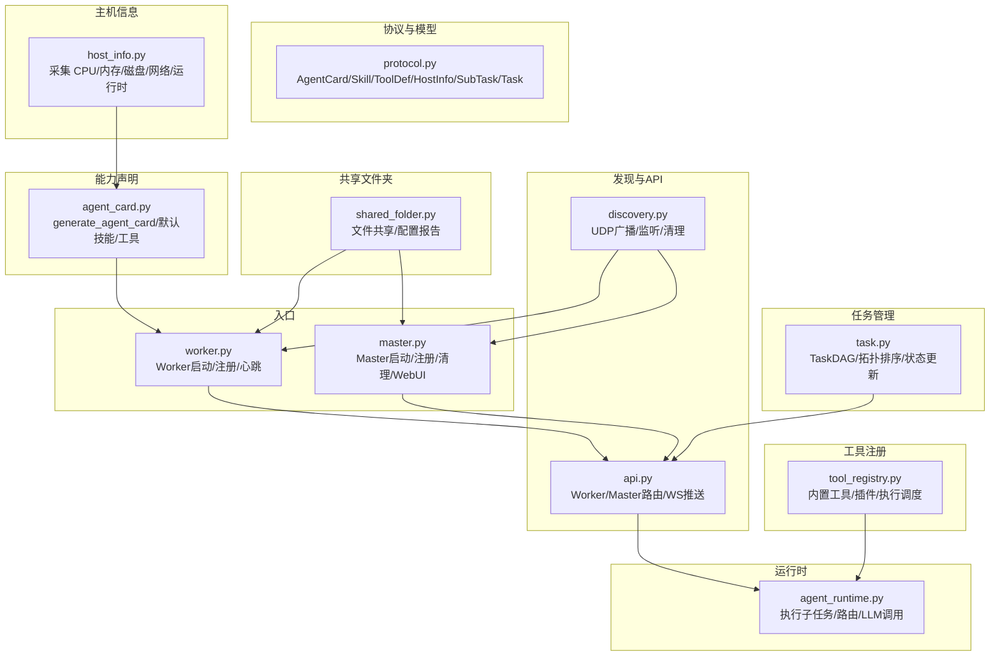
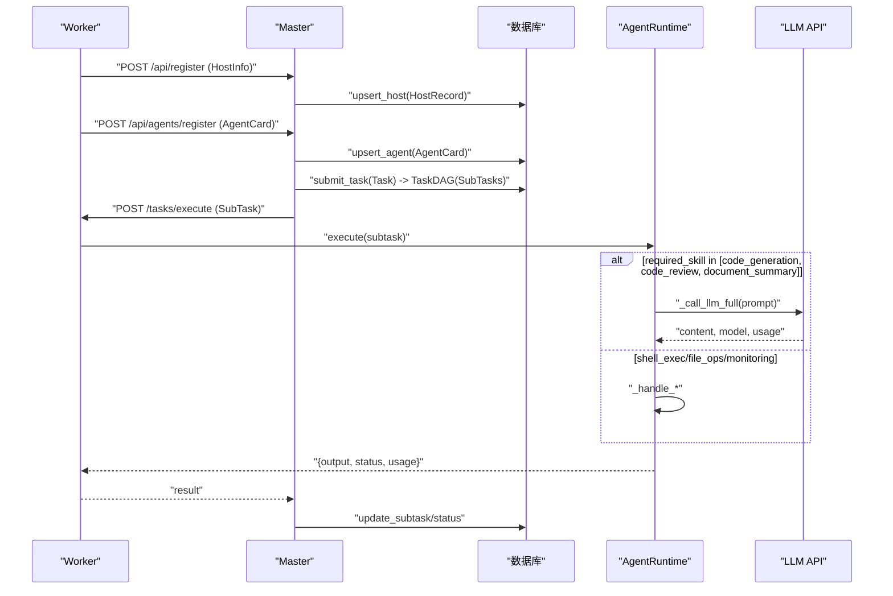
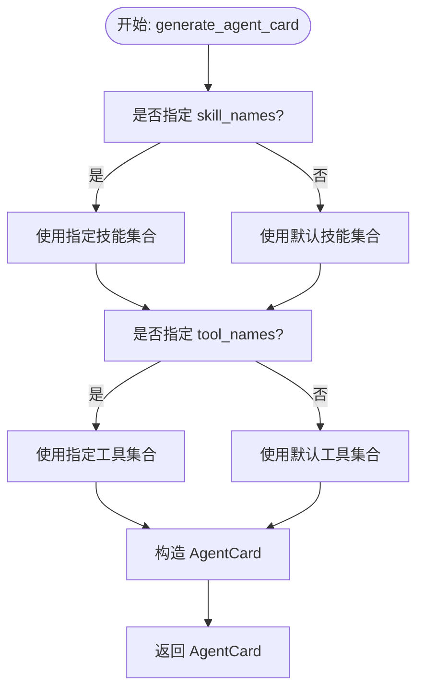
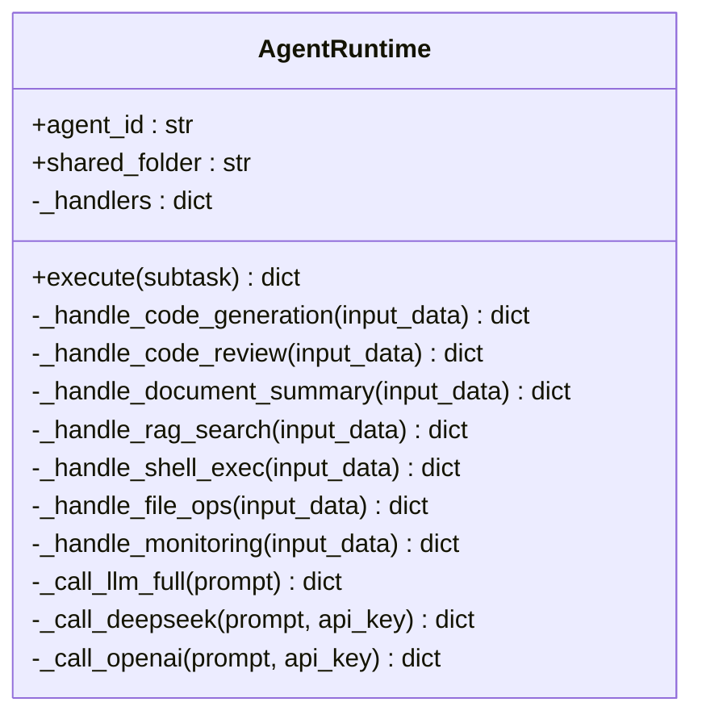
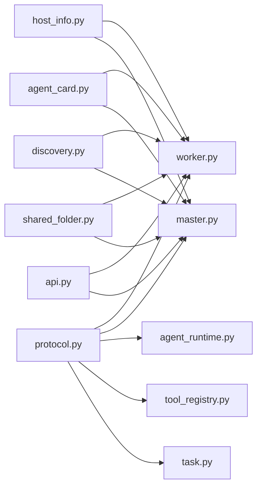

# Agent 能力声明系统

<cite>
**本文引用的文件**
- [agent_card.py](file://lan_mesh/agent_card.py)
- [agent_runtime.py](file://lan_mesh/agent_runtime.py)
- [protocol.py](file://lan_mesh/protocol.py)
- [host_info.py](file://lan_mesh/host_info.py)
- [worker.py](file://lan_mesh/worker.py)
- [master.py](file://lan_mesh/master.py)
- [api.py](file://lan_mesh/api.py)
- [discovery.py](file://lan_mesh/discovery.py)
- [shared_folder.py](file://lan_mesh/shared_folder.py)
- [tool_registry.py](file://lan_mesh/tool_registry.py)
- [task.py](file://lan_mesh/task.py)
- [config.py](file://lan_mesh/config.py)
</cite>

## 目录
1. [简介](#简介)
2. [项目结构](#项目结构)
3. [核心组件](#核心组件)
4. [架构总览](#架构总览)
5. [详细组件分析](#详细组件分析)
6. [依赖关系分析](#依赖关系分析)
7. [性能考量](#性能考量)
8. [故障排查指南](#故障排查指南)
9. [结论](#结论)
10. [附录](#附录)

## 简介
本文件面向 Agent 能力声明系统，围绕 AgentCard 的设计理念与结构展开，解释技能（Skill）与工具（ToolDef）的定义方式；详解 generate_agent_card 如何根据主机环境动态生成能力声明（包含 IP 地址、API 端口、主机名等元数据）；阐述 AgentRuntime 的运行时管理机制（任务执行、状态跟踪、结果返回）；并提供 AgentCard 的 JSON 模式与实际生成示例，展示不同环境下的能力声明差异。

## 项目结构
系统采用模块化设计，核心围绕 Worker/Master 的发现与注册、AgentCard 能力声明、AgentRuntime 任务执行、以及工具注册表与任务 DAG 管理展开。关键模块如下：
- 协议与数据模型：定义 AgentCard、Skill、ToolDef、HostInfo、SubTask、Task 等数据结构
- 主机信息采集：自动收集 CPU/内存/磁盘/网络等硬件与运行时信息
- Agent 能力声明：生成 AgentCard，包含技能与工具清单
- Agent 运行时：执行子任务，路由到对应技能处理器
- 工具注册表：内置工具与插件化工具管理
- 任务 DAG：子任务依赖与拓扑排序
- 发现与 API：UDP 广播发现、Worker/Master HTTP API
- 共享文件夹：跨主机文件共享与配置报告

图表来源
- [protocol.py:159-298](file://lan_mesh/protocol.py#L159-L298)
- [host_info.py:129-191](file://lan_mesh/host_info.py#L129-L191)
- [agent_card.py:167-217](file://lan_mesh/agent_card.py#L167-L217)
- [agent_runtime.py:28-242](file://lan_mesh/agent_runtime.py#L28-L242)
- [tool_registry.py:217-338](file://lan_mesh/tool_registry.py#L217-L338)
- [task.py:16-91](file://lan_mesh/task.py#L16-L91)
- [discovery.py:33-259](file://lan_mesh/discovery.py#L33-L259)
- [api.py:39-526](file://lan_mesh/api.py#L39-L526)
- [shared_folder.py:16-219](file://lan_mesh/shared_folder.py#L16-L219)
- [worker.py:62-325](file://lan_mesh/worker.py#L62-L325)
- [master.py:67-324](file://lan_mesh/master.py#L67-L324)

章节来源
- [protocol.py:159-298](file://lan_mesh/protocol.py#L159-L298)
- [host_info.py:129-191](file://lan_mesh/host_info.py#L129-L191)
- [agent_card.py:167-217](file://lan_mesh/agent_card.py#L167-L217)
- [agent_runtime.py:28-242](file://lan_mesh/agent_runtime.py#L28-L242)
- [tool_registry.py:217-338](file://lan_mesh/tool_registry.py#L217-L338)
- [task.py:16-91](file://lan_mesh/task.py#L16-L91)
- [discovery.py:33-259](file://lan_mesh/discovery.py#L33-L259)
- [api.py:39-526](file://lan_mesh/api.py#L39-L526)
- [shared_folder.py:16-219](file://lan_mesh/shared_folder.py#L16-L219)
- [worker.py:62-325](file://lan_mesh/worker.py#L62-L325)
- [master.py:67-324](file://lan_mesh/master.py#L67-L324)

## 核心组件
- AgentCard：借鉴 A2A 协议的 Agent 能力卡片，包含 agent_id、agent_name、version、宿主信息（device_id、hostname、ip、api_port）、能力声明（skills、tools、model_preferences、max_concurrent_tasks）、运行时状态（status、current_task_count、registered_at、last_seen）
- Skill：技能声明，包含 name、description、input_schema（JSON Schema）、tags
- ToolDef：工具定义，包含 name、description、mcp_compatible、input_schema（JSON Schema）
- AgentRuntime：Worker 端运行时，负责接收子任务、按 required_skill 路由到对应处理器、执行 LLM API 或本地操作、返回结果与 token 使用统计
- ToolRegistry：工具注册表，支持内置工具、YAML 插件工具、运行时动态注册
- TaskDAG：子任务有向无环图，支持依赖声明、拓扑排序、就绪任务筛选、循环依赖检测
- DiscoveryService：UDP 广播发现，负责广播自身存在、监听其他设备、TTL 清理
- Worker/Master：Worker 自动注册到 Master，提供 HTTP API；Master 维护主机与 Agent 注册表、提供 Web UI 与任务编排

章节来源
- [protocol.py:161-234](file://lan_mesh/protocol.py#L161-L234)
- [agent_runtime.py:28-242](file://lan_mesh/agent_runtime.py#L28-L242)
- [tool_registry.py:217-338](file://lan_mesh/tool_registry.py#L217-L338)
- [task.py:16-91](file://lan_mesh/task.py#L16-L91)
- [discovery.py:33-259](file://lan_mesh/discovery.py#L33-L259)
- [worker.py:62-325](file://lan_mesh/worker.py#L62-L325)
- [master.py:67-324](file://lan_mesh/master.py#L67-L324)

## 架构总览
Agent 能力声明系统的核心流程：
- Worker 启动后采集主机信息，生成 AgentCard，并通过 HTTP 注册到 Master
- Master 接收 Worker 注册与心跳，维护 HostRecord 与 AgentCard
- Master 通过 API 接口提交任务，任务分解为子任务并构建 TaskDAG
- Master 根据 AgentCard 的 skills/tools 与子任务 required_skill 进行匹配与分发
- Worker 的 AgentRuntime 接收子任务，路由到对应技能处理器执行
- 执行结果返回给 Master，更新任务状态与消费记录

图表来源
- [worker.py:126-171](file://lan_mesh/worker.py#L126-L171)
- [api.py:116-168](file://lan_mesh/api.py#L116-L168)
- [api.py:268-299](file://lan_mesh/api.py#L268-L299)
- [agent_runtime.py:47-75](file://lan_mesh/agent_runtime.py#L47-L75)
- [agent_runtime.py:172-241](file://lan_mesh/agent_runtime.py#L172-L241)

## 详细组件分析

### AgentCard 设计理念与结构
- 设计理念：借鉴 A2A 协议的 Agent Card，强调“能力声明”与“可发现性”。每个 Worker 启动时生成 AgentCard 并注册到 Master，Master 依据技能与工具清单进行任务匹配与分发
- 结构组成：
  - 宿主信息：device_id、hostname、ip、api_port
  - 能力声明：skills（技能列表）、tools（工具列表）、model_preferences（模型偏好）、max_concurrent_tasks（最大并发）
  - 运行时状态：status、current_task_count、registered_at、last_seen
- JSON 模式：AgentCard 为 dataclass，支持 to_dict/from_dict，便于序列化为 JSON

章节来源
- [protocol.py:202-234](file://lan_mesh/protocol.py#L202-L234)
- [agent_card.py:167-217](file://lan_mesh/agent_card.py#L167-L217)

### 技能（Skill）与工具（ToolDef）定义
- Skill：描述一类可执行的任务，包含 name、description、input_schema（JSON Schema）、tags
- ToolDef：描述可调用的外部工具，包含 name、description、mcp_compatible、input_schema（JSON Schema）
- 默认技能与工具：系统内置一组通用技能与工具，支持代码生成/审查/摘要、RAG 检索预留、Shell 执行、文件读写、HTTP 请求等

章节来源
- [protocol.py:161-193](file://lan_mesh/protocol.py#L161-L193)
- [agent_card.py:18-111](file://lan_mesh/agent_card.py#L18-L111)
- [agent_card.py:115-162](file://lan_mesh/agent_card.py#L115-L162)

### generate_agent_card 动态生成能力声明
- 输入参数：device_id、agent_name、ip、api_port、hostname、skill_names、tool_names、model_preferences、max_concurrent_tasks
- 动态选择：若传入 skill_names/tool_names，则仅包含指定项；否则使用默认集合
- 输出：AgentCard 实例，包含 skills/tools 的 JSON 序列化形式
- 元数据来源：ip 来自主机信息采集，hostname 来自主机名，api_port 来自 Worker 启动时端口分配

图表来源
- [agent_card.py:167-217](file://lan_mesh/agent_card.py#L167-L217)

章节来源
- [agent_card.py:167-217](file://lan_mesh/agent_card.py#L167-L217)
- [host_info.py:129-191](file://lan_mesh/host_info.py#L129-L191)

### AgentRuntime 运行时管理机制
- 任务执行：execute 接收子任务，按 required_skill 路由到对应处理器
- 技能处理器：
  - code_generation/code_review/document_summary：调用 LLM API（优先 DeepSeek，其次 OpenAI），返回内容与 token 使用
  - rag_search：预留接口，当前返回提示
  - shell_exec：执行 Shell 命令，支持超时
  - file_ops：文件读写、列出、删除
  - monitoring：采集 CPU/内存/磁盘使用率与时间戳
- LLM API 调用：优先使用环境变量配置的 DEEPSEEK_API_KEY 或 OPENAI_API_KEY
- 结果返回：统一返回 {output, status, usage/error}

图表来源
- [agent_runtime.py:28-242](file://lan_mesh/agent_runtime.py#L28-L242)

章节来源
- [agent_runtime.py:28-242](file://lan_mesh/agent_runtime.py#L28-L242)

### 工具注册表（ToolRegistry）
- 支持三种注册方式：内置工具、YAML 插件工具、运行时动态注册
- 内置工具：file_read、file_write、shell_exec、http_request、dir_list、python_eval
- 执行调度：call_tool 根据工具名调用对应处理器，返回 MCP 兼容格式
- 插件加载：load_plugins 从 YAML 配置导入模块与函数，动态注册 ToolDef 与处理器

章节来源
- [tool_registry.py:217-338](file://lan_mesh/tool_registry.py#L217-L338)

### 任务 DAG 管理（TaskDAG）
- 子任务依赖建模：邻接表与入度数组
- 拓扑排序：Kahn 算法，检测循环依赖
- 就绪任务：当前状态为 pending 且所有前置依赖已完成
- 状态更新：update_subtask 支持批量更新子任务属性

章节来源
- [task.py:16-91](file://lan_mesh/task.py#L16-L91)

### 发现与 API（Worker/Master）
- Worker：启动时创建 DiscoveryService，广播自身存在；注册 HostInfo 与 AgentCard；周期性发送心跳；提供 /info、/tasks/execute、/shared 等 API
- Master：维护 HostRecord 与 AgentCard；提供 /api/register、/api/heartbeat、/api/agents、/api/tasks、/api/projects、/tools/* 等 API；WebSocket 推送状态变化

章节来源
- [worker.py:62-325](file://lan_mesh/worker.py#L62-L325)
- [master.py:67-324](file://lan_mesh/master.py#L67-L324)
- [api.py:39-526](file://lan_mesh/api.py#L39-L526)
- [discovery.py:33-259](file://lan_mesh/discovery.py#L33-L259)

## 依赖关系分析
- 协议层：AgentCard/Skill/ToolDef/HostInfo/SubTask/Task 作为跨模块的数据契约
- Worker 依赖：host_info（采集）、agent_card（生成 AgentCard）、agent_runtime（执行）、api（HTTP 路由）、discovery（发现）、shared_folder（共享）
- Master 依赖：discovery（发现）、database（持久化）、api（HTTP 路由）、orchestrator（任务编排）、project（项目管理）、mcp_gateway（工具网关）

图表来源
- [protocol.py:159-298](file://lan_mesh/protocol.py#L159-L298)
- [worker.py:62-325](file://lan_mesh/worker.py#L62-L325)
- [master.py:67-324](file://lan_mesh/master.py#L67-L324)
- [agent_runtime.py:28-242](file://lan_mesh/agent_runtime.py#L28-L242)
- [tool_registry.py:217-338](file://lan_mesh/tool_registry.py#L217-L338)
- [task.py:16-91](file://lan_mesh/task.py#L16-L91)
- [host_info.py:129-191](file://lan_mesh/host_info.py#L129-L191)
- [agent_card.py:167-217](file://lan_mesh/agent_card.py#L167-L217)
- [discovery.py:33-259](file://lan_mesh/discovery.py#L33-L259)
- [shared_folder.py:16-219](file://lan_mesh/shared_folder.py#L16-L219)
- [api.py:39-526](file://lan_mesh/api.py#L39-L526)

章节来源
- [protocol.py:159-298](file://lan_mesh/protocol.py#L159-L298)
- [worker.py:62-325](file://lan_mesh/worker.py#L62-L325)
- [master.py:67-324](file://lan_mesh/master.py#L67-L324)
- [agent_runtime.py:28-242](file://lan_mesh/agent_runtime.py#L28-L242)
- [tool_registry.py:217-338](file://lan_mesh/tool_registry.py#L217-L338)
- [task.py:16-91](file://lan_mesh/task.py#L16-L91)
- [host_info.py:129-191](file://lan_mesh/host_info.py#L129-L191)
- [agent_card.py:167-217](file://lan_mesh/agent_card.py#L167-L217)
- [discovery.py:33-259](file://lan_mesh/discovery.py#L33-L259)
- [shared_folder.py:16-219](file://lan_mesh/shared_folder.py#L16-L219)
- [api.py:39-526](file://lan_mesh/api.py#L39-L526)

## 性能考量
- LLM API 调用：优先使用 DeepSeek，其次 OpenAI，避免重复请求；返回内容包含 token 使用，便于成本控制
- Shell 执行：支持超时控制，防止长时间阻塞
- 文件操作：内置工具与本地文件系统交互，注意路径安全与权限
- 发现与心跳：UDP 广播与 HTTP 心跳间隔合理设置，避免频繁网络开销
- 任务编排：TaskDAG 拓扑排序与就绪任务筛选，减少无效轮询

## 故障排查指南
- LLM API 未配置：当未设置 DEEPSEEK_API_KEY 或 OPENAI_API_KEY 时，_call_llm_full 返回提示信息，需检查环境变量
- 端口冲突：Worker 启动时会查找可用端口，若端口范围被占用，需调整配置
- 网络发现异常：UDP 端口占用可能导致发现服务降级，检查端口占用与防火墙
- 工具执行错误：ToolRegistry.call_tool 返回 isError 与错误信息，检查工具定义与输入参数
- 任务循环依赖：TaskDAG.has_cycle 检测到环时，需修正子任务依赖关系

章节来源
- [agent_runtime.py:172-193](file://lan_mesh/agent_runtime.py#L172-L193)
- [worker.py:240-249](file://lan_mesh/worker.py#L240-L249)
- [discovery.py:159-174](file://lan_mesh/discovery.py#L159-L174)
- [tool_registry.py:259-288](file://lan_mesh/tool_registry.py#L259-L288)
- [task.py:68-70](file://lan_mesh/task.py#L68-L70)

## 结论
Agent 能力声明系统通过 AgentCard 将 Worker 的技能与工具能力标准化表达，结合 DiscoveryService 与 HTTP API 实现自动发现与注册；AgentRuntime 提供统一的任务执行框架，支持 LLM API 与本地操作；ToolRegistry 与 TaskDAG 进一步增强了工具扩展性与任务编排能力。整体架构清晰、模块解耦良好，适合在局域网环境中进行分布式任务协作与能力匹配。

## 附录

### AgentCard JSON 模式与字段说明
- agent_id：Agent 唯一标识
- agent_name：Agent 名称
- version：AgentCard 版本
- device_id：宿主设备 ID
- hostname：主机名
- ip：本机 IP 地址
- api_port：HTTP API 端口
- skills：技能列表（Skill.to_dict）
- tools：工具列表（ToolDef.to_dict）
- model_preferences：模型偏好列表
- max_concurrent_tasks：最大并发任务数
- status：Agent 运行状态（idle/busy/offline）
- current_task_count：当前任务计数
- registered_at/last_seen：注册与最近更新时间戳

章节来源
- [protocol.py:202-234](file://lan_mesh/protocol.py#L202-L234)

### generate_agent_card 参数与行为
- device_id：设备 ID（与 Worker 共享）
- agent_name：Agent 名称
- ip：本机 IP
- api_port：HTTP API 端口
- hostname：主机名
- skill_names：启用的技能列表（None 则全部启用）
- tool_names：启用的工具列表（None 则全部启用）
- model_preferences：模型偏好列表（默认 ["deepseek-v3", "gpt-4o-mini"]）
- max_concurrent_tasks：最大并发任务数（默认 5）

章节来源
- [agent_card.py:167-217](file://lan_mesh/agent_card.py#L167-L217)

### 不同环境下的能力声明差异示例
- 环境 A（具备 LLM API Key）：AgentCard 中包含 code_generation、code_review、document_summary 等技能，且 model_preferences 指定可用模型
- 环境 B（无 LLM API Key）：AgentCard 仍包含相同技能，但 LLM 调用将返回未配置提示
- 环境 C（禁用部分技能/工具）：通过 skill_names/tool_names 指定启用集合，生成的 AgentCard 仅包含选定能力

章节来源
- [agent_card.py:167-217](file://lan_mesh/agent_card.py#L167-L217)
- [agent_runtime.py:172-193](file://lan_mesh/agent_runtime.py#L172-L193)