# Agent 运行时管理

<cite>
**本文档引用的文件**
- [agent_runtime.py](file://lan_mesh/agent_runtime.py)
- [worker.py](file://lan_mesh/worker.py)
- [orchestrator.py](file://lan_mesh/orchestrator.py)
- [model_router.py](file://lan_mesh/model_router.py)
- [config.py](file://lan_mesh/config.py)
- [model_pool.example.yaml](file://lan_mesh/model_pool.example.yaml)
- [protocol.py](file://lan_mesh/protocol.py)
- [pm_agent.py](file://lan_mesh/pm_agent.py)
- [api.py](file://lan_mesh/api.py)
- [task.py](file://lan_mesh/task.py)
- [database.py](file://lan_mesh/database.py)
- [shared_folder.py](file://lan_mesh/shared_folder.py)
- [discovery.py](file://lan_mesh/discovery.py)
- [host_info.py](file://lan_mesh/host_info.py)
- [project.py](file://lan_mesh/project.py)
- [skill_registry.py](file://lan_mesh/skill_registry.py)
- [agent_prompt.py](file://lan_mesh/agent_prompt.py)
- [config.yaml](file://config.yaml)
</cite>

## 更新摘要
**变更内容**
- 新增提供商配置扩展章节，详细介绍阿里云 Token Plan 和其他多提供商支持
- 更新模型池集成章节，说明 ModelPoolConfig 和动态模型选择机制
- 新增智能调用逻辑改进章节，介绍降级链重试和多目标优化路由算法
- 更新 Provider 配置系统，支持 aliyun-tokenplan 等新提供商
- 增强模型路由器功能，实现基于难度分级和策略适配的智能选择

## 目录
1. [简介](#简介)
2. [项目结构](#项目结构)
3. [核心组件](#核心组件)
4. [架构概览](#架构概览)
5. [详细组件分析](#详细组件分析)
6. [提供商配置扩展](#提供商配置扩展)
7. [模型池集成](#模型池集成)
8. [智能调用逻辑改进](#智能调用逻辑改进)
9. [PM Agent 管理](#pm-agent-管理)
10. [子 Agent 系统](#子-agent-系统)
11. [依赖关系分析](#依赖关系分析)
12. [性能考虑](#性能考虑)
13. [故障排除指南](#故障排除指南)
14. [结论](#结论)

## 简介

Agent 运行时管理系统是 LAN Mesh 分布式计算框架的核心组件，负责在 Worker 节点上执行来自 Master 节点的任务分配。该系统实现了任务执行队列管理、并发控制、状态跟踪和结果返回机制，为分布式 AI 任务提供了可靠的执行环境。

系统采用 Master/Worker 架构，其中 Master 负责任务编排和资源管理，Worker 负责具体的任务执行。Agent Runtime 作为 Worker 的核心执行引擎，提供了多种技能处理器来处理不同类型的 AI 任务。最新版本引入了项目经理 Agent (PM Agent) 支持，实现了智能的任务分解、团队管理和进度协调功能。

**重大更新**：系统现在支持多提供商模型池集成，包括阿里云 Token Plan、DeepSeek、OpenAI、Anthropic 和通义千问等，通过智能路由算法实现最优模型选择和自动降级链重试。

## 项目结构

LAN Mesh 项目采用模块化设计，主要包含以下核心模块：

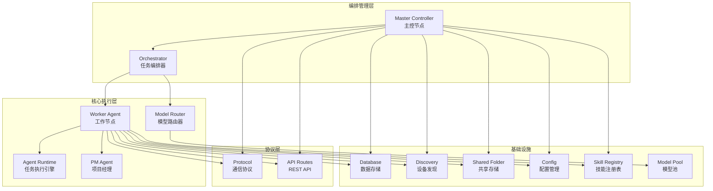

**图表来源**
- [agent_runtime.py:1-456](file://lan_mesh/agent_runtime.py#L1-L456)
- [worker.py:1-593](file://lan_mesh/worker.py#L1-L593)
- [orchestrator.py:1-301](file://lan_mesh/orchestrator.py#L1-L301)
- [model_router.py:1-327](file://lan_mesh/model_router.py#L1-L327)
- [pm_agent.py:1-893](file://lan_mesh/pm_agent.py#L1-L893)

**章节来源**
- [agent_runtime.py:1-456](file://lan_mesh/agent_runtime.py#L1-L456)
- [worker.py:1-593](file://lan_mesh/worker.py#L1-L593)
- [orchestrator.py:1-301](file://lan_mesh/orchestrator.py#L1-L301)
- [model_router.py:1-327](file://lan_mesh/model_router.py#L1-L327)
- [pm_agent.py:1-893](file://lan_mesh/pm_agent.py#L1-L893)

## 核心组件

### Agent Runtime 核心功能

Agent Runtime 是 Worker 节点的任务执行引擎，主要负责：

1. **任务接收与解析**：接收来自 Master 的子任务，解析任务参数和执行要求
2. **技能路由**：根据任务所需的技能类型路由到相应的执行处理器
3. **并发执行**：支持多任务并发执行，同时维护资源使用限制
4. **结果聚合**：收集执行结果，包括输出数据和模型调用统计信息
5. **错误处理**：统一处理执行过程中的各种异常情况
6. **自定义系统提示**：支持 PM 注入的定制 system prompt
7. **选择性技能加载**：按当前技能类型优化加载技能缓存
8. **智能模型路由**：支持多提供商模型选择和自动降级链重试

### 技能处理器体系

系统内置了多种技能处理器，每种技能对应特定的任务类型：

| 技能类型 | 功能描述 | 处理器方法 |
|---------|----------|-----------|
| code_generation | 代码生成 | `_handle_code_generation` |
| code_review | 代码审查 | `_handle_code_review` |
| document_summary | 文档摘要 | `_handle_document_summary` |
| rag_search | 检索增强 | `_handle_rag_search` |
| shell_exec | Shell 命令执行 | `_handle_shell_exec` |
| file_ops | 文件操作 | `_handle_file_ops` |
| monitoring | 系统监控 | `_handle_monitoring` |

**章节来源**
- [agent_runtime.py:28-456](file://lan_mesh/agent_runtime.py#L28-L456)

## 架构概览

Agent 运行时管理系统采用分层架构设计，确保了良好的可扩展性和维护性。最新版本增加了 PM Agent 的集成和智能模型路由功能，实现了智能的任务管理和团队协作：

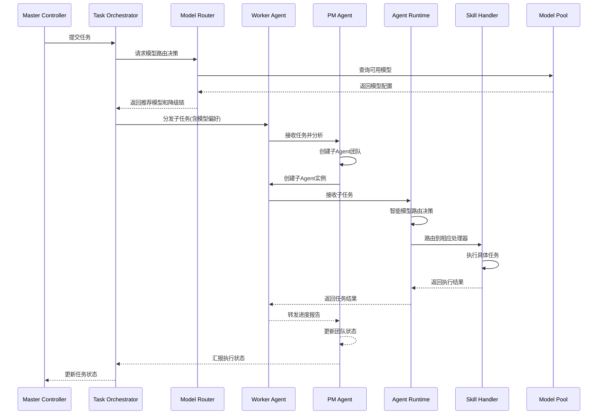

**图表来源**
- [orchestrator.py:132-226](file://lan_mesh/orchestrator.py#L132-L226)
- [model_router.py:164-242](file://lan_mesh/model_router.py#L164-L242)
- [worker.py:126-194](file://lan_mesh/worker.py#L126-L194)
- [agent_runtime.py:73-112](file://lan_mesh/agent_runtime.py#L73-L112)
- [pm_agent.py:103-134](file://lan_mesh/pm_agent.py#L103-L134)

## 详细组件分析

### Agent Runtime 类设计

Agent Runtime 采用了面向对象的设计模式，通过字典映射实现技能处理器的动态路由。最新版本增加了自定义系统提示、选择性技能加载和智能模型路由功能：

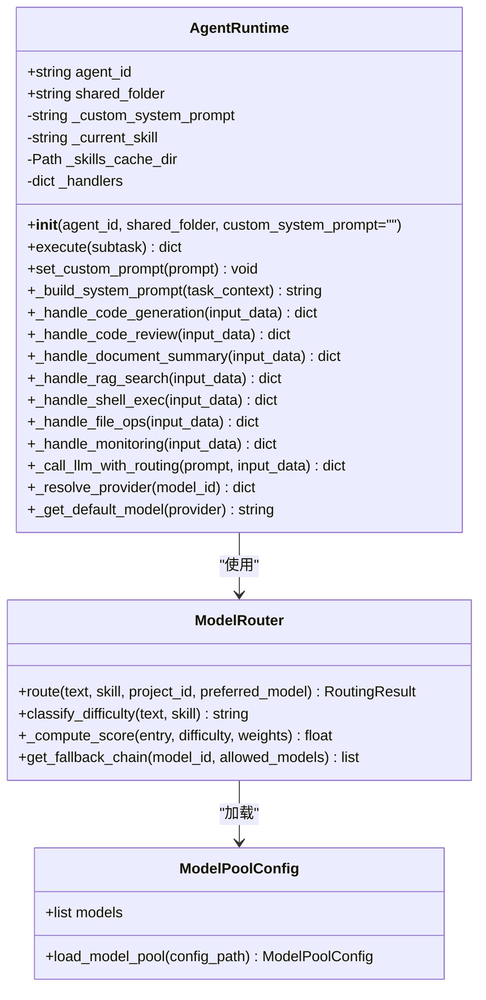

**图表来源**
- [agent_runtime.py:50-456](file://lan_mesh/agent_runtime.py#L50-L456)
- [model_router.py:116-327](file://lan_mesh/model_router.py#L116-L327)
- [config.py:39-159](file://lan_mesh/config.py#L39-L159)

#### 执行流程分析

Agent Runtime 的执行流程遵循标准的请求-处理-响应模式，增加了智能模型路由和自定义系统提示的支持：

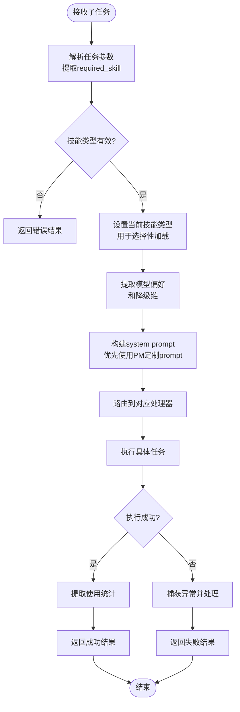

**图表来源**
- [agent_runtime.py:73-112](file://lan_mesh/agent_runtime.py#L73-L112)

**章节来源**
- [agent_runtime.py:50-456](file://lan_mesh/agent_runtime.py#L50-L456)

### Worker Agent 生命周期管理

Worker Agent 实现了完整的生命周期管理，包括启动、运行和停止阶段。最新版本增加了 PM Agent 的内嵌支持和子 Agent 管理功能：

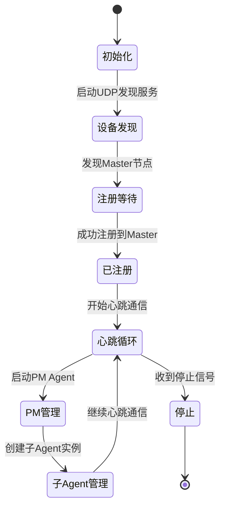

**图表来源**
- [worker.py:253-593](file://lan_mesh/worker.py#L253-L593)

#### 心跳机制实现

Worker Agent 通过 HTTP 心跳机制与 Master 保持通信，支持 PM Agent 的状态同步：

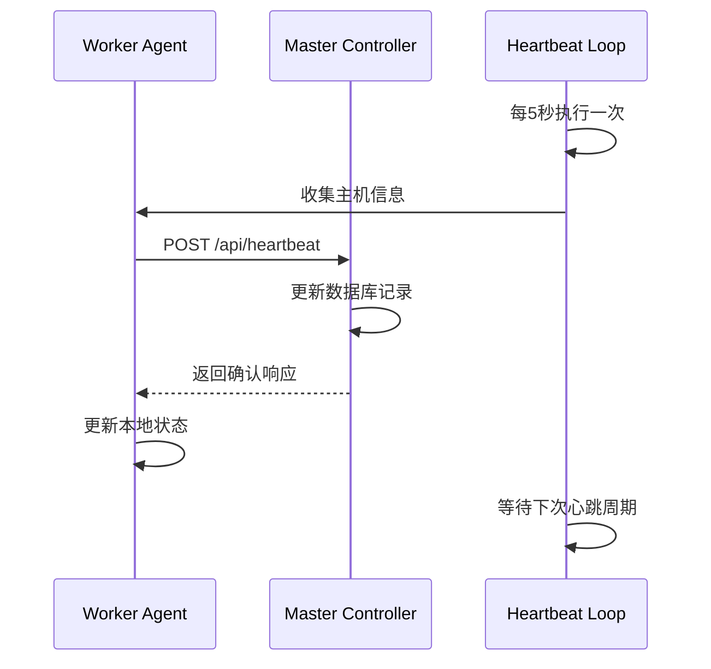

**图表来源**
- [worker.py:203-216](file://lan_mesh/worker.py#L203-L216)
- [api.py:148-168](file://lan_mesh/api.py#L148-L168)

**章节来源**
- [worker.py:62-593](file://lan_mesh/worker.py#L62-L593)

### 任务编排与调度

任务编排器负责将用户任务分解为可执行的子任务，并进行智能调度。最新版本集成了 PM Agent 的任务分析和团队管理功能，以及智能模型路由：

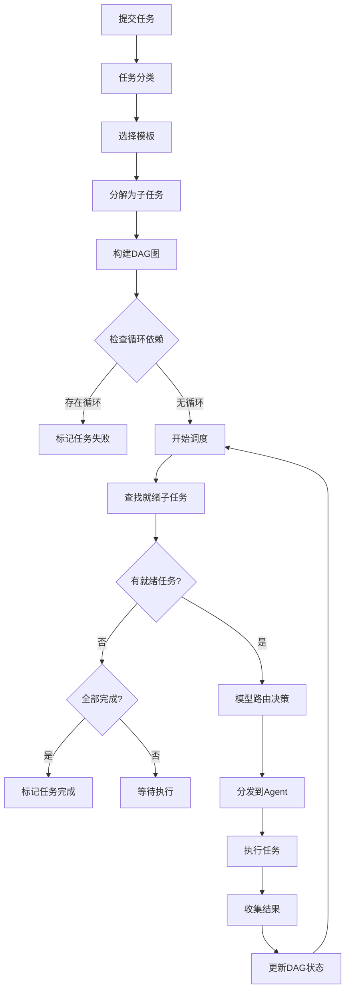

**图表来源**
- [orchestrator.py:110-156](file://lan_mesh/orchestrator.py#L110-L156)
- [orchestrator.py:173-189](file://lan_mesh/orchestrator.py#L173-L189)

#### 任务状态管理

系统实现了完整的任务状态机，确保任务执行的可靠性：

| 状态 | 描述 | 可能的转换 |
|------|------|-----------|
| pending | 待处理 | running (开始执行) |
| running | 执行中 | completed (成功), failed (失败) |
| completed | 已完成 | 无 |
| failed | 执行失败 | 无 |
| cancelled | 已取消 | 无 |

**章节来源**
- [orchestrator.py:58-301](file://lan_mesh/orchestrator.py#L58-L301)

### 数据存储与持久化

系统使用 SQLite 进行数据持久化，支持多线程安全访问：

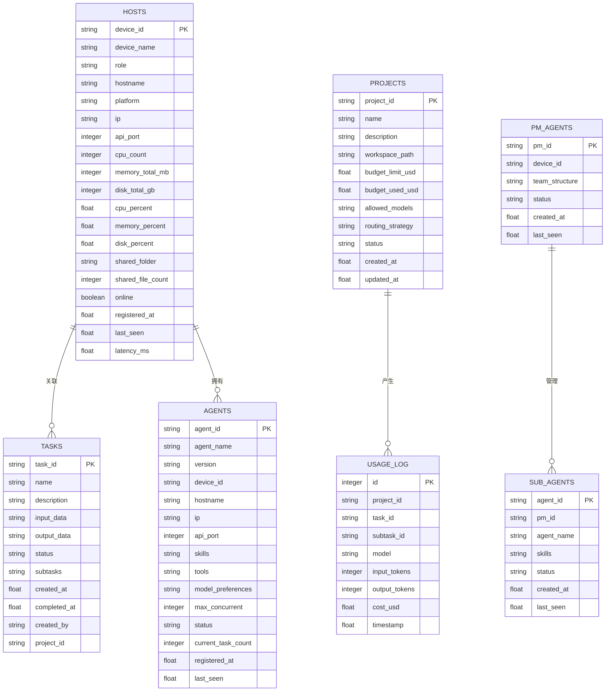

**图表来源**
- [database.py:36-143](file://lan_mesh/database.py#L36-L143)

**章节来源**
- [database.py:16-611](file://lan_mesh/database.py#L16-L611)

## 提供商配置扩展

系统现在支持多提供商模型配置，包括阿里云 Token Plan、DeepSeek、OpenAI、Anthropic 和通义千问等。每个提供商都有独立的 API Key 管理和基础 URL 配置。

### 提供商配置架构

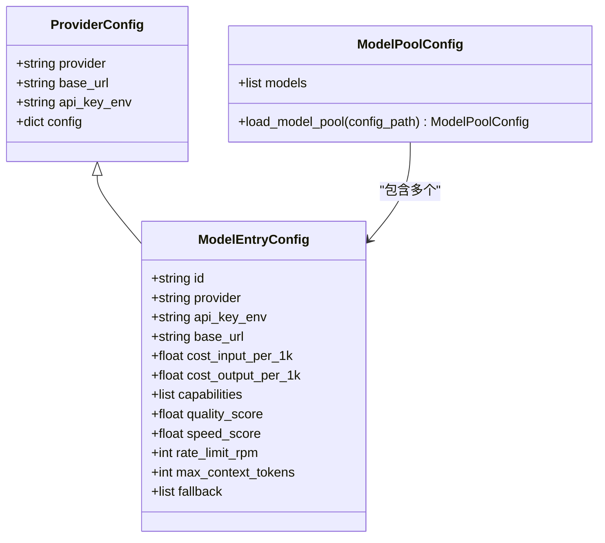

**图表来源**
- [agent_runtime.py:31-37](file://lan_mesh/agent_runtime.py#L31-L37)
- [config.py:39-58](file://lan_mesh/config.py#L39-L58)

### 支持的提供商列表

| 提供商 | 基础URL | API Key环境变量 | 默认模型 |
|--------|---------|----------------|----------|
| deepseek | https://api.deepseek.com/v1 | DEEPSEEK_API_KEY | deepseek-chat |
| openai | https://api.openai.com/v1 | OPENAI_API_KEY | gpt-4o-mini |
| anthropic | https://api.anthropic.com/v1 | ANTHROPIC_API_KEY | claude-3-haiku |
| qwen | https://dashscope.aliyuncs.com/compatible-mode/v1 | QWEN_API_KEY | qwen-turbo |
| aliyun-tokenplan | https://token-plan.cn-beijing.maas.aliyuncs.com/compatible-mode/v1 | ALIYUN_TOKENPLAN_API_KEY | 从模型池动态选择 |

### 阿里云 Token Plan 支持

阿里云 Token Plan 是一个订阅制服务，支持多品牌模型的统一 Credits 计量。该服务提供以下优势：

- **统一计费**：所有模型使用统一的 Credits 计量方式
- **多品牌支持**：支持千问、DeepSeek、Kimi、GLM、MiniMax 等多个品牌模型
- **高容量**：最大上下文窗口支持 131072 tokens
- **成本优化**：订阅制模式下按 Credits 消费，无需关注单个模型价格

**章节来源**
- [agent_runtime.py:31-37](file://lan_mesh/agent_runtime.py#L31-L37)
- [config.py:39-58](file://lan_mesh/config.py#L39-L58)
- [model_pool.example.yaml:140-331](file://lan_mesh/model_pool.example.yaml#L140-L331)

## 模型池集成

模型池系统是系统的核心组件之一，负责管理所有可用的 LLM 模型配置，并提供智能的模型选择和路由功能。

### 模型池配置结构

模型池配置文件 `model_pool.yaml` 定义了所有可用的模型及其属性：

```yaml
models:
  - id: deepseek-chat
    provider: deepseek
    api_key_env: DEEPSEEK_API_KEY
    base_url: https://api.deepseek.com/v1
    cost_input_per_1k: 0.0014
    cost_output_per_1k: 0.0028
    capabilities: [reasoning, coding]
    quality_score: 0.85
    speed_score: 0.80
    rate_limit_rpm: 200
    max_context_tokens: 65536
    fallback: [gpt-4o-mini, qwen-turbo]
```

### 模型属性详解

| 属性 | 类型 | 描述 |
|------|------|------|
| id | string | 模型唯一标识符 |
| provider | string | 提供商名称 |
| api_key_env | string | API Key 环境变量名 |
| base_url | string | API 基础 URL |
| cost_input_per_1k | float | 输入成本（美元/1K tokens） |
| cost_output_per_1k | float | 输出成本（美元/1K tokens） |
| capabilities | list | 能力标签列表 |
| quality_score | float | 质量评分（0-1） |
| speed_score | float | 速度评分（0-1） |
| rate_limit_rpm | int | 每分钟请求数限制 |
| max_context_tokens | int | 最大上下文长度 |
| fallback | list | 降级链模型列表 |

### 模型池加载机制

系统支持多种模型池配置文件的查找顺序：

1. 显式指定的配置文件路径
2. 环境变量 `LAN_MESH_MODEL_POOL` 指定的路径
3. `lan_mesh/` 包目录下的 `model_pool.yaml`
4. 当前目录下的 `model_pool.yaml`
5. 返回空配置（无模型）

**章节来源**
- [config.py:130-159](file://lan_mesh/config.py#L130-L159)
- [model_pool.example.yaml:1-331](file://lan_mesh/model_pool.example.yaml#L1-331)

## 智能调用逻辑改进

系统实现了智能的模型调用逻辑，包括难度分级、多目标优化路由算法和自动降级链重试机制。

### 难度分级系统

系统根据任务描述和技能类型自动判断任务难度等级：

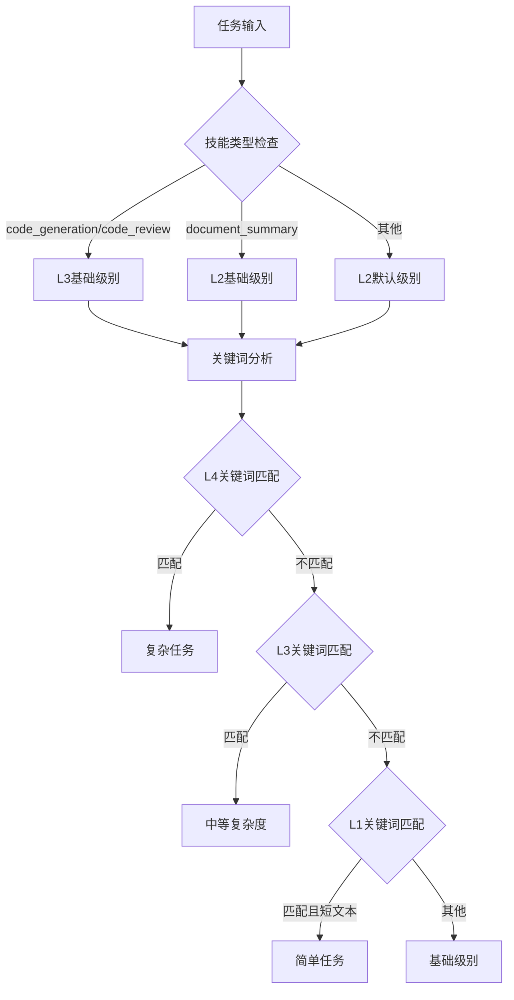

**图表来源**
- [model_router.py:60-104](file://lan_mesh/model_router.py#L60-L104)

### 多目标优化路由算法

模型路由器使用加权评分算法为每个任务选择最优模型：

```
Score = (能力匹配度 × W_cap) + (成本反向指数 × W_cost) + (响应速度 × W_speed) - (负载率 × W_load)
```

#### 评分权重配置

| 策略 | 能力匹配度 | 成本反向指数 | 响应速度 | 负载率 |
|------|------------|--------------|----------|--------|
| balanced | 0.4 | 0.3 | 0.2 | 0.1 |
| cost_first | 0.2 | 0.5 | 0.2 | 0.1 |
| quality_first | 0.6 | 0.1 | 0.2 | 0.1 |

### 降级链重试机制

当首选模型调用失败时，系统会自动沿降级链重试：

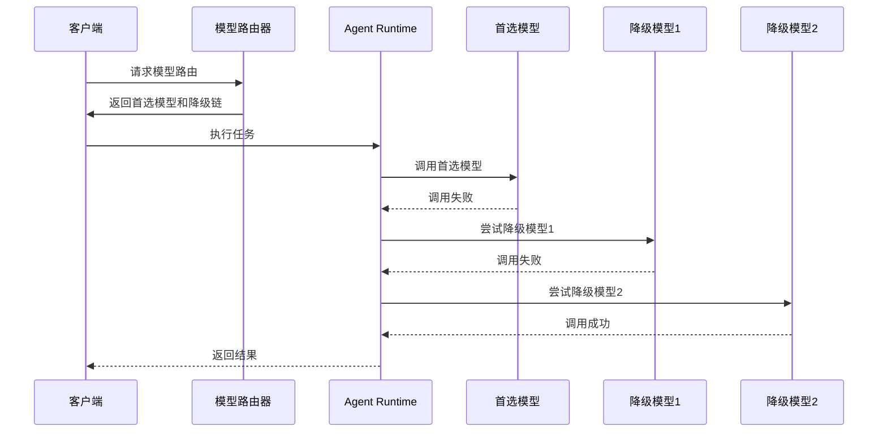

**图表来源**
- [agent_runtime.py:278-330](file://lan_mesh/agent_runtime.py#L278-L330)

### 提供商解析机制

系统实现了智能的提供商解析逻辑，支持精确匹配和前缀匹配两种模式：

1. **精确匹配**：从模型池中查找完全匹配的模型 ID
2. **前缀匹配**：兼容旧逻辑，根据模型 ID 前缀推断提供商

**章节来源**
- [model_router.py:116-327](file://lan_mesh/model_router.py#L116-L327)
- [agent_runtime.py:338-366](file://lan_mesh/agent_runtime.py#L338-L366)

## PM Agent 管理

PM Agent (项目经理 Agent) 是 LAN Mesh 中的智能管理型 Agent，负责任务分析、团队架构决策和进度协调。它作为 Worker 进程内的嵌入模块运行，具有以下核心功能：

### PM Agent 架构设计

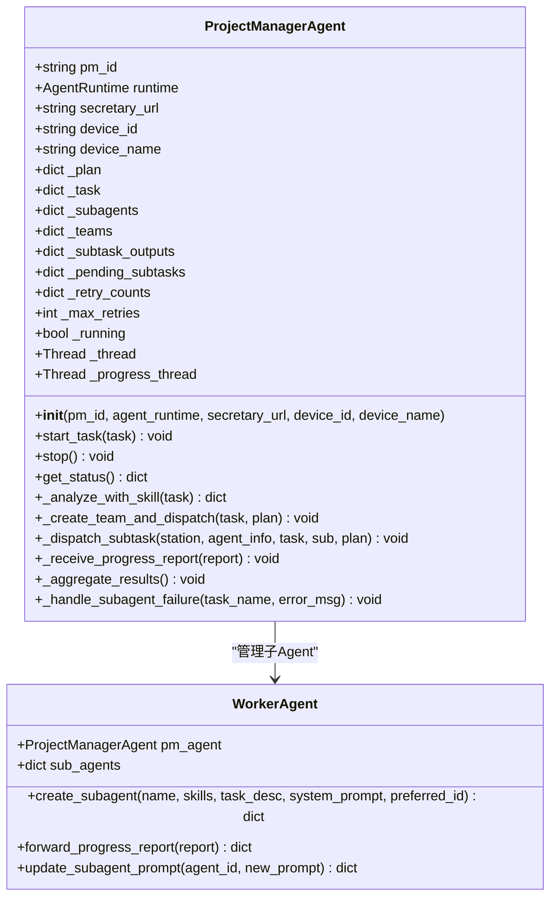

**图表来源**
- [pm_agent.py:30-893](file://lan_mesh/pm_agent.py#L30-L893)
- [worker.py:320-478](file://lan_mesh/worker.py#L320-L478)

### PM Agent 工作流程

PM Agent 的工作流程体现了智能任务管理和团队协作的特点：

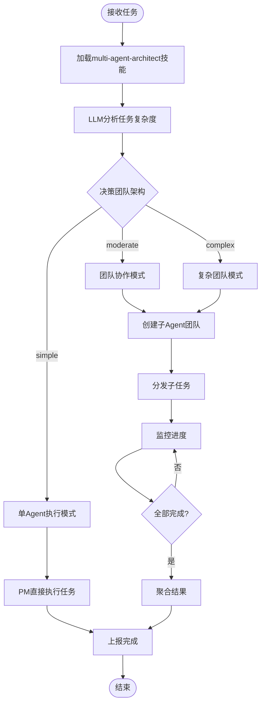

**图表来源**
- [pm_agent.py:103-134](file://lan_mesh/pm_agent.py#L103-L134)
- [pm_agent.py:224-246](file://lan_mesh/pm_agent.py#L224-246)

### 子 Agent 管理机制

PM Agent 通过 Worker 的子 Agent 管理接口创建和控制子 Agent：

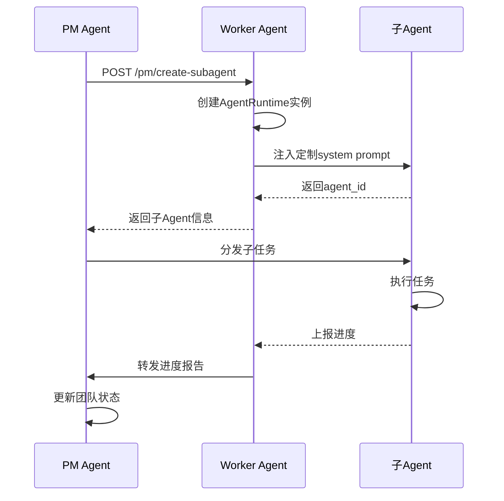

**图表来源**
- [worker.py:389-426](file://lan_mesh/worker.py#L389-L426)
- [pm_agent.py:448-483](file://lan_mesh/pm_agent.py#L448-L483)

**章节来源**
- [pm_agent.py:1-893](file://lan_mesh/pm_agent.py#L1-L893)
- [worker.py:320-478](file://lan_mesh/worker.py#L320-L478)

## 子 Agent 系统

子 Agent 系统是 PM Agent 的重要组成部分，实现了 Worker 内嵌的 Agent 管理功能。每个子 Agent 都是一个独立的 AgentRuntime 实例，具有自己的 system prompt 和执行能力。

### 子 Agent 创建流程

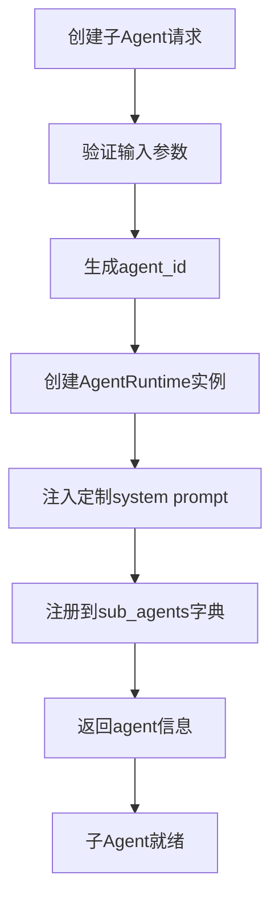

**图表来源**
- [worker.py:389-426](file://lan_mesh/worker.py#L389-L426)

### 子 Agent 状态管理

系统为每个子 Agent 维护详细的状态信息：

| 字段 | 类型 | 描述 |
|------|------|------|
| agent_id | string | 子 Agent 唯一标识符 |
| agent_name | string | 子 Agent 名称 |
| runtime | AgentRuntime | 子 Agent 的运行时实例 |
| skills | list | 子 Agent 拥有的技能列表 |
| current_task | string | 当前执行的任务描述 |
| status | string | 当前状态 (idle/busy/completed/failed) |
| progress | float | 执行进度 (0.0-1.0) |
| has_custom_prompt | bool | 是否使用定制prompt |

**章节来源**
- [worker.py:414-426](file://lan_mesh/worker.py#L414-L426)

## 依赖关系分析

系统采用松耦合的设计，通过清晰的接口定义实现模块间的交互。最新版本增加了 PM Agent、子 Agent 系统和智能模型路由的依赖关系：

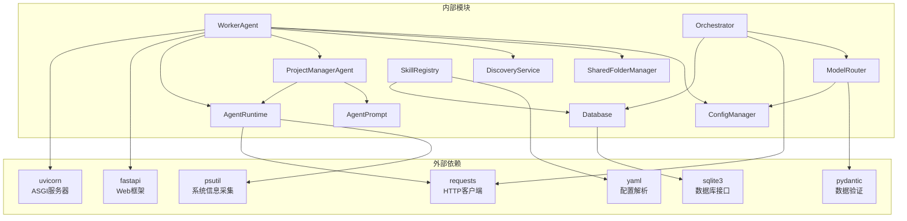

**图表来源**
- [agent_runtime.py:20-27](file://lan_mesh/agent_runtime.py#L20-L27)
- [worker.py:24-44](file://lan_mesh/worker.py#L24-L44)
- [pm_agent.py:25-27](file://lan_mesh/pm_agent.py#L25-L27)
- [model_router.py:17-20](file://lan_mesh/model_router.py#L17-20)
- [config.py:6-11](file://lan_mesh/config.py#L6-11)
- [skill_registry.py:32-37](file://lan_mesh/skill_registry.py#L32-37)

### 错误处理与异常管理

系统实现了多层次的错误处理机制，包括 PM Agent 的失败接管策略和智能模型降级：

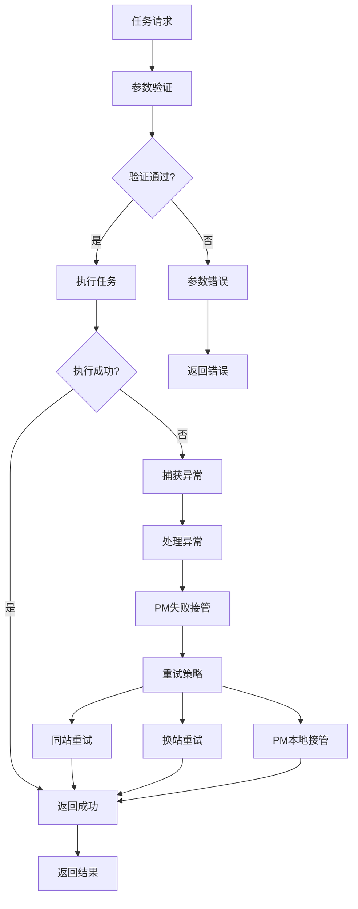

**图表来源**
- [agent_runtime.py:66-74](file://lan_mesh/agent_runtime.py#L66-L74)
- [pm_agent.py:737-778](file://lan_mesh/pm_agent.py#L737-L778)

**章节来源**
- [agent_runtime.py:1-456](file://lan_mesh/agent_runtime.py#L1-L456)
- [pm_agent.py:1-893](file://lan_mesh/pm_agent.py#L1-L893)

## 性能考虑

### 并发控制策略

系统通过多种机制实现高效的并发控制：

1. **线程池管理**：使用 Python 标准库的线程池管理并发任务
2. **资源限制**：通过 `max_concurrent_tasks` 参数限制单个 Agent 的并发数量
3. **心跳监控**：定期检查 Agent 的资源使用情况，避免过载
4. **超时控制**：为长时间运行的任务设置超时机制
5. **选择性技能加载**：优化技能缓存的加载策略，减少不必要的 I/O 操作
6. **模型池缓存**：惰性加载模型池配置，避免重复 I/O 操作

### 性能优化建议

1. **LLM API 优化**
   - 利用智能模型路由选择最优模型
   - 合理设置请求超时时间（默认 120 秒）
   - 实现降级链重试机制处理临时性网络错误
   - 优先使用阿里云 Token Plan 进行成本控制

2. **文件操作优化**
   - 使用流式处理大文件
   - 实现文件缓存减少重复读取
   - 优化文件上传下载的并发度

3. **网络通信优化**
   - 使用连接池复用 HTTP 连接
   - 实现请求去重避免重复执行
   - 优化心跳频率平衡实时性与资源消耗

4. **内存管理**
   - 及时释放不再使用的资源
   - 实现内存使用监控
   - 优化大数据结构的存储方式

5. **PM Agent 优化**
   - 利用依赖感知的结果传递减少重复计算
   - 实现失败接管策略提高任务成功率
   - 优化子 Agent 的动态 prompt 更新机制

6. **模型路由优化**
   - 预计算成本归一化基准提升路由性能
   - 实现候选模型过滤减少计算开销
   - 支持策略自适应调整路由权重

**章节来源**
- [agent_runtime.py:217-265](file://lan_mesh/agent_runtime.py#L217-L265)
- [pm_agent.py:570-592](file://lan_mesh/pm_agent.py#L570-L592)
- [model_router.py:135-141](file://lan_mesh/model_router.py#L135-L141)

## 故障排除指南

### 常见问题诊断

1. **Agent 无法注册到 Master**
   - 检查网络连通性
   - 验证端口配置正确性
   - 确认防火墙设置允许通信

2. **任务执行失败**
   - 检查技能处理器是否正确配置
   - 验证 LLM API 密钥设置
   - 查看系统资源使用情况
   - 检查 PM Agent 的团队架构决策

3. **模型路由问题**
   - 检查模型池配置文件格式
   - 验证各提供商 API Key 环境变量
   - 查看降级链配置是否合理
   - 检查模型能力标签是否匹配任务需求

4. **阿里云 Token Plan 问题**
   - 确认使用正确的 Token Plan API Key
   - 验证 base_url 配置正确性
   - 检查订阅状态和 Credits 余额
   - 确认模型 ID 在 Token Plan 支持列表中

5. **PM Agent 相关问题**
   - 验证 multi-agent-architect 技能是否正确加载
   - 检查子 Agent 的 system prompt 是否正确注入
   - 确认子 Agent 的任务分发是否正常
   - 查看失败接管策略的执行情况

6. **性能问题**
   - 监控 CPU 和内存使用率
   - 检查磁盘 I/O 性能
   - 分析网络延迟情况
   - 评估 PM Agent 的负载情况
   - 检查模型路由决策效率

### 日志分析

系统提供了丰富的日志信息，有助于问题诊断：

- **启动日志**：显示系统初始化过程和配置信息
- **心跳日志**：记录与 Master 的通信状态
- **任务日志**：跟踪任务执行过程和结果
- **PM Agent 日志**：记录团队架构决策和子任务管理
- **模型路由日志**：记录模型选择决策和降级链触发
- **错误日志**：记录异常情况和错误堆栈

**章节来源**
- [worker.py:126-171](file://lan_mesh/worker.py#L126-L171)
- [pm_agent.py:127-130](file://lan_mesh/pm_agent.py#L127-L130)
- [model_router.py:186-189](file://lan_mesh/model_router.py#L186-L189)

## 结论

Agent 运行时管理系统为分布式 AI 任务提供了可靠、高效的执行环境。通过模块化的设计和完善的错误处理机制，系统能够稳定地处理各种复杂的任务场景。

**重大更新亮点**：

1. **多提供商模型池集成**：支持阿里云 Token Plan、DeepSeek、OpenAI、Anthropic 和通义千问等多个提供商
2. **智能模型路由**：基于难度分级和多目标优化算法的智能模型选择
3. **自动降级链重试**：当首选模型失败时自动沿降级链重试
4. **PM Agent 支持**：实现了智能的任务分析、团队架构决策和进度协调功能
5. **自定义系统提示**：支持 PM 注入的定制 prompt，提高了任务执行的针对性
6. **选择性技能加载**：优化了技能缓存的加载策略，提升了系统性能
7. **子 Agent 管理**：实现了 Worker 内嵌的 Agent 管理机制
8. **动态 prompt 更新**：支持运行时动态更新子 Agent 的 system prompt

**系统的主要优势包括**：
- **灵活的任务处理**：支持多种技能类型的动态路由
- **智能的团队管理**：PM Agent 实现了自动化的任务分解和团队协作
- **可靠的并发控制**：通过状态管理和资源限制确保系统稳定性
- **完整的生命周期管理**：从启动到停止的全流程自动化
- **强大的扩展性**：模块化设计便于功能扩展和维护
- **智能的成本优化**：通过模型路由算法实现最优成本和性能平衡

**未来可以考虑的改进方向**：
- 实现更智能的任务调度算法
- 增加任务执行的可视化监控
- 优化大规模集群的性能表现
- 增强系统的容错能力和高可用性
- 扩展 PM Agent 的决策能力，支持更复杂的任务场景
- 实现更细粒度的模型路由策略
- 增加模型性能实时监控和自适应调整
- 支持更多第三方模型提供商的集成